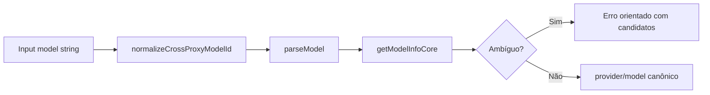

# 1. Título da Feature

Feature 01 — Modelo Compatibilidade Cross-Proxy

## 2. Objetivo

Padronizar a resolução de IDs de modelo vindos de diferentes ecossistemas de proxy/router para um identificador canônico interno do `9router`, reduzindo falhas de roteamento por variação de nomenclatura.

## 3. Motivação

Hoje o `9router` já resolve aliases e ambiguidade em `open-sse/services/model.js`, porém ainda há variações externas que chegam em formatos alternativos (ex.: `gpt-oss:120b`, `deepseek-v3.2`, `qwen3-coder:480b`). Essas variantes aumentam erros 400 por modelo inválido e criam fricção de onboarding quando usuários migram de outros proxies.

## 4. Problema Atual (Antes)

- Resolução de modelo depende majoritariamente de IDs já mapeados no registry local.
- Inputs cross-proxy nem sempre convergem para IDs suportados no `open-sse/config/providerRegistry.js`.
- Ambiguidade em casos multi-provider retorna erro corretamente, mas sem camada de normalização prévia de dialetos externos.

### Antes vs Depois

| Dimensão                           | Antes                 | Depois                                         |
| ---------------------------------- | --------------------- | ---------------------------------------------- |
| Entrada de IDs externos            | Tratada parcialmente  | Normalização sistemática por mapa canônico     |
| Erro por nomenclatura              | Frequente em migração | Redução relevante de 400 por `model_not_found` |
| Compatibilidade entre ecossistemas | Pontual               | Política formal com governança de aliases      |
| Telemetria de normalização         | Inexistente           | Evento dedicado de alias aplicado              |

## 5. Estado Futuro (Depois)

Adicionar uma etapa explícita de normalização no pipeline de `parseModel()` e `getModelInfoCore()` para converter aliases externos em IDs internos canônicos antes da resolução de provider.

## 6. O que Ganhamos

- Melhor compatibilidade com clientes e configurações legadas de outros proxies.
- Menos tickets de suporte por “modelo existe mas não resolve”.
- Base para evolução futura de catálogo dinâmico por provedor.

## 7. Escopo

- Camada de normalização em `open-sse/services/model.js`.
- Tabela de mapeamento “alias externo -> ID canônico”.
- Logging/telemetria de aplicação de alias.
- Testes unitários de parsing, resolução e ambiguidade.

## 8. Fora de Escopo

- Alterar contratos públicos de `/v1/chat/completions`.
- Sincronização online de aliases em tempo real.
- Substituir a lógica de ambiguidade atual.

## 9. Arquitetura Proposta



## 10. Mudanças Técnicas Detalhadas

Arquivos de referência:

- `open-sse/services/model.js`
- `open-sse/config/providerRegistry.js`
- `src/app/api/v1/models/route.js`
- `src/app/api/providers/[id]/models/route.js`
- `src/sse/handlers/chat.js`

Estratégia de mapeamento inicial (exemplo):

- `gpt-oss:120b -> openai/gpt-oss-120b`
- `gpt-oss:20b -> gpt-oss-20b` (ou equivalente suportado)
- `deepseek-v3.2 -> deepseek-v3.2-chat`
- `qwen3-coder:480b -> Qwen/Qwen3-Coder-480B-A35B-Instruct`
- `anthropic/claude-opus-4.5 -> claude-opus-4-5-20251101`

Snippet proposto:

```js
const CROSS_PROXY_MODEL_ALIASES = {
  "gpt-oss:120b": "openai/gpt-oss-120b",
  "deepseek-v3.2": "deepseek-v3.2-chat",
  "qwen3-coder:480b": "Qwen/Qwen3-Coder-480B-A35B-Instruct",
};

function normalizeCrossProxyModelId(modelStr) {
  return CROSS_PROXY_MODEL_ALIASES[modelStr] || modelStr;
}
```

## 11. Impacto em APIs Públicas / Interfaces / Tipos

- APIs novas: nenhuma obrigatória.
- APIs alteradas: nenhuma mudança de schema de request/response.
- Tipos/interfaces: impacto interno no contrato de resolução de modelo.
- Compatibilidade: **non-breaking**.
- Estratégia de transição: rollout gradual por feature flag e fallback para comportamento anterior quando aplicável.
- Registro explícito: “Sem impacto em API pública; impacto interno apenas.”

## 12. Passo a Passo de Implementação Futura

1. Criar mapa `CROSS_PROXY_MODEL_ALIASES` em `open-sse/services/model.js`.
2. Aplicar normalização antes de `parseModel()`.
3. Aplicar normalização no caminho de alias `resolveModelAliasFromMap`.
4. Preservar comportamento de ambiguidade já existente.
5. Adicionar logging de alias aplicado (nível `debug`).
6. Cobrir casos de regressão em testes automatizados.

## 13. Plano de Testes

Cenários positivos:

1. Dado `gpt-oss:120b`, quando resolver modelo, então retorna provider/model canônico suportado.
2. Dado `deepseek-v3.2`, quando resolver, então mapeia para ID interno e executa sem erro de parsing.
3. Dado alias local válido + alias cross-proxy, quando ambos convergem, então usa o canônico único.

Cenários de erro:

4. Dado alias externo sem mapeamento e sem suporte interno, quando resolver, então retorna erro 400 com mensagem clara.
5. Dado alias externo malformado (`../foo`), quando resolver, então bloqueia por sanitização.

Regressão:

6. Dado modelo já canônico do registry, quando resolver, então comportamento permanece idêntico ao atual.

Compatibilidade retroativa:

7. Dado cliente antigo que envia IDs atuais, quando normalização estiver ativa, então não muda provider/model final.

## 14. Critérios de Aceite

- [ ] Given alias cross-proxy conhecido, When request entra, Then modelo é normalizado para ID canônico.
- [ ] Given alias desconhecido, When request entra, Then erro mantém semântica atual de resolução.
- [ ] Given modelo canônico atual, When request entra, Then nenhuma alteração funcional ocorre.
- [ ] Given suíte de testes da resolução de modelos, When os cenários de parsing/ambiguidade/sanitização executam, Then todos passam sem regressão.

## 15. Riscos e Mitigações

- Risco: colisão entre alias externo e alias interno.
- Mitigação: precedência explícita + teste de ambiguidade.

- Risco: mapeamento ficar desatualizado.
- Mitigação: rotina de revisão por release e telemetria de aliases não reconhecidos.

## 16. Plano de Rollout

1. Ativar behind flag (`MODEL_ALIAS_COMPAT_ENABLED`).
2. Coletar métricas de normalização por 1 sprint.
3. Tornar padrão após estabilidade.

## 17. Métricas de Sucesso

- Redução de erros 400 por modelo inválido.
- Percentual de requests normalizadas com sucesso.
- Queda de suporte relacionado a nomenclatura de modelos.

## 18. Dependências entre Features

- Base para `feature-registro-de-capacidades-de-modelo-08.md`.
- Complementa `feature-migracao-automatica-de-aliases-de-modelo-11.md`.

## 19. Checklist Final da Feature

- [ ] Mapa de aliases definido e versionado.
- [ ] Normalização aplicada no ponto de entrada.
- [ ] Mensagens de erro preservadas para ambiguidade.
- [ ] Testes cobrindo positivo/erro/regressão/compatibilidade.
- [ ] Sem breaking change de API pública.
