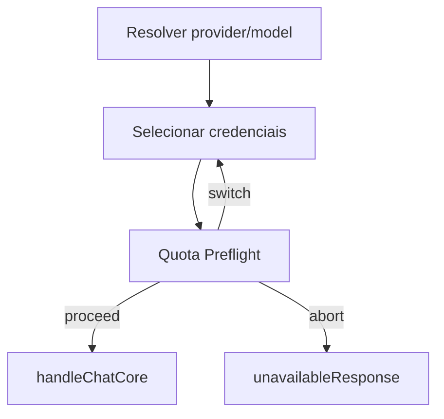

# 1. Título da Feature

Feature 02 — Quota Preflight e Troca Proativa de Conta

## 2. Objetivo

Evitar tentativas de request em contas já sem quota, realizando validação preflight e troca automática de conta antes de chamar upstream.

## 3. Motivação

O fluxo atual em `src/sse/handlers/chat.js` é forte em fallback reativo, mas ainda depende de erro upstream para trocar conta. Isso aumenta latência e consumo de tentativas em janelas de exaustão previsíveis.

## 4. Problema Atual (Antes)

- Troca de conta normalmente ocorre após erro HTTP (429/403/5xx).
- Sem avaliação preflight de quota por provider/account antes de `handleChatCore`.
- Mais retries e pior tempo total de resposta em cenários de quota baixa.

### Antes vs Depois

| Dimensão               | Antes                 | Depois                              |
| ---------------------- | --------------------- | ----------------------------------- |
| Seleção de conta       | Reativa após falha    | Proativa por preflight              |
| Latência em exaustão   | Alta                  | Menor por evitar tentativa inviável |
| Ruído de erro upstream | Maior                 | Menor                               |
| Política de threshold  | Implícita no fallback | Explícita e configurável            |

## 5. Estado Futuro (Depois)

Adicionar etapa `preflightQuota(provider, connectionId)` no loop de `handleSingleModelChat` para decidir `proceed/switch/abort` antes de enviar request.

## 6. O que Ganhamos

- Menor desperdício de chamadas upstream.
- Melhor UX sob limites apertados de quota.
- Melhor previsibilidade operacional por regra explícita.

## 7. Escopo

- Novo serviço: `open-sse/services/quotaPreflight.js`.
- Integração em `src/sse/handlers/chat.js`.
- Uso de dados já disponíveis de `open-sse/services/usage.js`.
- Reuso de fallback existente em `open-sse/services/accountFallback.js`.

## 8. Fora de Escopo

- Substituir a lógica atual de fallback reativo.
- Implementar persistência de longo prazo de quota histórica.
- Mudar contratos HTTP de `/v1/*`.

## 9. Arquitetura Proposta



## 10. Mudanças Técnicas Detalhadas

Arquivos de referência:

- `src/sse/handlers/chat.js`
- `open-sse/services/usage.js`
- `open-sse/services/accountFallback.js`
- `src/sse/services/auth.js`
- `src/lib/db/providers.js`

Pseudo-código:

```js
const gate = await preflightQuota(provider, credentials.connectionId);
if (!gate.proceed) {
  await markAccountUnavailable(credentials.connectionId, 429, gate.reason, provider);
  excludeConnectionId = credentials.connectionId;
  continue;
}
```

Política inicial proposta:

- `exhaustionThreshold`: 5%
- `warnThreshold`: 20%
- `cooldownMinutes`: 5
- fallback para comportamento atual quando quota indisponível.

## 11. Impacto em APIs Públicas / Interfaces / Tipos

- APIs novas: nenhuma obrigatória.
- APIs alteradas: nenhuma.
- Tipos/interfaces: novos tipos internos (`PreflightQuotaResult`).
- Compatibilidade: **non-breaking**.
- Estratégia de transição: rollout gradual por feature flag e fallback para comportamento anterior quando aplicável.
- Registro explícito: “Sem impacto em API pública; impacto interno apenas.”

## 12. Passo a Passo de Implementação Futura

1. Criar `preflightQuota` com resultado tipado (`proceed`, `reason`, `switchSuggested`).
2. Integrar no loop de credenciais em `handleSingleModelChat`.
3. Definir fallback para providers sem API de quota.
4. Logar decisões de preflight (`debug/info`).
5. Incluir configuração no settings (`/api/settings`).
6. Cobrir cenários de conta única e múltiplas contas.

## 13. Plano de Testes

Cenários positivos:

1. Dado conta com quota > threshold, quando preflight roda, então request segue para upstream.
2. Dado conta default sem quota e conta alternativa saudável, quando preflight roda, então troca conta antes de enviar.
3. Dado provider sem endpoint de quota, quando preflight roda, então fallback para fluxo atual.

Cenários de erro:

4. Dado falha no fetch de quota, quando preflight roda, então não bloqueia request sem motivo explícito.
5. Dado todas as contas abaixo do threshold, quando preflight roda, então retorna indisponibilidade previsível.

Regressão:

6. Dado fluxo atual de fallback por erro 429, quando preflight está ativo, então fallback reativo continua funcional.

Compatibilidade retroativa:

7. Dado instalação sem configuração de preflight, quando feature habilitada por default seguro, então comportamento não quebra ambientes atuais.

## 14. Critérios de Aceite

- [ ] Given quota válida, When preflight executa, Then request não sofre atraso indevido.
- [ ] Given quota exaurida com alternativa, When preflight executa, Then troca de conta ocorre antes do upstream.
- [ ] Given erro no mecanismo de quota, When preflight executa, Then sistema degrada graciosamente.
- [ ] Given suíte de testes do pipeline de chat, When cenários de fluxo normal/degradação/retrocompatibilidade executam, Then todos passam sem regressão funcional.

## 15. Riscos e Mitigações

- Risco: overhead de latência por checagem extra.
- Mitigação: cache TTL curto e deduplicação de requests de quota.

- Risco: decisões erradas por dado stale.
- Mitigação: fallback conservador para comportamento atual.

## 16. Plano de Rollout

1. Flag `QUOTA_PREFLIGHT_ENABLED=false` inicialmente.
2. Habilitar em staging e medir `latency` e `fallbackRate`.
3. Ativar gradual em produção.

## 17. Métricas de Sucesso

- Redução de requests que falham por quota logo na primeira tentativa.
- Redução de latência média em cenários de exaustão.
- Aumento da taxa de sucesso na primeira conta selecionada.

## 18. Dependências entre Features

- Depende de observabilidade da `feature-observabilidade-proativa-de-quota-e-circuit-breaker-12.md` para diagnóstico fino.
- Complementa `feature-monitoramento-quota-em-sessao-03.md`.

## 19. Checklist Final da Feature

- [ ] Serviço preflight criado e integrado ao loop principal.
- [ ] Threshold/cooldown configuráveis.
- [ ] Degradação graciosa para providers sem quota API.
- [ ] Testes completos (positivo/erro/regressão/compatibilidade).
- [ ] Sem breaking change público.
