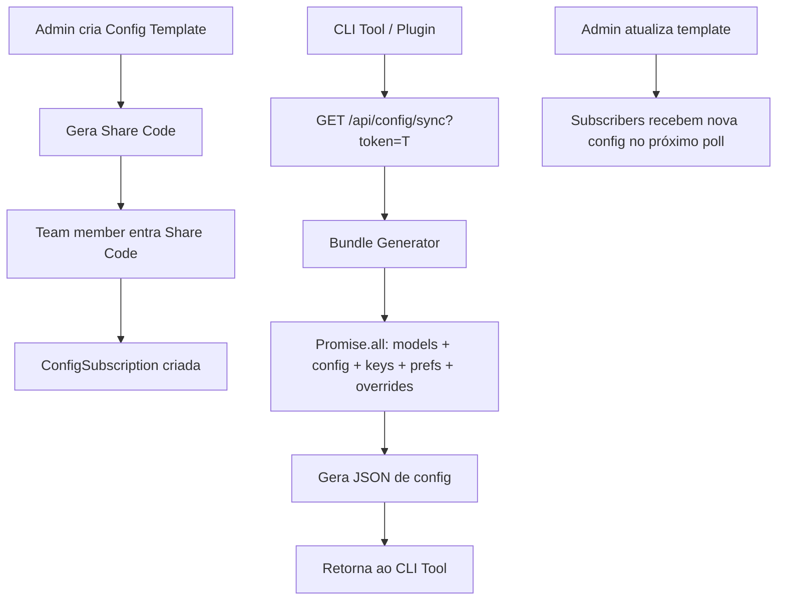

# 1. Título da Feature

Feature 87 — Config Sync Tokenizado para CLI Tools com Share Codes

## 2. Objetivo

Implementar um sistema de sincronização de configuração automatizada onde o dashboard gera arquivos de config (`opencode.json`, etc.) dinamicamente, distribui via share codes para equipes, e CLI tools sincronizam automaticamente via plugin/token.

## 3. Motivação

O `cliproxyapi-dashboard` implementa um sistema completo de config sync com 3 componentes:

1. **Config Templates** (`ConfigTemplate` model): publishers criam configurações com seleção de modelos e preferências, distribuem via `shareCode` alfanumérico único.
2. **Config Subscriptions** (`ConfigSubscription` model): subscribers se inscrevem via share code e recebem atualizações automáticas.
3. **Bundle Generation**: endpoint gera `opencode.json` / `oh-my-opencode.json` dinamicamente, incluindo modelos detectados via OAuth, preferências do usuário, overrides por agente, e modelos de custom providers.

A geração de bundles é altamente parallelizada — 7 operações executam em `Promise.all`:

- 3 chamadas ao management API (proxyModels, managementConfig, managementKeys)
- 4 queries Prisma (userPreference, userOverrides, providerKeys, providerOAuth)

No OmniRoute, cada CLI tool (Codex, Claude, Antigravity) requer configuração manual separada. Mudanças de modelo, endpoint ou credencial exigem atualização individual em cada máquina de cada membro da equipe.

## 4. Problema Atual (Antes)

- Configuração de CLI tools é totalmente manual.
- Cada membro da equipe configura seus tools individualmente.
- Mudanças de modelo ou endpoint requerem comunicação manual.
- Sem sincronização entre dashboard e configuração dos CLI tools.
- Sem mecanismo de compartilhamento de configurações padrão.

### Antes vs Depois

| Dimensão                  | Antes                        | Depois                                       |
| ------------------------- | ---------------------------- | -------------------------------------------- |
| Configuração de CLI tools | Manual por tool/por pessoa   | Auto-sync via token do dashboard             |
| Propagação de mudanças    | Comunicação manual (Slack)   | Automática via share code ou sync token      |
| Onboarding de membro      | 30+ minutos de setup manual  | 1 share code → config pronta                 |
| Modelos disponíveis       | Lista estática manual        | Detecção automática de OAuth + custom models |
| Consistência da equipe    | Cada um com config diferente | Config unificada via subscription            |

## 5. Estado Futuro (Depois)

### Fluxo de Publisher/Subscriber

```
Publisher (admin) → Cria template no dashboard → Gera share code "ABCD1234"
     ↓
Team member → Insere share code → Subscribed → Config auto-sincronizada
     ↓
Publisher atualiza modelo → Subscriber recebe config nova automaticamente
```

### API de Sync

```
GET /api/config/sync?token=<sync_token>
→ Retorna JSON com configuração completa e atualizada

GET /api/config/bundle?format=opencode
→ Retorna opencode.json completo para download/sync
```

## 6. O que Ganhamos

- Onboarding de novos membros em < 1 minuto.
- Config única e consistente para toda a equipe.
- Propagação instantânea de mudanças de modelo/endpoint.
- Detecção automática de providers OAuth conectados.
- Seleção granular de modelos (enable/disable por usuário).
- Overrides por agente (ex: Claude Code usa modelo X, Codex usa modelo Y).

## 7. Escopo

- Novo modelo de dados: `ConfigTemplate`, `ConfigSubscription`, `SyncToken`.
- Novos endpoints: `/api/config/templates` (CRUD), `/api/config/subscribe`, `/api/config/sync`.
- Bundle generator: gera JSON de config baseado em modelos ativos + preferências.
- UI de dashboard: criação de templates, managing subscriptions, geração de share codes.
- Plugin/integration pattern para auto-sync (polling periódico).

## 8. Fora de Escopo

- Plugin específico para cada CLI tool (cada tool tem seu formato — apenas o endpoint é nosso).
- Push-based sync (apenas pull via polling).
- Versionamento de config (apenas latest).

## 9. Arquitetura Proposta



## 10. Mudanças Técnicas Detalhadas

### Schema de dados

```js
// ConfigTemplate
{
  id: 'uuid',
  userId: 'fk -> User',
  name: 'string',
  shareCode: 'string unique(8)',
  config: 'json',   // { enabledModels: [], overrides: {}, settings: {} }
  createdAt: 'datetime',
  updatedAt: 'datetime',
}

// ConfigSubscription
{
  id: 'uuid',
  userId: 'fk -> User',
  templateId: 'fk -> ConfigTemplate',
  subscribedAt: 'datetime',
}

// SyncToken
{
  id: 'uuid',
  userId: 'fk -> User',
  token: 'string unique(64)',
  name: 'string',        // "MacBook Pro", "PC Office"
  lastUsedAt: 'datetime',
  createdAt: 'datetime',
}
```

### Bundle Generator (referência: `dashboard/src/app/api/config/sync/route.ts`)

```js
async function generateConfigBundle(userId, format) {
  const [
    availableModels, // modelos do proxy
    providerKeys, // chaves API contribuídas
    oauthProviders, // OAuth providers conectados
    userPreference, // modelos habilitados/desabilitados
    agentOverrides, // overrides por agente (Claude/Codex/etc)
    customProviders, // providers customizados do usuário
    subscriptions, // templates que o usuário assina
  ] = await Promise.all([
    fetchAvailableModels(),
    db.getProviderKeys(userId),
    db.getOAuthProviders(userId),
    db.getModelPreference(userId),
    db.getAgentOverrides(userId),
    db.getCustomProviders(userId),
    db.getSubscriptions(userId),
  ]);

  // Merge modelos do proxy + OAuth + custom providers
  const allModels = mergeModelSources(availableModels, oauthProviders, customProviders);

  // Filtrar por preferências do usuário
  const enabledModels = filterByPreference(allModels, userPreference);

  // Aplicar overrides por agente
  const finalConfig = applyAgentOverrides(enabledModels, agentOverrides);

  // Serializar para formato solicitado
  return serializeConfig(finalConfig, format);
}
```

Referência original: `dashboard/src/app/api/config/sync/route.ts` — bundle generation com 7 queries paralelas

## 11. Impacto em APIs Públicas / Interfaces / Tipos

- APIs novas: 4 endpoints novos (templates CRUD, subscribe, sync, bundle download).
- Compatibilidade: **non-breaking** — endpoints completamente novos.

## 12. Passo a Passo de Implementação Futura

1. Criar modelos de dados: `ConfigTemplate`, `ConfigSubscription`, `SyncToken`.
2. Migrar DB com novos modelos.
3. Criar CRUD de templates (`/api/config/templates`).
4. Implementar share codes com geração alfanumérica única.
5. Criar endpoint de subscription (`/api/config/subscribe`).
6. Implementar bundle generator com `Promise.all` para queries paralelas.
7. Criar endpoint de sync (`/api/config/sync?token=T`).
8. Criar UI de dashboard para gerenciamento de templates e subscriptions.
9. Documentar formato de config gerado para cada CLI tool.

## 13. Plano de Testes

Cenários positivos:

1. Dado admin cria template, quando share code gerado, então código é único e alfanumérico de 8 chars.
2. Dado user insere share code válido, quando subscription criada, então `/api/config/sync` retorna config do template.
3. Dado admin atualiza template, quando subscriber faz sync, então recebe config atualizada.

Cenários de erro: 4. Dado share code inválido, quando subscription tentada, então retorna 404. 5. Dado sync token expirado/inválido, quando sync tentado, então retorna 401.

## 14. Critérios de Aceite

- [ ] Templates criáveis com share code via dashboard.
- [ ] Subscription via share code funcional.
- [ ] Sync endpoint retorna config atualizada.
- [ ] Bundle generator parallelized com `Promise.all`.
- [ ] Formato de output compatível com pelo menos 1 CLI tool.
- [ ] UI de gerenciamento no dashboard.

## 15. Riscos e Mitigações

- Risco: formatos de config de CLI tools mudam sem aviso.
- Mitigação: serializer por formato isolado, fácil de adaptar.

- Risco: sync token leakado permite acesso a config.
- Mitigação: tokens com scoped access (read-only config, sem credenciais).

## 16. Plano de Rollout

1. Implementar backend (modelos + endpoints) sem UI.
2. Criar primeiro serializer (formato mais usado pela equipe).
3. Implementar UI de gerenciamento.
4. Testar com equipe em staging.
5. Publicar documentação de integração.

## 17. Métricas de Sucesso

- Tempo de onboarding de novo membro reduzido de 30min para < 2min.
- 100% da equipe usando config sincronizada.
- Propagação de mudanças em < 1 minuto (intervalo de poll).

## 18. Dependências entre Features

- Complementa `feature-46-config-sync-tokenizado-e-versionado.md` — mesma ideia, perspectiva diferente.
- Depende de: modelo de dados de User já existente.
- Depende de: lista de modelos disponíveis (feature-84 cache ajuda na performance).

## 19. Checklist Final da Feature

- [ ] Modelos ConfigTemplate, ConfigSubscription, SyncToken criados.
- [ ] Share codes únicos e alfanuméricos.
- [ ] CRUD de templates funcional.
- [ ] Subscription via share code.
- [ ] Bundle generator parallelized.
- [ ] Sync endpoint com autenticação via token.
- [ ] Pelo menos 1 formato de output (opencode.json ou similar).
- [ ] UI de gerenciamento no dashboard.
- [ ] Documentação de integração.
