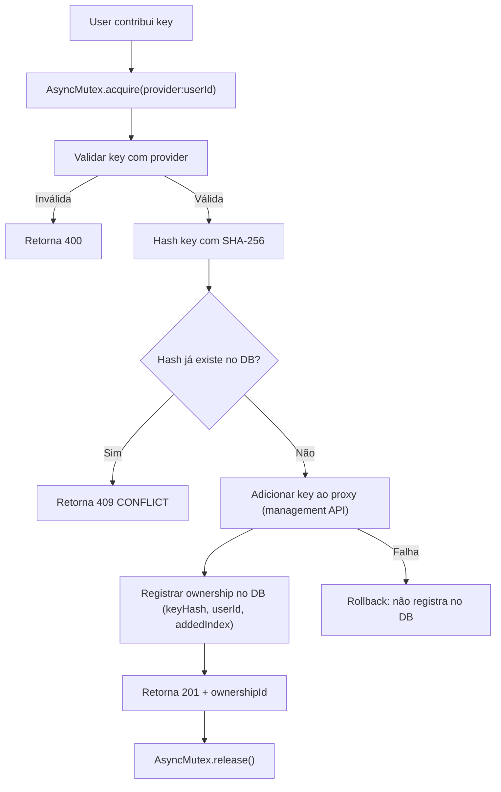

# 1. Título da Feature

Feature 88 — Pool Compartilhado de OAuth Tokens com Ownership e Cascading

## 2. Objetivo

Permitir que múltiplos usuários contribuam seus OAuth tokens/API keys para um pool compartilhado, com rastreamento de ownership por contribuidor, cascading de remoção, e distribuição de carga entre tokens do pool.

## 3. Motivação

O `cliproxyapi-dashboard` implementa um sistema sofisticado de pool sharing com 3 camadas:

1. **ProviderKeyOwnership**: cada API key contribuída é registrada com `userId`, `provider`, `keyHash` (SHA-256), e `addedIndex` (posição no array de credenciais do proxy).
2. **ProviderOAuthOwnership**: OAuth tokens registrados com `userId`, `provider`, `accountIndex`, e metadata de conexão.
3. **Dual-Write Pattern**: ao contribuir uma key, o sistema atualiza tanto o proxy Go (via management API) quanto o DB Prisma em uma operação atômica-like, com rollback em caso de falha.
4. **AsyncMutex**: mutex por `provider:userId` previne race conditions durante contribuição simultânea.

A cascading rule funciona assim: quando um usuário remove sua conta, todos os `ProviderKeyOwnership` e `ProviderOAuthOwnership` dele são cascaded (`onDelete: Cascade`), e as keys correspondentes são removidas do proxy.

No OmniRoute, credenciais são configuradas centralmente pelo admin via `.env` ou settings. Não há mecanismo para usuários contribuírem suas próprias credenciais ao pool.

## 4. Problema Atual (Antes)

- Apenas admin configura credenciais (centralizado).
- Custo de API concentrado em poucas contas/keys.
- Sem rastreamento de quem contribuiu qual credencial.
- Remoção de credencial é manual e propensa a erro.
- Não há distribuição de carga entre múltiplas credenciais do mesmo provider.
- Sem proteção contra race conditions na adição/remoção.

### Antes vs Depois

| Dimensão                 | Antes                   | Depois                                       |
| ------------------------ | ----------------------- | -------------------------------------------- |
| Fonte de credenciais     | Admin via .env/settings | Pool compartilhado com contribuição por user |
| Rastreamento             | Nenhum (todas do admin) | Ownership por userId + provider + keyHash    |
| Distribuição de custo    | Concentrada             | Distribuída entre contribuidores             |
| Remoção de key           | Manual pelo admin       | Self-service + cascade em remoção de user    |
| Proteção de concorrência | Nenhuma                 | AsyncMutex por provider:userId               |
| Segurança de key         | Plaintext em .env       | SHA-256 hash no DB, key no proxy             |

## 5. Estado Futuro (Depois)

### Fluxo de Contribuição

```
User → Dashboard → "Contribuir API Key" → Seleciona provider (Claude, OpenAI, etc.)
     → Insere API key → Backend valida key → Proxy recebe key → DB registra ownership
     → Key disponível no pool para roteamento
```

### API de Pool Management

```
POST /api/providers/keys/contribute
{ "provider": "claude", "key": "sk-ant-..." }
→ Valida key → Adiciona ao proxy → Registra ownership → 201

DELETE /api/providers/keys/:id
→ Remove do proxy → Remove ownership → 204

GET /api/providers/keys/mine
→ Lista keys contribuídas pelo user (hash only, nunca a key)
```

## 6. O que Ganhamos

- Distribuição de custo entre múltiplos contribuidores.
- Mais credenciais = mais resiliência (fallback entre keys do pool).
- Rate limits distribuídos entre keys.
- Self-service: usuários gerenciam suas próprias contribuições.
- Segurança: keys nunca armazenadas em plaintext no DB.
- Governança: rastreamento completo de quem contribuiu o quê.
- Cleanup automático quando usuário é removido.

## 7. Escopo

- Novos modelos de dados: `ProviderKeyOwnership`, `ProviderOAuthOwnership`.
- Novos endpoints: `/api/providers/keys/contribute`, `/api/providers/keys/mine`, `/api/providers/keys/:id` (DELETE).
- Módulo de mutex: `src/shared/asyncMutex.js`.
- Integração com sistema de credenciais existente (adicionar keys ao pool de seleção).
- UI de dashboard: formulário de contribuição, lista de keys do user.
- Validação de key com chamada teste ao provider antes de aceitar.

## 8. Fora de Escopo

- Billing ou cobrança entre contribuidores.
- OAuth flow completo para providers (feature separada — ver feature-08).
- Rotação automática de keys.
- Quota individual por key contribuída.

## 9. Arquitetura Proposta



## 10. Mudanças Técnicas Detalhadas

### Schema de dados

```js
// ProviderKeyOwnership
{
  id: 'uuid',
  userId: 'fk -> User (onDelete: Cascade)',
  provider: 'string',           // "claude", "openai", "gemini"
  keyHash: 'string',            // SHA-256 hash da key
  addedIndex: 'integer',        // Posição no array do proxy
  label: 'string?',             // Rótulo opcional ("Key pessoal", etc.)
  createdAt: 'datetime',
  // Composite index: [provider, keyHash] para lookup rápido
}

// ProviderOAuthOwnership
{
  id: 'uuid',
  userId: 'fk -> User (onDelete: Cascade)',
  provider: 'string',           // "claude", "gemini-cli", "codex", etc.
  accountIndex: 'integer',      // Índice da conta OAuth
  email: 'string?',             // Email da conta (para display)
  connectedAt: 'datetime',
}
```

### AsyncMutex (referência: `dashboard/src/lib/mutex.ts`)

```js
class AsyncMutex {
  constructor() {
    this.locks = new Map();
  }

  async acquire(key) {
    while (this.locks.has(key)) {
      await this.locks.get(key);
    }

    let resolve;
    const promise = new Promise((r) => {
      resolve = r;
    });
    this.locks.set(key, promise);

    return () => {
      this.locks.delete(key);
      resolve();
    };
  }
}

// Uso
const mutex = new AsyncMutex();
const release = await mutex.acquire(`${provider}:${userId}`);
try {
  // Operações atômicas de contribuição
} finally {
  release();
}
```

### Dual-Write Pattern (referência: `dashboard/src/app/api/provider-keys/contribute/route.ts`)

```js
async function contributeKey(userId, provider, apiKey) {
  const release = await mutex.acquire(`${provider}:${userId}`);
  try {
    // 1. Hash da key
    const keyHash = crypto.createHash("sha256").update(apiKey).digest("hex");

    // 2. Verificar duplicata
    const existing = await db.findOwnership(provider, keyHash);
    if (existing) throw new ConflictError("Key already contributed");

    // 3. Verificar limite por provider
    const count = await db.countOwnership(provider, userId);
    if (count >= MAX_KEYS_PER_PROVIDER) throw new LimitError("Max keys reached");

    // 4. Adicionar ao proxy (management API)
    const addedIndex = await addKeyToProxy(provider, apiKey);

    // 5. Registrar ownership no DB (dual-write)
    await db.createOwnership({ userId, provider, keyHash, addedIndex });

    return { id: ownership.id, provider, addedIndex };
  } finally {
    release();
  }
}
```

Referência original: `dashboard/src/app/api/provider-keys/contribute/route.ts` e `dashboard/prisma/schema.prisma` (modelos ProviderKeyOwnership, ProviderOAuthOwnership)

## 11. Impacto em APIs Públicas / Interfaces / Tipos

- APIs novas: 3 endpoints novos de pool management.
- Compatibilidade: **non-breaking** — endpoints completamente aditivos.
- Roteamento: sistema de seleção de credenciais precisa considerar pool de keys.
- Segurança: keys nunca expostas no response (apenas hash e metadata).

## 12. Passo a Passo de Implementação Futura

1. Criar modelos `ProviderKeyOwnership` e `ProviderOAuthOwnership` no DB.
2. Migrar DB com composite indexes.
3. Implementar `AsyncMutex` em `src/shared/asyncMutex.js`.
4. Criar endpoint de contribuição com validação de key + dual-write.
5. Criar endpoint de listagem de keys do user (hash only).
6. Criar endpoint de remoção com cleanup no proxy + DB.
7. Integrar pool de keys no sistema de seleção de credenciais.
8. Criar UI de dashboard para contribuição e gerenciamento.
9. Configurar limite de keys por provider (`MAX_KEYS_PER_PROVIDER`).
10. Adicionar cascade policy: user deletado → keys removidas.

## 13. Plano de Testes

Cenários positivos:

1. Dado user contribui key válida, quando contribuição aceita, então key aparece no pool e ownership registrado.
2. Dado user remove sua key, quando deletion processada, então key removida do proxy e ownership deletado.
3. Dado user deletado, quando cascade executa, então todas as keys são removidas do proxy e DB.

Cenários de erro: 4. Dado key já contribuída (mesmo hash), quando contribuição tentada, então retorna 409 CONFLICT. 5. Dado key inválida (falha na validação com provider), quando contribuição tentada, então retorna 400. 6. Dado limite de keys atingido, quando contribuição tentada, então retorna 429 LIMIT_REACHED.

Concorrência: 7. Dado 2 contribuições simultâneas do mesmo user + provider, quando mutex adquirido, então apenas uma executa por vez. 8. Dado falha no proxy durante dual-write, quando rollback executa, então DB não registra ownership órfão.

## 14. Critérios de Aceite

- [ ] Contribuição de key com validação + hash + dual-write.
- [ ] AsyncMutex previne race conditions.
- [ ] Keys nunca armazenadas em plaintext no DB.
- [ ] Listagem mostra apenas hash e metadata (nunca a key).
- [ ] Remoção limpa proxy + DB.
- [ ] Cascade funciona em deleção de user.
- [ ] Limite de keys por provider configurável.
- [ ] UI de contribuição e gerenciamento no dashboard.

## 15. Riscos e Mitigações

- Risco: keys contribuídas são usadas indevidamente.
- Mitigação: contribuição voluntária + auditoria de uso por key.

- Risco: dual-write inconsistente (proxy tem key, DB não tem ownership).
- Mitigação: write no proxy primeiro, DB depois; se DB falhar, cleanup no proxy.

- Risco: user contribui key inválida/expirada.
- Mitigação: validação com chamada teste ao provider antes de aceitar.

## 16. Plano de Rollout

1. Implementar backend sem UI (API apenas).
2. Testar dual-write e cascade com dados reais.
3. Implementar UI de contribuição.
4. Rollout para equipe pequena para validação.
5. Abrir para todos os usuários.

## 17. Métricas de Sucesso

- Aumento no número de credenciais disponíveis por provider.
- Distribuição mais uniforme de rate limits.
- Redução de erros 429 por concentração de uso em poucas keys.
- Aumento de resiliência (mais keys = mais fallback options).

## 18. Dependências entre Features

- Complementa `feature-74-governanca-de-ownership-por-credencial.md` — mesma área, perspectiva diferente.
- Complementa `feature-43-governanca-de-ownership-por-credencial.md`.
- Depende de: sistema de autenticação de users existente.
- Depende de: `feature-81-sistema-de-erros-estruturado.md` para retorno padronizado de erros.

## 19. Checklist Final da Feature

- [ ] Modelos ProviderKeyOwnership e ProviderOAuthOwnership criados.
- [ ] AsyncMutex implementado e integrado.
- [ ] Contribuição com validação + hash + dual-write.
- [ ] Listagem de keys sem exposição de valores.
- [ ] Remoção com cleanup duplo (proxy + DB).
- [ ] Cascade em deleção de user.
- [ ] Limite de keys por provider.
- [ ] UI de dashboard funcional.
- [ ] Testes de concorrência com mutex.
- [ ] Testes de cascading.
