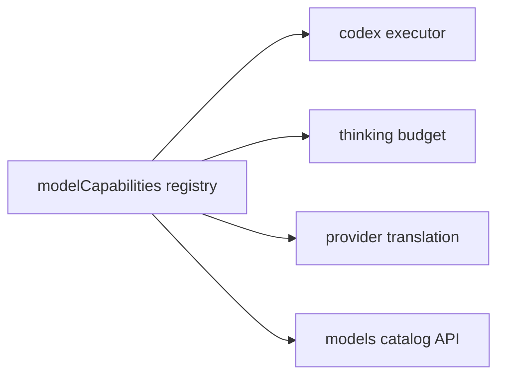

# 1. Título da Feature

Feature 08 — Registro de Capacidades de Modelo

## 2. Objetivo

Criar um registro central de capacidades de modelo (thinking, contexto estendido, esforço máximo, restrições) para orientar executores, tradutores e UI.

## 3. Motivação

Atualmente as regras de capacidade ficam distribuídas em múltiplos pontos (`providerRegistry`, `executor codex`, `thinkingBudget`). Isso aumenta risco de inconsistência e duplicação.

## 4. Problema Atual (Antes)

- Capacidade de modelo não está centralizada.
- Regras específicas por modelo ficam embutidas em lógica de execução.
- Evolução de catálogo exige mudanças em vários arquivos.

### Antes vs Depois

| Dimensão                 | Antes       | Depois             |
| ------------------------ | ----------- | ------------------ |
| Fonte de verdade         | Distribuída | Centralizada       |
| Evolução de modelo       | Custosa     | Mais simples       |
| Consistência executor/UI | Parcial     | Alta               |
| Governança               | Informal    | Processo explícito |

## 5. Estado Futuro (Depois)

Novo módulo `open-sse/config/modelCapabilities.js` com contrato único consumido por executores, tradutores e APIs de catálogo.

## 6. O que Ganhamos

- Menos divergência de comportamento por modelo.
- Facilidade de adicionar novos modelos com regras claras.
- Maior previsibilidade de validações.

## 7. Escopo

- Criar registro central e helpers de consulta.
- Atualizar consumidores principais (`codex.js`, `thinkingBudget.js`, `provider.js`).
- Expor (opcional) endpoint interno de capabilities.

## 8. Fora de Escopo

- Validação semântica completa de todos os providers nesta fase.
- Catálogo online dinâmico universal.

## 9. Arquitetura Proposta



## 10. Mudanças Técnicas Detalhadas

Arquivos de referência:

- `open-sse/config/providerRegistry.js`
- `open-sse/executors/codex.js`
- `open-sse/services/thinkingBudget.js`
- `open-sse/services/provider.js`
- `src/app/api/models/catalog/route.js`

Estrutura sugerida:

```js
export const MODEL_CAPABILITIES = {
  "gpt-5.3-codex": { maxEffort: "xhigh", supportsThinking: true, maxContext: 200000 },
  "gpt-5-mini": { maxEffort: "high", supportsThinking: true },
  "gemini-3-pro-preview": { supportsExtendedContext: true },
};
```

## 11. Impacto em APIs Públicas / Interfaces / Tipos

- APIs novas (opcional): `GET /api/models/capabilities` (interno dashboard).
- APIs alteradas: nenhuma obrigatória em `/v1/*`.
- Tipos/interfaces: novo tipo `ModelCapability`.
- Compatibilidade: **non-breaking**.
- Estratégia de transição: rollout gradual por feature flag e fallback para comportamento anterior quando aplicável.
- Registro explícito: sem impacto em API pública externa (`/v1/*`); impacto interno em catálogo/capabilities.

## 12. Passo a Passo de Implementação Futura

1. Definir schema de capabilities.
2. Criar registry inicial com modelos críticos.
3. Adaptar `codex.js` para ler `maxEffort` do registry.
4. Adaptar `thinkingBudget` para suportar flags por modelo.
5. Incluir validação de integridade do registry.
6. Cobrir testes unitários de lookup e defaults.

## 13. Plano de Testes

Cenários positivos:

1. Dado modelo conhecido no registry, quando consultar capabilities, então retorna payload completo.
2. Dado `codex` com modelo limitado, quando aplicar effort, então clamp usa valor do registry.
3. Dado modelo com extended context, quando UI consulta catálogo, então flag aparece corretamente.

Cenários de erro:

4. Dado modelo ausente no registry, quando consultar, então fallback padrão seguro é aplicado.
5. Dado registry malformado, quando startup valida, então erro é detectado com mensagem clara.

Regressão:

6. Dado comportamento atual de executor sem capabilities, quando registry é adicionado, então default mantém operação.

Compatibilidade retroativa:

7. Dado versões antigas sem endpoint de capabilities, quando nova versão sobe, então APIs existentes não mudam schema.

## 14. Critérios de Aceite

- [ ] Given registro de capacidades carregado, When um modelo conhecido é consultado, Then o schema completo (`thinking`, contexto, limites) é retornado sem campos faltantes.
- [ ] Given executores/tradutores integrados, When processam request de modelo com restrições, Then os limites do registry são respeitados de forma determinística.
- [ ] Given modelo não mapeado no registry, When lookup é realizado, Then fallback seguro é aplicado sem falha de execução.
- [ ] Given suíte de testes de integração, When CI roda com o novo registry, Then cenários de lookup, fallback e consumo por executor passam sem regressão.

## 15. Riscos e Mitigações

- Risco: registry incompleto inicial.
- Mitigação: fallback defensivo + backlog de cobertura incremental.

## 16. Plano de Rollout

1. Introduzir registry sem acoplamento obrigatório.
2. Migrar consumidores por etapas.
3. Tornar registry fonte primária após cobertura mínima acordada.

## 17. Métricas de Sucesso

- Redução de bugs por divergência de regra de modelo.
- Tempo para adicionar novo modelo reduzido.
- Cobertura de modelos críticos no registry.

## 18. Dependências entre Features

- Fortemente relacionado a `feature-clamp-de-effort-por-modelo-codex-04.md`.
- Complementa `feature-modelo-compatibilidade-cross-proxy-01.md`.

## 19. Checklist Final da Feature

- [ ] Schema e registry definidos.
- [ ] Integração em executores/tradutores prevista.
- [ ] Testes de fallback e integridade.
- [ ] Governança de atualização documentada.
- [ ] Sem breaking change público.
