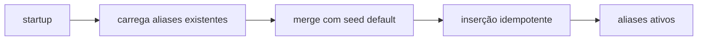

# 1. Título da Feature

Feature 15 — Seed de Aliases Antigravity/Gemini Recentes

## 2. Objetivo

Pré-carregar aliases estratégicos de modelos Antigravity/Gemini para ampliar compatibilidade imediata com nomenclaturas recentes sem depender de configuração manual do usuário.

## 3. Motivação

Parte das incompatibilidades de migração ocorre por diferença de nomenclatura de modelos entre proxies. Seed controlado reduz atrito operacional.

## 4. Problema Atual (Antes)

- Aliases recentes não estão semeados por padrão.
- Usuário precisa criar alias manualmente para alguns modelos novos.
- Erros de “modelo não encontrado” em contextos migrados.

### Antes vs Depois

| Dimensão                    | Antes                     | Depois            |
| --------------------------- | ------------------------- | ----------------- |
| Setup inicial               | Manual para aliases novos | Pronto por padrão |
| Compatibilidade cross-proxy | Parcial                   | Ampliada          |
| Erro por nomenclatura       | Mais frequente            | Menos frequente   |

## 5. Estado Futuro (Depois)

No bootstrap da aplicação, aliases padrão são inseridos de forma idempotente na camada de aliases de modelo.

## 6. O que Ganhamos

- Onboarding mais rápido.
- Menos suporte para alias manual.
- Compatibilidade imediata com modelos renomeados.

## 7. Escopo

- Lista de aliases padrão.
- Job de seed idempotente no startup.
- Log de seed aplicado/skipped.

## 8. Fora de Escopo

- Sync em tempo real de aliases remotos.
- Catálogo dinâmico global por scraping.

## 9. Arquitetura Proposta



## 10. Mudanças Técnicas Detalhadas

Arquivos de referência:

- `src/lib/db/models.js`
- `open-sse/services/model.js`
- `src/app/api/models/alias/route.js`

Seed sugerido (exemplo):

```js
const DEFAULT_ALIAS_SEED = {
  "gemini-2.5-computer-use-preview-10-2025": "rev19-uic3-1p",
  "gemini-3-pro-image-preview": "gemini-3-pro-image",
  "gemini-3-pro-preview": "gemini-3-pro-high",
  "gemini-3-flash-preview": "gemini-3-flash",
  "gemini-claude-sonnet-4-5": "claude-sonnet-4-5",
  "gemini-claude-sonnet-4-5-thinking": "claude-sonnet-4-5-thinking",
  "gemini-claude-opus-4-5-thinking": "claude-opus-4-5-thinking",
};
```

## 11. Impacto em APIs Públicas / Interfaces / Tipos

- APIs novas: nenhuma.
- APIs alteradas: nenhuma quebra.
- Compatibilidade: **non-breaking**.
- Estratégia: seed somente quando alias inexistente.

## 12. Passo a Passo de Implementação Futura

1. Definir mapa de seed versionado.
2. Criar função `seedModelAliases()` idempotente.
3. Executar seed no bootstrap controlado.
4. Expor status em log/endpoint interno opcional.
5. Cobrir testes de idempotência.

## 13. Plano de Testes

Cenários positivos:

1. Alias novo é criado automaticamente no primeiro boot.
2. Alias já existente não é sobrescrito.

Cenários de erro:

3. Seed inválido não interrompe startup (apenas log).

Regressão:

4. Resolução de modelos existentes não muda.

Compatibilidade retroativa:

5. Instalações antigas recebem seed sem migração manual.

## 14. Critérios de Aceite

- [ ] Given instalação nova, When app inicia, Then aliases default são aplicados.
- [ ] Given alias custom já existente, When seed roda, Then valor custom é preservado.
- [ ] Given execução repetida de seed, When reprocessa, Then resultado é idempotente.

## 15. Riscos e Mitigações

- Risco: alias default conflitar com estratégia local.
- Mitigação: seed “write-if-missing” apenas.

## 16. Plano de Rollout

1. Publicar seed em release menor.
2. Monitorar colisões por telemetria.
3. Ajustar mapa conforme feedback.

## 17. Métricas de Sucesso

- Redução de criação manual de aliases.
- Redução de erro de modelo não encontrado em providers afetados.

## 18. Dependências entre Features

- Complementa `feature-compatibilidade-de-quota-multiplos-providers-13.md`.

## 19. Checklist Final da Feature

- [ ] Mapa de seed definido.
- [ ] Execução idempotente implementável.
- [ ] Testes de seed/collision concluídos.
