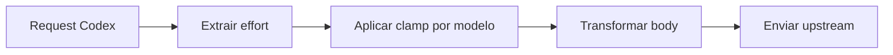

# 1. Título da Feature

Feature 16 — Clamp de Effort por Modelo no Codex

## 2. Objetivo

Garantir que `reasoning effort` enviado ao upstream Codex respeite limites reais por modelo, evitando requests inválidas e comportamento inconsistente.

## 3. Motivação

`open-sse/executors/codex.js` já converte suffix e `reasoning_effort`, mas não impõe limite máximo por capacidade de cada modelo. Isso pode gerar falhas silenciosas ou rejeição upstream.

## 4. Problema Atual (Antes)

- `effort` aceita valores acima da capacidade de determinados modelos.
- Sem política central para clamping em Codex.
- Dificuldade de previsibilidade para usuários que trocam modelos sem ajustar effort.

### Antes vs Depois

| Dimensão                   | Antes         | Depois                            |
| -------------------------- | ------------- | --------------------------------- |
| Validação por modelo       | Ausente       | Presente por mapa de capacidade   |
| Robustez de request        | Variável      | Consistente                       |
| Erro por effort inválido   | Mais provável | Reduzido com clamp determinístico |
| Compatibilidade retroativa | Implícita     | Regras explícitas                 |

## 5. Estado Futuro (Depois)

Adicionar tabela `MAX_EFFORT_BY_MODEL` e função de clamp no executor Codex antes do envio da requisição.

## 6. O que Ganhamos

- Menos erro upstream por parâmetros incompatíveis.
- Comportamento previsível por modelo.
- Base para reaproveitar a regra em outros executores.

## 7. Escopo

- Atualização de `open-sse/executors/codex.js`.
- Opcional: mover tabela para módulo central de capabilities.
- Testes unitários específicos de clamp.

## 8. Fora de Escopo

- Alterar semântica de effort em providers não-Codex.
- Criar UI nova nesta etapa.

## 9. Arquitetura Proposta



## 10. Mudanças Técnicas Detalhadas

Arquivos de referência:

- `open-sse/executors/codex.js`
- `open-sse/services/thinkingBudget.js`
- `src/app/api/settings/thinking-budget/route.js`
- `src/app/(dashboard)/dashboard/settings/components/ThinkingBudgetTab.js`

Pseudo-código:

```js
const ORDER = ["none", "low", "medium", "high", "xhigh"];
const MAX_EFFORT_BY_MODEL = {
  "gpt-5.3-codex": "xhigh",
  "gpt-5.2-codex": "xhigh",
  "gpt-5-mini": "high",
};

function clampEffort(model, requested) {
  const max = MAX_EFFORT_BY_MODEL[model] || "xhigh";
  return ORDER.indexOf(requested) <= ORDER.indexOf(max) ? requested : max;
}
```

## 11. Impacto em APIs Públicas / Interfaces / Tipos

- APIs novas: nenhuma.
- APIs alteradas: comportamento interno de normalização do campo `reasoning` para Codex.
- Tipos/interfaces: possível novo tipo interno para esforço máximo por modelo.
- Compatibilidade: **non-breaking**.
- Estratégia de transição: rollout gradual por feature flag e fallback para comportamento anterior quando aplicável.
- Registro explícito: “Sem impacto em API pública; impacto interno apenas.”

## 12. Passo a Passo de Implementação Futura

1. Definir mapa de capacidade em `codex.js` (ou módulo central).
2. Aplicar clamp após derivação de effort.
3. Logar quando clamp ocorrer.
4. Garantir prioridade de fontes (`reasoning.effort`, `reasoning_effort`, suffix).
5. Atualizar testes de transform do executor.

## 13. Plano de Testes

Cenários positivos:

1. Dado modelo com suporte `xhigh`, quando request pede `xhigh`, então mantém `xhigh`.
2. Dado modelo com limite `high`, quando request pede `medium`, então mantém `medium`.
3. Dado ausência de effort explícito, quando request entra, então default atual permanece válido.

Cenários de erro:

4. Dado effort inválido (`ultra`), quando request entra, então normaliza para default seguro.
5. Dado modelo sem entrada no mapa, quando request entra, então usa fallback padrão sem quebrar.

Regressão:

6. Dado sufixo no modelo (`-high`), quando processar request, então remoção de sufixo segue funcionando.

Compatibilidade retroativa:

7. Dado cliente legado que envia `reasoning_effort`, quando clamp habilitado, então request continua aceito.

## 14. Critérios de Aceite

- [ ] Given effort acima do permitido, When request processa, Then valor final é clampado corretamente.
- [ ] Given effort válido, When processa, Then valor é preservado.
- [ ] Given clamp aplicado, When evento é registrado, Then o log contém modelo, valor de entrada e valor final sem exposição de dados sensíveis.
- [ ] Given suíte de testes do executor Codex, When pipeline CI executa, Then cenários de nível válido, inválido e default passam sem regressões.

## 15. Riscos e Mitigações

- Risco: mapa de capacidade desatualizado.
- Mitigação: governança por release e fallback conservador.

## 16. Plano de Rollout

1. Introduzir clamp com log em `debug`.
2. Monitorar taxa de clamps por modelo.
3. Ajustar tabela de capacidade conforme evidência de produção.

## 17. Métricas de Sucesso

- Queda de rejeições upstream por effort inválido.
- Distribuição saudável de effort por modelo.
- Zero regressão em requests Codex existentes.

## 18. Dependências entre Features

- Beneficia de `feature-registro-de-capacidades-de-modelo-08.md` para centralização futura.

## 19. Checklist Final da Feature

- [ ] Clamp implementado no executor Codex.
- [ ] Regras de precedência preservadas.
- [ ] Testes cobrindo valid/invalid/default.
- [ ] Observabilidade de clamp disponível.
- [ ] Sem breaking change de contrato externo.
