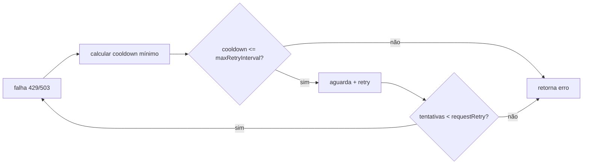

# 1. Título da Feature

Feature 16 — Retry Aware de Cooldown com Configuração Operacional

## 2. Objetivo

Criar mecanismo de retry que considere cooldown disponível entre contas/modelos, com parâmetros configuráveis (`requestRetry`, `maxRetryIntervalSec`) para evitar falha prematura em cenários de 429/503.

## 3. Motivação

O `9router` já faz fallback entre contas, mas não possui uma etapa explícita de “aguardar menor cooldown possível e tentar novamente” como estratégia coordenada.

## 4. Problema Atual (Antes)

- Fallback troca conta, mas encerra cedo quando todas estão temporariamente bloqueadas.
- Falta configuração de número máximo de retries por request em função de cooldown.
- Comportamento depende mais de sorte de seleção do que de política explícita.

### Antes vs Depois

| Dimensão                         | Antes    | Depois         |
| -------------------------------- | -------- | -------------- |
| Resiliência em 429/503           | Média    | Alta           |
| Controle operacional             | Limitado | Configurável   |
| Aproveitamento de cooldown curto | Baixo    | Alto           |
| Estabilidade sob rajada          | Variável | Determinística |

## 5. Estado Futuro (Depois)

Adicionar loop de retry controlado no fluxo de execução:

- detectar menor `retryAfter` elegível;
- aguardar até `maxRetryIntervalSec`;
- reexecutar até `requestRetry` tentativas.

## 6. O que Ganhamos

- Menos falhas temporárias para clientes finais.
- Melhor throughput em horários de limitação.
- Operação previsível via knobs de configuração.

## 7. Escopo

- Novos campos de settings operacionais.
- Integração no `src/sse/handlers/chat.js` e/ou serviço dedicado.
- Observabilidade do motivo de retry.

## 8. Fora de Escopo

- Reescrever mecanismo completo de fallback.
- Retry infinito sem limite.

## 9. Arquitetura Proposta



## 10. Mudanças Técnicas Detalhadas

Arquivos de referência:

- `src/sse/handlers/chat.js`
- `src/sse/services/auth.js`
- `open-sse/services/accountFallback.js`
- `src/lib/db/settings.js`
- `src/types/settings.ts`

Config proposta:

```ts
interface Settings {
  requestRetry?: number; // default 3
  maxRetryIntervalSec?: number; // default 30
}
```

## 11. Impacto em APIs Públicas / Interfaces / Tipos

- APIs públicas `/v1/*`: sem mudança de contrato.
- APIs internas de settings: inclusão de novos campos.
- Tipos/interfaces: extensão de `Settings`.
- Compatibilidade: aditiva, non-breaking.

## 12. Passo a Passo de Implementação Futura

1. Persistir `requestRetry` e `maxRetryIntervalSec` em settings.
2. Criar helper `computeClosestRetryAfter()`.
3. Integrar retry wait no fluxo `handleSingleModelChat`.
4. Garantir cancelamento por `AbortSignal` durante espera.
5. Logar tentativa, espera e motivo da decisão.

## 13. Plano de Testes

Cenários positivos:

1. Dado todas contas em cooldown curto, quando request falha, então sistema aguarda e recupera.
2. Dado cooldown acima do limite, quando falha, então retorna erro sem espera excessiva.
3. Dado sucesso após retry, quando processar, então resposta retorna normalmente.

Cenários de erro:

4. Dado cancelamento do cliente durante espera, quando retry pendente, então aborta corretamente.
5. Dado settings inválida, quando carregar, então aplicar defaults seguros.

Regressão:

6. Dado tráfego com fallback atual, quando retry config desabilitada, então comportamento legado permanece.

## 14. Critérios de Aceite

- [ ] Given `requestRetry=3` e cooldown elegível, When ocorrer 429/503, Then o sistema tenta novamente até limite configurado.
- [ ] Given cooldown maior que `maxRetryIntervalSec`, When erro ocorre, Then request encerra sem aguardar além do permitido.
- [ ] Given cliente desconecta durante wait, When retry está pendente, Then a execução é cancelada sem vazamento.
- [ ] Given settings ausentes, When feature inicia, Then defaults operacionais são aplicados.

## 15. Riscos e Mitigações

- Risco: aumento de latência p95 em requests com retry.
- Mitigação: limite estrito de espera e tentativas.

- Risco: excesso de tentativas sob falha generalizada.
- Mitigação: integração com circuit breaker existente.

## 16. Plano de Rollout

1. Introduzir campos de settings com defaults conservadores.
2. Habilitar em staging com métricas.
3. Abrir em produção gradualmente por percentual de tráfego.

## 17. Métricas de Sucesso

- Taxa de recuperação por retry.
- Redução de erro final 429/503.
- Tempo médio adicional por request com retry.
