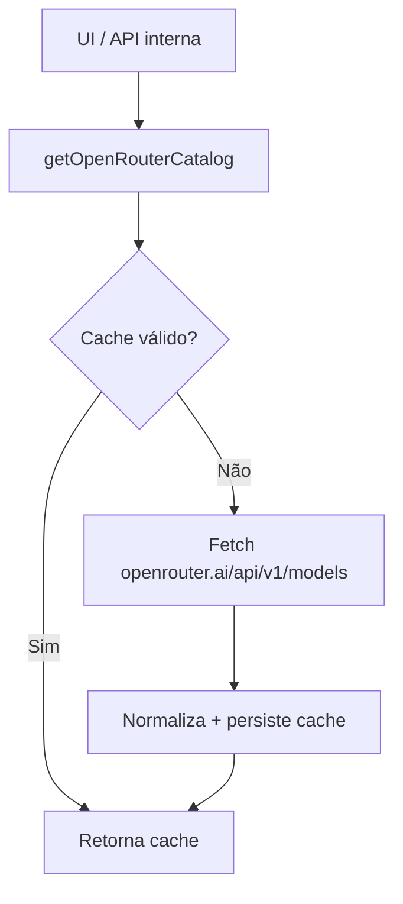

# 1. Título da Feature

Feature 17 — Catálogo OpenRouter com Cache Persistente

## 2. Objetivo

Criar um catálogo dedicado de modelos OpenRouter com cache (TTL) e normalização de metadados de contexto/pricing para uso consistente no dashboard e APIs internas.

## 3. Motivação

Hoje a busca de modelos em `src/app/api/providers/[id]/models/route.js` funciona, mas não há camada central de catálogo com cache persistente para reduzir latência e dependência de rede em telas administrativas.

## 4. Problema Atual (Antes)

- Fetch online frequente do endpoint de modelos.
- Sem cache persistente com TTL para catálogo OpenRouter.
- Metadados de pricing/contexto não padronizados em uma fonte única.

### Antes vs Depois

| Dimensão                        | Antes            | Depois                     |
| ------------------------------- | ---------------- | -------------------------- |
| Fonte de catálogo               | Chamadas diretas | Serviço dedicado com cache |
| Latência em dashboard           | Variável         | Estável com cache local    |
| Disponibilidade offline parcial | Baixa            | Melhor com último snapshot |
| Normalização de metadados       | Dispersa         | Centralizada               |

## 5. Estado Futuro (Depois)

Implementar módulo `src/lib/catalog/openrouterCatalog.js` com:

- fetch remoto,
- cache local (arquivo/SQLite),
- TTL configurável,
- fallback para último snapshot válido.

## 6. O que Ganhamos

- Menos chamadas redundantes ao OpenRouter.
- Melhor UX no painel de seleção/modelagem.
- Base para comparação de custos e recomendação de modelo.

## 7. Escopo

- Módulo de catálogo OpenRouter.
- Endpoint interno para leitura do catálogo cacheado.
- Integração com UI de modelos.

## 8. Fora de Escopo

- Indexação full-text complexa no banco.
- Sincronização multi-nó.
- Catálogo unificado de todos os providers nesta fase.

## 9. Arquitetura Proposta



## 10. Mudanças Técnicas Detalhadas

Arquivos de referência:

- `src/app/api/providers/[id]/models/route.js`
- `src/app/api/models/catalog/route.js`
- `src/app/api/pricing/models/route.js`
- `src/shared/components/ModelSelectModal.js`
- `src/lib/db/core.js`

Snippet de configuração:

```js
export const OPENROUTER_CATALOG_CONFIG = {
  endpoint: "https://openrouter.ai/api/v1/models",
  ttlMs: 24 * 60 * 60 * 1000,
  staleIfError: true,
};
```

## 11. Impacto em APIs Públicas / Interfaces / Tipos

- APIs novas (interna dashboard): opcional `GET /api/models/catalog?provider=openrouter` com payload normalizado.
- APIs alteradas: nenhuma obrigatória para `/v1/*`.
- Tipos/interfaces: novo tipo `OpenRouterCatalogModel`.
- Compatibilidade: **non-breaking**.
- Estratégia de transição: rollout gradual por feature flag e fallback para comportamento anterior quando aplicável.
- Registro explícito: sem impacto em API pública externa (`/v1/*`); impacto interno em catálogo/admin.

## 12. Passo a Passo de Implementação Futura

1. Criar módulo de fetch+cache do catálogo OpenRouter.
2. Definir storage (arquivo local ou tabela SQLite dedicada).
3. Expor endpoint interno para consumo de UI.
4. Adaptar `ModelSelectModal` para usar o catálogo cacheado.
5. Incluir fallback `stale-if-error`.
6. Adicionar job de refresh oportunista.

## 13. Plano de Testes

Cenários positivos:

1. Dado cache válido, quando endpoint interno é chamado, então retorna cache sem fetch remoto.
2. Dado cache expirado e rede disponível, quando chamado, então atualiza cache e retorna snapshot novo.
3. Dado catálogo com pricing/context, quando serializa, então campos esperados são normalizados.

Cenários de erro:

4. Dado endpoint remoto indisponível com cache stale, quando chamado, então retorna stale sem erro fatal.
5. Dado endpoint remoto indisponível sem cache, quando chamado, então retorna erro controlado com mensagem clara.

Regressão:

6. Dado fluxo atual de `/api/providers/[id]/models`, quando catálogo novo é introduzido, então lista de modelos continua funcional.

Compatibilidade retroativa:

7. Dado instalação antiga sem tabela/arquivo de cache, quando iniciar feature, então bootstrap ocorre sem quebrar startup.

## 14. Critérios de Aceite

- [ ] Given cache válido dentro do TTL, When `GET /api/models/catalog?provider=openrouter` é consultado, Then a resposta vem do cache sem fetch remoto adicional.
- [ ] Given cache expirado e endpoint remoto saudável, When a consulta é executada, Then o snapshot é atualizado e o payload normalizado é retornado no mesmo contrato.
- [ ] Given falha remota e cache stale disponível, When a consulta ocorre, Then o sistema retorna resposta `stale-if-error` com sinalização explícita de dados desatualizados.
- [ ] Given fluxo atual de seleção de modelos no dashboard, When o catálogo cacheado é ativado, Then não há regressão funcional nem quebra de compatibilidade.

## 15. Riscos e Mitigações

- Risco: cache desatualizado por longo período.
- Mitigação: invalidar por TTL + refresh manual via endpoint admin.

## 16. Plano de Rollout

1. Lançar endpoint interno em paralelo ao fluxo atual.
2. Migrar UI gradualmente para consumo do cache.
3. Tornar padrão após estabilidade.

## 17. Métricas de Sucesso

- Redução de chamadas remotas por sessão de dashboard.
- Redução de latência de carregamento do catálogo.
- Taxa de acerto de cache.

## 18. Dependências entre Features

- Complementa `feature-modelo-compatibilidade-cross-proxy-01.md`.
- Pode alimentar `feature-registro-de-capacidades-de-modelo-08.md`.

## 19. Checklist Final da Feature

- [ ] Serviço de catálogo criado.
- [ ] Cache TTL com fallback stale implementável.
- [ ] Endpoint interno definido.
- [ ] UI preparada para consumo.
- [ ] Testes cobrindo rede/cache/erro.
