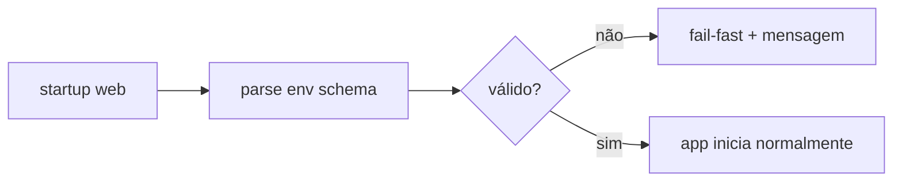

# 1. Título da Feature

Feature 18 — Validação de Variáveis de Ambiente em Runtime Web

## 2. Objetivo

Garantir validação forte e centralizada de env vars críticas no runtime real do Next.js, evitando boot parcial com configuração insegura/inconsistente.

## 3. Motivação

Existe validação de segredos no projeto, mas ela depende de fluxo específico. Em runtime web, falhas de env podem aparecer tarde e de forma opaca.

## 4. Problema Atual (Antes)

- Validação de segredos não está acoplada de forma uniforme a todo startup web.
- Falhas de env podem virar erro tardio em runtime.
- Não há schema único para variáveis de infraestrutura do dashboard.

### Antes vs Depois

| Dimensão              | Antes                             | Depois                   |
| --------------------- | --------------------------------- | ------------------------ |
| Validação de env      | Parcial e distribuída             | Schema único e fail-fast |
| Diagnóstico           | Reativo                           | Erro explícito no boot   |
| Segurança operacional | Dependente de caminho de execução | Determinística           |

## 5. Estado Futuro (Depois)

Módulo `env schema` carregado no início do runtime web com mensagens objetivas de configuração inválida.

## 6. O que Ganhamos

- Menos incidentes de configuração em produção.
- Menor tempo de diagnóstico.
- Segurança mais previsível.

## 7. Escopo

- Definir schema de env crítico.
- Garantir inicialização única e compartilhada.
- Expor mensagens de erro seguras (sem vazamento de segredo).

## 8. Fora de Escopo

- Secret manager externo.
- Rotação automática de segredos.

## 9. Arquitetura Proposta

## 10. Mudanças Técnicas Detalhadas

Arquivos de referência:

- `src/shared/utils/secretsValidator.js`
- `src/proxy.js`
- `src/app/api/auth/login/route.js`

Módulo sugerido:

- `src/lib/env/runtimeEnv.js`

Campos mínimos sugeridos:

- `JWT_SECRET` (len >= 32)
- `API_KEY_SECRET` (len >= 16)
- `DATA_DIR`
- `NODE_ENV`
- opcionais críticos de segurança (`AUTH_COOKIE_SECURE`, etc.)

## 11. Impacto em APIs Públicas / Interfaces / Tipos

- APIs novas: nenhuma.
- APIs alteradas: nenhuma.
- Compatibilidade: **non-breaking**; falha explícita em configuração inválida.

## 12. Passo a Passo de Implementação Futura

1. Criar schema e parser central.
2. Integrar no ponto de bootstrap web.
3. Remover duplicidades de validação espalhada.
4. Adicionar testes de env inválido.

## 13. Plano de Testes

Cenários positivos:

1. Env completa inicia normalmente.

Cenários de erro:

2. `JWT_SECRET` ausente falha no startup.
3. `API_KEY_SECRET` fraco falha com mensagem clara.

Regressão:

4. Ambientes válidos atuais continuam subindo sem alterações funcionais.

Compatibilidade retroativa:

5. Ambientes antigos recebem erro de setup orientado, sem comportamento imprevisível.

## 14. Critérios de Aceite

- [ ] Given env inválida, When app inicia, Then falha imediatamente com mensagem objetiva.
- [ ] Given env válida, When app inicia, Then funcionamento permanece normal.
- [ ] Given logs de startup, When erro ocorre, Then segredo não é exposto em texto.

## 15. Riscos e Mitigações

- Risco: endurecimento quebrar setups antigos.
- Mitigação: documentação de migração + mensagens orientadas.

## 16. Plano de Rollout

1. Disponibilizar em modo warning.
2. Mudar para fail-fast em release seguinte.

## 17. Métricas de Sucesso

- Redução de incidentes por env inválida.
- Menor tempo médio de troubleshooting de bootstrap.

## 18. Dependências entre Features

- Apoia `feature-rate-limit-de-login-e-endpoints-sensiveis-16.md`.

## 19. Checklist Final da Feature

- [ ] Schema definido.
- [ ] Bootstrap integrado.
- [ ] Erros seguros documentados.
- [ ] Testes de env concluídos.
