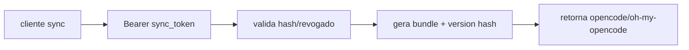

# 1. Título da Feature

Feature 20 — Config Sync Tokenizado e Versionado

## 2. Objetivo

Evoluir sincronização de configuração para um modelo de token dedicado (hashado, revogável) com versionamento determinístico do bundle de config.

## 3. Motivação

Sincronização confiável entre clientes precisa de contrato estável, segurança de token e detecção de mudanças sem polling custoso.

## 4. Problema Atual (Antes)

- Sync atual não é focado em token de escopo mínimo por cliente.
- Falta versionamento determinístico explícito para diffs de configuração.
- Revogação granular de acesso de sync limitada.

### Antes vs Depois

| Dimensão          | Antes            | Depois                             |
| ----------------- | ---------------- | ---------------------------------- |
| Segurança do sync | Genérica         | Token dedicado hashado e revogável |
| Versionamento     | Parcial          | Hash determinístico de bundle      |
| Operação          | Menos previsível | Controle de lastUsed/revogação     |

## 5. Estado Futuro (Depois)

APIs de sync com:

- emissão/listagem/revogação de tokens,
- bundle versionado por hash estável,
- rastreamento de último uso.

## 6. O que Ganhamos

- Melhor controle de acesso por cliente de sync.
- Rollout de configuração mais seguro.
- Diagnóstico claro de “quem sincronizou e quando”.

## 7. Escopo

- Tabela/namespace de tokens de sync.
- Endpoint de bundle com token header.
- Version hash determinístico.

## 8. Fora de Escopo

- CRDT e sync bidirecional em tempo real.
- Assinatura criptográfica assimétrica dos bundles (fase posterior).

## 9. Arquitetura Proposta

## 10. Mudanças Técnicas Detalhadas

Arquivos de referência:

- `src/shared/services/cloudSyncScheduler.js`
- `src/lib/cloudSync.js`
- `src/lib/db/settings.js`

Módulos sugeridos:

- `src/lib/sync/tokens.js`
- `src/app/api/sync/bundle/route.js`
- `src/app/api/sync/tokens/route.js`

Campos mínimos de token:

- `id`, `name`, `tokenHash`, `revokedAt`, `lastUsedAt`, `createdAt`, `syncApiKeyId`

## 11. Impacto em APIs Públicas / Interfaces / Tipos

- APIs novas: sim, rota dedicada de tokens/bundle.
- APIs alteradas: integração com scheduler de cloud sync.
- Compatibilidade: **aditiva**, manter caminho legado temporário.

## 12. Passo a Passo de Implementação Futura

1. Criar modelo de token e armazenamento.
2. Implementar emissão/rotação/revogação.
3. Implementar bundle versionado com hash determinístico.
4. Integrar com scheduler cliente.
5. Migrar clientes gradualmente.

## 13. Plano de Testes

Cenários positivos:

1. Token válido obtém bundle e version.
2. Sem mudança de config, version permanece igual.

Cenários de erro:

3. Token revogado retorna 401.
4. Token inválido retorna 401.

Regressão:

5. Sync legado continua funcional durante transição.

Compatibilidade retroativa:

6. Instâncias sem token não quebram startup.

## 14. Critérios de Aceite

- [ ] Given token válido, When chama bundle, Then recebe config e version hash estável.
- [ ] Given token revogado, When chama bundle, Then recebe 401.
- [ ] Given alteração de config, When recalcula bundle, Then version muda de forma determinística.

## 15. Riscos e Mitigações

- Risco: quebra de cliente legado.
- Mitigação: manter endpoint antigo por janela de migração.

## 16. Plano de Rollout

1. Publicar APIs novas em paralelo.
2. Migrar clientes gradualmente.
3. Deprecar endpoint legado.

## 17. Métricas de Sucesso

- Adoção de tokens de sync.
- Queda de erro de sync não autenticado.
- Estabilidade da version/hash entre execuções idênticas.

## 18. Dependências entre Features

- Complementa `feature-governanca-de-ownership-por-credencial-19.md`.

## 19. Checklist Final da Feature

- [ ] Modelo de token criado.
- [ ] Bundle versionado implementável.
- [ ] Fluxo de revogação pronto.
- [ ] Estratégia de migração definida.
