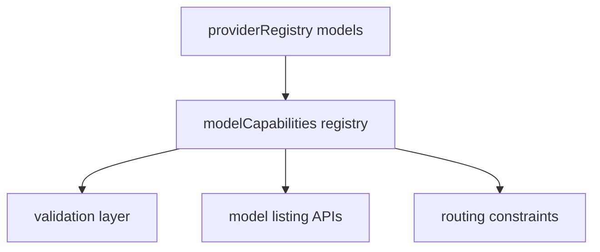

# 1. Título da Feature

Feature 20 — Expansão de Catálogo de Modelos + Registro de Capacidades

## 2. Objetivo

Ampliar o catálogo de modelos suportados e criar metadados de capacidades por modelo (contexto, output, thinking, endpoints suportados) para roteamento e validação mais inteligentes.

## 3. Motivação

A análise comparativa mostrou modelos relevantes ausentes no `9router` e ausência de metadados estruturados por modelo no registry principal.

## 4. Problema Atual (Antes)

- Catálogo cobre muitos providers, mas com lacunas de modelos recentes.
- Modelos em `providerRegistry` têm majoritariamente `id` e `name`.
- Falta base canônica de capacidades para validações avançadas.

### Antes vs Depois

| Dimensão                      | Antes    | Depois       |
| ----------------------------- | -------- | ------------ |
| Cobertura de modelos recentes | Parcial  | Ampliada     |
| Metadados de capacidade       | Escassos | Estruturados |
| Validação por limite real     | Limitada | Confiável    |
| Base para UI de capacidades   | Fraca    | Forte        |

## 5. Estado Futuro (Depois)

- Adicionar modelos prioritários ausentes.
- Criar `modelCapabilities` com campos como:
  - `contextLength`
  - `maxCompletionTokens`
  - `inputTokenLimit`
  - `outputTokenLimit`
  - `thinking` (níveis/min/max)
  - `supportedEndpoints`

## 6. O que Ganhamos

- Melhor compatibilidade e cobertura comercial.
- Menos erro por parâmetros/modelos incompatíveis.
- Base sólida para roteamento orientado a capacidade.

## 7. Escopo

- Atualizar `open-sse/config/providerRegistry.js`.
- Criar módulo de capacidades central (`open-sse/config/modelCapabilities.js`).
- Integrar capabilities em validação/seleção de modelo.

## 8. Fora de Escopo

- Atualização automática online de capabilities em tempo real.
- Recomendador de modelo full AI nesta fase.

## 9. Arquitetura Proposta

## 10. Mudanças Técnicas Detalhadas

Arquivos de referência:

- `open-sse/config/providerRegistry.js`
- `open-sse/config/providerModels.js`
- `src/app/api/v1/models/route.js`
- `src/app/api/models/catalog/route.js`
- `open-sse/services/model.js`

Lista inicial prioritária (fase 1):

- `gpt-5.3-codex-spark`
- `claude-opus-4.5`
- `glm-5`
- `minimax-m2` e `minimax-m2.5`
- `qwen3-max`, `qwen3-max-preview`, `qwen3-vl-plus`, `qwen3-32b`, `qwen3-235b*`
- `deepseek-v3`, `deepseek-v3.1`, `deepseek-v3.2`
- `gemini-2.5-flash-image`, `gemini-3-pro-image-preview`
- família `imagen-3/4`
- `tstars2.0`, `qoder-rome-30ba3b`

## 11. Impacto em APIs Públicas / Interfaces / Tipos

- APIs públicas: sem quebra; possível enriquecimento de `GET /v1/models` com metadados extras opcionais.
- APIs internas de catálogo: podem expor capabilities detalhadas.
- Tipos/interfaces: novos tipos `ModelCapability`, `ThinkingCapability`.
- Compatibilidade: non-breaking com rollout progressivo.

## 12. Passo a Passo de Implementação Futura

1. Definir schema de capabilities.
2. Criar módulo central com dados iniciais por modelo.
3. Atualizar catálogo de modelos por provider.
4. Integrar validações no pipeline de request.
5. Expor capabilities no catálogo interno/admin.
6. Criar rotina de revisão periódica de modelos.

## 13. Plano de Testes

Cenários positivos:

1. Dado modelo novo incluído, quando `GET /v1/models`, então aparece corretamente.
2. Dado modelo com limite conhecido, quando validar request, então restrições são aplicadas.
3. Dado capability de thinking, quando request define nível, então validação funciona.

Cenários de erro:

4. Dado capability incompleta, quando validar, então fallback seguro é usado.
5. Dado modelo removido do provider, quando usado, então erro orientado é retornado.

Regressão:

6. Dado modelo antigo já suportado, quando capabilities entram, então comportamento atual não quebra.

## 14. Critérios de Aceite

- [ ] Given lista de modelos prioritários da fase 1, When catálogo é consultado, Then todos aparecem com IDs corretos.
- [ ] Given metadados de capacidade definidos, When validação de request ocorre, Then limites incompatíveis são barrados corretamente.
- [ ] Given ausência de metadado para modelo legado, When request processa, Then fallback seguro mantém compatibilidade.
- [ ] Given rotas existentes de modelos, When feature entra, Then não há regressão de listagem atual.

## 15. Riscos e Mitigações

- Risco: catálogo ficar desatualizado rapidamente.
- Mitigação: processo de atualização versionado e revisões periódicas.

- Risco: validação excessiva causar falsos positivos.
- Mitigação: modo warn-only inicial antes de enforce.

## 16. Plano de Rollout

1. Publicar capabilities em modo passivo (somente leitura).
2. Ativar validações em modo warning.
3. Habilitar enforcement gradualmente por provider.

## 17. Métricas de Sucesso

- Crescimento de cobertura de modelos estratégicos.
- Redução de erro por incompatibilidade de parâmetro/modelo.
- Adoção de modelos novos no tráfego real.
