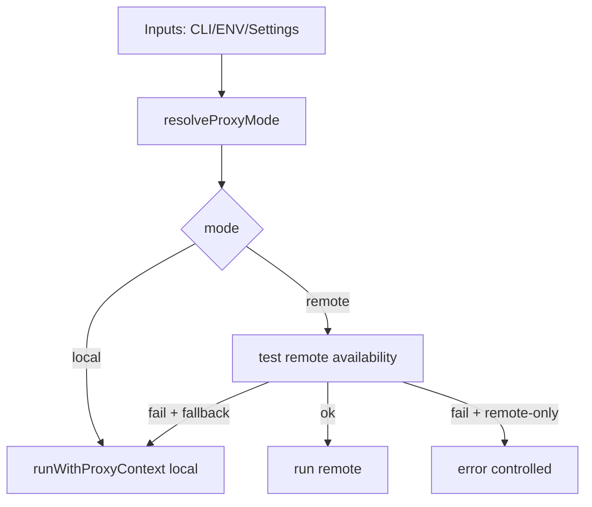

# 1. Título da Feature

Feature 22 — Modo Proxy Remoto/Local Controlado

## 2. Objetivo

Introduzir um modo explícito de operação local/remoto para roteamento proxy interno, com precedência clara de configuração e fallback seguro.

## 3. Motivação

`open-sse/utils/proxyFetch.js` já resolve proxy por contexto e variáveis de ambiente, mas não há um “modo operacional” formal que permita governar local/remoto com regras declarativas e auditáveis.

## 4. Problema Atual (Antes)

- Decisão de proxy dispersa entre contexto/env.
- Falta de política explícita `remote-only` vs `fallback local`.
- Dificuldade para operações em ambientes híbridos.

### Antes vs Depois

| Dimensão             | Antes           | Depois                          |
| -------------------- | --------------- | ------------------------------- |
| Governança de modo   | Implícita       | Explícita                       |
| Precedência config   | Parcial         | Definida (CLI > ENV > settings) |
| Fallback local       | Não formalizado | Política configurável           |
| Segurança TLS remota | Pontual         | Regras claras e auditáveis      |

## 5. Estado Futuro (Depois)

Criar resolvedor de modo proxy (`local`/`remote`) e aplicá-lo no pipeline de execução para suportar operação remota controlada.

## 6. O que Ganhamos

- Operação previsível em ambientes corporativos/híbridos.
- Melhor controle de riscos de rede.
- Menor improviso operacional em incidentes.

## 7. Escopo

- Novo resolvedor de modo proxy.
- Integração em `proxyFetch` e settings.
- Regras de fallback e `remote-only`.

## 8. Fora de Escopo

- Implementar túnel TLS dedicado nesta fase.
- Alterar contratos de streaming SSE.

## 9. Arquitetura Proposta



## 10. Mudanças Técnicas Detalhadas

Arquivos de referência:

- `open-sse/utils/proxyFetch.js`
- `src/app/api/settings/proxy/route.js`
- `src/app/api/settings/proxy/test/route.js`
- `src/lib/localDb.js`

Config proposta:

```json
{
  "proxyMode": {
    "mode": "remote",
    "host": "proxy.company.local",
    "port": 443,
    "protocol": "https",
    "remoteOnly": false,
    "allowSelfSigned": false
  }
}
```

## 11. Impacto em APIs Públicas / Interfaces / Tipos

- APIs novas (interna): possível extensão em `/api/settings/proxy` para `mode` e `remoteOnly`.
- APIs alteradas: apenas endpoints de settings/admin.
- Tipos/interfaces: novo tipo `ResolvedProxyMode`.
- Compatibilidade: **non-breaking** para `/v1/*`; mudança aditiva em settings.
- Estratégia de transição: rollout gradual por feature flag e fallback para comportamento anterior quando aplicável.
- Registro explícito: sem impacto em API pública externa (`/v1/*`); mudanças restritas a settings/admin.

## 12. Passo a Passo de Implementação Futura

1. Definir schema de modo proxy em settings.
2. Implementar resolvedor com precedência clara.
3. Integrar decisão no `proxyFetch`.
4. Adicionar teste de conectividade remota e política de fallback.
5. Expor e validar configurações no endpoint de settings.

## 13. Plano de Testes

Cenários positivos:

1. Dado `mode=local`, quando request executa, então usa rota local sem tentativa remota.
2. Dado `mode=remote` e host disponível, quando request executa, então usa remoto.
3. Dado remoto indisponível e fallback permitido, quando request executa, então cai para local.

Cenários de erro:

4. Dado `remote-only=true` e remoto indisponível, quando request executa, então retorna erro controlado.
5. Dado config inválida (`protocol`/`port`), quando carregar settings, então validação bloqueia persistência.

Regressão:

6. Dado uso atual por `HTTP_PROXY/HTTPS_PROXY`, quando modo novo não configurado, então comportamento legado é mantido.

Compatibilidade retroativa:

7. Dado instalação antiga sem `proxyMode`, quando subir versão nova, então defaults preservam fluxo atual.

## 14. Critérios de Aceite

- [ ] Given parâmetros definidos em CLI, ENV e settings, When o resolvedor de modo é executado, Then a precedência `CLI > ENV > settings` é respeitada de forma determinística.
- [ ] Given `remoteOnly=true` e endpoint remoto indisponível, When uma requisição é iniciada, Then o sistema retorna erro controlado sem fallback local.
- [ ] Given fallback local permitido e remoto indisponível, When a requisição falha no remoto, Then o fluxo local assume a execução sem quebrar a resposta do cliente.
- [ ] Given ambiente legado baseado em `HTTP_PROXY/HTTPS_PROXY`, When a feature não está habilitada, Then o comportamento anterior permanece sem regressão.

## 15. Riscos e Mitigações

- Risco: configuração remota incorreta causar indisponibilidade.
- Mitigação: endpoint de teste prévio + fallback controlado.

## 16. Plano de Rollout

1. Introduzir campos novos em settings com defaults compatíveis.
2. Habilitar primeiro em ambientes internos.
3. Expandir para produção após observabilidade estável.

## 17. Métricas de Sucesso

- Taxa de sucesso de conexão remota.
- Tempo de recuperação com fallback local.
- Incidentes por misconfiguração de proxy reduzidos.

## 18. Dependências entre Features

- Complementa `feature-observabilidade-proativa-de-quota-e-circuit-breaker-12.md` para monitorar transições de modo.

## 19. Checklist Final da Feature

- [ ] Resolver de modo especificado.
- [ ] Endpoints de settings contemplam novos campos.
- [ ] Testes de fallback/remote-only definidos.
- [ ] Compatibilidade legacy preservada.
- [ ] Estratégia de rollout definida.
