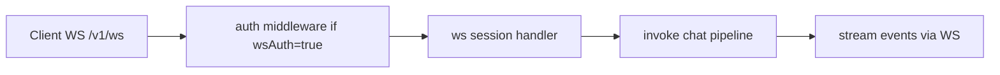

# 1. Título da Feature

Feature 22 — Suporte WebSocket em `/v1/ws` com Auth Opcional

## 2. Objetivo

Adicionar rota WebSocket compatível (`/v1/ws`) com autenticação configurável para suportar clientes que operam em canal bidirecional em vez de SSE puro.

## 3. Motivação

O `9router` está forte em SSE, mas alguns clientes e ferramentas de automação esperam endpoint WS para eventos de sessão/streaming contínuo com menor overhead de reconexão.

## 4. Problema Atual (Antes)

- Não há endpoint WebSocket dedicado no namespace `v1`.
- Integrações WS precisam de adaptadores externos.
- Sem controle explícito de auth para canal WS.

### Antes vs Depois

| Dimensão                        | Antes    | Depois       |
| ------------------------------- | -------- | ------------ |
| Compatibilidade com clientes WS | Baixa    | Alta         |
| Canal bidirecional              | Ausente  | Presente     |
| Controle de autenticação WS     | Ausente  | Configurável |
| Flexibilidade de integração     | Limitada | Ampliada     |

## 5. Estado Futuro (Depois)

Criar endpoint `/v1/ws` com:

- upgrade WebSocket;
- `wsAuth` opcional (on/off);
- integração com pipeline de request streaming existente.

## 6. O que Ganhamos

- Mais opções de integração para clientes avançados.
- Persistência de sessão melhor em cenários interativos.
- Redução de overhead em reconexões frequentes.

## 7. Escopo

- Nova rota WS na camada API.
- Flag/config `wsAuth` em settings.
- Adaptador WS -> pipeline de execução.

## 8. Fora de Escopo

- Substituir SSE como padrão do projeto.
- Protocolo WS proprietário complexo nesta fase.

## 9. Arquitetura Proposta



## 10. Mudanças Técnicas Detalhadas

Arquivos de referência:

- `src/app/api/v1/*` (nova rota ws)
- `src/sse/handlers/chat.js`
- `src/sse/services/auth.js`
- `src/lib/db/settings.js`

Config proposta:

```json
{
  "wsAuth": false,
  "wsPath": "/v1/ws"
}
```

Contrato mínimo de mensagens:

```json
{ "type": "request", "id": "req-1", "payload": { "model": "...", "messages": [...] } }
```

## 11. Impacto em APIs Públicas / Interfaces / Tipos

- API nova: `GET /v1/ws` (upgrade websocket).
- APIs existentes SSE: sem alteração.
- Tipos/interfaces: `WsEnvelope`, `WsRequestPayload`, `WsErrorPayload`.
- Compatibilidade: aditiva, non-breaking.

## 12. Passo a Passo de Implementação Futura

1. Definir protocolo mínimo de mensagem WS.
2. Implementar rota de upgrade e lifecycle de conexão.
3. Aplicar auth condicional por `wsAuth`.
4. Conectar mensagens de request ao pipeline de chat.
5. Encaminhar chunks de resposta via WS.
6. Implementar heartbeat e timeout de inatividade.

## 13. Plano de Testes

Cenários positivos:

1. Dado conexão WS válida, quando envia request, então recebe resposta streamada.
2. Dado múltiplas requests na mesma conexão, quando processar, então correlação por `id` funciona.
3. Dado `wsAuth=false`, quando conectar sem token, então conexão é aceita.

Cenários de erro:

4. Dado `wsAuth=true` sem token válido, quando conectar, então handshake falha com erro controlado.
5. Dado payload WS malformado, quando processar, então retorna erro de protocolo sem derrubar processo.

Regressão:

6. Dado tráfego SSE atual, quando WS entra, então SSE segue inalterado.

## 14. Critérios de Aceite

- [ ] Given cliente WS compatível, When conecta em `/v1/ws`, Then handshake e troca de mensagens funcionam conforme protocolo.
- [ ] Given `wsAuth=true`, When conexão sem credencial ocorre, Then acesso é bloqueado com erro claro.
- [ ] Given request processada via WS, When resposta é streamada, Then chunks preservam ordem e correlação por `id`.
- [ ] Given rotas SSE existentes, When feature WS é habilitada, Then não há regressão funcional.

## 15. Riscos e Mitigações

- Risco: vazamento de conexão sem cleanup adequado.
- Mitigação: heartbeat, timeout e fechamento determinístico.

- Risco: aumento de complexidade operacional.
- Mitigação: protocolo mínimo e rollout controlado.

## 16. Plano de Rollout

1. Lançar WS em modo beta com `wsAuth=false` em ambiente interno.
2. Testar com clientes de referência.
3. Habilitar `wsAuth` e publicar documentação final.

## 17. Métricas de Sucesso

- Número de sessões WS estáveis.
- Taxa de erro de handshake.
- Latência média e taxa de reconexão comparada ao SSE.
