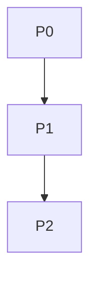

# 1. Título da Feature

Feature 23 — Índice de Roadmap Comparativo (CLIProxyAPI Dashboard vs 9router)

## 2. Objetivo

Consolidar, em um único documento, a ordem recomendada de execução das features derivadas da análise comparativa para orientar o desenvolvimento futuro.

## 3. Motivação

Com várias features candidatas, priorização explícita evita execução aleatória e reduz retrabalho entre tarefas dependentes.

## 4. Problema Atual (Antes)

- Features estão documentadas individualmente, mas sem trilha de execução oficial.
- Dependências podem ser ignoradas em planejamento futuro.

### Antes vs Depois

| Dimensão     | Antes        | Depois                       |
| ------------ | ------------ | ---------------------------- |
| Priorização  | Implícita    | Sequência explícita P0/P1/P2 |
| Dependências | Distribuídas | Centralizadas                |
| Planejamento | Reativo      | Proativo                     |

## 5. Estado Futuro (Depois)

Roadmap único apontando ordem de implementação sugerida:

- P0 Segurança/Compatibilidade
- P1 Qualidade de runtime
- P2 Governança/Operação avançada

## 6. O que Ganhamos

- Execução mais previsível.
- Melhor coordenação entre contributors.
- Menos conflitos entre PRs.

## 7. Escopo

- Prioridade e sequência das features 13..22.
- Marco de entrega por bloco.

## 8. Fora de Escopo

- Planejamento de sprints detalhado.
- Estimativa de esforço oficial por squad.

## 9. Arquitetura Proposta

## 10. Mudanças Técnicas Detalhadas

Ordem sugerida:

P0:

1. `feature-hardening-ssrf-discovery-e-validacao-de-providers-14.md`
2. `feature-safe-outbound-fetch-centralizado-17.md`
3. `feature-rate-limit-de-login-e-endpoints-sensiveis-16.md`
4. `feature-compatibilidade-de-quota-multiplos-providers-13.md`
5. `feature-seed-de-aliases-antigravity-gemini-recentes-15.md`

P1:

6. `feature-validacao-de-env-em-runtime-web-18.md`
7. `feature-observabilidade-de-auditoria-e-acoes-administrativas-21.md`

P2:

8. `feature-governanca-de-ownership-por-credencial-19.md`
9. `feature-config-sync-tokenizado-e-versionado-20.md`
10. `feature-operacao-segura-de-containers-via-socket-proxy-22.md`

## 11. Impacto em APIs Públicas / Interfaces / Tipos

- Documento de planejamento, sem impacto direto.

## 12. Passo a Passo de Implementação Futura

1. Executar P0 em PRs pequenos e independentes.
2. Consolidar observabilidade/validação (P1).
3. Expandir governança e operação (P2).

## 13. Plano de Testes

- Validar checklist de cada feature antes de avançar de fase.

## 14. Critérios de Aceite

- [ ] Ordem de execução acordada e registrada.
- [ ] Dependências entre features explícitas.
- [ ] Documento usado como referência em futuros PRs.

## 15. Riscos e Mitigações

- Risco: roadmap ficar desatualizado.
- Mitigação: revisar a cada release.

## 16. Plano de Rollout

1. Publicar índice no repositório.
2. Referenciar nos PR templates.

## 17. Métricas de Sucesso

- Redução de retrabalho entre PRs relacionados.
- Maior previsibilidade de entregas técnicas.

## 18. Dependências entre Features

- Dependente da existência e manutenção das features 13..22.

## 19. Checklist Final da Feature

- [ ] Índice publicado.
- [ ] Sequência P0/P1/P2 definida.
- [ ] Revisão periódica acordada.
