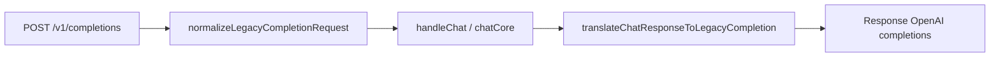

# 1. Título da Feature

Feature 25 — Paridade de Endpoint OpenAI `/v1/completions`

## 2. Objetivo

Adicionar suporte completo ao endpoint legado `POST /v1/completions` para aumentar compatibilidade com SDKs, CLIs e integrações antigas que ainda não migraram para `chat/completions` ou `responses`.

## 3. Motivação

O `9router` já atende `POST /v1/chat/completions` e `POST /v1/responses`, porém não possui rota dedicada para `completions`. Na prática, isso impede adoção por ferramentas que ainda enviam payload no formato clássico (`prompt`, `suffix`, `best_of`, etc.).

## 4. Problema Atual (Antes)

- Não existe `src/app/api/v1/completions/route.js`.
- Clientes legados recebem erro de rota inexistente.
- Integrações de terceiros precisam de adaptação manual para `chat/completions`.

### Antes vs Depois

| Dimensão                      | Antes      | Depois       |
| ----------------------------- | ---------- | ------------ |
| Compatibilidade OpenAI legado | Parcial    | Alta         |
| Migração de clientes antigos  | Manual     | Transparente |
| Esforço de integração B2B     | Alto       | Baixo        |
| Manutenção do contrato OpenAI | Incompleto | Completo     |

## 5. Estado Futuro (Depois)

Criar endpoint `POST /v1/completions` que:

- aceite payload clássico OpenAI;
- traduza internamente para pipeline comum (`handleChat` / `chatCore`);
- converta resposta de volta para schema de `completions`.

## 6. O que Ganhamos

- Cobertura de compatibilidade real com clientes legados.
- Menos fricção de onboarding para usuários migrando de outros proxies.
- Redução de suporte técnico para erros de contrato.

## 7. Escopo

- Nova rota `src/app/api/v1/completions/route.js`.
- Tradutor `completions -> chat` no request.
- Tradutor `chat -> completions` no response.
- Suporte para streaming (`text/event-stream`) e não-streaming.

## 8. Fora de Escopo

- Implementar recursos não compatíveis do modelo legado (`echo`, `logprobs` profundos) em todos os providers.
- Garantir paridade total de campos opcionais raros em fase inicial.

## 9. Arquitetura Proposta



## 10. Mudanças Técnicas Detalhadas

Arquivos de referência:

- `src/app/api/v1/chat/completions/route.js`
- `src/sse/handlers/chat.js`
- `open-sse/handlers/chatCore.js`
- `open-sse/translator/index.js`
- `open-sse/handlers/responseTranslator.js`

Estratégia de conversão inicial:

```js
function normalizeLegacyCompletionRequest(body) {
  return {
    model: body.model,
    stream: body.stream === true,
    messages: [{ role: "user", content: body.prompt || "" }],
    temperature: body.temperature,
    top_p: body.top_p,
    max_tokens: body.max_tokens,
    stop: body.stop,
  };
}
```

## 11. Impacto em APIs Públicas / Interfaces / Tipos

- APIs novas: `POST /v1/completions`.
- APIs alteradas: nenhuma obrigatória.
- Tipos/interfaces: novo tipo interno `LegacyCompletionRequest` e `LegacyCompletionResponse`.
- Compatibilidade: aditiva e non-breaking.

## 12. Passo a Passo de Implementação Futura

1. Criar rota `src/app/api/v1/completions/route.js`.
2. Reaproveitar autenticação/CORS da camada `v1`.
3. Normalizar request legado para formato interno.
4. Reaproveitar pipeline de execução já existente.
5. Converter retorno para schema de completions.
6. Cobrir streaming SSE com chunks no formato legado.
7. Adicionar logs/telemetria específicos da rota.

## 13. Plano de Testes

Cenários positivos:

1. Dado payload clássico com `prompt`, quando enviar `POST /v1/completions`, então retorna `choices[0].text` válido.
2. Dado `stream=true`, quando consumir SSE, então chunks seguem formato de completions.
3. Dado `stop` configurado, quando gerar resposta, então respeita parada.

Cenários de erro:

4. Dado payload inválido sem `model`, quando enviar request, então retorna 400 com erro OpenAI-compatível.
5. Dado provider indisponível, quando request for processada, então retorna erro padronizado sem quebrar contrato da rota.

Regressão:

6. Dado uso atual de `chat/completions`, quando nova rota entra em produção, então comportamento atual permanece inalterado.

## 14. Critérios de Aceite

- [ ] Given cliente legado OpenAI, When chamar `/v1/completions`, Then a rota responde com contrato compatível.
- [ ] Given request streaming, When consumir eventos, Then payload segue formato de completions sem quebra de parser.
- [ ] Given erro de validação, When request inválida for enviada, Then resposta mantém estrutura OpenAI de erro.
- [ ] Given tráfego existente em `/v1/chat/completions`, When feature for habilitada, Then não há regressões funcionais.

## 15. Riscos e Mitigações

- Risco: diferenças semânticas entre `prompt` legado e `messages`.
- Mitigação: normalização explícita e testes de equivalência.

- Risco: campos não suportados em providers específicos.
- Mitigação: política de fallback e warnings documentados.

## 16. Plano de Rollout

1. Habilitar por feature flag em ambiente interno.
2. Validar com suíte de clientes legados.
3. Expandir para produção com monitoramento de erro por endpoint.

## 17. Métricas de Sucesso

- Taxa de sucesso de chamadas `/v1/completions`.
- Redução de tickets com erro “endpoint não suportado”.
- Percentual de clientes legados migrados sem ajustes manuais.
