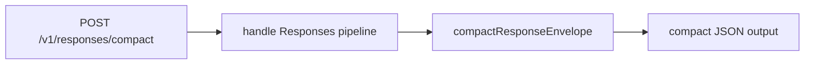

# 1. Título da Feature

Feature 26 — Paridade de Endpoint `POST /v1/responses/compact`

## 2. Objetivo

Implementar o endpoint `POST /v1/responses/compact` para atender clientes que utilizam modo compacto do Responses API com payload/retorno otimizados.

## 3. Motivação

O `9router` já possui `POST /v1/responses`, mas não expõe a variante compacta, o que reduz compatibilidade com fluxos que dependem dessa forma de serialização para menor overhead.

## 4. Problema Atual (Antes)

- Não existe `src/app/api/v1/responses/compact/route.js`.
- Clientes que esperam `responses/compact` precisam fallback manual.
- Contrato de Responses API está incompleto em termos de variantes.

### Antes vs Depois

| Dimensão                          | Antes    | Depois                 |
| --------------------------------- | -------- | ---------------------- |
| Cobertura Responses API           | Parcial  | Completa               |
| Overhead de payload               | Maior    | Menor no modo compacto |
| Compatibilidade com SDKs modernos | Parcial  | Ampliada               |
| Reuso da pipeline atual           | Limitado | Total                  |

## 5. Estado Futuro (Depois)

Criar rota de compactação que reaproveite o pipeline de `responses`, aplicando compactação no payload de resposta antes de retornar ao cliente.

## 6. O que Ganhamos

- Melhor compatibilidade com ecossistema Responses API.
- Redução de banda e latência em retornos estruturados.
- Paridade de contrato com proxies concorrentes.

## 7. Escopo

- Nova rota `src/app/api/v1/responses/compact/route.js`.
- Reuso do handler base de `responses`.
- Transform final para contrato compacto.

## 8. Fora de Escopo

- Alterar semântica do endpoint `POST /v1/responses`.
- Compactação genérica para outras rotas não relacionadas.

## 9. Arquitetura Proposta



## 10. Mudanças Técnicas Detalhadas

Arquivos de referência:

- `src/app/api/v1/responses/route.js`
- `open-sse/handlers/responsesHandler.js`
- `open-sse/handlers/responseTranslator.js`
- `open-sse/handlers/sseParser.js`

Pseudo-código:

```js
export async function POST(request) {
  const full = await handleResponses(request);
  return compactResponseEnvelope(full);
}
```

## 11. Impacto em APIs Públicas / Interfaces / Tipos

- APIs novas: `POST /v1/responses/compact`.
- APIs alteradas: nenhuma.
- Tipos/interfaces: `CompactResponsesOutput`.
- Compatibilidade: aditiva, non-breaking.

## 12. Passo a Passo de Implementação Futura

1. Criar nova rota em `src/app/api/v1/responses/compact/route.js`.
2. Extrair lógica compartilhada de `/v1/responses` para módulo comum.
3. Implementar função de compactação determinística.
4. Garantir equivalência semântica entre saída full e compact.
5. Incluir telemetria específica para taxa de uso do modo compacto.

## 13. Plano de Testes

Cenários positivos:

1. Dado request válida, quando chamar `/v1/responses/compact`, então retorna output compacto compatível.
2. Dado mesmo input em `/responses` e `/responses/compact`, quando comparar semântica, então conteúdo lógico é equivalente.
3. Dado stream convertido para não-stream, quando compactado, então estrutura permanece válida.

Cenários de erro:

4. Dado payload inválido, quando enviar request, então erro mantém padrão OpenAI.
5. Dado falha de upstream, quando request for processada, então contrato de erro permanece consistente.

Regressão:

6. Dado tráfego em `/v1/responses`, quando feature nova entra, então não há alteração de comportamento no endpoint existente.

## 14. Critérios de Aceite

- [ ] Given request válida para `responses/compact`, When processada, Then retorno está no contrato compacto esperado.
- [ ] Given mesma request em `responses` e `responses/compact`, When comparadas, Then equivalência semântica é preservada.
- [ ] Given erro upstream, When propagado, Then o formato de erro permanece compatível.
- [ ] Given endpoint antigo `/responses`, When feature é ativada, Then não há regressão.

## 15. Riscos e Mitigações

- Risco: compactação remover campo necessário para cliente específico.
- Mitigação: whitelist de campos obrigatórios + testes de compatibilidade.

## 16. Plano de Rollout

1. Publicar endpoint sob feature flag.
2. Validar com clientes piloto.
3. Liberar geral após estabilidade de parsing.

## 17. Métricas de Sucesso

- Taxa de adoção de `/responses/compact`.
- Redução média de tamanho de payload.
- Taxa de erro por cliente/SDK no modo compacto.
