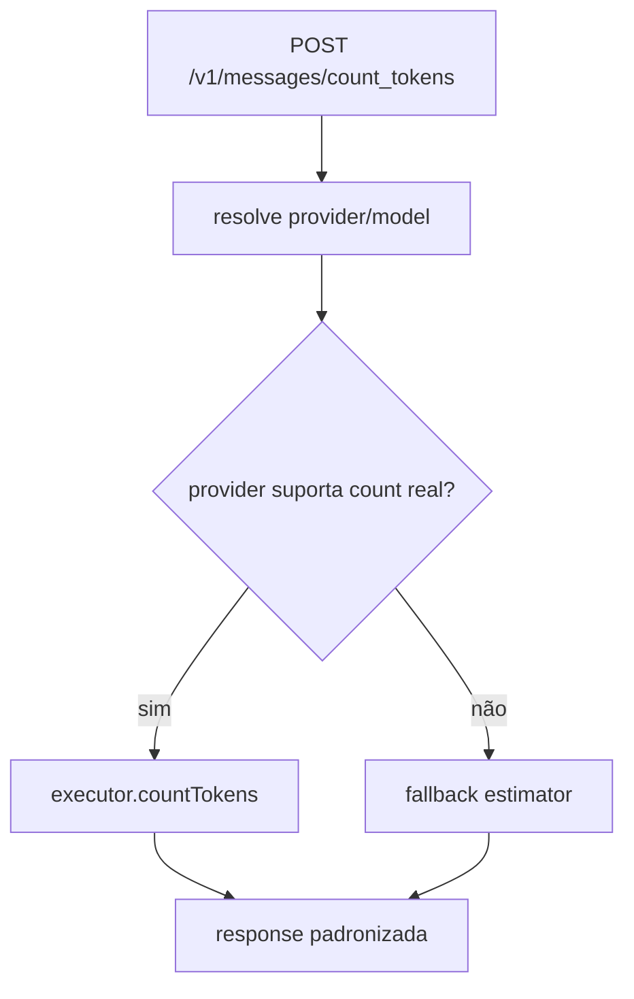

# 1. Título da Feature

Feature 27 — `count_tokens` Real por Provider (Sem Mock)

## 2. Objetivo

Substituir a implementação mock de `POST /v1/messages/count_tokens` por contagem real via upstream/provider sempre que houver suporte.

## 3. Motivação

Hoje o endpoint usa estimativa `chars/4`, útil apenas como fallback. Para orçamento, limites de contexto e roteamento inteligente, essa estimativa gera desvio operacional.

## 4. Problema Atual (Antes)

- Rota atual em `src/app/api/v1/messages/count_tokens/route.js` é mock.
- Resultado pode divergir significativamente do tokenizer real do provider.
- Decisões de fallback/custo ficam menos precisas.

### Antes vs Depois

| Dimensão                       | Antes       | Depois    |
| ------------------------------ | ----------- | --------- |
| Precisão de token count        | Baixa/média | Alta      |
| Compatibilidade com SDK Claude | Parcial     | Alta      |
| Planejamento de contexto       | Impreciso   | Confiável |
| Uso em política de custo       | Frágil      | Robusto   |

## 5. Estado Futuro (Depois)

Implementar fluxo híbrido:

- tentativa de `count_tokens` real no executor/provider;
- fallback para estimativa somente quando provider não suportar.

## 6. O que Ganhamos

- Melhor aderência aos limites reais de cada modelo.
- Base para políticas de preço, bloqueio preventivo e fallback por capacidade.
- Menos erro de “context window exceeded” em runtime.

## 7. Escopo

- Atualizar `src/app/api/v1/messages/count_tokens/route.js`.
- Estender contrato de executors para `countTokens` onde necessário.
- Padronizar resposta no formato Claude/OpenAI compatível.

## 8. Fora de Escopo

- Implementar token count real para 100% dos providers no primeiro ciclo.
- Bloquear requests de chat com base nessa contagem nesta fase.

## 9. Arquitetura Proposta



## 10. Mudanças Técnicas Detalhadas

Arquivos de referência:

- `src/app/api/v1/messages/count_tokens/route.js`
- `src/sse/services/model.js`
- `open-sse/executors/index.js`
- `open-sse/executors/base.js`
- `open-sse/utils/error.js`

Pseudo-código:

```js
if (executor?.countTokens) {
  return await executor.countTokens({ model, body, credentials });
}
return estimateTokensFallback(body);
```

## 11. Impacto em APIs Públicas / Interfaces / Tipos

- API alterada: `POST /v1/messages/count_tokens` (mesmo contrato externo, maior precisão).
- APIs novas: nenhuma obrigatória.
- Tipos/interfaces: novo tipo interno `CountTokensProviderResult`.
- Compatibilidade: non-breaking.

## 12. Passo a Passo de Implementação Futura

1. Extrair lógica mock atual para função de fallback.
2. Resolver provider/model da request.
3. Chamar `countTokens` real via executor quando disponível.
4. Uniformizar tratamento de erro/timeouts.
5. Adicionar telemetria para distinguir “real” vs “estimado”.
6. Documentar providers cobertos.

## 13. Plano de Testes

Cenários positivos:

1. Dado provider com suporte real, quando endpoint é chamado, então retorna token count real.
2. Dado provider sem suporte, quando endpoint é chamado, então retorna fallback estimado com indicador.
3. Dado payload multimodal, quando count real existe, então contagem considera estrutura completa.

Cenários de erro:

4. Dado timeout upstream, quando count real falha, então fallback estimado é aplicado sem erro fatal (quando configurado).
5. Dado request inválida, quando processar, então retorna 400 padronizado.

Regressão:

6. Dado clientes existentes, quando feature ativa, então contrato de resposta permanece compatível.

## 14. Critérios de Aceite

- [ ] Given provider suportado, When `count_tokens` é executado, Then o valor vem do provider real.
- [ ] Given provider não suportado, When executado, Then fallback estimado retorna sem quebra de contrato.
- [ ] Given falha de upstream, When política de fallback estiver ativa, Then o endpoint responde de forma controlada.
- [ ] Given monitoramento habilitado, When requests são processadas, Then métricas distinguem modo real e estimado.

## 15. Riscos e Mitigações

- Risco: aumento de latência no endpoint.
- Mitigação: timeout curto + cache oportunista em requests repetidas.

- Risco: comportamento divergente entre providers.
- Mitigação: camada de normalização de resposta.

## 16. Plano de Rollout

1. Ativar para 1-2 providers principais.
2. Expandir gradualmente por provider.
3. Tornar fallback explícito via campo de metadado.

## 17. Métricas de Sucesso

- Percentual de requests com token count real.
- Erro médio absoluto entre estimado e real.
- Queda de erros por estouro de contexto em chat.
