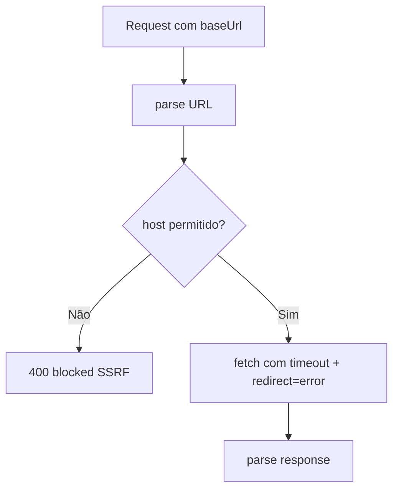

# 1. Título da Feature

Feature 36 — Hardening SSRF em Discovery e Validação de Providers

## 2. Objetivo

Blindar rotas que fazem `fetch` em URLs fornecidas pelo usuário para impedir SSRF, open redirect bypass e conexões indevidas em redes internas.

## 3. Motivação

Rotas de descoberta/validação de modelos são superfície de ataque clássica: se uma URL maliciosa passa, o servidor pode acessar recursos internos sensíveis.

## 4. Problema Atual (Antes)

- `src/app/api/providers/[id]/models/route.js` usa `fetch` direto para `baseUrl/models`.
- `src/app/api/provider-nodes/validate/route.js` usa `fetch` sem bloqueio de hosts privados.
- Não há política uniforme de `timeout`, `redirect: "error"` e bloqueio de ranges privados.

### Antes vs Depois

| Dimensão           | Antes                 | Depois                                 |
| ------------------ | --------------------- | -------------------------------------- |
| SSRF private hosts | Parcial/inexistente   | Bloqueio explícito IPv4/IPv6/localhost |
| Redirect bypass    | Sem bloqueio uniforme | `redirect: "error"`                    |
| Timeouts           | Variável              | Timeout padrão obrigatório             |
| Segurança por rota | Fragmentada           | Política centralizada                  |

## 5. Estado Futuro (Depois)

Todas as rotas de outbound user-driven fetch devem:

- validar URL,
- bloquear private/loopback/link-local,
- negar redirects automáticos,
- impor timeout e limites de resposta.

## 6. O que Ganhamos

- Redução substancial de risco SSRF.
- Menor exposição de metadados internos/rede local.
- Base reutilizável para futuras integrações de provider.

## 7. Escopo

- Endpoints de descoberta e validação de providers.
- Utilitário compartilhado para validação de URL de saída.
- Padronização de mensagens de erro de segurança.

## 8. Fora de Escopo

- WAF externo.
- ACL de rede no infra.
- Proteção de SSRF em serviços fora da app.

## 9. Arquitetura Proposta



## 10. Mudanças Técnicas Detalhadas

Arquivos de referência:

- `src/app/api/providers/[id]/models/route.js`
- `src/app/api/provider-nodes/validate/route.js`
- `open-sse/utils/proxyFetch.js`

Criar utilitário recomendado:

- `src/shared/utils/outboundUrlGuard.js`

Responsabilidades:

1. `parseAndValidatePublicUrl(url)`
2. `isPrivateHost(hostname)` cobrindo:

- `localhost`, `127.0.0.0/8`, `10.0.0.0/8`, `172.16.0.0/12`, `192.168.0.0/16`, `169.254.0.0/16`, `::1`, `fe80::/10`, `fc00::/7`, `::ffff:*`

3. Normalização e rejeição de caracteres inválidos

Snippet de direção:

```js
const target = parseAndValidatePublicUrl(`${baseUrl}/models`);
const res = await fetch(target.toString(), {
  method: "GET",
  headers,
  signal: AbortSignal.timeout(10_000),
  redirect: "error",
});
```

## 11. Impacto em APIs Públicas / Interfaces / Tipos

- APIs novas: nenhuma.
- APIs alteradas: mensagens de erro mais específicas em `/api/providers/*`.
- Compatibilidade: **non-breaking**, com rejeição de payloads inseguros.

## 12. Passo a Passo de Implementação Futura

1. Extrair e implementar `outboundUrlGuard`.
2. Aplicar guard nas duas rotas críticas.
3. Aplicar timeout/redirect policy uniforme.
4. Adicionar logs de bloqueio com contexto mínimo.
5. Cobrir testes de segurança.

## 13. Plano de Testes

Cenários positivos:

1. URL pública válida passa e retorna modelos.
2. URL HTTPS com path normalizado passa.

Cenários de erro:

3. `http://127.0.0.1:...` bloqueado.
4. `http://169.254.169.254/...` bloqueado.
5. URL com redirect 302 para private host bloqueada.
6. Timeout retorna erro 504 controlado.

Regressão:

7. Fluxo normal de validação continua funcionando para providers reais.

Compatibilidade retroativa:

8. Mensagens antigas de “invalid API key” preservadas para status 401/403.

## 14. Critérios de Aceite

- [ ] Given host privado, When validar provider, Then request é bloqueada antes do fetch.
- [ ] Given redirect inesperado, When fetch de modelos ocorre, Then redirect é negado.
- [ ] Given provider legítimo, When validar, Then comportamento funcional permanece.
- [ ] Given timeout, When endpoint demora, Then resposta é erro controlado e sem crash.

## 15. Riscos e Mitigações

- Risco: falso positivo bloqueando provedores legítimos em redes privadas intencionais.
- Mitigação: feature flag opcional para ambientes self-hosted avançados com aviso explícito.

## 16. Plano de Rollout

1. Habilitar guard em staging.
2. Auditar logs de bloqueio por uma semana.
3. Ativar em produção por padrão.

## 17. Métricas de Sucesso

- Contagem de tentativas SSRF bloqueadas.
- Zero incidentes de acesso indevido interno via rotas de provider.
- Tempo de resposta estável após hardening.

## 18. Dependências entre Features

- Complementa `feature-safe-outbound-fetch-centralizado-17.md`.

## 19. Checklist Final da Feature

- [ ] Guard de URL implementável.
- [ ] Rotas críticas protegidas.
- [ ] Testes SSRF completos.
- [ ] Observabilidade de bloqueios ativa.
