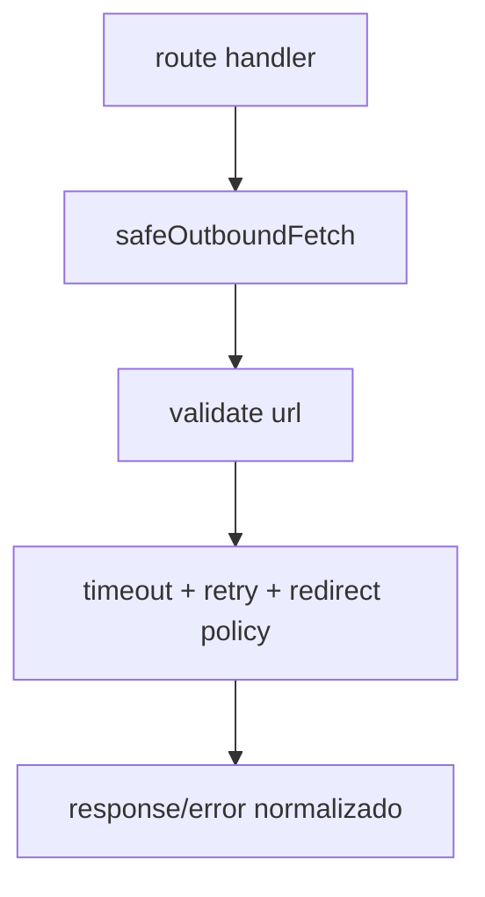

# 1. Título da Feature

Feature 39 — Safe Outbound Fetch Centralizado

## 2. Objetivo

Criar um wrapper único para chamadas HTTP de saída em rotas administrativas e utilitárias, padronizando timeout, retry idempotente, política de redirect e classificação de erro.

## 3. Motivação

Hoje existem múltiplos `fetch` diretos espalhados, o que aumenta inconsistência de comportamento em timeout/retry e dificulta hardening.

## 4. Problema Atual (Antes)

- Várias rotas usam `fetch` sem política comum.
- Retries/timeout variam por endpoint.
- Diagnóstico de falhas de rede fica fragmentado.

### Antes vs Depois

| Dimensão    | Antes                 | Depois                          |
| ----------- | --------------------- | ------------------------------- |
| Timeout     | Variável              | Padrão único por classe de rota |
| Retry       | Inconsistente         | Retry idempotente padronizado   |
| Redirect    | Nem sempre controlado | Política explícita              |
| Diagnóstico | Disperso              | Erros tipados/normalizados      |

## 5. Estado Futuro (Depois)

Módulo único `safeOutboundFetch` consumido por endpoints de provider/management/usage.

## 6. O que Ganhamos

- Menos bugs de rede difíceis de reproduzir.
- Mais consistência de segurança.
- Menor duplicação de lógica.

## 7. Escopo

- Criar utilitário compartilhado.
- Migrar rotas de alto risco primeiro.
- Definir presets de fetch por cenário.

## 8. Fora de Escopo

- Refatorar todo o código de rede de uma vez.
- SDK completo de providers.

## 9. Arquitetura Proposta



## 10. Mudanças Técnicas Detalhadas

Arquivos de referência:

- `src/app/api/providers/[id]/models/route.js`
- `src/app/api/provider-nodes/validate/route.js`
- `open-sse/utils/proxyFetch.js`

Novo módulo sugerido:

- `src/shared/network/safeOutboundFetch.js`

Contrato sugerido:

```js
safeOutboundFetch(url, {
  method: "GET",
  headers,
  timeoutMs: 10000,
  allowRedirect: false,
  retry: { attempts: 2, backoffMs: [500, 1000], methods: ["GET", "PUT"] },
  guard: "public-only",
});
```

## 11. Impacto em APIs Públicas / Interfaces / Tipos

- APIs novas: nenhuma.
- APIs alteradas: apenas padronização de erro interno.
- Compatibilidade: **non-breaking**.

## 12. Passo a Passo de Implementação Futura

1. Definir interface do wrapper.
2. Implementar timeout + retry idempotente.
3. Integrar URL guard e redirect policy.
4. Migrar rotas críticas.
5. Medir regressão/latência.

## 13. Plano de Testes

Cenários positivos:

1. GET idempotente com falha transitória recupera com retry.

Cenários de erro:

2. Timeout dispara erro controlado.
3. Redirect bloqueado retorna erro explícito.

Regressão:

4. Rotas migradas mantêm contrato de resposta.

Compatibilidade retroativa:

5. Rotas não migradas continuam operando até migração gradual.

## 14. Critérios de Aceite

- [ ] Given falha transitória de rede, When método idempotente é chamado, Then retry ocorre conforme preset.
- [ ] Given timeout, When estoura limite, Then erro padrão de timeout é retornado.
- [ ] Given redirect não permitido, When resposta 3xx ocorre, Then chamada é bloqueada.

## 15. Riscos e Mitigações

- Risco: retry excessivo aumentar latência.
- Mitigação: presets conservadores e por método.

## 16. Plano de Rollout

1. Introduzir wrapper sem migração forçada.
2. Migrar endpoints mais críticos.
3. Expandir para restante das rotas.

## 17. Métricas de Sucesso

- Redução de variação de timeout por rota.
- Menos incidentes de rede sem diagnóstico.

## 18. Dependências entre Features

- Suporta `feature-hardening-ssrf-discovery-e-validacao-de-providers-14.md`.

## 19. Checklist Final da Feature

- [ ] Wrapper implementável.
- [ ] Presets definidos.
- [ ] Endpoints críticos migrados.
- [ ] Testes de timeout/retry/redirect concluídos.
