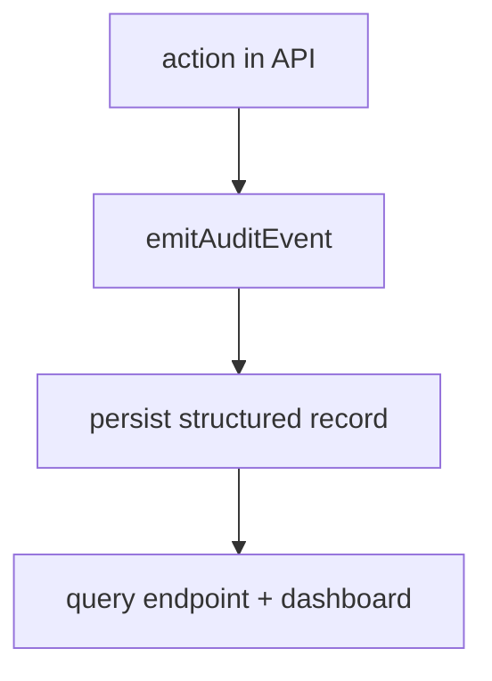

# 1. Título da Feature

Feature 43 — Observabilidade de Auditoria e Ações Administrativas

## 2. Objetivo

Expandir o audit log para registrar de forma estruturada ações administrativas e eventos críticos de segurança/operação.

## 3. Motivação

Já existe trilha de auditoria básica, mas faltam campos e eventos consistentes para investigação operacional e compliance interno.

## 4. Problema Atual (Antes)

- Auditoria existe, porém com cobertura parcial de ações.
- Nem toda ação sensível registra actor/target/metadata de forma padronizada.
- Investigações exigem cruzamento manual de logs dispersos.

### Antes vs Depois

| Dimensão                  | Antes   | Depois                              |
| ------------------------- | ------- | ----------------------------------- |
| Cobertura de eventos      | Parcial | Expandida e padronizada             |
| Correlação de incidentes  | Manual  | Mais direta via campos estruturados |
| Transparência operacional | Média   | Alta                                |

## 5. Estado Futuro (Depois)

Audit log com esquema consistente para eventos críticos:

- login/logout,
- alteração de credenciais,
- revogação,
- bloqueios de segurança (SSRF/rate-limit),
- ações administrativas de manutenção.

## 6. O que Ganhamos

- Investigação mais rápida.
- Melhor rastreabilidade de mudanças.
- Base para alertas operacionais.

## 7. Escopo

- Padronização de payload de auditoria.
- Expansão de eventos.
- Endpoint de consulta com filtros.

## 8. Fora de Escopo

- SIEM externo nesta fase.
- Retenção legal avançada por jurisdição.

## 9. Arquitetura Proposta

## 10. Mudanças Técnicas Detalhadas

Arquivos de referência:

- `src/lib/compliance/index.js`
- `src/app/api/compliance/audit-log/route.js`
- `src/app/api/auth/login/route.js`

Campos recomendados:

- `action`, `actor`, `target`, `resourceType`, `status`, `ip`, `requestId`, `metadata`, `createdAt`

Eventos mínimos:

- `auth.login.success`
- `auth.login.blocked_rate_limit`
- `provider.validation.ssrf_blocked`
- `provider.credentials.updated`
- `sync.token.created/revoked`

## 11. Impacto em APIs Públicas / Interfaces / Tipos

- APIs novas: opcional `GET /api/compliance/audit-log` com filtros adicionais.
- APIs alteradas: enriquecimento do payload de log.
- Compatibilidade: **non-breaking**.

## 12. Passo a Passo de Implementação Futura

1. Definir contrato de evento.
2. Atualizar emissores nas rotas críticas.
3. Enriquecer endpoint de consulta.
4. Adicionar retenção e paginação mais eficiente.

## 13. Plano de Testes

Cenários positivos:

1. Login bem-sucedido gera evento com actor/ip.
2. Bloqueio de SSRF gera evento com motivo e rota.

Cenários de erro:

3. Falha de persistência de log não quebra request principal.

Regressão:

4. Endpoint atual de audit continua funcional.

Compatibilidade retroativa:

5. Eventos antigos continuam legíveis sem migração disruptiva.

## 14. Critérios de Aceite

- [ ] Given ação sensível, When executada, Then evento estruturado é gravado.
- [ ] Given consulta com filtros, When chamada, Then retorna resultados paginados corretos.
- [ ] Given falha de log, When ocorrer, Then fluxo principal não é interrompido.

## 15. Riscos e Mitigações

- Risco: volume alto de log.
- Mitigação: níveis de criticidade e retenção configurável.

## 16. Plano de Rollout

1. Ativar eventos críticos primeiro.
2. Expandir para eventos secundários.
3. Revisar retenção/custos.

## 17. Métricas de Sucesso

- Cobertura de eventos críticos.
- Tempo de investigação de incidentes.
- Taxa de eventos sem actor/target (deve cair).

## 18. Dependências entre Features

- Complementa `feature-rate-limit-de-login-e-endpoints-sensiveis-16.md`.
- Complementa `feature-hardening-ssrf-discovery-e-validacao-de-providers-14.md`.

## 19. Checklist Final da Feature

- [ ] Contrato de auditoria definido.
- [ ] Eventos críticos instrumentados.
- [ ] Consulta/paginação validada.
- [ ] Política de retenção revisada.
