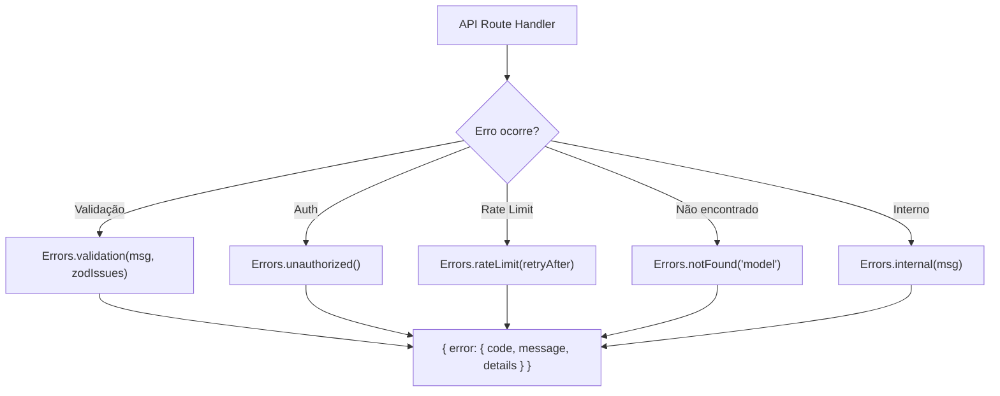

# 1. Título da Feature

Feature 81 — Sistema de Erros Estruturado com Códigos Tipados

## 2. Objetivo

Criar um módulo centralizado de erros (`src/shared/errors.js`) com códigos tipados, categorias semânticas e helpers padronizados para todas as respostas de erro da API, eliminando strings hardcoded e formatos inconsistentes.

## 3. Motivação

O projeto `cliproxyapi-dashboard` implementa 30+ códigos de erro organizados por categoria (AUTH, VALIDATION, RATE_LIMIT, NOT_FOUND, CONFLICT, PROVIDER, INTERNAL) com uma classe `APIError`, helpers estáticos (`Errors.internal()`, `Errors.unauthorized()`, etc.) e formato de resposta padrão. Isso permite que qualquer client (dashboard, CLI, integração) interprete erros de forma programática, sem depender de parsing de mensagens de texto.

No OmniRoute, os erros são retornados com formatos variados — às vezes `{ error: "mensagem" }`, às vezes `{ message: "mensagem" }`, às vezes apenas status HTTP sem body. Isso dificulta debugging, tratamento automático no dashboard e integração com tools de CLI como Codex/Claude.

## 4. Problema Atual (Antes)

- Erros retornados com formatos inconsistentes entre rotas.
- Mensagens de erro como strings livres sem código máquina-legível.
- Dashboard precisa fazer parsing heurístico para exibir erros ao usuário.
- Impossível para clients automatizados reagirem a tipos específicos de erro.
- Detalhes internos podem vazar para clients em respostas de erro.

### Antes vs Depois

| Dimensão                | Antes                           | Depois                                         |
| ----------------------- | ------------------------------- | ---------------------------------------------- |
| Formato de erro         | Variável por rota               | Padrão `{ error: { code, message, details } }` |
| Código máquina-legível  | Inexistente                     | 30+ códigos tipados por categoria              |
| Tratamento no dashboard | Parsing heurístico de strings   | Switch/case por `error.code`                   |
| Segurança de informação | Vazamento potencial de detalhes | Mensagens genéricas + log server-side          |
| DX de manutenção        | Cada rota inventa seu formato   | Uma chamada `Errors.validation(msg, details)`  |

## 5. Estado Futuro (Depois)

Todas as rotas API usarão helpers do módulo `errors.js`:

```js
// Antes (ad-hoc)
return res.status(500).json({ error: "Something went wrong" });

// Depois (padronizado)
return Errors.internal("Processing failed");
// → 500 { error: { code: "INTERNAL_SERVER_ERROR", message: "Processing failed" } }
```

## 6. O que Ganhamos

- Consistência total nas respostas de erro da API.
- Dashboard pode tratar erros por código em vez de parsear strings.
- CLIs como Codex/Claude recebem erros interpretáveis programaticamente.
- Detalhes de debug ficam nos logs server-side, não no response.
- Validação com Zod retorna `details` estruturado com field-level errors.
- Facilita internacionalização futura (traduzir por código, não por mensagem).

## 7. Escopo

- Novo módulo: `src/shared/errors.js`.
- Constantes de código: `ERROR_CODE` com 30+ valores categorizados.
- Classe: `APIError extends Error` com `code`, `status`, `message`, `details`.
- Helpers estáticos: `Errors.internal()`, `Errors.unauthorized()`, `Errors.forbidden()`, `Errors.notFound()`, `Errors.validation()`, `Errors.conflict()`, `Errors.rateLimit()`.
- Migração gradual das rotas existentes para usar os helpers.

## 8. Fora de Escopo

- Reformulação completa de todos os handlers para usar os novos erros de uma vez.
- Implementação de internacionalização das mensagens de erro.
- Alteração dos códigos HTTP retornados (apenas padronização do body).

## 9. Arquitetura Proposta



## 10. Mudanças Técnicas Detalhadas

### Módulo `src/shared/errors.js`

```js
const ERROR_CODE = {
  // Auth
  AUTH_FAILED: "AUTH_FAILED",
  AUTH_TOKEN_EXPIRED: "AUTH_TOKEN_EXPIRED",
  AUTH_UNAUTHORIZED: "AUTH_UNAUTHORIZED",

  // Validation
  VALIDATION_ERROR: "VALIDATION_ERROR",
  VALIDATION_MISSING_FIELDS: "VALIDATION_MISSING_FIELDS",

  // Rate Limiting
  RATE_LIMIT_EXCEEDED: "RATE_LIMIT_EXCEEDED",

  // Not Found
  RESOURCE_NOT_FOUND: "RESOURCE_NOT_FOUND",
  MODEL_NOT_FOUND: "MODEL_NOT_FOUND",
  PROVIDER_NOT_FOUND: "PROVIDER_NOT_FOUND",

  // Conflicts
  RESOURCE_ALREADY_EXISTS: "RESOURCE_ALREADY_EXISTS",
  KEY_ALREADY_EXISTS: "KEY_ALREADY_EXISTS",
  LIMIT_REACHED: "LIMIT_REACHED",

  // Provider
  PROVIDER_INVALID: "PROVIDER_INVALID",
  PROVIDER_ERROR: "PROVIDER_ERROR",
  PROVIDER_TIMEOUT: "PROVIDER_TIMEOUT",
  PROVIDER_QUOTA_EXCEEDED: "PROVIDER_QUOTA_EXCEEDED",

  // Internal
  INTERNAL_SERVER_ERROR: "INTERNAL_SERVER_ERROR",
  DATABASE_ERROR: "DATABASE_ERROR",
  CONFIG_ERROR: "CONFIG_ERROR",
};

class APIError extends Error {
  constructor(code, message, status, details) {
    super(message);
    this.code = code;
    this.status = status;
    this.details = details;
  }

  toJSON() {
    return {
      error: {
        code: this.code,
        message: this.message,
        ...(this.details && { details: this.details }),
      },
    };
  }
}

class Errors {
  static internal(message, logDetails) {
    if (logDetails) logger.error(message, logDetails);
    return res
      .status(500)
      .json(
        new APIError(
          ERROR_CODE.INTERNAL_SERVER_ERROR,
          message || "Internal server error",
          500
        ).toJSON()
      );
  }

  static unauthorized(message) {
    return res
      .status(401)
      .json(new APIError(ERROR_CODE.AUTH_UNAUTHORIZED, message || "Unauthorized", 401).toJSON());
  }

  static notFound(resource) {
    return res
      .status(404)
      .json(
        new APIError(
          ERROR_CODE.RESOURCE_NOT_FOUND,
          `${resource || "Resource"} not found`,
          404
        ).toJSON()
      );
  }

  static validation(message, details) {
    return res
      .status(400)
      .json(new APIError(ERROR_CODE.VALIDATION_ERROR, message, 400, details).toJSON());
  }

  static rateLimit(retryAfter) {
    const headers = retryAfter ? { "Retry-After": String(retryAfter) } : {};
    return res
      .status(429)
      .set(headers)
      .json(new APIError(ERROR_CODE.RATE_LIMIT_EXCEEDED, "Rate limit exceeded", 429).toJSON());
  }

  static conflict(message) {
    return res
      .status(409)
      .json(new APIError(ERROR_CODE.RESOURCE_ALREADY_EXISTS, message, 409).toJSON());
  }
}
```

### Migração de rota existente (exemplo)

```diff
// src/api/models.js
- return res.status(500).json({ error: 'Failed to fetch models' });
+ return Errors.internal('Failed to fetch models', err);

- return res.status(404).json({ message: 'Model not found' });
+ return Errors.notFound('Model');

- return res.status(400).json({ error: 'Invalid provider' });
+ return Errors.validation('Invalid provider name');
```

Referência original (cliproxyapi-dashboard): `dashboard/src/lib/errors.ts`

## 11. Impacto em APIs Públicas / Interfaces / Tipos

- APIs alteradas: body de erro muda de formato livre para `{ error: { code, message, details? } }`.
- Compatibilidade: **soft-breaking** — clients que verificam apenas status HTTP não são afetados; clients que parseiam body de erro precisam se adaptar.
- Estratégia de transição: migração gradual rota por rota; dashboard atualizado para consumir novo formato.

## 12. Passo a Passo de Implementação Futura

1. Criar `src/shared/errors.js` com `ERROR_CODE`, `APIError` e `Errors`.
2. Criar middleware Express de error handler que converte `APIError` thrown em response padronizado.
3. Migrar rotas de `/api/settings` (mais simples) como piloto.
4. Migrar rotas de `/api/models` e `/api/providers`.
5. Migrar handlers SSE (`src/sse/handlers/*`).
6. Atualizar dashboard para consumir `error.code` nas chamadas de API.
7. Documentar códigos de erro na página `/docs`.

## 13. Plano de Testes

Cenários positivos:

1. Dado request com body inválido, quando rota usa `Errors.validation()`, então response contém `{ error: { code: "VALIDATION_ERROR", message, details } }`.
2. Dado request sem auth, quando rota usa `Errors.unauthorized()`, então response tem status 401 e código `AUTH_UNAUTHORIZED`.

Cenários de erro: 3. Dado exception não tratada, quando error middleware captura, então retorna `INTERNAL_SERVER_ERROR` sem vazar stack trace.

Regressão: 4. Dado client legado que verifica apenas status HTTP, quando erro ocorre com novo formato, então status code permanece idêntico.

## 14. Critérios de Aceite

- [ ] Módulo `errors.js` criado com todos os códigos documentados.
- [ ] Pelo menos 3 rotas migradas para usar helpers.
- [ ] Dashboard consome e exibe erros por código.
- [ ] Nenhum stack trace ou detalhe interno vaza na response.
- [ ] Testes de formato de erro passam.

## 15. Riscos e Mitigações

- Risco: clients existentes quebram ao esperar formato antigo.
- Mitigação: migração gradual + período de transição com ambos formatos se necessário.

- Risco: overhead de manutenção dos códigos de erro.
- Mitigação: enum centralizado; novos códigos adicionados sob demanda, não preventivamente.

## 16. Plano de Rollout

1. Implementar módulo e middleware sem alterar rotas existentes.
2. Migrar rotas de settings e models como piloto.
3. Validar no dashboard que erros exibem corretamente.
4. Migrar rotas restantes em batch.

## 17. Métricas de Sucesso

- 100% das rotas API retornando formato padronizado.
- Zero vazamento de detalhes internos em responses de erro.
- Dashboard tratando erros por código ao invés de string matching.

## 18. Dependências entre Features

- Complementa `feature-35-rate-limit-de-login-e-endpoints-sensiveis.md` — erros de rate limit usam `RATE_LIMIT_EXCEEDED`.
- Complementa `feature-38-erro-model-cooldown-com-retry-after.md` — cooldown errors usam código tipado.

## 19. Checklist Final da Feature

- [ ] Módulo `src/shared/errors.js` criado e funcional.
- [ ] `ERROR_CODE` com 20+ códigos categorizados.
- [ ] Classe `APIError` com serialização `toJSON()`.
- [ ] Helpers `Errors.*` para todos os status comuns.
- [ ] Middleware de error handler Express integrado.
- [ ] Pelo menos 5 rotas migradas.
- [ ] Dashboard atualizado para consumir `error.code`.
- [ ] Documentação de códigos de erro disponível.
- [ ] Sem breaking change em status HTTP.
