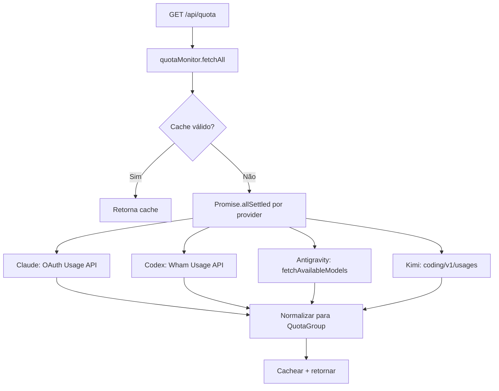

# 1. Título da Feature

Feature 82 — Monitoramento de Quota Real-Time por Provider com Endpoint Unificado

## 2. Objetivo

Implementar um endpoint `/api/quota` que agrega informações de quota de todos os providers configurados (Claude, Codex, Gemini, Antigravity, Kimi) em tempo real, exibindo limites, consumo e tempo de reset no dashboard.

## 3. Motivação

O `cliproxyapi-dashboard` implementa um sistema de quota monitoring sofisticado que consulta APIs específicas de cada provider:

- **Antigravity**: `POST https://daily-cloudcode-pa.googleapis.com/v1internal:fetchAvailableModels` para status de modelos disponíveis.
- **Codex**: Wham Usage API com parsing de `primary_window` e `secondary_window` (usado/limite/reset).
- **Claude**: OAuth Usage API com rate limits (requests/tokens) e reset times.
- **Kimi**: `api.kimi.com/coding/v1/usages` com quota semanal e rate limit de 5 horas.

No OmniRoute, não existe visibilidade proativa sobre o estado de quota dos providers. O usuário só descobre que a quota acabou quando recebe erro 429, gerando experiência ruim e retries desnecessários.

## 4. Problema Atual (Antes)

- Zero visibilidade sobre quota restante de qualquer provider.
- Descoberta de exaustão é reativa (após erro 429/403 do upstream).
- Dashboard não exibe informação de rate limit ou tempo de reset.
- Impossível planejar uso baseado em quota disponível.
- Sem comparação cross-provider para escolher melhor rota.

### Antes vs Depois

| Dimensão                   | Antes                    | Depois                                        |
| -------------------------- | ------------------------ | --------------------------------------------- |
| Visibilidade de quota      | Nenhuma                  | Real-time por provider e por modelo           |
| Descoberta de exaustão     | Reativa (pós-erro 429)   | Proativa com percentual e tempo de reset      |
| Planejamento de roteamento | Impossível               | Baseado em quota disponível                   |
| UX do dashboard            | Sem indicadores de quota | Cards de quota com barra de progresso e reset |

## 5. Estado Futuro (Depois)

Endpoint `GET /api/quota` retorna agregação unificada:

```json
{
  "providers": [
    {
      "name": "claude",
      "status": "ok",
      "groups": [
        {
          "id": "primary-window",
          "label": "3-Hour Window",
          "remainingFraction": 0.72,
          "resetTime": "2026-02-16T23:00:00Z",
          "models": [
            { "id": "claude-sonnet-4", "displayName": "Claude Sonnet 4", "remainingFraction": 0.72 }
          ]
        }
      ]
    },
    {
      "name": "codex",
      "status": "degraded",
      "groups": [
        {
          "id": "primary-window",
          "label": "Hourly Limit",
          "remainingFraction": 0.15,
          "resetTime": "2026-02-16T20:30:00Z"
        }
      ]
    }
  ]
}
```

## 6. O que Ganhamos

- Visibilidade instantânea de quota para todos os providers ativos.
- Dashboard exibe porcentagem restante, tempo de reset e status por modelo.
- Roteamento inteligente pode usar quota como sinal para escolha de provider.
- Redução de retries desnecessários em providers exauridos.
- Base para feature de preflight quota (feature-04).

## 7. Escopo

- Novo endpoint API: `src/api/routes/quota.js`.
- Novo serviço: `src/shared/services/quotaMonitor.js`.
- Parsers por provider: `quotaParsers/claude.js`, `codex.js`, `antigravity.js`, `kimi.js`.
- Componente dashboard: `QuotaOverview.js` com cards de quota.
- Cache de quota com TTL curto (30s para evitar overload).

## 8. Fora de Escopo

- Implementação de ação automática baseada em quota (ver feature-04).
- Persistência histórica de quota (apenas snapshot em tempo real).
- Suporte a providers sem API de quota pública (exibir "indisponível").

## 9. Arquitetura Proposta



## 10. Mudanças Técnicas Detalhadas

### Parser Antigravity (referência: `dashboard/src/app/api/quota/route.ts`)

```js
async function fetchAntigravityQuota(authIndex) {
  const response = await fetch(MANAGEMENT_URL + "/api-call", {
    method: "POST",
    headers: { Authorization: `Bearer ${MGMT_KEY}`, "Content-Type": "application/json" },
    signal: AbortSignal.timeout(30_000),
    body: JSON.stringify({
      auth_index: authIndex,
      method: "POST",
      url: "https://daily-cloudcode-pa.googleapis.com/v1internal:fetchAvailableModels",
      header: {
        Authorization: "Bearer $TOKEN$",
        "Content-Type": "application/json",
        "User-Agent": "antigravity/1.11.5 windows/amd64",
      },
      data: "{}",
    }),
  });
  // Parse model availability and status
}
```

### Parser Codex (referência: `parseCodexQuota`)

```js
function parseCodexQuota(data) {
  const groups = [];
  const windows = [
    { key: "primary", label: "Primary", window: data.rate_limit?.primary_window },
    { key: "secondary", label: "Secondary", window: data.rate_limit?.secondary_window },
  ];

  for (const { key, window } of windows) {
    if (!window || window.used_percent === undefined) continue;
    const remainingFraction = Math.max(0, Math.min(1, 1 - window.used_percent / 100));
    const resetTime = window.reset_at ? new Date(window.reset_at * 1000).toISOString() : null;
    groups.push({
      id: `${key}-window`,
      label: formatWindowLabel(window.limit_window_seconds),
      remainingFraction,
      resetTime,
    });
  }
  return groups;
}
```

### Estrutura de dados normalizada

```js
// QuotaGroup — formato unificado para qualquer provider
{
  id: string,           // "primary-window", "model-claude-sonnet-4"
  label: string,        // "3-Hour Window", "Claude Sonnet 4"
  remainingFraction: number, // 0.0 a 1.0
  resetTime: string|null,   // ISO 8601 ou null
  models: [{ id, displayName, remainingFraction, resetTime }] // opcional
}
```

Referência original: `dashboard/src/app/api/quota/route.ts` (~237 linhas)

## 11. Impacto em APIs Públicas / Interfaces / Tipos

- APIs novas: `GET /api/quota` — endpoint novo, sem breaking change.
- Compatibilidade: **non-breaking** — endpoint aditivo.

## 12. Passo a Passo de Implementação Futura

1. Criar estrutura de dados `QuotaGroup` e `ProviderQuota`.
2. Implementar parser para cada provider suportado (Claude → Codex → Antigravity → Kimi).
3. Criar serviço `quotaMonitor.js` com `fetchAll()` usando `Promise.allSettled`.
4. Adicionar cache LRU com TTL de 30s (ver feature-84).
5. Criar rota `GET /api/quota` com autenticação.
6. Criar componente dashboard `QuotaOverview` com cards e barras de progresso.
7. Adicionar timeout de 30s em todas as chamadas upstream (`AbortSignal.timeout`).
8. Tratar providers sem quota API como `{ status: "not_available" }`.

## 13. Plano de Testes

Cenários positivos:

1. Dado provider Claude com quota 72% restante, quando `/api/quota` chamado, então response contém `remainingFraction: 0.72` e `resetTime`.
2. Dado múltiplos providers, quando `/api/quota` chamado, então todos executam em paralelo e response agrega resultados.
3. Dado cache válido (< 30s), quando `/api/quota` chamado novamente, então retorna cache sem nova chamada upstream.

Cenários de erro: 4. Dado provider Codex com timeout, quando `Promise.allSettled` resolve, então provider Codex aparece com `status: "error"` e demais providers funcionam normalmente. 5. Dado provider sem API de quota, quando `/api/quota` chamado, então provider aparece com `status: "not_available"`.

Regressão: 6. Dado nenhum provider de quota configurado, quando `/api/quota` chamado, então retorna array vazio sem erro.

## 14. Critérios de Aceite

- [ ] Endpoint `/api/quota` operacional e autenticado.
- [ ] Pelo menos 2 providers com parser implementado.
- [ ] Respostas normalizadas no formato `QuotaGroup`.
- [ ] Cache com TTL de 30s funcionando.
- [ ] Timeout de 30s em chamadas upstream.
- [ ] Erros de provider isolados (um provider com erro não derruba os outros).
- [ ] Dashboard exibe quota visual com barras de progresso.

## 15. Riscos e Mitigações

- Risco: APIs de quota dos providers mudam sem aviso.
- Mitigação: parsers tolerantes com fallback para `status: "error"` + logging.

- Risco: overhead de chamadas de quota adicionais.
- Mitigação: cache TTL de 30s + `Promise.allSettled` paralelo.

- Risco: credenciais OAuth necessárias para algumas APIs de quota.
- Mitigação: providers sem credencial retornam `not_available`.

## 16. Plano de Rollout

1. Implementar parser de Claude (mais simples) como piloto.
2. Validar no dashboard com mock e depois com dados reais.
3. Adicionar Codex e Antigravity incrementalmente.
4. Ativar refresh automático no dashboard (polling 30s).

## 17. Métricas de Sucesso

- Redução de requests que falham por quota (usuário evita providers exauridos).
- Aumento de tempo médio de decisão antes de request (proatividade).
- Uso da informação de quota pelo sistema de roteamento inteligente.

## 18. Dependências entre Features

- Complementa `feature-04-quota-preflight-e-troca-proativa.md` — fornece dados de quota que o preflight consome.
- Complementa `feature-06-monitoramento-quota-em-sessao.md` — agrega dados de sessão com dados de API.
- Depende de `feature-84-cache-lru-com-ttl-e-invalidacao.md` para caching eficiente.

## 19. Checklist Final da Feature

- [ ] Endpoint `GET /api/quota` criado e protegido.
- [ ] Parsers para Claude, Codex, Antigravity implementados.
- [ ] Formato `QuotaGroup` normalizado e documentado.
- [ ] Cache TTL 30s com invalidação.
- [ ] Timeout 30s em todas as chamadas upstream.
- [ ] Isolamento de falha por provider (`Promise.allSettled`).
- [ ] Componente de dashboard com visualização.
- [ ] Testes de parsing por provider.
