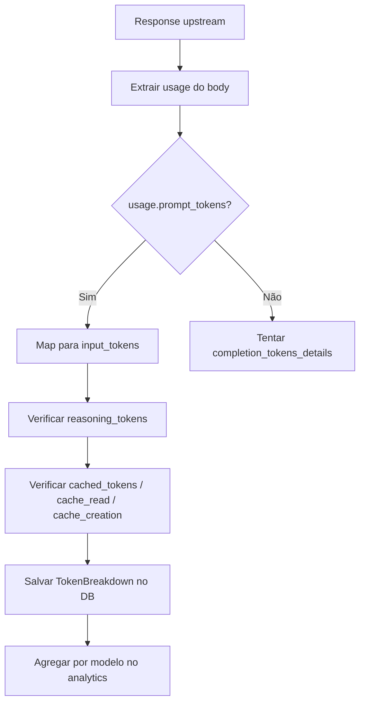

# 1. Título da Feature

Feature 83 — Breakdown Granular de Tokens por Modelo (Input/Output/Reasoning/Cached)

## 2. Objetivo

Enriquecer o tracking de usage existente com decomposição de tokens em 4 categorias: `input_tokens`, `output_tokens`, `reasoning_tokens` e `cached_tokens`, permitindo análise precisa de custos e otimização de prompts.

## 3. Motivação

O `cliproxyapi-dashboard` implementa uma estrutura `TokenDetails` que captura 5 dimensões de tokens por request:

```typescript
interface TokenDetails {
  input_tokens: number;
  output_tokens: number;
  reasoning_tokens: number;
  cached_tokens: number;
  total_tokens: number;
}
```

Além disso, agrega essas métricas por modelo dentro de cada API, permitindo:

- Análise de custo real (input ≠ output em pricing para Claude/GPT).
- Visibilidade de tokens de reasoning (relevante para o1/o3 da OpenAI).
- Tracking de cached tokens (economia real por prompt caching).
- Identificação de modelos com alto ratio input/output.

No OmniRoute, o analytics atual rastreia `totalTokens` como número único, perdendo granularidade essencial para análise de custos.

## 4. Problema Atual (Antes)

- Apenas `totalTokens` é registrado por request.
- Impossível saber quanto do custo é input vs output (diferem em preço por 3-5x).
- Reasoning tokens (o1, o3) não são diferenciados do output regular.
- Cached tokens (Claude prompt caching, GPT caching) invisíveis.
- Dashboard exibe apenas total, impedindo otimização de prompts.

### Antes vs Depois

| Dimensão              | Antes               | Depois                                      |
| --------------------- | ------------------- | ------------------------------------------- |
| Granularidade         | `totalTokens` único | 4 categorias: input/output/reasoning/cached |
| Análise de custo      | Imprecisa           | Precisa por categoria (preços diferem)      |
| Reasoning tokens      | Invisíveis          | Rastreados separadamente                    |
| Prompt caching        | Sem visibilidade    | Cached tokens quantificados                 |
| Otimização de prompts | Sem dados           | Ratio input/output por modelo visível       |

## 5. Estado Futuro (Depois)

Cada registro de usage contém breakdown completo:

```json
{
  "model": "claude-sonnet-4-20250514",
  "tokens": {
    "input": 1523,
    "output": 847,
    "reasoning": 0,
    "cached": 512,
    "total": 2882
  },
  "cost_estimate_usd": 0.0089
}
```

Dashboard exibe gráficos de composição de tokens por modelo.

## 6. O que Ganhamos

- Estimativa de custo precisa por request (input_price × input_tokens + output_price × output_tokens).
- Visibilidade de economia por prompt caching.
- Identificação de modelos com reasoning token overhead (o1/o3).
- Dados para otimização de system prompts (reduzir input sem perder output quality).
- Comparação cross-model de eficiência (tokens/resultado útil).

## 7. Escopo

- Modificar schema de usage em `src/lib/db/`: adicionar campos de token breakdown.
- Modificar `src/shared/components/ProxyLogger.js`: extrair token breakdown das respostas upstream.
- Modificar coleta em `open-sse/services/usage.js`: armazenar categorias separadas.
- Modificar dashboard analytics: exibir composição visual de tokens.
- Manter backward-compatibility com registros antigos (campos novos opcionais).

## 8. Fora de Escopo

- Implementação de cálculo de custo monetário (requer pricing table — feature separada).
- Retroactive backfill de registros antigos (serão `null` para novas categorias).
- Cost alerts ou budget management.

## 9. Arquitetura Proposta



## 10. Mudanças Técnicas Detalhadas

### Extração de token breakdown (provider-agnostic)

```js
function extractTokenBreakdown(usageObj) {
  if (!usageObj) return null;

  return {
    input: usageObj.prompt_tokens ?? usageObj.input_tokens ?? 0,
    output: usageObj.completion_tokens ?? usageObj.output_tokens ?? 0,
    reasoning: usageObj.completion_tokens_details?.reasoning_tokens ?? 0,
    cached:
      usageObj.prompt_tokens_details?.cached_tokens ??
      usageObj.cache_read_input_tokens ??
      usageObj.cache_creation_input_tokens ??
      0,
    total: usageObj.total_tokens ?? 0,
  };
}
```

### Referência: campos por provider

| Provider  | Input Field        | Output Field           | Reasoning Field                              | Cached Field                          |
| --------- | ------------------ | ---------------------- | -------------------------------------------- | ------------------------------------- |
| OpenAI    | `prompt_tokens`    | `completion_tokens`    | `completion_tokens_details.reasoning_tokens` | `prompt_tokens_details.cached_tokens` |
| Anthropic | `input_tokens`     | `output_tokens`        | N/A                                          | `cache_read_input_tokens`             |
| Google    | `promptTokenCount` | `candidatesTokenCount` | `thoughtsTokenCount`                         | `cachedContentTokenCount`             |

### Schema de DB

```js
// Adição ao registro de usage
{
  tokens_input: { type: 'integer', default: 0 },
  tokens_output: { type: 'integer', default: 0 },
  tokens_reasoning: { type: 'integer', default: 0 },
  tokens_cached: { type: 'integer', default: 0 },
  tokens_total: { type: 'integer', default: 0 },  // já existente
}
```

Referência original: `dashboard/src/app/api/usage/route.ts` — interfaces `TokenDetails`, `RequestDetail`, `aggregateTokensFromModels()`

## 11. Impacto em APIs Públicas / Interfaces / Tipos

- APIs alteradas: response de `/api/analytics` ganha campos extras no breakdown de tokens.
- Compatibilidade: **non-breaking** — campos novos são aditivos, `totalTokens` permanece.

## 12. Passo a Passo de Implementação Futura

1. Criar função `extractTokenBreakdown(usageObj)` provider-agnostic.
2. Integrar no pipeline de logging em `ProxyLogger.js` após receber response upstream.
3. Adicionar campos `tokens_input`, `tokens_output`, `tokens_reasoning`, `tokens_cached` ao DB schema.
4. Migrar DB com valores default 0 (compatível com registros antigos).
5. Atualizar serviço de aggregation para somar por categoria.
6. Criar componente dashboard com gráfico de composição (stacked bar chart).
7. Adicionar tooltip com breakdown ao hover em qualquer métrica de tokens.

## 13. Plano de Testes

Cenários positivos:

1. Dado response OpenAI com `prompt_tokens` e `completion_tokens_details.reasoning_tokens`, quando logado, então breakdown correto armazenado.
2. Dado response Claude com `cache_read_input_tokens`, quando logado, então `cached` preenchido corretamente.
3. Dado response Gemini com `thoughtsTokenCount`, quando logado, então `reasoning` mapeado.

Cenários de erro: 4. Dado response sem campo `usage`, quando `extractTokenBreakdown` chamada, então retorna null sem error. 5. Dado response com formato desconhecido, quando extraction falha, então `total` ainda é registrado.

Regressão: 6. Dado registros antigos sem breakdown, quando analytics agregado, então campos novos exibem 0 sem error.

## 14. Critérios de Aceite

- [ ] Breakdown de 4 categorias extraído para OpenAI, Claude e Gemini.
- [ ] DB schema atualizado com migração backward-compatible.
- [ ] Dashboard exibe composição visual de tokens.
- [ ] Registros antigos sem breakdown não causam erro.
- [ ] Testes de extraction por provider passam.

## 15. Riscos e Mitigações

- Risco: formatos de usage response mudam entre versões de API.
- Mitigação: extraction tolerante com fallback para `total_tokens` apenas.

- Risco: overhead de processamento por request.
- Mitigação: extraction é O(1) — apenas leitura de campos.

## 16. Plano de Rollout

1. Implementar extraction sem alterar armazenamento (log only).
2. Validar mapeamento correto por provider em staging.
3. Ativar armazenamento no DB.
4. Lançar componente visual no dashboard.

## 17. Métricas de Sucesso

- 100% das requests com breakdown disponível (quando provider oferece dados).
- Dashboard exibe composição de tokens para todos os modelos.
- Estimativas de custo com variação < 5% do custo real.

## 18. Dependências entre Features

- Complementa analytics existente no OmniRoute.
- Base para futura feature de cost estimation e budget alerts.
- Integra com `feature-82-monitoramento-quota-realtime-por-provider.md` (quota em tokens).

## 19. Checklist Final da Feature

- [ ] Função `extractTokenBreakdown()` criada e testada.
- [ ] Mapeamento validado para OpenAI, Claude e Gemini.
- [ ] DB schema migrado com backward-compatibility.
- [ ] Pipeline de logging atualizado.
- [ ] Aggregation por categoria implementado.
- [ ] Componente dashboard de composição criado.
- [ ] Registros antigos tratados graciosamente.
