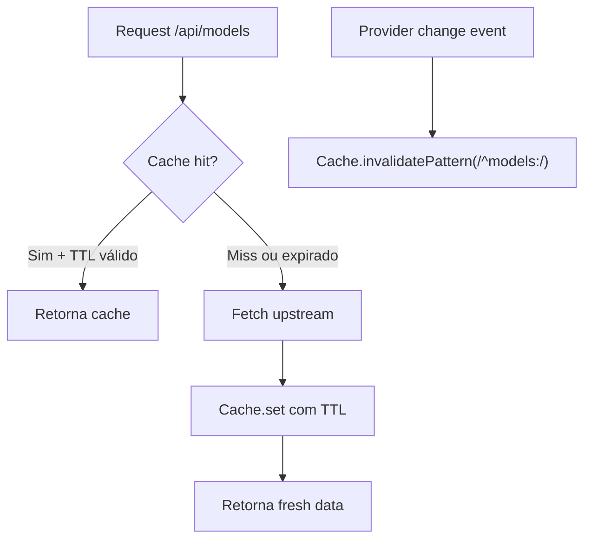

# 1. Título da Feature

Feature 84 — Cache LRU com TTL e Invalidação por Padrão

## 2. Objetivo

Implementar um módulo de cache in-memory LRU (`src/shared/cache.js`) com TTL por entrada, tamanho máximo configurável e invalidação por padrão regex, para uso em model lists, quota data e configurações de provider.

## 3. Motivação

O `cliproxyapi-dashboard` implementa uma classe `LRUCache<T>` genérica com:

- **Eviction LRU**: quando o cache atinge `maxSize`, a entrada menos recentemente acessada é removida.
- **TTL por entrada**: cada `set()` recebe um `ttlMs` específico.
- **Cleanup automático**: `setInterval` a cada 60s remove entradas expiradas.
- **Invalidação por padrão**: `invalidatePattern(regex)` para invalidar todas as entradas que match um regex (ex: todas as entradas de usage).
- **Destroy**: cleanup do interval para evitar memory leaks.

Isso é usado para:

- **Proxy models cache**: TTL de 5 minutos, invalidado após sync de providers.
- **Usage cache**: TTL de 30 segundos, invalidado após coleta.

No OmniRoute, chamadas repetidas para `/api/models` ou lists de providers refazem queries/fetches inteiras a cada request, gerando overhead desnecessário.

## 4. Problema Atual (Antes)

- Cada request para model lists faz fetch completo ao upstream.
- Sem cache de configurações de providers entre requests.
- Overhead em endpoints chamados frequentemente (models, status).
- Sem mecanismo de invalidação seletiva (tudo ou nada).

### Antes vs Depois

| Dimensão                 | Antes          | Depois                                |
| ------------------------ | -------------- | ------------------------------------- |
| Model list fetch         | A cada request | Cached por 5 minutos com invalidação  |
| Provider status          | A cada request | Cached por 30s                        |
| Mecanismo de invalidação | Inexistente    | Por chave, por padrão regex, ou total |
| Eviction                 | N/A            | LRU automático ao atingir maxSize     |
| Memory leaks             | N/A            | Cleanup automático + destroy()        |

## 5. Estado Futuro (Depois)

```js
const { modelCache, CACHE_TTL, CACHE_KEYS } = require("./shared/cache");

// Cache de model list com TTL de 5 minutos
const models = modelCache.get(CACHE_KEYS.models(provider));
if (!models) {
  const freshModels = await fetchModelsFromProvider(provider);
  modelCache.set(CACHE_KEYS.models(provider), freshModels, CACHE_TTL.MODELS);
  return freshModels;
}
return models;

// Invalidação após mudança de provider
modelCache.invalidatePattern(/^models:/);
```

## 6. O que Ganhamos

- Redução de ~80% de chamadas upstream para model lists.
- Respostas mais rápidas para endpoints frequentes.
- Invalidação granular por padrão (só quota, só models, etc.).
- Zero dependências externas (pure in-memory).
- Cleanup automático previne memory leaks.
- Destroy disponível para graceful shutdown.

## 7. Escopo

- Novo módulo: `src/shared/cache.js`.
- Classe `LRUCache` com `get`, `set`, `invalidate`, `invalidatePattern`, `invalidateAll`, `cleanup`, `destroy`.
- Instâncias pré-configuradas: `modelCache`, `quotaCache`, `providerCache`.
- Constantes de TTL: `CACHE_TTL.MODELS`, `CACHE_TTL.QUOTA`, `CACHE_TTL.PROVIDERS`.
- Constantes de chave: `CACHE_KEYS.models(p)`, `CACHE_KEYS.quota(p)`.

## 8. Fora de Escopo

- Cache persistente (Redis, SQLite) — este é apenas in-memory.
- Cache de responses HTTP completos (este é para data objects).
- Cache distribuído para multi-instance.

## 9. Arquitetura Proposta



## 10. Mudanças Técnicas Detalhadas

### Implementação completa (referência: `dashboard/src/lib/cache.ts`)

```js
class LRUCache {
  constructor(maxSize = 100, cleanupIntervalMs = 60_000) {
    this.cache = new Map();
    this.maxSize = maxSize;
    this.cleanupIntervalId = setInterval(() => this.cleanup(), cleanupIntervalMs);
  }

  destroy() {
    if (this.cleanupIntervalId) {
      clearInterval(this.cleanupIntervalId);
      this.cleanupIntervalId = null;
    }
  }

  get(key) {
    const entry = this.cache.get(key);
    if (!entry) return null;
    if (Date.now() > entry.expiresAt) {
      this.cache.delete(key);
      return null;
    }
    // Move to end (most recently used)
    this.cache.delete(key);
    this.cache.set(key, entry);
    return entry.value;
  }

  set(key, value, ttlMs) {
    const existingEntry = this.cache.has(key);
    // Evict LRU if at capacity
    if (!existingEntry && this.cache.size >= this.maxSize) {
      const firstKey = this.cache.keys().next().value;
      if (firstKey !== undefined) this.cache.delete(firstKey);
    }
    if (existingEntry) this.cache.delete(key);
    this.cache.set(key, { value, expiresAt: Date.now() + ttlMs });
  }

  invalidate(key) {
    this.cache.delete(key);
  }

  invalidatePattern(pattern) {
    for (const key of this.cache.keys()) {
      if (pattern.test(key)) this.cache.delete(key);
    }
  }

  invalidateAll() {
    this.cache.clear();
  }

  cleanup() {
    const now = Date.now();
    for (const [key, entry] of this.cache.entries()) {
      if (now > entry.expiresAt) this.cache.delete(key);
    }
  }

  get size() {
    return this.cache.size;
  }
}

// Instâncias pré-configuradas
const modelCache = new LRUCache(50);
const quotaCache = new LRUCache(50);

const CACHE_TTL = {
  MODELS: 300_000, // 5 minutos
  QUOTA: 30_000, // 30 segundos
  PROVIDERS: 60_000, // 1 minuto
};

const CACHE_KEYS = {
  models: (provider) => `models:${provider}`,
  quota: (provider) => `quota:${provider}`,
  providerStatus: (provider) => `provider-status:${provider}`,
};
```

Referência original: `dashboard/src/lib/cache.ts` (~90 linhas)

## 11. Impacto em APIs Públicas / Interfaces / Tipos

- APIs alteradas: nenhuma — cache é interno.
- Compatibilidade: **non-breaking**.
- Efeito observável: respostas mais rápidas em endpoints frequentes.

## 12. Passo a Passo de Implementação Futura

1. Criar `src/shared/cache.js` com classe `LRUCache`.
2. Exportar instâncias e constantes.
3. Integrar em `src/api/routes/models.js` — cache de model lists.
4. Integrar em `src/api/routes/providers.js` — cache de status.
5. Adicionar `invalidatePattern` após alterações de provider.
6. Registrar `destroy()` no shutdown handler do processo.
7. Adicionar logging de cache hit/miss rate (debug level).

## 13. Plano de Testes

Cenários positivos:

1. Dado cache miss, quando `get()` chamado, então retorna null.
2. Dado cache hit dentro do TTL, quando `get()` chamado, então retorna valor e atualiza posição LRU.
3. Dado cache cheio (maxSize), quando `set()` chamado, então primeira entrada (LRU) é evicted.

Cenários de erro: 4. Dado TTL expirado, quando `get()` chamado, então retorna null e remove entrada. 5. Dado `invalidatePattern(/^models:/)`, quando chamado, então apenas entradas com prefixo `models:` são removidas.

## 14. Critérios de Aceite

- [ ] Classe `LRUCache` implementada com todas as operações.
- [ ] TTL por entrada funcionando com expiração automática.
- [ ] LRU eviction quando `maxSize` atingido.
- [ ] `invalidatePattern` remove entradas por regex.
- [ ] `cleanup()` roda automaticamente sem memory leak.
- [ ] `destroy()` limpa interval.
- [ ] Pelo menos 2 pontos de integração usando o cache.

## 15. Riscos e Mitigações

- Risco: dados stale servidos durante TTL.
- Mitigação: invalidação proativa após mudanças + TTLs conservadores.

- Risco: memory leak se destroy não chamado no shutdown.
- Mitigação: registrar em process SIGTERM/SIGINT handlers.

## 16. Plano de Rollout

1. Implementar módulo isolado com testes unitários.
2. Integrar em `/api/models` (maior benefício, menor risco).
3. Monitorar hit rate e ajustar TTLs.
4. Expandir para quota e provider status.

## 17. Métricas de Sucesso

- Cache hit rate > 80% para model lists.
- Redução de latência média em endpoints cacheados.
- Zero memory leaks em produção (observar heap size).

## 18. Dependências entre Features

- Depende de: nenhuma feature anterior.
- Dependência para: `feature-82-monitoramento-quota-realtime-por-provider.md` (cache de quota).
- Complementa: `feature-09-catalogo-openrouter-com-cache.md`.

## 19. Checklist Final da Feature

- [ ] Classe `LRUCache` com get/set/invalidate/invalidatePattern/cleanup/destroy.
- [ ] TTL por entrada e eviction LRU.
- [ ] Cleanup automático via setInterval.
- [ ] Instâncias pré-configuradas (modelCache, quotaCache).
- [ ] Constantes CACHE_TTL e CACHE_KEYS.
- [ ] Integração em pelo menos 2 endpoints.
- [ ] Destroy registrado em shutdown hooks.
- [ ] Testes unitários completos.
