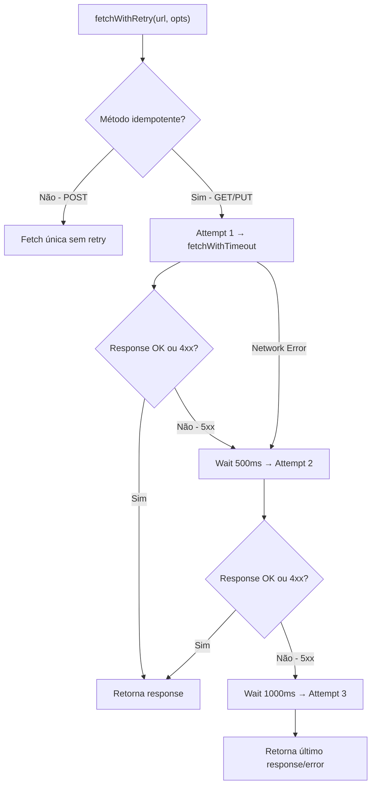

# 1. Título da Feature

Feature 85 — Fetch Retry com Backoff Exponencial para Chamadas Upstream

## 2. Objetivo

Criar um wrapper `fetchWithRetry()` para chamadas HTTP upstream que implementa retry automático com backoff exponencial, restrito a métodos idempotentes e erros transientes, evitando falhas por problemas temporários de rede ou sobrecarga.

## 3. Motivação

O `cliproxyapi-dashboard` implementa um módulo `fetch-utils.ts` (~95 linhas) com:

- **Backoff exponencial**: delays de 500ms e 1000ms entre tentativas.
- **Retry seletivo**: apenas para erros de rede e respostas 5xx.
- **Idempotência**: retry APENAS para GET e PUT — nunca POST (evita duplicação de side-effects).
- **Timeout por request**: `AbortController` com timeout configurável.
- **Composição de signals**: combina timeout do wrapper com signal do chamador via `AbortSignal.any()`.

No OmniRoute, chamadas upstream que falham por timeout transiente ou 503 temporário causam falha imediata, forçando o fallback system a trocar de provider quando um simples retry resolveria.

## 4. Problema Atual (Antes)

- Chamadas upstream falham imediatamente em erros transientes.
- Timeout de rede temporário causa fallback desnecessário para outro provider.
- Sem distinção entre erro transiente (retry) e erro permanente (desistir).
- Erros 503 (service unavailable) tratados como falha definitiva.
- POST duplicados possíveis se retry for aplicado incorretamente.

### Antes vs Depois

| Dimensão        | Antes                   | Depois                                     |
| --------------- | ----------------------- | ------------------------------------------ |
| Erro transiente | Falha imediata          | Retry automático (até 3 tentativas)        |
| Backoff         | Inexistente             | Exponencial (500ms → 1000ms)               |
| Método POST     | N/A                     | Nunca retried (proteção contra duplicação) |
| Timeout         | Configurável mas fixo   | Composição AbortSignal do caller + timeout |
| Erro 503        | Tratado como definitivo | Retried automaticamente                    |

## 5. Estado Futuro (Depois)

```js
const { fetchWithRetry } = require("./shared/fetchRetry");

// GET com retry automático
const models = await fetchWithRetry("https://api.claude.ai/v1/models", {
  headers: { Authorization: `Bearer ${key}` },
  timeout: 10000,
});

// POST sem retry (idempotência respeitada automaticamente)
const completion = await fetchWithRetry("https://api.claude.ai/v1/messages", {
  method: "POST",
  body: JSON.stringify(payload),
  timeout: 120000,
});
// → POST nunca é retried, mesmo em 5xx
```

## 6. O que Ganhamos

- Recuperação automática de erros transientes sem intervenção.
- Menos fallbacks desnecessários para providers alternativos.
- Proteção automática contra retry de métodos não-idempotentes.
- Timeout consistente com composição de signals.
- Redução de erros visíveis ao usuário em cenários de instabilidade temporária.

## 7. Escopo

- Novo módulo: `src/shared/fetchRetry.js`.
- Função `fetchWithRetry(url, options)` com retry + timeout.
- Função interna `fetchWithTimeout(url, timeoutMs, options)`.
- Configuração de delays exportável.
- Integração nos pontos de fetch upstream mais críticos.

## 8. Fora de Escopo

- Retry de requests SSE/streaming (requer lógica diferente por natureza do stream).
- Circuit breaker (feature separada — ver feature-57).
- Rate limit client-side (feature separada).

## 9. Arquitetura Proposta



## 10. Mudanças Técnicas Detalhadas

### Implementação (referência: `dashboard/src/lib/fetch-utils.ts`)

```js
const RETRY_DELAYS = [500, 1000]; // Exponential backoff
const IDEMPOTENT_METHODS = new Set(["GET", "PUT"]);

async function fetchWithRetry(url, options = {}) {
  const { timeout = 10000, ...fetchOptions } = options;
  const method = (fetchOptions.method || "GET").toUpperCase();

  // Skip retry for non-idempotent methods
  if (!IDEMPOTENT_METHODS.has(method)) {
    return fetchWithTimeout(url, timeout, fetchOptions);
  }

  let lastError = null;
  let lastResponse = null;
  const attempts = 1 + RETRY_DELAYS.length;

  for (let i = 0; i < attempts; i++) {
    try {
      const response = await fetchWithTimeout(url, timeout, fetchOptions);

      // Success or client error (4xx) → return immediately
      if (response.ok || (response.status >= 400 && response.status < 500)) {
        return response;
      }

      // 5xx → retry
      lastResponse = response;
      if (i === attempts - 1) return response;

      await sleep(RETRY_DELAYS[i]);
    } catch (error) {
      lastError = error instanceof Error ? error : new Error(String(error));
      if (i === attempts - 1) throw lastError;
      await sleep(RETRY_DELAYS[i]);
    }
  }

  if (lastResponse) return lastResponse;
  throw lastError || new Error("Unknown fetch error");
}

function fetchWithTimeout(url, timeoutMs, options = {}) {
  const controller = new AbortController();
  const timeout = setTimeout(() => controller.abort(), timeoutMs);

  const { signal: callerSignal, ...rest } = options;
  const combinedSignal = callerSignal
    ? AbortSignal.any([controller.signal, callerSignal])
    : controller.signal;

  return fetch(url, { ...rest, signal: combinedSignal }).finally(() => {
    clearTimeout(timeout);
  });
}

function sleep(ms) {
  return new Promise((resolve) => setTimeout(resolve, ms));
}
```

Referência original: `dashboard/src/lib/fetch-utils.ts` (~95 linhas, zero dependências)

## 11. Impacto em APIs Públicas / Interfaces / Tipos

- APIs alteradas: nenhuma — módulo interno.
- Efeito observável: requests com erros transientes demoram mais (retry delay) mas têm mais chance de sucesso.
- Compatibilidade: **non-breaking**.

## 12. Passo a Passo de Implementação Futura

1. Criar `src/shared/fetchRetry.js` com `fetchWithRetry` e `fetchWithTimeout`.
2. Testar com mock de servidor que retorna 503 na primeira tentativa.
3. Integrar em chamadas de management API / status checks.
4. Integrar em fetch de model lists de providers.
5. NÃO usar em chamadas de chat/completions (POST — gerenciado pelo fallback system).
6. Adicionar logging de retries (info level: "Retry attempt 2/3 for GET /models").

## 13. Plano de Testes

Cenários positivos:

1. Dado GET que retorna 200, quando `fetchWithRetry` chamado, então retorna na primeira tentativa sem delay.
2. Dado GET que retorna 503 + 503 + 200, quando `fetchWithRetry` chamado, então retorna 200 após 2 retries.
3. Dado POST que retorna 503, quando `fetchWithRetry` chamado, então retorna 503 sem retry.

Cenários de erro: 4. Dado GET que retorna 503 3 vezes, quando `fetchWithRetry` chamado, então retorna último 503. 5. Dado network error 3 vezes, quando `fetchWithRetry` chamado, então throw do último error. 6. Dado timeout excedido, quando `fetchWithRetry` chamado, então abort signal dispara.

Cenários de composição: 7. Dado caller com seu próprio AbortSignal, quando caller aborta, então fetch é abortado imediatamente.

## 14. Critérios de Aceite

- [ ] `fetchWithRetry` implementado com backoff exponencial.
- [ ] Retry APENAS para GET/PUT, NUNCA para POST.
- [ ] Retry APENAS para 5xx e network errors, NUNCA para 4xx.
- [ ] Timeout por request com `AbortController`.
- [ ] Composição de signals com `AbortSignal.any()`.
- [ ] Integrado em pelo menos 2 pontos de fetch.
- [ ] Logging de retry attempts.

## 15. Riscos e Mitigações

- Risco: retry de POST poderia causar duplicação de requests.
- Mitigação: set explícito de IDEMPOTENT_METHODS (GET, PUT apenas).

- Risco: delays de retry adicionam latência perceptível.
- Mitigação: delays curtos (500ms, 1000ms) e apenas 2 retries.

## 16. Plano de Rollout

1. Implementar módulo isolado com testes.
2. Integrar em health checks e model list fetches.
3. Monitorar taxa de retry e ajustar delays se necessário.
4. Expandir para outros pontos de fetch idempotentes.

## 17. Métricas de Sucesso

- Redução de erros transientes visíveis ao usuário.
- Taxa de sucesso após retry > 50%.
- Sem aumento de requests duplicados (POST nunca retried).

## 18. Dependências entre Features

- Complementa `feature-36-retry-cooldown-aware-com-config.md` — retry de nível mais alto no pipeline de chat.
- Depende de: nenhuma feature anterior.
- Complementa: `feature-84-cache-lru-com-ttl-e-invalidacao.md` — retry antes de popular cache.

## 19. Checklist Final da Feature

- [ ] Módulo `fetchRetry.js` implementado e exportado.
- [ ] `fetchWithRetry` com retry seletivo por método e status code.
- [ ] `fetchWithTimeout` com AbortController e composição de signals.
- [ ] Delays configuráveis (default: [500, 1000]).
- [ ] Integrado em health checks e model fetches.
- [ ] Logging de retry attempts.
- [ ] Testes unitários com mock server.
- [ ] Zero dependências externas.
