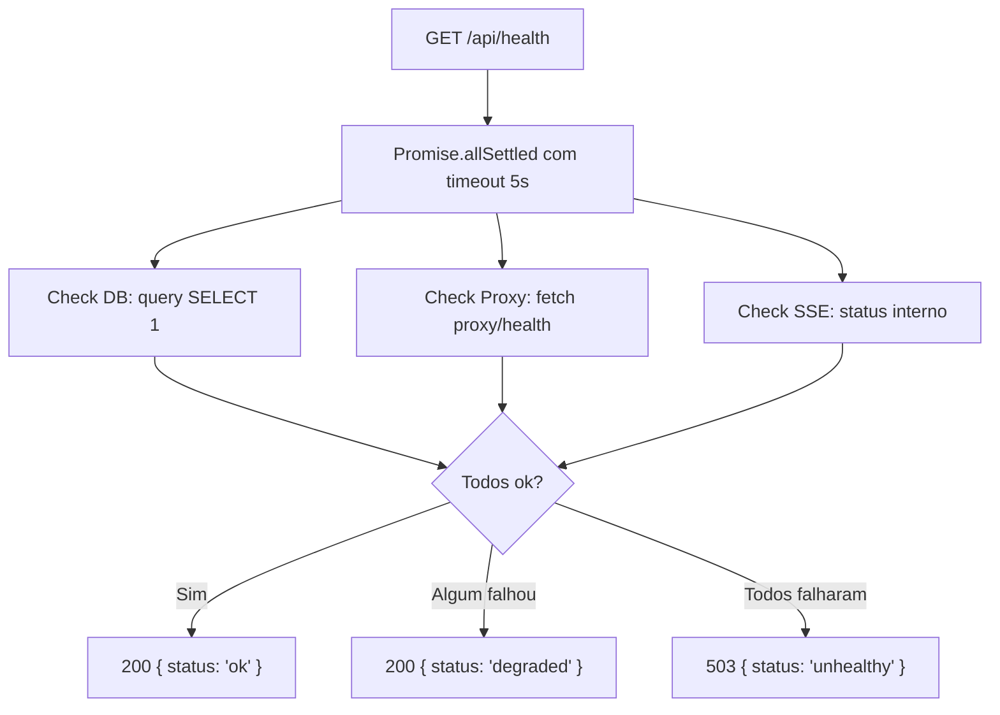

# 1. Título da Feature

Feature 86 — Health Endpoint Real com Verificação de Componentes

## 2. Objetivo

Substituir o health endpoint estático (`{ status: "ok" }`) por um health check real que valida conectividade com banco de dados, proxy upstream e serviços dependentes, retornando status granular por componente.

## 3. Motivação

O `cliproxyapi-dashboard` evoluiu de um health endpoint falso (`{ status: "ok" }` estático) para um que verifica:

- **PostgreSQL**: `prisma.$queryRaw('SELECT 1')` com timeout de 5s.
- **CLIProxyAPI proxy**: fetch ao proxy com timeout de 5s.
- **Status composto**: `"ok"` (tudo funcional) ou `"degraded"` (algum componente com erro).

Este health endpoint é usado pelo Docker healthcheck para restart automático de containers degradados.

No OmniRoute, o health endpoint retorna apenas `{ status: "ok" }` sem verificar nenhum componente real, tornando os Docker healthchecks ineficazes e mascarando falhas silenciosas.

## 4. Problema Atual (Antes)

- Health endpoint sempre retorna 200 `{ status: "ok" }`, mesmo com DB ou proxy down.
- Docker healthcheck nunca detecta degradação real.
- Monitoramento externo (Uptime Kuma, etc.) recebe falso positivo.
- Falhas silenciosas de componentes não são detectadas até afetar usuários.

### Antes vs Depois

| Dimensão               | Antes              | Depois                                         |
| ---------------------- | ------------------ | ---------------------------------------------- |
| Verificação real       | Nenhuma (estático) | DB + proxy + serviços verificados              |
| Docker healthcheck     | Sempre passa       | Detecta degradação e pode triggrar restart     |
| Status granular        | Binário (ok)       | `ok` / `degraded` / `unhealthy` por componente |
| Timeout de verificação | N/A                | 5s por componente                              |
| Informação de debug    | Nenhuma            | Status por componente no response              |

## 5. Estado Futuro (Depois)

```json
// GET /api/health
{
  "status": "ok",
  "components": {
    "database": { "status": "connected", "latencyMs": 12 },
    "proxy": { "status": "connected", "latencyMs": 45 },
    "sse_server": { "status": "running", "connections": 3 }
  },
  "uptime": "2d 14h 32m",
  "version": "0.8.5"
}

// Cenário degradado:
{
  "status": "degraded",
  "components": {
    "database": { "status": "connected", "latencyMs": 8 },
    "proxy": { "status": "error", "error": "timeout" },
    "sse_server": { "status": "running", "connections": 0 }
  }
}
```

## 6. O que Ganhamos

- Docker healthcheck eficaz detecta problemas reais.
- Status granular por componente facilita diagnóstico.
- Monitoramento externo (Uptime Kuma, Grafana) recebe dados reais.
- Restart automático de containers com problemas de conectividade.
- Dashboard pode exibir status de saúde global na barra superior.
- Latência por componente identifica gargalos.

## 7. Escopo

- Modificar: `src/api/routes/health.js` (já existe como endpoint estático).
- Novo serviço: `src/shared/services/healthChecker.js`.
- Checks: SQLite/DB connectivity, proxy upstream liveness, SSE server status.
- Timeout de 5s por check, execução paralela com `Promise.allSettled`.
- Response com status 200 (ok), 200 (degraded), ou 503 (unhealthy).

## 8. Fora de Escopo

- Health check de providers externos (Claude, OpenAI) — são terceiros, não são nosso componente.
- Deep health check (consistência de dados, etc.).
- Push-based monitoring (apenas pull via endpoint HTTP).

## 9. Arquitetura Proposta



## 10. Mudanças Técnicas Detalhadas

### Health checker service

```js
const healthChecker = {
  async checkAll() {
    const startTotal = Date.now();
    const [dbResult, proxyResult, sseResult] = await Promise.allSettled([
      this.checkDatabase(),
      this.checkProxy(),
      this.checkSSE(),
    ]);

    const components = {
      database: this.formatResult(dbResult),
      proxy: this.formatResult(proxyResult),
      sse_server: this.formatResult(sseResult),
    };

    const allOk = Object.values(components).every(
      (c) => c.status === "connected" || c.status === "running"
    );
    const allFailed = Object.values(components).every((c) => c.status === "error");

    return {
      status: allFailed ? "unhealthy" : allOk ? "ok" : "degraded",
      components,
      uptime: process.uptime(),
      version: process.env.npm_package_version || "0.0.0",
    };
  },

  async checkDatabase() {
    const start = Date.now();
    // Adaptar para SQLite/better-sqlite3 do OmniRoute
    await db.prepare("SELECT 1").get();
    return { status: "connected", latencyMs: Date.now() - start };
  },

  async checkProxy() {
    const start = Date.now();
    const response = await fetch("http://localhost:SSE_PORT/health", {
      signal: AbortSignal.timeout(5000),
    });
    if (!response.ok) throw new Error(`HTTP ${response.status}`);
    return { status: "connected", latencyMs: Date.now() - start };
  },

  async checkSSE() {
    // Verificar se SSE server está aceitando conexões
    return { status: "running", connections: activeConnections.size };
  },

  formatResult(settledResult) {
    if (settledResult.status === "fulfilled") return settledResult.value;
    return { status: "error", error: settledResult.reason?.message || "Unknown error" };
  },
};
```

### Docker healthcheck (`Dockerfile`)

```dockerfile
HEALTHCHECK --interval=30s --timeout=10s --start-period=15s --retries=3 \
  CMD curl -f http://localhost:3000/api/health || exit 1
```

Referência original: `dashboard/src/app/api/health/route.ts` — endpoint real com DB + proxy checks

## 11. Impacto em APIs Públicas / Interfaces / Tipos

- APIs alteradas: `GET /api/health` — response muda de `{ status: "ok" }` para formato expandido.
- Compatibilidade: **soft-breaking** — muda formato mas mantém status HTTP 200 para healthy.
- Docker healthcheck: passa a detectar degradação real.

## 12. Passo a Passo de Implementação Futura

1. Criar `src/shared/services/healthChecker.js` com checks para DB, proxy e SSE.
2. Adicionar timeout de 5s por check via `AbortSignal.timeout`.
3. Usar `Promise.allSettled` para execução paralela e isolamento de falhas.
4. Atualizar rota `/api/health` para usar `healthChecker.checkAll()`.
5. Retornar 200 para `ok`/`degraded`, 503 para `unhealthy`.
6. Atualizar `Dockerfile` com `HEALTHCHECK` que usa o endpoint.
7. Adicionar badge de health no dashboard se desejado.

## 13. Plano de Testes

Cenários positivos:

1. Dado todos os componentes funcionais, quando `/api/health` chamado, então retorna 200 com `status: "ok"` e latência por componente.

Cenários de erro: 2. Dado DB down, quando `/api/health` chamado, então retorna 200 com `status: "degraded"` e `database: { status: "error" }`. 3. Dado todos os componentes down, quando `/api/health` chamado, então retorna 503 com `status: "unhealthy"`.

Timeout: 4. Dado check que demora mais de 5s, quando timeout dispara, então check retorna error e demais checks completam normalmente.

## 14. Critérios de Aceite

- [ ] `/api/health` verifica DB, proxy e SSE reais.
- [ ] Timeout de 5s por check.
- [ ] `Promise.allSettled` para isolamento de falhas.
- [ ] Status composto: ok/degraded/unhealthy.
- [ ] Docker HEALTHCHECK funcional.
- [ ] Latência por componente no response.

## 15. Riscos e Mitigações

- Risco: overhead de health check a cada 30s.
- Mitigação: checks são leves (SELECT 1, fetch com timeout curto).

- Risco: health check falha por timeout configurado muito baixo.
- Mitigação: timeout generoso (5s) com margem para componentes lentos.

## 16. Plano de Rollout

1. Implementar health checker e atualizar rota.
2. Testar com componentes funcionais e com simulação de falhas.
3. Atualizar Dockerfile.
4. Monitorar logs de degradação em staging.

## 17. Métricas de Sucesso

- Zero falsos positivos de health check (nunca "ok" com componente down).
- Detecção de degradação em < 30s (intervalo de healthcheck).
- Latência do health check < 100ms em operação normal.

## 18. Dependências entre Features

- Complementa `feature-13-header-de-versao-build-e-handshake-de-saude-compativel.md`.
- Depende de: nenhuma feature anterior.
- Depende de: acesso ao DB e ao SSE server internamente.

## 19. Checklist Final da Feature

- [ ] Service `healthChecker.js` criado.
- [ ] Checks reais para DB, proxy e SSE.
- [ ] Timeout de 5s e `Promise.allSettled`.
- [ ] Status composto ok/degraded/unhealthy.
- [ ] Latência e versão no response.
- [ ] Docker HEALTHCHECK na imagem.
- [ ] Testes com simulação de componentes down.
