# omniroute — Codebase Documentation

🌐 **Languages:** 🇺🇸 [English](CODEBASE_DOCUMENTATION.md) | 🇧🇷 [Português (Brasil)](i18n/pt-BR/CODEBASE_DOCUMENTATION.md) | 🇪🇸 [Español](i18n/es/CODEBASE_DOCUMENTATION.md) | 🇫🇷 [Français](i18n/fr/CODEBASE_DOCUMENTATION.md) | 🇮🇹 [Italiano](i18n/it/CODEBASE_DOCUMENTATION.md) | 🇷🇺 [Русский](i18n/ru/CODEBASE_DOCUMENTATION.md) | 🇨🇳 [中文 (简体)](i18n/zh-CN/CODEBASE_DOCUMENTATION.md) | 🇩🇪 [Deutsch](i18n/de/CODEBASE_DOCUMENTATION.md) | 🇮🇳 [हिन्दी](i18n/in/CODEBASE_DOCUMENTATION.md) | 🇹🇭 [ไทย](i18n/th/CODEBASE_DOCUMENTATION.md) | 🇺🇦 [Українська](i18n/uk-UA/CODEBASE_DOCUMENTATION.md) | 🇸🇦 [العربية](i18n/ar/CODEBASE_DOCUMENTATION.md) | 🇯🇵 [日本語](i18n/ja/CODEBASE_DOCUMENTATION.md) | 🇻🇳 [Tiếng Việt](i18n/vi/CODEBASE_DOCUMENTATION.md) | 🇧🇬 [Български](i18n/bg/CODEBASE_DOCUMENTATION.md) | 🇩🇰 [Dansk](i18n/da/CODEBASE_DOCUMENTATION.md) | 🇫🇮 [Suomi](i18n/fi/CODEBASE_DOCUMENTATION.md) | 🇮🇱 [עברית](i18n/he/CODEBASE_DOCUMENTATION.md) | 🇭🇺 [Magyar](i18n/hu/CODEBASE_DOCUMENTATION.md) | 🇮🇩 [Bahasa Indonesia](i18n/id/CODEBASE_DOCUMENTATION.md) | 🇰🇷 [한국어](i18n/ko/CODEBASE_DOCUMENTATION.md) | 🇲🇾 [Bahasa Melayu](i18n/ms/CODEBASE_DOCUMENTATION.md) | 🇳🇱 [Nederlands](i18n/nl/CODEBASE_DOCUMENTATION.md) | 🇳🇴 [Norsk](i18n/no/CODEBASE_DOCUMENTATION.md) | 🇵🇹 [Português (Portugal)](i18n/pt/CODEBASE_DOCUMENTATION.md) | 🇷🇴 [Română](i18n/ro/CODEBASE_DOCUMENTATION.md) | 🇵🇱 [Polski](i18n/pl/CODEBASE_DOCUMENTATION.md) | 🇸🇰 [Slovenčina](i18n/sk/CODEBASE_DOCUMENTATION.md) | 🇸🇪 [Svenska](i18n/sv/CODEBASE_DOCUMENTATION.md) | 🇵🇭 [Filipino](i18n/phi/CODEBASE_DOCUMENTATION.md)

> A comprehensive, beginner-friendly guide to the **omniroute** multi-provider AI proxy router.

---

## 1. What Is omniroute?

omniroute is a **proxy router** that sits between AI clients (Claude CLI, Codex, Cursor IDE, etc.) and AI providers (Anthropic, Google, OpenAI, AWS, GitHub, etc.). It solves one big problem:

> **Different AI clients speak different "languages" (API formats), and different AI providers expect different "languages" too.** omniroute translates between them automatically.

Think of it like a universal translator at the United Nations — any delegate can speak any language, and the translator converts it for any other delegate.

---

## 2. Architecture Overview

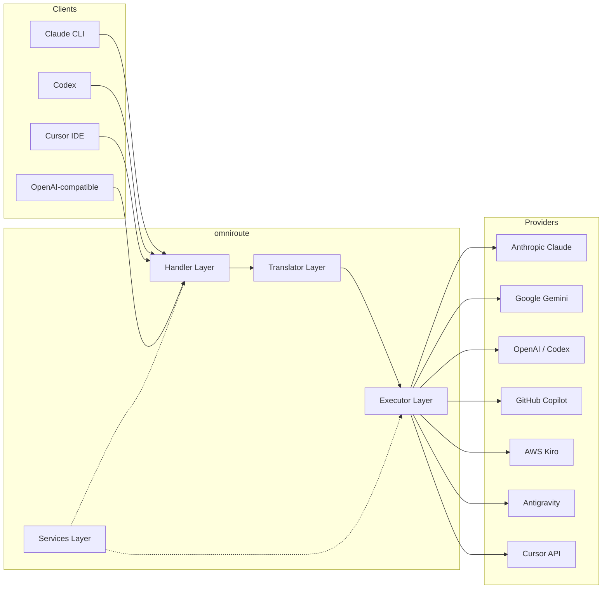

### Core Principle: Hub-and-Spoke Translation

All format translation passes through **OpenAI format as the hub**:

```
Client Format → [OpenAI Hub] → Provider Format    (request)
Provider Format → [OpenAI Hub] → Client Format    (response)
```

This means you only need **N translators** (one per format) instead of **N²** (every pair).

---

## 3. Project Structure

```
omniroute/
├── open-sse/                  ← Core proxy library (portable, framework-agnostic)
│   ├── index.js               ← Main entry point, exports everything
│   ├── config/                ← Configuration & constants
│   ├── executors/             ← Provider-specific request execution
│   ├── handlers/              ← Request handling orchestration
│   ├── services/              ← Business logic (auth, models, fallback, usage)
│   ├── translator/            ← Format translation engine
│   │   ├── request/           ← Request translators (8 files)
│   │   ├── response/          ← Response translators (7 files)
│   │   └── helpers/           ← Shared translation utilities (6 files)
│   └── utils/                 ← Utility functions
├── src/                       ← Application layer (Express/Worker runtime)
│   ├── app/                   ← Web UI, API routes, middleware
│   ├── lib/                   ← Database, auth, and shared library code
│   ├── mitm/                  ← Man-in-the-middle proxy utilities
│   ├── models/                ← Database models
│   ├── shared/                ← Shared utilities (wrappers around open-sse)
│   ├── sse/                   ← SSE endpoint handlers
│   └── store/                 ← State management
├── data/                      ← Runtime data (credentials, logs)
│   └── provider-credentials.json   (external credentials override, gitignored)
└── tester/                    ← Test utilities
```

---

## 4. Module-by-Module Breakdown

### 4.1 Config (`open-sse/config/`)

The **single source of truth** for all provider configuration.

| File                          | Purpose                                                                                                                                                                                                                   |
| ----------------------------- | ------------------------------------------------------------------------------------------------------------------------------------------------------------------------------------------------------------------------- |
| `constants.ts`                | `PROVIDERS` object with base URLs, OAuth credentials (defaults), headers, and default system prompts for every provider. Also defines `HTTP_STATUS`, `ERROR_TYPES`, `COOLDOWN_MS`, `BACKOFF_CONFIG`, and `SKIP_PATTERNS`. |
| `credentialLoader.ts`         | Loads external credentials from `data/provider-credentials.json` and merges them over the hardcoded defaults in `PROVIDERS`. Keeps secrets out of source control while maintaining backwards compatibility.               |
| `providerModels.ts`           | Central model registry: maps provider aliases → model IDs. Functions like `getModels()`, `getProviderByAlias()`.                                                                                                          |
| `codexInstructions.ts`        | System instructions injected into Codex requests (editing constraints, sandbox rules, approval policies).                                                                                                                 |
| `defaultThinkingSignature.ts` | Default "thinking" signatures for Claude and Gemini models.                                                                                                                                                               |
| `ollamaModels.ts`             | Schema definition for local Ollama models (name, size, family, quantization).                                                                                                                                             |

#### Credential Loading Flow

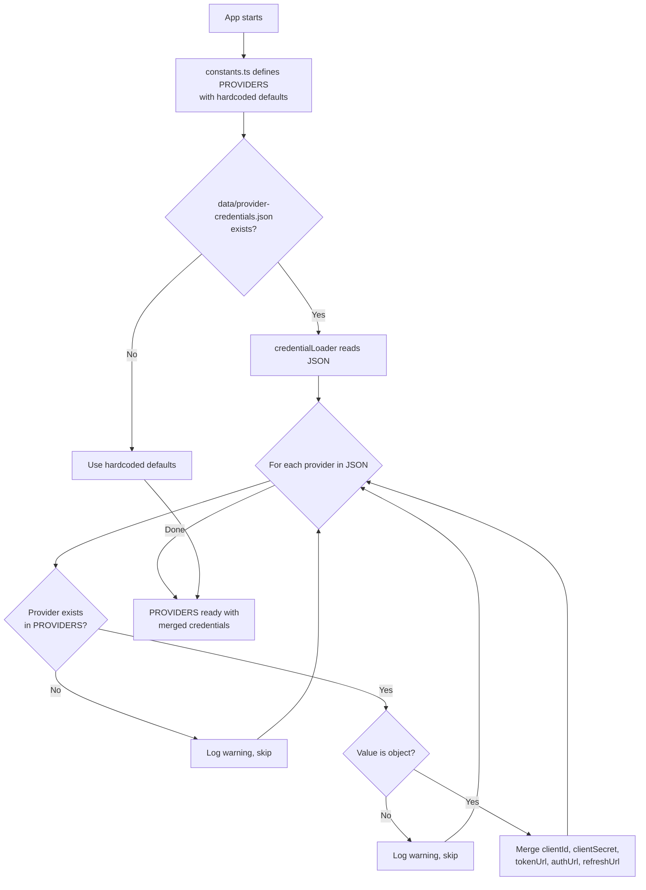

---

### 4.2 Executors (`open-sse/executors/`)

Executors encapsulate **provider-specific logic** using the **Strategy Pattern**. Each executor overrides base methods as needed.

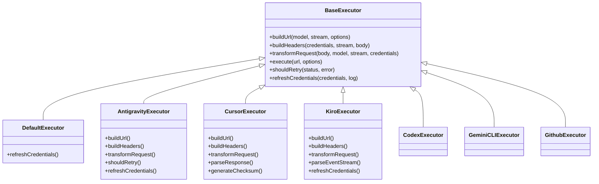

| Executor         | Provider                                   | Key Specializations                                                                                                 |
| ---------------- | ------------------------------------------ | ------------------------------------------------------------------------------------------------------------------- |
| `base.ts`        | —                                          | Abstract base: URL building, headers, retry logic, credential refresh                                               |
| `default.ts`     | Claude, Gemini, OpenAI, GLM, Kimi, MiniMax | Generic OAuth token refresh for standard providers                                                                  |
| `antigravity.ts` | Google Cloud Code                          | Project/session ID generation, multi-URL fallback, custom retry parsing from error messages ("reset after 2h7m23s") |
| `cursor.ts`      | Cursor IDE                                 | **Most complex**: SHA-256 checksum auth, Protobuf request encoding, binary EventStream → SSE response parsing       |
| `codex.ts`       | OpenAI Codex                               | Injects system instructions, manages thinking levels, removes unsupported parameters                                |
| `gemini-cli.ts`  | Google Gemini CLI                          | Custom URL building (`streamGenerateContent`), Google OAuth token refresh                                           |
| `github.ts`      | GitHub Copilot                             | Dual token system (GitHub OAuth + Copilot token), VSCode header mimicking                                           |
| `kiro.ts`        | AWS CodeWhisperer                          | AWS EventStream binary parsing, AMZN event frames, token estimation                                                 |
| `index.ts`       | —                                          | Factory: maps provider name → executor class, with default fallback                                                 |

---

### 4.3 Handlers (`open-sse/handlers/`)

The **orchestration layer** — coordinates translation, execution, streaming, and error handling.

| File                  | Purpose                                                                                                                                                                                                                |
| --------------------- | ---------------------------------------------------------------------------------------------------------------------------------------------------------------------------------------------------------------------- |
| `chatCore.ts`         | **Central orchestrator** (~600 lines). Handles the complete request lifecycle: format detection → translation → executor dispatch → streaming/non-streaming response → token refresh → error handling → usage logging. |
| `responsesHandler.ts` | Adapter for OpenAI's Responses API: converts Responses format → Chat Completions → sends to `chatCore` → converts SSE back to Responses format.                                                                        |
| `embeddings.ts`       | Embedding generation handler: resolves embedding model → provider, dispatches to provider API, returns OpenAI-compatible embedding response. Supports 6+ providers.                                                    |
| `imageGeneration.ts`  | Image generation handler: resolves image model → provider, supports OpenAI-compatible, Gemini-image (Antigravity), and fallback (Nebius) modes. Returns base64 or URL images.                                          |

#### Request Lifecycle (chatCore.ts)

```mermaid
sequenceDiagram
    participant Client
    participant chatCore
    participant Translator
    participant Executor
    participant Provider

    Client->>chatCore: Request (any format)
    chatCore->>chatCore: Detect source format
    chatCore->>chatCore: Check bypass patterns
    chatCore->>chatCore: Resolve model & provider
    chatCore->>Translator: Translate request (source → OpenAI → target)
    chatCore->>Executor: Get executor for provider
    Executor->>Executor: Build URL, headers, transform request
    Executor->>Executor: Refresh credentials if needed
    Executor->>Provider: HTTP fetch (streaming or non-streaming)

    alt Streaming
        Provider-->>chatCore: SSE stream
        chatCore->>chatCore: Pipe through SSE transform stream
        Note over chatCore: Transform stream translates<br/>each chunk: target → OpenAI → source
        chatCore-->>Client: Translated SSE stream
    else Non-streaming
        Provider-->>chatCore: JSON response
        chatCore->>Translator: Translate response
        chatCore-->>Client: Translated JSON
    end

    alt Error (401, 429, 500...)
        chatCore->>Executor: Retry with credential refresh
        chatCore->>chatCore: Account fallback logic
    end
```

---

### 4.4 Services (`open-sse/services/`)

Business logic that supports the handlers and executors.

| File                 | Purpose                                                                                                                                                                                                                                                                                                                                |
| -------------------- | -------------------------------------------------------------------------------------------------------------------------------------------------------------------------------------------------------------------------------------------------------------------------------------------------------------------------------------- |
| `provider.ts`        | **Format detection** (`detectFormat`): analyzes request body structure to identify Claude/OpenAI/Gemini/Antigravity/Responses formats (includes `max_tokens` heuristic for Claude). Also: URL building, header building, thinking config normalization. Supports `openai-compatible-*` and `anthropic-compatible-*` dynamic providers. |
| `model.ts`           | Model string parsing (`claude/model-name` → `{provider: "claude", model: "model-name"}`), alias resolution with collision detection, input sanitization (rejects path traversal/control chars), and model info resolution with async alias getter support.                                                                             |
| `accountFallback.ts` | Rate-limit handling: exponential backoff (1s → 2s → 4s → max 2min), account cooldown management, error classification (which errors trigger fallback vs. not).                                                                                                                                                                         |
| `tokenRefresh.ts`    | OAuth token refresh for **every provider**: Google (Gemini, Antigravity), Claude, Codex, Qwen, iFlow, GitHub (OAuth + Copilot dual-token), Kiro (AWS SSO OIDC + Social Auth). Includes in-flight promise deduplication cache and retry with exponential backoff.                                                                       |
| `combo.ts`           | **Combo models**: chains of fallback models. If model A fails with a fallback-eligible error, try model B, then C, etc. Returns actual upstream status codes.                                                                                                                                                                          |
| `usage.ts`           | Fetches quota/usage data from provider APIs (GitHub Copilot quotas, Antigravity model quotas, Codex rate limits, Kiro usage breakdowns, Claude settings).                                                                                                                                                                              |
| `accountSelector.ts` | Smart account selection with scoring algorithm: considers priority, health status, round-robin position, and cooldown state to pick the optimal account for each request.                                                                                                                                                              |
| `contextManager.ts`  | Request context lifecycle management: creates and tracks per-request context objects with metadata (request ID, timestamps, provider info) for debugging and logging.                                                                                                                                                                  |
| `ipFilter.ts`        | IP-based access control: supports allowlist and blocklist modes. Validates client IP against configured rules before processing API requests.                                                                                                                                                                                          |
| `sessionManager.ts`  | Session tracking with client fingerprinting: tracks active sessions using hashed client identifiers, monitors request counts, and provides session metrics.                                                                                                                                                                            |
| `signatureCache.ts`  | Request signature-based deduplication cache: prevents duplicate requests by caching recent request signatures and returning cached responses for identical requests within a time window.                                                                                                                                              |
| `systemPrompt.ts`    | Global system prompt injection: prepends or appends a configurable system prompt to all requests, with per-provider compatibility handling.                                                                                                                                                                                            |
| `thinkingBudget.ts`  | Reasoning token budget management: supports passthrough, auto (strip thinking config), custom (fixed budget), and adaptive (complexity-scaled) modes for controlling thinking/reasoning tokens.                                                                                                                                        |
| `wildcardRouter.ts`  | Wildcard model pattern routing: resolves wildcard patterns (e.g., `*/claude-*`) to concrete provider/model pairs based on availability and priority.                                                                                                                                                                                   |

#### Token Refresh Deduplication

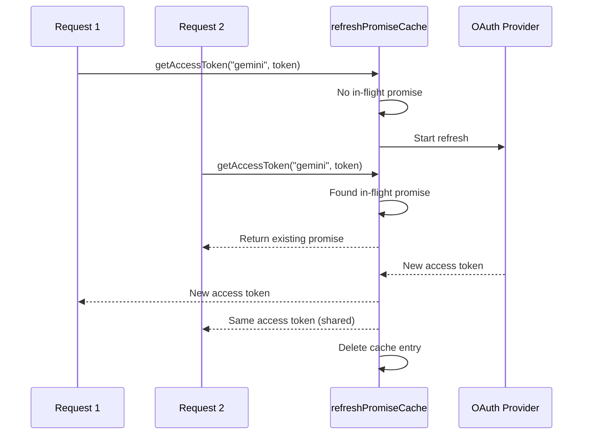

#### Account Fallback State Machine

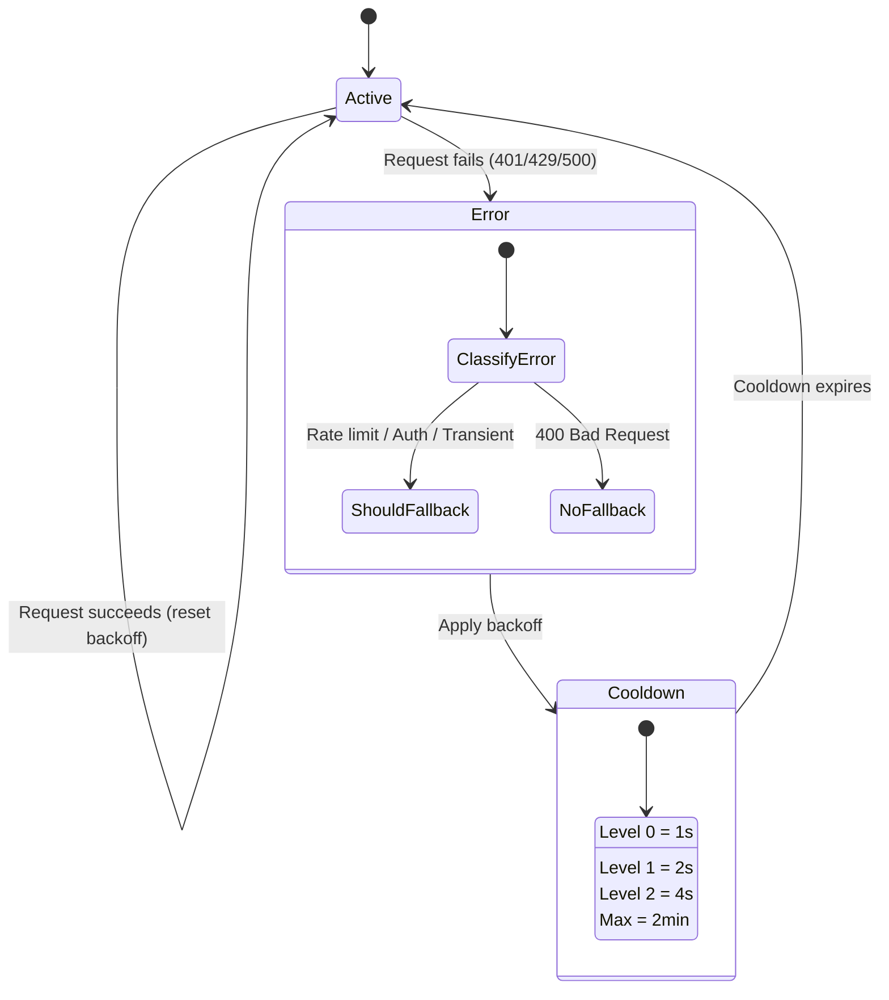

#### Combo Model Chain

```mermaid
flowchart LR
    A["Request with\ncombo model"] --> B["Model A"]
    B -->|"2xx Success"| C["Return response"]
    B -->|"429/401/500"| D{"Fallback\neligible?"}
    D -->|Yes| E["Model B"]
    D -->|No| F["Return error"]
    E -->|"2xx Success"| C
    E -->|"429/401/500"| G{"Fallback\neligible?"}
    G -->|Yes| H["Model C"]
    G -->|No| F
    H -->|"2xx Success"| C
    H -->|"Fail"| I["All failed →\nReturn last status"]
```

---

### 4.5 Translator (`open-sse/translator/`)

The **format translation engine** using a self-registering plugin system.

#### Architecture

```mermaid
graph TD
    subgraph "Request Translation"
        A["Claude → OpenAI"]
        B["Gemini → OpenAI"]
        C["Antigravity → OpenAI"]
        D["OpenAI Responses → OpenAI"]
        E["OpenAI → Claude"]
        F["OpenAI → Gemini"]
        G["OpenAI → Kiro"]
        H["OpenAI → Cursor"]
    end

    subgraph "Response Translation"
        I["Claude → OpenAI"]
        J["Gemini → OpenAI"]
        K["Kiro → OpenAI"]
        L["Cursor → OpenAI"]
        M["OpenAI → Claude"]
        N["OpenAI → Antigravity"]
        O["OpenAI → Responses"]
    end
```

| Directory    | Files         | Description                                                                                                                                                                                                                                                      |
| ------------ | ------------- | ---------------------------------------------------------------------------------------------------------------------------------------------------------------------------------------------------------------------------------------------------------------- |
| `request/`   | 8 translators | Convert request bodies between formats. Each file self-registers via `register(from, to, fn)` on import.                                                                                                                                                         |
| `response/`  | 7 translators | Convert streaming response chunks between formats. Handles SSE event types, thinking blocks, tool calls.                                                                                                                                                         |
| `helpers/`   | 6 helpers     | Shared utilities: `claudeHelper` (system prompt extraction, thinking config), `geminiHelper` (parts/contents mapping), `openaiHelper` (format filtering), `toolCallHelper` (ID generation, missing response injection), `maxTokensHelper`, `responsesApiHelper`. |
| `index.ts`   | —             | Translation engine: `translateRequest()`, `translateResponse()`, state management, registry.                                                                                                                                                                     |
| `formats.ts` | —             | Format constants: `OPENAI`, `CLAUDE`, `GEMINI`, `ANTIGRAVITY`, `KIRO`, `CURSOR`, `OPENAI_RESPONSES`.                                                                                                                                                             |

#### Key Design: Self-Registering Plugins

```javascript
// Each translator file calls register() on import:
import { register } from "../index.js";
register("claude", "openai", translateClaudeToOpenAI);

// The index.js imports all translator files, triggering registration:
import "./request/claude-to-openai.js"; // ← self-registers
```

---

### 4.6 Utils (`open-sse/utils/`)

| File               | Purpose                                                                                                                                                                                                                                                                              |
| ------------------ | ------------------------------------------------------------------------------------------------------------------------------------------------------------------------------------------------------------------------------------------------------------------------------------ |
| `error.ts`         | Error response building (OpenAI-compatible format), upstream error parsing, Antigravity retry-time extraction from error messages, SSE error streaming.                                                                                                                              |
| `stream.ts`        | **SSE Transform Stream** — the core streaming pipeline. Two modes: `TRANSLATE` (full format translation) and `PASSTHROUGH` (normalize + extract usage). Handles chunk buffering, usage estimation, content length tracking. Per-stream encoder/decoder instances avoid shared state. |
| `streamHelpers.ts` | Low-level SSE utilities: `parseSSELine` (whitespace-tolerant), `hasValuableContent` (filters empty chunks for OpenAI/Claude/Gemini), `fixInvalidId`, `formatSSE` (format-aware SSE serialization with `perf_metrics` cleanup).                                                       |
| `usageTracking.ts` | Token usage extraction from any format (Claude/OpenAI/Gemini/Responses), estimation with separate tool/message char-per-token ratios, buffer addition (2000 tokens safety margin), format-specific field filtering, console logging with ANSI colors.                                |
| `requestLogger.ts` | File-based request logging (opt-in via `ENABLE_REQUEST_LOGS=true`). Creates session folders with numbered files: `1_req_client.json` → `7_res_client.txt`. All I/O is async (fire-and-forget). Masks sensitive headers.                                                              |
| `bypassHandler.ts` | Intercepts specific patterns from Claude CLI (title extraction, warmup, count) and returns fake responses without calling any provider. Supports both streaming and non-streaming. Intentionally limited to Claude CLI scope.                                                        |
| `networkProxy.ts`  | Resolves outbound proxy URL for a given provider with precedence: provider-specific config → global config → environment variables (`HTTPS_PROXY`/`HTTP_PROXY`/`ALL_PROXY`). Supports `NO_PROXY` exclusions. Caches config for 30s.                                                  |

#### SSE Streaming Pipeline

```mermaid
flowchart TD
    A["Provider SSE stream"] --> B["TextDecoder\n(per-stream instance)"]
    B --> C["Buffer lines\n(split on newline)"]
    C --> D["parseSSELine()\n(trim whitespace, parse JSON)"]
    D --> E{"Mode?"}
    E -->|TRANSLATE| F["translateResponse()\ntarget → OpenAI → source"]
    E -->|PASSTHROUGH| G["fixInvalidId()\nnormalize chunk"]
    F --> H["hasValuableContent()\nfilter empty chunks"]
    G --> H
    H -->|"Has content"| I["extractUsage()\ntrack token counts"]
    H -->|"Empty"| J["Skip chunk"]
    I --> K["formatSSE()\nserialize + clean perf_metrics"]
    K --> L["TextEncoder\n(per-stream instance)"]
    L --> M["Enqueue to\nclient stream"]

    style A fill:#f9f,stroke:#333
    style M fill:#9f9,stroke:#333
```

#### Request Logger Session Structure

```
logs/
└── claude_gemini_claude-sonnet_20260208_143045/
    ├── 1_req_client.json      ← Raw client request
    ├── 2_req_source.json      ← After initial conversion
    ├── 3_req_openai.json      ← OpenAI intermediate format
    ├── 4_req_target.json      ← Final target format
    ├── 5_res_provider.txt     ← Provider SSE chunks (streaming)
    ├── 5_res_provider.json    ← Provider response (non-streaming)
    ├── 6_res_openai.txt       ← OpenAI intermediate chunks
    ├── 7_res_client.txt       ← Client-facing SSE chunks
    └── 6_error.json           ← Error details (if any)
```

---

### 4.7 Application Layer (`src/`)

| Directory     | Purpose                                                                |
| ------------- | ---------------------------------------------------------------------- |
| `src/app/`    | Web UI, API routes, Express middleware, OAuth callback handlers        |
| `src/lib/`    | Database access (`localDb.ts`, `usageDb.ts`), authentication, shared   |
| `src/mitm/`   | Man-in-the-middle proxy utilities for intercepting provider traffic    |
| `src/models/` | Database model definitions                                             |
| `src/shared/` | Wrappers around open-sse functions (provider, stream, error, etc.)     |
| `src/sse/`    | SSE endpoint handlers that wire the open-sse library to Express routes |
| `src/store/`  | Application state management                                           |

#### Notable API Routes

| Route                                         | Methods         | Purpose                                                                               |
| --------------------------------------------- | --------------- | ------------------------------------------------------------------------------------- |
| `/api/provider-models`                        | GET/POST/DELETE | CRUD for custom models per provider                                                   |
| `/api/models/catalog`                         | GET             | Aggregated catalog of all models (chat, embedding, image, custom) grouped by provider |
| `/api/settings/proxy`                         | GET/PUT/DELETE  | Hierarchical outbound proxy configuration (`global/providers/combos/keys`)            |
| `/api/settings/proxy/test`                    | POST            | Validates proxy connectivity and returns public IP/latency                            |
| `/v1/providers/[provider]/chat/completions`   | POST            | Dedicated per-provider chat completions with model validation                         |
| `/v1/providers/[provider]/embeddings`         | POST            | Dedicated per-provider embeddings with model validation                               |
| `/v1/providers/[provider]/images/generations` | POST            | Dedicated per-provider image generation with model validation                         |
| `/api/settings/ip-filter`                     | GET/PUT         | IP allowlist/blocklist management                                                     |
| `/api/settings/thinking-budget`               | GET/PUT         | Reasoning token budget configuration (passthrough/auto/custom/adaptive)               |
| `/api/settings/system-prompt`                 | GET/PUT         | Global system prompt injection for all requests                                       |
| `/api/sessions`                               | GET             | Active session tracking and metrics                                                   |
| `/api/rate-limits`                            | GET             | Per-account rate limit status                                                         |

---

## 5. Key Design Patterns

### 5.1 Hub-and-Spoke Translation

All formats translate through **OpenAI format as the hub**. Adding a new provider only requires writing **one pair** of translators (to/from OpenAI), not N pairs.

### 5.2 Executor Strategy Pattern

Each provider has a dedicated executor class inheriting from `BaseExecutor`. The factory in `executors/index.ts` selects the right one at runtime.

### 5.3 Self-Registering Plugin System

Translator modules register themselves on import via `register()`. Adding a new translator is just creating a file and importing it.

### 5.4 Account Fallback with Exponential Backoff

When a provider returns 429/401/500, the system can switch to the next account, applying exponential cooldowns (1s → 2s → 4s → max 2min).

### 5.5 Combo Model Chains

A "combo" groups multiple `provider/model` strings. If the first fails, fallback to the next automatically.

### 5.6 Stateful Streaming Translation

Response translation maintains state across SSE chunks (thinking block tracking, tool call accumulation, content block indexing) via the `initState()` mechanism.

### 5.7 Usage Safety Buffer

A 2000-token buffer is added to reported usage to prevent clients from hitting context window limits due to overhead from system prompts and format translation.

---

## 6. Supported Formats

| Format                  | Direction       | Identifier         |
| ----------------------- | --------------- | ------------------ |
| OpenAI Chat Completions | source + target | `openai`           |
| OpenAI Responses API    | source + target | `openai-responses` |
| Anthropic Claude        | source + target | `claude`           |
| Google Gemini           | source + target | `gemini`           |
| Google Gemini CLI       | target only     | `gemini-cli`       |
| Antigravity             | source + target | `antigravity`      |
| AWS Kiro                | target only     | `kiro`             |
| Cursor                  | target only     | `cursor`           |

---

## 7. Supported Providers

| Provider                 | Auth Method            | Executor    | Key Notes                                     |
| ------------------------ | ---------------------- | ----------- | --------------------------------------------- |
| Anthropic Claude         | API key or OAuth       | Default     | Uses `x-api-key` header                       |
| Google Gemini            | API key or OAuth       | Default     | Uses `x-goog-api-key` header                  |
| Google Gemini CLI        | OAuth                  | GeminiCLI   | Uses `streamGenerateContent` endpoint         |
| Antigravity              | OAuth                  | Antigravity | Multi-URL fallback, custom retry parsing      |
| OpenAI                   | API key                | Default     | Standard Bearer auth                          |
| Codex                    | OAuth                  | Codex       | Injects system instructions, manages thinking |
| GitHub Copilot           | OAuth + Copilot token  | Github      | Dual token, VSCode header mimicking           |
| Kiro (AWS)               | AWS SSO OIDC or Social | Kiro        | Binary EventStream parsing                    |
| Cursor IDE               | Checksum auth          | Cursor      | Protobuf encoding, SHA-256 checksums          |
| Qwen                     | OAuth                  | Default     | Standard auth                                 |
| iFlow                    | OAuth (Basic + Bearer) | Default     | Dual auth header                              |
| OpenRouter               | API key                | Default     | Standard Bearer auth                          |
| GLM, Kimi, MiniMax       | API key                | Default     | Claude-compatible, use `x-api-key`            |
| `openai-compatible-*`    | API key                | Default     | Dynamic: any OpenAI-compatible endpoint       |
| `anthropic-compatible-*` | API key                | Default     | Dynamic: any Claude-compatible endpoint       |

---

## 8. Data Flow Summary

### Streaming Request

```mermaid
flowchart LR
    A["Client"] --> B["detectFormat()"]
    B --> C["translateRequest()\nsource → OpenAI → target"]
    C --> D["Executor\nbuildUrl + buildHeaders"]
    D --> E["fetch(providerURL)"]
    E --> F["createSSEStream()\nTRANSLATE mode"]
    F --> G["parseSSELine()"]
    G --> H["translateResponse()\ntarget → OpenAI → source"]
    H --> I["extractUsage()\n+ addBuffer"]
    I --> J["formatSSE()"]
    J --> K["Client receives\ntranslated SSE"]
    K --> L["logUsage()\nsaveRequestUsage()"]
```

### Non-Streaming Request

```mermaid
flowchart LR
    A["Client"] --> B["detectFormat()"]
    B --> C["translateRequest()\nsource → OpenAI → target"]
    C --> D["Executor.execute()"]
    D --> E["translateResponse()\ntarget → OpenAI → source"]
    E --> F["Return JSON\nresponse"]
```

### Bypass Flow (Claude CLI)

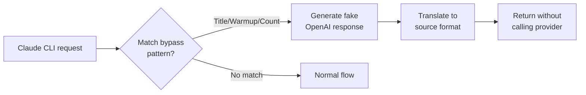
