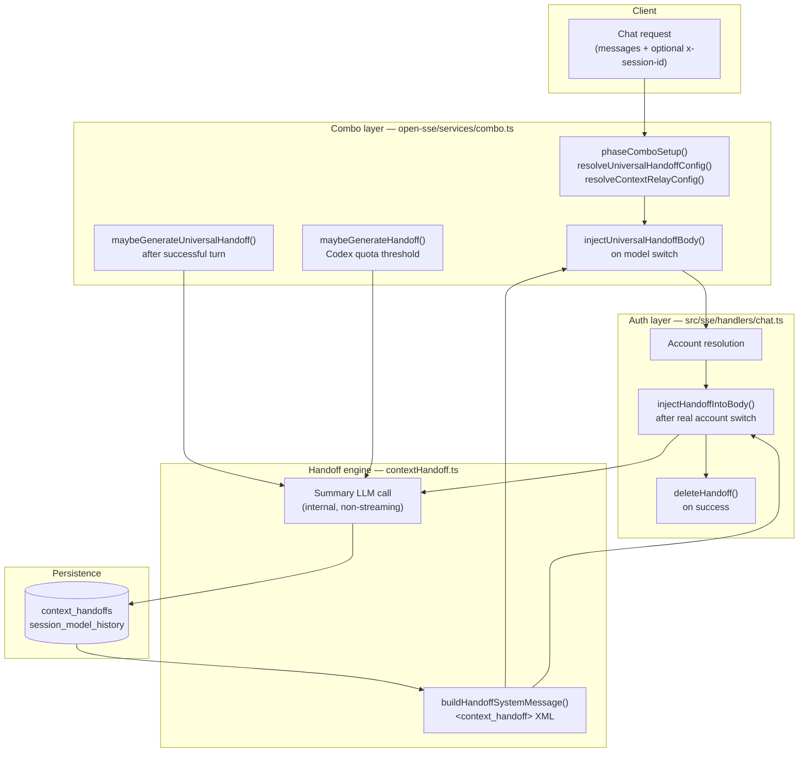

# Context Sharing Across LLM Models

OmniRoute routes chat requests through **combos** — ordered lists of `provider/model` targets with automatic fallback. When routing switches accounts or models mid-conversation, the downstream model no longer sees the full message history that the previous model processed. **Context sharing** is the umbrella term for OmniRoute mechanisms that preserve conversational continuity across those switches.

The implementation has two complementary layers:

| Mechanism                                    | Scope                  | Trigger                                   | Default                                        |
| -------------------------------------------- | ---------------------- | ----------------------------------------- | ---------------------------------------------- |
| **Universal context handoff**                | Any combo strategy     | Model change within a session             | **On** (`enabled: true`, `trigger: on-switch`) |
| **Context Relay** (`context-relay` strategy) | Codex account rotation | Quota threshold before account exhaustion | Opt-in per combo                               |

Both layers share the same core engine (`open-sse/services/contextHandoff.ts`), the same SQLite store (`context_handoffs`), and the same `<context_handoff>` XML injection format. They differ in **when** a summary is generated and **where** it is injected.

> **Not context sharing:** The [Memory system](../frameworks/MEMORY.md) (FTS5 + optional Qdrant) provides durable cross-session recall. Context sharing is **ephemeral, per-session continuity** during active combo routing — not long-term memory. Similarly, **context cache protection** (`context_cache_protection` on a combo) pins the _same_ model across turns to preserve provider-side prompt caches; it does not transfer state to a different model.
>
> **Also not context sharing:** [OmniContext / Continuity Plane](../frameworks/OMNICONTEXT.md) is team-scoped project artifact continuity (`omnicontext_*` tables, inject/publish). It is a separate product surface from combo handoffs and from Memory.

---

## Problem

Combo routing intentionally moves traffic between targets when:

- A provider returns an error and fallback advances to the next model.
- A strategy (round-robin, cost-optimized, auto-combo, etc.) selects a different target.
- An OAuth/API-key account hits quota and auth selects another connection.
- The `context-relay` strategy predicts imminent Codex quota exhaustion.

Each upstream model only receives the client’s request body (messages or Responses API `input`). It has no visibility into prior turns that were served by a different model or account. Without context sharing, the new model starts cold — losing task state, decisions, and file references.

Context sharing solves this by:

1. **Summarizing** recent conversation history into a compact structured payload (background LLM call).
2. **Persisting** that payload keyed by `sessionId + comboName`.
3. **Injecting** the payload as a leading system message (or Responses API `instructions`) on the next request that actually switches context.

---

## High-Level Architecture



**Design split (intentional):** Handoff **generation** decisions run in the combo loop (`combo.ts`) because only that layer knows which model succeeded and what quota signals are available. Handoff **injection** for account rotation runs in `chat.ts` because only the auth layer knows which `connectionId` was actually selected — the combo loop cannot reliably detect a real account switch.

---

## Session Identity

Context sharing is scoped by **session ID** and **combo name**.

### Session ID sources

`open-sse/services/sessionManager.ts::extractExternalSessionId()` reads, in order:

- `x-session-id` (preferred — survives Nginx without `underscores_in_headers`)
- `x_session_id`
- `x-omniroute-session`
- `session-id`

External IDs are normalized with an `ext:` prefix and truncated to 64 characters to avoid collision with internal SHA-256 session hashes.

When `context_cache_protection` is enabled on a combo and the client sends no session header, OmniRoute derives a stable fingerprint from the request body via `deriveComboSessionKey()` so pinning and handoff still work across turns.

### Model history

`session_model_history` (migration `064_create_session_model_history.sql`) records each successful model usage per `(session_id, combo_name)`. `getLastSessionModel()` returns the most recent entry and drives:

- Universal handoff **switch detection** (`prevModel !== currModel`).
- Server-side **context cache pinning** when `context_cache_protection` is enabled (`comboSetup.ts`).

---

## Universal Context Handoff

Universal handoff preserves continuity when combo routing moves a session from one **model** to another — including cross-provider switches (e.g. `openai/gpt-4o` → `anthropic/claude-sonnet`).

### Defaults

Defined in `DEFAULT_UNIVERSAL_HANDOFF_CONFIG` (`contextHandoff.ts`):

| Field                   | Default      | Meaning                                                |
| ----------------------- | ------------ | ------------------------------------------------------ |
| `enabled`               | `true`       | Handoff system active for all combos unless overridden |
| `trigger`               | `on-switch`  | Generate only when the resolved model changes          |
| `providerAllowlist`     | `[]` (empty) | All providers allowed                                  |
| `maxMessagesForSummary` | `30`         | Recent messages fed to the summarizer                  |
| `handoffModel`          | `""`         | Use the current request model for summarization        |
| `ttlMinutes`            | `300`        | Handoff row expiry (5 hours)                           |
| `preserveSystemPrompt`  | `true`       | Keep existing system/developer messages when injecting |

`trigger` also accepts `always` (summary every turn) and `on-error` (only after error fallback).

Configuration merges **combo-level** (`universal_handoff` / `universalHandoff` on the combo row) over **global** defaults passed via `relayOptions.universalHandoffConfig`.

### Runtime flow

**Before each combo target attempt** (`combo.ts`, ~line 1439):

1. Read `lastModel` from `session_model_history`.
2. If `lastModel` exists and differs from the current `modelStr`, call `injectUniversalHandoffBody()` — prepending a `<context_handoff>` system message (or merging into Responses API `instructions`).
3. If a persisted handoff exists in `context_handoffs`, its structured fields populate the XML; otherwise a minimal transfer stub is injected while background generation runs.

**After a successful turn** (`combo.ts`, ~line 1625):

1. Compare `prevModel` (before this turn) to `currModel`.
2. On switch, call `maybeGenerateUniversalHandoff()` — schedules async summary generation via `setImmediate`.
3. Record the new model in `session_model_history`.

Internal summary requests set `_omnirouteSkipContextRelay: true` and `_omnirouteInternalRequest: "universal-handoff"` so they do not recurse into handoff logic.

### Opt-out

Clients or internal callers can set `_omnirouteSkipUniversalHandoff` on the request body (`SKIP_UNIVERSAL_HANDOFF_FLAG`) to bypass universal handoff for that request.

---

## Context Relay (`context-relay` Strategy)

Context Relay targets **account rotation within the same provider** — today centered on **Codex** quota windows. It behaves like priority routing for model selection, plus a proactive handoff layer before the active account is exhausted.

### When to use

- Multiple accounts of the same provider in one combo.
- Long sessions that may outlive a single account’s quota window.
- Provider exposes quota telemetry (Codex 5h / 7d windows via `codexQuotaFetcher.ts`).

### Quota-driven generation

After a successful turn, when `strategy === "context-relay"` and `provider === "codex"` (`combo.ts`, ~line 1669):

1. Fetch dual-window quota via `fetchCodexQuota(connectionId)`.
2. If `percentUsed` is between `handoffThreshold` (default **0.85**) and `HANDOFF_EXHAUSTION_THRESHOLD` (**0.95**), call `maybeGenerateHandoff()`.
3. Below 85%: no handoff. At or above 95%: no new handoff (account already near exhaustion).

`handoffProviders` is an allowlist (default `["codex"]`). An **empty array disables** generation entirely.

### Account-switch injection

Injection happens in `src/sse/handlers/chat.ts` (~line 1206), **after** credentials resolve:

1. Load handoff from `getHandoff(sessionId, comboName)`.
2. Inject only if `handoff.fromAccount !== credentials.connectionId` — proving a real account switch occurred.
3. On successful upstream response, `deleteHandoff()` removes the consumed handoff.

Codex-specific note: when OpenAI Responses `store` is enabled, `ensureOpenAIStoreSessionFallback()` may also attach session state for Codex — complementary to, not a replacement for, handoff injection.

---

## Summary Generation Pipeline

Both mechanisms call the same async pipeline in `contextHandoff.ts`:

### Message selection

`selectMessagesForSummary()`:

- Always retains `system` / `developer` messages.
- Takes the most recent N non-system messages (`maxMessagesForSummary`, default 30).
- Trims oldest non-system messages until estimated tokens ≤ `MAX_HISTORY_TOKENS_FOR_SUMMARY` (8000).

### Summarizer prompt

A fixed template (`HANDOFF_PROMPT_TEMPLATE`) asks the summary model for JSON:

```json
{
  "summary": "Dense continuity summary (max ~200 words)",
  "keyDecisions": ["decision1", "decision2"],
  "taskProgress": "Done / pending / next steps",
  "activeEntities": ["fileA.ts", "feature X"]
}
```

`parseHandoffJSON()` extracts and sanitizes the response (strips `<omniModel>` tag artifacts, handles markdown fences).

### Deduplication

- **DB guard:** `hasActiveHandoff()` skips generation if a non-expired row exists for `(sessionId, comboName)`.
- **In-flight guard:** `inflightHandoffGenerations` Set blocks duplicate concurrent generations per `(sessionId, comboName)`.

### Internal request flags

Summary calls use `handleSingleModel()` with:

- `stream: false`
- `max_tokens: 800`, `temperature: 0.1`
- `_omnirouteSkipContextRelay: true`
- `_omnirouteInternalRequest: "context-handoff"` or `"universal-handoff"`

---

## Injection Format

Handoffs are injected as a **system** message (Chat Completions) or prepended to **instructions** (Responses API). The XML envelope:

```xml
<context_handoff>
<transfer_reason>...</transfer_reason>
<previous_model>...</previous_model>   <!-- universal handoff only -->
<current_model>...</current_model>     <!-- universal handoff only -->
<session_summary>...</session_summary>
<task_progress>...</task_progress>
<key_decisions>
  - ...
</key_decisions>
<active_context>entity1, entity2</active_context>
<messages_processed>42</messages_processed>
</context_handoff>
```

`injectHandoffIntoBody()` and `injectUniversalHandoffBody()` in `contextHandoff.ts` handle both API shapes. User-visible `<omniModel>` streaming artifacts are stripped via `OMNI_MODEL_TAG_PATTERN` during JSON parsing.

---

## Persistence

### `context_handoffs`

Created in migration `019_context_handoffs.sql`. Unique on `(session_id, combo_name)` — one active handoff per session/combo pair.

| Column                                                         | Purpose                                                                    |
| -------------------------------------------------------------- | -------------------------------------------------------------------------- |
| `session_id`                                                   | Client or derived session key                                              |
| `combo_name`                                                   | Combo identifier                                                           |
| `from_account`                                                 | Source `connectionId`, or `universal:{prevModel}` for cross-model handoffs |
| `summary`, `key_decisions`, `task_progress`, `active_entities` | Structured handoff payload                                                 |
| `message_count`                                                | Messages processed when summary was built                                  |
| `model`                                                        | Model used to generate the summary                                         |
| `last_model`                                                   | Previous model (universal handoff)                                         |
| `warning_threshold_pct`                                        | Quota threshold that triggered generation (Context Relay)                  |
| `generated_at`, `expires_at`                                   | Timestamps; expired rows cleaned by `cleanupExpiredHandoffs()`             |

DB access: `src/lib/db/contextHandoffs.ts` (`upsertHandoff`, `getHandoff`, `deleteHandoff`, `hasActiveHandoff`).

### `session_model_history`

Append-only usage log per session/combo (`recordSessionModelUsage`, `getLastSessionModel`). Powers switch detection and context-cache pinning.

---

## Configuration Surfaces

### Global defaults (Dashboard)

**Settings → Routing → Combo defaults** (`ComboDefaultsTab.tsx`):

- Context Relay: `handoffThreshold`, `maxMessagesForSummary`, `handoffModel`, provider note.

Universal handoff global defaults are passed through combo relay options at request time.

### Per-combo overrides

**Dashboard → Combos** — when strategy is `context-relay`, exposes the same Context Relay fields. Combo-level `universal_handoff` JSON overrides global universal-handoff settings.

### Context Relay config schema

`resolveContextRelayConfig()` (`contextHandoff.ts`):

| Field                   | Default     | Notes                        |
| ----------------------- | ----------- | ---------------------------- |
| `handoffThreshold`      | `0.85`      | Must be &lt; `0.95`          |
| `handoffModel`          | `""`        | Optional summarizer override |
| `handoffProviders`      | `["codex"]` | Empty array = disabled       |
| `maxMessagesForSummary` | `30`        | Clamped 5–100                |

---

## Request Lifecycle (End-to-End)

```text
1. Client POST /v1/chat/completions
   model: "my-combo"
   headers: x-session-id: abc-123
   messages: [...]

2. handleChatCore() → handleComboChat()
   phaseComboSetup() resolves universal + relay config

3. For each combo target:
   a. If universal handoff + model switch → injectUniversalHandoffBody()
   b. handleSingleModel() → chat.ts auth
   c. If context-relay + stored handoff + account changed → injectHandoffIntoBody()
   d. Execute upstream; on success:
      - maybeGenerateUniversalHandoff() if model switched
      - maybeGenerateHandoff() if Codex quota in warning band
      - recordSessionModelUsage()
      - deleteHandoff() if context-relay handoff was consumed

4. Response streamed/returned to client
```

---

## Related Routing Features

These interact with context but serve different goals:

| Feature                      | Strategy / flag                   | Role                                                                                                      |
| ---------------------------- | --------------------------------- | --------------------------------------------------------------------------------------------------------- |
| **context-optimized**        | Routing strategy                  | Picks the target whose context window best fits the current prompt size — does not transfer state         |
| **context_cache_protection** | Combo flag                        | Re-pins the same model via `session_model_history` to preserve provider prompt-cache hits                 |
| **Proactive compression**    | `open-sse/services/compression/*` | Shrinks prompts before dispatch; orthogonal to handoff                                                    |
| **Reasoning replay**         | `reasoningCache`                  | Re-injects `reasoning_content` for strict thinking models on multi-turn — same session, same model family |
| **Memory**                   | MCP + pipeline                    | Durable retrieval/injection across sessions — see [MEMORY.md](../frameworks/MEMORY.md)                    |

---

## Limitations

- **Not a full transcript replay.** Summaries are compact and recent-history-based. Very long tool-call chains may lose fine detail.
- **Context Relay quota plumbing** is production-ready for Codex; `handoffProviders` is modeled for other providers but generation still depends on provider-specific quota fetchers.
- **Async generation race:** On the first request after a model switch, injection may use a minimal stub until background summarization completes; subsequent requests receive the full payload.
- **Session stability required.** Clients must send a consistent `x-session-id` (or enable `context_cache_protection` for fingerprint fallback).
- **TTL-bound.** Handoffs expire (`expires_at`); Context Relay may align expiry with Codex reset windows.
- **Distinct from Memory.** Context sharing does not replace the Memory system for cross-session knowledge.

---

## Source Map

| Component                                         | Path                                                                                        |
| ------------------------------------------------- | ------------------------------------------------------------------------------------------- |
| Handoff engine (generate, parse, inject)          | `open-sse/services/contextHandoff.ts`                                                       |
| Combo orchestration (generate + universal inject) | `open-sse/services/combo.ts`                                                                |
| Combo setup (config resolution, cache pin)        | `open-sse/services/combo/comboSetup.ts`                                                     |
| Account-switch injection + cleanup                | `src/sse/handlers/chat.ts`                                                                  |
| SQLite persistence                                | `src/lib/db/contextHandoffs.ts`                                                             |
| Codex quota for Context Relay                     | `open-sse/services/codexQuotaFetcher.ts`                                                    |
| Session ID extraction                             | `open-sse/services/sessionManager.ts`                                                       |
| Migrations                                        | `src/lib/db/migrations/019_context_handoffs.sql`, `064_create_session_model_history.sql`    |
| Dashboard UI                                      | `src/app/(dashboard)/dashboard/combos/page.tsx`, `settings/components/ComboDefaultsTab.tsx` |

---

## Testing

| Suite                                                          | Coverage                                      |
| -------------------------------------------------------------- | --------------------------------------------- |
| `tests/unit/context-handoff.test.ts`                           | JSON parsing, message selection, XML builders |
| `tests/unit/universal-handoff.test.ts`                         | Universal inject + config resolution          |
| `tests/unit/combo-context-relay.test.ts`                       | Combo integration seams                       |
| `tests/unit/chat-context-relay.test.ts`                        | `chat.ts` inject + delete on success          |
| `tests/integration/combo-matrix/context-relay-handoff.test.ts` | Universal handoff E2E matrix                  |
| `tests/integration/combo-matrix/context-relay-codex.test.ts`   | Codex quota handoff path                      |

Run targeted tests:

```bash
node --import tsx/esm --test tests/unit/context-handoff.test.ts
node --import tsx/esm --test tests/unit/universal-handoff.test.ts
node --import tsx/esm --test tests/integration/combo-matrix/context-relay-handoff.test.ts
```

---

## See Also

- [ARCHITECTURE.md](./ARCHITECTURE.md) — platform overview (Context Relay note §9)
- [RESILIENCE_GUIDE.md](./RESILIENCE_GUIDE.md) — account cooldown vs model lockout (why account rotation happens)
- [AUTO-COMBO.md](../routing/AUTO-COMBO.md) — combo strategies including `context-relay` and `context-optimized`
- [MEMORY.md](../frameworks/MEMORY.md) — durable cross-session memory (complementary)
- i18n feature doc mirror: `docs/i18n/*/docs/features/context-relay.md` (Context Relay operator guide)
