# OmniRoute MCP Server Documentation

> Model Context Protocol server with 87 tools across routing, cache, compression, memory, skills, gamification, plugins, proxy, and context source (Notion / Obsidian) operations.
>
> Source of truth: the runtime constant `TOTAL_MCP_TOOL_COUNT` in `open-sse/mcp-server/server.ts` (= 87), composed of the 33-entry base registry `MCP_TOOLS` (`open-sse/mcp-server/schemas/tools.ts`) plus the standalone module sets — memory (`tools/memoryTools.ts`, 3), skill (`tools/skillTools.ts`, 4), agentSkill (`tools/agentSkillTools.ts`, 3), gamification (`tools/gamificationTools.ts`, 8), plugin (`tools/pluginTools.ts`, 8), notion (`tools/notionTools.ts`, 6), and obsidian (`tools/obsidianTools.ts`, 22). Tool registration and scope wiring lives in `open-sse/mcp-server/server.ts`.
>
> **Note on counting:** `TOTAL_MCP_TOOL_COUNT` reports **87**. The 33-entry `MCP_TOOLS` base registry already includes the 3 `omniroute_agent_skills_*` tools, which are also exported separately from `tools/agentSkillTools.ts` and registered once via that module loop. The number of **distinct tool names actually registered** with the server is therefore **84** (87 minus the 3 agent_skills entries counted in both `MCP_TOOLS` and the agentSkill module). Throughout this doc, "87 tools" refers to the canonical `TOTAL_MCP_TOOL_COUNT`.



> Source: [diagrams/mcp-tools-43.mmd](../diagrams/mcp-tools-43.mmd) (regenerate via `npm run docs:render-diagrams`).

## Installation

OmniRoute MCP is built-in. Start it with:

```bash
omniroute --mcp
```

Or via the open-sse transport:

```bash
# HTTP streamable transport (port 20130)
omniroute --dev  # MCP auto-starts on /mcp endpoint
```

## Transports

The MCP server exposes three transports, all backed by the same `createMcpServer()` factory:

| Transport         | Where                                       | When to use                                          |
| :---------------- | :------------------------------------------ | :--------------------------------------------------- |
| `stdio`           | `open-sse/mcp-server/server.ts`             | IDE integrations (Claude Desktop, Cursor, etc.)      |
| `sse`             | `POST/GET /api/mcp/sse` via `httpTransport` | Browser/agent clients that need an event stream      |
| `streamable-http` | `POST/GET/DELETE /api/mcp/stream`           | Multi-session HTTP clients (`mcp-session-id` header) |

The active HTTP transport (`sse` or `streamable-http`) is selected by the `mcpTransport` setting. Switching transports closes existing sessions on the other transport.

### Remote access (manage-scope bypass)

`/api/mcp/*` is in the LOCAL_ONLY tier (`src/server/authz/routeGuard.ts`) — by default only loopback hosts (`localhost`, `127.0.0.1`, `::1`) can reach it. Since v3.8.2, non-loopback clients may connect if they present an `Authorization: Bearer <api-key>` whose key carries the `manage` scope. This is the only way to reach the remote MCP server through a tunnel, reverse proxy, or public hostname.

```bash
# Grant manage scope: open the dashboard API Manager and toggle
# "Management Access" on the key, or POST scopes:["manage"] when creating.

# Then connect from a remote MCP client:
curl -i \
  -H "Host: your-public-host.example" \
  -H "Authorization: Bearer sk-…" \
  -H "Content-Type: application/json" \
  -H "Accept: application/json, text/event-stream" \
  -d '{"jsonrpc":"2.0","id":1,"method":"initialize","params":{"protocolVersion":"2025-03-26","capabilities":{},"clientInfo":{"name":"my-client","version":"0"}}}' \
  https://your-public-host.example/api/mcp/stream
```

A non-manage key (or no Bearer) returns `403 LOCAL_ONLY`. The sibling prefix `/api/cli-tools/runtime/*` is intentionally NOT bypassable — see [Route Guard Tiers — Manage-scope carve-out](../security/ROUTE_GUARD_TIERS.md#manage-scope-carve-out).

## IDE Configuration

See [MCP Client Configuration](../guides/SETUP_GUIDE.md#mcp-client-configuration) for Claude Desktop,
Cursor, Cline, and compatible MCP client setup.

---

## Essential Tools (8) — Phase 1

| Tool                            | Scopes                | Description                                                   |
| :------------------------------ | :-------------------- | :------------------------------------------------------------ |
| `omniroute_get_health`          | `read:health`         | Uptime, memory, circuit breakers, rate limits, cache stats    |
| `omniroute_list_combos`         | `read:combos`         | All configured combos with strategies (optional metrics)      |
| `omniroute_get_combo_metrics`   | `read:combos`         | Performance metrics for a specific combo                      |
| `omniroute_switch_combo`        | `write:combos`        | Activate or deactivate a combo                                |
| `omniroute_check_quota`         | `read:quota`          | Quota used/total, percent remaining, reset time, token health |
| `omniroute_route_request`       | `execute:completions` | Send a chat completion through OmniRoute routing              |
| `omniroute_cost_report`         | `read:usage`          | Cost report by period (session/day/week/month)                |
| `omniroute_list_models_catalog` | `read:models`         | Full model catalog with capabilities, status, pricing         |

## Phase 1 — Search

| Tool                   | Scopes           | Description                                                                                                                        |
| :--------------------- | :--------------- | :--------------------------------------------------------------------------------------------------------------------------------- |
| `omniroute_web_search` | `execute:search` | Web search through OmniRoute search gateway (Serper/Brave/Perplexity/Exa/Tavily/Google PSE/Linkup/SearchAPI/SearXNG) with failover |

## Advanced Tools (11) — Phase 2

| Tool                               | Scopes                               | Description                                                                               |
| :--------------------------------- | :----------------------------------- | :---------------------------------------------------------------------------------------- |
| `omniroute_simulate_route`         | `read:health`, `read:combos`         | Dry-run routing simulation with fallback tree                                             |
| `omniroute_set_budget_guard`       | `write:budget`                       | Session budget with degrade/block/alert action                                            |
| `omniroute_set_routing_strategy`   | `write:combos`                       | Update combo strategy at runtime (priority/weighted/auto/etc.)                            |
| `omniroute_set_resilience_profile` | `write:resilience`                   | Apply `aggressive` / `balanced` / `conservative` resilience preset                        |
| `omniroute_test_combo`             | `execute:completions`, `read:combos` | Live test of every provider in a combo using a real upstream call                         |
| `omniroute_get_provider_metrics`   | `read:health`                        | Per-provider metrics with p50/p95/p99 latency and circuit breaker state                   |
| `omniroute_best_combo_for_task`    | `read:combos`, `read:health`         | Recommend combo by task type with budget/latency constraints                              |
| `omniroute_explain_route`          | `read:health`, `read:usage`          | Explain why a request was routed to a provider (scoring factors + fallbacks)              |
| `omniroute_get_session_snapshot`   | `read:usage`                         | Full session snapshot: cost, tokens, top models/providers, errors, budget guard           |
| `omniroute_db_health_check`        | `read:health`, `write:resilience`    | Diagnose (and optionally auto-repair) database drift like broken combo refs / orphan rows |
| `omniroute_sync_pricing`           | `pricing:write`                      | Sync pricing data from external sources (LiteLLM); supports `dryRun`                      |

## Cache Tools (2)

| Tool                    | Scopes        | Description                                         |
| :---------------------- | :------------ | :-------------------------------------------------- |
| `omniroute_cache_stats` | `read:cache`  | Semantic cache, prompt-cache, and idempotency stats |
| `omniroute_cache_flush` | `write:cache` | Flush cache globally or by signature/model          |

## Compression Tools (5)

| Tool                                | Scopes              | Description                                                                                                              |
| :---------------------------------- | :------------------ | :----------------------------------------------------------------------------------------------------------------------- |
| `omniroute_compression_status`      | `read:compression`  | Compression settings, analytics summary, and cache-aware stats (includes `analytics.mcpDescriptionCompression` metadata) |
| `omniroute_compression_configure`   | `write:compression` | Configure compression mode, threshold, target ratio, system-prompt preservation, MCP description compression toggle      |
| `omniroute_set_compression_engine`  | `write:compression` | Pick the active engine (off/caveman/rtk/stacked) and Caveman/RTK intensity                                               |
| `omniroute_list_compression_combos` | `read:compression`  | List named compression combos and their engine pipelines                                                                 |
| `omniroute_compression_combo_stats` | `read:compression`  | Analytics grouped by compression combo and engine                                                                        |

`omniroute_compression_status` reports MCP description compression separately under
`analytics.mcpDescriptionCompression`. Those values are metadata-size estimates for MCP listable
descriptions (`tools`, `prompts`, `resources`, and `resourceTemplates`); they are not provider usage
receipts and are marked with `source: "mcp_metadata_estimate"`.

### MCP Accessibility Tree Filter (v3.8.0)

Separate from the 5 compression tools above, OmniRoute includes a post-execution filter that
compresses the **tool results** of MCP browser/accessibility tools before they are returned to the
agent. This filter is not itself a tool — it runs transparently on any tool result that contains
verbose accessibility-tree or browser-snapshot text (≥2000 chars).

Key behaviors:

- Collapses ≥30 consecutive repeated sibling lines into head + tail summary
- Preserves `[ref=eXX]` anchors required by Playwright/computer-use
- Hard-truncates oversized text (>50,000 chars) with a navigation hint
- Expected savings: **60–80%** on browser snapshot payloads

Configuration: `compression.mcpAccessibility` in global settings (migration 056).
Implementation: `open-sse/services/compression/engines/mcpAccessibility/`.
Full docs: [Compression Engines — MCP Accessibility Tree Filter](../compression/COMPRESSION_ENGINES.md#mcp-accessibility-tree-filter).

See [Compression Engines](../compression/COMPRESSION_ENGINES.md) and [RTK Compression](../compression/RTK_COMPRESSION.md) for
the runtime compression model behind these tools.

## 1Proxy Tools (3)

| Tool                        | Scopes         | Description                                                                             |
| :-------------------------- | :------------- | :-------------------------------------------------------------------------------------- |
| `omniroute_oneproxy_fetch`  | `read:proxies` | Fetch free proxies from the 1proxy marketplace (protocol/country/quality/limit filters) |
| `omniroute_oneproxy_rotate` | `read:proxies` | Get the next available proxy by strategy (`random` / `quality` / `sequential`)          |
| `omniroute_oneproxy_stats`  | `read:proxies` | Pool stats, sync status, distribution by protocol and country                           |

## Memory Tools (3)

Defined in `open-sse/mcp-server/tools/memoryTools.ts`. Auth/scope is enforced through the standard MCP scope pipeline.

| Tool                      | Scopes         | Description                                                                         |
| :------------------------ | :------------- | :---------------------------------------------------------------------------------- |
| `omniroute_memory_search` | `read:memory`  | Search memories by query / type / API key with token-budget enforcement             |
| `omniroute_memory_add`    | `write:memory` | Add a new memory entry (`factual` / `episodic` / `procedural` / `semantic`)         |
| `omniroute_memory_clear`  | `write:memory` | Clear memories for an API key, optionally filtered by type or `olderThan` timestamp |

## Skill Tools (4)

Defined in `open-sse/mcp-server/tools/skillTools.ts`. Backed by `src/lib/skills/registry` + `src/lib/skills/executor`.

| Tool                          | Scopes           | Description                                                                       |
| :---------------------------- | :--------------- | :-------------------------------------------------------------------------------- |
| `omniroute_skills_list`       | `read:skills`    | List registered skills with optional filtering by API key, name, or enabled state |
| `omniroute_skills_enable`     | `write:skills`   | Enable or disable a specific skill by ID                                          |
| `omniroute_skills_execute`    | `execute:skills` | Execute a skill with provided input and return the execution record               |
| `omniroute_skills_executions` | `read:skills`    | List recent skill execution history                                               |

## Notion Context Source (6)

Defined in `open-sse/mcp-server/tools/notionTools.ts`. Token stored in `key_value` table via `src/lib/db/notion.ts`. REST client in `src/lib/notion/api.ts`. Settings API in `src/app/api/settings/notion/route.ts`. Dashboard UI in `src/app/(dashboard)/dashboard/endpoint/components/NotionSourceCard.tsx`.

Configure your Notion integration token from the **Context Sources** tab in the Endpoint dashboard, or via the REST API:

```bash
# Set token
curl -X POST http://localhost:20128/api/settings/notion \
  -H "Content-Type: application/json" \
  -d '{"token": "ntn_..."}'

# Check status
curl http://localhost:20128/api/settings/notion

# Disconnect
curl -X DELETE http://localhost:20128/api/settings/notion
```

| Tool                         | Scopes         | Description                                                                  |
| :--------------------------- | :------------- | :--------------------------------------------------------------------------- |
| `notion_search`              | `read:notion`  | Search pages and databases by text query; returns page titles, IDs, and URLs |
| `notion_get_page`            | `read:notion`  | Get the content and metadata of a page by its ID                             |
| `notion_list_block_children` | `read:notion`  | List all block children of a block or page (returns the block tree)          |
| `notion_query_database`      | `read:notion`  | Query a database with optional filters and sorts (paginated)                 |
| `notion_get_database`        | `read:notion`  | Get metadata and schema of a database by its ID                              |
| `notion_append_blocks`       | `write:notion` | Append block children to an existing block or page (max 100 per request)     |

## Agent Skill Catalog Tools (3)

Defined in `open-sse/mcp-server/tools/agentSkillTools.ts`. Backed by `src/lib/agentSkills/catalog`. These tools expose the 42-entry Agent Skills documentation catalog to MCP clients and external agents. Scope: `read:catalog`.

| Tool                              | Scopes         | Description                                                                                                      |
| :-------------------------------- | :------------- | :--------------------------------------------------------------------------------------------------------------- |
| `omniroute_agent_skills_list`     | `read:catalog` | List all 42 agent skills with optional `category` (api\|cli) and `area` filters; returns metadata + coverage     |
| `omniroute_agent_skills_get`      | `read:catalog` | Get full metadata + SKILL.md content for a single skill by canonical `id`                                        |
| `omniroute_agent_skills_coverage` | `read:catalog` | Coverage stats: how many of the 22 API and 20 CLI skills have SKILL.md files on the filesystem vs catalog totals |

See [AGENT-SKILLS.md](./AGENT-SKILLS.md) for the full catalog and how external agents consume it.

> The 3 `omniroute_agent_skills_*` tools are defined in **both** `schemas/tools.ts` (inside the
> 33-entry `MCP_TOOLS` registry) **and** `tools/agentSkillTools.ts`. The server registers them once
> (via the `agentSkillTools` module loop), so they appear a single time in the live tool list even
> though `TOTAL_MCP_TOOL_COUNT` counts both definitions.

## Gamification Tools (8)

Defined in `open-sse/mcp-server/tools/gamificationTools.ts`. Backed by `src/lib/gamification/*` and `src/lib/db/gamification.ts` (leaderboard, XP/levels, badges, streaks, token sharing, community servers, anti-cheat).

| Tool                       | Scopes               | Description                                                                    |
| :------------------------- | :------------------- | :----------------------------------------------------------------------------- |
| `gamification_leaderboard` | `read:gamification`  | Leaderboard rankings for a scope (`global`/`weekly`/`monthly`/`tokens_shared`) |
| `gamification_rank`        | `read:gamification`  | Rank for an API key within a leaderboard scope                                 |
| `gamification_profile`     | `read:gamification`  | XP, level, title/tier, streak, and earned badges for an API key                |
| `gamification_badges`      | `read:gamification`  | List badge definitions, or earned badges for a specific API key                |
| `gamification_transfer`    | `write:gamification` | Transfer tokens between API keys                                               |
| `gamification_invite`      | `write:gamification` | Create an invite token for community server connection                         |
| `gamification_servers`     | `read:gamification`  | List connected community servers                                               |
| `gamification_anomalies`   | `read:gamification`  | Flagged anomalous XP activity (anti-cheat; admin)                              |

## Plugin Tools (8)

Defined in `open-sse/mcp-server/tools/pluginTools.ts`. Backed by `src/lib/db/plugins.ts`, `src/lib/plugins/manager.ts`, and `src/lib/plugins/manifest.ts`. Install paths are validated (absolute, no null bytes, no traversal).

| Tool                | Scopes          | Description                                                          |
| :------------------ | :-------------- | :------------------------------------------------------------------- |
| `plugin_list`       | `read:plugins`  | List installed plugins with status, hooks, permissions, and metadata |
| `plugin_install`    | `write:plugins` | Install a plugin from a local directory path (with `plugin.json`)    |
| `plugin_activate`   | `write:plugins` | Activate an installed plugin (loads hooks into the request pipeline) |
| `plugin_deactivate` | `write:plugins` | Deactivate an active plugin (unloads its hooks)                      |
| `plugin_uninstall`  | `write:plugins` | Uninstall a plugin (deactivate, remove files, remove from DB)        |
| `plugin_configure`  | `write:plugins` | Get or update (validated) a plugin's configuration                   |
| `plugin_executions` | `read:plugins`  | View plugin execution metrics from `plugin_analytics`                |
| `plugin_scan`       | `write:plugins` | Scan the plugin directory for new plugins and sync with the DB       |

## Obsidian Context Source (22)

Defined in `open-sse/mcp-server/tools/obsidianTools.ts`. REST client in `src/lib/obsidian/api.ts`; token/base-URL persistence in `src/lib/db/obsidian.ts`. Per-API-key config is resolved via `getObsidianConfigForApiKey`. Read tools require `read:obsidian`; write tools require `write:obsidian`. The four `obsidian_sync_*` tools talk to the OmniRoute sync plugin and use the sync auth token. See [OBSIDIAN_CONTEXT.md](./OBSIDIAN_CONTEXT.md).

| Tool                             | Scopes           | Description                                                                        |
| :------------------------------- | :--------------- | :--------------------------------------------------------------------------------- |
| `obsidian_check_status`          | `read:obsidian`  | Check whether the Local REST API is reachable and authenticated                    |
| `obsidian_search_simple`         | `read:obsidian`  | Text search across note content; returns snippets with file paths                  |
| `obsidian_search_structured`     | `read:obsidian`  | Search the vault using a JSON Logic expression (and/or/regex/path filters)         |
| `obsidian_read_note`             | `read:obsidian`  | Read a note by vault-relative path (optionally scope to heading/block/frontmatter) |
| `obsidian_list_vault`            | `read:obsidian`  | List files and directories in the vault (tree of entries)                          |
| `obsidian_get_document_map`      | `read:obsidian`  | Get a note's structure as a map of headings and line numbers                       |
| `obsidian_get_note_metadata`     | `read:obsidian`  | Get note metadata (frontmatter, tags, links, char/word count) without full content |
| `obsidian_get_active_file`       | `read:obsidian`  | Get the path and content of the currently active file                              |
| `obsidian_get_periodic_note`     | `read:obsidian`  | Get the daily/weekly/monthly periodic note for a date (or today)                   |
| `obsidian_get_tags`              | `read:obsidian`  | List all tags used across the vault with their frequencies                         |
| `obsidian_list_commands`         | `read:obsidian`  | List available Obsidian commands with IDs and names                                |
| `obsidian_write_note`            | `write:obsidian` | Create or overwrite a note with markdown content                                   |
| `obsidian_append_note`           | `write:obsidian` | Append content to a note (optionally to a heading/block)                           |
| `obsidian_patch_note`            | `write:obsidian` | Surgically append/prepend/replace at a heading, block, or frontmatter field        |
| `obsidian_delete_note`           | `write:obsidian` | Permanently delete a note from the vault                                           |
| `obsidian_move_note`             | `write:obsidian` | Move or rename a note within the vault                                             |
| `obsidian_execute_command`       | `write:obsidian` | Execute an Obsidian command by its command ID                                      |
| `obsidian_open_file`             | `write:obsidian` | Open a file in Obsidian (creates it if it does not exist)                          |
| `obsidian_sync_status`           | `read:obsidian`  | OmniRoute sync plugin status (running, vault, port, uptime, last sync)             |
| `obsidian_sync_trigger`          | `write:obsidian` | Trigger an immediate bidirectional desktop/mobile vault sync                       |
| `obsidian_sync_conflicts`        | `read:obsidian`  | List unresolved sync conflicts                                                     |
| `obsidian_sync_resolve_conflict` | `write:obsidian` | Resolve a sync conflict (`local` / `remote` / `keep-both`)                         |

## Related Frameworks (v3.8.0)

The MCP tool inventory above (`TOTAL_MCP_TOOL_COUNT` = 87 = 33 base + 3 memory + 4 skills + 3 agentSkill

- 8 gamification + 8 plugin + 6 notion + 22 obsidian) is intentionally scoped to runtime
  routing/cache/compression/memory/skills/gamification/plugin/proxy/context-source operations. Two adjacent
  frameworks ship alongside the MCP server and are documented separately:

### Cloud Agents

Cloud Agents are out-of-process AI coding agents (codex-cloud, devin, jules) wired into
OmniRoute through the same connection model used for LLM providers. They are exposed via
their own REST surface (`/api/v1/agents/*`) and are **not** part of the MCP tool catalog
— calling a Cloud Agent does not consume an MCP scope.

- Implementation: `src/lib/cloudAgent/` (`registry.ts`, `agents/codex-cloud.ts`, `agents/devin.ts`, `agents/jules.ts`).
- Lifecycle: `createTask`, `getStatus`, `approvePlan`, `sendMessage`, `listSources`.
- Documentation: [docs/frameworks/CLOUD_AGENT.md](./CLOUD_AGENT.md).

### Guardrails

Guardrails are pre/post-execution filters (vision-bridge, pii-masker, prompt-injection)
applied inside the chat pipeline. They run before the MCP tool/route layer is reached
and emit structured violations to the audit pipeline; they are not invoked as MCP tools.

- Implementation: `src/lib/guardrails/`.
- Documentation: [docs/security/GUARDRAILS.md](../security/GUARDRAILS.md).

When debugging an MCP call that appears blocked, check both the MCP audit log
(`scope_denied:*` entries) and the guardrails audit trail — a request may be rejected by
a guardrail **before** it ever reaches the MCP scope enforcement layer.

---

## REST API Endpoints

| Endpoint               | Method                | Description                                                                                         | Auth                       |
| :--------------------- | :-------------------- | :-------------------------------------------------------------------------------------------------- | :------------------------- |
| `/api/mcp/status`      | `GET`                 | Server status: heartbeat, HTTP transport state, audit activity summary                              | Management (session/admin) |
| `/api/mcp/tools`       | `GET`                 | Tool catalog (name, description, scopes, phase, source endpoints)                                   | Management                 |
| `/api/mcp/sse`         | `GET` / `POST`        | SSE transport endpoint (gated by `mcpEnabled` + `mcpTransport === "sse"`)                           | API key + scopes           |
| `/api/mcp/stream`      | `POST`/`GET`/`DELETE` | Streamable HTTP transport (uses `mcp-session-id` header; `DELETE` ends the session)                 | API key + scopes           |
| `/api/mcp/audit`       | `GET`                 | Audit log entries from `mcp_tool_audit` (filters: `limit`, `offset`, `tool`, `success`, `apiKeyId`) | Management                 |
| `/api/mcp/audit/stats` | `GET`                 | Aggregated audit stats (`totalCalls`, `successRate`, `avgDurationMs`, top tools)                    | Management                 |

Source files: `src/app/api/mcp/{status,tools,sse,stream,audit,audit/stats}/route.ts`.

Both SSE and Streamable HTTP transports are blocked until the MCP server is enabled in Settings (`mcpEnabled`) and the appropriate `mcpTransport` is selected. If the wrong transport is configured the route returns HTTP 400 with a hint to switch settings.

---

## Authentication & Scopes

MCP tools are authenticated through API key scopes. Scope enforcement is centralized in
`open-sse/mcp-server/scopeEnforcement.ts`. Each tool requires specific scopes:

| Scope                 | Tools                                                                                                                                                                                                                                                                                                                                               |
| :-------------------- | :-------------------------------------------------------------------------------------------------------------------------------------------------------------------------------------------------------------------------------------------------------------------------------------------------------------------------------------------------- |
| `read:health`         | `get_health`, `get_provider_metrics`, `simulate_route`, `explain_route`, `best_combo_for_task`, `db_health_check`                                                                                                                                                                                                                                   |
| `read:combos`         | `list_combos`, `get_combo_metrics`, `simulate_route`, `best_combo_for_task`, `test_combo`                                                                                                                                                                                                                                                           |
| `write:combos`        | `switch_combo`, `set_routing_strategy`                                                                                                                                                                                                                                                                                                              |
| `read:quota`          | `check_quota`                                                                                                                                                                                                                                                                                                                                       |
| `read:usage`          | `cost_report`, `get_session_snapshot`, `explain_route`                                                                                                                                                                                                                                                                                              |
| `read:models`         | `list_models_catalog`                                                                                                                                                                                                                                                                                                                               |
| `execute:completions` | `route_request`, `test_combo`                                                                                                                                                                                                                                                                                                                       |
| `execute:search`      | `web_search`                                                                                                                                                                                                                                                                                                                                        |
| `write:budget`        | `set_budget_guard`                                                                                                                                                                                                                                                                                                                                  |
| `write:resilience`    | `set_resilience_profile`, `db_health_check`                                                                                                                                                                                                                                                                                                         |
| `pricing:write`       | `sync_pricing`                                                                                                                                                                                                                                                                                                                                      |
| `read:cache`          | `cache_stats`                                                                                                                                                                                                                                                                                                                                       |
| `write:cache`         | `cache_flush`                                                                                                                                                                                                                                                                                                                                       |
| `read:compression`    | `compression_status`, `list_compression_combos`, `compression_combo_stats`                                                                                                                                                                                                                                                                          |
| `write:compression`   | `compression_configure`, `set_compression_engine`                                                                                                                                                                                                                                                                                                   |
| `read:proxies`        | `oneproxy_fetch`, `oneproxy_rotate`, `oneproxy_stats`                                                                                                                                                                                                                                                                                               |
| `read:notion`         | `notion_search`, `notion_get_page`, `notion_list_block_children`, `notion_query_database`, `notion_get_database`                                                                                                                                                                                                                                    |
| `write:notion`        | `notion_append_blocks`                                                                                                                                                                                                                                                                                                                              |
| `read:obsidian`       | `obsidian_check_status`, `obsidian_search_simple`, `obsidian_search_structured`, `obsidian_read_note`, `obsidian_list_vault`, `obsidian_get_document_map`, `obsidian_get_note_metadata`, `obsidian_get_active_file`, `obsidian_get_periodic_note`, `obsidian_get_tags`, `obsidian_list_commands`, `obsidian_sync_status`, `obsidian_sync_conflicts` |
| `write:obsidian`      | `obsidian_write_note`, `obsidian_append_note`, `obsidian_patch_note`, `obsidian_delete_note`, `obsidian_move_note`, `obsidian_execute_command`, `obsidian_open_file`, `obsidian_sync_trigger`, `obsidian_sync_resolve_conflict`                                                                                                                     |
| `read:memory`         | `omniroute_memory_search`                                                                                                                                                                                                                                                                                                                           |
| `write:memory`        | `omniroute_memory_add`, `omniroute_memory_clear`                                                                                                                                                                                                                                                                                                    |
| `read:skills`         | `omniroute_skills_list`, `omniroute_skills_executions`                                                                                                                                                                                                                                                                                              |
| `write:skills`        | `omniroute_skills_enable`                                                                                                                                                                                                                                                                                                                           |
| `execute:skills`      | `omniroute_skills_execute`                                                                                                                                                                                                                                                                                                                          |
| `read:catalog`        | `omniroute_agent_skills_list`, `omniroute_agent_skills_get`, `omniroute_agent_skills_coverage`                                                                                                                                                                                                                                                      |
| `read:gamification`   | `gamification_leaderboard`, `gamification_rank`, `gamification_profile`, `gamification_badges`, `gamification_servers`, `gamification_anomalies`                                                                                                                                                                                                    |
| `write:gamification`  | `gamification_transfer`, `gamification_invite`                                                                                                                                                                                                                                                                                                      |
| `read:plugins`        | `plugin_list`, `plugin_executions`                                                                                                                                                                                                                                                                                                                  |
| `write:plugins`       | `plugin_install`, `plugin_activate`, `plugin_deactivate`, `plugin_uninstall`, `plugin_configure`, `plugin_scan`                                                                                                                                                                                                                                     |

Wildcard scopes are supported: `read:*` grants all read-scopes, `*` grants full access. The full MCP
scope vocabulary spans **30 scopes** across these groups.

---

## Environment Variables

| Variable                                | Default                            | Purpose                                                                                                                  |
| :-------------------------------------- | :--------------------------------- | :----------------------------------------------------------------------------------------------------------------------- |
| `OMNIROUTE_BASE_URL`                    | `http://localhost:20128`           | Base URL the MCP server uses when calling OmniRoute internal APIs                                                        |
| `OMNIROUTE_API_KEY`                     | (empty)                            | API key forwarded as `Authorization: Bearer` to internal API calls                                                       |
| `OMNIROUTE_MCP_ENFORCE_SCOPES`          | `false` (only `"true"` enables it) | When enabled, missing scopes deny tool calls and log `scope_denied:<reason>` in audit log                                |
| `OMNIROUTE_MCP_SCOPES`                  | (empty)                            | Comma-separated allowlist of scopes considered "available" by default (used when caller does not provide its own scopes) |
| `OMNIROUTE_MCP_COMPRESS_DESCRIPTIONS`   | (unset = on)                       | When set to `0/false/off/no`, disables MCP description compression at registration time                                  |
| `OMNIROUTE_MCP_DESCRIPTION_COMPRESSION` | (unset = on)                       | Alternate alias for the same toggle as above                                                                             |
| `DATA_DIR`                              | `~/.omniroute`                     | Heartbeat file is written to `${DATA_DIR}/runtime/mcp-heartbeat.json`                                                    |

---

## Description Compression

MCP tool, prompt, and resource registries can compress descriptions at registration/list time to reduce the metadata footprint exposed to clients (and therefore the prompt context cost). The implementation lives in `open-sse/mcp-server/descriptionCompressor.ts` and is wired into the MCP server via `compressMcpRegistryMetadata` inside `createMcpServer()`.

- Compression runs over the description text using the Caveman ruleset (`getRulesForContext("all", "full")`) with preserved-block extraction (code spans, fenced blocks, etc.) so structural content is not altered.
- Toggle per-deployment via the `compression.mcpDescriptionCompressionEnabled` value in the `key_value` settings table (default: enabled) — exposed in the UI as **Analytics → MCP description compression**.
- Toggle process-wide via either `OMNIROUTE_MCP_COMPRESS_DESCRIPTIONS=false` or `OMNIROUTE_MCP_DESCRIPTION_COMPRESSION=false`.
- Realtime stats are surfaced via `omniroute_compression_status` under `analytics.mcpDescriptionCompression` and tagged `source: "mcp_metadata_estimate"` to disambiguate from real provider usage receipts.

---

## Runtime Heartbeat

The stdio transport persists liveness to `${DATA_DIR}/runtime/mcp-heartbeat.json` every 5 seconds. The dashboard (`/api/mcp/status`) reads this file plus PID liveness to derive `online`. HTTP transports report state from in-process `getMcpHttpStatus()` instead (no file write).

The heartbeat snapshot contains:

```json
{
  "pid": 12345,
  "startedAt": "2026-05-13T12:34:56.000Z",
  "lastHeartbeatAt": "2026-05-13T12:35:01.000Z",
  "version": "1.8.1",
  "transport": "stdio",
  "scopesEnforced": false,
  "allowedScopes": [],
  "toolCount": 87
}
```

---

## Audit Logging

Every tool call is logged to the SQLite `mcp_tool_audit` table by `open-sse/mcp-server/audit.ts`:

- Tool name, arguments (hashed/truncated as per per-tool `auditLevel`), result
- Duration in ms, success/failure flag, error message (when applicable)
- API key hash, timestamp
- Scope denials are logged as `scope_denied:<reason>` with the missing scope list

Use the dashboard or the `/api/mcp/audit` and `/api/mcp/audit/stats` REST endpoints to inspect recent calls.

---

## Files

| File                                                                     | Purpose                                                          |
| :----------------------------------------------------------------------- | :--------------------------------------------------------------- |
| `open-sse/mcp-server/server.ts`                                          | MCP server factory, stdio entry point, scoped tool registrations |
| `open-sse/mcp-server/httpTransport.ts`                                   | SSE + Streamable HTTP transport (session management)             |
| `open-sse/mcp-server/scopeEnforcement.ts`                                | Tool scope evaluation and caller resolution                      |
| `open-sse/mcp-server/audit.ts`                                           | Tool call audit logging (`mcp_tool_audit`)                       |
| `open-sse/mcp-server/runtimeHeartbeat.ts`                                | stdio heartbeat writer (`mcp-heartbeat.json`)                    |
| `open-sse/mcp-server/descriptionCompressor.ts`                           | Description compression for tool / prompt / resource registries  |
| `open-sse/mcp-server/schemas/tools.ts`                                   | Zod schemas + base tool registry (`MCP_TOOLS`, 33 entries)       |
| `open-sse/mcp-server/tools/advancedTools.ts`                             | Phase 2 + cache + 1proxy tool handlers                           |
| `open-sse/mcp-server/tools/compressionTools.ts`                          | Compression tool handlers (5 tools)                              |
| `open-sse/mcp-server/tools/memoryTools.ts`                               | Memory tool definitions (3 tools)                                |
| `open-sse/mcp-server/tools/skillTools.ts`                                | Skill tool definitions (4 tools)                                 |
| `open-sse/mcp-server/tools/agentSkillTools.ts`                           | Agent skill catalog tool definitions (3 tools)                   |
| `open-sse/mcp-server/tools/notionTools.ts`                               | Notion context source tool definitions (6 tools)                 |
| `open-sse/mcp-server/tools/obsidianTools.ts`                             | Obsidian context source tool definitions (22 tools)              |
| `open-sse/mcp-server/tools/gamificationTools.ts`                         | Gamification tool definitions (8 tools)                          |
| `open-sse/mcp-server/tools/pluginTools.ts`                               | Plugin registration and management tools (8 tools)               |
| `src/app/api/mcp/status/route.ts`                                        | `/api/mcp/status` endpoint                                       |
| `src/app/api/mcp/tools/route.ts`                                         | `/api/mcp/tools` endpoint                                        |
| `src/app/api/mcp/sse/route.ts`                                           | `/api/mcp/sse` SSE transport route                               |
| `src/app/api/mcp/stream/route.ts`                                        | `/api/mcp/stream` Streamable HTTP transport route                |
| `src/app/api/mcp/audit/route.ts`                                         | `/api/mcp/audit` audit log query                                 |
| `src/app/api/mcp/audit/stats/route.ts`                                   | `/api/mcp/audit/stats` aggregated audit metrics                  |
| `src/lib/notion/api.ts`                                                  | Notion REST API client (retry, timeout, error classification)    |
| `src/lib/db/notion.ts`                                                   | Notion token persistence (`key_value` table)                     |
| `src/app/api/settings/notion/route.ts`                                   | Notion settings API (GET/POST/DELETE)                            |
| `src/app/(dashboard)/dashboard/endpoint/components/NotionSourceCard.tsx` | Notion token management UI                                       |
| `tests/unit/notion-api.test.ts`                                          | Notion API client tests (7)                                      |
| `tests/unit/notion-tools.test.ts`                                        | Notion tools scope enforcement tests (10)                        |
| `tests/unit/db/notion.test.mjs`                                          | Notion DB module tests (3)                                       |
