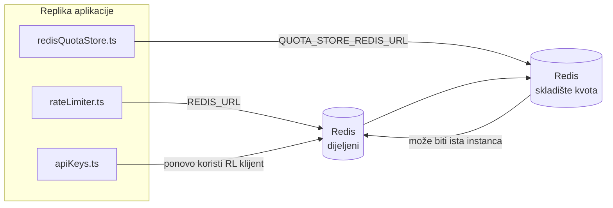

# REDIS_PRODUCTION_CONFIG (Bosanski)

🌐 **Languages:** 🇺🇸 [English](../../../../ops/REDIS_PRODUCTION_CONFIG.md) · 🇪🇹 [am](../../../am/docs/ops/REDIS_PRODUCTION_CONFIG.md) · 🇸🇦 [ar](../../../ar/docs/ops/REDIS_PRODUCTION_CONFIG.md) · 🇦🇿 [az](../../../az/docs/ops/REDIS_PRODUCTION_CONFIG.md) · 🇧🇬 [bg](../../../bg/docs/ops/REDIS_PRODUCTION_CONFIG.md) · 🇧🇩 [bn](../../../bn/docs/ops/REDIS_PRODUCTION_CONFIG.md) · 🇨🇿 [cs](../../../cs/docs/ops/REDIS_PRODUCTION_CONFIG.md) · 🇩🇰 [da](../../../da/docs/ops/REDIS_PRODUCTION_CONFIG.md) · 🇩🇪 [de](../../../de/docs/ops/REDIS_PRODUCTION_CONFIG.md) · 🇬🇷 [el](../../../el/docs/ops/REDIS_PRODUCTION_CONFIG.md) · 🇪🇸 [es](../../../es/docs/ops/REDIS_PRODUCTION_CONFIG.md) · 🇪🇪 [et](../../../et/docs/ops/REDIS_PRODUCTION_CONFIG.md) · 🇮🇷 [fa](../../../fa/docs/ops/REDIS_PRODUCTION_CONFIG.md) · 🇫🇮 [fi](../../../fi/docs/ops/REDIS_PRODUCTION_CONFIG.md) · 🇫🇷 [fr](../../../fr/docs/ops/REDIS_PRODUCTION_CONFIG.md) · 🇮🇪 [ga](../../../ga/docs/ops/REDIS_PRODUCTION_CONFIG.md) · 🇮🇳 [gu](../../../gu/docs/ops/REDIS_PRODUCTION_CONFIG.md) · 🇳🇬 [ha](../../../ha/docs/ops/REDIS_PRODUCTION_CONFIG.md) · 🇮🇱 [he](../../../he/docs/ops/REDIS_PRODUCTION_CONFIG.md) · 🇮🇳 [hi](../../../hi/docs/ops/REDIS_PRODUCTION_CONFIG.md) · 🇭🇷 [hr](../../../hr/docs/ops/REDIS_PRODUCTION_CONFIG.md) · 🇭🇺 [hu](../../../hu/docs/ops/REDIS_PRODUCTION_CONFIG.md) · 🇦🇲 [hy](../../../hy/docs/ops/REDIS_PRODUCTION_CONFIG.md) · 🇮🇩 [id](../../../id/docs/ops/REDIS_PRODUCTION_CONFIG.md) · 🇳🇬 [ig](../../../ig/docs/ops/REDIS_PRODUCTION_CONFIG.md) · 🇮🇹 [it](../../../it/docs/ops/REDIS_PRODUCTION_CONFIG.md) · 🇯🇵 [ja](../../../ja/docs/ops/REDIS_PRODUCTION_CONFIG.md) · 🇬🇪 [ka](../../../ka/docs/ops/REDIS_PRODUCTION_CONFIG.md) · 🇰🇭 [km](../../../km/docs/ops/REDIS_PRODUCTION_CONFIG.md) · 🇮🇳 [kn](../../../kn/docs/ops/REDIS_PRODUCTION_CONFIG.md) · 🇰🇷 [ko](../../../ko/docs/ops/REDIS_PRODUCTION_CONFIG.md) · 🇱🇹 [lt](../../../lt/docs/ops/REDIS_PRODUCTION_CONFIG.md) · 🇱🇻 [lv](../../../lv/docs/ops/REDIS_PRODUCTION_CONFIG.md) · 🇮🇳 [ml](../../../ml/docs/ops/REDIS_PRODUCTION_CONFIG.md) · 🇮🇳 [mr](../../../mr/docs/ops/REDIS_PRODUCTION_CONFIG.md) · 🇲🇾 [ms](../../../ms/docs/ops/REDIS_PRODUCTION_CONFIG.md) · 🇲🇹 [mt](../../../mt/docs/ops/REDIS_PRODUCTION_CONFIG.md) · 🇲🇲 [my](../../../my/docs/ops/REDIS_PRODUCTION_CONFIG.md) · 🇳🇵 [ne](../../../ne/docs/ops/REDIS_PRODUCTION_CONFIG.md) · 🇳🇱 [nl](../../../nl/docs/ops/REDIS_PRODUCTION_CONFIG.md) · 🇳🇴 [no](../../../no/docs/ops/REDIS_PRODUCTION_CONFIG.md) · 🇮🇳 [or](../../../or/docs/ops/REDIS_PRODUCTION_CONFIG.md) · 🇮🇳 [pa](../../../pa/docs/ops/REDIS_PRODUCTION_CONFIG.md) · 🇵🇭 [phi](../../../phi/docs/ops/REDIS_PRODUCTION_CONFIG.md) · 🇵🇱 [pl](../../../pl/docs/ops/REDIS_PRODUCTION_CONFIG.md) · 🇵🇹 [pt](../../../pt/docs/ops/REDIS_PRODUCTION_CONFIG.md) · 🇧🇷 [pt-BR](../../../pt-BR/docs/ops/REDIS_PRODUCTION_CONFIG.md) · 🇷🇴 [ro](../../../ro/docs/ops/REDIS_PRODUCTION_CONFIG.md) · 🇷🇺 [ru](../../../ru/docs/ops/REDIS_PRODUCTION_CONFIG.md) · 🇱🇰 [si](../../../si/docs/ops/REDIS_PRODUCTION_CONFIG.md) · 🇸🇰 [sk](../../../sk/docs/ops/REDIS_PRODUCTION_CONFIG.md) · 🇸🇮 [sl](../../../sl/docs/ops/REDIS_PRODUCTION_CONFIG.md) · 🇷🇸 [sr](../../../sr/docs/ops/REDIS_PRODUCTION_CONFIG.md) · 🇸🇪 [sv](../../../sv/docs/ops/REDIS_PRODUCTION_CONFIG.md) · 🇰🇪 [sw](../../../sw/docs/ops/REDIS_PRODUCTION_CONFIG.md) · 🇮🇳 [ta](../../../ta/docs/ops/REDIS_PRODUCTION_CONFIG.md) · 🇮🇳 [te](../../../te/docs/ops/REDIS_PRODUCTION_CONFIG.md) · 🇹🇭 [th](../../../th/docs/ops/REDIS_PRODUCTION_CONFIG.md) · 🇹🇷 [tr](../../../tr/docs/ops/REDIS_PRODUCTION_CONFIG.md) · 🇺🇦 [uk-UA](../../../uk-UA/docs/ops/REDIS_PRODUCTION_CONFIG.md) · 🇵🇰 [ur](../../../ur/docs/ops/REDIS_PRODUCTION_CONFIG.md) · 🇺🇿 [uz](../../../uz/docs/ops/REDIS_PRODUCTION_CONFIG.md) · 🇻🇳 [vi](../../../vi/docs/ops/REDIS_PRODUCTION_CONFIG.md) · 🇳🇬 [yo](../../../yo/docs/ops/REDIS_PRODUCTION_CONFIG.md) · 🇨🇳 [zh-CN](../../../zh-CN/docs/ops/REDIS_PRODUCTION_CONFIG.md) · 🇹🇼 [zh-TW](../../../zh-TW/docs/ops/REDIS_PRODUCTION_CONFIG.md)

---

# Vodič za produkcijsku konfiguraciju Redis-a

## Pregled

Redis je **opcionalna, meka zavisnost** u OmniRoute-u — aplikacija se elegantno degradira (rezervne opcije u memoriji) kada Redis nije dostupan. U produkciji, podešavanje Redis-a smanjuje latenciju za četiri različita radna opterećenja:

| Radno opterećenje      | Drajver                       | Fabrika klijenata                             | Obrazac ključa                               |
| ---------------------- | ----------------------------- | --------------------------------------------- | -------------------------------------------- |
| Rate limiting          | `rateLimiter.ts`              | `getRedisClient()` — lazy `ioredis` singleton | `<prefix>rl:*` Lua‑atomic rate limit prozori |
| Auth cache             | `apiKeys.ts`                  | Ponovo koristi klijent `rateLimiter`-a        | `<prefix>auth:api_key:<sha256>` sa TTL       |
| Quota store            | `redisQuotaStore.ts`          | Zaseban `getRedisClient(url)` singleton       | `<prefix>quota:*` podesivo po instanci       |
| Warmup circuit breaker | `redisCircuitBreakerStore.ts` | Zaseban klijent u `circuitBreakerFactory.ts`  | `<prefix>warmup:cb:<connectionId>`           |

Sva četiri radna opterećenja dijele jedan prefiks imenskog prostora tako da OmniRoute može koegzistirati sa drugim aplikacijama na jednoj Redis instanci (npr. `127.0.0.1:6379`). Pogledajte [Imenski prostori ključeva](#key-namespacing).

---

## Trenutna konfiguracija (podrazumijevane vrijednosti koda)

| Postavka                        | Vrijednost                                                                 | Gdje                                                                                  |
| ------------------------------- | -------------------------------------------------------------------------- | ------------------------------------------------------------------------------------- |
| `REDIS_URL` env var             | `redis://redis:6379` (compose), opcionalno                                 | `rateLimiter.ts:5`, `.env.example`                                                    |
| `REDIS_KEY_PREFIX` env var      | `omniroute:` (podrazumijevano)                                             | `rateLimiter.ts`, `redisQuotaStore.ts`, `redisCircuitBreakerStore.ts`, `.env.example` |
| `QUOTA_STORE_REDIS_URL` env var | odvojeno, može se razlikovati od `REDIS_URL`                               | `quota/storeFactory.ts`                                                               |
| `QUOTA_STORE_DRIVER`            | `"sqlite"` (podrazumijevano), `"redis"` opcionalno                         | `quota/storeFactory.ts`                                                               |
| ioredis `maxRetriesPerRequest`  | `3`                                                                        | kreiranje klijenta `rateLimiter.ts`                                                   |
| `enableReadyCheck`              | nije postavljeno (podrazumijevano za ioredis: `true`)                      | —                                                                                     |
| `lazyConnect`                   | nije postavljeno (podrazumijevano za ioredis: `false`)                     | —                                                                                     |
| `retryStrategy`                 | nije postavljeno (podrazumijevano za ioredis: 200ms baza, eksponencijalno) | —                                                                                     |
| TLS / lozinka / DB indeks       | **nije konfigurisan**                                                      | —                                                                                     |
| Sentinel / Klaster              | **nije konfigurisan** — samo samostalni čvor (single-node)                 | —                                                                                     |

---

## Imenski prostori ključeva

OmniRoute dijeli Redis instancu sa bilo čim drugim što se pokreće na hostu. Bez imenskog prostora, ključevi poput `auth:api_key:<sha256>` ili `rl:*` bi se mogli sudariti sa ključevima iz drugih aplikacija koje koriste isti Redis (ova instanca pokreće Redis na `127.0.0.1:6379` zajedno sa drugim servisima).

Postavite `REDIS_KEY_PREFIX` na neprazan string da biste dodali prefiks **svakom** OmniRoute ključu:

```bash
# .env — svi OmniRoute ključevi postaju omniroute:rl:*, omniroute:auth:*, omniroute:quota:*, omniroute:warmup:cb:*
REDIS_KEY_PREFIX=omniroute:
```

- **Podrazumijevano:** `omniroute:` (primjenjuje se kada je `REDIS_KEY_PREFIX` nepostavljen ili prazan).
- **Primjenjuje se na:** rate limiter + keš autentifikacije (dijeljeni `ioredis` klijent putem `keyPrefix`) i skladište kvota (`KEY_PREFIX = "${REDIS_KEY_PREFIX}quota"`) i prekidač strujnog kola za zagrijavanje (`KEY_PREFIX = "${REDIS_KEY_PREFIX}warmup:cb:"`).
- **Promjena prefiksa** kada ključevi već postoje u Redis-u napušta stare ključeve (oni ističu putem TTL / LRU). Sigurno za promjenu; nije potrebna migracija. Jedini izuzetak je ključ prekidača strujnog kola za zagrijavanje za konekciju označenu kao zabranjenu: on se čuva bez TTL-a, pa izlistajte ostatke pomoću `redis-cli --scan --pattern '<old-prefix>warmup:cb:*'` i obrišite ih.
- **ioredis `keyPrefix`** automatski dodaje prefiks pri upisima **i** uklanja ga pri čitanjima, tako da kod aplikacije nikada ne vidi prefiks.

---

## Preporučeno podešavanje za produkciju

### 1. Bazen konekcija / Opcije klijenta (ioredis `Redis` konstruktor)

Trenutni kod kreira jedan `new Redis(url)` bez prilagođenih opcija. Za produkcijska multi-replika okruženja, proslijedite fabriku klijenata u kodu ili obmotajte `getRedisClient()`:

```typescript
const redis = new Redis(REDIS_URL, {
  maxRetriesPerRequest: null, // bez ograničenja ponovnih pokušaja; neka retryStrategy odluči
  enableReadyCheck: true, // provjeri da li je server spreman prije prihvatanja poziva
  lazyConnect: true, // ne povezuj se pri konstrukciji; sačekaj prvi poziv
  retryStrategy: (times) => {
    if (times > 10) return null; // odustani nakon 10 pokušaja → ponovo se poveži kasnije
    return Math.min(times * 200, 5000); // 200ms, 400ms, …, 5s ograničenje
  },
  enableAutoPipelining: true, // spoji istovremene komande u jedan TCP upis
  keepAlive: 10000, // TCP keep‑alive na svakih 10s
});
```

**Ključni kompromisi:**

- `maxRetriesPerRequest: null` + `retryStrategy` — preferisano za produkciju tako da privremena ponovna pokretanja Redis-a ne uzrokuju trenutni neuspjeh svakog zahtjeva. In-memory rezervna opcija u `checkRateLimit()` apsorbuje putanju neuspjeha.
- `lazyConnect: true` — izbjegava zavisnost pri pokretanju da Redis mora biti aktivan prije nego što server počne prihvatati konekcije.
- `enableAutoPipelining: true` — smanjuje povratne pozive (round-trips) za istovremene provjere ograničenja stope (rate-limit); korisno pri >50 RPS na jednoj konekciji.

### 2. Konfiguracija Redis servera (`redis.conf`)

```
# Memorija
maxmemory 80%                        # ostavi prostora za keš stranica OS-a
maxmemory-policy allkeys-lru         # izbaci zastarjele unose auth keša pod pritiskom

# Postojanost (opciono — OmniRoute je siguran od pada i bez ovoga)
save 300 1                           # snimak najmanje svakih 5 min ako je ≥1 ključ promijenjen
appendonly no                        # AOF nije potreban; podaci se mogu regenerisati
appendfsync no                       # bez fsync režijskih troškova (RDB je dovoljan)

# Umrežavanje
timeout 0                            # bez prekida veze zbog neaktivnosti
tcp-keepalive 300                    # 5 min keep‑alive
tcp-backlog 511                      # backlog konekcija za nagla opterećenja

# Performanse
hz 10                                # podrazumijevano; 100 za osjetljive na latenciju
activedefrag yes                     # automatska defragmentacija kada je fragmentacija >10%
```

**Kompromis za `maxmemory-policy allkeys-lru`:** Unosi u auth kešu mogu biti izbačeni pod memorijskim pritiskom. Ovo je sigurno — `setCachedApiKey` uvijek ponovo popunjava podatke pri promašaju, a SQLite rezervna opcija je mjerodavna. Lua skripta za ograničavanje stope kreira male ključeve koji su po dizajnu kratkotrajni.

### 3. Docker Compose postavke

Prod compose (`docker-compose.prod.yml`) koristi `redis:8.6.2-alpine`. Dodajte:

```yaml
redis:
  image: redis:8.6.2-alpine
  command:
    [
      "redis-server",
      "--maxmemory",
      "512mb",
      "--maxmemory-policy",
      "allkeys-lru",
      "--activedefrag",
      "yes",
      "--save",
      "300 1",
    ]
  healthcheck:
    test: ["CMD", "redis-cli", "ping"]
    interval: 10s
    timeout: 3s
    retries: 3
    start_period: 5s
```

### 4. Razmatranja o više instanci / skaliranju

**Jedan Redis za sve replike** — Lua skripta za ograničavanje stope zavisi od jednog mjerodavnog prostora ključeva. Više Redis instanci iza replika bi izgubilo atomičnost i udvostručilo budžet. Koristite jedan Redis (ili Redis Sentinel klaster sa failover-om) za sve replike aplikacije.

**Broj konekcija:** Svaka replika aplikacije otvara **2 TCP konekcije** ka Redis-u (klijent za ograničavanje stope + klijent za skladištenje kvota). Sa 10 replika → 20 konekcija, što je daleko unutar limita od 10k konekcija podrazumijevane Redis instance.

### 5. Nadgledanje

Izložite putem health-check krajnje tačke (endpoint):

```typescript
// src/app/api/monitoring/health/route.ts već poziva rateLimiter funkcije
// Dodajte provjere specifične za Redis:
//   1. PING latencija putem ioredis .ping()
//   2. Korištenje memorije putem INFO memory
//   3. Broj konekcija putem INFO clients
//   4. Stopa pogodaka za maxmemory-policy (evicted_keys / keyspace_hits)
```

Ključne metrike za praćenje:

- **Izbačeni ključevi / sek** — ako je trajno različito od nule, povećajte `maxmemory`
- **Blokirani klijenti** — vrijednost različita od nule sugeriše spore Lua skripte ili visoku konkurentnost
- **Odbijene konekcije** — dostignut limit konekcija; rijetko pri 20 konekcija

---

## Dijagram arhitekture



---

## Reference

| Datoteka                           | Namjena                                                                        |
| ---------------------------------- | ------------------------------------------------------------------------------ |
| `src/shared/utils/rateLimiter.ts`  | Primarni Redis klijent, Lua skripta za ograničavanje brzine, in-memory zamjena |
| `src/lib/db/apiKeys.ts`            | Auth keš — Redis→SQLite zamjena                                                |
| `src/lib/quota/redisQuotaStore.ts` | Odvojeni Redis klijent za opcionalno skladište kvota                           |
| `src/lib/quota/storeFactory.ts`    | Prebacuje između sqlite i redis drajvera za kvote                              |
| `docker-compose.prod.yml`          | Prod Redis kontejner (slika redis:8.6.2-alpine)                                |
| `.env.example`                     | Dokumentacija Redis env varijabli                                              |
| `src/app/api/local/redis/`         | API rute za orkestraciju dev kontejnera                                        |
| `bin/cli/commands/redis.mjs`       | CLI komande za orkestraciju dev kontejnera                                     |
