# omniroute — Kodebasedokumentation

🌐 **Languages:** 🇺🇸 [English](../../CODEBASE_DOCUMENTATION.md) | 🇧🇷 [Português (Brasil)](../pt-BR/CODEBASE_DOCUMENTATION.md) | 🇪🇸 [Español](../es/CODEBASE_DOCUMENTATION.md) | 🇫🇷 [Français](../fr/CODEBASE_DOCUMENTATION.md) | 🇮🇹 [Italiano](../it/CODEBASE_DOCUMENTATION.md) | 🇷🇺 [Русский](../ru/CODEBASE_DOCUMENTATION.md) | 🇨🇳 [中文 (简体)](../zh-CN/CODEBASE_DOCUMENTATION.md) | 🇩🇪 [Deutsch](../de/CODEBASE_DOCUMENTATION.md) | 🇮🇳 [हिन्दी](../in/CODEBASE_DOCUMENTATION.md) | 🇹🇭 [ไทย](../th/CODEBASE_DOCUMENTATION.md) | 🇺🇦 [Українська](../uk-UA/CODEBASE_DOCUMENTATION.md) | 🇸🇦 [العربية](../ar/CODEBASE_DOCUMENTATION.md) | 🇯🇵 [日本語](../ja/CODEBASE_DOCUMENTATION.md) | 🇻🇳 [Tiếng Việt](../vi/CODEBASE_DOCUMENTATION.md) | 🇧🇬 [Български](../bg/CODEBASE_DOCUMENTATION.md) | 🇩🇰 [Dansk](../da/CODEBASE_DOCUMENTATION.md) | 🇫🇮 [Suomi](../fi/CODEBASE_DOCUMENTATION.md) | 🇮🇱 [עברית](../he/CODEBASE_DOCUMENTATION.md) | 🇭🇺 [Magyar](../hu/CODEBASE_DOCUMENTATION.md) | 🇮🇩 [Bahasa Indonesia](../id/CODEBASE_DOCUMENTATION.md) | 🇰🇷 [한국어](../ko/CODEBASE_DOCUMENTATION.md) | 🇲🇾 [Bahasa Melayu](../ms/CODEBASE_DOCUMENTATION.md) | 🇳🇱 [Nederlands](../nl/CODEBASE_DOCUMENTATION.md) | 🇳🇴 [Norsk](../no/CODEBASE_DOCUMENTATION.md) | 🇵🇹 [Português (Portugal)](../pt/CODEBASE_DOCUMENTATION.md) | 🇷🇴 [Română](../ro/CODEBASE_DOCUMENTATION.md) | 🇵🇱 [Polski](../pl/CODEBASE_DOCUMENTATION.md) | 🇸🇰 [Slovenčina](../sk/CODEBASE_DOCUMENTATION.md) | 🇸🇪 [Svenska](../sv/CODEBASE_DOCUMENTATION.md) | 🇵🇭 [Filipino](../phi/CODEBASE_DOCUMENTATION.md)

> En omfattende, begyndervenlig guide til **omniroute** multi-udbyder AI proxy-routeren.

---

## 1. Hvad er omniroute?

omniroute er en **proxy-router**, der sidder mellem AI-klienter (Claude CLI, Codex, Cursor IDE osv.) og AI-udbydere (Anthropic, Google, OpenAI, AWS, GitHub osv.). Det l√∏ser et stort problem:

> **Forskellige AI-klienter taler forskellige "sprog" (API-formater), og forskellige AI-udbydere forventer også forskellige "sprog".** omniroute oversætter mellem dem automatisk.

Tænk på det som en universel oversætter i FN - enhver delegeret kan tale et hvilket som helst sprog, og oversætteren konverterer det til enhver anden delegeret.

---

## 2. Arkitekturoversigt

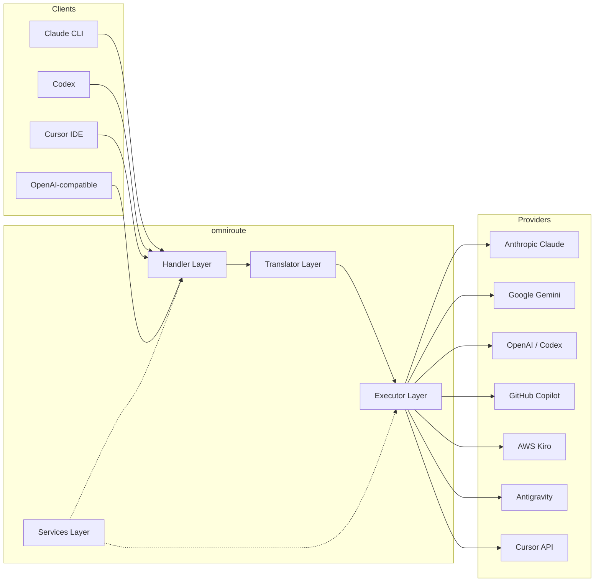
```mermaid
graph LR
    subgraph Clients
        A[Claude CLI]
        B[Codex]
        C[Cursor IDE]
        D[OpenAI-compatible]
    end

    subgraph omniroute
        E[Handler Layer]
        F[Translator Layer]
        G[Executor Layer]
        H[Services Layer]
    end

    subgraph Providers
        I[Anthropic Claude]
        J[Google Gemini]
        K[OpenAI / Codex]
        L[GitHub Copilot]
        M[AWS Kiro]
        N[Antigravity]
        O[Cursor API]
    end

    A --> E
    B --> E
    C --> E
    D --> E
    E --> F
    F --> G
    G --> I
    G --> J
    G --> K
    G --> L
    G --> M
    G --> N
    G --> O
    H -.-> E
    H -.-> G
```

### Kerneprincip: Hub-and-Speake-oversættelse

Al formatoversættelse passerer gennem **OpenAI-formatet som hub**:

```
Client Format ‚Üí [OpenAI Hub] ‚Üí Provider Format    (request)
Provider Format ‚Üí [OpenAI Hub] ‚Üí Client Format    (response)
```

Det betyder, at du kun behøver **N oversættere** (én pr. format) i stedet for **N²** (hvert par).

---

## 3. Projektstruktur

```
omniroute/
├── open-sse/                  ← Core proxy library (portable, framework-agnostic)
│   ├── index.js               ← Main entry point, exports everything
│   ├── config/                ← Configuration & constants
│   ├── executors/             ← Provider-specific request execution
│   ├── handlers/              ← Request handling orchestration
│   ├── services/              ← Business logic (auth, models, fallback, usage)
│   ├── translator/            ← Format translation engine
│   │   ├── request/           ← Request translators (8 files)
│   │   ├── response/          ← Response translators (7 files)
│   │   └── helpers/           ← Shared translation utilities (6 files)
│   └── utils/                 ← Utility functions
├── src/                       ← Application layer (Express/Worker runtime)
│   ├── app/                   ← Web UI, API routes, middleware
│   ├── lib/                   ← Database, auth, and shared library code
│   ├── mitm/                  ← Man-in-the-middle proxy utilities
│   ├── models/                ← Database models
│   ├── shared/                ← Shared utilities (wrappers around open-sse)
│   ├── sse/                   ← SSE endpoint handlers
│   └── store/                 ← State management
├── data/                      ← Runtime data (credentials, logs)
│   └── provider-credentials.json   (external credentials override, gitignored)
└── tester/                    ← Test utilities
```

---

## 4. Modul-for-modul-opdeling

### 4.1 Config (`open-sse/config/`)

Den **enkelte kilde til sandhed** for alle udbyderkonfigurationer.

| Fil                           | Formål                                                                                                                                                                                                                                 |
| ----------------------------- | -------------------------------------------------------------------------------------------------------------------------------------------------------------------------------------------------------------------------------------- |
| `constants.ts`                | `PROVIDERS` objekt med basis-URL'er, OAuth-legitimationsoplysninger (standarder), headere og standardsystemprompter for hver udbyder. Definerer også `HTTP_STATUS`, `ERROR_TYPES`, `COOLDOWN_MS`, `BACKOFF_CONFIG` og `SKIP_PATTERNS`. |
| `credentialLoader.ts`         | Indlæser eksterne legitimationsoplysninger fra `data/provider-credentials.json` og fletter dem over de hårdkodede standardindstillinger i `PROVIDERS`. Holder hemmeligheder uden for kildekontrol og bevarer bagudkompatibilitet.      |
| `providerModels.ts`           | Central modelregistrering: kortudbyderaliasser ‚Üí model-id'er. Funktioner som `getModels()`, `getProviderByAlias()`.                                                                                                                    |
| `codexInstructions.ts`        | Systeminstruktioner indsat i Codex-anmodninger (redigeringsbegrænsninger, sandkasseregler, godkendelsespolitikker).                                                                                                                    |
| `defaultThinkingSignature.ts` | Standard "tænkende" signaturer for Claude og Gemini modeller.                                                                                                                                                                          |
| `ollamaModels.ts`             | Skemadefinition for lokale Ollama-modeller (navn, st√∏rrelse, familie, kvantisering).                                                                                                                                                   |

#### Credential Loading Flow

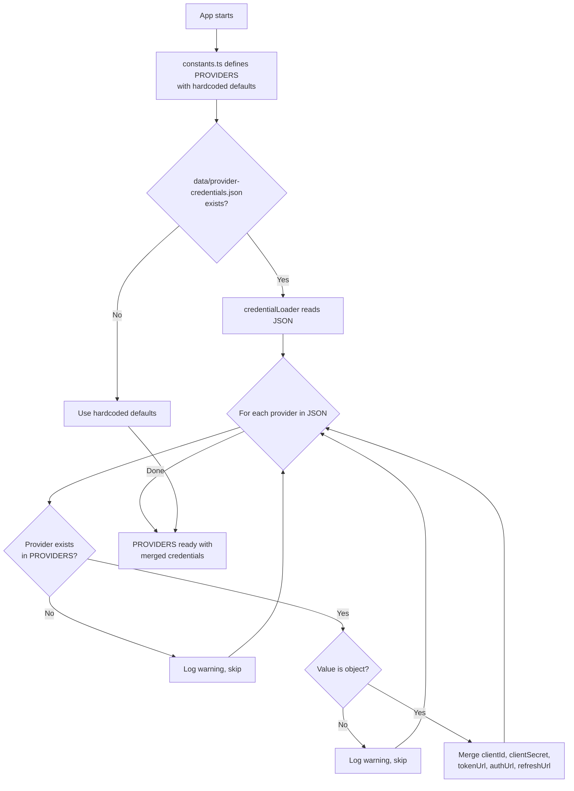
```mermaid
flowchart TD
    A["App starts"] --> B["constants.ts defines PROVIDERS\nwith hardcoded defaults"]
    B --> C{"data/provider-credentials.json\nexists?"}
    C -->|Yes| D["credentialLoader reads JSON"]
    C -->|No| E["Use hardcoded defaults"]
    D --> F{"For each provider in JSON"}
    F --> G{"Provider exists\nin PROVIDERS?"}
    G -->|No| H["Log warning, skip"]
    G -->|Yes| I{"Value is object?"}
    I -->|No| J["Log warning, skip"]
    I -->|Yes| K["Merge clientId, clientSecret,\ntokenUrl, authUrl, refreshUrl"]
    K --> F
    H --> F
    J --> F
    F -->|Done| L["PROVIDERS ready with\nmerged credentials"]
    E --> L
```

---

### 4.2 Eksekut√∏rer (`open-sse/executors/`)

Eksekutører indkapsler **udbyderspecifik logik** ved hjælp af **Strategy Pattern**. Hver executor tilsidesætter basismetoder efter behov.

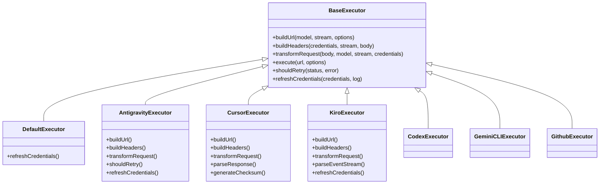
```mermaid
classDiagram
    class BaseExecutor {
        +buildUrl(model, stream, options)
        +buildHeaders(credentials, stream, body)
        +transformRequest(body, model, stream, credentials)
        +execute(url, options)
        +shouldRetry(status, error)
        +refreshCredentials(credentials, log)
    }

    class DefaultExecutor {
        +refreshCredentials()
    }

    class AntigravityExecutor {
        +buildUrl()
        +buildHeaders()
        +transformRequest()
        +shouldRetry()
        +refreshCredentials()
    }

    class CursorExecutor {
        +buildUrl()
        +buildHeaders()
        +transformRequest()
        +parseResponse()
        +generateChecksum()
    }

    class KiroExecutor {
        +buildUrl()
        +buildHeaders()
        +transformRequest()
        +parseEventStream()
        +refreshCredentials()
    }

    BaseExecutor <|-- DefaultExecutor
    BaseExecutor <|-- AntigravityExecutor
    BaseExecutor <|-- CursorExecutor
    BaseExecutor <|-- KiroExecutor
    BaseExecutor <|-- CodexExecutor
    BaseExecutor <|-- GeminiCLIExecutor
    BaseExecutor <|-- GithubExecutor
```

| Eksekut√∏r        | Udbyder                                    | N√∏glespecialiseringer                                                                                                                    |
| ---------------- | ------------------------------------------ | ---------------------------------------------------------------------------------------------------------------------------------------- |
| `base.ts`        | —                                          | Abstrakt base: URL-opbygning, overskrifter, genforsøgslogik, opdatering af legitimationsoplysninger                                      |
| `default.ts`     | Claude, Gemini, OpenAI, GLM, Kimi, MiniMax | Generisk OAuth-tokenopdatering til standardudbydere                                                                                      |
| `antigravity.ts` | Google Cloud-kode                          | Generering af projekt-/sessions-id, multi-URL fallback, brugerdefineret genfors√∏g at parse fra fejlmeddelelser ("nulstil efter 2t7m23s") |
| `cursor.ts`      | Markør IDE                                 | **Mest kompleks**: SHA-256 checksum auth, Protobuf request encoding, binær EventStream → SSE respons parsing                             |
| `codex.ts`       | OpenAI Codex                               | Injicerer systeminstruktioner, styrer tankeniveauer, fjerner ikke-underst√∏ttede parametre                                                |
| `gemini-cli.ts`  | Google Gemini CLI                          | Opbygning af tilpasset URL (`streamGenerateContent`), opdatering af Google OAuth-token                                                   |
| `github.ts`      | GitHub Copilot                             | Dobbelt token-system (GitHub OAuth + Copilot-token), VSCode-header-efterligning                                                          |
| `kiro.ts`        | AWS CodeWhisperer                          | AWS EventStream binær parsing, AMZN hændelsesrammer, token estimering                                                                    |
| `index.ts`       | —                                          | Fabrik: navn på kortudbyder → eksekveringsklasse, med standard fallback                                                                  |

---

### 4.3 Håndtere (`open-sse/handlers/`)

**Orkestreringslaget** — koordinerer oversættelse, udførelse, streaming og fejlhåndtering.

| Fil                   | Formål                                                                                                                                                                                                                         |
| --------------------- | ------------------------------------------------------------------------------------------------------------------------------------------------------------------------------------------------------------------------------ |
| `chatCore.ts`         | **Central orkestrator** (~600 linjer). Håndterer hele forespørgselslivscyklussen: formatdetektion → oversættelse → eksekutørafsendelse → streaming/ikke-streamingsvar → token-opdatering → fejlhåndtering → logføring af brug. |
| `responsesHandler.ts` | Adapter til OpenAI's Responses API: konverterer svarformat ‚Üí Chatfuldf√∏relser ‚Üí sender til `chatCore` ‚Üí konverterer SSE tilbage til svarformat.                                                                                |
| `embeddings.ts`       | Indlejringsgenereringshåndtering: løser indlejringsmodel → udbyder, sender til udbyder API, returnerer OpenAI-kompatibelt indlejringssvar. Understøtter 6+ udbydere.                                                           |
| `imageGeneration.ts`  | Billedgenereringshåndtering: løser billedmodel → udbyder, understøtter OpenAI-kompatibel, Gemini-image (Antigravity) og fallback (Nebius) tilstande. Returnerer base64- eller URL-billeder.                                    |

#### Anmod om livscyklus (chatCore.ts)

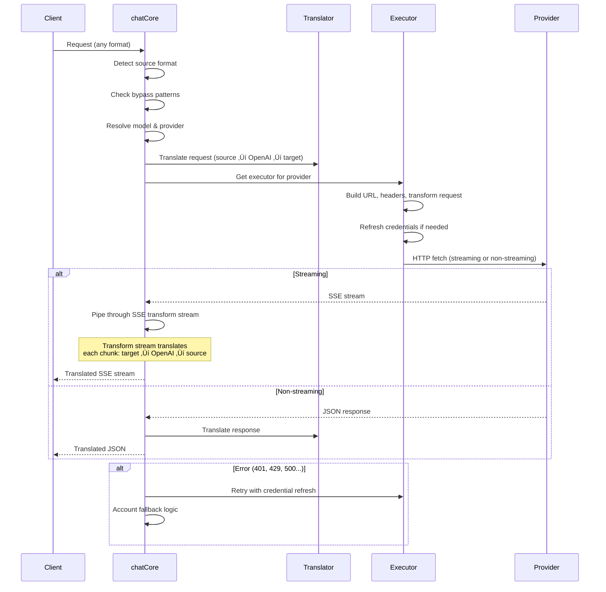
```mermaid
sequenceDiagram
    participant Client
    participant chatCore
    participant Translator
    participant Executor
    participant Provider

    Client->>chatCore: Request (any format)
    chatCore->>chatCore: Detect source format
    chatCore->>chatCore: Check bypass patterns
    chatCore->>chatCore: Resolve model & provider
    chatCore->>Translator: Translate request (source ‚Üí OpenAI ‚Üí target)
    chatCore->>Executor: Get executor for provider
    Executor->>Executor: Build URL, headers, transform request
    Executor->>Executor: Refresh credentials if needed
    Executor->>Provider: HTTP fetch (streaming or non-streaming)

    alt Streaming
        Provider-->>chatCore: SSE stream
        chatCore->>chatCore: Pipe through SSE transform stream
        Note over chatCore: Transform stream translates<br/>each chunk: target ‚Üí OpenAI ‚Üí source
        chatCore-->>Client: Translated SSE stream
    else Non-streaming
        Provider-->>chatCore: JSON response
        chatCore->>Translator: Translate response
        chatCore-->>Client: Translated JSON
    end

    alt Error (401, 429, 500...)
        chatCore->>Executor: Retry with credential refresh
        chatCore->>chatCore: Account fallback logic
    end
```

---

### 4.4 Tjenester (`open-sse/services/`)

Forretningslogik, der underst√∏tter behandlerne og udf√∏rerne.

| Fil                  | Formål                                                                                                                                                                                                                                                                                                                                                     |
| -------------------- | ---------------------------------------------------------------------------------------------------------------------------------------------------------------------------------------------------------------------------------------------------------------------------------------------------------------------------------------------------------- |
| `provider.ts`        | **Formatregistrering** (`detectFormat`): analyser anmoder om kropsstruktur for at identificere Claude/OpenAI/Gemini/Antigravity/Responses-formater (inkluderer `max_tokens` heuristik for Claude). Også: URL-opbygning, header-opbygning, normalisering af tænkekonfig. Understøtter `openai-compatible-*` og `anthropic-compatible-*` dynamiske udbydere. |
| `model.ts`           | Modelstrengparsing (`claude/model-name` ‚Üí `{provider: "claude", model: "model-name"}`), alias-opl√∏sning med kollisionsdetektion, input-sanering (afviser stigennemgang/kontroltegn) og modelinformationsopl√∏sning med underst√∏ttelse af async alias getter.                                                                                                |
| `accountFallback.ts` | Håndtering af hastighedsgrænser: eksponentiel backoff (1s → 2s → 4s → max 2min), kontoafkølingsstyring, fejlklassificering (hvilke fejl udløser fallback vs. ikke).                                                                                                                                                                                        |
| `tokenRefresh.ts`    | Opdatering af OAuth-token for **alle udbydere**: Google (Gemini, Antigravity), Claude, Codex, Qwen, iFlow, GitHub (OAuth + Copilot dual-token), Kiro (AWS SSO OIDC + Social Auth). Inkluderer under flyvning lover deduplikation cache og fors√∏g igen med eksponentiel backoff.                                                                            |
| `combo.ts`           | **Combo-modeller**: kæder af reservemodeller. Hvis model A fejler med en fallback-kvalificeret fejl, prøv model B, derefter C osv. Returnerer faktiske upstream-statuskoder.                                                                                                                                                                               |
| `usage.ts`           | Henter kvote-/brugsdata fra udbyder-API'er (GitHub Copilot-kvoter, Antigravity-modelkvoter, Codex-hastighedsgrænser, Kiro-brugsopdelinger, Claude-indstillinger).                                                                                                                                                                                          |
| `accountSelector.ts` | Smart kontovalg med scoringsalgoritme: overvejer prioritet, sundhedsstatus, round-robin-position og nedkølingstilstand for at vælge den optimale konto for hver anmodning.                                                                                                                                                                                 |
| `contextManager.ts`  | Anmodningskontekstlivscyklusstyring: opretter og sporer kontekstobjekter pr. anmodning med metadata (anmodnings-id, tidsstempler, udbyderoplysninger) til fejlretning og logning.                                                                                                                                                                          |
| `ipFilter.ts`        | IP-baseret adgangskontrol: underst√∏tter tilladelsesliste og bloklistetilstande. Validerer klient-IP mod konfigurerede regler, f√∏r API-anmodninger behandles.                                                                                                                                                                                               |
| `sessionManager.ts`  | Sessionssporing med klientfingeraftryk: sporer aktive sessioner ved hjælp af hashed klient-id'er, overvåger antallet af anmodninger og leverer sessionsmetrics.                                                                                                                                                                                            |
| `signatureCache.ts`  | Anmod om signaturbaseret deduplikeringscache: forhindrer duplikerede anmodninger ved at cache de seneste anmodningssignaturer og returnere cachelagrede svar for identiske anmodninger inden for et tidsvindue.                                                                                                                                            |
| `systemPrompt.ts`    | Global systemprompt-injektion: forudsætter eller tilføjer en konfigurerbar systemprompt til alle anmodninger med kompatibilitetshåndtering pr. udbyder.                                                                                                                                                                                                    |
| `thinkingBudget.ts`  | Reasoning token budget management: understøtter passthrough, auto (strip thinking config), brugerdefineret (fast budget) og adaptive (kompleksitetsskaleret) tilstande til at kontrollere tanke/ræsonnement tokens.                                                                                                                                        |
| `wildcardRouter.ts`  | Routing af jokertegnmodelmønster: løser jokertegnmønstre (f.eks. `*/claude-*`) til konkrete udbyder/modelpar baseret på tilgængelighed og prioritet.                                                                                                                                                                                                       |

#### Token Refresh Deduplication

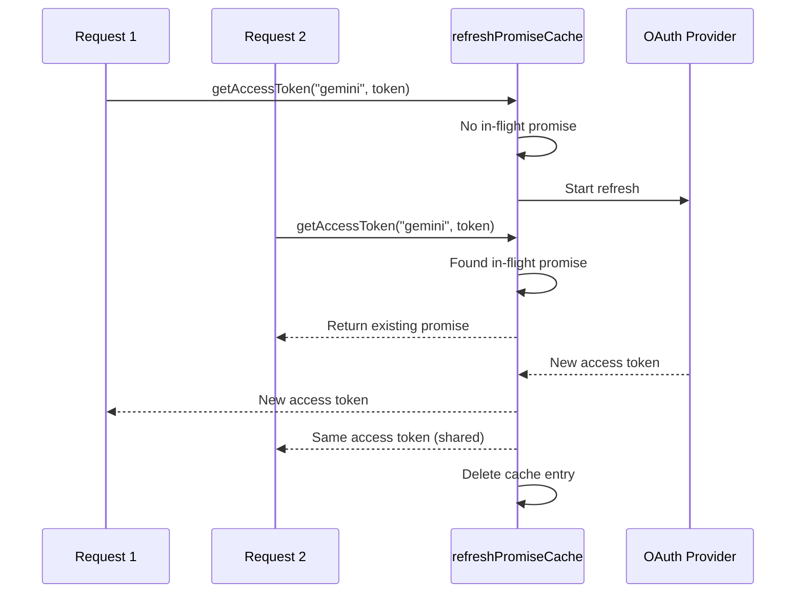
```mermaid
sequenceDiagram
    participant R1 as Request 1
    participant R2 as Request 2
    participant Cache as refreshPromiseCache
    participant OAuth as OAuth Provider

    R1->>Cache: getAccessToken("gemini", token)
    Cache->>Cache: No in-flight promise
    Cache->>OAuth: Start refresh
    R2->>Cache: getAccessToken("gemini", token)
    Cache->>Cache: Found in-flight promise
    Cache-->>R2: Return existing promise
    OAuth-->>Cache: New access token
    Cache-->>R1: New access token
    Cache-->>R2: Same access token (shared)
    Cache->>Cache: Delete cache entry
```

#### Account Fallback State Machine

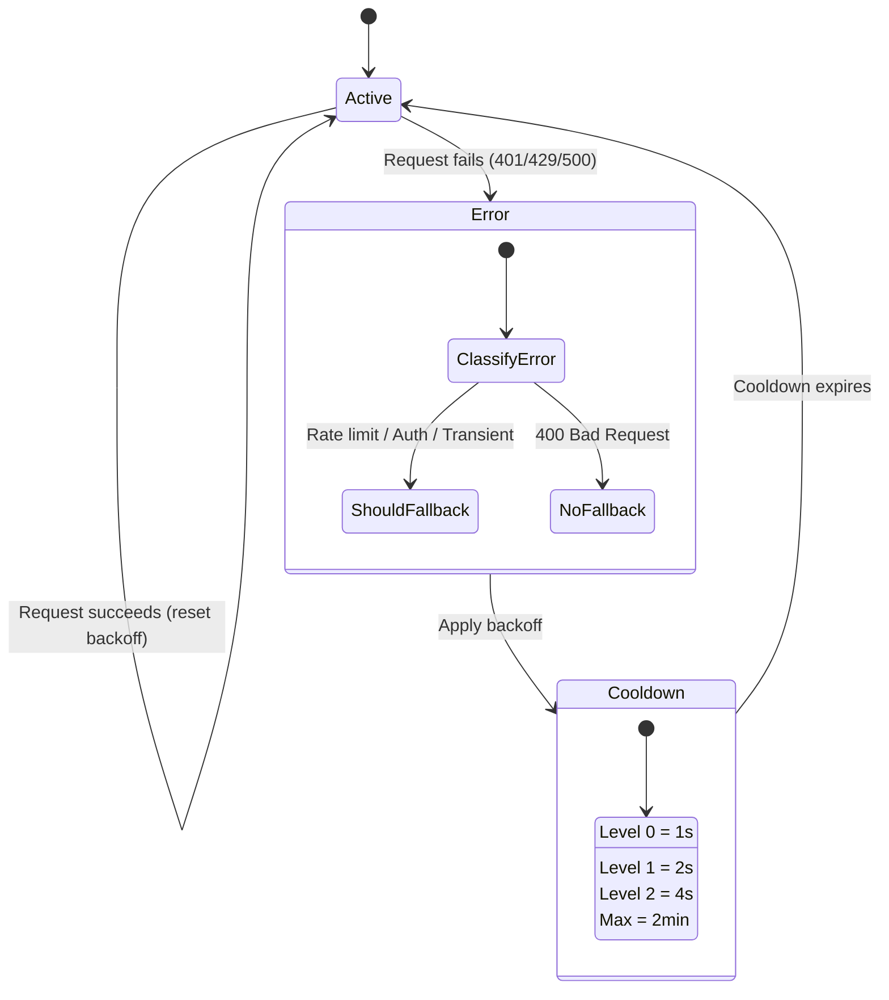
```mermaid
stateDiagram-v2
    [*] --> Active
    Active --> Error: Request fails (401/429/500)
    Error --> Cooldown: Apply backoff
    Cooldown --> Active: Cooldown expires
    Active --> Active: Request succeeds (reset backoff)

    state Error {
        [*] --> ClassifyError
        ClassifyError --> ShouldFallback: Rate limit / Auth / Transient
        ClassifyError --> NoFallback: 400 Bad Request
    }

    state Cooldown {
        [*] --> ExponentialBackoff
        ExponentialBackoff: Level 0 = 1s
        ExponentialBackoff: Level 1 = 2s
        ExponentialBackoff: Level 2 = 4s
        ExponentialBackoff: Max = 2min
    }
```

#### Kombi-modelkæde

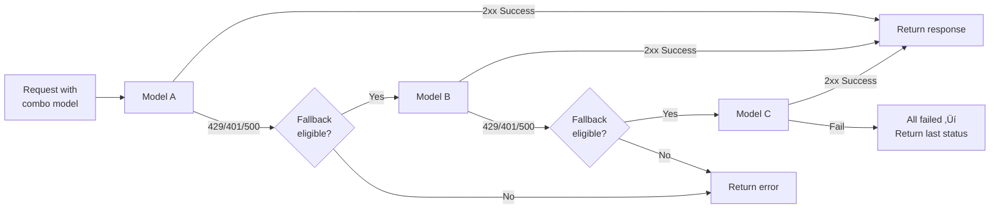
```mermaid
flowchart LR
    A["Request with\ncombo model"] --> B["Model A"]
    B -->|"2xx Success"| C["Return response"]
    B -->|"429/401/500"| D{"Fallback\neligible?"}
    D -->|Yes| E["Model B"]
    D -->|No| F["Return error"]
    E -->|"2xx Success"| C
    E -->|"429/401/500"| G{"Fallback\neligible?"}
    G -->|Yes| H["Model C"]
    G -->|No| F
    H -->|"2xx Success"| C
    H -->|"Fail"| I["All failed ‚Üí\nReturn last status"]
```

---

### 4.5 Oversætter (`open-sse/translator/`)

**formatoversættelsesmotoren** ved hjælp af et selvregistrerende plugin-system.

#### Arkitektur

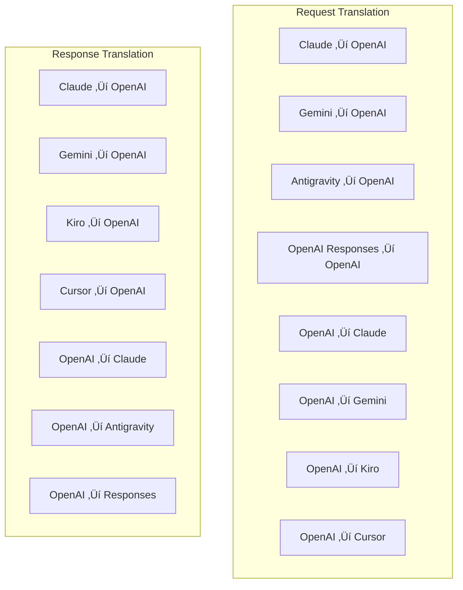
```mermaid
graph TD
    subgraph "Request Translation"
        A["Claude ‚Üí OpenAI"]
        B["Gemini ‚Üí OpenAI"]
        C["Antigravity ‚Üí OpenAI"]
        D["OpenAI Responses ‚Üí OpenAI"]
        E["OpenAI ‚Üí Claude"]
        F["OpenAI ‚Üí Gemini"]
        G["OpenAI ‚Üí Kiro"]
        H["OpenAI ‚Üí Cursor"]
    end

    subgraph "Response Translation"
        I["Claude ‚Üí OpenAI"]
        J["Gemini ‚Üí OpenAI"]
        K["Kiro ‚Üí OpenAI"]
        L["Cursor ‚Üí OpenAI"]
        M["OpenAI ‚Üí Claude"]
        N["OpenAI ‚Üí Antigravity"]
        O["OpenAI ‚Üí Responses"]
    end
```

| Katalog      | Filer         | Beskrivelse                                                                                                                                                                                                                                              |
| ------------ | ------------- | -------------------------------------------------------------------------------------------------------------------------------------------------------------------------------------------------------------------------------------------------------- |
| `request/`   | 8 oversættere | Konverter anmodningstekster mellem formater. Hver fil selvregistreres via `register(from, to, fn)` ved import.                                                                                                                                           |
| `response/`  | 7 oversættere | Konverter streamingsvarstykker mellem formater. Håndterer SSE-hændelsestyper, tænkeblokke, værktøjskald.                                                                                                                                                 |
| `helpers/`   | 6 hjælpere    | Delte hjælpeprogrammer: `claudeHelper` (udtræk af systemprompt, tænkekonfiguration), `geminiHelper` (kortlægning af dele/indhold), `openaiHelper` (formatfiltrering), `toolCallHelper` (ID-generering, manglende svarindsprøjtning), **OMNI\_**TO.\_\_2. |
| `index.ts`   | —             | Oversættelsesmaskine: `translateRequest()`, `translateResponse()`, statsledelse, register.                                                                                                                                                               |
| `formats.ts` | —             | Formatkonstanter: `OPENAI`, `CLAUDE`, `GEMINI`, `ANTIGRAVITY`, `KIRO`, `CURSOR`, `OPENAI_RESPONSES`.                                                                                                                                                     |

#### N√∏gledesign: Selvregistrerende plugins

```javascript
// Each translator file calls register() on import:
import { register } from "../index.js";
register("claude", "openai", translateClaudeToOpenAI);

// The index.js imports all translator files, triggering registration:
import "./request/claude-to-openai.js"; // ‚Üê self-registers
```

---

### 4.6 Utils (`open-sse/utils/`)

| Fil                | Formål                                                                                                                                                                                                                                                                                          |
| ------------------ | ----------------------------------------------------------------------------------------------------------------------------------------------------------------------------------------------------------------------------------------------------------------------------------------------- |
| `error.ts`         | Opbygning af fejlsvar (OpenAI-kompatibelt format), upstream fejlparsing, Antigravity genforsøgstidsudtrækning fra fejlmeddelelser, SSE fejlstreaming.                                                                                                                                           |
| `stream.ts`        | **SSE Transform Stream** — den centrale streamingpipeline. To tilstande: `TRANSLATE` (fuldformatoversættelse) og `PASSTHROUGH` (normalisering + ekstraktionsbrug). Håndterer chunk-buffring, brugsestimering, indholdslængdesporing. Per-stream encoder/decoder-instanser undgår delt tilstand. |
| `streamHelpers.ts` | SSE-værktøjer på lavt niveau: `parseSSELine` (whitespace-tolerant), `hasValuableContent` (filtrerer tomme bidder til OpenAI/Claude/Gemini), `fixInvalidId`, `formatSSE` (format-bevidst SSETOKEN_101** oprydning med **1OMNI_4 oprydning med \_\_OMNI_4).                                       |
| `usageTracking.ts` | Udtræk af tokenbrug fra ethvert format (Claude/OpenAI/Gemini/Responses), estimering med separate værktøj/meddelelse-char-per-token-forhold, buffertilsætning (2000 tokens sikkerhedsmargen), formatspecifik feltfiltrering, konsollogning med ANSI-farver.                                      |
| `requestLogger.ts` | Filbaseret anmodningslogning (tilmelding via `ENABLE_REQUEST_LOGS=true`). Opretter sessionsmapper med nummererede filer: `1_req_client.json` ‚Üí `7_res_client.txt`. Alle I/O er asynkrone (fire-and-forget). Masker f√∏lsomme overskrifter.                                                       |
| `bypassHandler.ts` | Opsnapper specifikke mønstre fra Claude CLI (titeludtræk, opvarmning, optælling) og returnerer falske svar uden at ringe til nogen udbyder. Understøtter både streaming og ikke-streaming. Med vilje begrænset til Claude CLI-omfang.                                                           |
| `networkProxy.ts`  | Løser udgående proxy-URL for en given udbyder med forrang: udbyderspecifik konfiguration → global konfiguration → miljøvariabler (`HTTPS_PROXY`/`HTTP_PROXY`/`ALL_PROXY`). Understøtter `NO_PROXY` ekskluderinger. Caches konfiguration for 30'erne.                                            |

#### SSE Streaming Pipeline

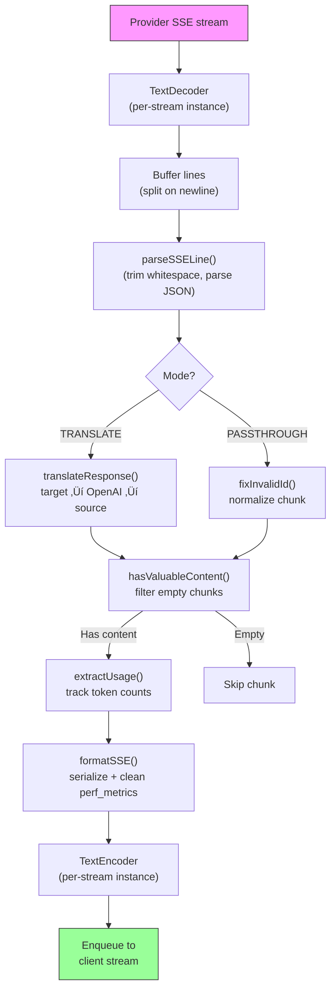
```mermaid
flowchart TD
    A["Provider SSE stream"] --> B["TextDecoder\n(per-stream instance)"]
    B --> C["Buffer lines\n(split on newline)"]
    C --> D["parseSSELine()\n(trim whitespace, parse JSON)"]
    D --> E{"Mode?"}
    E -->|TRANSLATE| F["translateResponse()\ntarget ‚Üí OpenAI ‚Üí source"]
    E -->|PASSTHROUGH| G["fixInvalidId()\nnormalize chunk"]
    F --> H["hasValuableContent()\nfilter empty chunks"]
    G --> H
    H -->|"Has content"| I["extractUsage()\ntrack token counts"]
    H -->|"Empty"| J["Skip chunk"]
    I --> K["formatSSE()\nserialize + clean perf_metrics"]
    K --> L["TextEncoder\n(per-stream instance)"]
    L --> M["Enqueue to\nclient stream"]

    style A fill:#f9f,stroke:#333
    style M fill:#9f9,stroke:#333
```

#### Anmod om loggersessionsstruktur

```
logs/
└── claude_gemini_claude-sonnet_20260208_143045/
    ├── 1_req_client.json      ← Raw client request
    ├── 2_req_source.json      ← After initial conversion
    ├── 3_req_openai.json      ← OpenAI intermediate format
    ├── 4_req_target.json      ← Final target format
    ├── 5_res_provider.txt     ← Provider SSE chunks (streaming)
    ├── 5_res_provider.json    ← Provider response (non-streaming)
    ├── 6_res_openai.txt       ← OpenAI intermediate chunks
    ├── 7_res_client.txt       ← Client-facing SSE chunks
    └── 6_error.json           ← Error details (if any)
```

---

### 4.7 applikationslag (`src/`)

| Katalog       | Formål                                                                       |
| ------------- | ---------------------------------------------------------------------------- |
| `src/app/`    | Web-UI, API-ruter, Express-middleware, OAuth-tilbagekaldsbehandlere          |
| `src/lib/`    | Databaseadgang (`localDb.ts`, `usageDb.ts`), godkendelse, delt               |
| `src/mitm/`   | Man-in-the-middle proxy-værktøjer til at opsnappe udbydertrafik              |
| `src/models/` | Databasemodeldefinitioner                                                    |
| `src/shared/` | Indpakninger omkring åben-sse-funktioner (udbyder, stream, fejl osv.)        |
| `src/sse/`    | SSE-slutpunktshandlere, der forbinder open-sse-biblioteket til Express-ruter |
| `src/store/`  | Administration af applikationstilstand                                       |

#### Bemærkelsesværdige API-ruter

| Rute                                          | Metoder       | Formål                                                                                                 |
| --------------------------------------------- | ------------- | ------------------------------------------------------------------------------------------------------ |
| `/api/provider-models`                        | GET/POST/SLET | CRUD til brugerdefinerede modeller pr. udbyder                                                         |
| `/api/models/catalog`                         | F√Ö            | Samlet katalog over alle modeller (chat, indlejring, billede, brugerdefineret) grupperet efter udbyder |
| `/api/settings/proxy`                         | GET/SETT/SLET | Hierarkisk udgående proxy-konfiguration (`global/providers/combos/keys`)                               |
| `/api/settings/proxy/test`                    | POST          | Validerer proxy-forbindelse og returnerer offentlig IP/latency                                         |
| `/v1/providers/[provider]/chat/completions`   | POST          | Dedikerede chat-afslutninger pr. udbyder med modelvalidering                                           |
| `/v1/providers/[provider]/embeddings`         | POST          | Dedikerede indlejringer pr. udbyder med modelvalidering                                                |
| `/v1/providers/[provider]/images/generations` | POST          | Dedikeret billedgenerering pr. udbyder med modelvalidering                                             |
| `/api/settings/ip-filter`                     | GET/PUT       | Administration af IP-tilladelsesliste/blokeringsliste                                                  |
| `/api/settings/thinking-budget`               | GET/PUT       | Begrundelsestokens budgetkonfiguration (passthrough/auto/custom/adaptive)                              |
| `/api/settings/system-prompt`                 | GET/PUT       | Global systemprompt-injektion for alle anmodninger                                                     |
| `/api/sessions`                               | F√Ö            | Aktiv sessionssporing og metrics                                                                       |
| `/api/rate-limits`                            | FÅ            | Satsgrænsestatus pr. konto                                                                             |

---

## 5. N√∏gledesignm√∏nstre

### 5.1 Hub-and-Speake-oversættelse

Alle formater oversættes gennem **OpenAI-format som hub**. Tilføjelse af en ny udbyder kræver kun at skrive **et par** af oversættere (til/fra OpenAI), ikke N par.

### 5.2 Eksekut√∏rstrategim√∏nster

Hver udbyder har en dedikeret eksekveringsklasse, der arver fra `BaseExecutor`. Fabrikken i `executors/index.ts` vælger den rigtige ved kørsel.

### 5.3 Selvregistrerende plugin-system

Oversættermoduler registrerer sig selv ved import via `register()`. Tilføjelse af en ny oversætter er blot at oprette en fil og importere den.

### 5.4 Account Fallback med eksponentiel backoff

Når en udbyder returnerer 429/401/500, kan systemet skifte til den næste konto ved at anvende eksponentielle nedkøling (1s → 2s → 4s → max 2min).

### 5.5 Combo modelkæder

En "combo" grupperer flere `provider/model` strenge. Hvis den første fejler, går du automatisk tilbage til den næste.

### 5.6 Stateful streaming-oversættelse

Svaroversættelse opretholder tilstand på tværs af SSE-chunks (tænkebloksporing, akkumulering af værktøjsopkald, indholdsblokindeksering) via `initState()`-mekanismen.

### 5.7 Sikkerhedsbuffer for brug

En 2000-token buffer tilføjes til rapporteret brug for at forhindre klienter i at ramme kontekstvinduegrænser på grund af overhead fra systemprompter og formatoversættelse.

---

## 6. Underst√∏ttede formater

| Format                   | Retning     | Identifikator      |
| ------------------------ | ----------- | ------------------ |
| OpenAI Chat fuldførelser | kilde + mål | `openai`           |
| OpenAI Responses API     | kilde + mål | `openai-responses` |
| Antropiske Claude        | kilde + mål | `claude`           |
| Google Gemini            | kilde + mål | `gemini`           |
| Google Gemini CLI        | kun mål     | `gemini-cli`       |
| Antigravitation          | kilde + mål | `antigravity`      |
| AWS Kiro                 | kun mål     | `kiro`             |
| Markør                   | kun mål     | `cursor`           |

---

## 7. Underst√∏ttede udbydere

| Udbyder                  | Auth metode                   | Eksekutør       | Nøglebemærkninger                               |
| ------------------------ | ----------------------------- | --------------- | ----------------------------------------------- |
| Antropiske Claude        | API-n√∏gle eller OAuth         | Standard        | Bruger `x-api-key` header                       |
| Google Gemini            | API-n√∏gle eller OAuth         | Standard        | Bruger `x-goog-api-key` header                  |
| Google Gemini CLI        | OAuth                         | GeminiCLI       | Bruger `streamGenerateContent` slutpunkt        |
| Antigravitation          | OAuth                         | Antigravitation | Multi-URL fallback, tilpasset genfors√∏g parsing |
| OpenAI                   | API nøgle                     | Standard        | Standard bærer auth                             |
| Codex                    | OAuth                         | Codex           | Injicerer systeminstruktioner, styrer tænkning  |
| GitHub Copilot           | OAuth + Copilot-token         | Github          | Dobbelt token, VSCode-header-efterligning       |
| Kiro (AWS)               | AWS SSO OIDC eller Social     | Kiro            | Binær EventStream-parsing                       |
| Mark√∏r IDE               | Kontrolsum auth               | Mark√∏r          | Protobuf-kodning, SHA-256 kontrolsummer         |
| Qwen                     | OAuth                         | Standard        | Standard auth                                   |
| iFlow                    | OAuth (grundlæggende + bærer) | Standard        | Dobbelt godkendelseshoved                       |
| OpenRouter               | API nøgle                     | Standard        | Standard bærer auth                             |
| GLM, Kimi, MiniMax       | API n√∏gle                     | Standard        | Claude-kompatibel, brug `x-api-key`             |
| `openai-compatible-*`    | API n√∏gle                     | Standard        | Dynamisk: ethvert OpenAI-kompatibelt slutpunkt  |
| `anthropic-compatible-*` | API n√∏gle                     | Standard        | Dynamisk: ethvert Claude-kompatibelt slutpunkt  |

---

## 8. Oversigt over dataflow

### Streaminganmodning


```mermaid
flowchart LR
    A["Client"] --> B["detectFormat()"]
    B --> C["translateRequest()\nsource ‚Üí OpenAI ‚Üí target"]
    C --> D["Executor\nbuildUrl + buildHeaders"]
    D --> E["fetch(providerURL)"]
    E --> F["createSSEStream()\nTRANSLATE mode"]
    F --> G["parseSSELine()"]
    G --> H["translateResponse()\ntarget ‚Üí OpenAI ‚Üí source"]
    H --> I["extractUsage()\n+ addBuffer"]
    I --> J["formatSSE()"]
    J --> K["Client receives\ntranslated SSE"]
    K --> L["logUsage()\nsaveRequestUsage()"]
```

### Ikke-streamende anmodning

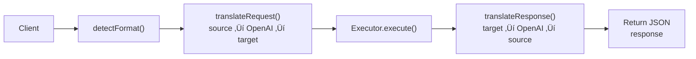
```mermaid
flowchart LR
    A["Client"] --> B["detectFormat()"]
    B --> C["translateRequest()\nsource ‚Üí OpenAI ‚Üí target"]
    C --> D["Executor.execute()"]
    D --> E["translateResponse()\ntarget ‚Üí OpenAI ‚Üí source"]
    E --> F["Return JSON\nresponse"]
```

### Bypass Flow (Claude CLI)

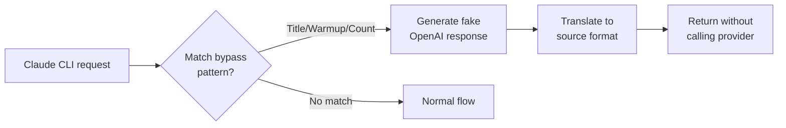
```mermaid
flowchart LR
    A["Claude CLI request"] --> B{"Match bypass\npattern?"}
    B -->|"Title/Warmup/Count"| C["Generate fake\nOpenAI response"]
    B -->|"No match"| D["Normal flow"]
    C --> E["Translate to\nsource format"]
    E --> F["Return without\ncalling provider"]
```
