# omniroute — Documentación de la base de código

🌐 **Languages:** 🇺🇸 [English](../../CODEBASE_DOCUMENTATION.md) | 🇧🇷 [Português (Brasil)](../pt-BR/CODEBASE_DOCUMENTATION.md) | 🇪🇸 [Español](../es/CODEBASE_DOCUMENTATION.md) | 🇫🇷 [Français](../fr/CODEBASE_DOCUMENTATION.md) | 🇮🇹 [Italiano](../it/CODEBASE_DOCUMENTATION.md) | 🇷🇺 [Русский](../ru/CODEBASE_DOCUMENTATION.md) | 🇨🇳 [中文 (简体)](../zh-CN/CODEBASE_DOCUMENTATION.md) | 🇩🇪 [Deutsch](../de/CODEBASE_DOCUMENTATION.md) | 🇮🇳 [हिन्दी](../in/CODEBASE_DOCUMENTATION.md) | 🇹🇭 [ไทย](../th/CODEBASE_DOCUMENTATION.md) | 🇺🇦 [Українська](../uk-UA/CODEBASE_DOCUMENTATION.md) | 🇸🇦 [العربية](../ar/CODEBASE_DOCUMENTATION.md) | 🇯🇵 [日本語](../ja/CODEBASE_DOCUMENTATION.md) | 🇻🇳 [Tiếng Việt](../vi/CODEBASE_DOCUMENTATION.md) | 🇧🇬 [Български](../bg/CODEBASE_DOCUMENTATION.md) | 🇩🇰 [Dansk](../da/CODEBASE_DOCUMENTATION.md) | 🇫🇮 [Suomi](../fi/CODEBASE_DOCUMENTATION.md) | 🇮🇱 [עברית](../he/CODEBASE_DOCUMENTATION.md) | 🇭🇺 [Magyar](../hu/CODEBASE_DOCUMENTATION.md) | 🇮🇩 [Bahasa Indonesia](../id/CODEBASE_DOCUMENTATION.md) | 🇰🇷 [한국어](../ko/CODEBASE_DOCUMENTATION.md) | 🇲🇾 [Bahasa Melayu](../ms/CODEBASE_DOCUMENTATION.md) | 🇳🇱 [Nederlands](../nl/CODEBASE_DOCUMENTATION.md) | 🇳🇴 [Norsk](../no/CODEBASE_DOCUMENTATION.md) | 🇵🇹 [Português (Portugal)](../pt/CODEBASE_DOCUMENTATION.md) | 🇷🇴 [Română](../ro/CODEBASE_DOCUMENTATION.md) | 🇵🇱 [Polski](../pl/CODEBASE_DOCUMENTATION.md) | 🇸🇰 [Slovenčina](../sk/CODEBASE_DOCUMENTATION.md) | 🇸🇪 [Svenska](../sv/CODEBASE_DOCUMENTATION.md) | 🇵🇭 [Filipino](../phi/CODEBASE_DOCUMENTATION.md)

> Una guía completa y fácil de usar para principiantes sobre el enrutador proxy de IA multiproveedor **omniroute**.

---

## 1. ¿Qué es omniruta?

omniroute es un **enrutador proxy** que se encuentra entre clientes de IA (Claude CLI, Codex, Cursor IDE, etc.) y proveedores de IA (Anthropic, Google, OpenAI, AWS, GitHub, etc.). Resuelve un gran problema:

> **Diferentes clientes de IA hablan diferentes "idiomas" (formatos API), y diferentes proveedores de IA también esperan "idiomas" diferentes.** omniroute traduce entre ellos automáticamente.

Piense en ello como un traductor universal en las Naciones Unidas: cualquier delegado puede hablar cualquier idioma y el traductor lo convierte para cualquier otro delegado.

---

## 2. Descripción general de la arquitectura

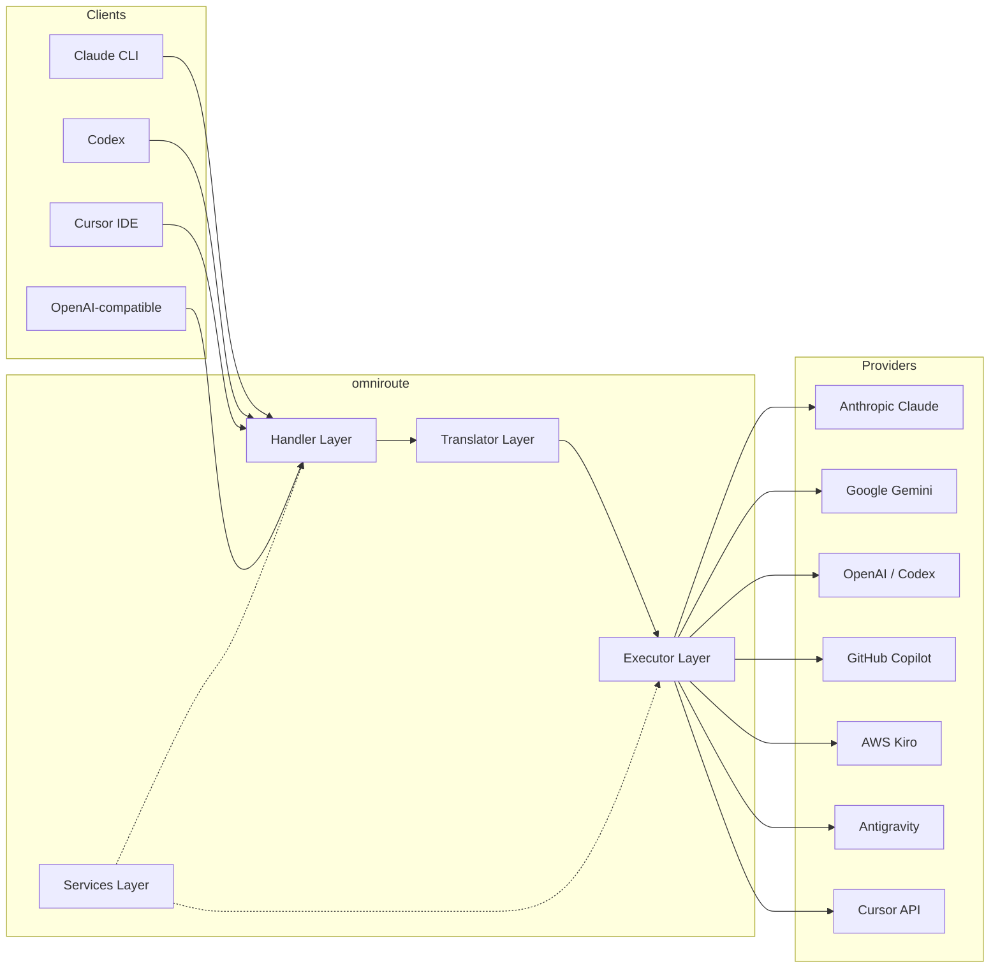
```mermaid
graph LR
    subgraph Clients
        A[Claude CLI]
        B[Codex]
        C[Cursor IDE]
        D[OpenAI-compatible]
    end

    subgraph omniroute
        E[Handler Layer]
        F[Translator Layer]
        G[Executor Layer]
        H[Services Layer]
    end

    subgraph Providers
        I[Anthropic Claude]
        J[Google Gemini]
        K[OpenAI / Codex]
        L[GitHub Copilot]
        M[AWS Kiro]
        N[Antigravity]
        O[Cursor API]
    end

    A --> E
    B --> E
    C --> E
    D --> E
    E --> F
    F --> G
    G --> I
    G --> J
    G --> K
    G --> L
    G --> M
    G --> N
    G --> O
    H -.-> E
    H -.-> G
```

### Principio básico: traducción radial

Toda la traducción de formatos pasa a través del **formato OpenAI como centro**:

```
Client Format ‚Üí [OpenAI Hub] ‚Üí Provider Format    (request)
Provider Format ‚Üí [OpenAI Hub] ‚Üí Client Format    (response)
```

Esto significa que solo necesitas **N traductores** (uno por formato) en lugar de **N²** (cada par).

---

## 3. Estructura del proyecto

```
omniroute/
├── open-sse/                  ← Core proxy library (portable, framework-agnostic)
│   ├── index.js               ← Main entry point, exports everything
│   ├── config/                ← Configuration & constants
│   ├── executors/             ← Provider-specific request execution
│   ├── handlers/              ← Request handling orchestration
│   ├── services/              ← Business logic (auth, models, fallback, usage)
│   ├── translator/            ← Format translation engine
│   │   ├── request/           ← Request translators (8 files)
│   │   ├── response/          ← Response translators (7 files)
│   │   └── helpers/           ← Shared translation utilities (6 files)
│   └── utils/                 ← Utility functions
├── src/                       ← Application layer (Express/Worker runtime)
│   ├── app/                   ← Web UI, API routes, middleware
│   ├── lib/                   ← Database, auth, and shared library code
│   ├── mitm/                  ← Man-in-the-middle proxy utilities
│   ├── models/                ← Database models
│   ├── shared/                ← Shared utilities (wrappers around open-sse)
│   ├── sse/                   ← SSE endpoint handlers
│   └── store/                 ← State management
├── data/                      ← Runtime data (credentials, logs)
│   └── provider-credentials.json   (external credentials override, gitignored)
└── tester/                    ← Test utilities
```

---

## 4. Desglose módulo por módulo

### 4.1 Configuración (`open-sse/config/`)

La **√∫nica fuente de verdad** para todas las configuraciones de proveedores.

| Archivo                       | Propósito                                                                                                                                                                                                                                                                 |
| ----------------------------- | ------------------------------------------------------------------------------------------------------------------------------------------------------------------------------------------------------------------------------------------------------------------------- |
| `constants.ts`                | Objeto `PROVIDERS` con URL base, credenciales de OAuth (predeterminadas), encabezados y mensajes del sistema predeterminados para cada proveedor. También define `HTTP_STATUS`, `ERROR_TYPES`, `COOLDOWN_MS`, `BACKOFF_CONFIG` y `SKIP_PATTERNS`.                         |
| `credentialLoader.ts`         | Carga credenciales externas de `data/provider-credentials.json` y las combina con los valores predeterminados codificados en `PROVIDERS`. Mantiene los secretos fuera del control de código fuente y al mismo tiempo mantiene la compatibilidad con versiones anteriores. |
| `providerModels.ts`           | Registro central de modelos: alias de proveedores de mapas ‚Üí ID de modelos. Funciones como `getModels()`, `getProviderByAlias()`.                                                                                                                                         |
| `codexInstructions.ts`        | Instrucciones del sistema inyectadas en solicitudes del Codex (restricciones de edición, reglas de espacio aislado, políticas de aprobación).                                                                                                                             |
| `defaultThinkingSignature.ts` | Firmas "pensantes" predeterminadas para los modelos Claude y Gemini.                                                                                                                                                                                                      |
| `ollamaModels.ts`             | Definición de esquemas para modelos locales de Ollama (nombre, tamaño, familia, cuantificación).                                                                                                                                                                          |

#### Flujo de carga de credenciales

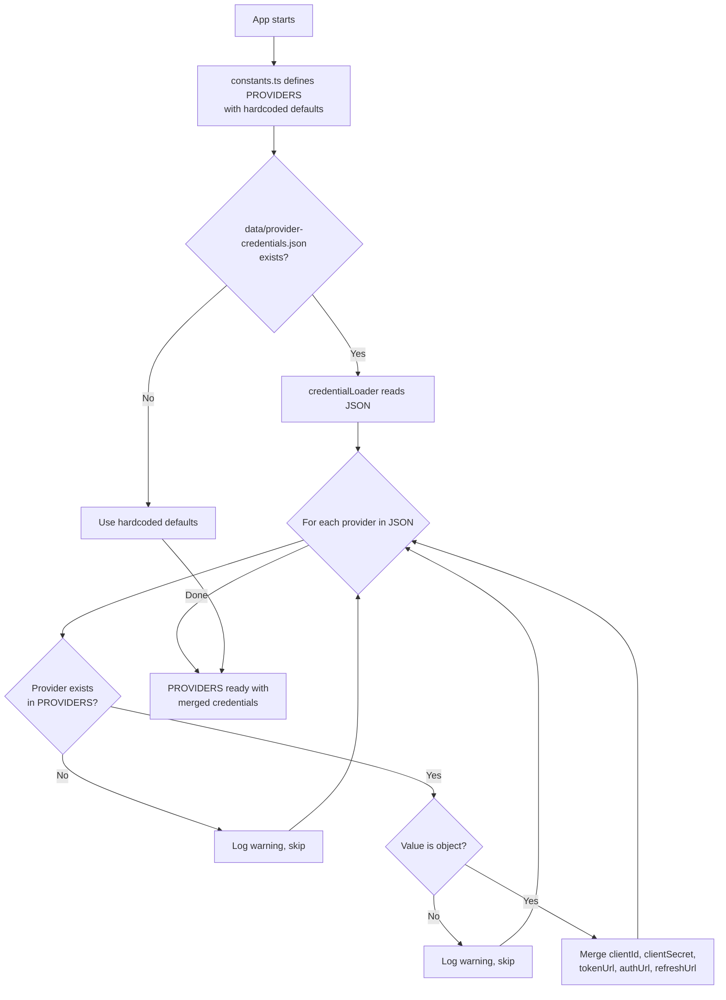
```mermaid
flowchart TD
    A["App starts"] --> B["constants.ts defines PROVIDERS\nwith hardcoded defaults"]
    B --> C{"data/provider-credentials.json\nexists?"}
    C -->|Yes| D["credentialLoader reads JSON"]
    C -->|No| E["Use hardcoded defaults"]
    D --> F{"For each provider in JSON"}
    F --> G{"Provider exists\nin PROVIDERS?"}
    G -->|No| H["Log warning, skip"]
    G -->|Yes| I{"Value is object?"}
    I -->|No| J["Log warning, skip"]
    I -->|Yes| K["Merge clientId, clientSecret,\ntokenUrl, authUrl, refreshUrl"]
    K --> F
    H --> F
    J --> F
    F -->|Done| L["PROVIDERS ready with\nmerged credentials"]
    E --> L
```

---

### 4.2 Ejecutores (`open-sse/executors/`)

Los ejecutores encapsulan **lógica específica del proveedor** utilizando el **Patrón de estrategia**. Cada ejecutor anula los métodos base según sea necesario.

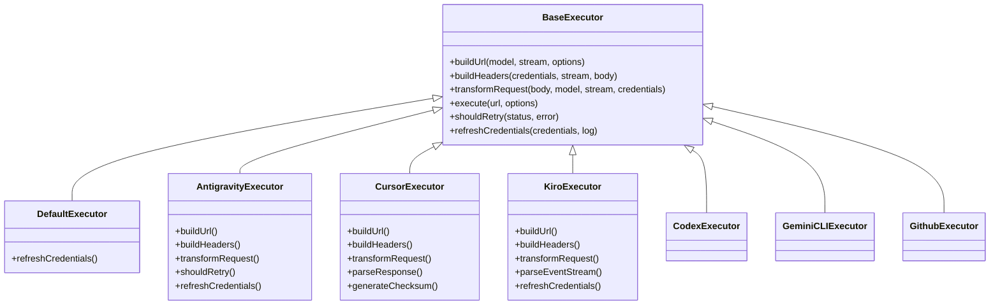
```mermaid
classDiagram
    class BaseExecutor {
        +buildUrl(model, stream, options)
        +buildHeaders(credentials, stream, body)
        +transformRequest(body, model, stream, credentials)
        +execute(url, options)
        +shouldRetry(status, error)
        +refreshCredentials(credentials, log)
    }

    class DefaultExecutor {
        +refreshCredentials()
    }

    class AntigravityExecutor {
        +buildUrl()
        +buildHeaders()
        +transformRequest()
        +shouldRetry()
        +refreshCredentials()
    }

    class CursorExecutor {
        +buildUrl()
        +buildHeaders()
        +transformRequest()
        +parseResponse()
        +generateChecksum()
    }

    class KiroExecutor {
        +buildUrl()
        +buildHeaders()
        +transformRequest()
        +parseEventStream()
        +refreshCredentials()
    }

    BaseExecutor <|-- DefaultExecutor
    BaseExecutor <|-- AntigravityExecutor
    BaseExecutor <|-- CursorExecutor
    BaseExecutor <|-- KiroExecutor
    BaseExecutor <|-- CodexExecutor
    BaseExecutor <|-- GeminiCLIExecutor
    BaseExecutor <|-- GithubExecutor
```

| Ejecutor         | Proveedor                                   | Especializaciones clave                                                                                                                                     |
| ---------------- | ------------------------------------------- | ----------------------------------------------------------------------------------------------------------------------------------------------------------- |
| `base.ts`        | —                                           | Base abstracta: creación de URL, encabezados, lógica de reintento, actualización de credenciales                                                            |
| `default.ts`     | Claude, Géminis, OpenAI, GLM, Kimi, MiniMax | Actualización de token genérico de OAuth para proveedores estándar                                                                                          |
| `antigravity.ts` | Código de la nube de Google                 | Generación de ID de proyecto/sesión, respaldo de múltiples URL, reintento personalizado de análisis de mensajes de error ("restablecer después de 2h7m23s") |
| `cursor.ts`      | Cursor IDE                                  | **Más complejo**: autenticación de suma de comprobación SHA-256, codificación de solicitud Protobuf, EventStream binario → análisis de respuesta SSE        |
| `codex.ts`       | Códice OpenAI                               | Inyecta instrucciones del sistema, gestiona los niveles de pensamiento, elimina parámetros no compatibles                                                   |
| `gemini-cli.ts`  | CLI de Google Géminis                       | Creación de URL personalizada (`streamGenerateContent`), actualización del token OAuth de Google                                                            |
| `github.ts`      | Copiloto de GitHub                          | Sistema de token dual (GitHub OAuth + token Copilot), imitación del encabezado VSCode                                                                       |
| `kiro.ts`        | Susurrador de códigos de AWS                | Análisis binario de AWS EventStream, marcos de eventos AMZN, estimación de tokens                                                                           |
| `index.ts`       | —                                           | Fábrica: nombre del proveedor de mapas → clase de ejecutor, con respaldo predeterminado                                                                     |

---

### 4.3 Controladores (`open-sse/handlers/`)

La **capa de orquestación**: coordina la traducción, la ejecución, la transmisión y el manejo de errores.

| Archivo               | Propósito                                                                                                                                                                                                                                                  |
| --------------------- | ---------------------------------------------------------------------------------------------------------------------------------------------------------------------------------------------------------------------------------------------------------- |
| `chatCore.ts`         | **Orquestador central** (~600 líneas). Maneja el ciclo de vida completo de la solicitud: detección de formato → traducción → envío del ejecutor → respuesta de transmisión/no transmisión → actualización del token → manejo de errores → registro de uso. |
| `responsesHandler.ts` | Adaptador para la API de Respuestas de OpenAI: convierte el formato de Respuestas → Finalizaciones de chat → envía a `chatCore` → convierte SSE nuevamente al formato de Respuestas.                                                                       |
| `embeddings.ts`       | Controlador de generación de incrustación: resuelve el modelo de incrustación → proveedor, envía la API del proveedor y devuelve una respuesta de incrustación compatible con OpenAI. Admite más de 6 proveedores.                                         |
| `imageGeneration.ts`  | Controlador de generación de imágenes: resuelve el modelo de imagen → proveedor, admite los modos compatibles con OpenAI, imagen Gemini (Antigravity) y respaldo (Nebius). Devuelve imágenes base64 o URL.                                                 |

#### Solicitar ciclo de vida (chatCore.ts)

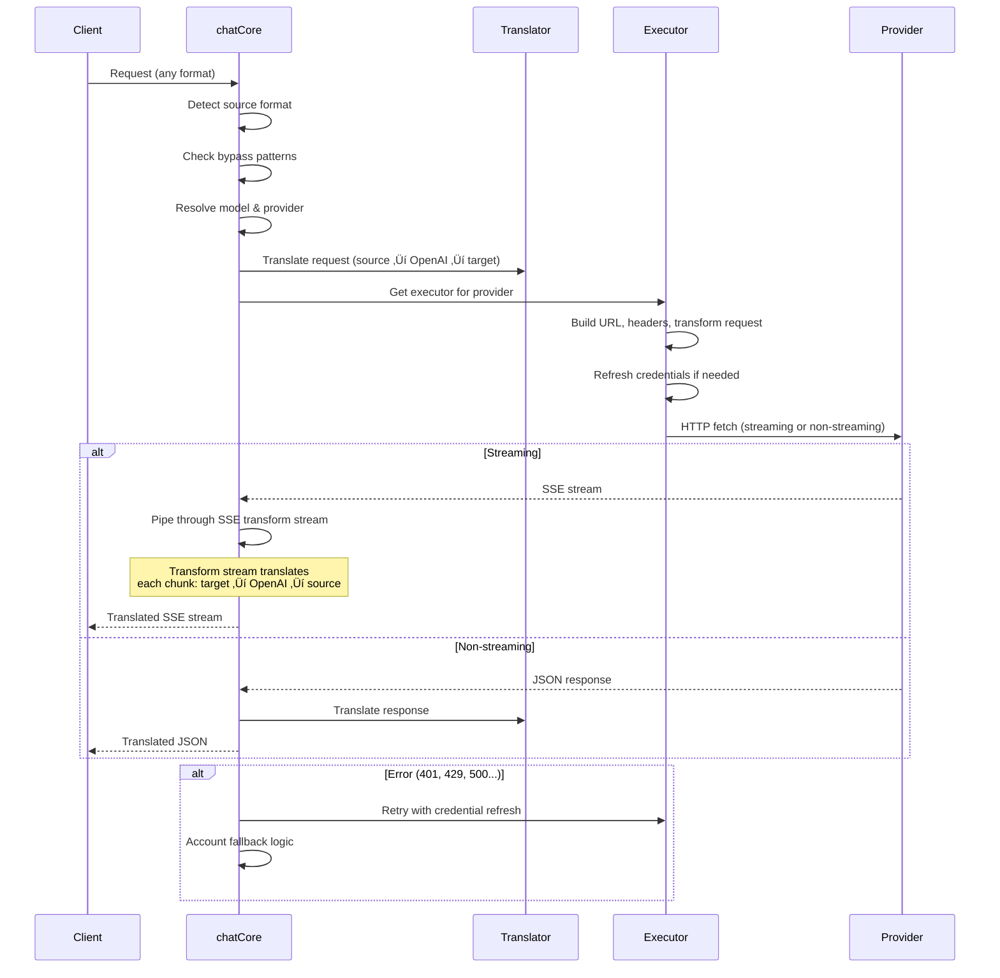
```mermaid
sequenceDiagram
    participant Client
    participant chatCore
    participant Translator
    participant Executor
    participant Provider

    Client->>chatCore: Request (any format)
    chatCore->>chatCore: Detect source format
    chatCore->>chatCore: Check bypass patterns
    chatCore->>chatCore: Resolve model & provider
    chatCore->>Translator: Translate request (source ‚Üí OpenAI ‚Üí target)
    chatCore->>Executor: Get executor for provider
    Executor->>Executor: Build URL, headers, transform request
    Executor->>Executor: Refresh credentials if needed
    Executor->>Provider: HTTP fetch (streaming or non-streaming)

    alt Streaming
        Provider-->>chatCore: SSE stream
        chatCore->>chatCore: Pipe through SSE transform stream
        Note over chatCore: Transform stream translates<br/>each chunk: target ‚Üí OpenAI ‚Üí source
        chatCore-->>Client: Translated SSE stream
    else Non-streaming
        Provider-->>chatCore: JSON response
        chatCore->>Translator: Translate response
        chatCore-->>Client: Translated JSON
    end

    alt Error (401, 429, 500...)
        chatCore->>Executor: Retry with credential refresh
        chatCore->>chatCore: Account fallback logic
    end
```

---

### 4.4 Servicios (`open-sse/services/`)

Lógica de negocios que soporta a los manejadores y ejecutores.

| Archivo              | Propósito                                                                                                                                                                                                                                                                                                                                                                                              |
| -------------------- | ------------------------------------------------------------------------------------------------------------------------------------------------------------------------------------------------------------------------------------------------------------------------------------------------------------------------------------------------------------------------------------------------------ |
| `provider.ts`        | **Detección de formato** (`detectFormat`): analiza la estructura del cuerpo de la solicitud para identificar los formatos Claude/OpenAI/Gemini/Antigravity/Responses (incluye heurística `max_tokens` para Claude). Además: creación de URL, creación de encabezados, normalización de la configuración de pensamiento. Admite proveedores dinámicos `openai-compatible-*` y `anthropic-compatible-*`. |
| `model.ts`           | Análisis de cadenas de modelo (`claude/model-name` → `{provider: "claude", model: "model-name"}`), resolución de alias con detección de colisiones, desinfección de entradas (rechaza el recorrido de ruta/caracteres de control) y resolución de información del modelo con soporte para captadores de alias asíncronos.                                                                              |
| `accountFallback.ts` | Manejo de límite de velocidad: retroceso exponencial (1 s → 2 s → 4 s → máx. 2 min), gestión de tiempo de reutilización de la cuenta, clasificación de errores (qué errores activan el retroceso y cuáles no).                                                                                                                                                                                         |
| `tokenRefresh.ts`    | Actualización del token de OAuth para **cada proveedor**: Google (Gemini, Antigravity), Claude, Codex, Qwen, iFlow, GitHub (OAuth + Copilot de doble token), Kiro (AWS SSO OIDC + Social Auth). Incluye caché de deduplicación de promesa en curso y reintento con retroceso exponencial.                                                                                                              |
| `combo.ts`           | **Modelos combinados**: cadenas de modelos alternativos. Si el modelo A falla con un error elegible para respaldo, pruebe con el modelo B, luego con el C, etc. Devuelve códigos de estado ascendentes reales.                                                                                                                                                                                         |
| `usage.ts`           | Obtiene datos de cuota/uso de las API del proveedor (cuotas de GitHub Copilot, cuotas del modelo Antigravity, límites de velocidad del Codex, desgloses de uso de Kiro, configuración de Claude).                                                                                                                                                                                                      |
| `accountSelector.ts` | Selección inteligente de cuentas con algoritmo de puntuación: considera la prioridad, el estado de salud, la posición del round-robin y el estado de recuperación para elegir la cuenta óptima para cada solicitud.                                                                                                                                                                                    |
| `contextManager.ts`  | Gestión del ciclo de vida del contexto de solicitud: crea y rastrea objetos de contexto por solicitud con metadatos (ID de solicitud, marcas de tiempo, información del proveedor) para depuración y registro.                                                                                                                                                                                         |
| `ipFilter.ts`        | Control de acceso basado en IP: admite modos de lista permitida y lista de bloqueo. Valida la IP del cliente seg√∫n las reglas configuradas antes de procesar las solicitudes de API.                                                                                                                                                                                                                   |
| `sessionManager.ts`  | Seguimiento de sesiones con huellas digitales del cliente: rastrea las sesiones activas utilizando identificadores de cliente con hash, monitorea el recuento de solicitudes y proporciona métricas de sesión.                                                                                                                                                                                         |
| `signatureCache.ts`  | Solicitar caché de deduplicación basada en firmas: evita solicitudes duplicadas al almacenar en caché las firmas de solicitudes recientes y devolver respuestas almacenadas en caché para solicitudes idénticas dentro de un período de tiempo.                                                                                                                                                        |
| `systemPrompt.ts`    | Inyección de avisos del sistema global: antepone o agrega un aviso del sistema configurable a todas las solicitudes, con manejo de compatibilidad por proveedor.                                                                                                                                                                                                                                       |
| `thinkingBudget.ts`  | Gestión del presupuesto de tokens de razonamiento: admite modos de transferencia, automático (configuración de pensamiento de tira), personalizado (presupuesto fijo) y adaptativo (escalado por complejidad) para controlar los tokens de pensamiento/razonamiento.                                                                                                                                   |
| `wildcardRouter.ts`  | Enrutamiento de patrones de modelo comodín: resuelve patrones comodín (por ejemplo, `*/claude-*`) en pares concretos de proveedor/modelo según la disponibilidad y la prioridad.                                                                                                                                                                                                                       |

#### Deduplicación de actualización de tokens

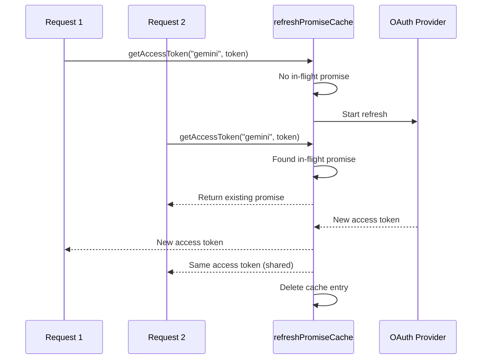
```mermaid
sequenceDiagram
    participant R1 as Request 1
    participant R2 as Request 2
    participant Cache as refreshPromiseCache
    participant OAuth as OAuth Provider

    R1->>Cache: getAccessToken("gemini", token)
    Cache->>Cache: No in-flight promise
    Cache->>OAuth: Start refresh
    R2->>Cache: getAccessToken("gemini", token)
    Cache->>Cache: Found in-flight promise
    Cache-->>R2: Return existing promise
    OAuth-->>Cache: New access token
    Cache-->>R1: New access token
    Cache-->>R2: Same access token (shared)
    Cache->>Cache: Delete cache entry
```

#### M√°quina de estado de reserva de cuenta

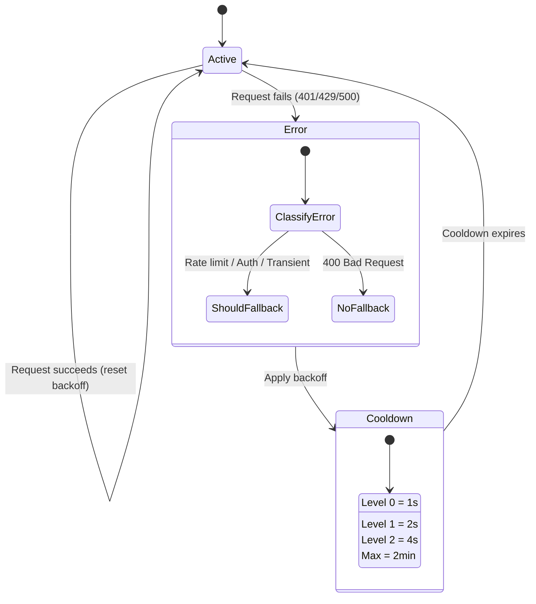
```mermaid
stateDiagram-v2
    [*] --> Active
    Active --> Error: Request fails (401/429/500)
    Error --> Cooldown: Apply backoff
    Cooldown --> Active: Cooldown expires
    Active --> Active: Request succeeds (reset backoff)

    state Error {
        [*] --> ClassifyError
        ClassifyError --> ShouldFallback: Rate limit / Auth / Transient
        ClassifyError --> NoFallback: 400 Bad Request
    }

    state Cooldown {
        [*] --> ExponentialBackoff
        ExponentialBackoff: Level 0 = 1s
        ExponentialBackoff: Level 1 = 2s
        ExponentialBackoff: Level 2 = 4s
        ExponentialBackoff: Max = 2min
    }
```

#### Cadena de modelo combinado

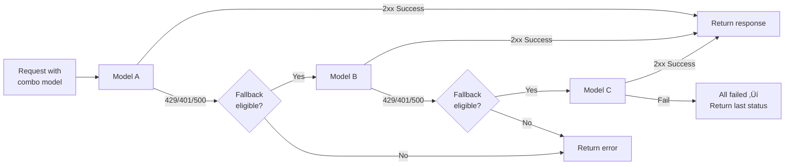
```mermaid
flowchart LR
    A["Request with\ncombo model"] --> B["Model A"]
    B -->|"2xx Success"| C["Return response"]
    B -->|"429/401/500"| D{"Fallback\neligible?"}
    D -->|Yes| E["Model B"]
    D -->|No| F["Return error"]
    E -->|"2xx Success"| C
    E -->|"429/401/500"| G{"Fallback\neligible?"}
    G -->|Yes| H["Model C"]
    G -->|No| F
    H -->|"2xx Success"| C
    H -->|"Fail"| I["All failed ‚Üí\nReturn last status"]
```

---

### 4.5 Traductor (`open-sse/translator/`)

El **motor de traducción de formatos** que utiliza un sistema de complementos de registro automático.

#### Arquitectura

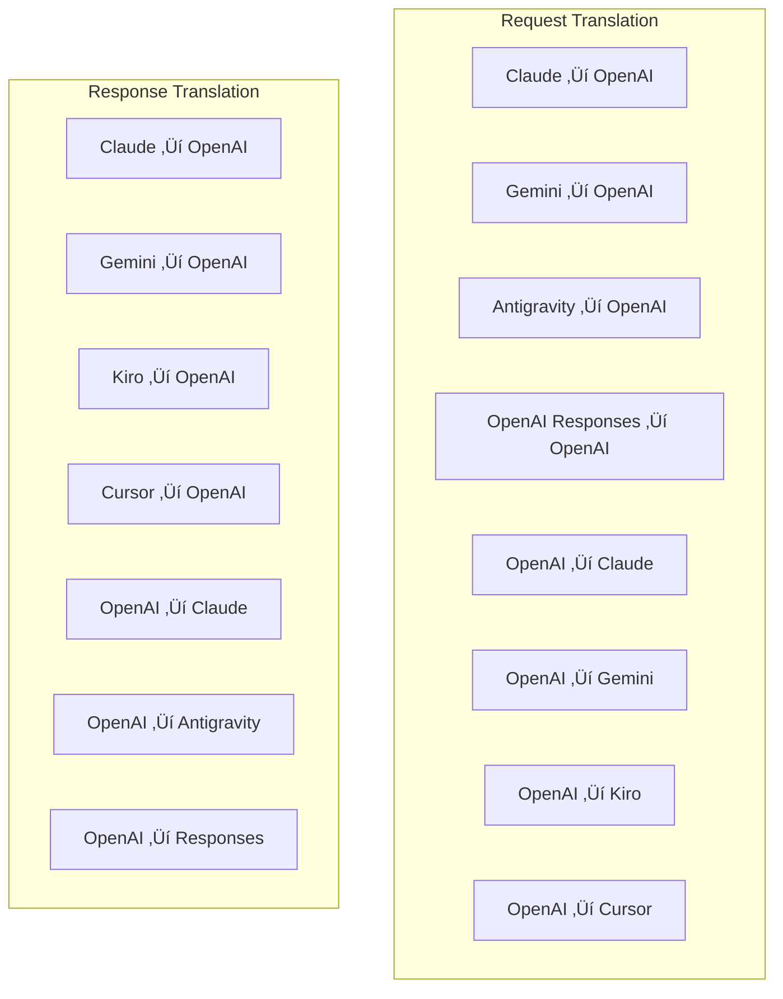
```mermaid
graph TD
    subgraph "Request Translation"
        A["Claude ‚Üí OpenAI"]
        B["Gemini ‚Üí OpenAI"]
        C["Antigravity ‚Üí OpenAI"]
        D["OpenAI Responses ‚Üí OpenAI"]
        E["OpenAI ‚Üí Claude"]
        F["OpenAI ‚Üí Gemini"]
        G["OpenAI ‚Üí Kiro"]
        H["OpenAI ‚Üí Cursor"]
    end

    subgraph "Response Translation"
        I["Claude ‚Üí OpenAI"]
        J["Gemini ‚Üí OpenAI"]
        K["Kiro ‚Üí OpenAI"]
        L["Cursor ‚Üí OpenAI"]
        M["OpenAI ‚Üí Claude"]
        N["OpenAI ‚Üí Antigravity"]
        O["OpenAI ‚Üí Responses"]
    end
```

| Directorio   | Archivos      | Descripción                                                                                                                                                                                                                                                                                                   |
| ------------ | ------------- | ------------------------------------------------------------------------------------------------------------------------------------------------------------------------------------------------------------------------------------------------------------------------------------------------------------- |
| `request/`   | 8 traductores | Convierta cuerpos de solicitudes entre formatos. Cada archivo se registra automáticamente a través de `register(from, to, fn)` al importar.                                                                                                                                                                   |
| `response/`  | 7 traductores | Convierta fragmentos de respuesta de transmisión entre formatos. Maneja tipos de eventos SSE, bloques de pensamiento y llamadas a herramientas.                                                                                                                                                               |
| `helpers/`   | 6 ayudantes   | Utilidades compartidas: `claudeHelper` (extracción de avisos del sistema, configuración de pensamiento), `geminiHelper` (mapeo de partes/contenidos), `openaiHelper` (filtrado de formatos), `toolCallHelper` (generación de ID, inyección de respuestas faltantes), `maxTokensHelper`, `responsesApiHelper`. |
| `index.ts`   | —             | Motor de traducción: `translateRequest()`, `translateResponse()`, gestión de estado, registro.                                                                                                                                                                                                                |
| `formats.ts` | —             | Constantes de formato: `OPENAI`, `CLAUDE`, `GEMINI`, `ANTIGRAVITY`, `KIRO`, `CURSOR`, `OPENAI_RESPONSES`.                                                                                                                                                                                                     |

#### Diseño de claves: complementos de registro automático

```javascript
// Each translator file calls register() on import:
import { register } from "../index.js";
register("claude", "openai", translateClaudeToOpenAI);

// The index.js imports all translator files, triggering registration:
import "./request/claude-to-openai.js"; // ‚Üê self-registers
```

---

### 4.6 Utilidades (`open-sse/utils/`)

| Archivo            | Propósito                                                                                                                                                                                                                                                                                                                                                                |
| ------------------ | ------------------------------------------------------------------------------------------------------------------------------------------------------------------------------------------------------------------------------------------------------------------------------------------------------------------------------------------------------------------------ |
| `error.ts`         | Creación de respuestas a errores (formato compatible con OpenAI), análisis de errores ascendentes, extracción en tiempo de reintento de Antigravity de mensajes de error, transmisión de errores SSE.                                                                                                                                                                    |
| `stream.ts`        | **SSE Transform Stream**: el canal principal de transmisión. Dos modos: `TRANSLATE` (traducción de formato completo) y `PASSTHROUGH` (normalizar + extraer uso). Maneja el almacenamiento en búfer de fragmentos, la estimación de uso y el seguimiento de la longitud del contenido. Las instancias de codificador/decodificador por flujo evitan el estado compartido. |
| `streamHelpers.ts` | Utilidades SSE de bajo nivel: `parseSSELine` (tolerante a espacios en blanco), `hasValuableContent` (filtra fragmentos vacíos para OpenAI/Claude/Gemini), `fixInvalidId`, `formatSSE` (serialización SSE con reconocimiento de formato con limpieza `perf_metrics`).                                                                                                     |
| `usageTracking.ts` | Extracción de uso de tokens de cualquier formato (Claude/OpenAI/Gemini/Responses), estimación con proporciones separadas de caracteres por token de herramienta/mensaje, adición de búfer (margen de seguridad de 2000 tokens), filtrado de campos específicos del formato, registro de consola con colores ANSI.                                                        |
| `requestLogger.ts` | Registro de solicitudes basado en archivos (optar a través de `ENABLE_REQUEST_LOGS=true`). Crea carpetas de sesión con archivos numerados: `1_req_client.json` → `7_res_client.txt`. Todas las E/S son asíncronas (disparar y olvidar). Enmascara encabezados sensibles.                                                                                                 |
| `bypassHandler.ts` | Intercepta patrones específicos de Claude CLI (extracción de títulos, calentamiento, recuento) y devuelve respuestas falsas sin llamar a ningún proveedor. Admite tanto streaming como no streaming. Limitado intencionalmente al alcance de Claude CLI.                                                                                                                 |
| `networkProxy.ts`  | Resuelve la URL del proxy saliente para un proveedor determinado con prioridad: configuración específica del proveedor → configuración global → variables de entorno (`HTTPS_PROXY`/`HTTP_PROXY`/`ALL_PROXY`). Admite exclusiones `NO_PROXY`. Configuración de cachés durante 30 segundos.                                                                               |

#### Tubería de transmisión de SSE

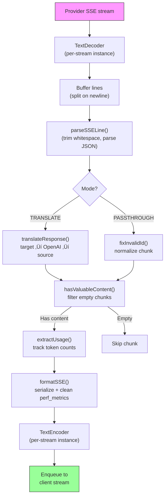
```mermaid
flowchart TD
    A["Provider SSE stream"] --> B["TextDecoder\n(per-stream instance)"]
    B --> C["Buffer lines\n(split on newline)"]
    C --> D["parseSSELine()\n(trim whitespace, parse JSON)"]
    D --> E{"Mode?"}
    E -->|TRANSLATE| F["translateResponse()\ntarget ‚Üí OpenAI ‚Üí source"]
    E -->|PASSTHROUGH| G["fixInvalidId()\nnormalize chunk"]
    F --> H["hasValuableContent()\nfilter empty chunks"]
    G --> H
    H -->|"Has content"| I["extractUsage()\ntrack token counts"]
    H -->|"Empty"| J["Skip chunk"]
    I --> K["formatSSE()\nserialize + clean perf_metrics"]
    K --> L["TextEncoder\n(per-stream instance)"]
    L --> M["Enqueue to\nclient stream"]

    style A fill:#f9f,stroke:#333
    style M fill:#9f9,stroke:#333
```

#### Solicitar estructura de sesión del registrador

```
logs/
└── claude_gemini_claude-sonnet_20260208_143045/
    ├── 1_req_client.json      ← Raw client request
    ├── 2_req_source.json      ← After initial conversion
    ├── 3_req_openai.json      ← OpenAI intermediate format
    ├── 4_req_target.json      ← Final target format
    ├── 5_res_provider.txt     ← Provider SSE chunks (streaming)
    ├── 5_res_provider.json    ← Provider response (non-streaming)
    ├── 6_res_openai.txt       ← OpenAI intermediate chunks
    ├── 7_res_client.txt       ← Client-facing SSE chunks
    └── 6_error.json           ← Error details (if any)
```

---

### 4.7 Capa de aplicación (`src/`)

| Directorio    | Propósito                                                                                             |
| ------------- | ----------------------------------------------------------------------------------------------------- |
| `src/app/`    | Interfaz de usuario web, rutas API, middleware Express, controladores de devolución de llamadas OAuth |
| `src/lib/`    | Acceso a base de datos (`localDb.ts`, `usageDb.ts`), autenticación, compartido                        |
| `src/mitm/`   | Utilidades de proxy Man-in-the-middle para interceptar el tr√°fico de proveedores                      |
| `src/models/` | Definiciones de modelos de bases de datos                                                             |
| `src/shared/` | Envoltorios de funciones open-sse (proveedor, flujo, error, etc.)                                     |
| `src/sse/`    | Controladores de puntos finales SSE que conectan la biblioteca open-sse a rutas Express               |
| `src/store/`  | Gestión del estado de la aplicación                                                                   |

#### Rutas API notables

| Ruta                                          | Métodos                   | Propósito                                                                                                   |
| --------------------------------------------- | ------------------------- | ----------------------------------------------------------------------------------------------------------- |
| `/api/provider-models`                        | OBTENER/PUBLICAR/ELIMINAR | CRUD para modelos personalizados por proveedor                                                              |
| `/api/models/catalog`                         | OBTENER                   | Cat√°logo agregado de todos los modelos (chat, incrustado, imagen, personalizado) agrupados por proveedor    |
| `/api/settings/proxy`                         | OBTENER/PONER/ELIMINAR    | Configuración de proxy saliente jerárquico (`global/providers/combos/keys`)                                 |
| `/api/settings/proxy/test`                    | PUBLICAR                  | Valida la conectividad del proxy y devuelve IP p√∫blica/latencia                                             |
| `/v1/providers/[provider]/chat/completions`   | PUBLICAR                  | Finalizaciones de chat dedicadas por proveedor con validación de modelo                                     |
| `/v1/providers/[provider]/embeddings`         | PUBLICAR                  | Incorporaciones dedicadas por proveedor con validación de modelo                                            |
| `/v1/providers/[provider]/images/generations` | PUBLICAR                  | Generación de imágenes dedicada por proveedor con validación de modelo                                      |
| `/api/settings/ip-filter`                     | OBTENER/PONER             | Gestión de listas de IP permitidas/bloqueadas                                                               |
| `/api/settings/thinking-budget`               | OBTENER/PONER             | Configuración del presupuesto del token de razonamiento (transferencia/automático/personalizado/adaptativo) |
| `/api/settings/system-prompt`                 | OBTENER/PONER             | Inyección rápida del sistema global para todas las solicitudes                                              |
| `/api/sessions`                               | OBTENER                   | Seguimiento y métricas de sesiones activas                                                                  |
| `/api/rate-limits`                            | OBTENER                   | Estado del límite de tasa por cuenta                                                                        |

---

## 5. Patrones de diseño clave

### 5.1 Traducción radial

Todos los formatos se traducen a través del **formato OpenAI como centro**. Agregar un nuevo proveedor solo requiere escribir **un par** de traductores (hacia/desde OpenAI), no N pares.

### 5.2 Patrón de estrategia del ejecutor

Cada proveedor tiene una clase de ejecutor dedicada que hereda de `BaseExecutor`. La fábrica en `executors/index.ts` selecciona la correcta en tiempo de ejecución.

### 5.3 Sistema de complementos de autorregistro

Los módulos traductores se registran al importar a través de `register()`. Agregar un nuevo traductor es simplemente crear un archivo e importarlo.

### 5.4 Reserva de cuenta con retroceso exponencial

Cuando un proveedor devuelve 429/401/500, el sistema puede cambiar a la siguiente cuenta, aplicando tiempos de reutilización exponenciales (1 s → 2 s → 4 s → máx. 2 min).

### 5.5 Cadenas de modelos combinados

Un "combo" agrupa varias cadenas `provider/model`. Si el primero falla, se pasa autom√°ticamente al siguiente.

### 5.6 Traducción de transmisión con estado

La traducción de respuestas mantiene el estado en todos los fragmentos de SSE (seguimiento de bloques de pensamiento, acumulación de llamadas de herramientas, indexación de bloques de contenido) a través del mecanismo `initState()`.

### 5.7 B√∫fer de seguridad de uso

Se agrega un búfer de 2000 tokens al uso informado para evitar que los clientes alcancen los límites de la ventana de contexto debido a la sobrecarga de las indicaciones del sistema y la traducción de formato.

---

## 6. Formatos admitidos

| Formato                        | Dirección        | Identificador      |
| ------------------------------ | ---------------- | ------------------ |
| Finalizaciones del chat OpenAI | fuente + destino | `openai`           |
| API de respuestas OpenAI       | fuente + destino | `openai-responses` |
| Claude antrópico               | fuente + destino | `claude`           |
| Google Géminis                 | fuente + destino | `gemini`           |
| CLI de Google Géminis          | sólo objetivo    | `gemini-cli`       |
| Antigravedad                   | fuente + destino | `antigravity`      |
| AWS Kiro                       | sólo objetivo    | `kiro`             |
| Cursores                       | sólo objetivo    | `cursor`           |

---

## 7. Proveedores admitidos

| Proveedor                | Método de autenticación               | Ejecutor       | Notas clave                                                     |
| ------------------------ | ------------------------------------- | -------------- | --------------------------------------------------------------- |
| Claude antrópico         | Clave API u OAuth                     | Predeterminado | Utiliza el encabezado `x-api-key`                               |
| Google Géminis           | Clave API u OAuth                     | Predeterminado | Utiliza el encabezado `x-goog-api-key`                          |
| CLI de Google Géminis    | OAuth                                 | GéminisCLI     | Utiliza el punto final `streamGenerateContent`                  |
| Antigravedad             | OAuth                                 | Antigravedad   | Respaldo de m√∫ltiples URL, an√°lisis de reintentos personalizado |
| Abierta AI               | Clave API                             | Predeterminado | Autenticación de abanderado                                     |
| Códice                   | OAuth                                 | Códice         | Inyecta instrucciones del sistema, gestiona el pensamiento      |
| Copiloto de GitHub       | OAuth + token de copiloto             | GitHub         | Token dual, imitación del encabezado VSCode                     |
| Kiro (AWS)               | AWS SSO OIDC o redes sociales         | kiro           | An√°lisis binario de EventStream                                 |
| Cursor IDE               | Autenticación de suma de comprobación | Cursores       | Codificación Protobuf, sumas de comprobación SHA-256            |
| Qwen                     | OAuth                                 | Predeterminado | Autenticación estándar                                          |
| iFlujo                   | OAuth (Básico + Portador)             | Predeterminado | Encabezado de autenticación dual                                |
| Enrutador abierto        | Clave API                             | Predeterminado | Autenticación de abanderado                                     |
| GLM, Kimi, MiniMax       | Clave API                             | Predeterminado | Compatible con Claude, use `x-api-key`                          |
| `openai-compatible-*`    | Clave API                             | Predeterminado | Din√°mico: cualquier punto final compatible con OpenAI           |
| `anthropic-compatible-*` | Clave API                             | Predeterminado | Din√°mico: cualquier punto final compatible con Claude           |

---

## 8. Resumen del flujo de datos

### Solicitud de transmisión


```mermaid
flowchart LR
    A["Client"] --> B["detectFormat()"]
    B --> C["translateRequest()\nsource ‚Üí OpenAI ‚Üí target"]
    C --> D["Executor\nbuildUrl + buildHeaders"]
    D --> E["fetch(providerURL)"]
    E --> F["createSSEStream()\nTRANSLATE mode"]
    F --> G["parseSSELine()"]
    G --> H["translateResponse()\ntarget ‚Üí OpenAI ‚Üí source"]
    H --> I["extractUsage()\n+ addBuffer"]
    I --> J["formatSSE()"]
    J --> K["Client receives\ntranslated SSE"]
    K --> L["logUsage()\nsaveRequestUsage()"]
```

### Solicitud sin transmisión

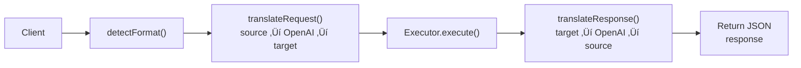
```mermaid
flowchart LR
    A["Client"] --> B["detectFormat()"]
    B --> C["translateRequest()\nsource ‚Üí OpenAI ‚Üí target"]
    C --> D["Executor.execute()"]
    D --> E["translateResponse()\ntarget ‚Üí OpenAI ‚Üí source"]
    E --> F["Return JSON\nresponse"]
```

### Flujo de derivación (Claude CLI)

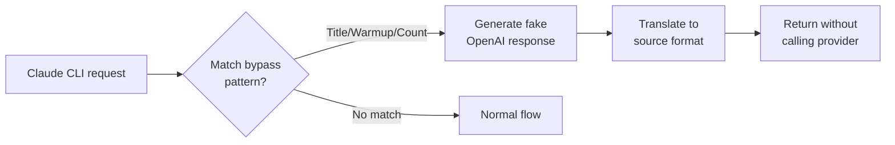
```mermaid
flowchart LR
    A["Claude CLI request"] --> B{"Match bypass\npattern?"}
    B -->|"Title/Warmup/Count"| C["Generate fake\nOpenAI response"]
    B -->|"No match"| D["Normal flow"]
    C --> E["Translate to\nsource format"]
    E --> F["Return without\ncalling provider"]
```
