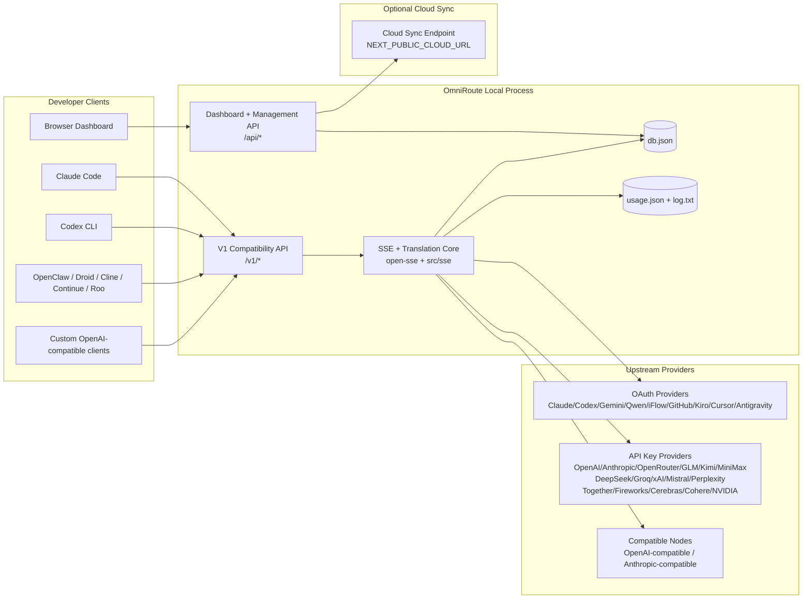
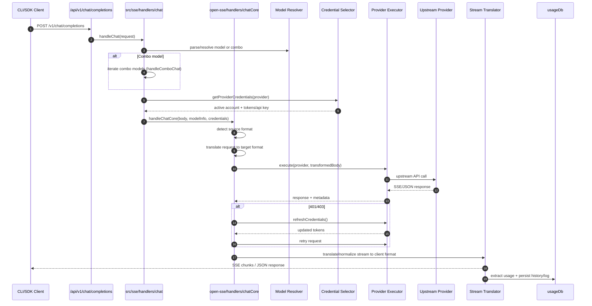
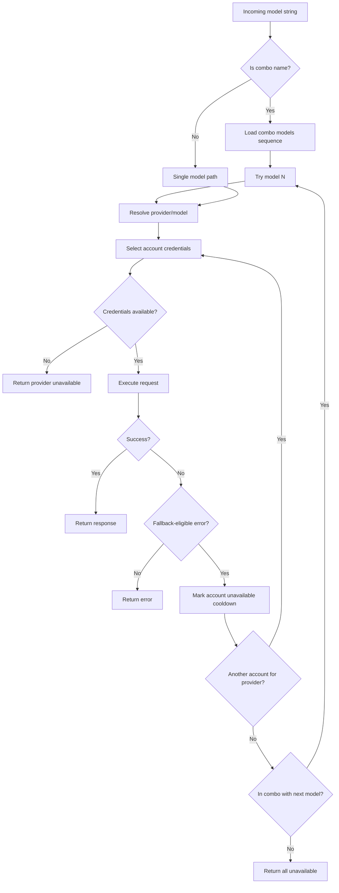
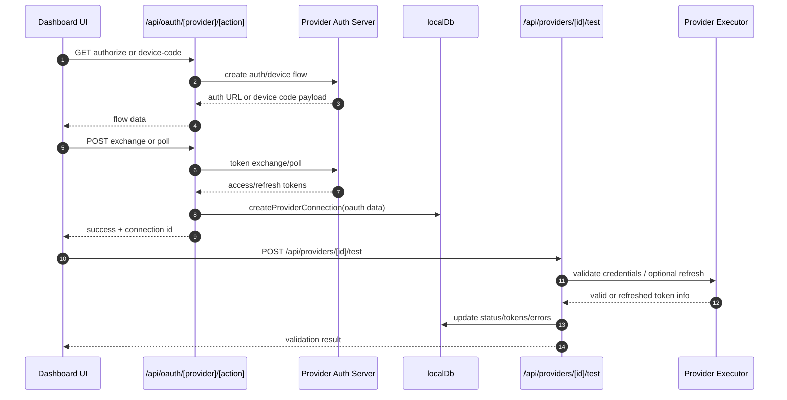
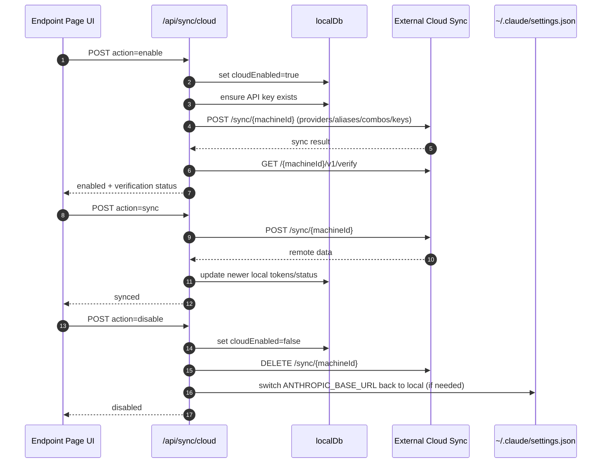
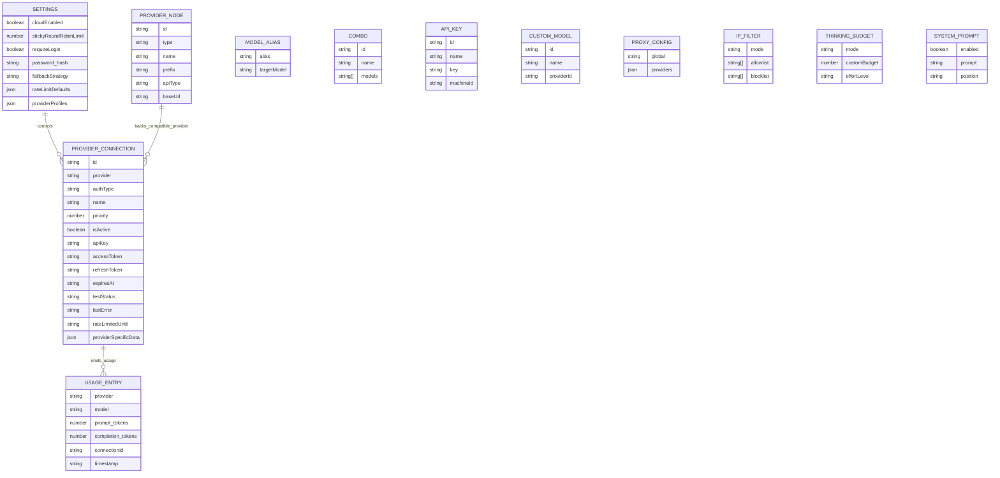
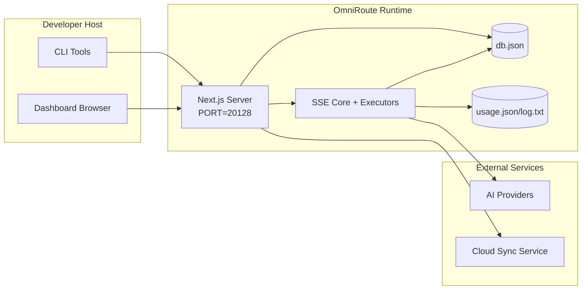

# ארכיטקטורת OmniRoute

🌐 **Languages:** 🇺🇸 [English](../../ARCHITECTURE.md) | 🇧🇷 [Português (Brasil)](../pt-BR/ARCHITECTURE.md) | 🇪🇸 [Español](../es/ARCHITECTURE.md) | 🇫🇷 [Français](../fr/ARCHITECTURE.md) | 🇮🇹 [Italiano](../it/ARCHITECTURE.md) | 🇷🇺 [Русский](../ru/ARCHITECTURE.md) | 🇨🇳 [中文 (简体)](../zh-CN/ARCHITECTURE.md) | 🇩🇪 [Deutsch](../de/ARCHITECTURE.md) | 🇮🇳 [हिन्दी](../in/ARCHITECTURE.md) | 🇹🇭 [ไทย](../th/ARCHITECTURE.md) | 🇺🇦 [Українська](../uk-UA/ARCHITECTURE.md) | 🇸🇦 [العربية](../ar/ARCHITECTURE.md) | 🇯🇵 [日本語](../ja/ARCHITECTURE.md) | 🇻🇳 [Tiếng Việt](../vi/ARCHITECTURE.md) | 🇧🇬 [Български](../bg/ARCHITECTURE.md) | 🇩🇰 [Dansk](../da/ARCHITECTURE.md) | 🇫🇮 [Suomi](../fi/ARCHITECTURE.md) | 🇮🇱 [עברית](../he/ARCHITECTURE.md) | 🇭🇺 [Magyar](../hu/ARCHITECTURE.md) | 🇮🇩 [Bahasa Indonesia](../id/ARCHITECTURE.md) | 🇰🇷 [한국어](../ko/ARCHITECTURE.md) | 🇲🇾 [Bahasa Melayu](../ms/ARCHITECTURE.md) | 🇳🇱 [Nederlands](../nl/ARCHITECTURE.md) | 🇳🇴 [Norsk](../no/ARCHITECTURE.md) | 🇵🇹 [Português (Portugal)](../pt/ARCHITECTURE.md) | 🇷🇴 [Română](../ro/ARCHITECTURE.md) | 🇵🇱 [Polski](../pl/ARCHITECTURE.md) | 🇸🇰 [Slovenčina](../sk/ARCHITECTURE.md) | 🇸🇪 [Svenska](../sv/ARCHITECTURE.md) | 🇵🇭 [Filipino](../phi/ARCHITECTURE.md)

_עדכון אחרון: 2026-02-18_

## תקציר מנהלים

OmniRoute הוא שער ולוח מחוונים מקומיים לניתוב בינה מלאכותית הבנויים על Next.js.
הוא מספק נקודת קצה אחת תואמת OpenAI (`/v1/*`) ומנתב תעבורה על פני מספר ספקים במעלה הזרם עם תרגום, חזרה, רענון אסימון ומעקב אחר שימוש.

יכולות ליבה:

- משטח API תואם OpenAI עבור CLI/כלים (28 ספקים)
- תרגום בקשה/תשובה בין פורמטים של ספקים
- נפילה משולבת דגם (רצף מרובה דגמים)
- חזרה ברמת החשבון (ריבוי חשבון לכל ספק)
- ניהול חיבורי ספק מפתח OAuth + API
- יצירת הטמעה באמצעות `/v1/embeddings` (6 ספקים, 9 דגמים)
- יצירת תמונות באמצעות `/v1/images/generations` (4 ספקים, 9 דגמים)
- חשבו על ניתוח תגים (`<think>...</think>`) עבור מודלים של חשיבה
- חיטוי תגובה עבור תאימות קפדנית של OpenAI SDK
- נורמליזציה של תפקידים (מפתח → מערכת, מערכת → משתמש) עבור תאימות בין ספקים
- המרת פלט מובנית (json_schema → Gemini responseSchema)
- התמדה מקומית לספקים, מפתחות, כינויים, שילובים, הגדרות, תמחור
- מעקב אחר שימוש/עלויות ורישום בקשות
- סנכרון ענן אופציונלי לסנכרון ריבוי מכשירים/מצבים
- רשימת היתרים/רשימת חסימה של IP עבור בקרת גישה ל-API
- חשיבה לניהול תקציב (מעבר/אוטומטי/מותאם אישית/מותאם)
- הזרקה מהירה של מערכת גלובלית
- מעקב אחר מפגשים וטביעות אצבע
- הגבלת תעריפים משופרת לכל חשבון עם פרופילים ספציפיים לספק
- דפוס מפסק עבור חוסן הספק
- הגנת עדר נגד רעמים עם נעילת mutex
- מטמון ביטול כפילויות של בקשה מבוסס חתימה
- שכבת דומיין: זמינות מודל, כללי עלות, מדיניות נפילה, מדיניות נעילה
- התמדה של מצב דומיין (מטמון כתיבה של SQLite עבור תקלות, תקציבים, נעילה, מפסקים)
- מנוע מדיניות להערכת בקשות מרוכזת (נעילה → תקציב → חזרה)
- בקש טלמטריה עם צבירה של חביון p50/p95/p99
- מזהה מתאם (X-Request-Id) למעקב מקצה לקצה
- רישום ביקורת תאימות עם ביטול הסכמה לכל מפתח API
- מסגרת Eval לאבטחת איכות LLM
- לוח מחוונים של ממשק משתמש חוסן עם מצב מפסק בזמן אמת
- ספקי OAuth מודולריים (12 מודולים בודדים תחת `src/lib/oauth/providers/`)

דגם זמן ריצה ראשי:

- מסלולי אפליקציית Next.js תחת `src/app/api/*` מיישמים גם ממשקי API של לוח המחוונים וגם ממשקי API של תאימות
- ליבת SSE/ניתוב משותפת ב-`src/sse/*` + `open-sse/*` מטפלת בביצוע ספק, בתרגום, בסטרימינג, ב-fallback ושימוש

## היקף וגבולות

### בהיקף

- זמן ריצה של שער מקומי
- ממשקי API לניהול לוח מחוונים
- אימות ספק ורענון אסימון
- בקש תרגום והזרמת SSE
- מדינה מקומית + התמדה בשימוש
- תזמור סנכרון ענן אופציונלי

### מחוץ לתחום

- הטמעת שירות ענן מאחורי `NEXT_PUBLIC_CLOUD_URL`
- ספק SLA/מטוס בקרה מחוץ לתהליך המקומי
- קבצי CLI חיצוניים עצמם (קלוד CLI, Codex CLI וכו')

## הקשר מערכת ברמה גבוהה



## רכיבי זמן ריצה ליבה

## 1) API ושכבת ניתוב (Next.js App Routes)

ספריות עיקריות:

- `src/app/api/v1/*` ו`src/app/api/v1beta/*` עבור ממשקי API של תאימות
- `src/app/api/*` עבור ממשקי API לניהול/תצורה
- השכתוב הבא במפת `next.config.mjs` מפה `/v1/*` ל`/api/v1/*`

מסלולי תאימות חשובים:

- `src/app/api/v1/chat/completions/route.ts`
- `src/app/api/v1/messages/route.ts`
- `src/app/api/v1/responses/route.ts`
- `src/app/api/v1/models/route.ts` - כולל דגמים מותאמים אישית עם `custom: true`
- `src/app/api/v1/embeddings/route.ts` - יצירת הטמעה (6 ספקים)
- `src/app/api/v1/images/generations/route.ts` — יצירת תמונות (4+ ספקים כולל אנטי-כבידה/נביוס)
- `src/app/api/v1/messages/count_tokens/route.ts`
- `src/app/api/v1/providers/[provider]/chat/completions/route.ts` - צ'אט ייעודי לכל ספק
- `src/app/api/v1/providers/[provider]/embeddings/route.ts` - הטמעות ייעודיות לכל ספק
- `src/app/api/v1/providers/[provider]/images/generations/route.ts` - תמונות ייעודיות לכל ספק
- `src/app/api/v1beta/models/route.ts`
- `src/app/api/v1beta/models/[...path]/route.ts`

תחומי ניהול:

- אישור/הגדרות: `src/app/api/auth/*`, `src/app/api/settings/*`
- ספקים/חיבורים: `src/app/api/providers*`
- צמתי ספק: `src/app/api/provider-nodes*`
- דגמים מותאמים אישית: `src/app/api/provider-models` (GET/POST/DELETE)
- קטלוג דגמים: `src/app/api/models/catalog` (GET)
- תצורת פרוקסי: `src/app/api/settings/proxy` (GET/PUT/DELETE) + `src/app/api/settings/proxy/test` (POST)
- OAuth: `src/app/api/oauth/*`
- מפתחות/כינויים/שילובים/תמחור: `src/app/api/keys*`, `src/app/api/models/alias`, `src/app/api/combos*`, `src/app/api/pricing`
- שימוש: `src/app/api/usage/*`
- סנכרון/ענן: `src/app/api/sync/*`, `src/app/api/cloud/*`
- עוזרי כלי עבודה של CLI: `src/app/api/cli-tools/*`
- מסנן IP: `src/app/api/settings/ip-filter` (GET/PUT)
- תקציב חשיבה: `src/app/api/settings/thinking-budget` (GET/PUT)
- הודעת מערכת: `src/app/api/settings/system-prompt` (GET/PUT)
- הפעלות: `src/app/api/sessions` (GET)
- מגבלות תעריפים: `src/app/api/rate-limits` (GET)
- חוסן: `src/app/api/resilience` (GET/PATCH) - פרופילי ספקים, מפסק זרם, מצב מגבלת קצב
- איפוס חוסן: `src/app/api/resilience/reset` (POST) - מפסקי איפוס + התקררות
- סטטיסטיקות מטמון: `src/app/api/cache/stats` (GET/DELETE)
- זמינות דגם: `src/app/api/models/availability` (GET/POST)
- טלמטריה: `src/app/api/telemetry/summary` (GET)
- תקציב: `src/app/api/usage/budget` (GET/POST)
- שרשראות חוזרות: `src/app/api/fallback/chains` (GET/POST/DELETE)
- ביקורת ציות: `src/app/api/compliance/audit-log` (GET)
- ערכים: `src/app/api/evals` (GET/POST), `src/app/api/evals/[suiteId]` (GET)
- מדיניות: `src/app/api/policies` (GET/POST)

## 2) SSE + ליבת תרגום

מודולי זרימה עיקריים:

- כניסה: `src/sse/handlers/chat.ts`
- תזמור ליבה: `open-sse/handlers/chatCore.ts`
- מתאמי ביצוע של ספק: `open-sse/executors/*`
- זיהוי פורמט/תצורת ספק: `open-sse/services/provider.ts`
- ניתוח/פתרון מודל: `src/sse/services/model.ts`, `open-sse/services/model.ts`
- לוגיקה חזרה לחשבון: `open-sse/services/accountFallback.ts`
- רישום תרגום: `open-sse/translator/index.ts`
- טרנספורמציות זרם: `open-sse/utils/stream.ts`, `open-sse/utils/streamHandler.ts`
- מיצוי/נורמליזציה של שימוש: `open-sse/utils/usageTracking.ts`
- מנתח תגיות חושב: `open-sse/utils/thinkTagParser.ts`
- מטפל בהטמעה: `open-sse/handlers/embeddings.ts`
- רישום ספקי הטבעה: `open-sse/config/embeddingRegistry.ts`
- מטפל ביצירת תמונות: `open-sse/handlers/imageGeneration.ts`
- רישום ספקי תמונות: `open-sse/config/imageRegistry.ts`
- חיטוי תגובה: `open-sse/handlers/responseSanitizer.ts`
- נורמליזציה של תפקידים: `open-sse/services/roleNormalizer.ts`

שירותים (היגיון עסקי):

- בחירת חשבון/ניקוד: `open-sse/services/accountSelector.ts`
- ניהול מחזור חיים בהקשר: `open-sse/services/contextManager.ts`
- אכיפת מסנן IP: `open-sse/services/ipFilter.ts`
- מעקב אחר פעילויות: `open-sse/services/sessionManager.ts`
- בקש ביטול כפילות: `open-sse/services/signatureCache.ts`
- הזרקת הודעה למערכת: `open-sse/services/systemPrompt.ts`
- ניהול תקציב חשיבה: `open-sse/services/thinkingBudget.ts`
- ניתוב דגם תווים כלליים: `open-sse/services/wildcardRouter.ts`
- ניהול מגבלת תעריפים: `open-sse/services/rateLimitManager.ts`
- מפסק חשמל: `open-sse/services/circuitBreaker.ts`

מודולי שכבת דומיין:

- זמינות דגם: `src/lib/domain/modelAvailability.ts`
- כללי עלות/תקציבים: `src/lib/domain/costRules.ts`
- מדיניות סתירה: `src/lib/domain/fallbackPolicy.ts`
- פותר משולב: `src/lib/domain/comboResolver.ts`
- מדיניות נעילה: `src/lib/domain/lockoutPolicy.ts`
- מנוע מדיניות: `src/domain/policyEngine.ts` — נעילה מרכזית ← תקציב ← הערכה חוזרת
- קטלוג קודי שגיאה: `src/lib/domain/errorCodes.ts`
- מזהה בקשה: `src/lib/domain/requestId.ts`
- פסק זמן לאחזור: `src/lib/domain/fetchTimeout.ts`
- בקש טלמטריה: `src/lib/domain/requestTelemetry.ts`
- ציות/ביקורת: `src/lib/domain/compliance/index.ts`
- רץ Eval: `src/lib/domain/evalRunner.ts`
- התמדה של מצב דומיין: `src/lib/db/domainState.ts` — SQLite CRUD עבור רשתות חלופיות, תקציבים, היסטוריית עלויות, מצב נעילה, מפסקי חשמל

מודולי ספק OAuth (12 קבצים בודדים תחת `src/lib/oauth/providers/`):

- אינדקס הרישום: `src/lib/oauth/providers/index.ts`
- ספקים בודדים: `claude.ts`, `codex.ts`, `gemini.ts`, `antigravity.ts`, `iflow.ts`, `qwen.ts`, **OMNI*TOKEN***12**TO, **OMNI_TOKEN **\_119**, `kiro.ts`, `cursor.ts`, `kilocode.ts`, `cline.ts`
- עטיפה דקה: `src/lib/oauth/providers.ts` - ייצוא מחדש ממודולים בודדים

## 3) שכבת התמדה

DB מצב ראשי:

- `src/lib/localDb.ts`
- קובץ: `${DATA_DIR}/db.json` (או `$XDG_CONFIG_HOME/omniroute/db.json` כאשר מוגדר, אחרת `~/.omniroute/db.json`)
- ישויות: providerConnections, providerNodes, modelAliases, combos, apiKeys, הגדרות, תמחור, **customModels**, **proxyConfig**, **ipFilter**, **thinkingBudget**, **SystemPrompt**

DB שימוש:

- `src/lib/usageDb.ts`
- קבצים: `${DATA_DIR}/usage.json`, `${DATA_DIR}/log.txt`, `${DATA_DIR}/call_logs/`
- פועל לפי אותה מדיניות ספריית בסיס כמו `localDb` (`DATA_DIR`, ולאחר מכן `XDG_CONFIG_HOME/omniroute` כאשר מוגדר)
- מפורקים לתת-מודולים ממוקדים: `migrations.ts`, `usageHistory.ts`, `costCalculator.ts`, `usageStats.ts`, `callLogs.ts`

Domain State DB (SQLite):

- `src/lib/db/domainState.ts` - פעולות CRUD עבור מצב תחום
- טבלאות (נוצרו ב-`src/lib/db/core.ts`): `domain_fallback_chains`, `domain_budgets`, `domain_cost_history`, `domain_lockout_state`, `domain_circuit_breakers`
- דפוס כתיבה דרך מטמון: מפות בזיכרון הן סמכותיות בזמן ריצה; מוטציות נכתבות באופן סינכרוני ל-SQLite; המצב משוחזר מ-DB בהתחלה קרה

## 4) משטחי אימות + אבטחה

- אישור קובצי Cookie של לוח המחוונים: `src/proxy.ts`, `src/app/api/auth/login/route.ts`
- יצירת מפתח API/אימות: `src/shared/utils/apiKey.ts`
- סודות הספק נשארו בערכים `providerConnections`
- תמיכה ב-proxy יוצא דרך `open-sse/utils/proxyFetch.ts` (env vars) ו-`open-sse/utils/networkProxy.ts` (ניתן להגדרה לפי ספק או גלובלי)

## 5) סנכרון ענן

- כניסת מתזמן: `src/lib/initCloudSync.ts`, `src/shared/services/initializeCloudSync.ts`
- משימה תקופתית: `src/shared/services/cloudSyncScheduler.ts`
- מסלול שליטה: `src/app/api/sync/cloud/route.ts`

## מחזור חיים של בקשה (`/v1/chat/completions`)



## תזרים משולב + חשבון נפילה



החלטות חילופין מונעות על ידי `open-sse/services/accountFallback.ts` באמצעות קודי מצב והיוריסטיקה של הודעת שגיאה.

## מחזור חיים של OAuth Onboarding ו-Token Refresh



רענון במהלך תעבורה חיה מתבצע בתוך `open-sse/handlers/chatCore.ts` באמצעות המבצע `refreshCredentials()`.

## מחזור חיים של סנכרון ענן (אפשר / סנכרון / השבת)



סנכרון תקופתי מופעל על ידי `CloudSyncScheduler` כאשר ענן מופעל.

## מודל נתונים ומפת אחסון



קבצי אחסון פיזיים:

- מצב ראשי: `${DATA_DIR}/db.json` (או `$XDG_CONFIG_HOME/omniroute/db.json` כאשר מוגדר, אחרת `~/.omniroute/db.json`)
- סטטיסטיקת שימוש: `${DATA_DIR}/usage.json`
- שורות יומן בקשה: `${DATA_DIR}/log.txt`
- הפעלות ניפוי באגים אופציונליות/בקשות: `<repo>/logs/...`

## טופולוגיית פריסה



## מיפוי מודול (קריטי להחלטה)

### מודולי מסלול וממשק API

- `src/app/api/v1/*`, `src/app/api/v1beta/*`: ממשקי API של תאימות
- `src/app/api/v1/providers/[provider]/*`: מסלולים ייעודיים לכל ספק (צ'אט, הטבעות, תמונות)
- `src/app/api/providers*`: ספק CRUD, אימות, בדיקה
- `src/app/api/provider-nodes*`: ניהול צמתים תואם מותאם אישית
- `src/app/api/provider-models`: ניהול מודלים מותאמים אישית (CRUD)
- `src/app/api/models/catalog`: API של קטלוג דגמים מלא (כל הסוגים מקובצים לפי ספק)
- `src/app/api/oauth/*`: OAuth/קוד מכשיר זורם
- `src/app/api/keys*`: מחזור חיים של מפתח API מקומי
- `src/app/api/models/alias`: ניהול כינוי
- `src/app/api/combos*`: ניהול משולבת נפילה
- `src/app/api/pricing`: עקיפות תמחור לחישוב עלות
- `src/app/api/settings/proxy`: תצורת proxy (GET/PUT/DELETE)
- `src/app/api/settings/proxy/test`: בדיקת קישוריות פרוקסי יוצאת (POST)
- `src/app/api/usage/*`: ממשקי API של שימוש ויומנים
- `src/app/api/sync/*` + `src/app/api/cloud/*`: סנכרון ענן ועוזרים מול ענן
- `src/app/api/cli-tools/*`: כותבי/בודקים מקומיים של תצורת CLI
- `src/app/api/settings/ip-filter`: רשימת ההיתרים/רשימת חסימות של IP (GET/PUT)
- `src/app/api/settings/thinking-budget`: תצורת תקציב חשיבה (GET/PUT)
- `src/app/api/settings/system-prompt`: הודעת מערכת גלובלית (GET/PUT)
- `src/app/api/sessions`: רישום הפעלה פעיל (GET)
- `src/app/api/rate-limits`: סטטוס מגבלת תעריף לכל חשבון (GET)

### ליבת ניתוב וביצוע

- `src/sse/handlers/chat.ts`: ניתוח בקשה, טיפול משולב, לולאה לבחירת חשבון
- `open-sse/handlers/chatCore.ts`: תרגום, שיגור מבצע, טיפול חוזר/רענון, הגדרת זרם
- `open-sse/executors/*`: התנהגות רשת ופורמט ספציפיים לספק

### ממירי תרגום וממירי פורמטים

- `open-sse/translator/index.ts`: רישום מתרגמים ותזמור
- בקש מתרגמים: `open-sse/translator/request/*`
- מתרגמי תגובה: `open-sse/translator/response/*`
- קבועי פורמט: `open-sse/translator/formats.ts`

### התמדה

- `src/lib/localDb.ts`: תצורה/מצב קבוע
- `src/lib/usageDb.ts`: היסטוריית שימוש ויומני בקשות מתגלגלים

## כיסוי מנהלי ספק (דפוס אסטרטגיה)

לכל ספק יש מבצע מיוחד המרחיב את `BaseExecutor` (ב-`open-sse/executors/base.ts`), המספק בניית כתובות URL, בניית כותרות, ניסיון חוזר עם גיבוי אקספוננציאלי, הוקס לרענון אישורים ושיטת התזמור `execute()`.

| מוציא לפועל           | ספק(ים)                                                                                                                                                      | טיפול מיוחד                                                         |
| --------------------- | ------------------------------------------------------------------------------------------------------------------------------------------------------------ | ------------------------------------------------------------------- |
| `DefaultExecutor`     | OpenAI, Claude, Gemini, Qwen, iFlow, OpenRouter, GLM, Kimi, MiniMax, DeepSeek, Groq, xAI, Mistral, Perplexity, Together, Fireworks, Cerebras, Cohere, NVIDIA | תצורת כתובת אתר/כותרת דינמית לכל ספק                                |
| `AntigravityExecutor` | Google Antigravity                                                                                                                                           | מזהי פרויקט/הפעלה מותאמים אישית, ניסיון חוזר-לאחר ניתוח             |
| `CodexExecutor`       | OpenAI Codex                                                                                                                                                 | מזריק הוראות מערכת, מאלץ מאמץ חשיבה                                 |
| `CursorExecutor`      | הסמן IDE                                                                                                                                                     | פרוטוקול ConnectRPC, קידוד Protobuf, חתימה על בקשה באמצעות checksum |
| `GithubExecutor`      | GitHub Copilot                                                                                                                                               | רענון אסימון פיילוט, כותרות המחקות VSCode                           |
| `KiroExecutor`        | AWS CodeWhisperer/Kiro                                                                                                                                       | פורמט בינארי של AWS EventStream → המרת SSE                          |
| `GeminiCLIExecutor`   | Gemini CLI                                                                                                                                                   | מחזור רענון אסימון OAuth של Google                                  |

כל הספקים האחרים (כולל צמתים תואמים מותאמים אישית) משתמשים ב-`DefaultExecutor`.

## מטריצת תאימות ספקים

| ספק              | פורמט         | Auth                   | זרם              | לא סטרימינג | רענון אסימון | API לשימוש          |
| ---------------- | ------------- | ---------------------- | ---------------- | ----------- | ------------ | ------------------- |
| קלוד             | קלוד          | מפתח API / OAuth       | ✅               | ✅          | ✅           | ⚠️ אדמין בלבד       |
| מזל תאומים       | תאומים        | מפתח API / OAuth       | ✅               | ✅          | ✅           | ⚠️ Cloud Console    |
| Gemini CLI       | תאומים-קלי    | OAuth                  | ✅               | ✅          | ✅           | ⚠️ Cloud Console    |
| אנטי כבידה       | אנטי כבידה    | OAuth                  | ✅               | ✅          | ✅           | ✅ API של מכסה מלאה |
| OpenAI           | openai        | מפתח API               | ✅               | ✅          | ❌           | ❌                  |
| קודקס            | openai-תגובות | OAuth                  | ✅ מאולץ         | ❌          | ✅           | ✅ מגבלות תעריפים   |
| GitHub Copilot   | openai        | OAuth + Token Copilot  | ✅               | ✅          | ✅           | ✅ צילומי מכסה      |
| סמן              | סמן           | סכום בדיקה מותאם אישית | ✅               | ✅          | ❌           | ❌                  |
| קירו             | קירו          | AWS SSO OIDC           | ✅ (EventStream) | ❌          | ✅           | ✅ מגבלות שימוש     |
| קוון             | openai        | OAuth                  | ✅               | ✅          | ✅           | ⚠️ לפי בקשה         |
| iFlow            | openai        | OAuth (בסיסי)          | ✅               | ✅          | ✅           | ⚠️ לפי בקשה         |
| OpenRouter       | openai        | מפתח API               | ✅               | ✅          | ❌           | ❌                  |
| GLM/Kimi/MiniMax | קלוד          | מפתח API               | ✅               | ✅          | ❌           | ❌                  |
| DeepSeek         | openai        | מפתח API               | ✅               | ✅          | ❌           | ❌                  |
| גרוק             | openai        | מפתח API               | ✅               | ✅          | ❌           | ❌                  |
| xAI (Grok)       | openai        | מפתח API               | ✅               | ✅          | ❌           | ❌                  |
| מיסטרל           | openai        | מפתח API               | ✅               | ✅          | ❌           | ❌                  |
| תמיהה            | openai        | מפתח API               | ✅               | ✅          | ❌           | ❌                  |
| ביחד AI          | openai        | מפתח API               | ✅               | ✅          | ❌           | ❌                  |
| זיקוקים AI       | openai        | מפתח API               | ✅               | ✅          | ❌           | ❌                  |
| מוחין            | openai        | מפתח API               | ✅               | ✅          | ❌           | ❌                  |
| קוהר             | openai        | מפתח API               | ✅               | ✅          | ❌           | ❌                  |
| NVIDIA NIM       | openai        | מפתח API               | ✅               | ✅          | ❌           | ❌                  |

## כיסוי תרגום בפורמט

פורמטי מקור שזוהו כוללים:

- `openai`
- `openai-responses`
- `claude`
- `gemini`

פורמטי היעד כוללים:

- צ'אט/תגובות של OpenAI
- קלוד
- מעטפת תאומים/תאומים-CLI/אנטי כבידה
- קירו
- סמן

תרגומים משתמשים ב-**OpenAI כפורמט הרכז** - כל ההמרות עוברות דרך OpenAI כאמצעי ביניים:

```
Source Format → OpenAI (hub) → Target Format
```

תרגומים נבחרים באופן דינמי על סמך צורת מטען מקור ופורמט יעד של ספק.

שכבות עיבוד נוספות בצינור התרגום:

- **חיטוי תגובות** - מסיר שדות לא סטנדרטיים מתגובות בפורמט OpenAI (גם סטרימינג וגם לא סטרימינג) כדי להבטיח תאימות קפדנית של SDK
- **נורמליזציה של תפקידים** - ממירה `developer` → `system` עבור יעדים שאינם OpenAI; ממזג את `system` → `user` עבור מודלים שדוחים את תפקיד המערכת (GLM, ERNIE)
- **חושב חילוץ תגים** - מנתח `<think>...</think>` בלוקים מתוכן לשדה `reasoning_content`
- **פלט מובנה** — ממיר את OpenAI `response_format.json_schema` ל-`responseMimeType` + `responseSchema` של Gemini

## נקודות קצה נתמכות של ממשק API

| נקודת קצה                                          | פורמט                   | מטפל                                                    |
| -------------------------------------------------- | ----------------------- | ------------------------------------------------------- |
| `POST /v1/chat/completions`                        | OpenAI Chat             | `src/sse/handlers/chat.ts`                              |
| `POST /v1/messages`                                | קלוד הודעות             | אותו מטפל (זוהה אוטומטית)                               |
| `POST /v1/responses`                               | OpenAI תגובות           | `open-sse/handlers/responsesHandler.ts`                 |
| `POST /v1/embeddings`                              | OpenAI Embeddings       | `open-sse/handlers/embeddings.ts`                       |
| `GET /v1/embeddings`                               | רשימת דגמים             | נתיב API                                                |
| `POST /v1/images/generations`                      | OpenAI תמונות           | `open-sse/handlers/imageGeneration.ts`                  |
| `GET /v1/images/generations`                       | רשימת דגמים             | נתיב API                                                |
| `POST /v1/providers/{provider}/chat/completions`   | OpenAI Chat             | ייעודי לכל ספק עם אימות מודל                            |
| `POST /v1/providers/{provider}/embeddings`         | OpenAI Embeddings       | ייעודי לכל ספק עם אימות מודל                            |
| `POST /v1/providers/{provider}/images/generations` | OpenAI תמונות           | ייעודי לכל ספק עם אימות מודל                            |
| `POST /v1/messages/count_tokens`                   | ספירת האסימונים של קלוד | נתיב API                                                |
| `GET /v1/models`                                   | רשימת דגמי OpenAI       | מסלול API (צ'אט + הטמעה + תמונה + מודלים מותאמים אישית) |
| `GET /api/models/catalog`                          | קטלוג                   | כל הדגמים מקובצים לפי ספק + סוג                         |
| `POST /v1beta/models/*:streamGenerateContent`      | יליד מזל תאומים         | נתיב API                                                |
| `GET/PUT/DELETE /api/settings/proxy`               | תצורת פרוקסי            | תצורת פרוקסי רשת                                        |
| `POST /api/settings/proxy/test`                    | קישוריות פרוקסי         | נקודת קצה בדיקת תקינות/קישוריות של פרוקסי               |
| `GET/POST/DELETE /api/provider-models`             | דגמים מותאמים אישית     | ניהול מודל מותאם אישית לכל ספק                          |

## מטפל עוקף

המטפל בעקיפה (`open-sse/utils/bypassHandler.ts`) מיירט בקשות "השלכה" ידועות מקלוד CLI - פינגי חימום, חילוצי כותרות וספירת אסימונים - ומחזיר **תגובה מזויפת** מבלי לצרוך אסימוני ספק במעלה הזרם. זה מופעל רק כאשר `User-Agent` מכיל `claude-cli`.

## בקש צינור לוגר

לוגר הבקשות (`open-sse/utils/requestLogger.ts`) מספק צינור רישום באגים בן 7 שלבים, מושבת כברירת מחדל, מופעל באמצעות `ENABLE_REQUEST_LOGS=true`:

```
1_req_client.json → 2_req_source.json → 3_req_openai.json → 4_req_target.json
→ 5_res_provider.txt → 6_res_openai.txt → 7_res_client.txt
```

קבצים נכתבים אל `<repo>/logs/<session>/` עבור כל הפעלת בקשה.

## מצבי כשל וחוסן

## 1) זמינות חשבון/ספק

- צינון חשבון ספק על שגיאות חולפות/שיעור/אישור
- חזרה בחשבון לפני שהבקשה נכשלה
- חזרה של מודל משולב כאשר נתיב הדגם/הספק הנוכחי מוצה

## 2) תפוגה של אסימון

- בדוק מראש ורענן עם ניסיון חוזר עבור ספקים הניתנים לרענון
- 401/403 נסה שוב לאחר ניסיון רענון בנתיב הליבה

## 3) בטיחות זרם

- בקר זרם מודע לניתוק
- זרם תרגום עם שטיפה של סוף זרם וטיפול `[DONE]`
- הערכת שימוש חוזרת כאשר חסרים מטא נתונים של שימוש בספק

## 4) השפלת סנכרון בענן

- מופיעות שגיאות סנכרון אך זמן הריצה המקומי נמשך
- למתזמן יש לוגיקה המאפשרת ניסיון חוזר, אך ביצוע תקופתי קורא כרגע לסנכרון של ניסיון יחיד כברירת מחדל

## 5) שלמות נתונים

- העברת צורות DB/תיקון עבור מפתחות חסרים
- אמצעי הגנה לאיפוס JSON פגומים עבור localDb ו-usageDb

## אותות תצפית ותפעול

מקורות נראות בזמן ריצה:

- יומני מסוף מ-`src/sse/utils/logger.ts`
- צבירי שימוש לכל בקשה ב-`usage.json`
- יומן סטטוס בקשה טקסטואלית ב-`log.txt`
- יומני בקשה/תרגום עמוקים אופציונליים תחת `logs/` כאשר `ENABLE_REQUEST_LOGS=true`
- נקודות קצה לשימוש בלוח המחוונים (`/api/usage/*`) לצריכת ממשק משתמש

## גבולות רגישים לביטחון

- סוד JWT (`JWT_SECRET`) מאבטח אימות/חתימה של קובצי Cookie של לוח המחוונים
- יש לעקוף סיסמה ראשונית (`INITIAL_PASSWORD`, ברירת המחדל `123456`) בפריסות אמיתיות
- סוד מפתח API HMAC (`API_KEY_SECRET`) מאבטח פורמט מפתח API מקומי שנוצר
- סודות הספק (מפתחות/אסימונים של API) נשמרים ב-DB מקומי ויש להגן עליהם ברמת מערכת הקבצים
- נקודות קצה של סנכרון ענן מסתמכות על סמנטיקה של אימות מפתח API + מזהה מכונה

## מטריצת סביבה וזמן ריצה

משתני סביבה בשימוש פעיל על ידי קוד:

- אפליקציה/אישור: `JWT_SECRET`, `INITIAL_PASSWORD`
- אחסון: `DATA_DIR`
- התנהגות צמתים תואמת: `ALLOW_MULTI_CONNECTIONS_PER_COMPAT_NODE`
- עקיפה אופציונלית של בסיס אחסון (Linux/macOS כאשר `DATA_DIR` לא מוגדר): `XDG_CONFIG_HOME`
- גיבוב אבטחה: `API_KEY_SECRET`, `MACHINE_ID_SALT`
- רישום: `ENABLE_REQUEST_LOGS`
- סנכרון/כתובת URL בענן: `NEXT_PUBLIC_BASE_URL`, `NEXT_PUBLIC_CLOUD_URL`
- פרוקסי יוצא: `HTTP_PROXY`, `HTTPS_PROXY`, `ALL_PROXY`, `NO_PROXY` וגרסאות קטנות
- דגלים של תכונות SOCKS5: `ENABLE_SOCKS5_PROXY`, `NEXT_PUBLIC_ENABLE_SOCKS5_PROXY`
- עוזרי פלטפורמה/זמן ריצה (לא תצורה ספציפית לאפליקציה): `APPDATA`, `NODE_ENV`, `PORT`, `HOSTNAME`

## הערות אדריכליות ידועות

1. `usageDb` ו`localDb` חולקים כעת את אותה מדיניות ספריית בסיס (`DATA_DIR` -> `XDG_CONFIG_HOME/omniroute` -> `~/.omniroute`) עם העברת קבצים מדור קודם.
2. `/api/v1/route.ts` מחזירה רשימת מודלים סטטית ואינה מקור המודלים העיקרי המשמש את `/v1/models`.
3. לוגר הבקשות כותב כותרות/גוף מלא כאשר מופעל; התייחס לספריית היומן כרגישה.
4. התנהגות ענן תלויה ב-`NEXT_PUBLIC_BASE_URL` נכונות ובנגישות לנקודת הקצה בענן.
5. ספריית `open-sse/` מתפרסמת בתור `@omniroute/open-sse` **חבילת סביבת העבודה npm**. קוד המקור מייבא אותו באמצעות `@omniroute/open-sse/...` (נפתר על ידי Next.js `transpilePackages`). נתיבים לקובץ במסמך זה עדיין משתמשים בשם הספרייה `open-sse/` לצורך עקביות.
6. תרשימים בלוח המחוונים משתמשים ב-**Recharts** (מבוסס SVG) להדמיות ניתוח נגישות ואינטראקטיביות (תרשימי עמודות שימוש במודל, טבלאות פירוט של ספקים עם אחוזי הצלחה).
7. מבחני E2E משתמשים ב-**מחזאי** (`tests/e2e/`), מופעלים דרך `npm run test:e2e`. בדיקות יחידה משתמשות ב-**Node.js test runner** (`tests/unit/`), מופעלות דרך `npm run test:plan3`. קוד המקור תחת `src/` הוא **TypeScript** (`.ts`/`.tsx`); סביבת העבודה `open-sse/` נשארת JavaScript (`.js`).
8. דף ההגדרות מאורגן ב-5 כרטיסיות: אבטחה, ניתוב (6 אסטרטגיות גלובליות: fill-first, round-robin, p2c, אקראי, הכי פחות בשימוש, אופטימיזציה לעלות), חוסן (מגבלות קצב הניתנות לעריכה, מפסק זרם, מדיניות), AI (תקציב חשיבה, הנחיית מערכת, מטמון הנחיה), מתקדם (פרוקסי).

## רשימת אימות תפעולית

- בנה ממקור: `npm run build`
- בניית תמונת Docker: `docker build -t omniroute .`
- התחל את השירות ואמת:
- `GET /api/settings`
- `GET /api/v1/models`
- כתובת האתר של בסיס יעד CLI צריכה להיות `http://<host>:20128/v1` כאשר `PORT=20128`
