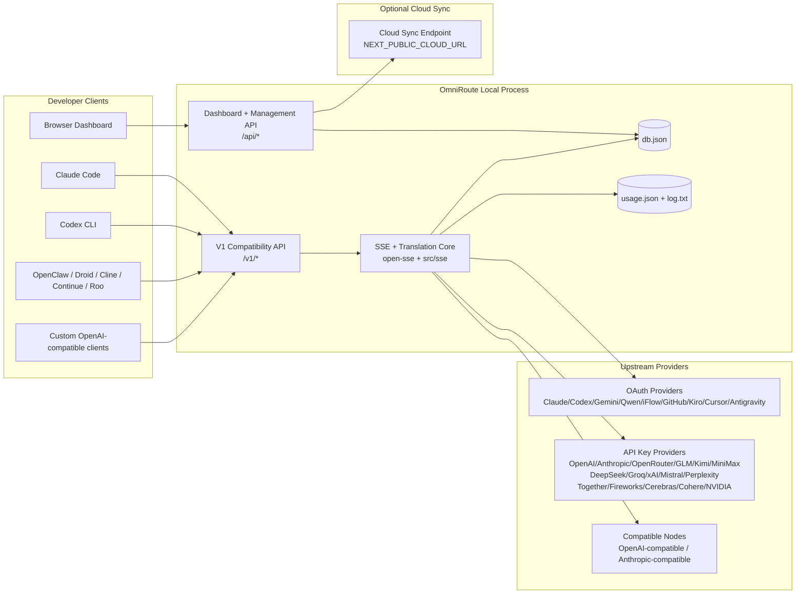
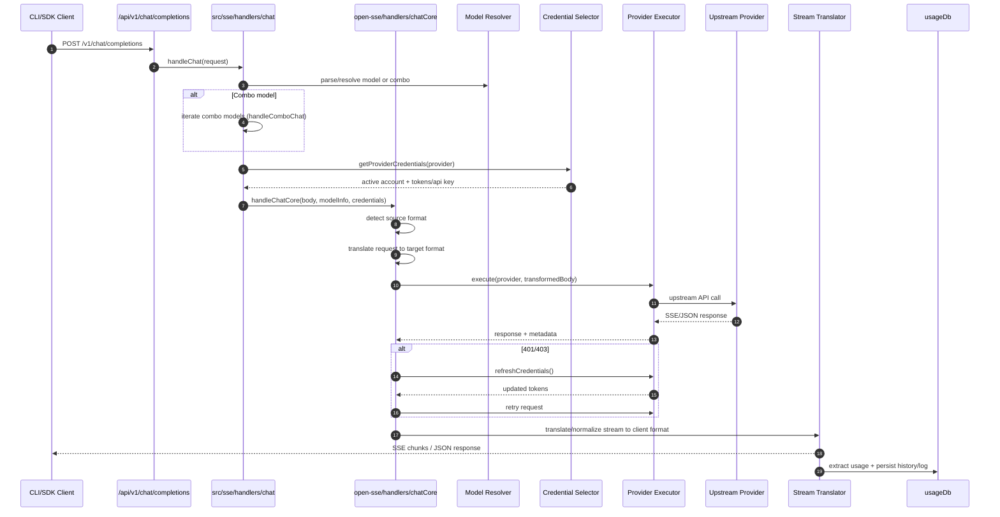
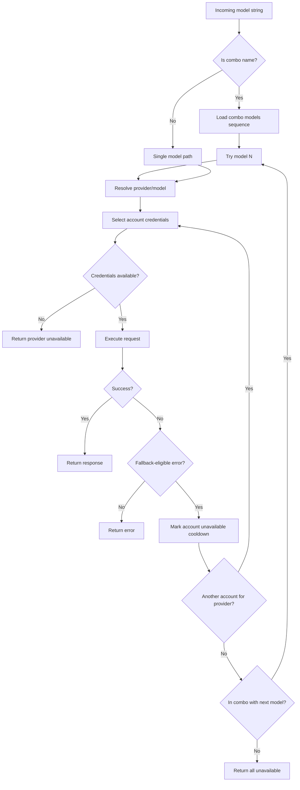
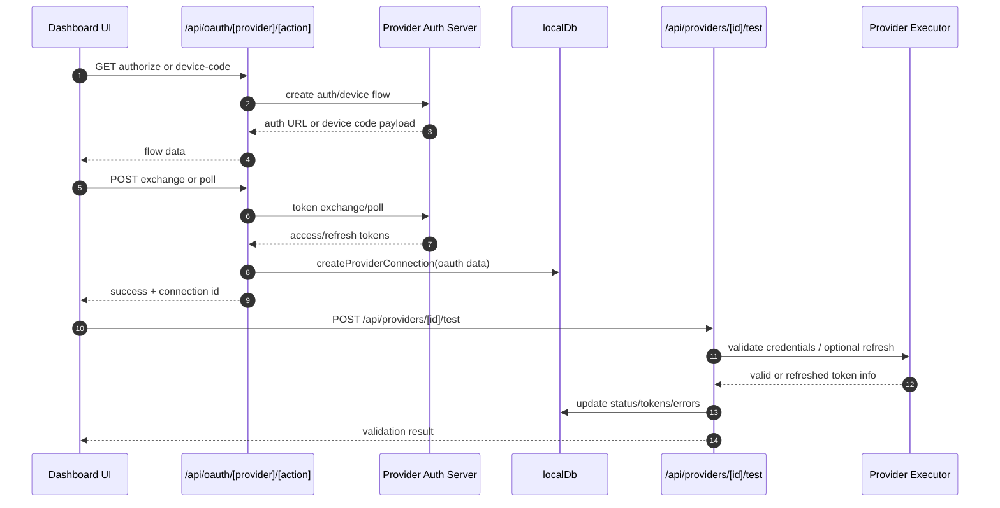
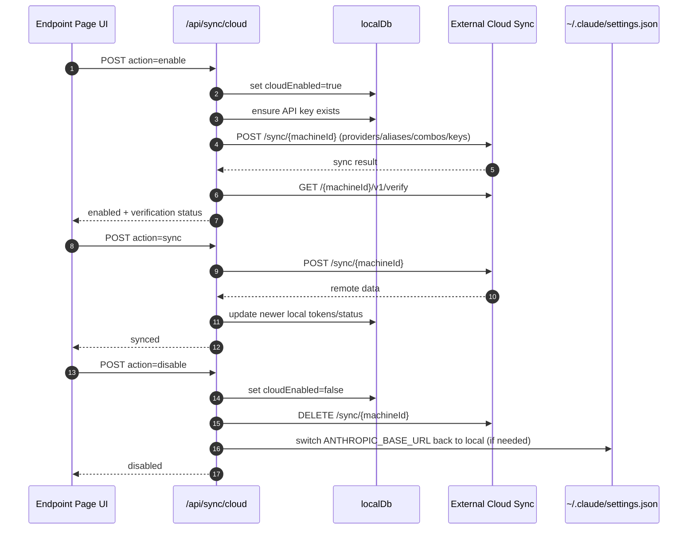
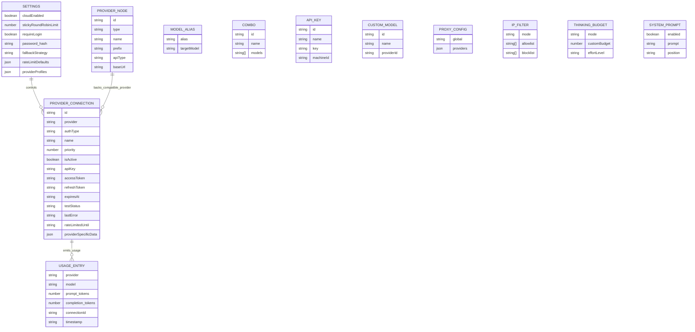
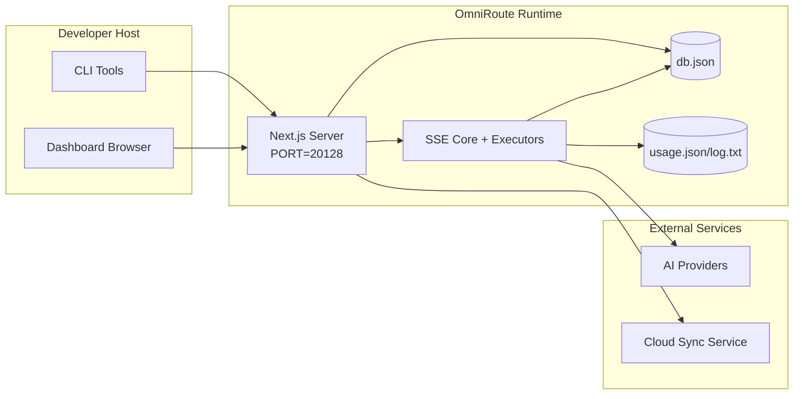

# Arsitektur OmniRoute

🌐 **Languages:** 🇺🇸 [English](../../ARCHITECTURE.md) | 🇧🇷 [Português (Brasil)](../pt-BR/ARCHITECTURE.md) | 🇪🇸 [Español](../es/ARCHITECTURE.md) | 🇫🇷 [Français](../fr/ARCHITECTURE.md) | 🇮🇹 [Italiano](../it/ARCHITECTURE.md) | 🇷🇺 [Русский](../ru/ARCHITECTURE.md) | 🇨🇳 [中文 (简体)](../zh-CN/ARCHITECTURE.md) | 🇩🇪 [Deutsch](../de/ARCHITECTURE.md) | 🇮🇳 [हिन्दी](../in/ARCHITECTURE.md) | 🇹🇭 [ไทย](../th/ARCHITECTURE.md) | 🇺🇦 [Українська](../uk-UA/ARCHITECTURE.md) | 🇸🇦 [العربية](../ar/ARCHITECTURE.md) | 🇯🇵 [日本語](../ja/ARCHITECTURE.md) | 🇻🇳 [Tiếng Việt](../vi/ARCHITECTURE.md) | 🇧🇬 [Български](../bg/ARCHITECTURE.md) | 🇩🇰 [Dansk](../da/ARCHITECTURE.md) | 🇫🇮 [Suomi](../fi/ARCHITECTURE.md) | 🇮🇱 [עברית](../he/ARCHITECTURE.md) | 🇭🇺 [Magyar](../hu/ARCHITECTURE.md) | 🇮🇩 [Bahasa Indonesia](../id/ARCHITECTURE.md) | 🇰🇷 [한국어](../ko/ARCHITECTURE.md) | 🇲🇾 [Bahasa Melayu](../ms/ARCHITECTURE.md) | 🇳🇱 [Nederlands](../nl/ARCHITECTURE.md) | 🇳🇴 [Norsk](../no/ARCHITECTURE.md) | 🇵🇹 [Português (Portugal)](../pt/ARCHITECTURE.md) | 🇷🇴 [Română](../ro/ARCHITECTURE.md) | 🇵🇱 [Polski](../pl/ARCHITECTURE.md) | 🇸🇰 [Slovenčina](../sk/ARCHITECTURE.md) | 🇸🇪 [Svenska](../sv/ARCHITECTURE.md) | 🇵🇭 [Filipino](../phi/ARCHITECTURE.md)

_Terakhir diperbarui: 18-02-2026_

## Ringkasan Eksekutif

OmniRoute adalah gateway dan dasbor perutean AI lokal yang dibangun di Next.js.
Ini menyediakan satu titik akhir yang kompatibel dengan OpenAI (`/v1/*`) dan merutekan lalu lintas di beberapa penyedia upstream dengan terjemahan, fallback, penyegaran token, dan pelacakan penggunaan.

Kemampuan inti:

- Permukaan API yang kompatibel dengan OpenAI untuk CLI/alat (28 penyedia)
- Permintaan/tanggapan terjemahan lintas format penyedia
- Model kombo fallback (urutan multi-model)
- Penggantian tingkat akun (multi-akun per penyedia)
- Manajemen koneksi penyedia kunci OAuth + API
- Menyematkan generasi melalui `/v1/embeddings` (6 penyedia, 9 model)
- Pembuatan gambar melalui `/v1/images/generations` (4 penyedia, 9 model)
- Pikirkan penguraian tag (`<think>...</think>`) untuk model penalaran
- Sanitasi respons untuk kompatibilitas OpenAI SDK yang ketat
- Normalisasi peran (pengembang→sistem, sistem→pengguna) untuk kompatibilitas lintas penyedia
- Konversi keluaran terstruktur (json_schema → Gemini responSchema)
- Persistensi lokal untuk penyedia, kunci, alias, kombo, pengaturan, harga
- Pelacakan penggunaan/biaya dan pencatatan permintaan
- Sinkronisasi cloud opsional untuk sinkronisasi multi-perangkat/negara
- Daftar IP yang diizinkan/daftar blokir untuk kontrol akses API
- Memikirkan manajemen anggaran (passthrough/otomatis/custom/adaptif)
- Injeksi cepat sistem global
- Pelacakan sesi dan sidik jari
- Pembatasan tarif yang ditingkatkan per akun dengan profil khusus penyedia
- Pola pemutus sirkuit untuk ketahanan penyedia
- Perlindungan kawanan anti guntur dengan penguncian mutex
- Cache deduplikasi permintaan berbasis tanda tangan
- Lapisan domain: ketersediaan model, aturan biaya, kebijakan fallback, kebijakan lockout
- Persistensi status domain (cache tulis SQLite untuk fallback, anggaran, penguncian, pemutus sirkuit)
- Mesin kebijakan untuk evaluasi permintaan terpusat (lockout → anggaran → fallback)
- Minta telemetri dengan agregasi latensi p50/p95/p99
- ID Korelasi (X-Request-Id) untuk penelusuran ujung ke ujung
- Pencatatan audit kepatuhan dengan opt-out per kunci API
- Kerangka evaluasi untuk penjaminan mutu LLM
- Dasbor UI ketahanan dengan status pemutus sirkuit waktu nyata
- Penyedia OAuth modular (12 modul individual di bawah `src/lib/oauth/providers/`)

Model waktu proses utama:

- Rute aplikasi Next.js di bawah `src/app/api/*` mengimplementasikan API dasbor dan API kompatibilitas
- Inti SSE/perutean bersama di `src/sse/*` + `open-sse/*` menangani eksekusi, terjemahan, streaming, fallback, dan penggunaan penyedia

## Ruang Lingkup dan Batasan

### Dalam Cakupan

- Waktu aktif gateway lokal
- API manajemen dasbor
- Otentikasi penyedia dan penyegaran token
- Minta terjemahan dan streaming SSE
- Status lokal + persistensi penggunaan
- Orkestrasi sinkronisasi cloud opsional

### Di Luar Cakupan

- Implementasi layanan cloud di belakang `NEXT_PUBLIC_CLOUD_URL`
- Penyedia SLA/bidang kontrol di luar proses lokal
- Biner CLI eksternal itu sendiri (Claude CLI, Codex CLI, dll.)

## Konteks Sistem Tingkat Tinggi



## Komponen Waktu Proses Inti

## 1) API dan Lapisan Perutean (Rute Aplikasi Next.js)

Direktori utama:

- `src/app/api/v1/*` dan `src/app/api/v1beta/*` untuk API kompatibilitas
- `src/app/api/*` untuk API manajemen/konfigurasi
- Selanjutnya penulisan ulang di `next.config.mjs` peta `/v1/*` menjadi `/api/v1/*`

Rute kompatibilitas penting:

- `src/app/api/v1/chat/completions/route.ts`
- `src/app/api/v1/messages/route.ts`
- `src/app/api/v1/responses/route.ts`
- `src/app/api/v1/models/route.ts` — termasuk model khusus dengan `custom: true`
- `src/app/api/v1/embeddings/route.ts` — generasi penyematan (6 penyedia)
- `src/app/api/v1/images/generations/route.ts` — pembuatan gambar (4+ penyedia termasuk Antigravity/Nebius)
- `src/app/api/v1/messages/count_tokens/route.ts`
- `src/app/api/v1/providers/[provider]/chat/completions/route.ts` — obrolan khusus per penyedia
- `src/app/api/v1/providers/[provider]/embeddings/route.ts` — penyematan khusus per penyedia
- `src/app/api/v1/providers/[provider]/images/generations/route.ts` — gambar khusus per penyedia
- `src/app/api/v1beta/models/route.ts`
- `src/app/api/v1beta/models/[...path]/route.ts`

Domain manajemen:

- Otentikasi/pengaturan: `src/app/api/auth/*`, `src/app/api/settings/*`
- Penyedia/koneksi: `src/app/api/providers*`
- Node penyedia: `src/app/api/provider-nodes*`
- Model khusus: `src/app/api/provider-models` (GET/POST/DELETE)
- Katalog model: `src/app/api/models/catalog` (GET)
- Konfigurasi proxy: `src/app/api/settings/proxy` (GET/PUT/DELETE) + `src/app/api/settings/proxy/test` (POST)
- OAuth: `src/app/api/oauth/*`
- Kunci/alias/kombo/harga: `src/app/api/keys*`, `src/app/api/models/alias`, `src/app/api/combos*`, `src/app/api/pricing`
- Penggunaan: `src/app/api/usage/*`
- Sinkronisasi/cloud: `src/app/api/sync/*`, `src/app/api/cloud/*`
- Pembantu perkakas CLI: `src/app/api/cli-tools/*`
- Filter IP: `src/app/api/settings/ip-filter` (DAPATKAN/PUT)
- Memikirkan anggaran: `src/app/api/settings/thinking-budget` (GET/PUT)
- Perintah sistem: `src/app/api/settings/system-prompt` (GET/PUT)
- Sesi: `src/app/api/sessions` (DAPATKAN)
- Batas tarif: `src/app/api/rate-limits` (GET)
- Ketahanan: `src/app/api/resilience` (GET/PATCH) — profil penyedia, pemutus sirkuit, status batas kecepatan
- Reset ketahanan: `src/app/api/resilience/reset` (POST) — reset pemutus + cooldown
- Statistik cache: `src/app/api/cache/stats` (DAPATKAN/HAPUS)
- Ketersediaan model: `src/app/api/models/availability` (GET/POST)
- Telemetri: `src/app/api/telemetry/summary` (GET)
- Anggaran: `src/app/api/usage/budget` (DAPATKAN/POST)
- Rantai cadangan: `src/app/api/fallback/chains` (GET/POST/DELETE)
- Audit kepatuhan: `src/app/api/compliance/audit-log` (GET)
- Nilai: `src/app/api/evals` (GET/POST), `src/app/api/evals/[suiteId]` (GET)
- Kebijakan: `src/app/api/policies` (DAPATKAN/POST)

## 2) SSE + Inti Terjemahan

Modul aliran utama:

- Entri: `src/sse/handlers/chat.ts`
- Orkestrasi inti: `open-sse/handlers/chatCore.ts`
- Adaptor eksekusi penyedia: `open-sse/executors/*`
- Deteksi format/konfigurasi penyedia: `open-sse/services/provider.ts`
- Model penguraian/penyelesaian: `src/sse/services/model.ts`, `open-sse/services/model.ts`
- Logika penggantian akun: `open-sse/services/accountFallback.ts`
- Registri terjemahan: `open-sse/translator/index.ts`
- Transformasi aliran: `open-sse/utils/stream.ts`, `open-sse/utils/streamHandler.ts`
- Ekstraksi/normalisasi penggunaan: `open-sse/utils/usageTracking.ts`
- Pikirkan pengurai tag: `open-sse/utils/thinkTagParser.ts`
- Pengendali penyematan: `open-sse/handlers/embeddings.ts`
- Menanamkan registri penyedia: `open-sse/config/embeddingRegistry.ts`
- Pengendali pembuatan gambar: `open-sse/handlers/imageGeneration.ts`
- Registri penyedia gambar: `open-sse/config/imageRegistry.ts`
- Sanitasi respons: `open-sse/handlers/responseSanitizer.ts`
- Normalisasi peran: `open-sse/services/roleNormalizer.ts`

Layanan (logika bisnis):

- Pemilihan/penilaian akun: `open-sse/services/accountSelector.ts`
- Manajemen siklus hidup konteks: `open-sse/services/contextManager.ts`
- Penegakan filter IP: `open-sse/services/ipFilter.ts`
- Pelacakan sesi: `open-sse/services/sessionManager.ts`
- Permintaan deduplikasi: `open-sse/services/signatureCache.ts`
- Injeksi cepat sistem: `open-sse/services/systemPrompt.ts`
- Memikirkan pengelolaan anggaran: `open-sse/services/thinkingBudget.ts`
- Perutean model karakter pengganti: `open-sse/services/wildcardRouter.ts`
- Manajemen batas tarif: `open-sse/services/rateLimitManager.ts`
- Pemutus arus: `open-sse/services/circuitBreaker.ts`

Modul lapisan domain:

- Ketersediaan model: `src/lib/domain/modelAvailability.ts`
- Aturan biaya/anggaran: `src/lib/domain/costRules.ts`
- Kebijakan penggantian: `src/lib/domain/fallbackPolicy.ts`
- Penyelesai kombo: `src/lib/domain/comboResolver.ts`
- Kebijakan penguncian: `src/lib/domain/lockoutPolicy.ts`
- Mesin kebijakan: `src/domain/policyEngine.ts` — penguncian terpusat → anggaran → evaluasi cadangan
- Katalog kode kesalahan: `src/lib/domain/errorCodes.ts`
- ID Permintaan: `src/lib/domain/requestId.ts`
- Batas waktu pengambilan: `src/lib/domain/fetchTimeout.ts`
- Permintaan telemetri: `src/lib/domain/requestTelemetry.ts`
- Kepatuhan/audit: `src/lib/domain/compliance/index.ts`
- Pelari evaluasi: `src/lib/domain/evalRunner.ts`
- Persistensi status domain: `src/lib/db/domainState.ts` — SQLite CRUD untuk rantai cadangan, anggaran, riwayat biaya, status penguncian, pemutus sirkuit

Modul penyedia OAuth (12 file individual di bawah `src/lib/oauth/providers/`):

- Indeks registri: `src/lib/oauth/providers/index.ts`
- Penyedia perorangan: `claude.ts`, `codex.ts`, `gemini.ts`, `antigravity.ts`, `iflow.ts`, `qwen.ts`, `kimi-coding.ts`, `github.ts`, `kiro.ts`, `cursor.ts`, `kilocode.ts`, `cline.ts`
- Pembungkus tipis: `src/lib/oauth/providers.ts` — mengekspor ulang dari masing-masing modul

## 3) Lapisan Persistensi

DB negara bagian utama:

- `src/lib/localDb.ts`
- file: `${DATA_DIR}/db.json` (atau `$XDG_CONFIG_HOME/omniroute/db.json` bila disetel, jika tidak `~/.omniroute/db.json`)
- entitas: penyediaConnections, penyediaNodes, modelAliases, kombo, apiKeys, pengaturan, harga, **customModels**, **proxyConfig**, **ipFilter**, **thinkingBudget**, **systemPrompt**

DB Penggunaan:

- `src/lib/usageDb.ts`
- file: `${DATA_DIR}/usage.json`, `${DATA_DIR}/log.txt`, `${DATA_DIR}/call_logs/`
- mengikuti kebijakan direktori dasar yang sama dengan `localDb` (`DATA_DIR`, lalu `XDG_CONFIG_HOME/omniroute` bila disetel)
- didekomposisi menjadi sub-modul terfokus: `migrations.ts`, `usageHistory.ts`, `costCalculator.ts`, `usageStats.ts`, `callLogs.ts`

DB Status Domain (SQLite):

- `src/lib/db/domainState.ts` — Operasi CRUD untuk status domain
- Tabel (dibuat di `src/lib/db/core.ts`): `domain_fallback_chains`, `domain_budgets`, `domain_cost_history`, `domain_lockout_state`, `domain_circuit_breakers`
- Pola cache write-through: Peta dalam memori bersifat otoritatif saat runtime; mutasi ditulis secara sinkron ke SQLite; keadaan dipulihkan dari DB pada start dingin

## 4) Auth + Permukaan Keamanan

- Otentikasi cookie dasbor: `src/proxy.ts`, `src/app/api/auth/login/route.ts`
- Pembuatan/verifikasi kunci API: `src/shared/utils/apiKey.ts`
- Rahasia penyedia tetap ada di `providerConnections` entri
- Dukungan proxy keluar melalui `open-sse/utils/proxyFetch.ts` (env vars) dan `open-sse/utils/networkProxy.ts` (dapat dikonfigurasi per penyedia atau global)

## 5) Sinkronisasi Cloud

- Penjadwal init: `src/lib/initCloudSync.ts`, `src/shared/services/initializeCloudSync.ts`
- Tugas berkala: `src/shared/services/cloudSyncScheduler.ts`
- Rute kontrol: `src/app/api/sync/cloud/route.ts`

## Siklus Hidup Permintaan (`/v1/chat/completions`)



## Kombo + Alur Penggantian Akun



Keputusan cadangan didorong oleh `open-sse/services/accountFallback.ts` menggunakan kode status dan heuristik pesan kesalahan.

## Siklus Hidup Orientasi OAuth dan Penyegaran Token



Penyegaran selama lalu lintas langsung dijalankan di dalam `open-sse/handlers/chatCore.ts` melalui pelaksana `refreshCredentials()`.

## Siklus Hidup Cloud Sync (Aktifkan / Sinkronisasi / Nonaktifkan)



Sinkronisasi berkala dipicu oleh `CloudSyncScheduler` saat cloud diaktifkan.

## Model Data dan Peta Penyimpanan



File penyimpanan fisik:

- status utama: `${DATA_DIR}/db.json` (atau `$XDG_CONFIG_HOME/omniroute/db.json` jika disetel, jika tidak `~/.omniroute/db.json`)
- statistik penggunaan: `${DATA_DIR}/usage.json`
- baris log permintaan: `${DATA_DIR}/log.txt`
- sesi debug penerjemah/permintaan opsional: `<repo>/logs/...`

## Topologi Penerapan



## Pemetaan Modul (Kritis Keputusan)

### Rute dan Modul API

- `src/app/api/v1/*`, `src/app/api/v1beta/*`: API kompatibilitas
- `src/app/api/v1/providers/[provider]/*`: rute khusus per penyedia (obrolan, penyematan, gambar)
- `src/app/api/providers*` : penyedia CRUD, validasi, pengujian
- `src/app/api/provider-nodes*`: manajemen node khusus yang kompatibel
- `src/app/api/provider-models`: manajemen model khusus (CRUD)
- `src/app/api/models/catalog`: API katalog model lengkap (semua jenis dikelompokkan berdasarkan penyedia)
- `src/app/api/oauth/*`: OAuth/kode perangkat mengalir
- `src/app/api/keys*`: siklus hidup kunci API lokal
- `src/app/api/models/alias`: manajemen alias
- `src/app/api/combos*`: manajemen kombo cadangan
- `src/app/api/pricing`: penggantian harga untuk penghitungan biaya
- `src/app/api/settings/proxy`: konfigurasi proksi (GET/PUT/DELETE)
- `src/app/api/settings/proxy/test`: uji konektivitas proxy keluar (POST)
- `src/app/api/usage/*`: API penggunaan dan log
- `src/app/api/sync/*` + `src/app/api/cloud/*`: sinkronisasi cloud dan pembantu yang menghadap cloud
- `src/app/api/cli-tools/*`: penulis/pemeriksa konfigurasi CLI lokal
- `src/app/api/settings/ip-filter`: Daftar IP yang diizinkan/daftar blokir (GET/PUT)
- `src/app/api/settings/thinking-budget`: memikirkan konfigurasi anggaran token (GET/PUT)
- `src/app/api/settings/system-prompt`: perintah sistem global (GET/PUT)
- `src/app/api/sessions`: daftar sesi aktif (GET)
- `src/app/api/rate-limits`: status batas tarif per akun (GET)

### Perutean dan Inti Eksekusi

- `src/sse/handlers/chat.ts`: penguraian permintaan, penanganan kombo, putaran pemilihan akun
- `open-sse/handlers/chatCore.ts`: terjemahan, pengiriman eksekutor, penanganan coba lagi/segarkan, pengaturan streaming
- `open-sse/executors/*`: perilaku format dan jaringan khusus penyedia

### Registri Terjemahan dan Pengonversi Format

- `open-sse/translator/index.ts`: registrasi dan orkestrasi penerjemah
- Permintaan penerjemah: `open-sse/translator/request/*`
- Penerjemah tanggapan: `open-sse/translator/response/*`
- Konstanta format: `open-sse/translator/formats.ts`

### Ketekunan

- `src/lib/localDb.ts`: konfigurasi/status persisten
- `src/lib/usageDb.ts`: riwayat penggunaan dan log permintaan bergulir

## Cakupan Pelaksana Penyedia (Pola Strategi)

Setiap penyedia memiliki pelaksana khusus yang memperluas `BaseExecutor` (di `open-sse/executors/base.ts`), yang menyediakan pembuatan URL, konstruksi header, percobaan ulang dengan backoff eksponensial, kait penyegaran kredensial, dan metode orkestrasi `execute()`.

| Pelaksana             | Penyedia                                                                                                                                                       | Penanganan Khusus                                                                     |
| --------------------- | -------------------------------------------------------------------------------------------------------------------------------------------------------------- | ------------------------------------------------------------------------------------- |
| `DefaultExecutor`     | OpenAI, Claude, Gemini, Qwen, iFlow, OpenRouter, GLM, Kimi, MiniMax, DeepSeek, Groq, xAI, Mistral, Kebingungan, Bersama, Kembang Api, Cerebras, Cohere, NVIDIA | Konfigurasi URL/tajuk dinamis per penyedia                                            |
| `AntigravityExecutor` | Google Antigravitasi                                                                                                                                           | ID proyek/sesi khusus, Coba Lagi-Setelah penguraian                                   |
| `CodexExecutor`       | Kodeks OpenAI                                                                                                                                                  | Menyuntikkan instruksi sistem, memaksakan upaya penalaran                             |
| `CursorExecutor`      | IDE Kursor                                                                                                                                                     | Protokol ConnectRPC, pengkodean Protobuf, penandatanganan permintaan melalui checksum |
| `GithubExecutor`      | Kopilot GitHub                                                                                                                                                 | Penyegaran token kopilot, header yang meniru VSCode                                   |
| `KiroExecutor`        | AWS CodeWhisperer/Kiro                                                                                                                                         | Format biner AWS EventStream → konversi SSE                                           |
| `GeminiCLIExecutor`   | CLI Gemini                                                                                                                                                     | Siklus penyegaran token Google OAuth                                                  |

Semua penyedia lain (termasuk node khusus yang kompatibel) menggunakan `DefaultExecutor`.

## Matriks Kompatibilitas Penyedia

| Penyedia         | Format           | Otentikasi            | Aliran            | Non-Aliran | Penyegaran Token | API Penggunaan        |
| ---------------- | ---------------- | --------------------- | ----------------- | ---------- | ---------------- | --------------------- |
| Claude           | claude           | Kunci API / OAuth     | ✅                | ✅         | ✅               | ⚠️ Admin saja         |
| kembar           | gemilang         | Kunci API / OAuth     | ✅                | ✅         | ✅               | ⚠️ Konsol Cloud       |
| CLI Gemini       | gemini-cli       | OAuth                 | ✅                | ✅         | ✅               | ⚠️ Konsol Cloud       |
| Antigravitasi    | antigravitasi    | OAuth                 | ✅                | ✅         | ✅               | ✅ API kuota penuh    |
| OpenAI           | buka             | Kunci API             | ✅                | ✅         | ❌               | ❌                    |
| Kodeks           | openai-responses | OAuth                 | ✅ dipaksa        | ❌         | ✅               | ✅ Batas tarif        |
| Kopilot GitHub   | buka             | OAuth + Token Kopilot | ✅                | ✅         | ✅               | ✅ Cuplikan kuota     |
| Kursor           | kursor           | Checksum khusus       | ✅                | ✅         | ❌               | ❌                    |
| Kiro             | kiri             | AWSSSO OIDC           | ✅ (Aliran Acara) | ❌         | ✅               | ✅ Batasan penggunaan |
| Qwen             | buka             | OAuth                 | ✅                | ✅         | ✅               | ⚠️ Sesuai permintaan  |
| iFlow            | buka             | OAuth (Dasar)         | ✅                | ✅         | ✅               | ⚠️ Sesuai permintaan  |
| BukaRouter       | buka             | Kunci API             | ✅                | ✅         | ❌               | ❌                    |
| GLM/Kimi/MiniMax | claude           | Kunci API             | ✅                | ✅         | ❌               | ❌                    |
| Pencarian Dalam  | buka             | Kunci API             | ✅                | ✅         | ❌               | ❌                    |
| Bagus            | buka             | Kunci API             | ✅                | ✅         | ❌               | ❌                    |
| xAI (Grok)       | buka             | Kunci API             | ✅                | ✅         | ❌               | ❌                    |
| Mistral          | buka             | Kunci API             | ✅                | ✅         | ❌               | ❌                    |
| Kebingungan      | openai           | Kunci API             | ✅                | ✅         | ❌               | ❌                    |
| Bersama AI       | buka             | Kunci API             | ✅                | ✅         | ❌               | ❌                    |
| AI kembang api   | buka             | Kunci API             | ✅                | ✅         | ❌               | ❌                    |
| Otak             | buka             | Kunci API             | ✅                | ✅         | ❌               | ❌                    |
| menyatu          | buka             | Kunci API             | ✅                | ✅         | ❌               | ❌                    |
| NVIDIA NIM       | buka             | Kunci API             | ✅                | ✅         | ❌               | ❌                    |

## Format Cakupan Terjemahan

Format sumber yang terdeteksi meliputi:

- `openai`
- `openai-responses`
- `claude`
- `gemini`

Format sasaran meliputi:

- Obrolan/Respon OpenAI
- Claude
- Amplop Gemini/Gemini-CLI/Antigravitasi
- Kiro
- Kursor

Penerjemahan menggunakan **OpenAI sebagai format hub** — semua konversi melalui OpenAI sebagai perantara:

```
Source Format → OpenAI (hub) → Target Format
```

Terjemahan dipilih secara dinamis berdasarkan bentuk muatan sumber dan format target penyedia.

Lapisan pemrosesan tambahan dalam alur terjemahan:

- **Sanitasi respons** — Menghapus kolom non-standar dari respons format OpenAI (streaming dan non-streaming) untuk memastikan kepatuhan SDK yang ketat
- **Normalisasi peran** — Mengonversi `developer` → `system` untuk target non-OpenAI; menggabungkan `system` → `user` untuk model yang menolak peran sistem (GLM, ERNIE)
- **Pikirkan ekstraksi tag** — Mengurai `<think>...</think>` blok dari konten ke dalam bidang `reasoning_content`
- **Output terstruktur** — Mengonversi OpenAI `response_format.json_schema` menjadi `responseMimeType` + `responseSchema` Gemini

## Titik Akhir API yang Didukung

| Titik akhir                                        | Format              | Penangan                                                |
| -------------------------------------------------- | ------------------- | ------------------------------------------------------- |
| `POST /v1/chat/completions`                        | Obrolan OpenAI      | `src/sse/handlers/chat.ts`                              |
| `POST /v1/messages`                                | Pesan Claude        | Penangan yang sama (terdeteksi otomatis)                |
| `POST /v1/responses`                               | Tanggapan OpenAI    | `open-sse/handlers/responsesHandler.ts`                 |
| `POST /v1/embeddings`                              | Penyematan OpenAI   | `open-sse/handlers/embeddings.ts`                       |
| `GET /v1/embeddings`                               | Daftar model        | Rute API                                                |
| `POST /v1/images/generations`                      | Gambar OpenAI       | `open-sse/handlers/imageGeneration.ts`                  |
| `GET /v1/images/generations`                       | Daftar model        | Rute API                                                |
| `POST /v1/providers/{provider}/chat/completions`   | Obrolan OpenAI      | Per penyedia khusus dengan validasi model               |
| `POST /v1/providers/{provider}/embeddings`         | Penyematan OpenAI   | Per penyedia khusus dengan validasi model               |
| `POST /v1/providers/{provider}/images/generations` | Gambar OpenAI       | Per penyedia khusus dengan validasi model               |
| `POST /v1/messages/count_tokens`                   | Jumlah Token Claude | Rute API                                                |
| `GET /v1/models`                                   | Daftar Model OpenAI | Rute API (obrolan + penyematan + gambar + model khusus) |
| `GET /api/models/catalog`                          | Katalog             | Semua model dikelompokkan berdasarkan penyedia + tipe   |
| `POST /v1beta/models/*:streamGenerateContent`      | Gemini asli         | Rute API                                                |
| `GET/PUT/DELETE /api/settings/proxy`               | Konfigurasi Proksi  | Konfigurasi proksi jaringan                             |
| `POST /api/settings/proxy/test`                    | Konektivitas Proksi | Titik akhir pengujian kesehatan/konektivitas proxy      |
| `GET/POST/DELETE /api/provider-models`             | Model Khusus        | Manajemen model khusus per penyedia                     |

## Pengendali Pintas

Penangan bypass (`open-sse/utils/bypassHandler.ts`) mencegat permintaan "sekali pakai" yang diketahui dari Claude CLI — ping pemanasan, ekstraksi judul, dan jumlah token — dan mengembalikan **respons palsu** tanpa menggunakan token penyedia upstream. Ini dipicu hanya ketika `User-Agent` berisi `claude-cli`.

## Minta Saluran Logger

Logger permintaan (`open-sse/utils/requestLogger.ts`) menyediakan pipeline debug logging 7 tahap, dinonaktifkan secara default, diaktifkan melalui `ENABLE_REQUEST_LOGS=true`:

```
1_req_client.json → 2_req_source.json → 3_req_openai.json → 4_req_target.json
→ 5_res_provider.txt → 6_res_openai.txt → 7_res_client.txt
```

File ditulis ke `<repo>/logs/<session>/` untuk setiap sesi permintaan.

## Mode Kegagalan dan Ketahanan

## 1) Ketersediaan Akun/Penyedia

- cooldown akun penyedia pada kesalahan sementara/rate/auth
- penggantian akun sebelum permintaan gagal
- penggantian model kombo ketika jalur model/penyedia saat ini habis

## 2) Kedaluwarsa Token

- pra-periksa dan segarkan dengan coba lagi untuk penyedia yang dapat disegarkan
- 401/403 percobaan ulang setelah upaya penyegaran di jalur inti

## 3) Keamanan Aliran

- pengontrol aliran yang sadar akan pemutusan hubungan
- aliran terjemahan dengan flush akhir aliran dan penanganan `[DONE]`
- penggantian estimasi penggunaan ketika metadata penggunaan penyedia tidak ada

## 4) Degradasi Sinkronisasi Cloud

- kesalahan sinkronisasi muncul tetapi runtime lokal terus berlanjut
- penjadwal memiliki logika yang mampu mencoba ulang, namun eksekusi berkala saat ini memanggil sinkronisasi upaya tunggal secara default

## 5) Integritas Data

- Migrasi/perbaikan bentuk DB untuk kunci yang hilang
- perlindungan reset JSON yang rusak untuk localDb dan usageDb

## Observabilitas dan Sinyal Operasional

Sumber visibilitas waktu proses:

- log konsol dari `src/sse/utils/logger.ts`
- agregat penggunaan per permintaan di `usage.json`
- status permintaan tekstual masuk `log.txt`
- log permintaan/terjemahan dalam opsional di bawah `logs/` ketika `ENABLE_REQUEST_LOGS=true`
- titik akhir penggunaan dasbor (`/api/usage/*`) untuk konsumsi UI

## Batasan yang Sensitif terhadap Keamanan

- Rahasia JWT (`JWT_SECRET`) mengamankan verifikasi/penandatanganan cookie sesi dasbor
- Penggantian kata sandi awal (`INITIAL_PASSWORD`, default `123456`) harus diganti dalam penerapan nyata
- Rahasia HMAC kunci API (`API_KEY_SECRET`) mengamankan format kunci API lokal yang dihasilkan
- Rahasia penyedia (kunci/token API) disimpan di DB lokal dan harus dilindungi di tingkat sistem file
- Titik akhir sinkronisasi cloud mengandalkan autentikasi kunci API + semantik id mesin

## Matriks Lingkungan dan Runtime

Variabel lingkungan yang aktif digunakan oleh kode:

- Aplikasi/autentikasi: `JWT_SECRET`, `INITIAL_PASSWORD`
- Penyimpanan: `DATA_DIR`
- Perilaku node yang kompatibel: `ALLOW_MULTI_CONNECTIONS_PER_COMPAT_NODE`
- Penggantian basis penyimpanan opsional (Linux/macOS ketika `DATA_DIR` tidak disetel): `XDG_CONFIG_HOME`
- Pencirian keamanan: `API_KEY_SECRET`, `MACHINE_ID_SALT`
- Pencatatan: `ENABLE_REQUEST_LOGS`
- URL sinkronisasi/cloud: `NEXT_PUBLIC_BASE_URL`, `NEXT_PUBLIC_CLOUD_URL`
- Proksi keluar: `HTTP_PROXY`, `HTTPS_PROXY`, `ALL_PROXY`, `NO_PROXY` dan varian huruf kecil
- Bendera fitur SOCKS5: `ENABLE_SOCKS5_PROXY`, `NEXT_PUBLIC_ENABLE_SOCKS5_PROXY`
- Pembantu platform/runtime (bukan konfigurasi khusus aplikasi): `APPDATA`, `NODE_ENV`, `PORT`, `HOSTNAME`

## Catatan Arsitektur yang Dikenal

1. `usageDb` dan `localDb` sekarang berbagi kebijakan direktori dasar yang sama (`DATA_DIR` -> `XDG_CONFIG_HOME/omniroute` -> `~/.omniroute`) dengan migrasi file lama.
2. `/api/v1/route.ts` mengembalikan daftar model statis dan bukan sumber model utama yang digunakan oleh `/v1/models`.
3. Pencatat permintaan menulis header/isi lengkap saat diaktifkan; memperlakukan direktori log sebagai sensitif.
4. Perilaku cloud bergantung pada `NEXT_PUBLIC_BASE_URL` yang benar dan jangkauan titik akhir cloud.
5. Direktori `open-sse/` diterbitkan sebagai `@omniroute/open-sse` **paket ruang kerja npm**. Kode sumber mengimpornya melalui `@omniroute/open-sse/...` (diselesaikan oleh Next.js `transpilePackages`). Jalur file dalam dokumen ini masih menggunakan nama direktori `open-sse/` untuk konsistensi.
6. Bagan di dasbor menggunakan **Recharts** (berbasis SVG) untuk visualisasi analitik interaktif yang mudah diakses (diagram batang penggunaan model, tabel perincian penyedia dengan tingkat keberhasilan).
7. Tes E2E menggunakan **Playwright** (`tests/e2e/`), dijalankan melalui `npm run test:e2e`. Pengujian unit menggunakan **Node.js test runner** (`tests/unit/`), dijalankan melalui `npm run test:plan3`. Kode sumber di bawah `src/` adalah **TypeScript** (`.ts`/`.tsx`); ruang kerja `open-sse/` tetap JavaScript (`.js`).
8. Halaman pengaturan disusun dalam 5 tab: Keamanan, Perutean (6 strategi global: isi dulu, round-robin, p2c, acak, jarang digunakan, optimal biaya), Ketahanan (batas kecepatan yang dapat diedit, pemutus sirkuit, kebijakan), AI (anggaran berpikir, perintah sistem, cache cepat), Lanjutan (proxy).

## Daftar Periksa Verifikasi Operasional

- Bangun dari sumber: `npm run build`
- Bangun gambar Docker: `docker build -t omniroute .`
- Mulai layanan dan verifikasi:
- `GET /api/settings`
- `GET /api/v1/models`
- URL dasar target CLI harus `http://<host>:20128/v1` ketika `PORT=20128`
