# omniroute — Dokumentasi Basis Kode

🌐 **Languages:** 🇺🇸 [English](../../CODEBASE_DOCUMENTATION.md) | 🇧🇷 [Português (Brasil)](../pt-BR/CODEBASE_DOCUMENTATION.md) | 🇪🇸 [Español](../es/CODEBASE_DOCUMENTATION.md) | 🇫🇷 [Français](../fr/CODEBASE_DOCUMENTATION.md) | 🇮🇹 [Italiano](../it/CODEBASE_DOCUMENTATION.md) | 🇷🇺 [Русский](../ru/CODEBASE_DOCUMENTATION.md) | 🇨🇳 [中文 (简体)](../zh-CN/CODEBASE_DOCUMENTATION.md) | 🇩🇪 [Deutsch](../de/CODEBASE_DOCUMENTATION.md) | 🇮🇳 [हिन्दी](../in/CODEBASE_DOCUMENTATION.md) | 🇹🇭 [ไทย](../th/CODEBASE_DOCUMENTATION.md) | 🇺🇦 [Українська](../uk-UA/CODEBASE_DOCUMENTATION.md) | 🇸🇦 [العربية](../ar/CODEBASE_DOCUMENTATION.md) | 🇯🇵 [日本語](../ja/CODEBASE_DOCUMENTATION.md) | 🇻🇳 [Tiếng Việt](../vi/CODEBASE_DOCUMENTATION.md) | 🇧🇬 [Български](../bg/CODEBASE_DOCUMENTATION.md) | 🇩🇰 [Dansk](../da/CODEBASE_DOCUMENTATION.md) | 🇫🇮 [Suomi](../fi/CODEBASE_DOCUMENTATION.md) | 🇮🇱 [עברית](../he/CODEBASE_DOCUMENTATION.md) | 🇭🇺 [Magyar](../hu/CODEBASE_DOCUMENTATION.md) | 🇮🇩 [Bahasa Indonesia](../id/CODEBASE_DOCUMENTATION.md) | 🇰🇷 [한국어](../ko/CODEBASE_DOCUMENTATION.md) | 🇲🇾 [Bahasa Melayu](../ms/CODEBASE_DOCUMENTATION.md) | 🇳🇱 [Nederlands](../nl/CODEBASE_DOCUMENTATION.md) | 🇳🇴 [Norsk](../no/CODEBASE_DOCUMENTATION.md) | 🇵🇹 [Português (Portugal)](../pt/CODEBASE_DOCUMENTATION.md) | 🇷🇴 [Română](../ro/CODEBASE_DOCUMENTATION.md) | 🇵🇱 [Polski](../pl/CODEBASE_DOCUMENTATION.md) | 🇸🇰 [Slovenčina](../sk/CODEBASE_DOCUMENTATION.md) | 🇸🇪 [Svenska](../sv/CODEBASE_DOCUMENTATION.md) | 🇵🇭 [Filipino](../phi/CODEBASE_DOCUMENTATION.md)

> Panduan komprehensif dan mudah bagi pemula untuk router proxy AI multi-penyedia **omniroute**.

---

## 1. Apa itu omniroute?

omniroute adalah **router proxy** yang berada di antara klien AI (Claude CLI, Codex, Cursor IDE, dll.) dan penyedia AI (Anthropic, Google, OpenAI, AWS, GitHub, dll.). Ini memecahkan satu masalah besar:

> **Klien AI yang berbeda menggunakan "bahasa" (format API) yang berbeda, dan penyedia AI yang berbeda juga mengharapkan "bahasa" yang berbeda.** omniroute menerjemahkan bahasa tersebut secara otomatis.

Anggap saja seperti penerjemah universal di Perserikatan Bangsa-Bangsa — setiap delegasi dapat berbicara dalam bahasa apa pun, dan penerjemah tersebut mengonversikannya untuk delegasi lainnya.

---

## 2. Ikhtisar Arsitektur

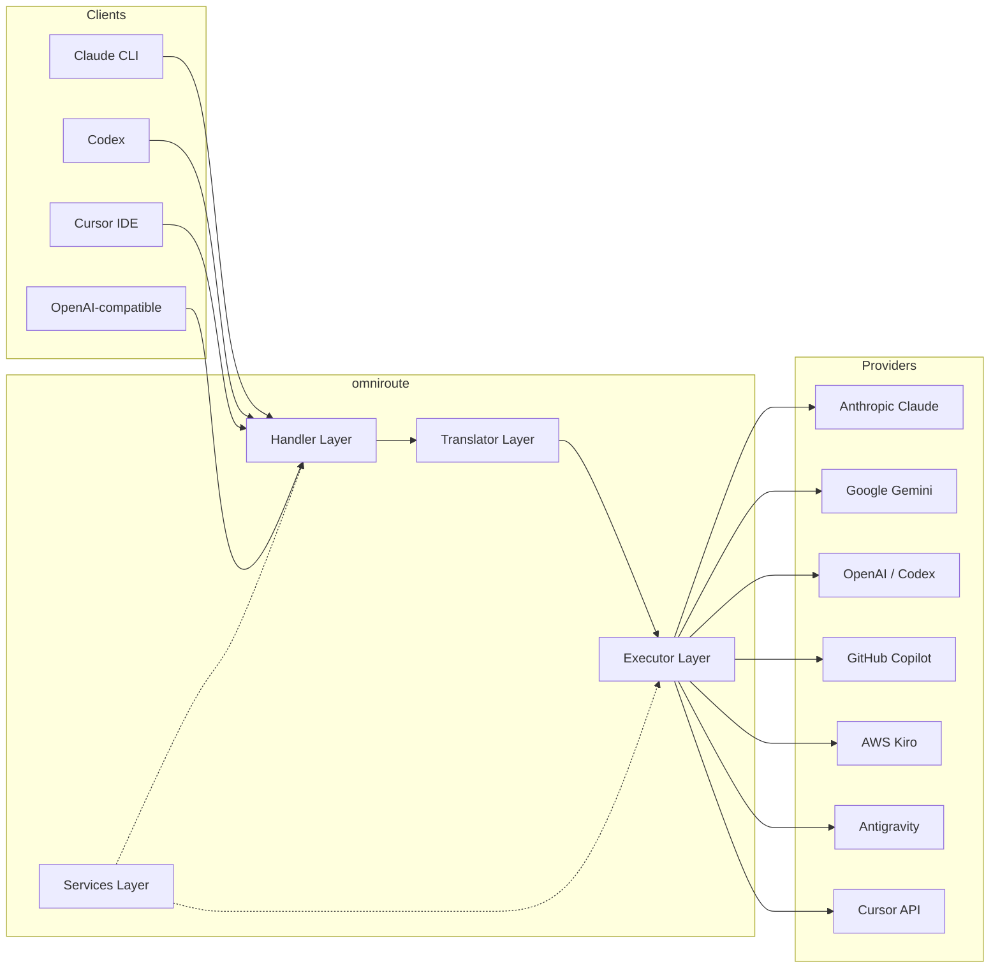

### Prinsip Inti: Penerjemahan Hub-and-Spoke

Semua terjemahan format melewati **format OpenAI sebagai hub**:

```
Client Format → [OpenAI Hub] → Provider Format    (request)
Provider Format → [OpenAI Hub] → Client Format    (response)
```

Artinya, Anda hanya memerlukan **N penerjemah** (satu per format) dan bukan **N²** (setiap pasangan).

---

## 3. Struktur Proyek

```
omniroute/
├── open-sse/                  ← Core proxy library (portable, framework-agnostic)
│   ├── index.js               ← Main entry point, exports everything
│   ├── config/                ← Configuration & constants
│   ├── executors/             ← Provider-specific request execution
│   ├── handlers/              ← Request handling orchestration
│   ├── services/              ← Business logic (auth, models, fallback, usage)
│   ├── translator/            ← Format translation engine
│   │   ├── request/           ← Request translators (8 files)
│   │   ├── response/          ← Response translators (7 files)
│   │   └── helpers/           ← Shared translation utilities (6 files)
│   └── utils/                 ← Utility functions
├── src/                       ← Application layer (Express/Worker runtime)
│   ├── app/                   ← Web UI, API routes, middleware
│   ├── lib/                   ← Database, auth, and shared library code
│   ├── mitm/                  ← Man-in-the-middle proxy utilities
│   ├── models/                ← Database models
│   ├── shared/                ← Shared utilities (wrappers around open-sse)
│   ├── sse/                   ← SSE endpoint handlers
│   └── store/                 ← State management
├── data/                      ← Runtime data (credentials, logs)
│   └── provider-credentials.json   (external credentials override, gitignored)
└── tester/                    ← Test utilities
```

---

## 4. Perincian Modul demi Modul

### 4.1 Konfigurasi (`open-sse/config/`)

**Satu-satunya sumber kebenaran** untuk semua konfigurasi penyedia.

| Berkas                        | Tujuan                                                                                                                                                                                                                             |
| ----------------------------- | ---------------------------------------------------------------------------------------------------------------------------------------------------------------------------------------------------------------------------------- |
| `constants.ts`                | Objek `PROVIDERS` dengan URL dasar, kredensial OAuth (default), header, dan perintah sistem default untuk setiap penyedia. Juga mendefinisikan `HTTP_STATUS`, `ERROR_TYPES`, `COOLDOWN_MS`, `BACKOFF_CONFIG`, dan `SKIP_PATTERNS`. |
| `credentialLoader.ts`         | Memuat kredensial eksternal dari `data/provider-credentials.json` dan menggabungkannya melalui default hardcode di `PROVIDERS`. Menjaga rahasia di luar kendali sumber sambil menjaga kompatibilitas ke belakang.                  |
| `providerModels.ts`           | Registri model pusat: alias penyedia peta → ID model. Fungsi seperti `getModels()`, `getProviderByAlias()`.                                                                                                                        |
| `codexInstructions.ts`        | Instruksi sistem dimasukkan ke dalam permintaan Codex (batasan pengeditan, aturan sandbox, kebijakan persetujuan).                                                                                                                 |
| `defaultThinkingSignature.ts` | Tanda tangan "berpikir" default untuk model Claude dan Gemini.                                                                                                                                                                     |
| `ollamaModels.ts`             | Definisi skema untuk model Ollama lokal (nama, ukuran, keluarga, kuantisasi).                                                                                                                                                      |

#### Alur Pemuatan Kredensial

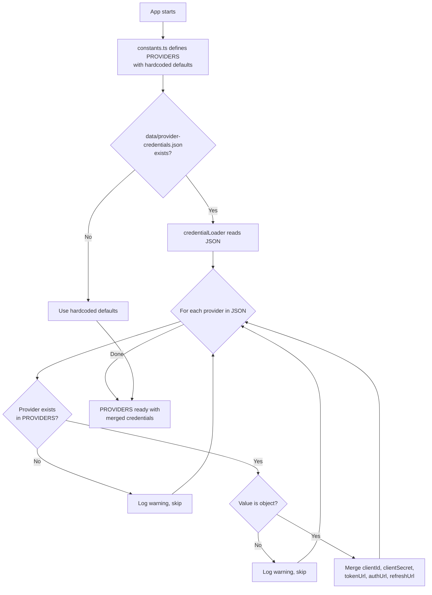

---

### 4.2 Pelaksana (`open-sse/executors/`)

Pelaksana merangkum **logika khusus penyedia** menggunakan **Pola Strategi**. Setiap pelaksana mengganti metode dasar sesuai kebutuhan.

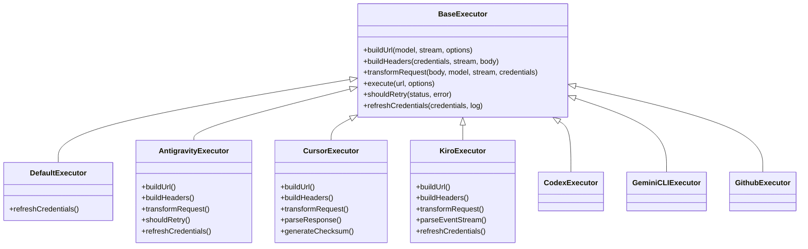

| Pelaksana        | Penyedia                                   | Spesialisasi Utama                                                                                                           |
| ---------------- | ------------------------------------------ | ---------------------------------------------------------------------------------------------------------------------------- |
| `base.ts`        | —                                          | Basis abstrak: Pembuatan URL, header, logika coba lagi, penyegaran kredensial                                                |
| `default.ts`     | Claude, Gemini, OpenAI, GLM, Kimi, MiniMax | Penyegaran token OAuth generik untuk penyedia standar                                                                        |
| `antigravity.ts` | Kode Google Cloud                          | Pembuatan ID proyek/sesi, penggantian multi-URL, penguraian coba ulang khusus dari pesan kesalahan ("reset setelah 2h7m23s") |
| `cursor.ts`      | IDE Kursor                                 | **Paling rumit**: autentikasi checksum SHA-256, pengkodean permintaan Protobuf, biner EventStream → penguraian respons SSE   |
| `codex.ts`       | Kodeks OpenAI                              | Menyuntikkan instruksi sistem, mengelola tingkat pemikiran, menghapus parameter yang tidak didukung                          |
| `gemini-cli.ts`  | CLI Google Gemini                          | Pembuatan URL khusus (`streamGenerateContent`), penyegaran token Google OAuth                                                |
| `github.ts`      | Kopilot GitHub                             | Sistem token ganda (GitHub OAuth + token Copilot), header VSCode meniru                                                      |
| `kiro.ts`        | AWS CodeWhisperer                          | Penguraian biner AWS EventStream, bingkai peristiwa AMZN, estimasi token                                                     |
| `index.ts`       | —                                          | Pabrik: nama penyedia peta → kelas pelaksana, dengan fallback default                                                        |

---

### 4.3 Penangan (`open-sse/handlers/`)

**Lapisan orkestrasi** — mengoordinasikan terjemahan, eksekusi, streaming, dan penanganan kesalahan.

| Berkas                | Tujuan                                                                                                                                                                                                                                     |
| --------------------- | ------------------------------------------------------------------------------------------------------------------------------------------------------------------------------------------------------------------------------------------ |
| `chatCore.ts`         | **Orkestra pusat** (~600 baris). Menangani siklus hidup permintaan secara lengkap: deteksi format → terjemahan → pengiriman pelaksana → respons streaming/non-streaming → penyegaran token → penanganan kesalahan → pencatatan penggunaan. |
| `responsesHandler.ts` | Adaptor untuk API Respons OpenAI: mengonversi format Respons → Penyelesaian Obrolan → mengirim ke `chatCore` → mengonversi SSE kembali ke format Respons.                                                                                  |
| `embeddings.ts`       | Penangan generasi penyematan: menyelesaikan model penyematan → penyedia, mengirimkan ke API penyedia, mengembalikan respons penyematan yang kompatibel dengan OpenAI. Mendukung 6+ penyedia.                                               |
| `imageGeneration.ts`  | Pengendali pembuatan gambar: menyelesaikan model gambar → penyedia, mendukung mode yang kompatibel dengan OpenAI, gambar Gemini (Antigravity), dan fallback (Nebius). Mengembalikan gambar base64 atau URL.                                |

#### Siklus Hidup Permintaan (chatCore.ts)

```mermaid
sequenceDiagram
    participant Client
    participant chatCore
    participant Translator
    participant Executor
    participant Provider

    Client->>chatCore: Request (any format)
    chatCore->>chatCore: Detect source format
    chatCore->>chatCore: Check bypass patterns
    chatCore->>chatCore: Resolve model & provider
    chatCore->>Translator: Translate request (source → OpenAI → target)
    chatCore->>Executor: Get executor for provider
    Executor->>Executor: Build URL, headers, transform request
    Executor->>Executor: Refresh credentials if needed
    Executor->>Provider: HTTP fetch (streaming or non-streaming)

    alt Streaming
        Provider-->>chatCore: SSE stream
        chatCore->>chatCore: Pipe through SSE transform stream
        Note over chatCore: Transform stream translates<br/>each chunk: target → OpenAI → source
        chatCore-->>Client: Translated SSE stream
    else Non-streaming
        Provider-->>chatCore: JSON response
        chatCore->>Translator: Translate response
        chatCore-->>Client: Translated JSON
    end

    alt Error (401, 429, 500...)
        chatCore->>Executor: Retry with credential refresh
        chatCore->>chatCore: Account fallback logic
    end
```

---

### 4.4 Layanan (`open-sse/services/`)

Logika bisnis yang mendukung penangan dan pelaksana.

| Berkas               | Tujuan                                                                                                                                                                                                                                                                                                                                                      |
| -------------------- | ----------------------------------------------------------------------------------------------------------------------------------------------------------------------------------------------------------------------------------------------------------------------------------------------------------------------------------------------------------- |
| `provider.ts`        | **Deteksi format** (`detectFormat`): menganalisis struktur isi permintaan untuk mengidentifikasi format Claude/OpenAI/Gemini/Antigravity/Responses (termasuk heuristik `max_tokens` untuk Claude). Juga: pembuatan URL, pembuatan header, normalisasi konfigurasi pemikiran. Mendukung penyedia dinamis `openai-compatible-*` dan `anthropic-compatible-*`. |
| `model.ts`           | Penguraian string model (`claude/model-name` → `{provider: "claude", model: "model-name"}`), resolusi alias dengan deteksi tabrakan, sanitasi input (menolak traversal jalur/karakter kontrol), dan resolusi info model dengan dukungan pengambil alias asinkron.                                                                                           |
| `accountFallback.ts` | Penanganan batas kecepatan: backoff eksponensial (1 dtk → 2 dtk → 4 dtk → maks 2 menit), manajemen cooldown akun, klasifikasi kesalahan (kesalahan mana yang memicu fallback vs. tidak).                                                                                                                                                                    |
| `tokenRefresh.ts`    | Penyegaran token OAuth untuk **setiap penyedia**: Google (Gemini, Antigravity), Claude, Codex, Qwen, iFlow, GitHub (OAuth + Copilot dual-token), Kiro (AWS SSO OIDC + Social Auth). Termasuk cache deduplikasi janji dalam penerbangan dan coba lagi dengan backoff eksponensial.                                                                           |
| `combo.ts`           | **Model kombo**: rangkaian model cadangan. Jika model A gagal dengan kesalahan yang memenuhi syarat fallback, coba model B, lalu C, dan seterusnya. Mengembalikan kode status upstream yang sebenarnya.                                                                                                                                                     |
| `usage.ts`           | Mengambil data kuota/penggunaan dari API penyedia (kuota GitHub Copilot, kuota model Antigravity, batas kecepatan Codex, perincian penggunaan Kiro, pengaturan Claude).                                                                                                                                                                                     |
| `accountSelector.ts` | Pemilihan akun cerdas dengan algoritma penilaian: mempertimbangkan prioritas, status kesehatan, posisi round-robin, dan status cooldown untuk memilih akun optimal untuk setiap permintaan.                                                                                                                                                                 |
| `contextManager.ts`  | Manajemen siklus hidup konteks permintaan: membuat dan melacak objek konteks per permintaan dengan metadata (ID permintaan, stempel waktu, info penyedia) untuk debugging dan logging.                                                                                                                                                                      |
| `ipFilter.ts`        | Kontrol akses berbasis IP: mendukung mode daftar yang diizinkan dan daftar blokir. Memvalidasi IP klien terhadap aturan yang dikonfigurasi sebelum memproses permintaan API.                                                                                                                                                                                |
| `sessionManager.ts`  | Pelacakan sesi dengan sidik jari klien: melacak sesi aktif menggunakan pengidentifikasi klien yang di-hash, memantau jumlah permintaan, dan menyediakan metrik sesi.                                                                                                                                                                                        |
| `signatureCache.ts`  | Permintaan cache deduplikasi berbasis tanda tangan: mencegah permintaan duplikat dengan menyimpan tanda tangan permintaan terbaru dalam cache dan mengembalikan respons cache untuk permintaan serupa dalam jangka waktu tertentu.                                                                                                                          |
| `systemPrompt.ts`    | Injeksi perintah sistem global: menambahkan atau menambahkan perintah sistem yang dapat dikonfigurasi ke semua permintaan, dengan penanganan kompatibilitas per penyedia.                                                                                                                                                                                   |
| `thinkingBudget.ts`  | Manajemen anggaran token penalaran: mendukung mode passthrough, otomatis (konfigurasi pemikiran strip), kustom (anggaran tetap), dan adaptif (skala kompleksitas) untuk mengendalikan token pemikiran/penalaran.                                                                                                                                            |
| `wildcardRouter.ts`  | Perutean pola model wildcard: menyelesaikan pola wildcard (misalnya, `*/claude-*`) ke pasangan penyedia/model tertentu berdasarkan ketersediaan dan prioritas.                                                                                                                                                                                              |

#### Deduplikasi Penyegaran Token

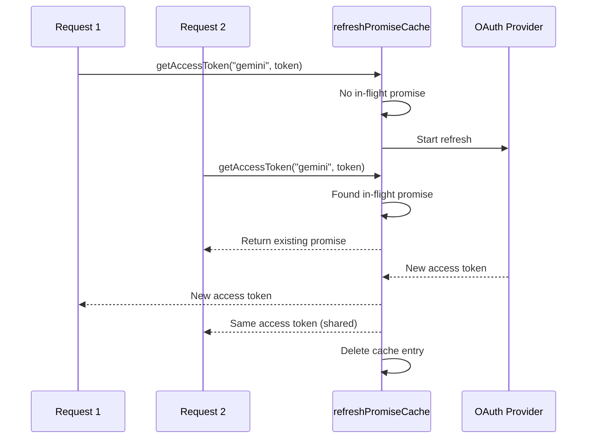

#### Mesin Status Penggantian Akun

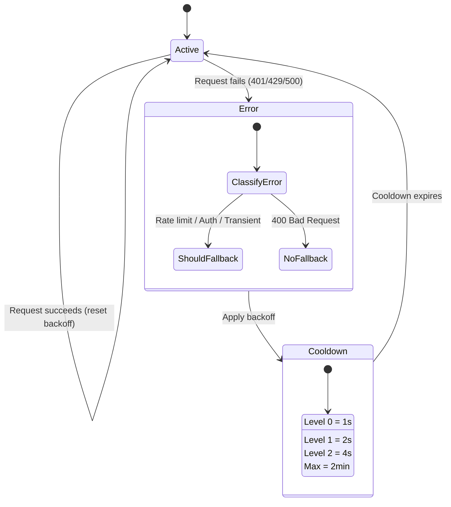

#### Rantai Model Kombo

```mermaid
flowchart LR
    A["Request with\ncombo model"] --> B["Model A"]
    B -->|"2xx Success"| C["Return response"]
    B -->|"429/401/500"| D{"Fallback\neligible?"}
    D -->|Yes| E["Model B"]
    D -->|No| F["Return error"]
    E -->|"2xx Success"| C
    E -->|"429/401/500"| G{"Fallback\neligible?"}
    G -->|Yes| H["Model C"]
    G -->|No| F
    H -->|"2xx Success"| C
    H -->|"Fail"| I["All failed →\nReturn last status"]
```

---

### 4.5 Penerjemah (`open-sse/translator/`)

**mesin terjemahan format** menggunakan sistem plugin pendaftaran mandiri.

#### Arsitektur

```mermaid
graph TD
    subgraph "Request Translation"
        A["Claude → OpenAI"]
        B["Gemini → OpenAI"]
        C["Antigravity → OpenAI"]
        D["OpenAI Responses → OpenAI"]
        E["OpenAI → Claude"]
        F["OpenAI → Gemini"]
        G["OpenAI → Kiro"]
        H["OpenAI → Cursor"]
    end

    subgraph "Response Translation"
        I["Claude → OpenAI"]
        J["Gemini → OpenAI"]
        K["Kiro → OpenAI"]
        L["Cursor → OpenAI"]
        M["OpenAI → Claude"]
        N["OpenAI → Antigravity"]
        O["OpenAI → Responses"]
    end
```

| Direktori    | File         | Deskripsi                                                                                                                                                                                                                                                          |
| ------------ | ------------ | ------------------------------------------------------------------------------------------------------------------------------------------------------------------------------------------------------------------------------------------------------------------ |
| `request/`   | 8 penerjemah | Konversi badan permintaan antar format. Setiap file didaftarkan sendiri melalui `register(from, to, fn)` saat diimpor.                                                                                                                                             |
| `response/`  | 7 penerjemah | Konversikan potongan respons streaming antar format. Menangani jenis acara SSE, blok pemikiran, panggilan alat.                                                                                                                                                    |
| `helpers/`   | 6 pembantu   | Utilitas bersama: `claudeHelper` (ekstraksi prompt sistem, konfigurasi pemikiran), `geminiHelper` (pemetaan bagian/konten), `openaiHelper` (pemfilteran format), `toolCallHelper` (pembuatan ID, injeksi respons hilang), `maxTokensHelper`, `responsesApiHelper`. |
| `index.ts`   | —            | Mesin penerjemah: `translateRequest()`, `translateResponse()`, manajemen negara, registri.                                                                                                                                                                         |
| `formats.ts` | —            | Konstanta format: `OPENAI`, `CLAUDE`, `GEMINI`, `ANTIGRAVITY`, `KIRO`, `CURSOR`, `OPENAI_RESPONSES`.                                                                                                                                                               |

#### Desain Kunci: Plugin Pendaftaran Mandiri

```javascript
// Each translator file calls register() on import:
import { register } from "../index.js";
register("claude", "openai", translateClaudeToOpenAI);

// The index.js imports all translator files, triggering registration:
import "./request/claude-to-openai.js"; // ← self-registers
```

---

### 4.6 Kegunaan (`open-sse/utils/`)

| Berkas             | Tujuan                                                                                                                                                                                                                                                                                                    |
| ------------------ | --------------------------------------------------------------------------------------------------------------------------------------------------------------------------------------------------------------------------------------------------------------------------------------------------------- |
| `error.ts`         | Pembuatan respons kesalahan (format yang kompatibel dengan OpenAI), penguraian kesalahan hulu, ekstraksi waktu percobaan ulang Antigravitasi dari pesan kesalahan, streaming kesalahan SSE.                                                                                                               |
| `stream.ts`        | **SSE Transform Stream** — saluran streaming inti. Dua mode: `TRANSLATE` (terjemahan format penuh) dan `PASSTHROUGH` (menormalkan + mengekstrak penggunaan). Menangani buffering potongan, estimasi penggunaan, pelacakan panjang konten. Instance encoder/decoder per-aliran menghindari status bersama. |
| `streamHelpers.ts` | Utilitas SSE tingkat rendah: `parseSSELine` (toleran spasi), `hasValuableContent` (memfilter potongan kosong untuk OpenAI/Claude/Gemini), `fixInvalidId`, `formatSSE` (serialisasi SSE yang mendukung format dengan pembersihan `perf_metrics`).                                                          |
| `usageTracking.ts` | Ekstraksi penggunaan token dari format apa pun (Claude/OpenAI/Gemini/Responses), estimasi dengan rasio karakter per token alat/pesan terpisah, penambahan buffer (margin keamanan token 2000), pemfilteran bidang khusus format, logging konsol dengan warna ANSI.                                        |
| `requestLogger.ts` | Pencatatan permintaan berbasis file (ikut serta melalui `ENABLE_REQUEST_LOGS=true`). Membuat folder sesi dengan file bernomor: `1_req_client.json` → `7_res_client.txt`. Semua I/O bersifat asinkron (api-dan-lupakan). Menutupi header sensitif.                                                         |
| `bypassHandler.ts` | Mencegat pola tertentu dari Claude CLI (ekstraksi judul, pemanasan, penghitungan) dan mengembalikan respons palsu tanpa menghubungi penyedia mana pun. Mendukung streaming dan non-streaming. Sengaja dibatasi pada scope Claude CLI.                                                                     |
| `networkProxy.ts`  | Menyelesaikan URL proksi keluar untuk penyedia tertentu dengan prioritas: konfigurasi khusus penyedia → konfigurasi global → variabel lingkungan (`HTTPS_PROXY`/`HTTP_PROXY`/`ALL_PROXY`). Mendukung pengecualian `NO_PROXY`. Konfigurasi cache selama 30 detik.                                          |

#### Saluran Pipa Streaming SSE

```mermaid
flowchart TD
    A["Provider SSE stream"] --> B["TextDecoder\n(per-stream instance)"]
    B --> C["Buffer lines\n(split on newline)"]
    C --> D["parseSSELine()\n(trim whitespace, parse JSON)"]
    D --> E{"Mode?"}
    E -->|TRANSLATE| F["translateResponse()\ntarget → OpenAI → source"]
    E -->|PASSTHROUGH| G["fixInvalidId()\nnormalize chunk"]
    F --> H["hasValuableContent()\nfilter empty chunks"]
    G --> H
    H -->|"Has content"| I["extractUsage()\ntrack token counts"]
    H -->|"Empty"| J["Skip chunk"]
    I --> K["formatSSE()\nserialize + clean perf_metrics"]
    K --> L["TextEncoder\n(per-stream instance)"]
    L --> M["Enqueue to\nclient stream"]

    style A fill:#f9f,stroke:#333
    style M fill:#9f9,stroke:#333
```

#### Struktur Sesi Pencatat Permintaan

```
logs/
└── claude_gemini_claude-sonnet_20260208_143045/
    ├── 1_req_client.json      ← Raw client request
    ├── 2_req_source.json      ← After initial conversion
    ├── 3_req_openai.json      ← OpenAI intermediate format
    ├── 4_req_target.json      ← Final target format
    ├── 5_res_provider.txt     ← Provider SSE chunks (streaming)
    ├── 5_res_provider.json    ← Provider response (non-streaming)
    ├── 6_res_openai.txt       ← OpenAI intermediate chunks
    ├── 7_res_client.txt       ← Client-facing SSE chunks
    └── 6_error.json           ← Error details (if any)
```

---

### 4.7 Lapisan Aplikasi (`src/`)

| Direktori     | Tujuan                                                                               |
| ------------- | ------------------------------------------------------------------------------------ |
| `src/app/`    | UI web, rute API, middleware Express, penangan panggilan balik OAuth                 |
| `src/lib/`    | Akses basis data (`localDb.ts`, `usageDb.ts`), autentikasi, dibagikan                |
| `src/mitm/`   | Utilitas proxy man-in-the-middle untuk mencegat lalu lintas penyedia                 |
| `src/models/` | Definisi model basis data                                                            |
| `src/shared/` | Pembungkus di sekitar fungsi open-sse (penyedia, aliran, kesalahan, dll.)            |
| `src/sse/`    | Penangan titik akhir SSE yang menghubungkan perpustakaan sse terbuka ke rute Ekspres |
| `src/store/`  | Manajemen status aplikasi                                                            |

#### Rute API Penting

| Rute                                          | Metode                  | Tujuan                                                                                                |
| --------------------------------------------- | ----------------------- | ----------------------------------------------------------------------------------------------------- |
| `/api/provider-models`                        | DAPATKAN/POSTING/HAPUS  | CRUD untuk model khusus per penyedia                                                                  |
| `/api/models/catalog`                         | DAPATKAN                | Katalog gabungan semua model (obrolan, penyematan, gambar, khusus) dikelompokkan berdasarkan penyedia |
| `/api/settings/proxy`                         | DAPATKAN/MASUKKAN/HAPUS | Konfigurasi proksi keluar hierarki (`global/providers/combos/keys`)                                   |
| `/api/settings/proxy/test`                    | POSTING                 | Memvalidasi konektivitas proxy dan mengembalikan IP/latensi publik                                    |
| `/v1/providers/[provider]/chat/completions`   | POSTING                 | Penyelesaian obrolan khusus per penyedia dengan validasi model                                        |
| `/v1/providers/[provider]/embeddings`         | POSTING                 | Penyematan khusus per penyedia dengan validasi model                                                  |
| `/v1/providers/[provider]/images/generations` | POSTING                 | Pembuatan gambar khusus per penyedia dengan validasi model                                            |
| `/api/settings/ip-filter`                     | DAPATKAN/MASUKKAN       | Manajemen daftar IP yang diizinkan/daftar blokir                                                      |
| `/api/settings/thinking-budget`               | DAPATKAN/MASUKKAN       | Penalaran konfigurasi anggaran token (passthrough/auto/custom/adaptive)                               |
| `/api/settings/system-prompt`                 | DAPATKAN/MASUKKAN       | Injeksi prompt sistem global untuk semua permintaan                                                   |
| `/api/sessions`                               | DAPATKAN                | Pelacakan dan metrik sesi aktif                                                                       |
| `/api/rate-limits`                            | DAPATKAN                | Status batas tarif per akun                                                                           |

---

## 5. Pola Desain Utama

### 5.1 Terjemahan Hub-and-Spoke

Semua format diterjemahkan melalui **format OpenAI sebagai hub**. Menambahkan penyedia baru hanya memerlukan penulisan **satu pasang** penerjemah (ke/dari OpenAI), bukan N pasang.

### 5.2 Pola Strategi Pelaksana

Setiap penyedia memiliki kelas eksekutor khusus yang diwarisi dari `BaseExecutor`. Pabrik di `executors/index.ts` memilih yang tepat saat runtime.

### 5.3 Sistem Plugin Pendaftaran Mandiri

Modul penerjemah mendaftarkan dirinya saat diimpor melalui `register()`. Menambahkan penerjemah baru hanyalah membuat file dan mengimpornya.

### 5.4 Penggantian Akun dengan Backoff Eksponensial

Ketika penyedia mengembalikan 429/401/500, sistem dapat beralih ke akun berikutnya, menerapkan cooldown eksponensial (1 dtk → 2 dtk → 4 dtk → maksimal 2 menit).

### 5.5 Rantai Model Kombo

Sebuah "kombo" mengelompokkan beberapa string `provider/model`. Jika yang pertama gagal, kembali ke yang berikutnya secara otomatis.

### 5.6 Terjemahan Streaming Stateful

Terjemahan respons mempertahankan status di seluruh potongan SSE (pelacakan blok pemikiran, akumulasi panggilan alat, pengindeksan blok konten) melalui mekanisme `initState()`.

### 5.7 Buffer Keamanan Penggunaan

Buffer 2000 token ditambahkan ke penggunaan yang dilaporkan untuk mencegah klien mencapai batas jendela konteks karena overhead dari perintah sistem dan terjemahan format.

---

## 6. Format yang Didukung

| Format                      | Arah             | Pengenal           |
| --------------------------- | ---------------- | ------------------ |
| Penyelesaian Obrolan OpenAI | sumber + sasaran | `openai`           |
| API Respons OpenAI          | sumber + sasaran | `openai-responses` |
| Claude Antropik             | sumber + sasaran | `claude`           |
| Google Gemini               | sumber + sasaran | `gemini`           |
| CLI Google Gemini           | hanya sasaran    | `gemini-cli`       |
| Antigravitasi               | sumber + sasaran | `antigravity`      |
| AWSKiro                     | hanya sasaran    | `kiro`             |
| Kursor                      | hanya sasaran    | `cursor`           |

---

## 7. Penyedia yang Didukung

| Penyedia                 | Metode Otentikasi        | Pelaksana     | Catatan Penting                                            |
| ------------------------ | ------------------------ | ------------- | ---------------------------------------------------------- |
| Claude Antropik          | Kunci API atau OAuth     | Bawaan        | Menggunakan tajuk `x-api-key`                              |
| Google Gemini            | Kunci API atau OAuth     | Bawaan        | Menggunakan tajuk `x-goog-api-key`                         |
| CLI Google Gemini        | OAuth                    | Gemini CLI    | Menggunakan titik akhir `streamGenerateContent`            |
| Antigravitasi            | OAuth                    | Antigravitasi | Penggantian multi-URL, penguraian coba ulang khusus        |
| OpenAI                   | Kunci API                | Bawaan        | Autentikasi Pembawa Standar                                |
| Kodeks                   | OAuth                    | Kodeks        | Menyuntikkan instruksi sistem, mengelola pemikiran         |
| Kopilot GitHub           | OAuth + Token Kopilot    | Github        | Token ganda, header VSCode meniru                          |
| Kiro (AWS)               | AWS SSO OIDC atau Sosial | Kiro          | Penguraian Biner EventStream                               |
| IDE Kursor               | Otentikasi checksum      | Kursor        | Pengkodean protobuf, checksum SHA-256                      |
| Qwen                     | OAuth                    | Bawaan        | Otentikasi standar                                         |
| iFlow                    | OAuth (Dasar + Pembawa)  | Bawaan        | Header autentikasi ganda                                   |
| BukaRouter               | Kunci API                | Bawaan        | Autentikasi Pembawa Standar                                |
| GLM, Kimi, MiniMax       | Kunci API                | Bawaan        | Kompatibel dengan Claude, gunakan `x-api-key`              |
| `openai-compatible-*`    | Kunci API                | Bawaan        | Dinamis: semua titik akhir yang kompatibel dengan OpenAI   |
| `anthropic-compatible-*` | Kunci API                | Bawaan        | Dinamis: titik akhir apa pun yang kompatibel dengan Claude |

---

## 8. Ringkasan Aliran Data

### Permintaan Streaming

```mermaid
flowchart LR
    A["Client"] --> B["detectFormat()"]
    B --> C["translateRequest()\nsource → OpenAI → target"]
    C --> D["Executor\nbuildUrl + buildHeaders"]
    D --> E["fetch(providerURL)"]
    E --> F["createSSEStream()\nTRANSLATE mode"]
    F --> G["parseSSELine()"]
    G --> H["translateResponse()\ntarget → OpenAI → source"]
    H --> I["extractUsage()\n+ addBuffer"]
    I --> J["formatSSE()"]
    J --> K["Client receives\ntranslated SSE"]
    K --> L["logUsage()\nsaveRequestUsage()"]
```

### Permintaan Non-Streaming

```mermaid
flowchart LR
    A["Client"] --> B["detectFormat()"]
    B --> C["translateRequest()\nsource → OpenAI → target"]
    C --> D["Executor.execute()"]
    D --> E["translateResponse()\ntarget → OpenAI → source"]
    E --> F["Return JSON\nresponse"]
```

### Aliran Bypass (Claude CLI)

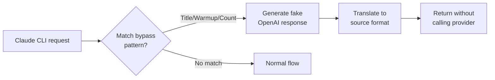
