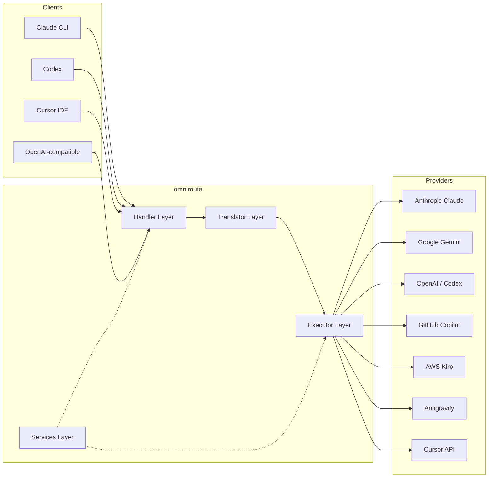
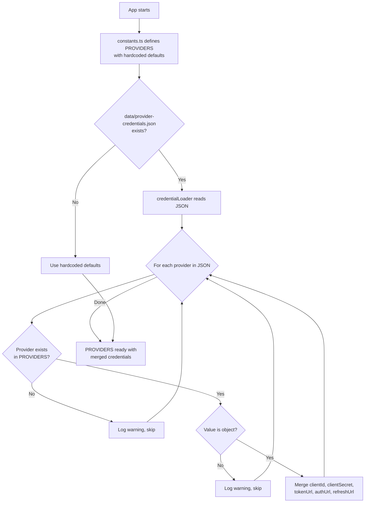
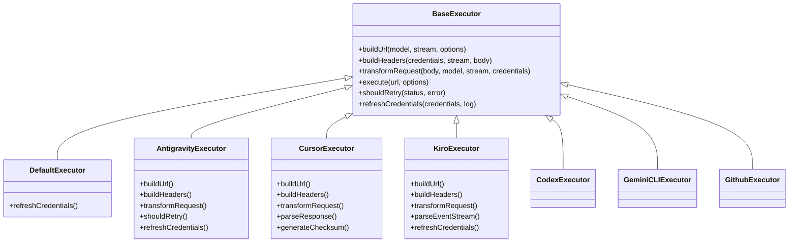
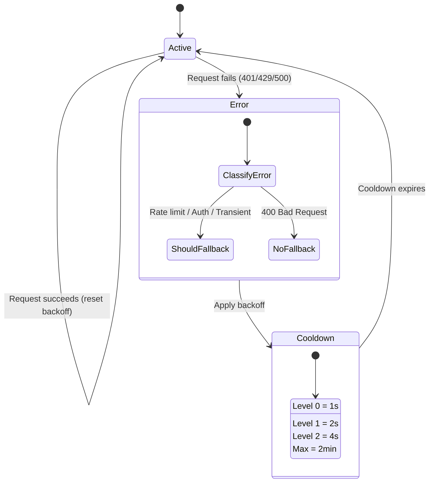
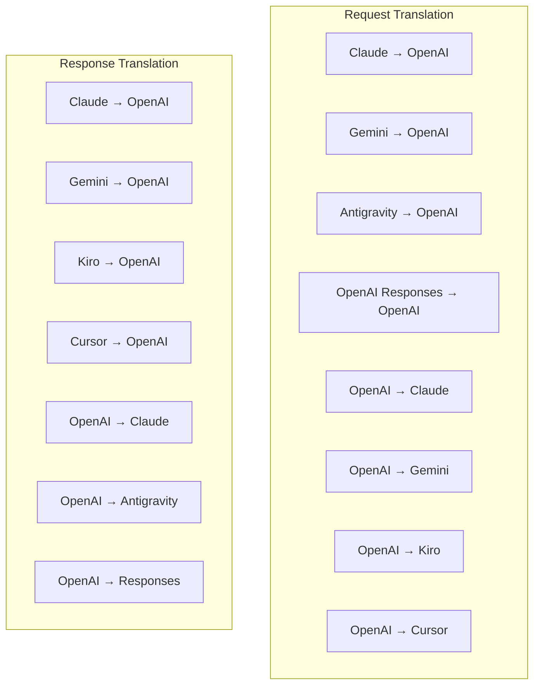

# omniroute - कोडबेस दस्तावेज़ीकरण

🌐 **Languages:** 🇺🇸 [English](../../CODEBASE_DOCUMENTATION.md) | 🇧🇷 [Português (Brasil)](../pt-BR/CODEBASE_DOCUMENTATION.md) | 🇪🇸 [Español](../es/CODEBASE_DOCUMENTATION.md) | 🇫🇷 [Français](../fr/CODEBASE_DOCUMENTATION.md) | 🇮🇹 [Italiano](../it/CODEBASE_DOCUMENTATION.md) | 🇷🇺 [Русский](../ru/CODEBASE_DOCUMENTATION.md) | 🇨🇳 [中文 (简体)](../zh-CN/CODEBASE_DOCUMENTATION.md) | 🇩🇪 [Deutsch](../de/CODEBASE_DOCUMENTATION.md) | 🇮🇳 [हिन्दी](../in/CODEBASE_DOCUMENTATION.md) | 🇹🇭 [ไทย](../th/CODEBASE_DOCUMENTATION.md) | 🇺🇦 [Українська](../uk-UA/CODEBASE_DOCUMENTATION.md) | 🇸🇦 [العربية](../ar/CODEBASE_DOCUMENTATION.md) | 🇯🇵 [日本語](../ja/CODEBASE_DOCUMENTATION.md) | 🇻🇳 [Tiếng Việt](../vi/CODEBASE_DOCUMENTATION.md) | 🇧🇬 [Български](../bg/CODEBASE_DOCUMENTATION.md) | 🇩🇰 [Dansk](../da/CODEBASE_DOCUMENTATION.md) | 🇫🇮 [Suomi](../fi/CODEBASE_DOCUMENTATION.md) | 🇮🇱 [עברית](../he/CODEBASE_DOCUMENTATION.md) | 🇭🇺 [Magyar](../hu/CODEBASE_DOCUMENTATION.md) | 🇮🇩 [Bahasa Indonesia](../id/CODEBASE_DOCUMENTATION.md) | 🇰🇷 [한국어](../ko/CODEBASE_DOCUMENTATION.md) | 🇲🇾 [Bahasa Melayu](../ms/CODEBASE_DOCUMENTATION.md) | 🇳🇱 [Nederlands](../nl/CODEBASE_DOCUMENTATION.md) | 🇳🇴 [Norsk](../no/CODEBASE_DOCUMENTATION.md) | 🇵🇹 [Português (Portugal)](../pt/CODEBASE_DOCUMENTATION.md) | 🇷🇴 [Română](../ro/CODEBASE_DOCUMENTATION.md) | 🇵🇱 [Polski](../pl/CODEBASE_DOCUMENTATION.md) | 🇸🇰 [Slovenčina](../sk/CODEBASE_DOCUMENTATION.md) | 🇸🇪 [Svenska](../sv/CODEBASE_DOCUMENTATION.md) | 🇵🇭 [Filipino](../phi/CODEBASE_DOCUMENTATION.md)

> **ओम्नीरूटे** मल्टी-प्रोवाइडर एआई प्रॉक्सी राउटर के लिए एक व्यापक, शुरुआती-अनुकूल मार्गदर्शिका।

---

## 1. सर्वव्यापी क्या है?

ऑम्नीरूट एक **प्रॉक्सी राउटर** है जो एआई क्लाइंट (क्लाउड सीएलआई, कोडेक्स, कर्सर आईडीई, आदि) और एआई प्रदाताओं (एंथ्रोपिक, गूगल, ओपनएआई, एडब्ल्यूएस, गिटहब, आदि) के बीच बैठता है। यह एक बड़ी समस्या का समाधान करता है:

> **अलग-अलग एआई क्लाइंट अलग-अलग "भाषाएं" (एपीआई प्रारूप) बोलते हैं, और अलग-अलग एआई प्रदाता भी अलग-अलग "भाषाओं" की अपेक्षा करते हैं।** ऑम्नीरूट स्वचालित रूप से उनके बीच अनुवाद करता है।

इसे संयुक्त राष्ट्र में एक सार्वभौमिक अनुवादक की तरह समझें - कोई भी प्रतिनिधि कोई भी भाषा बोल सकता है, और अनुवादक इसे किसी अन्य प्रतिनिधि के लिए परिवर्तित कर देता है।

---

## 2. वास्तुकला अवलोकन



### मुख्य सिद्धांत: हब-एंड-स्पोक अनुवाद

सभी प्रारूप अनुवाद **हब के रूप में ओपनएआई प्रारूप** से होकर गुजरता है:

**OMNI_टोकन_1**

इसका मतलब है कि आपको **N²** (प्रत्येक जोड़ी) के बजाय केवल **N अनुवादकों** (प्रति प्रारूप एक) की आवश्यकता है।

---

## 3. परियोजना संरचना

```
omniroute/
├── open-sse/                  ← Core proxy library (portable, framework-agnostic)
│   ├── index.js               ← Main entry point, exports everything
│   ├── config/                ← Configuration & constants
│   ├── executors/             ← Provider-specific request execution
│   ├── handlers/              ← Request handling orchestration
│   ├── services/              ← Business logic (auth, models, fallback, usage)
│   ├── translator/            ← Format translation engine
│   │   ├── request/           ← Request translators (8 files)
│   │   ├── response/          ← Response translators (7 files)
│   │   └── helpers/           ← Shared translation utilities (6 files)
│   └── utils/                 ← Utility functions
├── src/                       ← Application layer (Express/Worker runtime)
│   ├── app/                   ← Web UI, API routes, middleware
│   ├── lib/                   ← Database, auth, and shared library code
│   ├── mitm/                  ← Man-in-the-middle proxy utilities
│   ├── models/                ← Database models
│   ├── shared/                ← Shared utilities (wrappers around open-sse)
│   ├── sse/                   ← SSE endpoint handlers
│   └── store/                 ← State management
├── data/                      ← Runtime data (credentials, logs)
│   └── provider-credentials.json   (external credentials override, gitignored)
└── tester/                    ← Test utilities
```

---

## 4. मॉड्यूल-दर-मॉड्यूल ब्रेकडाउन

### 4.1 कॉन्फ़िगरेशन (`open-sse/config/`)

सभी प्रदाता कॉन्फ़िगरेशन के लिए **सत्य का एकल स्रोत**।

| फ़ाइल                         | उद्देश्य                                                                                                                                                                                                                               |
| ----------------------------- | -------------------------------------------------------------------------------------------------------------------------------------------------------------------------------------------------------------------------------------- |
| `constants.ts`                | `PROVIDERS` प्रत्येक प्रदाता के लिए आधार URL, OAuth क्रेडेंशियल (डिफ़ॉल्ट), हेडर और डिफ़ॉल्ट सिस्टम संकेतों के साथ ऑब्जेक्ट। `HTTP_STATUS`, `ERROR_TYPES`, `COOLDOWN_MS`, `BACKOFF_CONFIG`, और `SKIP_PATTERNS` को भी परिभाषित करता है। |
| `credentialLoader.ts`         | `data/provider-credentials.json` से बाहरी क्रेडेंशियल लोड करता है और उन्हें `PROVIDERS` में हार्डकोडेड डिफ़ॉल्ट पर मर्ज करता है। पश्चगामी संगतता बनाए रखते हुए रहस्यों को स्रोत नियंत्रण से बाहर रखता है।                              |
| `providerModels.ts`           | केंद्रीय मॉडल रजिस्ट्री: मानचित्र प्रदाता उपनाम → मॉडल आईडी। `getModels()`, `getProviderByAlias()` जैसे कार्य।                                                                                                                         |
| `codexInstructions.ts`        | सिस्टम निर्देश कोडेक्स अनुरोधों (संपादन बाधाएं, सैंडबॉक्स नियम, अनुमोदन नीतियां) में शामिल किए गए हैं।                                                                                                                                 |
| `defaultThinkingSignature.ts` | क्लाउड और जेमिनी मॉडल के लिए डिफ़ॉल्ट "सोच" हस्ताक्षर।                                                                                                                                                                                 |
| `ollamaModels.ts`             | स्थानीय ओलामा मॉडल के लिए स्कीमा परिभाषा (नाम, आकार, परिवार, परिमाणीकरण)।                                                                                                                                                              |

#### क्रेडेंशियल लोडिंग फ़्लो



---

### 4.2 निष्पादक (`open-sse/executors/`)

निष्पादक **रणनीति पैटर्न** का उपयोग करके **प्रदाता-विशिष्ट तर्क** को समाहित करते हैं। प्रत्येक निष्पादक आवश्यकतानुसार आधार विधियों को ओवरराइड करता है।



| निष्पादक         | प्रदाता                                         | प्रमुख विशेषज्ञताएं                                                                                                          |
| ---------------- | ----------------------------------------------- | ---------------------------------------------------------------------------------------------------------------------------- |
| `base.ts`        | —                                               | सार आधार: यूआरएल निर्माण, हेडर, पुनः प्रयास तर्क, क्रेडेंशियल ताज़ा                                                          |
| `default.ts`     | क्लाउड, जेमिनी, ओपनएआई, जीएलएम, किमी, मिनीमैक्स | मानक प्रदाताओं के लिए जेनेरिक OAuth टोकन ताज़ा करें                                                                          |
| `antigravity.ts` | गूगल क्लाउड कोड                                 | प्रोजेक्ट/सत्र आईडी जनरेशन, मल्टी-यूआरएल फ़ॉलबैक, त्रुटि संदेशों से कस्टम पुनः प्रयास पार्सिंग ("2h7m23s के बाद रीसेट करें") |
| `cursor.ts`      | कर्सर आईडीई                                     | **सबसे जटिल**: SHA-256 चेकसम ऑथ, प्रोटोबफ अनुरोध एन्कोडिंग, बाइनरी इवेंटस्ट्रीम → SSE प्रतिक्रिया पार्सिंग                   |
| `codex.ts`       | ओपनएआई कोडेक्स                                  | सिस्टम निर्देशों को इंजेक्ट करता है, सोच के स्तर को प्रबंधित करता है, असमर्थित मापदंडों को हटाता है                          |
| `gemini-cli.ts`  | गूगल जेमिनी सीएलआई                              | कस्टम यूआरएल बिल्डिंग (`streamGenerateContent`), Google OAuth टोकन रिफ्रेश                                                   |
| `github.ts`      | गिटहब कोपायलट                                   | दोहरी टोकन प्रणाली (GitHub OAuth + Copilot टोकन), VSCode हेडर की नकल                                                         |
| `kiro.ts`        | एडब्ल्यूएस कोडव्हिस्परर                         | एडब्ल्यूएस इवेंटस्ट्रीम बाइनरी पार्सिंग, एएमजेडएन इवेंट फ्रेम, टोकन अनुमान                                                   |
| `index.ts`       | —                                               | फ़ैक्टरी: मानचित्र प्रदाता का नाम → निष्पादक वर्ग, डिफ़ॉल्ट फ़ॉलबैक के साथ                                                   |

---

### 4.3 हैंडलर (`open-sse/handlers/`)

**ऑर्केस्ट्रेशन परत** - अनुवाद, निष्पादन, स्ट्रीमिंग और त्रुटि प्रबंधन का समन्वय करती है।

| फ़ाइल                 | उद्देश्य                                                                                                                                                                                                                       |
| --------------------- | ------------------------------------------------------------------------------------------------------------------------------------------------------------------------------------------------------------------------------ |
| `chatCore.ts`         | **केंद्रीय ऑर्केस्ट्रेटर** (~600 पंक्तियाँ)। संपूर्ण अनुरोध जीवनचक्र को संभालता है: प्रारूप का पता लगाना → अनुवाद → निष्पादक प्रेषण → स्ट्रीमिंग/गैर-स्ट्रीमिंग प्रतिक्रिया → टोकन ताज़ा करना → त्रुटि प्रबंधन → उपयोग लॉगिंग। |
| `responsesHandler.ts` | OpenAI के रिस्पॉन्स एपीआई के लिए एडाप्टर: रिस्पॉन्स फॉर्मेट को कनवर्ट करता है → चैट कंप्लीटेशन → `chatCore` को भेजता है → SSE को रिस्पॉन्स फॉर्मेट में वापस कनवर्ट करता है।                                                    |
| `embeddings.ts`       | एंबेडिंग जेनरेशन हैंडलर: एंबेडिंग मॉडल → प्रदाता को हल करता है, प्रदाता एपीआई को भेजता है, ओपनएआई-संगत एंबेडिंग प्रतिक्रिया देता है। 6+ प्रदाताओं का समर्थन करता है।                                                           |
| `imageGeneration.ts`  | छवि निर्माण हैंडलर: छवि मॉडल → प्रदाता को हल करता है, ओपनएआई-संगत, जेमिनी-छवि (एंटीग्रेविटी), और फ़ॉलबैक (नेबियस) मोड का समर्थन करता है। बेस64 या यूआरएल छवियाँ लौटाता है।                                                     |

#### अनुरोध जीवनचक्र (chatCore.ts)

**OMNI_टोकन_5**

---

### 4.4 सेवाएँ (`open-sse/services/`)

व्यावसायिक तर्क जो संचालकों और निष्पादकों का समर्थन करता है।

| फ़ाइल                | उद्देश्य                                                                                                                                                                                                                                                                                                                                                                   |
| -------------------- | -------------------------------------------------------------------------------------------------------------------------------------------------------------------------------------------------------------------------------------------------------------------------------------------------------------------------------------------------------------------------- |
| `provider.ts`        | **प्रारूप का पता लगाना** (`detectFormat`): क्लॉड/ओपनएआई/जेमिनी/एंटीग्रेविटी/प्रतिक्रिया प्रारूपों की पहचान करने के लिए अनुरोध बॉडी संरचना का विश्लेषण करता है (क्लाउड के लिए `max_tokens` अनुमान शामिल है)। इसके अलावा: यूआरएल बिल्डिंग, हेडर बिल्डिंग, थिंकिंग कॉन्फिग सामान्यीकरण। `openai-compatible-*` और `anthropic-compatible-*` गतिशील प्रदाताओं का समर्थन करता है। |
| `model.ts`           | मॉडल स्ट्रिंग पार्सिंग (`claude/model-name` → `{provider: "claude", model: "model-name"}`), टकराव का पता लगाने के साथ उपनाम रिज़ॉल्यूशन, इनपुट सैनिटाइजेशन (पथ ट्रैवर्सल/नियंत्रण वर्ण को अस्वीकार करता है), और एसिंक उपनाम गेटर समर्थन के साथ मॉडल जानकारी रिज़ॉल्यूशन।                                                                                                   |
| `accountFallback.ts` | दर-सीमा प्रबंधन: घातीय बैकऑफ़ (1s → 2s → 4s → अधिकतम 2 मिनट), खाता कूल्डाउन प्रबंधन, त्रुटि वर्गीकरण (कौन सी त्रुटियाँ फ़ॉलबैक को ट्रिगर करती हैं बनाम नहीं)।                                                                                                                                                                                                              |
| `tokenRefresh.ts`    | **प्रत्येक प्रदाता** के लिए OAuth टोकन ताज़ा करें: Google (मिथुन, एंटीग्रेविटी), क्लाउड, कोडेक्स, क्वेन, iFlow, GitHub (OAuth + Copilot डुअल-टोकन), किरो (AWS SSO OIDC + सोशल ऑथ)। इसमें इन-फ़्लाइट प्रॉमिस डिडुप्लीकेशन कैश और एक्सपोनेंशियल बैकऑफ़ के साथ पुनः प्रयास शामिल है।                                                                                          |
| `combo.ts`           | **कॉम्बो मॉडल**: फ़ॉलबैक मॉडल की श्रृंखलाएँ। यदि मॉडल ए फ़ॉलबैक-योग्य त्रुटि के साथ विफल हो जाता है, तो मॉडल बी, फिर सी, आदि का प्रयास करें। वास्तविक अपस्ट्रीम स्थिति कोड लौटाता है।                                                                                                                                                                                      |
| `usage.ts`           | प्रदाता एपीआई (गिटहब कोपायलट कोटा, एंटीग्रेविटी मॉडल कोटा, कोडेक्स दर सीमा, किरो उपयोग ब्रेकडाउन, क्लाउड सेटिंग्स) से कोटा/उपयोग डेटा प्राप्त करता है।                                                                                                                                                                                                                     |
| `accountSelector.ts` | स्कोरिंग एल्गोरिदम के साथ स्मार्ट खाता चयन: प्रत्येक अनुरोध के लिए इष्टतम खाता चुनने के लिए प्राथमिकता, स्वास्थ्य स्थिति, राउंड-रॉबिन स्थिति और कूलडाउन स्थिति पर विचार करता है।                                                                                                                                                                                           |
| `contextManager.ts`  | अनुरोध संदर्भ जीवनचक्र प्रबंधन: डिबगिंग और लॉगिंग के लिए मेटाडेटा (अनुरोध आईडी, टाइमस्टैम्प, प्रदाता जानकारी) के साथ प्रति-अनुरोध संदर्भ ऑब्जेक्ट बनाता है और ट्रैक करता है।                                                                                                                                                                                               |
| `ipFilter.ts`        | आईपी-आधारित अभिगम नियंत्रण: अनुमति सूची और ब्लॉकलिस्ट मोड का समर्थन करता है। एपीआई अनुरोधों को संसाधित करने से पहले कॉन्फ़िगर किए गए नियमों के विरुद्ध क्लाइंट आईपी को सत्यापित करता है।                                                                                                                                                                                   |
| `sessionManager.ts`  | क्लाइंट फ़िंगरप्रिंटिंग के साथ सत्र ट्रैकिंग: हैश किए गए क्लाइंट पहचानकर्ताओं का उपयोग करके सक्रिय सत्रों को ट्रैक करता है, अनुरोधों की संख्या पर नज़र रखता है, और सत्र मेट्रिक्स प्रदान करता है।                                                                                                                                                                          |
| `signatureCache.ts`  | अनुरोध हस्ताक्षर-आधारित डिडुप्लीकेशन कैश: हाल के अनुरोध हस्ताक्षरों को कैश करके और एक समय विंडो के भीतर समान अनुरोधों के लिए कैश्ड प्रतिक्रियाओं को लौटाकर डुप्लिकेट अनुरोधों को रोकता है।                                                                                                                                                                                 |
| `systemPrompt.ts`    | वैश्विक सिस्टम प्रॉम्प्ट इंजेक्शन: प्रति-प्रदाता संगतता प्रबंधन के साथ, सभी अनुरोधों के लिए एक कॉन्फ़िगर करने योग्य सिस्टम प्रॉम्प्ट को जोड़ता या जोड़ता है।                                                                                                                                                                                                               |
| `thinkingBudget.ts`  | रीज़निंग टोकन बजट प्रबंधन: सोच/तर्क टोकन को नियंत्रित करने के लिए पासथ्रू, ऑटो (स्ट्रिप थिंकिंग कॉन्फ़िगरेशन), कस्टम (निश्चित बजट), और अनुकूली (जटिलता-स्केल) मोड का समर्थन करता है।                                                                                                                                                                                       |
| `wildcardRouter.ts`  | वाइल्डकार्ड मॉडल पैटर्न रूटिंग: उपलब्धता और प्राथमिकता के आधार पर वाइल्डकार्ड पैटर्न (उदाहरण के लिए, `*/claude-*`) को ठोस प्रदाता/मॉडल जोड़े में हल करता है।                                                                                                                                                                                                               |

#### टोकन रिफ्रेश डिडुप्लीकेशन

**OMNI_टोकन_6**

#### खाता फ़ॉलबैक स्टेट मशीन



#### कॉम्बो मॉडल श्रृंखला

**OMNI_टोकन_8**

---

### 4.5 अनुवादक (`open-sse/translator/`)

स्व-पंजीकरण प्लगइन सिस्टम का उपयोग करके **प्रारूप अनुवाद इंजन**।

#### वास्तुकला



| निर्देशिका       | फ़ाइलें   | विवरण                                                                                                                                                                                                                                                             |
| ---------------- | --------- | ----------------------------------------------------------------------------------------------------------------------------------------------------------------------------------------------------------------------------------------------------------------- |
| `request/`       | 8 अनुवादक | प्रारूपों के बीच अनुरोध निकायों को परिवर्तित करें। प्रत्येक फ़ाइल आयात पर `register(from, to, fn)` के माध्यम से स्व-पंजीकृत होती है।                                                                                                                              |
| `response/`      | 7 अनुवादक | प्रारूपों के बीच स्ट्रीमिंग प्रतिक्रिया खंडों को परिवर्तित करें। एसएसई इवेंट प्रकार, थिंकिंग ब्लॉक, टूल कॉल को संभालता है।                                                                                                                                        |
| `helpers/`       | 6 सहायक   | साझा उपयोगिताएँ: `claudeHelper` (सिस्टम प्रॉम्प्ट निष्कर्षण, सोच कॉन्फ़िगरेशन), `geminiHelper` (भाग/सामग्री मैपिंग), `openaiHelper` (प्रारूप फ़िल्टरिंग), `toolCallHelper` (आईडी जनरेशन, अनुपलब्ध प्रतिक्रिया इंजेक्शन), `maxTokensHelper`, `responsesApiHelper`। |
| `index.ts`       | —         | अनुवाद इंजन: `translateRequest()`, `translateResponse()`, राज्य प्रबंधन, रजिस्ट्री।                                                                                                                                                                               |
| **OMNI_टोकन_86** | —         | प्रारूप स्थिरांक: `OPENAI`, `CLAUDE`, `GEMINI`, `ANTIGRAVITY`, `KIRO`, `CURSOR`, `OPENAI_RESPONSES`।                                                                                                                                                              |

#### मुख्य डिज़ाइन: स्व-पंजीकरण प्लगइन्स

```javascript
// Each translator file calls register() on import:
import { register } from "../index.js";
register("claude", "openai", translateClaudeToOpenAI);

// The index.js imports all translator files, triggering registration:
import "./request/claude-to-openai.js"; // ← self-registers
```

---

### 4.6 उपयोगिताएँ (`open-sse/utils/`)

| फ़ाइल              | उद्देश्य                                                                                                                                                                                                                                                                         |
| ------------------ | -------------------------------------------------------------------------------------------------------------------------------------------------------------------------------------------------------------------------------------------------------------------------------- |
| `error.ts`         | त्रुटि प्रतिक्रिया निर्माण (ओपनएआई-संगत प्रारूप), अपस्ट्रीम त्रुटि पार्सिंग, त्रुटि संदेशों से एंटीग्रेविटी रिट्री-टाइम निष्कर्षण, एसएसई त्रुटि स्ट्रीमिंग।                                                                                                                      |
| `stream.ts`        | **एसएसई ट्रांसफॉर्म स्ट्रीम** - कोर स्ट्रीमिंग पाइपलाइन। दो मोड: `TRANSLATE` (पूर्ण प्रारूप अनुवाद) और `PASSTHROUGH` (सामान्यीकरण + उपयोग निकालें)। चंक बफ़रिंग, उपयोग अनुमान, सामग्री लंबाई ट्रैकिंग को संभालता है। प्रति-स्ट्रीम एनकोडर/डिकोडर उदाहरण साझा स्थिति से बचते हैं। |
| `streamHelpers.ts` | निम्न-स्तरीय SSE उपयोगिताएँ: `parseSSELine` (व्हाट्सएप-सहिष्णु), `hasValuableContent` (OpenAI/क्लाउड/जेमिनी के लिए खाली हिस्सों को फ़िल्टर करता है), `fixInvalidId`, `formatSSE` (`perf_metrics` क्लीनअप के साथ प्रारूप-जागरूक SSE क्रमबद्धता)।                                  |
| `usageTracking.ts` | किसी भी प्रारूप से टोकन उपयोग निष्कर्षण (क्लाउड/ओपनएआई/मिथुन/प्रतिक्रियाएं), अलग टूल/संदेश चार-प्रति-टोकन अनुपात के साथ अनुमान, बफर जोड़ (2000 टोकन सुरक्षा मार्जिन), प्रारूप-विशिष्ट फ़ील्ड फ़िल्टरिंग, एएनएसआई रंगों के साथ कंसोल लॉगिंग।                                      |
| `requestLogger.ts` | फ़ाइल-आधारित अनुरोध लॉगिंग (`ENABLE_REQUEST_LOGS=true` के माध्यम से ऑप्ट-इन)। क्रमांकित फ़ाइलों के साथ सत्र फ़ोल्डर बनाता है: `1_req_client.json` → `7_res_client.txt`। सभी I/O async (दाग-और-भूल) है। संवेदनशील हेडर को छुपाता है.                                              |
| `bypassHandler.ts` | क्लाउड सीएलआई (शीर्षक निष्कर्षण, वार्मअप, गिनती) से विशिष्ट पैटर्न को रोकता है और किसी भी प्रदाता को कॉल किए बिना नकली प्रतिक्रियाएं लौटाता है। स्ट्रीमिंग और नॉन-स्ट्रीमिंग दोनों का समर्थन करता है। जानबूझकर क्लाउड सीएलआई दायरे तक सीमित।                                     |
| `networkProxy.ts`  | किसी दिए गए प्रदाता के लिए आउटबाउंड प्रॉक्सी URL को प्राथमिकता के साथ हल करता है: प्रदाता-विशिष्ट कॉन्फ़िगरेशन → वैश्विक कॉन्फ़िगरेशन → पर्यावरण चर (`HTTPS_PROXY`/`HTTP_PROXY`/`ALL_PROXY`)। `NO_PROXY` बहिष्करण का समर्थन करता है। 30 के दशक के लिए कैश कॉन्फिगरेशन।           |

#### एसएसई स्ट्रीमिंग पाइपलाइन

**OMNI_टोकन_11**

#### लॉगर सत्र संरचना का अनुरोध करें

**OMNI_टोकन_12**

---

### 4.7 अनुप्रयोग परत (`src/`)

| निर्देशिका    | उद्देश्य                                                                        |
| ------------- | ------------------------------------------------------------------------------- |
| `src/app/`    | वेब यूआई, एपीआई रूट, एक्सप्रेस मिडलवेयर, ओएथ कॉलबैक हैंडलर                      |
| `src/lib/`    | डेटाबेस एक्सेस (`localDb.ts`, `usageDb.ts`), प्रमाणीकरण, साझा                   |
| `src/mitm/`   | प्रदाता ट्रैफ़िक को रोकने के लिए मैन-इन-द-मिडिल प्रॉक्सी उपयोगिताएँ             |
| `src/models/` | डेटाबेस मॉडल परिभाषाएँ                                                          |
| `src/shared/` | ओपन-एसएसई फ़ंक्शंस (प्रदाता, स्ट्रीम, त्रुटि, आदि) के आसपास रैपर                |
| `src/sse/`    | एसएसई एंडपॉइंट हैंडलर जो ओपन-एसएसई लाइब्रेरी को एक्सप्रेस मार्गों से जोड़ते हैं |
| `src/store/`  | आवेदन राज्य प्रबंधन                                                             |

#### उल्लेखनीय एपीआई रूट

| मार्ग                                         | तरीके                         | उद्देश्य                                                                        |
| --------------------------------------------- | ----------------------------- | ------------------------------------------------------------------------------- |
| `/api/provider-models`                        | प्राप्त करें/पोस्ट करें/हटाएं | प्रति प्रदाता कस्टम मॉडल के लिए सीआरयूडी                                        |
| `/api/models/catalog`                         | प्राप्त करें                  | प्रदाता द्वारा समूहीकृत सभी मॉडलों (चैट, एम्बेडिंग, छवि, कस्टम) की एकत्रित सूची |
| `/api/settings/proxy`                         | प्राप्त/पुट/डिलीट             | पदानुक्रमित आउटबाउंड प्रॉक्सी कॉन्फ़िगरेशन (`global/providers/combos/keys`)     |
| `/api/settings/proxy/test`                    | पोस्ट                         | प्रॉक्सी कनेक्टिविटी को सत्यापित करता है और सार्वजनिक आईपी/विलंबता लौटाता है    |
| `/v1/providers/[provider]/chat/completions`   | पोस्ट                         | मॉडल सत्यापन के साथ प्रति-प्रदाता समर्पित चैट पूर्णताएँ                         |
| `/v1/providers/[provider]/embeddings`         | पोस्ट                         | मॉडल सत्यापन के साथ समर्पित प्रति-प्रदाता एम्बेडिंग                             |
| `/v1/providers/[provider]/images/generations` | पोस्ट                         | मॉडल सत्यापन के साथ प्रति-प्रदाता समर्पित छवि निर्माण                           |
| `/api/settings/ip-filter`                     | प्राप्त/डालें                 | आईपी ​​अनुमति सूची/अवरुद्ध सूची प्रबंधन                                         |
| `/api/settings/thinking-budget`               | प्राप्त/डालें                 | रीज़निंग टोकन बजट कॉन्फ़िगरेशन (पासथ्रू/ऑटो/कस्टम/अनुकूली)                      |
| `/api/settings/system-prompt`                 | प्राप्त/डालें                 | सभी अनुरोधों के लिए वैश्विक सिस्टम प्रॉम्प्ट इंजेक्शन                           |
| `/api/sessions`                               | प्राप्त करें                  | सक्रिय सत्र ट्रैकिंग और मेट्रिक्स                                               |
| `/api/rate-limits`                            | प्राप्त करें                  | प्रति खाता दर सीमा स्थिति                                                       |

---

## 5. मुख्य डिज़ाइन पैटर्न

### 5.1 हब-एंड-स्पोक अनुवाद

सभी प्रारूप **हब के रूप में ओपनएआई प्रारूप** के माध्यम से अनुवादित होते हैं। एक नया प्रदाता जोड़ने के लिए केवल अनुवादकों की **एक जोड़ी** (OpenAI से/से) लिखने की आवश्यकता होती है, N जोड़ी की नहीं।

### 5.2 निष्पादक रणनीति पैटर्न

प्रत्येक प्रदाता के पास `BaseExecutor` से विरासत में मिला एक समर्पित निष्पादक वर्ग होता है। `executors/index.ts` में फ़ैक्टरी रनटाइम पर सही का चयन करती है।

### 5.3 स्व-पंजीकरण प्लगइन सिस्टम

अनुवादक मॉड्यूल `register()` के माध्यम से आयात पर स्वयं को पंजीकृत करते हैं। एक नया अनुवादक जोड़ने का अर्थ केवल एक फ़ाइल बनाना और उसे आयात करना है।

### 5.4 एक्सपोनेंशियल बैकऑफ़ के साथ खाता फ़ॉलबैक

जब कोई प्रदाता 429/401/500 लौटाता है, तो सिस्टम घातीय कूलडाउन (1s → 2s → 4s → अधिकतम 2 मिनट) लागू करते हुए, अगले खाते पर स्विच कर सकता है।

### 5.5 कॉम्बो मॉडल चेन

एक "कॉम्बो" कई `provider/model` स्ट्रिंग्स को समूहित करता है। यदि पहला विफल हो जाता है, तो स्वचालित रूप से अगले पर फ़ॉलबैक हो जाता है।

### 5.6 स्टेटफुल स्ट्रीमिंग अनुवाद

प्रतिक्रिया अनुवाद `initState()` तंत्र के माध्यम से SSE खंडों (सोच ब्लॉक ट्रैकिंग, टूल कॉल संचय, सामग्री ब्लॉक अनुक्रमण) में स्थिति बनाए रखता है।

### 5.7 उपयोग सुरक्षा बफर

सिस्टम संकेतों और प्रारूप अनुवाद से ओवरहेड के कारण ग्राहकों को संदर्भ विंडो सीमा तक पहुंचने से रोकने के लिए रिपोर्ट किए गए उपयोग में 2000-टोकन बफर जोड़ा गया है।

---

## 6. समर्थित प्रारूप

| प्रारूप                | दिशा           | पहचानकर्ता         |
| ---------------------- | -------------- | ------------------ |
| OpenAI चैट पूर्णताएँ   | स्रोत + लक्ष्य | `openai`           |
| ओपनएआई रिस्पॉन्स एपीआई | स्रोत + लक्ष्य | `openai-responses` |
| एंथ्रोपिक क्लाउड       | स्रोत + लक्ष्य | `claude`           |
| गूगल जेमिनी            | स्रोत + लक्ष्य | `gemini`           |
| गूगल जेमिनी सीएलआई     | केवल लक्ष्य    | `gemini-cli`       |
| प्रतिगुरुत्वाकर्षण     | स्रोत + लक्ष्य | `antigravity`      |
| एडब्ल्यूएस किरो        | केवल लक्ष्य    | `kiro`             |
| कर्सर                  | केवल लक्ष्य    | `cursor`           |

---

## 7. समर्थित प्रदाता

| प्रदाता                  | प्रामाणिक विधि                   | निष्पादक           | मुख्य नोट्स                                            |
| ------------------------ | -------------------------------- | ------------------ | ------------------------------------------------------ |
| एंथ्रोपिक क्लाउड         | एपीआई कुंजी या OAuth             | डिफ़ॉल्ट           | `x-api-key` हेडर का उपयोग करता है                      |
| गूगल जेमिनी              | एपीआई कुंजी या OAuth             | डिफ़ॉल्ट           | `x-goog-api-key` हेडर का उपयोग करता है                 |
| गूगल जेमिनी सीएलआई       | OAuth                            | जेमिनीसीएलआई       | `streamGenerateContent` समापन बिंदु का उपयोग करता है   |
| प्रतिगुरुत्वाकर्षण       | OAuth                            | प्रतिगुरुत्वाकर्षण | मल्टी-यूआरएल फ़ॉलबैक, कस्टम पुनः प्रयास पार्सिंग       |
| ओपनएआई                   | एपीआई कुंजी                      | डिफ़ॉल्ट           | मानक वाहक प्राधिकरण                                    |
| कोडेक्स                  | OAuth                            | कोडेक्स            | सिस्टम निर्देश इंजेक्ट करता है, सोच का प्रबंधन करता है |
| गिटहब कोपायलट            | OAuth + सहपायलट टोकन             | जीथूब              | दोहरा टोकन, VSCode हेडर की नकल                         |
| किरो (एडब्ल्यूएस)        | एडब्ल्यूएस एसएसओ ओआईडीसी या सोशल | किरो               | बाइनरी इवेंटस्ट्रीम पार्सिंग                           |
| कर्सर आईडीई              | चेकसम ऑथ                         | कर्सर              | प्रोटोबफ़ एन्कोडिंग, SHA-256 चेकसम                     |
| क्वेन                    | OAuth                            | डिफ़ॉल्ट           | मानक प्रमाणीकरण                                        |
| आईफ्लो                   | OAuth (बेसिक + बियरर)            | डिफ़ॉल्ट           | डुअल ऑथ हेडर                                           |
| ओपनराउटर                 | एपीआई कुंजी                      | डिफ़ॉल्ट           | मानक वाहक प्राधिकरण                                    |
| जीएलएम, किमी, मिनीमैक्स  | एपीआई कुंजी                      | डिफ़ॉल्ट           | क्लाउड-संगत, `x-api-key` का उपयोग करें                 |
| `openai-compatible-*`    | एपीआई कुंजी                      | डिफ़ॉल्ट           | गतिशील: कोई भी OpenAI-संगत समापन बिंदु                 |
| `anthropic-compatible-*` | एपीआई कुंजी                      | डिफ़ॉल्ट           | गतिशील: कोई भी क्लाउड-संगत समापन बिंदु                 |

---

## 8. डेटा प्रवाह सारांश

### स्ट्रीमिंग अनुरोध

**OMNI_टोकन_13**

### गैर-स्ट्रीमिंग अनुरोध

**OMNI_टोकन_14**

### बाईपास प्रवाह (क्लाउड सीएलआई)

**OMNI_टोकन_15**
