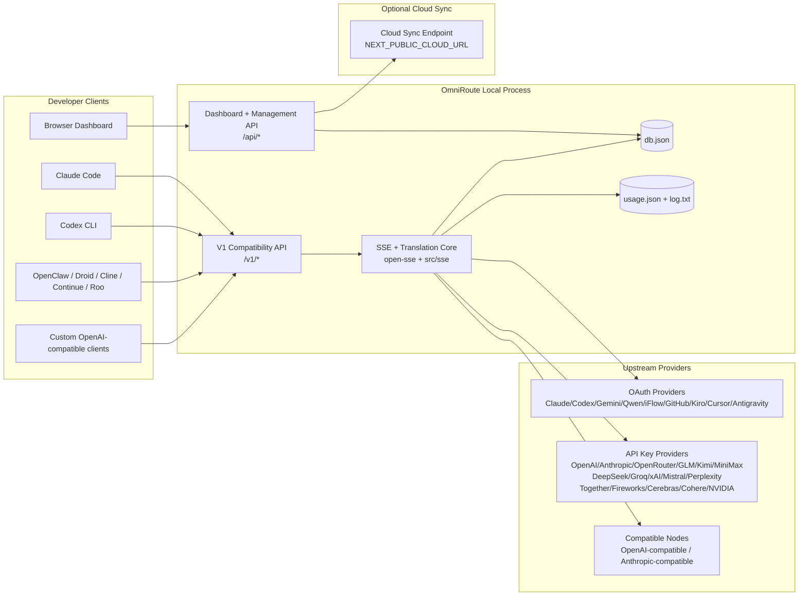
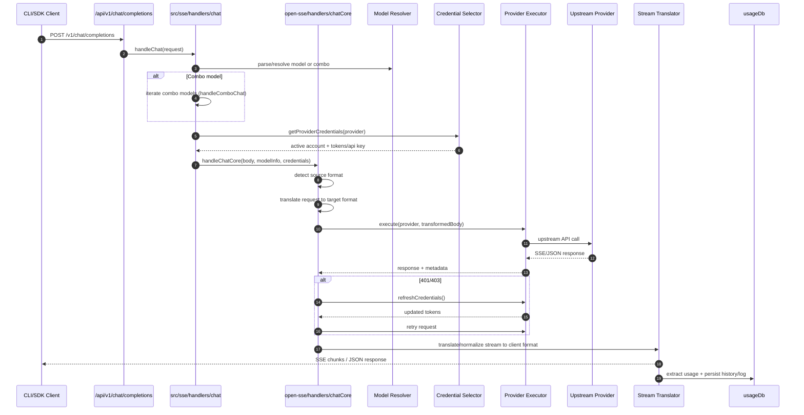
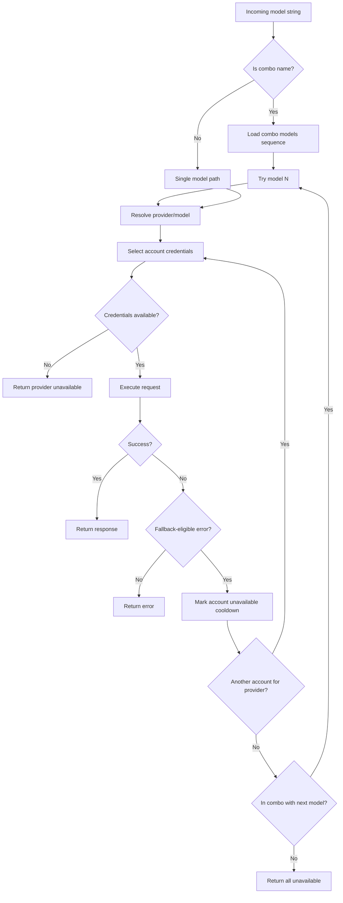
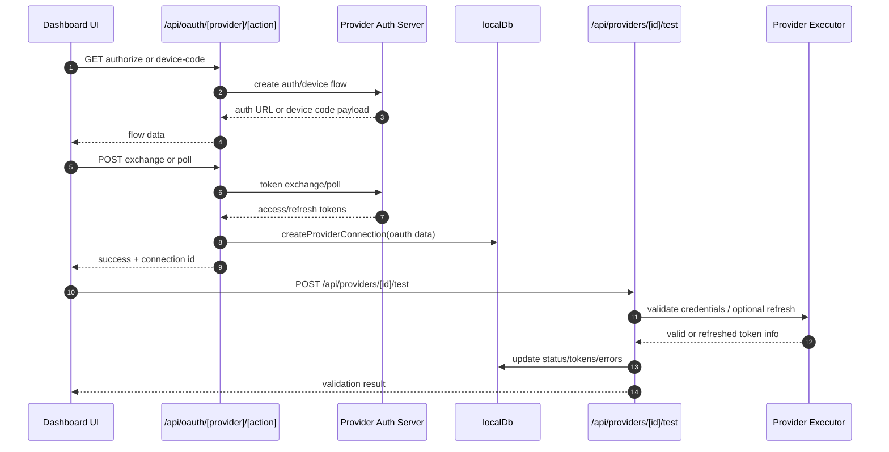
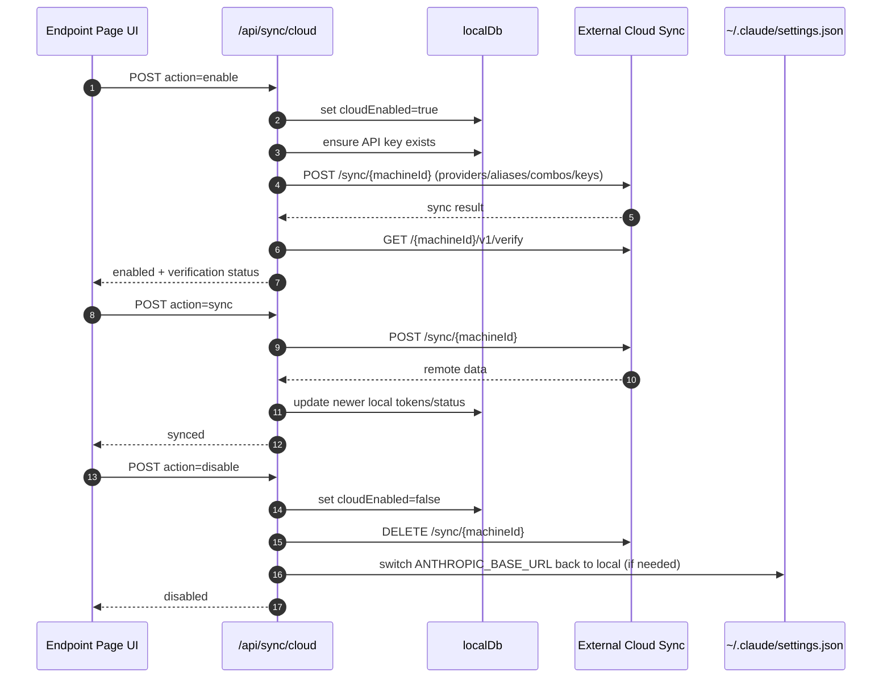
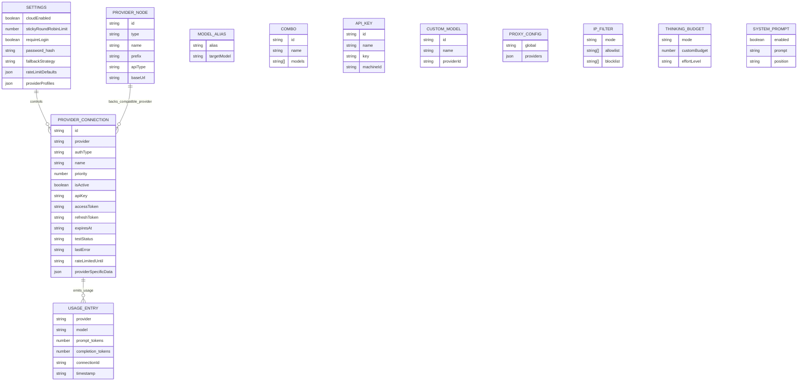
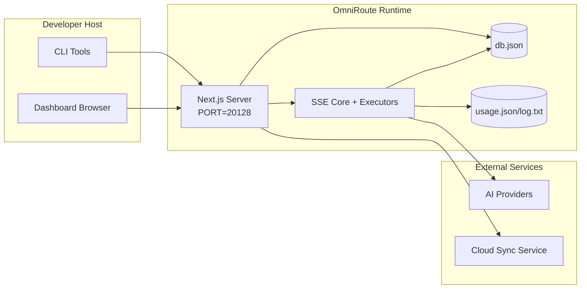

# Architettura OmniRoute

🌐 **Languages:** 🇺🇸 [English](../../ARCHITECTURE.md) | 🇧🇷 [Português (Brasil)](../pt-BR/ARCHITECTURE.md) | 🇪🇸 [Español](../es/ARCHITECTURE.md) | 🇫🇷 [Français](../fr/ARCHITECTURE.md) | 🇮🇹 [Italiano](../it/ARCHITECTURE.md) | 🇷🇺 [Русский](../ru/ARCHITECTURE.md) | 🇨🇳 [中文 (简体)](../zh-CN/ARCHITECTURE.md) | 🇩🇪 [Deutsch](../de/ARCHITECTURE.md) | 🇮🇳 [हिन्दी](../in/ARCHITECTURE.md) | 🇹🇭 [ไทย](../th/ARCHITECTURE.md) | 🇺🇦 [Українська](../uk-UA/ARCHITECTURE.md) | 🇸🇦 [العربية](../ar/ARCHITECTURE.md) | 🇯🇵 [日本語](../ja/ARCHITECTURE.md) | 🇻🇳 [Tiếng Việt](../vi/ARCHITECTURE.md) | 🇧🇬 [Български](../bg/ARCHITECTURE.md) | 🇩🇰 [Dansk](../da/ARCHITECTURE.md) | 🇫🇮 [Suomi](../fi/ARCHITECTURE.md) | 🇮🇱 [עברית](../he/ARCHITECTURE.md) | 🇭🇺 [Magyar](../hu/ARCHITECTURE.md) | 🇮🇩 [Bahasa Indonesia](../id/ARCHITECTURE.md) | 🇰🇷 [한국어](../ko/ARCHITECTURE.md) | 🇲🇾 [Bahasa Melayu](../ms/ARCHITECTURE.md) | 🇳🇱 [Nederlands](../nl/ARCHITECTURE.md) | 🇳🇴 [Norsk](../no/ARCHITECTURE.md) | 🇵🇹 [Português (Portugal)](../pt/ARCHITECTURE.md) | 🇷🇴 [Română](../ro/ARCHITECTURE.md) | 🇵🇱 [Polski](../pl/ARCHITECTURE.md) | 🇸🇰 [Slovenčina](../sk/ARCHITECTURE.md) | 🇸🇪 [Svenska](../sv/ARCHITECTURE.md) | 🇵🇭 [Filipino](../phi/ARCHITECTURE.md)

_Ultimo aggiornamento: 2026-02-18_

## Sintesi

OmniRoute è un gateway di routing AI locale e un dashboard basato su Next.js.
Fornisce un singolo endpoint compatibile con OpenAI (`/v1/*`) e instrada il traffico attraverso più provider upstream con traduzione, fallback, aggiornamento dei token e monitoraggio dell'utilizzo.

Funzionalità principali:

- Superficie API compatibile con OpenAI per CLI/strumenti (28 provider)
- Traduzione di richieste/risposte tra formati di fornitori
- Fallback combo modello (sequenza multi-modello)
- Fallback a livello di account (più account per fornitore)
- Gestione della connessione del provider OAuth + chiave API
- Generazione di incorporamento tramite `/v1/embeddings` (6 fornitori, 9 modelli)
- Generazione di immagini tramite `/v1/images/generations` (4 fornitori, 9 modelli)
- Pensa all'analisi dei tag (`<think>...</think>`) per i modelli di ragionamento
- Sanificazione della risposta per una rigorosa compatibilità con l'SDK OpenAI
- Normalizzazione dei ruoli (sviluppatore→sistema, sistema→utente) per compatibilità tra provider
- Conversione dell'output strutturato (json_schema → Gemini ResponseSchema)
- Persistenza locale per provider, chiavi, alias, combo, impostazioni, prezzi
- Monitoraggio dell'utilizzo/costo e registrazione delle richieste
- Sincronizzazione cloud opzionale per la sincronizzazione multi-dispositivo/stato
- Lista consentita/lista bloccata IP per il controllo dell'accesso API
- Gestione intelligente del budget (passthrough/automatico/personalizzato/adattivo)
- Iniezione rapida del sistema globale
- Monitoraggio della sessione e rilevamento delle impronte digitali
- Limitazione tariffaria migliorata per account con profili specifici del fornitore
- Modello di interruttore automatico per la resilienza del fornitore
- Protezione gregge antituono con bloccaggio mutex
- Cache di deduplicazione delle richieste basata su firma
- Livello dominio: disponibilità del modello, regole di costo, politica di fallback, politica di blocco
- Persistenza dello stato del dominio (cache write-through SQLite per fallback, budget, blocchi, interruttori automatici)
- Motore di policy per la valutazione centralizzata delle richieste (blocco → budget → fallback)
- Richiedi telemetria con aggregazione della latenza p50/p95/p99
- ID di correlazione (X-Request-Id) per la traccia end-to-end
- Registrazione del controllo di conformità con rinuncia per chiave API
- Quadro di valutazione per la garanzia della qualità LLM
- Dashboard dell'interfaccia utente di resilienza con stato dell'interruttore automatico in tempo reale
- Provider OAuth modulari (12 moduli individuali in `src/lib/oauth/providers/`)

Modello runtime primario:

- I percorsi dell'app Next.js in `src/app/api/*` implementano sia le API del dashboard che le API di compatibilità
- Un core SSE/routing condiviso in `src/sse/*` + `open-sse/*` gestisce l'esecuzione, la traduzione, lo streaming, il fallback e l'utilizzo del provider

## Ambito e confini

### Nell'ambito

- Runtime del gateway locale
- API di gestione della dashboard
- Autenticazione del provider e aggiornamento del token
- Richiedi traduzione e streaming SSE
- Stato locale + persistenza dell'utilizzo
- Orchestrazione opzionale della sincronizzazione cloud

### Fuori portata

- Implementazione del servizio cloud dietro `NEXT_PUBLIC_CLOUD_URL`
- SLA/piano di controllo del fornitore esterno al processo locale
- Gli stessi binari CLI esterni (Claude CLI, Codex CLI, ecc.)

## Contesto del sistema di alto livello



## Componenti runtime principali

## 1) API e livello di routing (percorsi dell'app Next.js)

Directory principali:

- `src/app/api/v1/*` e `src/app/api/v1beta/*` per API di compatibilità
- `src/app/api/*` per le API di gestione/configurazione
- Successivamente riscrive nella mappa `next.config.mjs` `/v1/*` in `/api/v1/*`

Percorsi di compatibilità importanti:

- `src/app/api/v1/chat/completions/route.ts`
- `src/app/api/v1/messages/route.ts`
- `src/app/api/v1/responses/route.ts`
- `src/app/api/v1/models/route.ts`: include modelli personalizzati con `custom: true`
- `src/app/api/v1/embeddings/route.ts`: generazione di incorporamenti (6 fornitori)
- `src/app/api/v1/images/generations/route.ts` — generazione di immagini (4+ fornitori incluso Antigravity/Nebius)
- `src/app/api/v1/messages/count_tokens/route.ts`
- `src/app/api/v1/providers/[provider]/chat/completions/route.ts`: chat dedicata per provider
- `src/app/api/v1/providers/[provider]/embeddings/route.ts`: incorporamenti dedicati per provider
- `src/app/api/v1/providers/[provider]/images/generations/route.ts`: immagini dedicate per provider
- `src/app/api/v1beta/models/route.ts`
- `src/app/api/v1beta/models/[...path]/route.ts`

Domini di gestione:

- Autenticazione/impostazioni: `src/app/api/auth/*`, `src/app/api/settings/*`
- Provider/connessioni: `src/app/api/providers*`
- Nodi fornitore: `src/app/api/provider-nodes*`
- Modelli personalizzati: `src/app/api/provider-models` (GET/POST/DELETE)
- Catalogo modelli: `src/app/api/models/catalog` (OTTIENI)
- Configurazione proxy: `src/app/api/settings/proxy` (GET/PUT/DELETE) + `src/app/api/settings/proxy/test` (POST)
- OAuth: `src/app/api/oauth/*`
- Chiavi/alias/combo/prezzi: `src/app/api/keys*`, `src/app/api/models/alias`, `src/app/api/combos*`, `src/app/api/pricing`
- Utilizzo: `src/app/api/usage/*`
- Sincronizzazione/cloud: `src/app/api/sync/*`, `src/app/api/cloud/*`
- Aiutanti degli strumenti CLI: `src/app/api/cli-tools/*`
- Filtro IP: `src/app/api/settings/ip-filter` (GET/PUT)
- Budget pensato: `src/app/api/settings/thinking-budget` (GET/PUT)
- Richiesta di sistema: `src/app/api/settings/system-prompt` (GET/PUT)
- Sessioni: `src/app/api/sessions` (GET)
- Limiti di velocità: `src/app/api/rate-limits` (GET)
- Resilienza: `src/app/api/resilience` (GET/PATCH): profili dei fornitori, interruttore automatico, stato limite di velocità
- Ripristino della resilienza: `src/app/api/resilience/reset` (POST): ripristina gli interruttori + tempi di recupero
- Statistiche cache: `src/app/api/cache/stats` (OTTIENI/ELIMINA)
- Disponibilità del modello: `src/app/api/models/availability` (GET/POST)
- Telemetria: `src/app/api/telemetry/summary` (OTTIENI)
- Budget: `src/app/api/usage/budget` (OTTIENI/POST)
- Catene di fallback: `src/app/api/fallback/chains` (GET/POST/DELETE)
- Controllo di conformità: `src/app/api/compliance/audit-log` (GET)
- Valutazioni: `src/app/api/evals` (GET/POST), `src/app/api/evals/[suiteId]` (GET)
- Politiche: `src/app/api/policies` (GET/POST)

## 2) SSE + Nucleo di traduzione

Principali moduli di flusso:

- Voce: `src/sse/handlers/chat.ts`
- Orchestrazione principale: `open-sse/handlers/chatCore.ts`
- Adattatori di esecuzione del provider: `open-sse/executors/*`
- Rilevamento formato/configurazione provider: `open-sse/services/provider.ts`
- Analisi/risoluzione del modello: `src/sse/services/model.ts`, `open-sse/services/model.ts`
- Logica di fallback dell'account: `open-sse/services/accountFallback.ts`
- Registro delle traduzioni: `open-sse/translator/index.ts`
- Trasformazioni del flusso: `open-sse/utils/stream.ts`, `open-sse/utils/streamHandler.ts`
- Estrazione/normalizzazione dell'utilizzo: `open-sse/utils/usageTracking.ts`
- Pensa al parser dei tag: `open-sse/utils/thinkTagParser.ts`
- Gestore di incorporamento: `open-sse/handlers/embeddings.ts`
- Incorporamento del registro dei provider: `open-sse/config/embeddingRegistry.ts`
- Gestore di generazione di immagini: `open-sse/handlers/imageGeneration.ts`
- Registro del fornitore di immagini: `open-sse/config/imageRegistry.ts`
- Sanificazione della risposta: `open-sse/handlers/responseSanitizer.ts`
- Normalizzazione del ruolo: `open-sse/services/roleNormalizer.ts`

Servizi (logica aziendale):

- Selezione/punteggio dell'account: `open-sse/services/accountSelector.ts`
- Gestione del ciclo di vita del contesto: `open-sse/services/contextManager.ts`
- Applicazione del filtro IP: `open-sse/services/ipFilter.ts`
- Monitoraggio della sessione: `open-sse/services/sessionManager.ts`
- Richiedi deduplicazione: `open-sse/services/signatureCache.ts`
- Inserimento prompt del sistema: `open-sse/services/systemPrompt.ts`
- Gestione intelligente del budget: `open-sse/services/thinkingBudget.ts`
- Routing del modello con caratteri jolly: `open-sse/services/wildcardRouter.ts`
- Gestione dei limiti di velocità: `open-sse/services/rateLimitManager.ts`
- Interruttore automatico: `open-sse/services/circuitBreaker.ts`

Moduli del livello di dominio:

- Disponibilità del modello: `src/lib/domain/modelAvailability.ts`
- Regole di costo/budget: `src/lib/domain/costRules.ts`
- Politica di riserva: `src/lib/domain/fallbackPolicy.ts`
- Risolutore combinato: `src/lib/domain/comboResolver.ts`
- Politica di blocco: `src/lib/domain/lockoutPolicy.ts`
- Motore delle politiche: `src/domain/policyEngine.ts` — blocco centralizzato → budget → valutazione fallback
- Catalogo codici errore: `src/lib/domain/errorCodes.ts`
- ID richiesta: `src/lib/domain/requestId.ts`
- Timeout recupero: `src/lib/domain/fetchTimeout.ts`
- Richiedi telemetria: `src/lib/domain/requestTelemetry.ts`
- Conformità/controllo: `src/lib/domain/compliance/index.ts`
- Corridore di valutazione: `src/lib/domain/evalRunner.ts`
- Persistenza dello stato del dominio: `src/lib/db/domainState.ts` — SQLite CRUD per catene di fallback, budget, cronologia dei costi, stato di blocco, interruttori automatici

Moduli provider OAuth (12 file singoli in `src/lib/oauth/providers/`):

- Indice del registro: `src/lib/oauth/providers/index.ts`
- Singoli fornitori: `claude.ts`, `codex.ts`, `gemini.ts`, `antigravity.ts`, `iflow.ts`, `qwen.ts`, `kimi-coding.ts`, `github.ts`, `kiro.ts`, `cursor.ts`, `kilocode.ts`, `cline.ts`
- Involucro sottile: `src/lib/oauth/providers.ts` — riesporta da singoli moduli

## 3) Livello di persistenza

DB di stato primario:

- `src/lib/localDb.ts`
- file: `${DATA_DIR}/db.json` (o `$XDG_CONFIG_HOME/omniroute/db.json` quando impostato, altrimenti `~/.omniroute/db.json`)
- entità: providerConnections, providerNodes, modelAliases, combo, apiKeys, impostazioni, prezzi, **customModels**, **proxyConfig**, **ipFilter**, **thinkingBudget**, **systemPrompt**

DB di utilizzo:

- `src/lib/usageDb.ts`
- file: `${DATA_DIR}/usage.json`, `${DATA_DIR}/log.txt`, `${DATA_DIR}/call_logs/`
- segue la stessa policy di directory di base di `localDb` (`DATA_DIR`, quindi `XDG_CONFIG_HOME/omniroute` quando impostato)
- scomposto in sottomoduli focalizzati: `migrations.ts`, `usageHistory.ts`, `costCalculator.ts`, `usageStats.ts`, `callLogs.ts`

DB dello stato del dominio (SQLite):

- `src/lib/db/domainState.ts`: operazioni CRUD per lo stato del dominio
- Tabelle (create in `src/lib/db/core.ts`): `domain_fallback_chains`, `domain_budgets`, `domain_cost_history`, `domain_lockout_state`, `domain_circuit_breakers`
- Schema cache write-through: le mappe in memoria sono autorevoli in fase di esecuzione; le mutazioni vengono scritte in modo sincrono su SQLite; lo stato viene ripristinato dal DB all'avvio a freddo

## 4) Superfici di autenticazione e sicurezza

- Autenticazione cookie dashboard: `src/proxy.ts`, `src/app/api/auth/login/route.ts`
- Generazione/verifica della chiave API: `src/shared/utils/apiKey.ts`
- I segreti del provider sono persistenti nelle voci `providerConnections`
- Supporto proxy in uscita tramite `open-sse/utils/proxyFetch.ts` (env vars) e `open-sse/utils/networkProxy.ts` (configurabile per provider o globale)

## 5) Sincronizzazione nel cloud

- Inizializzazione pianificazione: `src/lib/initCloudSync.ts`, `src/shared/services/initializeCloudSync.ts`
- Attività periodica: `src/shared/services/cloudSyncScheduler.ts`
- Percorso di controllo: `src/app/api/sync/cloud/route.ts`

## Ciclo di vita della richiesta (`/v1/chat/completions`)



## Combo + Flusso di fallback dell'account



Le decisioni di fallback sono guidate da `open-sse/services/accountFallback.ts` utilizzando codici di stato ed euristica dei messaggi di errore.

## Ciclo di vita dell'onboarding OAuth e dell'aggiornamento dei token



L'aggiornamento durante il traffico in tempo reale viene eseguito all'interno di `open-sse/handlers/chatCore.ts` tramite l'esecutore `refreshCredentials()`.

## Ciclo di vita della sincronizzazione cloud (Abilita/Sincronizza/Disabilita)



La sincronizzazione periodica viene attivata da `CloudSyncScheduler` quando il cloud è abilitato.

## Modello dei dati e mappa di archiviazione



File di archiviazione fisica:

- stato principale: `${DATA_DIR}/db.json` (o `$XDG_CONFIG_HOME/omniroute/db.json` quando impostato, altrimenti `~/.omniroute/db.json`)
- statistiche di utilizzo: `${DATA_DIR}/usage.json`
- righe di registro della richiesta: `${DATA_DIR}/log.txt`
- sessioni di debug traduttore/richiesta opzionali: `<repo>/logs/...`

## Topologia di distribuzione



## Mappatura dei moduli (critica per la decisione)

### Itinerario e moduli API

- `src/app/api/v1/*`, `src/app/api/v1beta/*`: API di compatibilità
- `src/app/api/v1/providers/[provider]/*`: percorsi dedicati per provider (chat, incorporamenti, immagini)
- `src/app/api/providers*`: CRUD del fornitore, convalida, test
- `src/app/api/provider-nodes*`: gestione personalizzata dei nodi compatibili
- `src/app/api/provider-models`: gestione del modello personalizzato (CRUD)
- `src/app/api/models/catalog`: API del catalogo modelli completo (tutti i tipi raggruppati per fornitore)
- `src/app/api/oauth/*`: flussi OAuth/codice dispositivo
- `src/app/api/keys*`: ciclo di vita della chiave API locale
- `src/app/api/models/alias`: gestione alias
- `src/app/api/combos*`: gestione combo fallback
- `src/app/api/pricing`: il prezzo sostituisce il calcolo dei costi
- `src/app/api/settings/proxy`: configurazione proxy (GET/PUT/DELETE)
- `src/app/api/settings/proxy/test`: test di connettività proxy in uscita (POST)
- `src/app/api/usage/*`: API di utilizzo e log
- `src/app/api/sync/*` + `src/app/api/cloud/*`: sincronizzazione cloud e aiutanti rivolti al cloud
- `src/app/api/cli-tools/*`: scrittori/controllori di configurazione CLI locale
- `src/app/api/settings/ip-filter`: lista consentita/lista bloccata IP (GET/PUT)
- `src/app/api/settings/thinking-budget`: configurazione del budget del token pensante (GET/PUT)
- `src/app/api/settings/system-prompt`: prompt di sistema globale (GET/PUT)
- `src/app/api/sessions`: elenco sessioni attive (GET)
- `src/app/api/rate-limits`: stato limite tariffa per account (GET)

### Nucleo di routing ed esecuzione

- `src/sse/handlers/chat.ts`: analisi delle richieste, gestione delle combo, ciclo di selezione dell'account
- `open-sse/handlers/chatCore.ts`: traduzione, invio dell'esecutore, gestione di nuovi tentativi/aggiornamenti, impostazione del flusso
- `open-sse/executors/*`: comportamento di rete e formato specifico del provider

### Registro di traduzione e convertitori di formato

- `open-sse/translator/index.ts`: registro e orchestrazione dei traduttori
- Richiedi traduttori: `open-sse/translator/request/*`
- Traduttori di risposta: `open-sse/translator/response/*`
- Costanti di formato: `open-sse/translator/formats.ts`

### Persistenza

- `src/lib/localDb.ts`: configurazione/stato persistente
- `src/lib/usageDb.ts`: cronologia di utilizzo e registri delle richieste in sequenza

## Copertura dell'esecutore del provider (modello strategico)

Ogni provider dispone di un esecutore specializzato che estende `BaseExecutor` (in `open-sse/executors/base.ts`), che fornisce la creazione di URL, la costruzione di intestazioni, nuovi tentativi con backoff esponenziale, hook di aggiornamento delle credenziali e il metodo di orchestrazione `execute()`.

| Esecutore testamentario | Fornitore/i                                                                                                                                                  | Movimentazione speciale                                                          |
| ----------------------- | ------------------------------------------------------------------------------------------------------------------------------------------------------------ | -------------------------------------------------------------------------------- |
| `DefaultExecutor`       | OpenAI, Claude, Gemini, Qwen, iFlow, OpenRouter, GLM, Kimi, MiniMax, DeepSeek, Groq, xAI, Mistral, Perplexity, Together, Fireworks, Cerebras, Cohere, NVIDIA | Configurazione URL/intestazione dinamica per provider                            |
| `AntigravityExecutor`   | Google Antigravità                                                                                                                                           | ID progetto/sessione personalizzati, analisi Riprova dopo                        |
| `CodexExecutor`         | Codice OpenAI                                                                                                                                                | Inserisce istruzioni di sistema, forza lo sforzo di ragionamento                 |
| `CursorExecutor`        | Cursore IDE                                                                                                                                                  | Protocollo ConnectRPC, codifica Protobuf, firma della richiesta tramite checksum |
| `GithubExecutor`        | Copilota GitHub                                                                                                                                              | Aggiornamento del token Copilot, intestazioni che imitano VSCode                 |
| `KiroExecutor`          | AWS CodeWhisperer/Kiro                                                                                                                                       | Formato binario AWS EventStream → conversione SSE                                |
| `GeminiCLIExecutor`     | Gemelli CLI                                                                                                                                                  | Ciclo di aggiornamento del token OAuth di Google                                 |

Tutti gli altri provider (inclusi i nodi compatibili personalizzati) utilizzano `DefaultExecutor`.

## Matrice di compatibilità del fornitore

| Fornitore             | Formato         | Aut.                    | Flusso           | Non streaming | Aggiornamento token | API di utilizzo          |
| --------------------- | --------------- | ----------------------- | ---------------- | ------------- | ------------------- | ------------------------ |
| Claudio               | claude          | Chiave API/OAuth        | ✅               | ✅            | ✅                  | ⚠️ Solo amministratore   |
| Gemelli               | gemelli         | Chiave API/OAuth        | ✅               | ✅            | ✅                  | ⚠️ Console cloud         |
| Gemelli CLI           | gemelli-cli     | OAuth                   | ✅               | ✅            | ✅                  | ⚠️ Console cloud         |
| Antigravità           | antigravità     | OAuth                   | ✅               | ✅            | ✅                  | ✅ API quota completa    |
| OpenAI                | openai          | Chiave API              | ✅               | ✅            | ❌                  | ❌                       |
| Codice                | risposte-openai | OAuth                   | ✅ forzato       | ❌            | ✅                  | ✅ Limiti tariffari      |
| Copilota GitHub       | openai          | OAuth + token copilota  | ✅               | ✅            | ✅                  | ✅Istantanee delle quote |
| Cursore               | cursore         | Checksum personalizzato | ✅               | ✅            | ❌                  | ❌                       |
| Kiro                  | Kiro            | AWS SSO OIDC            | ✅ (EventStream) | ❌            | ✅                  | ✅ Limiti di utilizzo    |
| Qwen                  | openai          | OAuth                   | ✅               | ✅            | ✅                  | ⚠️ Su richiesta          |
| iFlow                 | openai          | OAuth (base)            | ✅               | ✅            | ✅                  | ⚠️ Su richiesta          |
| OpenRouter            | openai          | Chiave API              | ✅               | ✅            | ❌                  | ❌                       |
| GLM/Kimi/MiniMax      | claude          | Chiave API              | ✅               | ✅            | ❌                  | ❌                       |
| Ricerca profonda      | openai          | Chiave API              | ✅               | ✅            | ❌                  | ❌                       |
| Groq                  | openai          | Chiave API              | ✅               | ✅            | ❌                  | ❌                       |
| xAI (Grok)            | openai          | Chiave API              | ✅               | ✅            | ❌                  | ❌                       |
| Maestrale             | openai          | Chiave API              | ✅               | ✅            | ❌                  | ❌                       |
| Perplessità           | openai          | Chiave API              | ✅               | ✅            | ❌                  | ❌                       |
| Insieme AI            | openai          | Chiave API              | ✅               | ✅            | ❌                  | ❌                       |
| Fuochi d'artificio AI | openai          | Chiave API              | ✅               | ✅            | ❌                  | ❌                       |
| Cerebri               | openai          | Chiave API              | ✅               | ✅            | ❌                  | ❌                       |
| Coerenza              | openai          | Chiave API              | ✅               | ✅            | ❌                  | ❌                       |
| NVIDIA NIM            | openai          | Chiave API              | ✅               | ✅            | ❌                  | ❌                       |

## Copertura della traduzione del formato

I formati sorgente rilevati includono:

- `openai`
- `openai-responses`
- `claude`
- `gemini`

I formati di destinazione includono:

- Chat/risposte OpenAI
- Claudio
- Busta Gemini/Gemini-CLI/Antigravità
- Kiro
- Cursore

Le traduzioni utilizzano **OpenAI come formato hub**: tutte le conversioni passano attraverso OpenAI come formato intermedio:

```
Source Format → OpenAI (hub) → Target Format
```

Le traduzioni vengono selezionate dinamicamente in base alla forma del payload di origine e al formato di destinazione del provider.

Ulteriori livelli di elaborazione nella pipeline di traduzione:

- **Sanificazione delle risposte**: rimuove i campi non standard dalle risposte in formato OpenAI (sia in streaming che non in streaming) per garantire la rigorosa conformità dell'SDK
- **Normalizzazione del ruolo**: converte `developer` → `system` per target non OpenAI; unisce `system` → `user` per i modelli che rifiutano il ruolo di sistema (GLM, ERNIE)
- **Estrazione tag Think**: analizza i blocchi `<think>...</think>` dal contenuto nel campo `reasoning_content`
- **Output strutturato**: converte OpenAI `response_format.json_schema` in `responseMimeType` di Gemini + `responseSchema`

## Endpoint API supportati

| Punto finale                                       | Formato                  | Gestore                                                                  |
| -------------------------------------------------- | ------------------------ | ------------------------------------------------------------------------ |
| `POST /v1/chat/completions`                        | Chatta OpenAI            | `src/sse/handlers/chat.ts`                                               |
| `POST /v1/messages`                                | Messaggi di Claude       | Stesso gestore (rilevato automaticamente)                                |
| `POST /v1/responses`                               | Risposte OpenAI          | `open-sse/handlers/responsesHandler.ts`                                  |
| `POST /v1/embeddings`                              | Incorporamenti OpenAI    | `open-sse/handlers/embeddings.ts`                                        |
| `GET /v1/embeddings`                               | Elenco dei modelli       | Percorso API                                                             |
| `POST /v1/images/generations`                      | Immagini OpenAI          | `open-sse/handlers/imageGeneration.ts`                                   |
| `GET /v1/images/generations`                       | Elenco dei modelli       | Percorso API                                                             |
| `POST /v1/providers/{provider}/chat/completions`   | Chatta OpenAI            | Dedicato per provider con convalida del modello                          |
| `POST /v1/providers/{provider}/embeddings`         | Incorporamenti OpenAI    | Dedicato per provider con convalida del modello                          |
| `POST /v1/providers/{provider}/images/generations` | Immagini OpenAI          | Dedicato per provider con convalida del modello                          |
| `POST /v1/messages/count_tokens`                   | Conteggio gettoni Claude | Percorso API                                                             |
| `GET /v1/models`                                   | Elenco modelli OpenAI    | Percorso API (chat + incorporamento + immagine + modelli personalizzati) |
| `GET /api/models/catalog`                          | Catalogo                 | Tutti i modelli raggruppati per fornitore + tipo                         |
| `POST /v1beta/models/*:streamGenerateContent`      | Nativo dei Gemelli       | Percorso API                                                             |
| `GET/PUT/DELETE /api/settings/proxy`               | Configurazione proxy     | Configurazione proxy di rete                                             |
| `POST /api/settings/proxy/test`                    | Connettività proxy       | Endpoint di test di integrità/connettività proxy                         |
| `GET/POST/DELETE /api/provider-models`             | Modelli personalizzati   | Gestione modelli personalizzati per fornitore                            |

## Gestore di bypass

Il gestore di bypass (`open-sse/utils/bypassHandler.ts`) intercetta le richieste "usa e getta" note dalla CLI di Claude (ping di riscaldamento, estrazioni di titoli e conteggi di token) e restituisce una **risposta falsa** senza consumare token del provider upstream. Questo viene attivato solo quando `User-Agent` contiene `claude-cli`.

## Richiedi la pipeline del registratore

Il logger delle richieste (`open-sse/utils/requestLogger.ts`) fornisce una pipeline di registrazione del debug in 7 fasi, disabilitata per impostazione predefinita, abilitata tramite `ENABLE_REQUEST_LOGS=true`:

```
1_req_client.json → 2_req_source.json → 3_req_openai.json → 4_req_target.json
→ 5_res_provider.txt → 6_res_openai.txt → 7_res_client.txt
```

I file vengono scritti in `<repo>/logs/<session>/` per ogni sessione di richiesta.

## Modalità di fallimento e resilienza

## 1) Disponibilità dell'account/fornitore

- Tempo di recupero dell'account del provider in caso di errori temporanei/velocità/autenticazione
- fallback dell'account prima di fallire la richiesta
- fallback del modello combinato quando il percorso del modello/provider corrente è esaurito

## 2) Scadenza del token

- controllo preliminare e aggiornamento con nuovo tentativo per i provider aggiornabili
- Nuovo tentativo 401/403 dopo il tentativo di aggiornamento nel percorso principale

## 3) Sicurezza dello streaming

- controller di flusso in grado di riconoscere la disconnessione
- flusso di traduzione con scarico di fine flusso e gestione `[DONE]`
- fallback della stima dell'utilizzo quando mancano i metadati di utilizzo del provider

## 4) Degrado della sincronizzazione cloud

- Sono emersi errori di sincronizzazione ma il runtime locale continua
- Lo scheduler ha una logica che consente di riprovare, ma l'esecuzione periodica attualmente chiama la sincronizzazione a tentativo singolo per impostazione predefinita

## 5) Integrità dei dati

- Migrazione/riparazione della forma DB per chiavi mancanti
- protezioni di reimpostazione JSON corrotte per localDb e UsageDb

## Osservabilità e segnali operativi

Origini della visibilità in runtime:

- registri della console da `src/sse/utils/logger.ts`
- aggregati di utilizzo per richiesta in `usage.json`
- accesso testuale sullo stato della richiesta `log.txt`
- log di richiesta/traduzione approfonditi opzionali in `logs/` quando `ENABLE_REQUEST_LOGS=true`
- Endpoint di utilizzo del dashboard (`/api/usage/*`) per il consumo dell'interfaccia utente

## Confini sensibili alla sicurezza

- Il segreto JWT (`JWT_SECRET`) protegge la verifica/firma dei cookie della sessione del dashboard
- Il fallback della password iniziale (`INITIAL_PASSWORD`, predefinito `123456`) deve essere sovrascritto nelle distribuzioni reali
- Il segreto HMAC della chiave API (`API_KEY_SECRET`) protegge il formato della chiave API locale generata
- I segreti del provider (chiavi/token API) vengono mantenuti nel DB locale e devono essere protetti a livello di file system
- Gli endpoint di sincronizzazione cloud si basano sull'autenticazione della chiave API e sulla semantica dell'ID macchina

## Matrice di ambiente e runtime

Variabili d'ambiente utilizzate attivamente dal codice:

- App/autenticazione: `JWT_SECRET`, `INITIAL_PASSWORD`
- Spazio di archiviazione: `DATA_DIR`
- Comportamento del nodo compatibile: `ALLOW_MULTI_CONNECTIONS_PER_COMPAT_NODE`
- Override opzionale della base di archiviazione (Linux/macOS quando `DATA_DIR` non impostato): `XDG_CONFIG_HOME`
- Hashing di sicurezza: `API_KEY_SECRET`, `MACHINE_ID_SALT`
- Registrazione: `ENABLE_REQUEST_LOGS`
- URL di sincronizzazione/cloud: `NEXT_PUBLIC_BASE_URL`, `NEXT_PUBLIC_CLOUD_URL`
- Proxy in uscita: `HTTP_PROXY`, `HTTPS_PROXY`, `ALL_PROXY`, `NO_PROXY` e varianti minuscole
- Flag funzionalità SOCKS5: `ENABLE_SOCKS5_PROXY`, `NEXT_PUBLIC_ENABLE_SOCKS5_PROXY`
- Supporti piattaforma/runtime (non configurazione specifica dell'app): `APPDATA`, `NODE_ENV`, `PORT`, `HOSTNAME`

## Note architettoniche conosciute

1. `usageDb` e `localDb` ora condividono la stessa policy di directory di base (`DATA_DIR` -> `XDG_CONFIG_HOME/omniroute` -> `~/.omniroute`) con la migrazione dei file legacy.
2. `/api/v1/route.ts` restituisce un elenco di modelli statici e non è la fonte principale dei modelli utilizzata da `/v1/models`.
3. Il registro delle richieste scrive intestazioni/corpo completi quando abilitato; considera la directory dei log come sensibile.
4. Il comportamento del cloud dipende dalla corretta `NEXT_PUBLIC_BASE_URL` e dalla raggiungibilità dell'endpoint cloud.
5. La directory `open-sse/` viene pubblicata come `@omniroute/open-sse` **pacchetto area di lavoro npm**. Il codice sorgente lo importa tramite `@omniroute/open-sse/...` (risolto da Next.js `transpilePackages`). I percorsi dei file in questo documento utilizzano ancora il nome della directory `open-sse/` per coerenza.
6. I grafici nel dashboard utilizzano **Recharts** (basati su SVG) per visualizzazioni analitiche accessibili e interattive (grafici a barre sull'utilizzo del modello, tabelle di suddivisione dei fornitori con percentuali di successo).
7. I test E2E utilizzano **Playwright** (`tests/e2e/`), eseguiti tramite `npm run test:e2e`. I test unitari utilizzano **Node.js test runner** (`tests/unit/`), eseguiti tramite `npm run test:plan3`. Il codice sorgente in `src/` è **TypeScript** (`.ts`/`.tsx`); l'area di lavoro `open-sse/` rimane JavaScript (`.js`).
8. La pagina Impostazioni è organizzata in 5 schede: Sicurezza, Routing (6 strategie globali: riempimento prima, round robin, p2c, casuale, meno utilizzato, ottimizzato in termini di costi), Resilienza (limiti di velocità modificabili, interruttore automatico, policy), AI (budget pensato, prompt di sistema, cache dei prompt), Avanzate (proxy).

## Lista di controllo per la verifica operativa

- Costruisci dalla fonte: `npm run build`
- Crea immagine Docker: `docker build -t omniroute .`
- Avviare il servizio e verificare:
- `GET /api/settings`
- `GET /api/v1/models`
- L'URL di base di destinazione della CLI deve essere `http://<host>:20128/v1` quando `PORT=20128`
