# omniroute: documentazione della base di codice

🌐 **Languages:** 🇺🇸 [English](../../CODEBASE_DOCUMENTATION.md) | 🇧🇷 [Português (Brasil)](../pt-BR/CODEBASE_DOCUMENTATION.md) | 🇪🇸 [Español](../es/CODEBASE_DOCUMENTATION.md) | 🇫🇷 [Français](../fr/CODEBASE_DOCUMENTATION.md) | 🇮🇹 [Italiano](../it/CODEBASE_DOCUMENTATION.md) | 🇷🇺 [Русский](../ru/CODEBASE_DOCUMENTATION.md) | 🇨🇳 [中文 (简体)](../zh-CN/CODEBASE_DOCUMENTATION.md) | 🇩🇪 [Deutsch](../de/CODEBASE_DOCUMENTATION.md) | 🇮🇳 [हिन्दी](../in/CODEBASE_DOCUMENTATION.md) | 🇹🇭 [ไทย](../th/CODEBASE_DOCUMENTATION.md) | 🇺🇦 [Українська](../uk-UA/CODEBASE_DOCUMENTATION.md) | 🇸🇦 [العربية](../ar/CODEBASE_DOCUMENTATION.md) | 🇯🇵 [日本語](../ja/CODEBASE_DOCUMENTATION.md) | 🇻🇳 [Tiếng Việt](../vi/CODEBASE_DOCUMENTATION.md) | 🇧🇬 [Български](../bg/CODEBASE_DOCUMENTATION.md) | 🇩🇰 [Dansk](../da/CODEBASE_DOCUMENTATION.md) | 🇫🇮 [Suomi](../fi/CODEBASE_DOCUMENTATION.md) | 🇮🇱 [עברית](../he/CODEBASE_DOCUMENTATION.md) | 🇭🇺 [Magyar](../hu/CODEBASE_DOCUMENTATION.md) | 🇮🇩 [Bahasa Indonesia](../id/CODEBASE_DOCUMENTATION.md) | 🇰🇷 [한국어](../ko/CODEBASE_DOCUMENTATION.md) | 🇲🇾 [Bahasa Melayu](../ms/CODEBASE_DOCUMENTATION.md) | 🇳🇱 [Nederlands](../nl/CODEBASE_DOCUMENTATION.md) | 🇳🇴 [Norsk](../no/CODEBASE_DOCUMENTATION.md) | 🇵🇹 [Português (Portugal)](../pt/CODEBASE_DOCUMENTATION.md) | 🇷🇴 [Română](../ro/CODEBASE_DOCUMENTATION.md) | 🇵🇱 [Polski](../pl/CODEBASE_DOCUMENTATION.md) | 🇸🇰 [Slovenčina](../sk/CODEBASE_DOCUMENTATION.md) | 🇸🇪 [Svenska](../sv/CODEBASE_DOCUMENTATION.md) | 🇵🇭 [Filipino](../phi/CODEBASE_DOCUMENTATION.md)

> Una guida completa e adatta ai principianti al router proxy AI multi-provider **omniroute**.

---

## 1. Che cos'è omniroute?

omniroute è un **router proxy** che si trova tra i client AI (Claude CLI, Codex, Cursor IDE, ecc.) e i fornitori di AI (Anthropic, Google, OpenAI, AWS, GitHub, ecc.). Risolve un grosso problema:

> **Client IA diversi parlano "linguaggi" diversi (formati API) e anche fornitori di IA diversi si aspettano "linguaggi" diversi.** omniroute traduce automaticamente tra loro.

Pensatelo come un traduttore universale alle Nazioni Unite: qualsiasi delegato può parlare qualsiasi lingua e il traduttore la converte per qualsiasi altro delegato.

---

## 2. Panoramica dell'architettura

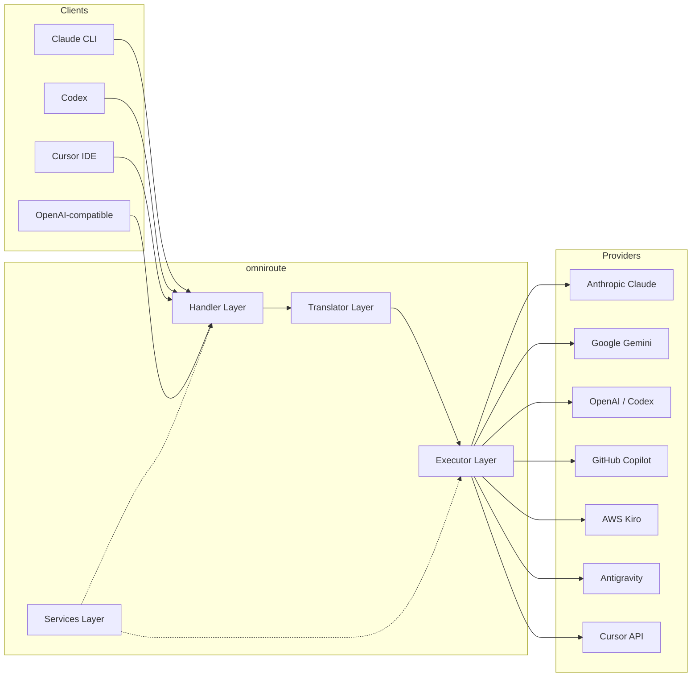

### Principio fondamentale: traduzione Hub-and-Spoke

Tutte le traduzioni dei formati passano attraverso il **formato OpenAI come hub**:

```
Client Format → [OpenAI Hub] → Provider Format    (request)
Provider Format → [OpenAI Hub] → Client Format    (response)
```

Ciò significa che hai bisogno solo di **N traduttori** (uno per formato) invece di **N²** (ogni coppia).

---

## 3. Struttura del progetto

```
omniroute/
├── open-sse/                  ← Core proxy library (portable, framework-agnostic)
│   ├── index.js               ← Main entry point, exports everything
│   ├── config/                ← Configuration & constants
│   ├── executors/             ← Provider-specific request execution
│   ├── handlers/              ← Request handling orchestration
│   ├── services/              ← Business logic (auth, models, fallback, usage)
│   ├── translator/            ← Format translation engine
│   │   ├── request/           ← Request translators (8 files)
│   │   ├── response/          ← Response translators (7 files)
│   │   └── helpers/           ← Shared translation utilities (6 files)
│   └── utils/                 ← Utility functions
├── src/                       ← Application layer (Express/Worker runtime)
│   ├── app/                   ← Web UI, API routes, middleware
│   ├── lib/                   ← Database, auth, and shared library code
│   ├── mitm/                  ← Man-in-the-middle proxy utilities
│   ├── models/                ← Database models
│   ├── shared/                ← Shared utilities (wrappers around open-sse)
│   ├── sse/                   ← SSE endpoint handlers
│   └── store/                 ← State management
├── data/                      ← Runtime data (credentials, logs)
│   └── provider-credentials.json   (external credentials override, gitignored)
└── tester/                    ← Test utilities
```

---

## 4. Analisi modulo per modulo

### 4.1 Configurazione (`open-sse/config/`)

L'**unica fonte di verità** per la configurazione di tutti i provider.

| File                          | Scopo                                                                                                                                                                                                                                                    |
| ----------------------------- | -------------------------------------------------------------------------------------------------------------------------------------------------------------------------------------------------------------------------------------------------------- |
| `constants.ts`                | Oggetto `PROVIDERS` con URL di base, credenziali OAuth (predefinite), intestazioni e prompt di sistema predefiniti per ogni provider. Definisce anche `HTTP_STATUS`, `ERROR_TYPES`, `COOLDOWN_MS`, `BACKOFF_CONFIG` e `SKIP_PATTERNS`.                   |
| `credentialLoader.ts`         | Carica le credenziali esterne da `data/provider-credentials.json` e le unisce alle impostazioni predefinite hardcoded in `PROVIDERS`. Mantiene i segreti fuori dal controllo del codice sorgente mantenendo la compatibilità con le versioni precedenti. |
| `providerModels.ts`           | Registro centrale del modello: alias del fornitore delle mappe → ID del modello. Funzioni come `getModels()`, `getProviderByAlias()`.                                                                                                                    |
| `codexInstructions.ts`        | Istruzioni di sistema inserite nelle richieste del Codex (vincoli di modifica, regole sandbox, politiche di approvazione).                                                                                                                               |
| `defaultThinkingSignature.ts` | Firme "pensanti" predefinite per i modelli Claude e Gemini.                                                                                                                                                                                              |
| `ollamaModels.ts`             | Definizione di schemi per modelli Ollama locali (nome, dimensione, famiglia, quantizzazione).                                                                                                                                                            |

#### Flusso di caricamento delle credenziali

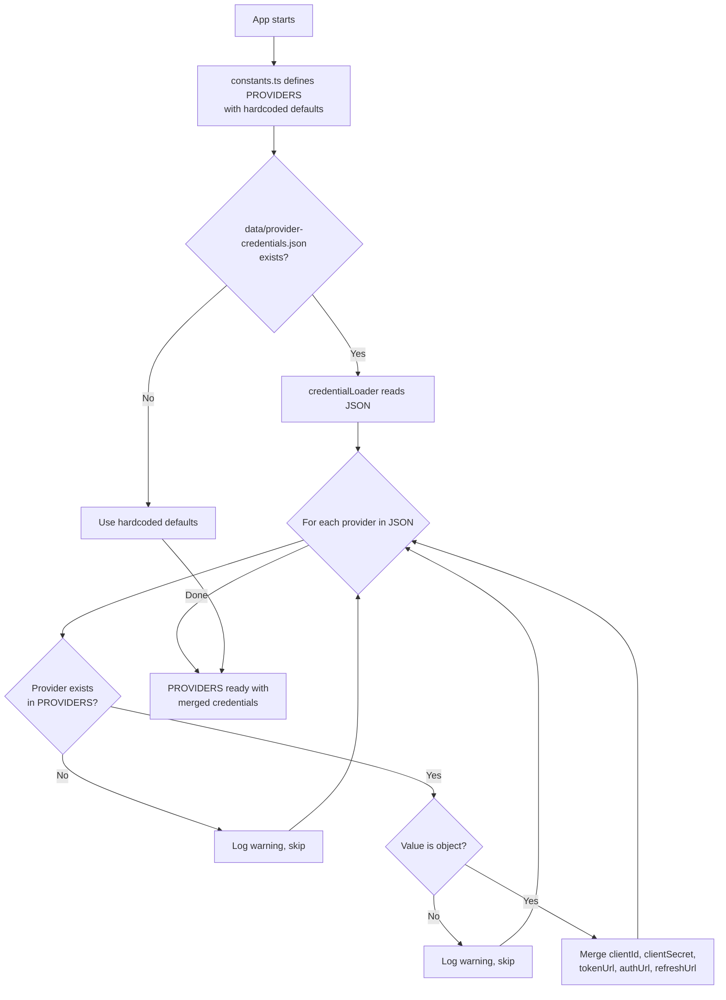

---

### 4.2 Esecutori (`open-sse/executors/`)

Gli esecutori incapsulano la **logica specifica del provider** utilizzando il **Strategy Pattern**. Ogni esecutore sovrascrive i metodi di base secondo necessità.

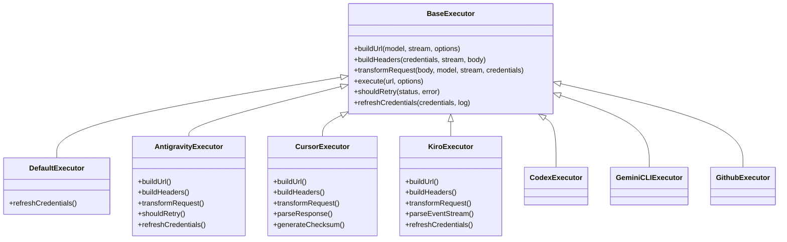

| Esecutore testamentario | Fornitore                                  | Specializzazioni chiave                                                                                                                           |
| ----------------------- | ------------------------------------------ | ------------------------------------------------------------------------------------------------------------------------------------------------- |
| `base.ts`               | —                                          | Base astratta: creazione di URL, intestazioni, logica dei tentativi, aggiornamento delle credenziali                                              |
| `default.ts`            | Claude, Gemini, OpenAI, GLM, Kimi, MiniMax | Aggiornamento del token OAuth generico per i provider standard                                                                                    |
| `antigravity.ts`        | Codice Google Cloud                        | Generazione ID progetto/sessione, fallback multi-URL, nuovi tentativi di analisi personalizzati dai messaggi di errore ("reimposta dopo 2h7m23s") |
| `cursor.ts`             | Cursore IDE                                | **Più complesso**: autenticazione checksum SHA-256, codifica della richiesta Protobuf, EventStream binario → Analisi della risposta SSE           |
| `codex.ts`              | Codice OpenAI                              | Inserisce istruzioni di sistema, gestisce i livelli di pensiero, rimuove i parametri non supportati                                               |
| `gemini-cli.ts`         | CLI di Google Gemini                       | Creazione di URL personalizzati (`streamGenerateContent`), aggiornamento del token OAuth di Google                                                |
| `github.ts`             | Copilota GitHub                            | Sistema a doppio token (GitHub OAuth + token Copilot), intestazione VSCode che imita                                                              |
| `kiro.ts`               | AWS CodeWhisperer                          | Analisi binaria AWS EventStream, frame di eventi AMZN, stima dei token                                                                            |
| `index.ts`              | —                                          | Fabbrica: nome del provider delle mappe → classe dell'esecutore, con fallback predefinito                                                         |

---

### 4.3 Gestori (`open-sse/handlers/`)

Il **livello di orchestrazione**: coordina la traduzione, l'esecuzione, lo streaming e la gestione degli errori.

| File                  | Scopo                                                                                                                                                                                                                                                                           |
| --------------------- | ------------------------------------------------------------------------------------------------------------------------------------------------------------------------------------------------------------------------------------------------------------------------------- |
| `chatCore.ts`         | **Orchestratore centrale** (~600 linee). Gestisce il ciclo di vita completo della richiesta: rilevamento del formato → traduzione → invio dell'esecutore → risposta in streaming/non streaming → aggiornamento del token → gestione degli errori → registrazione dell'utilizzo. |
| `responsesHandler.ts` | Adattatore per l'API Responses di OpenAI: converte il formato delle risposte → Completamenti chat → invia a `chatCore` → riconverte SSE nel formato delle risposte.                                                                                                             |
| `embeddings.ts`       | Gestore della generazione di incorporamento: risolve il modello di incorporamento → provider, invia all'API del provider, restituisce una risposta di incorporamento compatibile con OpenAI. Supporta più di 6 fornitori.                                                       |
| `imageGeneration.ts`  | Gestore di generazione di immagini: risolve il modello di immagine → provider, supporta le modalità compatibili con OpenAI, Gemini-image (Antigravity) e fallback (Nebius). Restituisce immagini base64 o URL.                                                                  |

#### Ciclo di vita della richiesta (chatCore.ts)

```mermaid
sequenceDiagram
    participant Client
    participant chatCore
    participant Translator
    participant Executor
    participant Provider

    Client->>chatCore: Request (any format)
    chatCore->>chatCore: Detect source format
    chatCore->>chatCore: Check bypass patterns
    chatCore->>chatCore: Resolve model & provider
    chatCore->>Translator: Translate request (source → OpenAI → target)
    chatCore->>Executor: Get executor for provider
    Executor->>Executor: Build URL, headers, transform request
    Executor->>Executor: Refresh credentials if needed
    Executor->>Provider: HTTP fetch (streaming or non-streaming)

    alt Streaming
        Provider-->>chatCore: SSE stream
        chatCore->>chatCore: Pipe through SSE transform stream
        Note over chatCore: Transform stream translates<br/>each chunk: target → OpenAI → source
        chatCore-->>Client: Translated SSE stream
    else Non-streaming
        Provider-->>chatCore: JSON response
        chatCore->>Translator: Translate response
        chatCore-->>Client: Translated JSON
    end

    alt Error (401, 429, 500...)
        chatCore->>Executor: Retry with credential refresh
        chatCore->>chatCore: Account fallback logic
    end
```

---

### 4.4 Servizi (`open-sse/services/`)

Logica di business che supporta i gestori e gli esecutori.

| File                 | Scopo                                                                                                                                                                                                                                                                                                                                                                                                  |
| -------------------- | ------------------------------------------------------------------------------------------------------------------------------------------------------------------------------------------------------------------------------------------------------------------------------------------------------------------------------------------------------------------------------------------------------ |
| `provider.ts`        | **Rilevamento formato** (`detectFormat`): analizza la struttura del corpo della richiesta per identificare i formati Claude/OpenAI/Gemini/Antigravity/Responses (include l'euristica `max_tokens` per Claude). Inoltre: creazione di URL, creazione di intestazioni, normalizzazione della configurazione del pensiero. Supporta i provider dinamici `openai-compatible-*` e `anthropic-compatible-*`. |
| `model.ts`           | Analisi delle stringhe del modello (`claude/model-name` → `{provider: "claude", model: "model-name"}`), risoluzione degli alias con rilevamento delle collisioni, sanificazione dell'input (rifiuta i caratteri di controllo/attraversamento del percorso) e risoluzione delle informazioni del modello con supporto getter di alias asincrono.                                                        |
| `accountFallback.ts` | Gestione dei limiti di velocità: backoff esponenziale (1s → 2s → 4s → max 2min), gestione del cooldown dell'account, classificazione degli errori (quali errori attivano il fallback e quali no).                                                                                                                                                                                                      |
| `tokenRefresh.ts`    | Aggiornamento del token OAuth per **ogni provider**: Google (Gemini, Antigravity), Claude, Codex, Qwen, iFlow, GitHub (doppio token OAuth + Copilot), Kiro (AWS SSO OIDC + Social Auth). Include cache di deduplicazione delle promesse in volo e tentativi con backoff esponenziale.                                                                                                                  |
| `combo.ts`           | **Modelli combo**: catene di modelli fallback. Se il modello A fallisce con un errore idoneo al fallback, prova il modello B, poi C, ecc. Restituisce i codici di stato upstream effettivi.                                                                                                                                                                                                            |
| `usage.ts`           | Recupera i dati sulle quote/utilizzo dalle API del provider (quote GitHub Copilot, quote del modello Antigravity, limiti di velocità del Codex, suddivisioni sull'utilizzo di Kiro, impostazioni di Claude).                                                                                                                                                                                           |
| `accountSelector.ts` | Selezione intelligente dell'account con algoritmo di punteggio: considera la priorità, lo stato di salute, la posizione nel round robin e lo stato di recupero per scegliere l'account ottimale per ogni richiesta.                                                                                                                                                                                    |
| `contextManager.ts`  | Gestione del ciclo di vita del contesto della richiesta: crea e tiene traccia degli oggetti di contesto per richiesta con metadati (ID della richiesta, timestamp, informazioni sul provider) per il debug e il logging.                                                                                                                                                                               |
| `ipFilter.ts`        | Controllo degli accessi basato su IP: supporta le modalità lista consentita e lista bloccata. Convalida l'IP del client rispetto alle regole configurate prima di elaborare le richieste API.                                                                                                                                                                                                          |
| `sessionManager.ts`  | Tracciamento delle sessioni con l'impronta digitale del client: tiene traccia delle sessioni attive utilizzando identificatori client con hash, monitora i conteggi delle richieste e fornisce metriche di sessione.                                                                                                                                                                                   |
| `signatureCache.ts`  | Cache di deduplicazione basata sulla firma: impedisce le richieste duplicate memorizzando nella cache le firme delle richieste recenti e restituendo risposte memorizzate nella cache per richieste identiche entro un intervallo di tempo.                                                                                                                                                            |
| `systemPrompt.ts`    | Iniezione di prompt di sistema globale: antepone o accoda un prompt di sistema configurabile a tutte le richieste, con gestione della compatibilità per provider.                                                                                                                                                                                                                                      |
| `thinkingBudget.ts`  | Gestione del budget dei token di ragionamento: supporta le modalità passthrough, automatica (configurazione del pensiero a strisce), personalizzata (budget fisso) e adattiva (a scala di complessità) per il controllo dei token di pensiero/ragionamento.                                                                                                                                            |
| `wildcardRouter.ts`  | Routing dei modelli di caratteri jolly: risolve i modelli di caratteri jolly (ad esempio, `*/claude-*`) in coppie provider/modello concrete in base alla disponibilità e alla priorità.                                                                                                                                                                                                                |

#### Deduplicazione aggiornamento token

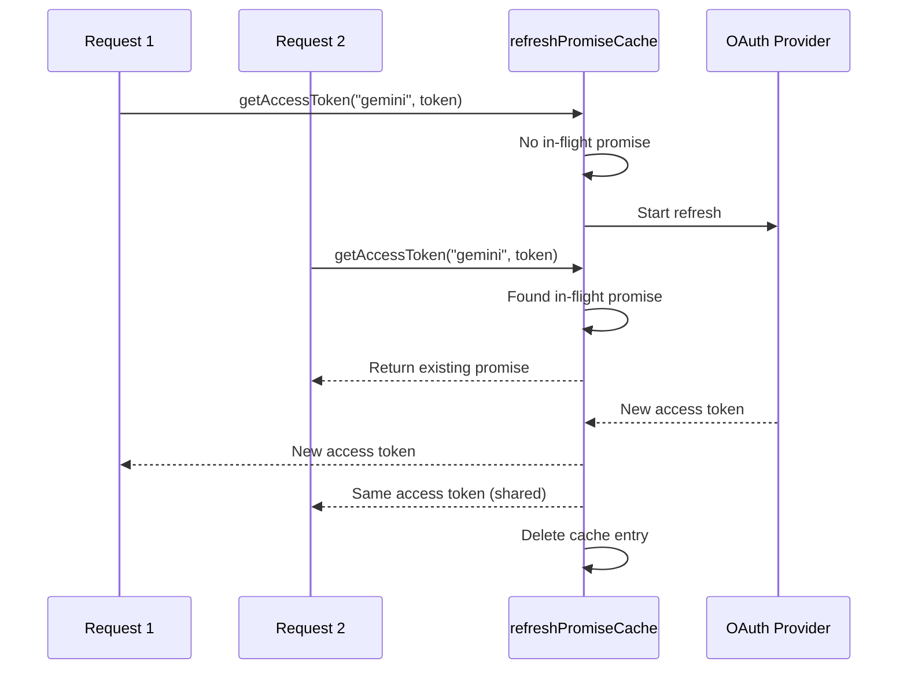

#### Macchina a stati di fallback dell'account

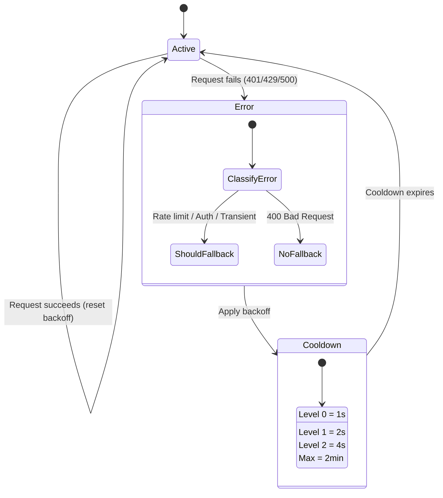

#### Catena modello combinato

```mermaid
flowchart LR
    A["Request with\ncombo model"] --> B["Model A"]
    B -->|"2xx Success"| C["Return response"]
    B -->|"429/401/500"| D{"Fallback\neligible?"}
    D -->|Yes| E["Model B"]
    D -->|No| F["Return error"]
    E -->|"2xx Success"| C
    E -->|"429/401/500"| G{"Fallback\neligible?"}
    G -->|Yes| H["Model C"]
    G -->|No| F
    H -->|"2xx Success"| C
    H -->|"Fail"| I["All failed →\nReturn last status"]
```

---

### 4.5 Traduttore (`open-sse/translator/`)

Il **motore di traduzione dei formati** che utilizza un sistema di plugin autoregistranti.

#### Architettura

```mermaid
graph TD
    subgraph "Request Translation"
        A["Claude → OpenAI"]
        B["Gemini → OpenAI"]
        C["Antigravity → OpenAI"]
        D["OpenAI Responses → OpenAI"]
        E["OpenAI → Claude"]
        F["OpenAI → Gemini"]
        G["OpenAI → Kiro"]
        H["OpenAI → Cursor"]
    end

    subgraph "Response Translation"
        I["Claude → OpenAI"]
        J["Gemini → OpenAI"]
        K["Kiro → OpenAI"]
        L["Cursor → OpenAI"]
        M["OpenAI → Claude"]
        N["OpenAI → Antigravity"]
        O["OpenAI → Responses"]
    end
```

| Elenco       | File         | Descrizione                                                                                                                                                                                                                                                                           |
| ------------ | ------------ | ------------------------------------------------------------------------------------------------------------------------------------------------------------------------------------------------------------------------------------------------------------------------------------- |
| `request/`   | 8 traduttori | Converti corpi di richiesta tra formati. Ogni file si registra automaticamente tramite `register(from, to, fn)` al momento dell'importazione.                                                                                                                                         |
| `response/`  | 7 traduttori | Converti blocchi di risposta in streaming tra formati. Gestisce tipi di eventi SSE, blocchi di pensiero, chiamate a strumenti.                                                                                                                                                        |
| `helpers/`   | 6 aiutanti   | Utilità condivise: `claudeHelper` (estrazione prompt di sistema, configurazione pensiero), `geminiHelper` (mappatura di parti/contenuti), `openaiHelper` (filtro formato), `toolCallHelper` (generazione ID, inserimento risposta mancante), `maxTokensHelper`, `responsesApiHelper`. |
| `index.ts`   | —            | Motore di traduzione: `translateRequest()`, `translateResponse()`, gestione dello stato, registro.                                                                                                                                                                                    |
| `formats.ts` | —            | Costanti di formato: `OPENAI`, `CLAUDE`, `GEMINI`, `ANTIGRAVITY`, `KIRO`, `CURSOR`, `OPENAI_RESPONSES`.                                                                                                                                                                               |

#### Progettazione chiave: plugin autoregistranti

```javascript
// Each translator file calls register() on import:
import { register } from "../index.js";
register("claude", "openai", translateClaudeToOpenAI);

// The index.js imports all translator files, triggering registration:
import "./request/claude-to-openai.js"; // ← self-registers
```

---

### 4.6 Utilità (`open-sse/utils/`)

| File               | Scopo                                                                                                                                                                                                                                                                                                                                                                    |
| ------------------ | ------------------------------------------------------------------------------------------------------------------------------------------------------------------------------------------------------------------------------------------------------------------------------------------------------------------------------------------------------------------------ |
| `error.ts`         | Creazione di risposte agli errori (formato compatibile con OpenAI), analisi degli errori upstream, estrazione del tempo di tentativo Antigravity dai messaggi di errore, streaming degli errori SSE.                                                                                                                                                                     |
| `stream.ts`        | **SSE Transform Stream**: la pipeline di streaming principale. Due modalità: `TRANSLATE` (traduzione del formato completo) e `PASSTHROUGH` (normalizza + estrai l'utilizzo). Gestisce il buffering dei blocchi, la stima dell'utilizzo, il monitoraggio della lunghezza del contenuto. Le istanze del codificatore/decodificatore per flusso evitano lo stato condiviso. |
| `streamHelpers.ts` | Utilità SSE di basso livello: `parseSSELine` (tollerante agli spazi bianchi), `hasValuableContent` (filtra blocchi vuoti per OpenAI/Claude/Gemini), `fixInvalidId`, `formatSSE` (serializzazione SSE compatibile con il formato con `perf_metrics` pulizia).                                                                                                             |
| `usageTracking.ts` | Estrazione dell'utilizzo dei token da qualsiasi formato (Claude/OpenAI/Gemini/Responses), stima con rapporti separati strumento/messaggio caratteri per token, aggiunta buffer (margine di sicurezza di 2000 token), filtraggio dei campi specifici del formato, registrazione della console con colori ANSI.                                                            |
| `requestLogger.ts` | Registrazione delle richieste basata su file (attivazione tramite `ENABLE_REQUEST_LOGS=true`). Crea cartelle di sessione con file numerati: `1_req_client.json` → `7_res_client.txt`. Tutto l'I/O è asincrono (fire-and-forget). Maschera le intestazioni riservate.                                                                                                     |
| `bypassHandler.ts` | Intercetta modelli specifici dalla CLI di Claude (estrazione del titolo, riscaldamento, conteggio) e restituisce risposte false senza chiamare alcun fornitore. Supporta sia lo streaming che il non streaming. Intenzionalmente limitato all'ambito CLI di Claude.                                                                                                      |
| `networkProxy.ts`  | Risolve l'URL proxy in uscita per un determinato provider con precedenza: configurazione specifica del provider → configurazione globale → variabili di ambiente (`HTTPS_PROXY`/`HTTP_PROXY`/`ALL_PROXY`). Supporta le esclusioni `NO_PROXY`. Configurazione della cache per 30 secondi.                                                                                 |

#### Pipeline di streaming SSE

```mermaid
flowchart TD
    A["Provider SSE stream"] --> B["TextDecoder\n(per-stream instance)"]
    B --> C["Buffer lines\n(split on newline)"]
    C --> D["parseSSELine()\n(trim whitespace, parse JSON)"]
    D --> E{"Mode?"}
    E -->|TRANSLATE| F["translateResponse()\ntarget → OpenAI → source"]
    E -->|PASSTHROUGH| G["fixInvalidId()\nnormalize chunk"]
    F --> H["hasValuableContent()\nfilter empty chunks"]
    G --> H
    H -->|"Has content"| I["extractUsage()\ntrack token counts"]
    H -->|"Empty"| J["Skip chunk"]
    I --> K["formatSSE()\nserialize + clean perf_metrics"]
    K --> L["TextEncoder\n(per-stream instance)"]
    L --> M["Enqueue to\nclient stream"]

    style A fill:#f9f,stroke:#333
    style M fill:#9f9,stroke:#333
```

#### Richiedi la struttura della sessione del logger

```
logs/
└── claude_gemini_claude-sonnet_20260208_143045/
    ├── 1_req_client.json      ← Raw client request
    ├── 2_req_source.json      ← After initial conversion
    ├── 3_req_openai.json      ← OpenAI intermediate format
    ├── 4_req_target.json      ← Final target format
    ├── 5_res_provider.txt     ← Provider SSE chunks (streaming)
    ├── 5_res_provider.json    ← Provider response (non-streaming)
    ├── 6_res_openai.txt       ← OpenAI intermediate chunks
    ├── 7_res_client.txt       ← Client-facing SSE chunks
    └── 6_error.json           ← Error details (if any)
```

---

### 4.7 Livello applicazione (`src/`)

| Elenco        | Scopo                                                                               |
| ------------- | ----------------------------------------------------------------------------------- |
| `src/app/`    | Interfaccia utente Web, percorsi API, middleware Express, gestori di callback OAuth |
| `src/lib/`    | Accesso al database (`localDb.ts`, `usageDb.ts`), autenticazione, condivisa         |
| `src/mitm/`   | Utilità proxy man-in-the-middle per intercettare il traffico del provider           |
| `src/models/` | Definizioni del modello di database                                                 |
| `src/shared/` | Wrapper attorno alle funzioni open-sse (provider, stream, errore, ecc.)             |
| `src/sse/`    | Gestori endpoint SSE che collegano la libreria open-sse alle rotte Express          |
| `src/store/`  | Gestione dello stato dell'applicazione                                              |

#### Percorsi API notevoli

| Itinerario                                    | Metodi                    | Scopo                                                                                                            |
| --------------------------------------------- | ------------------------- | ---------------------------------------------------------------------------------------------------------------- |
| `/api/provider-models`                        | OTTIENI/INVIA/ELIMINA     | CRUD per modelli personalizzati per fornitore                                                                    |
| `/api/models/catalog`                         | OTTIENI                   | Catalogo aggregato di tutti i modelli (chat, incorporamento, immagine, personalizzato) raggruppati per fornitore |
| `/api/settings/proxy`                         | OTTIENI/INSERISCI/ELIMINA | Configurazione proxy in uscita gerarchica (`global/providers/combos/keys`)                                       |
| `/api/settings/proxy/test`                    | POST                      | Convalida la connettività proxy e restituisce IP pubblico/latenza                                                |
| `/v1/providers/[provider]/chat/completions`   | POST                      | Completamenti chat dedicati per provider con convalida del modello                                               |
| `/v1/providers/[provider]/embeddings`         | POST                      | Incorporamenti dedicati per provider con convalida del modello                                                   |
| `/v1/providers/[provider]/images/generations` | POST                      | Generazione di immagini dedicate per provider con convalida del modello                                          |
| `/api/settings/ip-filter`                     | OTTIENI/METTI             | Gestione lista consentita/lista bloccata IP                                                                      |
| `/api/settings/thinking-budget`               | OTTIENI/METTI             | Configurazione del budget del token di ragionamento (passthrough/auto/custom/adaptive)                           |
| `/api/settings/system-prompt`                 | OTTIENI/METTI             | Iniezione rapida del sistema globale per tutte le richieste                                                      |
| `/api/sessions`                               | OTTIENI                   | Monitoraggio e metriche della sessione attiva                                                                    |
| `/api/rate-limits`                            | OTTIENI                   | Stato limite tariffa per account                                                                                 |

---

## 5. Modelli di progettazione chiave

### 5.1 Traduzione Hub-and-Spoke

Tutti i formati vengono tradotti tramite il **formato OpenAI come hub**. L'aggiunta di un nuovo provider richiede solo la scrittura di **una coppia** di traduttori (da/verso OpenAI), non N coppie.

### 5.2 Modello strategico dell'esecutore

Ogni provider dispone di una classe esecutore dedicata che eredita da `BaseExecutor`. La factory in `executors/index.ts` seleziona quella giusta in fase di runtime.

### 5.3 Sistema di plug-in di autoregistrazione

I moduli traduttore si registrano durante l'importazione tramite `register()`. Aggiungere un nuovo traduttore significa semplicemente creare un file e importarlo.

### 5.4 Fallback dell'account con backoff esponenziale

Quando un fornitore restituisce 429/401/500, il sistema può passare all'account successivo, applicando tempi di recupero esponenziali (1s → 2s → 4s → max 2min).

### 5.5 Catene modello combo

Una "combo" raggruppa più stringhe `provider/model`. Se il primo fallisce, passa automaticamente al successivo.

### 5.6 Traduzione dello streaming con stato

La traduzione della risposta mantiene lo stato tra i blocchi SSE (tracciamento dei blocchi di pensiero, accumulo di chiamate allo strumento, indicizzazione dei blocchi di contenuto) tramite il meccanismo `initState()`.

### 5.7 Buffer di sicurezza per l'utilizzo

Viene aggiunto un buffer da 2000 token all'utilizzo segnalato per impedire ai client di raggiungere i limiti della finestra di contesto a causa del sovraccarico derivante dai prompt di sistema e dalla conversione del formato.

---

## 6. Formati supportati

| Formato                   | Direzione            | Identificatore     |
| ------------------------- | -------------------- | ------------------ |
| Completamenti OpenAI Chat | fonte + destinazione | `openai`           |
| API di risposta OpenAI    | fonte + destinazione | `openai-responses` |
| Claude antropico          | fonte + destinazione | `claude`           |
| Google Gemelli            | fonte + destinazione | `gemini`           |
| CLI di Google Gemini      | solo obiettivo       | `gemini-cli`       |
| Antigravità               | fonte + destinazione | `antigravity`      |
| AWS Kiro                  | solo obiettivo       | `kiro`             |
| Cursore                   | solo obiettivo       | `cursor`           |

---

## 7. Provider supportati

| Fornitore                | Metodo di autenticazione | Esecutore testamentario | Note chiave                                              |
| ------------------------ | ------------------------ | ----------------------- | -------------------------------------------------------- |
| Claude antropico         | Chiave API o OAuth       | Predefinito             | Utilizza l'intestazione `x-api-key`                      |
| Google Gemelli           | Chiave API o OAuth       | Predefinito             | Utilizza l'intestazione `x-goog-api-key`                 |
| CLI di Google Gemini     | OAuth                    | GemelliCLI              | Utilizza l'endpoint `streamGenerateContent`              |
| Antigravità              | OAuth                    | Antigravità             | Fallback multi-URL, analisi dei tentativi personalizzata |
| OpenAI                   | Chiave API               | Predefinito             | Aut. alfiere                                             |
| Codice                   | OAuth                    | Codice                  | Inserisce istruzioni di sistema, gestisce il pensiero    |
| Copilota GitHub          | OAuth + token copilota   | Github                  | Doppio token, intestazione VSCode che imita              |
| Kiro (AWS)               | AWS SSO OIDC o Social    | Kiro                    | Analisi binaria EventStream                              |
| Cursore IDE              | Autenticazione checksum  | Cursore                 | Codifica Protobuf, checksum SHA-256                      |
| Qwen                     | OAuth                    | Predefinito             | Aut. standard                                            |
| iFlow                    | OAuth (base + portatore) | Predefinito             | Intestazione doppia autenticazione                       |
| OpenRouter               | Chiave API               | Predefinito             | Aut. alfiere                                             |
| GLM, Kimi, MiniMax       | Chiave API               | Predefinito             | Compatibile con Claude, usa `x-api-key`                  |
| `openai-compatible-*`    | Chiave API               | Predefinito             | Dinamico: qualsiasi endpoint compatibile con OpenAI      |
| `anthropic-compatible-*` | Chiave API               | Predefinito             | Dinamico: qualsiasi endpoint compatibile con Claude      |

---

## 8. Riepilogo del flusso di dati

### Richiesta di streaming

```mermaid
flowchart LR
    A["Client"] --> B["detectFormat()"]
    B --> C["translateRequest()\nsource → OpenAI → target"]
    C --> D["Executor\nbuildUrl + buildHeaders"]
    D --> E["fetch(providerURL)"]
    E --> F["createSSEStream()\nTRANSLATE mode"]
    F --> G["parseSSELine()"]
    G --> H["translateResponse()\ntarget → OpenAI → source"]
    H --> I["extractUsage()\n+ addBuffer"]
    I --> J["formatSSE()"]
    J --> K["Client receives\ntranslated SSE"]
    K --> L["logUsage()\nsaveRequestUsage()"]
```

### Richiesta di non streaming

```mermaid
flowchart LR
    A["Client"] --> B["detectFormat()"]
    B --> C["translateRequest()\nsource → OpenAI → target"]
    C --> D["Executor.execute()"]
    D --> E["translateResponse()\ntarget → OpenAI → source"]
    E --> F["Return JSON\nresponse"]
```

### Bypass flusso (Claude CLI)

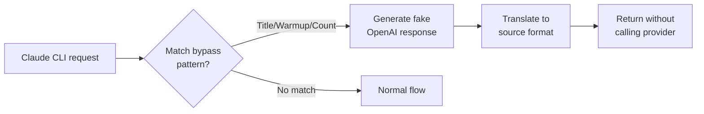
