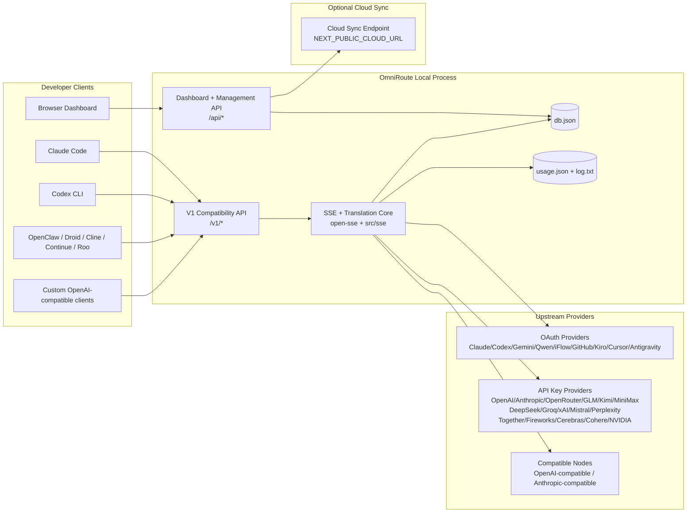
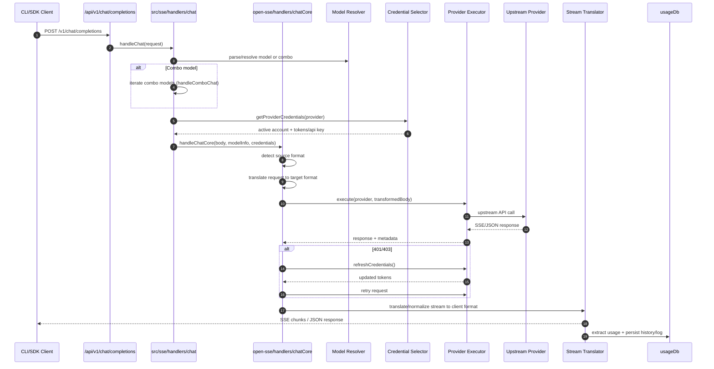
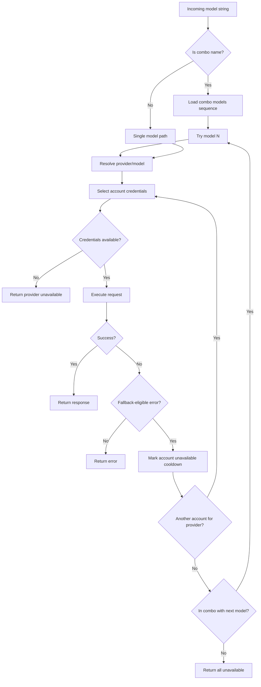
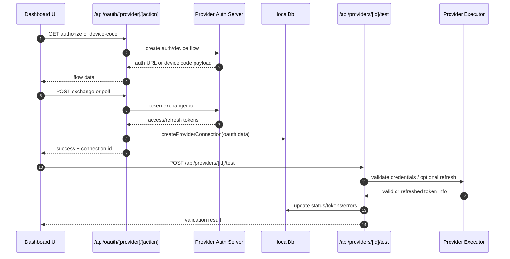
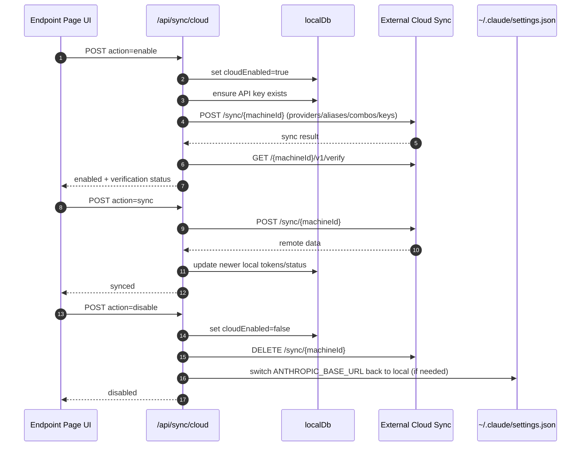
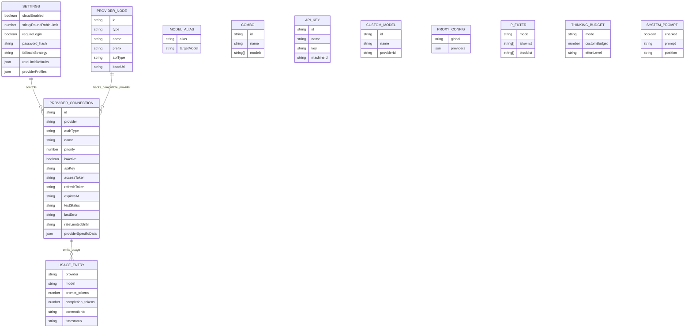
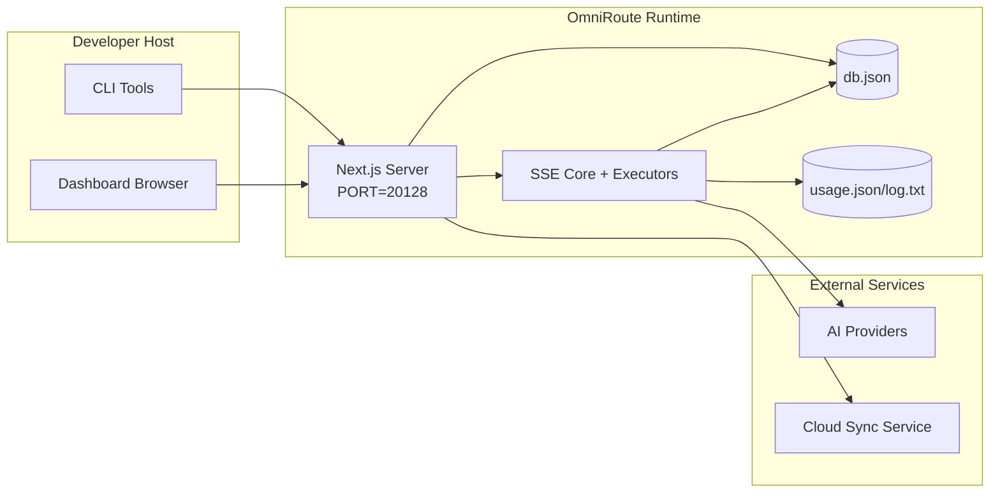

# オムニルート アーキテクチャ

🌐 **Languages:** 🇺🇸 [English](../../ARCHITECTURE.md) | 🇧🇷 [Português (Brasil)](../pt-BR/ARCHITECTURE.md) | 🇪🇸 [Español](../es/ARCHITECTURE.md) | 🇫🇷 [Français](../fr/ARCHITECTURE.md) | 🇮🇹 [Italiano](../it/ARCHITECTURE.md) | 🇷🇺 [Русский](../ru/ARCHITECTURE.md) | 🇨🇳 [中文 (简体)](../zh-CN/ARCHITECTURE.md) | 🇩🇪 [Deutsch](../de/ARCHITECTURE.md) | 🇮🇳 [हिन्दी](../in/ARCHITECTURE.md) | 🇹🇭 [ไทย](../th/ARCHITECTURE.md) | 🇺🇦 [Українська](../uk-UA/ARCHITECTURE.md) | 🇸🇦 [العربية](../ar/ARCHITECTURE.md) | 🇯🇵 [日本語](../ja/ARCHITECTURE.md) | 🇻🇳 [Tiếng Việt](../vi/ARCHITECTURE.md) | 🇧🇬 [Български](../bg/ARCHITECTURE.md) | 🇩🇰 [Dansk](../da/ARCHITECTURE.md) | 🇫🇮 [Suomi](../fi/ARCHITECTURE.md) | 🇮🇱 [עברית](../he/ARCHITECTURE.md) | 🇭🇺 [Magyar](../hu/ARCHITECTURE.md) | 🇮🇩 [Bahasa Indonesia](../id/ARCHITECTURE.md) | 🇰🇷 [한국어](../ko/ARCHITECTURE.md) | 🇲🇾 [Bahasa Melayu](../ms/ARCHITECTURE.md) | 🇳🇱 [Nederlands](../nl/ARCHITECTURE.md) | 🇳🇴 [Norsk](../no/ARCHITECTURE.md) | 🇵🇹 [Português (Portugal)](../pt/ARCHITECTURE.md) | 🇷🇴 [Română](../ro/ARCHITECTURE.md) | 🇵🇱 [Polski](../pl/ARCHITECTURE.md) | 🇸🇰 [Slovenčina](../sk/ARCHITECTURE.md) | 🇸🇪 [Svenska](../sv/ARCHITECTURE.md) | 🇵🇭 [Filipino](../phi/ARCHITECTURE.md)

_最終更新日: 2026-02-18_

## エグゼクティブサマリー

OmniRoute は、Next.js 上に構築されたローカル AI ルーティング ゲートウェイおよびダッシュボードです。
これは、単一の OpenAI 互換エンドポイント (`/v1/*`) を提供し、変換、フォールバック、トークン更新、および使用状況追跡を使用して複数の上流プロバイダー間でトラフィックをルーティングします。

コア機能:

- CLI/ツール用の OpenAI 互換 API サーフェス (28 プロバイダー)
- プロバイダ形式間でのリクエスト/レスポンスの変換
- モデル コンボ フォールバック (マルチモデル シーケンス)
- アカウントレベルのフォールバック (プロバイダーごとにマルチアカウント)
- OAuth + APIキープロバイダ接続管理
- `/v1/embeddings` による埋め込み生成 (6 プロバイダー、9 モデル)
- `/v1/images/generations` によるイメージ生成 (4 プロバイダー、9 モデル)
- 推論モデルのタグ解析 (`<think>...</think>`) を考える
- 厳密な OpenAI SDK 互換性のための応答のサニタイズ
- プロバイダー間の互換性のための役割の正規化 (開発者→システム、システム→ユーザー)
- 構造化出力変換 (json_schema → Gemini responseSchema)
- プロバイダー、キー、エイリアス、コンボ、設定、価格設定のローカル永続性
- 使用量/コストの追跡とリクエストのロギング
- マルチデバイス/状態同期のためのオプションのクラウド同期
- API アクセス制御用の IP 許可リスト/ブロックリスト
- 予算管理を考える (パススルー/自動/カスタム/アダプティブ)
- グローバル システム プロンプト インジェクション
- セッション追跡とフィンガープリンティング
- プロバイダー固有のプロファイルによるアカウントごとの強化されたレート制限
- プロバイダーの回復力を高めるサーキット ブレーカー パターン
- ミューテックスロックによるアンチサンダーリング保護
- 署名ベースのリクエスト重複排除キャッシュ
- ドメイン層: モデルの可用性、コスト ルール、フォールバック ポリシー、ロックアウト ポリシー
- ドメイン状態の永続性 (フォールバック、バジェット、ロックアウト、サーキット ブレーカー用の SQLite ライトスルー キャッシュ)
- リクエストを一元的に評価するためのポリシー エンジン (ロックアウト → 予算 → フォールバック)
- p50/p95/p99 レイテンシ集約を使用したテレメトリのリクエスト
- エンドツーエンド トレース用の相関 ID (X-Request-Id)
- API キーごとのオプトアウトによるコンプライアンス監査ログ
- LLM品質保証のための評価フレームワーク
- リアルタイムのサーキット ブレーカー ステータスを備えた Resilience UI ダッシュボード
- モジュラー OAuth プロバイダー (`src/lib/oauth/providers/` の下の 12 個の個別モジュール)

プライマリ ランタイム モデル:

- `src/app/api/*` の下の Next.js アプリ ルートは、ダッシュボード API と互換性 API の両方を実装します
- `src/sse/*` + `open-sse/*` の共有 SSE/ルーティング コアは、プロバイダーの実行、変換、ストリーミング、フォールバック、および使用法を処理します。

## 範囲と境界

### 範囲内

- ローカルゲートウェイランタイム
- ダッシュボード管理 API
- プロバイダー認証とトークンの更新
- 翻訳と SSE ストリーミングのリクエスト
- ローカル状態 + 使用状況の永続性
- オプションのクラウド同期オーケストレーション

### 範囲外

- `NEXT_PUBLIC_CLOUD_URL` の背後にあるクラウド サービスの実装
- ローカル プロセス外のプロバイダー SLA/コントロール プレーン
- 外部 CLI バイナリ自体 (Claude CLI、Codex CLI など)

## 高レベルのシステムコンテキスト



## コア ランタイム コンポーネント

## 1) API とルーティング レイヤー (Next.js アプリ ルート)

メインディレクトリ:

- `src/app/api/v1/*` および `src/app/api/v1beta/*` (互換性 API)
- `src/app/api/*` 管理/構成 API 用
- 次に、`next.config.mjs` で書き換えて、`/v1/*` を `/api/v1/*` にマップします。

重要な互換性ルート:

- `src/app/api/v1/chat/completions/route.ts`
- `src/app/api/v1/messages/route.ts`
- `src/app/api/v1/responses/route.ts`
- `src/app/api/v1/models/route.ts` — `custom: true` のカスタム モデルが含まれます
- `src/app/api/v1/embeddings/route.ts` — 埋め込み生成 (6 プロバイダー)
- `src/app/api/v1/images/generations/route.ts` — 画像生成 (Antigravity/Nebius を含む 4 つ以上のプロバイダー)
- `src/app/api/v1/messages/count_tokens/route.ts`
- `src/app/api/v1/providers/[provider]/chat/completions/route.ts` — プロバイダーごとの専用チャット
- `src/app/api/v1/providers/[provider]/embeddings/route.ts` — プロバイダーごとの専用埋め込み
- `src/app/api/v1/providers/[provider]/images/generations/route.ts` — プロバイダーごとの専用イメージ
- `src/app/api/v1beta/models/route.ts`
- `src/app/api/v1beta/models/[...path]/route.ts`

管理ドメイン:

- 認証/設定: `src/app/api/auth/*`、`src/app/api/settings/*`
- プロバイダー/接続: `src/app/api/providers*`
- プロバイダーノード: `src/app/api/provider-nodes*`
- カスタム モデル: `src/app/api/provider-models` (GET/POST/DELETE)
- モデルカタログ: `src/app/api/models/catalog` (GET)
- プロキシ構成: `src/app/api/settings/proxy` (GET/PUT/DELETE) + `src/app/api/settings/proxy/test` (POST)
- OAuth: `src/app/api/oauth/*`
- キー/エイリアス/コンボ/価格: `src/app/api/keys*`、`src/app/api/models/alias`、`src/app/api/combos*`、`src/app/api/pricing`
- 使用法: `src/app/api/usage/*`
- 同期/クラウド: `src/app/api/sync/*`、`src/app/api/cloud/*`
- CLI ツールヘルパー: `src/app/api/cli-tools/*`
- IP フィルター: `src/app/api/settings/ip-filter` (GET/PUT)
- 検討予算: `src/app/api/settings/thinking-budget` (GET/PUT)
- システム プロンプト: `src/app/api/settings/system-prompt` (GET/PUT)
- セッション: `src/app/api/sessions` (GET)
- レート制限: `src/app/api/rate-limits` (GET)
- 復元力: `src/app/api/resilience` (GET/PATCH) — プロバイダー プロファイル、サーキット ブレーカー、レート制限状態
- レジリエンスのリセット: `src/app/api/resilience/reset` (POST) — ブレーカー + クールダウンをリセット
- キャッシュ統計: `src/app/api/cache/stats` (GET/DELETE)
- 利用可能なモデル: `src/app/api/models/availability` (GET/POST)
- テレメトリ: `src/app/api/telemetry/summary` (GET)
- 予算: `src/app/api/usage/budget` (GET/POST)
- フォールバック チェーン: `src/app/api/fallback/chains` (GET/POST/DELETE)
- コンプライアンス監査: `src/app/api/compliance/audit-log` (GET)
- Evals: `src/app/api/evals` (GET/POST)、`src/app/api/evals/[suiteId]` (GET)
- ポリシー: `src/app/api/policies` (GET/POST)

## 2) SSE + 翻訳コア

メインフローモジュール:

- エントリ: `src/sse/handlers/chat.ts`
- コアオーケストレーション: `open-sse/handlers/chatCore.ts`
- プロバイダー実行アダプター: `open-sse/executors/*`
- フォーマット検出/プロバイダー構成: `open-sse/services/provider.ts`
- モデル解析/解決: `src/sse/services/model.ts`、`open-sse/services/model.ts`
- アカウントのフォールバック ロジック: `open-sse/services/accountFallback.ts`
- 翻訳レジストリ: `open-sse/translator/index.ts`
- ストリーム変換: `open-sse/utils/stream.ts`、`open-sse/utils/streamHandler.ts`
- 使用量の抽出/正規化: `open-sse/utils/usageTracking.ts`
- シンクタグパーサー: `open-sse/utils/thinkTagParser.ts`
- 埋め込みハンドラー: `open-sse/handlers/embeddings.ts`
- 埋め込みプロバイダー レジストリ: `open-sse/config/embeddingRegistry.ts`
- 画像生成ハンドラー: `open-sse/handlers/imageGeneration.ts`
- イメージプロバイダーレジストリ: `open-sse/config/imageRegistry.ts`
- 応答のサニタイズ: `open-sse/handlers/responseSanitizer.ts`
- ロールの正規化: `open-sse/services/roleNormalizer.ts`

サービス (ビジネス ロジック):

- アカウントの選択/スコアリング: `open-sse/services/accountSelector.ts`
- コンテキストのライフサイクル管理: `open-sse/services/contextManager.ts`
- IP フィルターの適用: `open-sse/services/ipFilter.ts`
- セッション追跡: `open-sse/services/sessionManager.ts`
- 重複排除のリクエスト: `open-sse/services/signatureCache.ts`
- システムプロンプトインジェクション: `open-sse/services/systemPrompt.ts`
- 予算管理を考える: `open-sse/services/thinkingBudget.ts`
- ワイルドカード モデル ルーティング: `open-sse/services/wildcardRouter.ts`
- レート制限管理: `open-sse/services/rateLimitManager.ts`
- サーキットブレーカー: `open-sse/services/circuitBreaker.ts`

ドメイン層モジュール:

- 利用可能なモデル: `src/lib/domain/modelAvailability.ts`
- コストルール/予算: `src/lib/domain/costRules.ts`
- フォールバック ポリシー: `src/lib/domain/fallbackPolicy.ts`
- コンボリゾルバー: `src/lib/domain/comboResolver.ts`
- ロックアウト ポリシー: `src/lib/domain/lockoutPolicy.ts`
- ポリシー エンジン: `src/domain/policyEngine.ts` — 集中ロックアウト → 予算 → フォールバック評価
- エラーコードカタログ: `src/lib/domain/errorCodes.ts`
- リクエストID: `src/lib/domain/requestId.ts`
- フェッチタイムアウト: `src/lib/domain/fetchTimeout.ts`
- テレメトリのリクエスト: `src/lib/domain/requestTelemetry.ts`
- コンプライアンス/監査: `src/lib/domain/compliance/index.ts`
- 評価ランナー: `src/lib/domain/evalRunner.ts`
- ドメイン状態の永続性: `src/lib/db/domainState.ts` — フォールバック チェーン、予算、コスト履歴、ロックアウト状態、サーキット ブレーカー用の SQLite CRUD

OAuth プロバイダー モジュール (`src/lib/oauth/providers/` の下の 12 個の個別ファイル):

- レジストリ インデックス: `src/lib/oauth/providers/index.ts`
- 個別プロバイダー: `claude.ts`、`codex.ts`、`gemini.ts`、`antigravity.ts`、`iflow.ts`、`qwen.ts`、`kimi-coding.ts`、`github.ts`、 `kiro.ts`、`cursor.ts`、`kilocode.ts`、`cline.ts`
- 薄いラッパー: `src/lib/oauth/providers.ts` — 個々のモジュールからの再エクスポート

## 3) 永続層

プライマリ状態 DB:

- `src/lib/localDb.ts`
- ファイル: `${DATA_DIR}/db.json` (設定されている場合は `$XDG_CONFIG_HOME/omniroute/db.json`、それ以外の場合は `~/.omniroute/db.json`)
- エンティティ: ProviderConnections、providerNodes、modelAliases、コンボ、apiKeys、設定、価格設定、**customModels**、**proxyConfig**、**ipFilter**、** ThinkingBudget**、**systemPrompt**

使用状況DB:

- `src/lib/usageDb.ts`
- ファイル: `${DATA_DIR}/usage.json`、`${DATA_DIR}/log.txt`、`${DATA_DIR}/call_logs/`
- `localDb` と同じベース ディレクトリ ポリシーに従います (`DATA_DIR`、設定されている場合は `XDG_CONFIG_HOME/omniroute`)
- 重点的なサブモジュールに分解: `migrations.ts`、`usageHistory.ts`、`costCalculator.ts`、`usageStats.ts`、`callLogs.ts`

ドメイン状態 DB (SQLite):

- `src/lib/db/domainState.ts` — ドメイン状態の CRUD 操作
- テーブル (`src/lib/db/core.ts` で作成): `domain_fallback_chains`、`domain_budgets`、`domain_cost_history`、`domain_lockout_state`、`domain_circuit_breakers`
- ライトスルー キャッシュ パターン: メモリ内マップは実行時に権限を持ちます。変更は SQLite に同期的に書き込まれます。状態はコールド スタート時に DB から復元されます

## 4) 認証 + セキュリティ サーフェス

- ダッシュボード Cookie 認証: `src/proxy.ts`、`src/app/api/auth/login/route.ts`
- API キーの生成/検証: `src/shared/utils/apiKey.ts`
- プロバイダーのシークレットは `providerConnections` エントリに保持されます
- `open-sse/utils/proxyFetch.ts` (環境変数) および `open-sse/utils/networkProxy.ts` (プロバイダーごとまたはグローバルに構成可能) による送信プロキシのサポート

## 5) クラウド同期

- スケジューラの初期化: `src/lib/initCloudSync.ts`、`src/shared/services/initializeCloudSync.ts`
- 定期タスク: `src/shared/services/cloudSyncScheduler.ts`
- 制御ルート: `src/app/api/sync/cloud/route.ts`

## リクエストのライフサイクル (`/v1/chat/completions`)



## コンボ + アカウントのフォールバック フロー



フォールバックの決定は、ステータス コードとエラー メッセージのヒューリスティックを使用して、`open-sse/services/accountFallback.ts` によって行われます。

## OAuth オンボーディングとトークン更新のライフサイクル



ライブ トラフィック中の更新は、エグゼキュータ `refreshCredentials()` を介して `open-sse/handlers/chatCore.ts` 内で実行されます。

## クラウド同期ライフサイクル (有効化/同期/無効化)



クラウドが有効な場合、定期的な同期は `CloudSyncScheduler` によってトリガーされます。

## データモデルとストレージマップ



物理ストレージ ファイル:

- メイン状態: `${DATA_DIR}/db.json` (設定されている場合は `$XDG_CONFIG_HOME/omniroute/db.json`、それ以外の場合は `~/.omniroute/db.json`)
- 使用状況統計: `${DATA_DIR}/usage.json`
- リクエストログ行: `${DATA_DIR}/log.txt`
- オプションのトランスレータ/リクエスト デバッグ セッション: `<repo>/logs/...`

## デプロイメントトポロジ



## モジュール マッピング (意思決定が重要)

### ルートと API モジュール

- `src/app/api/v1/*`、`src/app/api/v1beta/*`: 互換性 API
- `src/app/api/v1/providers/[provider]/*`: プロバイダーごとの専用ルート (チャット、埋め込み、画像)
- `src/app/api/providers*`: プロバイダー CRUD、検証、テスト
- `src/app/api/provider-nodes*`: カスタム互換ノード管理
- `src/app/api/provider-models`: カスタム モデル管理 (CRUD)
- `src/app/api/models/catalog`: 完全なモデル カタログ API (プロバイダーごとにグループ化されたすべてのタイプ)
- `src/app/api/oauth/*`: OAuth/デバイスコードフロー
- `src/app/api/keys*`: ローカル API キーのライフサイクル
- `src/app/api/models/alias`: エイリアス管理
- `src/app/api/combos*`: フォールバック コンボ管理
- `src/app/api/pricing`: コスト計算のための価格設定の上書き
- `src/app/api/settings/proxy`: プロキシ構成 (GET/PUT/DELETE)
- `src/app/api/settings/proxy/test`: 送信プロキシ接続テスト (POST)
- `src/app/api/usage/*`: 使用状況とログ API
- `src/app/api/sync/*` + `src/app/api/cloud/*`: クラウド同期およびクラウド対応ヘルパー
- `src/app/api/cli-tools/*`: ローカル CLI 構成ライター/チェッカー
- `src/app/api/settings/ip-filter`: IP 許可リスト/ブロックリスト (GET/PUT)
- `src/app/api/settings/thinking-budget`: 思考トークン予算構成 (GET/PUT)
- `src/app/api/settings/system-prompt`: グローバル システム プロンプト (GET/PUT)
- `src/app/api/sessions`: アクティブなセッションのリスト (GET)
- `src/app/api/rate-limits`: アカウントごとのレート制限ステータス (GET)

### ルーティングおよび実行コア

- `src/sse/handlers/chat.ts`: リクエスト解析、コンボ処理、アカウント選択ループ
- `open-sse/handlers/chatCore.ts`: 変換、実行プログラムのディスパッチ、再試行/リフレッシュ処理、ストリームのセットアップ
- `open-sse/executors/*`: プロバイダー固有のネットワークと形式の動作

### 翻訳レジストリとフォーマットコンバータ

- `open-sse/translator/index.ts`: トランスレータ レジストリとオーケストレーション
- 翻訳者のリクエスト: `open-sse/translator/request/*`
- 応答翻訳者: `open-sse/translator/response/*`
- フォーマット定数: `open-sse/translator/formats.ts`

### 永続性

- `src/lib/localDb.ts`: 永続的な構成/状態
- `src/lib/usageDb.ts`: 使用履歴とローリングリクエストログ

## Provider Executor カバレッジ (戦略パターン)

各プロバイダーには、`BaseExecutor` (`open-sse/executors/base.ts` 内) を拡張する特殊なエグゼキューターがあり、URL の構築、ヘッダーの構築、指数バックオフによる再試行、資格情報の更新フック、および `execute()` オーケストレーション メソッドを提供します。

| 執行者                | プロバイダー                                                                                                                                                 | 特殊な取り扱い                                                               |
| --------------------- | ------------------------------------------------------------------------------------------------------------------------------------------------------------ | ---------------------------------------------------------------------------- |
| `DefaultExecutor`     | OpenAI、Claude、Gemini、Qwen、iFlow、OpenRouter、GLM、Kimi、MiniMax、DeepSeek、Groq、xAI、Mistral、Perplexity、Togetter、Fireworks、Cerebros、Cohere、NVIDIA | プロバイダーごとの動的 URL/ヘッダー構成                                      |
| `AntigravityExecutor` | Google 反重力                                                                                                                                                | カスタム プロジェクト/セッション ID、解析後の再試行                          |
| `CodexExecutor`       | OpenAI コーデックス                                                                                                                                          | システム命令を挿入し、推論努力を強制する                                     |
| `CursorExecutor`      | カーソルIDE                                                                                                                                                  | ConnectRPC プロトコル、Protobuf エンコーディング、チェックサムによる要求署名 |
| `GithubExecutor`      | GitHub コパイロット                                                                                                                                          | コパイロット トークンの更新、VSCode を模倣したヘッダー                       |
| `KiroExecutor`        | AWS CodeWhisperer/Kiro                                                                                                                                       | AWS EventStream バイナリ形式 → SSE 変換                                      |
| `GeminiCLIExecutor`   | ジェミニ CLI                                                                                                                                                 | Google OAuth トークンの更新サイクル                                          |

他のすべてのプロバイダー (カスタム互換ノードを含む) は `DefaultExecutor` を使用します。

## プロバイダー互換性マトリックス

| プロバイダー          | フォーマット       | 認証                          | ストリーム              | 非ストリーム | トークンのリフレッシュ | 使用法 API                    |
| --------------------- | ------------------ | ----------------------------- | ----------------------- | ------------ | ---------------------- | ----------------------------- |
| クロード              | クロード           | APIキー/OAuth                 | ✅                      | ✅           | ✅                     | ⚠️管理者のみ                  |
| ジェミニ              | ジェミニ           | APIキー/OAuth                 | ✅                      | ✅           | ✅                     | ⚠️クラウドコンソール          |
| ジェミニ CLI          | ジェミニクリ       | OAuth                         | ✅                      | ✅           | ✅                     | ⚠️クラウドコンソール          |
| 反重力                | 反重力             | OAuth                         | ✅                      | ✅           | ✅                     | ✅ フルクォータ API           |
| オープンAI            | オープンナイ       | APIキー                       | ✅                      | ✅           | ❌                     | ❌                            |
| コーデックス          | オープンナイの応答 | OAuth                         | ✅強制                  | ❌           | ✅                     | ✅ レート制限                 |
| GitHub コパイロット   | オープンナイ       | OAuth + コパイロット トークン | ✅                      | ✅           | ✅                     | ✅ クォータのスナップショット |
| カーソル              | カーソル           | カスタムチェックサム          | ✅                      | ✅           | ❌                     | ❌                            |
| キロ                  | キロ               | AWS SSO OIDC                  | ✅ (イベントストリーム) | ❌           | ✅                     | ✅ 使用制限                   |
| クウェン              | オープンナイ       | OAuth                         | ✅                      | ✅           | ✅                     | ⚠️リクエストに応じて          |
| iFlow                 | オープンナイ       | OAuth (基本)                  | ✅                      | ✅           | ✅                     | ⚠️リクエストに応じて          |
| オープンルーター      | オープンナイ       | APIキー                       | ✅                      | ✅           | ❌                     | ❌                            |
| GLM/キミ/ミニマックス | クロード           | APIキー                       | ✅                      | ✅           | ❌                     | ❌                            |
| ディープシーク        | オープンナイ       | APIキー                       | ✅                      | ✅           | ❌                     | ❌                            |
| グロク                | オープンナイ       | APIキー                       | ✅                      | ✅           | ❌                     | ❌                            |
| xAI (グロック)        | オープンナイ       | APIキー                       | ✅                      | ✅           | ❌                     | ❌                            |
| ミストラル            | オープンナイ       | APIキー                       | ✅                      | ✅           | ❌                     | ❌                            |
| 困惑                  | オープンナイ       | APIキー                       | ✅                      | ✅           | ❌                     | ❌                            |
| 一緒にAI              | オープンナイ       | APIキー                       | ✅                      | ✅           | ❌                     | ❌                            |
| 花火AI                | オープンナイ       | APIキー                       | ✅                      | ✅           | ❌                     | ❌                            |
| 大脳                  | オープンナイ       | APIキー                       | ✅                      | ✅           | ❌                     | ❌                            |
| コヒア                | オープンナイ       | APIキー                       | ✅                      | ✅           | ❌                     | ❌                            |
| NVIDIA NIM            | オープンナイ       | APIキー                       | ✅                      | ✅           | ❌                     | ❌                            |

## フォーマット翻訳の範囲

検出されたソース形式は次のとおりです。

- `openai`
- `openai-responses`
- `claude`
- `gemini`

対象となる形式は次のとおりです。

- OpenAI チャット/応答
- クロード
- ジェミニ/ジェミニ-CLI/反重力エンベロープ
- キロ
- カーソル

翻訳では **OpenAI をハブ形式**として使用します。すべての変換は中間として OpenAI を経由します。

```
Source Format → OpenAI (hub) → Target Format
```

翻訳は、ソース ペイロードの形状とプロバイダーのターゲット形式に基づいて動的に選択されます。

翻訳パイプラインの追加の処理レイヤー:

- **レスポンスのサニタイズ** — OpenAI 形式のレスポンス (ストリーミングと非ストリーミングの両方) から非標準フィールドを削除し、厳密な SDK コンプライアンスを確保します。
- **ロールの正規化** — 非 OpenAI ターゲットの場合は `developer` → `system` を変換します。システムロールを拒否するモデル (GLM、ERNIE) の `system` → `user` をマージします。
- **思考タグ抽出** — コンテンツから `<think>...</think>` ブロックを解析して `reasoning_content` フィールドに変換します
- **構造化出力** — OpenAI `response_format.json_schema` を Gemini の `responseMimeType` + `responseSchema` に変換します

## サポートされる API エンドポイント

| エンドポイント                                     | フォーマット          | ハンドラー                                                |
| -------------------------------------------------- | --------------------- | --------------------------------------------------------- |
| `POST /v1/chat/completions`                        | OpenAIチャット        | `src/sse/handlers/chat.ts`                                |
| `POST /v1/messages`                                | クロードのメッセージ  | 同じハンドラー (自動検出)                                 |
| `POST /v1/responses`                               | OpenAI の応答         | `open-sse/handlers/responsesHandler.ts`                   |
| `POST /v1/embeddings`                              | OpenAI 埋め込み       | `open-sse/handlers/embeddings.ts`                         |
| `GET /v1/embeddings`                               | モデル一覧            | APIルート                                                 |
| `POST /v1/images/generations`                      | OpenAI 画像           | `open-sse/handlers/imageGeneration.ts`                    |
| `GET /v1/images/generations`                       | モデル一覧            | APIルート                                                 |
| `POST /v1/providers/{provider}/chat/completions`   | OpenAIチャット        | モデル検証を備えた専用のプロバイダーごと                  |
| `POST /v1/providers/{provider}/embeddings`         | OpenAI 埋め込み       | モデル検証を備えた専用のプロバイダーごと                  |
| `POST /v1/providers/{provider}/images/generations` | OpenAI 画像           | モデル検証を備えた専用のプロバイダーごと                  |
| `POST /v1/messages/count_tokens`                   | クロードトークン数    | APIルート                                                 |
| `GET /v1/models`                                   | OpenAI モデルのリスト | API ルート (チャット + 埋め込み + 画像 + カスタム モデル) |
| `GET /api/models/catalog`                          | カタログ              | プロバイダー + タイプごとにグループ化されたすべてのモデル |
| `POST /v1beta/models/*:streamGenerateContent`      | 双子座出身            | APIルート                                                 |
| `GET/PUT/DELETE /api/settings/proxy`               | プロキシ構成          | ネットワークプロキシ構成                                  |
| `POST /api/settings/proxy/test`                    | プロキシ接続          | プロキシの健全性/接続テスト エンドポイント                |
| `GET/POST/DELETE /api/provider-models`             | カスタムモデル        | プロバイダーごとのカスタム モデル管理                     |

## バイパスハンドラー

バイパス ハンドラー (`open-sse/utils/bypassHandler.ts`) は、Claude CLI からの既知の「使い捨て」リクエスト (ウォームアップ ping、タイトル抽出、トークン カウント) をインターセプトし、アップストリーム プロバイダー トークンを消費せずに **偽の応答** を返します。これは、`User-Agent` に `claude-cli` が含まれている場合にのみトリガーされます。

## リクエストロガーパイプライン

リクエスト ロガー (`open-sse/utils/requestLogger.ts`) は、7 段階のデバッグ ロギング パイプラインを提供します。デフォルトでは無効になっており、`ENABLE_REQUEST_LOGS=true` によって有効になります。

```
1_req_client.json → 2_req_source.json → 3_req_openai.json → 4_req_target.json
→ 5_res_provider.txt → 6_res_openai.txt → 7_res_client.txt
```

ファイルはリクエスト セッションごとに `<repo>/logs/<session>/` に書き込まれます。

## 障害モードと回復力

## 1) アカウント/プロバイダーの可用性

- 一時的/レート/認証エラー時のプロバイダー アカウントのクールダウン
- リクエストが失敗する前のアカウントのフォールバック
- 現在のモデル/プロバイダー パスが枯渇した場合のコンボ モデル フォールバック

## 2) トークンの有効期限

- 更新可能なプロバイダーの事前チェックと再試行による更新
- コア パスでの更新試行後の 401/403 再試行

## 3) ストリームの安全性

- 切断対応ストリーム コントローラー
- ストリーム終了フラッシュと `[DONE]` 処理を備えた変換ストリーム
- プロバイダーの使用量メタデータが欠落している場合の使用量推定フォールバック

## 4) クラウド同期の低下

- 同期エラーが表面化しましたが、ローカル ランタイムは継続します
- スケジューラには再試行可能なロジックがありますが、定期的な実行では現在、デフォルトで単一試行同期が呼び出されます。

## 5) データの整合性

- DB 形状の移行/欠落キーの修復
- localDb と useDb に対する破損した JSON リセットの保護策

## 可観測性と動作信号

実行時の可視性ソース:

- `src/sse/utils/logger.ts` からのコンソール ログ
- `usage.json` でのリクエストごとの使用量の集計
- `log.txt` のテキスト形式のリクエスト ステータス ログ
- `ENABLE_REQUEST_LOGS=true` の場合、`logs/` の下のオプションの詳細なリクエスト/変換ログ
- UI 消費のためのダッシュボード使用エンドポイント (`/api/usage/*`)

## セキュリティに注意が必要な境界

- JWT シークレット (`JWT_SECRET`) により、ダッシュボード セッションの Cookie 検証/署名が保護されます
- 初期パスワード フォールバック (`INITIAL_PASSWORD`、デフォルト `123456`) は実際のデプロイメントではオーバーライドする必要があります
- API キー HMAC シークレット (`API_KEY_SECRET`) は、生成されたローカル API キー形式を保護します
- プロバイダーのシークレット (API キー/トークン) はローカル DB に保存され、ファイルシステム レベルで保護される必要があります。
- クラウド同期エンドポイントは、API キー認証 + マシン ID セマンティクスに依存します。

## 環境とランタイムのマトリックス

コードによってアクティブに使用される環境変数:

- アプリ/認証: `JWT_SECRET`、`INITIAL_PASSWORD`
- ストレージ: `DATA_DIR`
- 互換性のあるノードの動作: `ALLOW_MULTI_CONNECTIONS_PER_COMPAT_NODE`
- オプションのストレージ ベース オーバーライド (Linux/macOS `DATA_DIR` が設定されていない場合): `XDG_CONFIG_HOME`
- セキュリティハッシュ: `API_KEY_SECRET`、`MACHINE_ID_SALT`
- ロギング: `ENABLE_REQUEST_LOGS`
- 同期/クラウド URL: `NEXT_PUBLIC_BASE_URL`、`NEXT_PUBLIC_CLOUD_URL`
- 送信プロキシ: `HTTP_PROXY`、`HTTPS_PROXY`、`ALL_PROXY`、`NO_PROXY` および小文字のバリアント
- SOCKS5 機能フラグ: `ENABLE_SOCKS5_PROXY`、`NEXT_PUBLIC_ENABLE_SOCKS5_PROXY`
- プラットフォーム/ランタイム ヘルパー (アプリ固有の構成ではない): `APPDATA`、`NODE_ENV`、`PORT`、`HOSTNAME`

## 既知のアーキテクチャに関するメモ

1. `usageDb` と `localDb` は、レガシー ファイル移行と同じベース ディレクトリ ポリシー (`DATA_DIR` -> `XDG_CONFIG_HOME/omniroute` -> `~/.omniroute`) を共有するようになりました。
2. `/api/v1/route.ts` は静的モデル リストを返しますが、`/v1/models` によって使用されるメイン モデル ソースではありません。
3. リクエスト ロガーは有効な場合、完全なヘッダー/本文を書き込みます。ログ ディレクトリを機密として扱います。
4. クラウドの動作は、正しい `NEXT_PUBLIC_BASE_URL` とクラウド エンドポイントの到達可能性に依存します。
5. `open-sse/` ディレクトリは、`@omniroute/open-sse` **npm ワークスペース パッケージ**として公開されます。ソース コードは `@omniroute/open-sse/...` 経由でインポートします (Next.js `transpilePackages` によって解決されます)。このドキュメントのファイル パスでは、一貫性を保つために引き続きディレクトリ名 `open-sse/` が使用されています。
6. ダッシュボードのグラフでは、**Recharts** (SVG ベース) を使用して、アクセスしやすく対話型の分析を視覚化します (モデル使用状況の棒グラフ、成功率を示すプロバイダーの内訳表)。
7. E2E テストは **Playwright** (`tests/e2e/`) を使用し、`npm run test:e2e` 経由で実行します。単体テストは **Node.js テスト ランナー** (`tests/unit/`) を使用し、`npm run test:plan3` 経由で実行されます。 `src/` のソース コードは **TypeScript** (`.ts`/`.tsx`) です。 `open-sse/` ワークスペースは JavaScript (`.js`) のままです。
8. 設定ページは 5 つのタブで構成されています: セキュリティ、ルーティング (6 つのグローバル戦略: フィルファースト、ラウンドロビン、p2c、ランダム、最小使用、コスト最適化)、復元力 (編集可能なレート制限、サーキット ブレーカー、ポリシー)、AI (思考予算、システム プロンプト、プロンプト キャッシュ)、詳細 (プロキシ)。

## 動作検証チェックリスト

- ソースからビルド: `npm run build`
- Docker イメージのビルド: `docker build -t omniroute .`
- サービスを開始して以下を確認します。
- `GET /api/settings`
- `GET /api/v1/models`
- `PORT=20128` の場合、CLI ターゲット ベース URL は `http://<host>:20128/v1` である必要があります。
