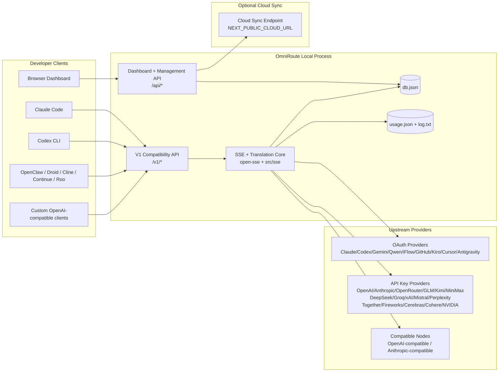
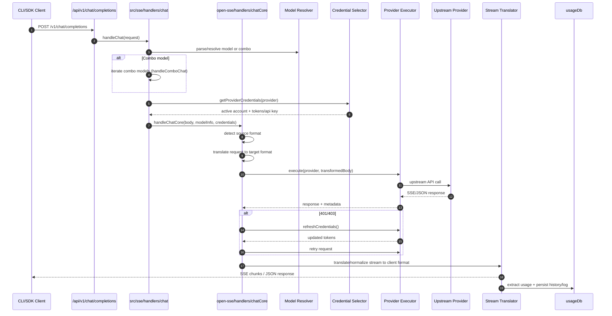
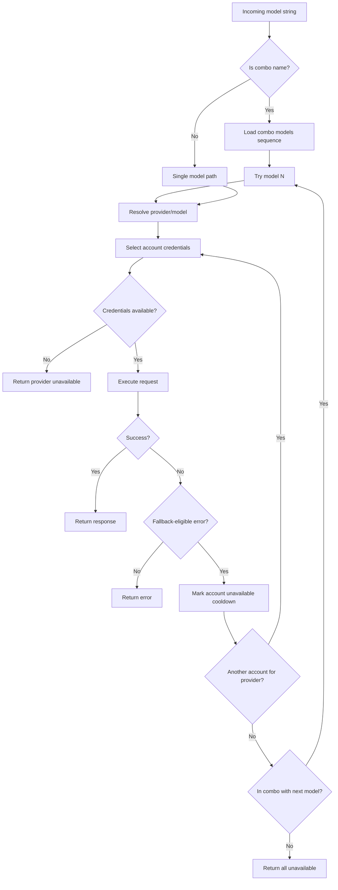
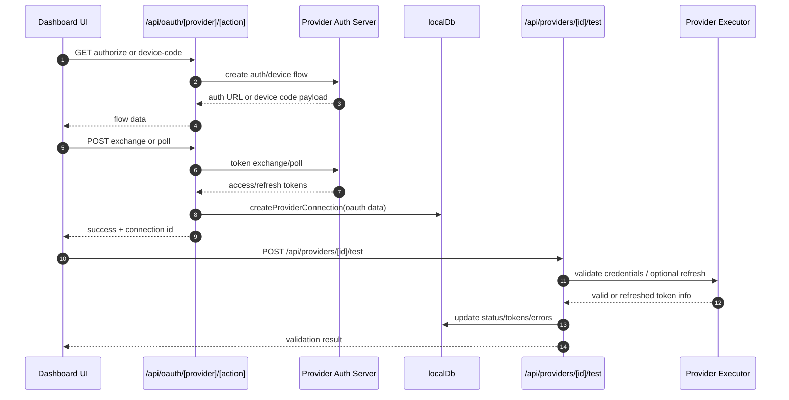
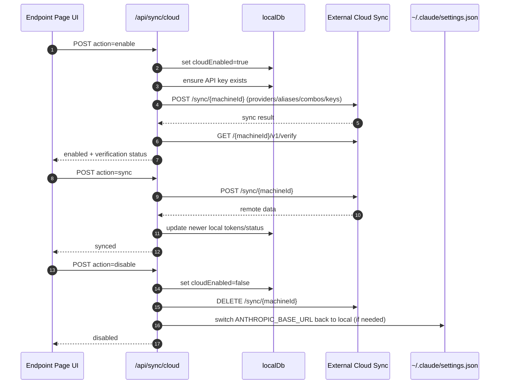
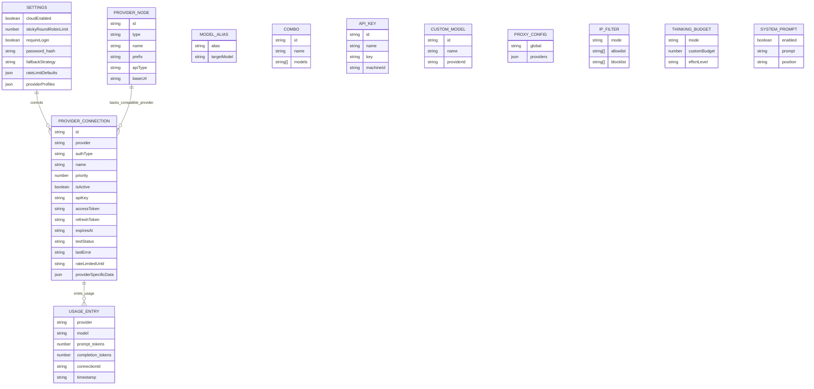
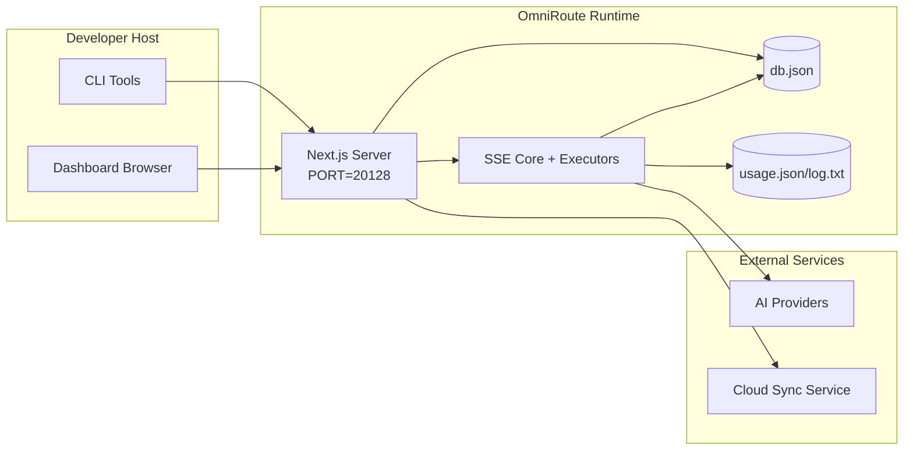

# 옴니루트 아키텍처

🌐 **Languages:** 🇺🇸 [English](../../ARCHITECTURE.md) | 🇧🇷 [Português (Brasil)](../pt-BR/ARCHITECTURE.md) | 🇪🇸 [Español](../es/ARCHITECTURE.md) | 🇫🇷 [Français](../fr/ARCHITECTURE.md) | 🇮🇹 [Italiano](../it/ARCHITECTURE.md) | 🇷🇺 [Русский](../ru/ARCHITECTURE.md) | 🇨🇳 [中文 (简体)](../zh-CN/ARCHITECTURE.md) | 🇩🇪 [Deutsch](../de/ARCHITECTURE.md) | 🇮🇳 [हिन्दी](../in/ARCHITECTURE.md) | 🇹🇭 [ไทย](../th/ARCHITECTURE.md) | 🇺🇦 [Українська](../uk-UA/ARCHITECTURE.md) | 🇸🇦 [العربية](../ar/ARCHITECTURE.md) | 🇯🇵 [日本語](../ja/ARCHITECTURE.md) | 🇻🇳 [Tiếng Việt](../vi/ARCHITECTURE.md) | 🇧🇬 [Български](../bg/ARCHITECTURE.md) | 🇩🇰 [Dansk](../da/ARCHITECTURE.md) | 🇫🇮 [Suomi](../fi/ARCHITECTURE.md) | 🇮🇱 [עברית](../he/ARCHITECTURE.md) | 🇭🇺 [Magyar](../hu/ARCHITECTURE.md) | 🇮🇩 [Bahasa Indonesia](../id/ARCHITECTURE.md) | 🇰🇷 [한국어](../ko/ARCHITECTURE.md) | 🇲🇾 [Bahasa Melayu](../ms/ARCHITECTURE.md) | 🇳🇱 [Nederlands](../nl/ARCHITECTURE.md) | 🇳🇴 [Norsk](../no/ARCHITECTURE.md) | 🇵🇹 [Português (Portugal)](../pt/ARCHITECTURE.md) | 🇷🇴 [Română](../ro/ARCHITECTURE.md) | 🇵🇱 [Polski](../pl/ARCHITECTURE.md) | 🇸🇰 [Slovenčina](../sk/ARCHITECTURE.md) | 🇸🇪 [Svenska](../sv/ARCHITECTURE.md) | 🇵🇭 [Filipino](../phi/ARCHITECTURE.md)

_최종 업데이트 날짜: 2026-02-18_

## 요약

OmniRoute는 Next.js를 기반으로 구축된 로컬 AI 라우팅 게이트웨이이자 대시보드입니다.
단일 OpenAI 호환 엔드포인트(`/v1/*`)를 제공하고 변환, 대체, 토큰 새로 고침 및 사용 추적을 통해 여러 업스트림 공급자 간에 트래픽을 라우팅합니다.

핵심 기능:

- CLI/도구용 OpenAI 호환 API 표면(28개 공급자)
- 공급자 형식에 따른 요청/응답 번역
- 모델 콤보 대체(다중 모델 시퀀스)
- 계정 수준 대체(제공업체당 다중 계정)
- OAuth + API 키 공급자 연결 관리
- `/v1/embeddings`을 통한 임베딩 생성(6개 공급자, 9개 모델)
- `/v1/images/generations`을 통한 이미지 생성(4개 공급자, 9개 모델)
- 추론 모델을 위한 Think 태그 구문 분석(`<think>...</think>`)
- 엄격한 OpenAI SDK 호환성을 위한 응답 삭제
- 제공자 간 호환성을 위한 역할 정규화(개발자→시스템, 시스템→사용자)
- 구조화된 출력 변환(json_schema → Gemini responseSchema)
- 공급자, 키, 별칭, 콤보, 설정, 가격에 대한 로컬 지속성
- 사용량/비용 추적 및 요청 로깅
- 다중 장치/상태 동기화를 위한 선택적 클라우드 동기화
- API 접근 제어를 위한 IP 허용 목록/차단 목록
- 생각하는 예산 관리(패스스루/자동/커스텀/적응형)
- 글로벌 시스템 신속한 주입
- 세션 추적 및 지문 채취
- 제공자별 프로필을 통해 계정당 강화된 속도 제한
- 공급자 탄력성을 위한 회로 차단기 패턴
- 뮤텍스 잠금을 통한 천둥 방지 무리 보호
- 서명 기반 요청 중복 제거 캐시
- 도메인 레이어: 모델 가용성, 비용 규칙, 대체 정책, 잠금 정책
- 도메인 상태 지속성(폴백, 예산, 잠금, 회로 차단기를 위한 SQLite 연속 쓰기 캐시)
- 중앙화된 요청 평가를 위한 정책 엔진(잠금 → 예산 → 대체)
- p50/p95/p99 대기 시간 집계를 통한 원격 측정 요청
- 종단 간 추적을 위한 상관 ID(X-Request-Id)
- API 키별로 옵트아웃이 가능한 규정 준수 감사 로깅
- LLM 품질 보증을 위한 평가 프레임워크
- 실시간 회로 차단기 상태가 포함된 탄력성 UI 대시보드
- 모듈식 OAuth 제공자(`src/lib/oauth/providers/` 아래의 개별 모듈 12개)

기본 런타임 모델:

- `src/app/api/*` 아래의 Next.js 앱 경로는 대시보드 API와 호환성 API를 모두 구현합니다.
- `src/sse/*` + `open-sse/*`의 공유 SSE/라우팅 코어는 공급자 실행, 변환, 스트리밍, 대체 및 사용을 처리합니다.

## 범위 및 경계

### 범위 내

- 로컬 게이트웨이 런타임
- 대시보드 관리 API
- 공급자 인증 및 토큰 새로 고침
- 번역 및 SSE 스트리밍 요청
- 로컬 상태 + 사용 지속성
- 선택적인 클라우드 동기화 조정

### 범위를 벗어남

- `NEXT_PUBLIC_CLOUD_URL` 기반의 클라우드 서비스 구현
- 로컬 프로세스 외부의 공급자 SLA/제어 평면
- 외부 CLI 바이너리 자체(Claude CLI, Codex CLI 등)

## 상위 수준 시스템 컨텍스트



## 핵심 런타임 구성 요소

## 1) API 및 라우팅 계층(Next.js 앱 경로)

주요 디렉토리:

- 호환성 API의 경우 `src/app/api/v1/*` 및 `src/app/api/v1beta/*`
- 관리/구성 API용 `src/app/api/*`
- 다음은 `next.config.mjs`에서 `/v1/*`을 `/api/v1/*`로 매핑하여 다시 작성합니다.

중요한 호환성 경로:

- `src/app/api/v1/chat/completions/route.ts`
- `src/app/api/v1/messages/route.ts`
- `src/app/api/v1/responses/route.ts`
- `src/app/api/v1/models/route.ts` — `custom: true`이 있는 사용자 정의 모델을 포함합니다.
- `src/app/api/v1/embeddings/route.ts` — 임베딩 생성(6개 제공자)
- `src/app/api/v1/images/generations/route.ts` — 이미지 생성(Antigravity/Nebius를 포함한 4개 이상의 공급자)
- `src/app/api/v1/messages/count_tokens/route.ts`
- `src/app/api/v1/providers/[provider]/chat/completions/route.ts` — 제공업체별 전용 채팅
- `src/app/api/v1/providers/[provider]/embeddings/route.ts` — 제공자별 전용 임베딩
- `src/app/api/v1/providers/[provider]/images/generations/route.ts` — 제공업체별 전용 이미지
- `src/app/api/v1beta/models/route.ts`
- `src/app/api/v1beta/models/[...path]/route.ts`

관리 도메인:

- 인증/설정: `src/app/api/auth/*`, `src/app/api/settings/*`
- 공급자/연결: `src/app/api/providers*`
- 제공자 노드: `src/app/api/provider-nodes*`
- 사용자 정의 모델: `src/app/api/provider-models` (GET/POST/DELETE)
- 모델 카탈로그: `src/app/api/models/catalog` (GET)
- 프록시 구성: `src/app/api/settings/proxy`(GET/PUT/DELETE) + `src/app/api/settings/proxy/test`(POST)
- OAuth: `src/app/api/oauth/*`
- 키/별칭/콤보/가격: `src/app/api/keys*`, `src/app/api/models/alias`, `src/app/api/combos*`, `src/app/api/pricing`
- 사용량: `src/app/api/usage/*`
- 동기화/클라우드: `src/app/api/sync/*`, `src/app/api/cloud/*`
- CLI 도구 도우미: `src/app/api/cli-tools/*`
- IP 필터: `src/app/api/settings/ip-filter` (GET/PUT)
- 생각하는 예산: `src/app/api/settings/thinking-budget` (GET/PUT)
- 시스템 프롬프트: `src/app/api/settings/system-prompt` (GET/PUT)
- 세션: `src/app/api/sessions`(GET)
- 비율 제한: `src/app/api/rate-limits` (GET)
- 복원력: `src/app/api/resilience` (GET/PATCH) — 공급자 프로필, 회로 차단기, 속도 제한 상태
- 복원력 재설정: `src/app/api/resilience/reset` (POST) — 차단기 재설정 + 재사용 대기시간
- 캐시 통계: `src/app/api/cache/stats` (GET/DELETE)
- 모델 가용성: `src/app/api/models/availability` (GET/POST)
- 원격 측정: `src/app/api/telemetry/summary` (GET)
- 예산: `src/app/api/usage/budget` (GET/POST)
- 대체 체인: `src/app/api/fallback/chains` (GET/POST/DELETE)
- 규정 준수 감사: `src/app/api/compliance/audit-log` (GET)
- 평가: `src/app/api/evals`(GET/POST), `src/app/api/evals/[suiteId]`(GET)
- 정책: `src/app/api/policies`(GET/POST)

## 2) SSE + 번역 코어

주요 흐름 모듈:

- 항목: `src/sse/handlers/chat.ts`
- 핵심 오케스트레이션: `open-sse/handlers/chatCore.ts`
- 공급자 실행 어댑터: `open-sse/executors/*`
- 형식 감지/공급자 구성: `open-sse/services/provider.ts`
- 모델 구문 분석/해결: `src/sse/services/model.ts`, `open-sse/services/model.ts`
- 계정 대체 논리: `open-sse/services/accountFallback.ts`
- 번역 레지스트리: `open-sse/translator/index.ts`
- 스트림 변환: `open-sse/utils/stream.ts`, `open-sse/utils/streamHandler.ts`
- 사용량 추출/정규화: `open-sse/utils/usageTracking.ts`
- 태그 파서 생각: `open-sse/utils/thinkTagParser.ts`
- 임베딩 핸들러: `open-sse/handlers/embeddings.ts`
- 임베딩 제공자 레지스트리: `open-sse/config/embeddingRegistry.ts`
- 이미지 생성 핸들러: `open-sse/handlers/imageGeneration.ts`
- 이미지 제공자 레지스트리: `open-sse/config/imageRegistry.ts`
- 응답 정리: `open-sse/handlers/responseSanitizer.ts`
- 역할 정규화: `open-sse/services/roleNormalizer.ts`

서비스(비즈니스 로직):

- 계정 선택/점수: `open-sse/services/accountSelector.ts`
- 컨텍스트 수명주기 관리: `open-sse/services/contextManager.ts`
- IP 필터 시행: `open-sse/services/ipFilter.ts`
- 세션 추적: `open-sse/services/sessionManager.ts`
- 중복 제거 요청: `open-sse/services/signatureCache.ts`
- 시스템 프롬프트 주입: `open-sse/services/systemPrompt.ts`
- 생각하는 예산 관리: `open-sse/services/thinkingBudget.ts`
- 와일드카드 모델 라우팅: `open-sse/services/wildcardRouter.ts`
- 비율 제한 관리: `open-sse/services/rateLimitManager.ts`
- 회로 차단기: `open-sse/services/circuitBreaker.ts`

도메인 레이어 모듈:

- 모델 가용성: `src/lib/domain/modelAvailability.ts`
- 비용 규칙/예산: `src/lib/domain/costRules.ts`
- 대체 정책: `src/lib/domain/fallbackPolicy.ts`
- 콤보 리졸버: `src/lib/domain/comboResolver.ts`
- 잠금 정책: `src/lib/domain/lockoutPolicy.ts`
- 정책 엔진: `src/domain/policyEngine.ts` — 중앙 집중식 잠금 → 예산 → 대체 평가
- 오류 코드 카탈로그: `src/lib/domain/errorCodes.ts`
- 요청 ID: `src/lib/domain/requestId.ts`
- 가져오기 시간 초과: `src/lib/domain/fetchTimeout.ts`
- 원격 측정 요청: `src/lib/domain/requestTelemetry.ts`
- 규정 준수/감사: `src/lib/domain/compliance/index.ts`
- 평가 실행자: `src/lib/domain/evalRunner.ts`
- 도메인 상태 지속성: `src/lib/db/domainState.ts` — 대체 체인, 예산, 비용 기록, 잠금 상태, 회로 차단기를 위한 SQLite CRUD

OAuth 제공자 모듈(`src/lib/oauth/providers/` 아래의 개별 파일 12개):

- 레지스트리 색인: `src/lib/oauth/providers/index.ts`
- 개인 공급자: `claude.ts`, `codex.ts`, `gemini.ts`, `antigravity.ts`, `iflow.ts`, `qwen.ts`, `kimi-coding.ts`, `github.ts`, `kiro.ts`, `cursor.ts`, `kilocode.ts`, `cline.ts`
- 씬 래퍼: `src/lib/oauth/providers.ts` — 개별 모듈에서 다시 내보내기

## 3) 지속성 레이어

기본 상태 DB:

- `src/lib/localDb.ts`
- 파일: `${DATA_DIR}/db.json`(또는 설정된 경우 `$XDG_CONFIG_HOME/omniroute/db.json`, 그렇지 않으면 `~/.omniroute/db.json`)
- 엔터티: 공급자 연결, 공급자 노드, modelAliases, 콤보, apiKeys, 설정, 가격 책정, **customModels**, **proxyConfig**, **ipFilter**, **thinkingBudget**, **systemPrompt**

사용량 DB:

- `src/lib/usageDb.ts`
- 파일: `${DATA_DIR}/usage.json`, `${DATA_DIR}/log.txt`, `${DATA_DIR}/call_logs/`
- `localDb`(`DATA_DIR`, 설정된 경우 `XDG_CONFIG_HOME/omniroute`)과 동일한 기본 디렉터리 정책을 따릅니다.
- 집중된 하위 모듈로 분해: `migrations.ts`, `usageHistory.ts`, `costCalculator.ts`, `usageStats.ts`, `callLogs.ts`

도메인 상태 DB(SQLite):

- `src/lib/db/domainState.ts` — 도메인 상태에 대한 CRUD 작업
- 테이블(`src/lib/db/core.ts`에서 생성됨): `domain_fallback_chains`, `domain_budgets`, `domain_cost_history`, `domain_lockout_state`, `domain_circuit_breakers`
- 연속 쓰기 캐시 패턴: 메모리 내 맵은 런타임 시 권한을 갖습니다. 변이는 SQLite에 동기적으로 기록됩니다. 콜드 스타트 시 DB에서 상태가 복원됩니다.

## 4) 인증 + 보안 표면

- 대시보드 쿠키 인증: `src/proxy.ts`, `src/app/api/auth/login/route.ts`
- API 키 생성/검증: `src/shared/utils/apiKey.ts`
- `providerConnections` 항목에 유지되는 공급자 비밀
- `open-sse/utils/proxyFetch.ts`(env vars) 및 `open-sse/utils/networkProxy.ts`(공급자별 또는 전역 구성 가능)을 통한 아웃바운드 프록시 지원

## 5) 클라우드 동기화

- 스케줄러 초기화: `src/lib/initCloudSync.ts`, `src/shared/services/initializeCloudSync.ts`
- 정기 작업: `src/shared/services/cloudSyncScheduler.ts`
- 제어 경로: `src/app/api/sync/cloud/route.ts`

## 요청 수명 주기(`/v1/chat/completions`)



## 콤보 + 계정 대체 흐름



대체 결정은 상태 코드와 오류 메시지 휴리스틱을 사용하는 `open-sse/services/accountFallback.ts`에 의해 이루어집니다.

## OAuth 온보딩 및 토큰 새로 고침 수명 주기



실시간 트래픽 중 새로 고침은 실행기 `refreshCredentials()`을 통해 `open-sse/handlers/chatCore.ts` 내에서 실행됩니다.

## 클라우드 동기화 수명 주기(활성화/동기화/비활성화)



클라우드가 활성화되면 `CloudSyncScheduler`에 의해 주기적 동기화가 트리거됩니다.

## 데이터 모델 및 스토리지 맵



물리적 저장 파일:

- 기본 상태: `${DATA_DIR}/db.json`(또는 설정된 경우 `$XDG_CONFIG_HOME/omniroute/db.json`, 그렇지 않으면 `~/.omniroute/db.json`)
- 사용 통계: `${DATA_DIR}/usage.json`
- 요청 로그 라인: `${DATA_DIR}/log.txt`
- 선택적 변환기/요청 디버그 세션: `<repo>/logs/...`

## 배포 토폴로지



## 모듈 매핑(결정에 중요)

### 경로 및 API 모듈

- `src/app/api/v1/*`, `src/app/api/v1beta/*`: 호환성 API
- `src/app/api/v1/providers/[provider]/*`: 공급자별 전용 경로(채팅, 임베딩, 이미지)
- `src/app/api/providers*`: 공급자 CRUD, 유효성 검사, 테스트
- `src/app/api/provider-nodes*`: 맞춤형 호환 노드 관리
- `src/app/api/provider-models`: 사용자 정의 모델 관리(CRUD)
- `src/app/api/models/catalog`: 전체 모델 카탈로그 API(모든 유형이 공급자별로 그룹화됨)
- `src/app/api/oauth/*`: OAuth/장치 코드 흐름
- `src/app/api/keys*`: 로컬 API 키 수명 주기
- `src/app/api/models/alias`: 별칭 관리
- `src/app/api/combos*`: 대체 콤보 관리
- `src/app/api/pricing`: 비용 계산을 위한 가격 재정의
- `src/app/api/settings/proxy`: 프록시 구성(GET/PUT/DELETE)
- `src/app/api/settings/proxy/test`: 아웃바운드 프록시 연결 테스트(POST)
- `src/app/api/usage/*`: 사용량 및 로그 API
- `src/app/api/sync/*` + `src/app/api/cloud/*`: 클라우드 동기화 및 클라우드 연결 도우미
- `src/app/api/cli-tools/*`: 로컬 CLI 구성 작성자/검사기
- `src/app/api/settings/ip-filter`: IP 허용 목록/차단 목록(GET/PUT)
- `src/app/api/settings/thinking-budget`: 생각하는 토큰 예산 구성(GET/PUT)
- `src/app/api/settings/system-prompt`: 전역 시스템 프롬프트(GET/PUT)
- `src/app/api/sessions`: 활성 세션 목록(GET)
- `src/app/api/rate-limits`: 계정별 비율 제한 상태(GET)

### 라우팅 및 실행 코어

- `src/sse/handlers/chat.ts`: 요청 구문 분석, 콤보 처리, 계정 선택 루프
- `open-sse/handlers/chatCore.ts`: 변환, 실행기 디스패치, 재시도/새로 고침 처리, 스트림 설정
- `open-sse/executors/*`: 공급자별 네트워크 및 형식 동작

### 번역 레지스트리 및 형식 변환기

- `open-sse/translator/index.ts`: 번역자 레지스트리 및 오케스트레이션
- 번역자 요청: `open-sse/translator/request/*`
- 응답 번역자: `open-sse/translator/response/*`
- 형식 상수: `open-sse/translator/formats.ts`

### 지속성

- `src/lib/localDb.ts`: 영구 구성/상태
- `src/lib/usageDb.ts`: 사용 내역 및 롤링 요청 로그

## 제공자 실행자 적용 범위(전략 패턴)

각 공급자에는 URL 구축, 헤더 구성, 지수 백오프를 사용한 재시도, 자격 증명 새로 고침 후크 및 `execute()` 오케스트레이션 방법을 제공하는 `BaseExecutor`(`open-sse/executors/base.ts`)을 확장하는 특수 실행기가 있습니다.

| 집행자                | 공급자                                                                                                                                                       | 특수취급                                                      |
| --------------------- | ------------------------------------------------------------------------------------------------------------------------------------------------------------ | ------------------------------------------------------------- |
| `DefaultExecutor`     | OpenAI, Claude, Gemini, Qwen, iFlow, OpenRouter, GLM, Kimi, MiniMax, DeepSeek, Groq, xAI, Mistral, Perplexity, Together, Fireworks, Cerebras, Cohere, NVIDIA | 공급자별 동적 URL/헤더 구성                                   |
| `AntigravityExecutor` | 구글 반중력                                                                                                                                                  | 사용자 정의 프로젝트/세션 ID, 구문 분석 후 재시도             |
| `CodexExecutor`       | OpenAI 코덱스                                                                                                                                                | 시스템 지침을 주입하고 추론 노력을 강요                       |
| `CursorExecutor`      | 커서 IDE                                                                                                                                                     | ConnectRPC 프로토콜, Protobuf 인코딩, 체크섬을 통한 서명 요청 |
| `GithubExecutor`      | GitHub 부조종사                                                                                                                                              | Copilot 토큰 새로 고침, VSCode 모방 헤더                      |
| `KiroExecutor`        | AWS 코드위스퍼러/키로                                                                                                                                        | AWS EventStream 바이너리 형식 → SSE 변환                      |
| `GeminiCLIExecutor`   | 제미니 CLI                                                                                                                                                   | Google OAuth 토큰 새로고침 주기                               |

다른 모든 공급자(사용자 정의 호환 노드 포함)는 `DefaultExecutor`을 사용합니다.

## 공급자 호환성 매트릭스

| 공급자            | 형식           | 인증                 | 스트림            | 비스트림 | 토큰 새로고침 | 사용 API           |
| ----------------- | -------------- | -------------------- | ----------------- | -------- | ------------- | ------------------ |
| 클로드            | 클로드         | API 키/OAuth         | ✅                | ✅       | ✅            | ⚠️ 관리자 전용     |
| 쌍둥이자리        | 쌍둥이자리     | API 키/OAuth         | ✅                | ✅       | ✅            | ⚠️ 클라우드 콘솔   |
| 제미니 CLI        | 쌍둥이자리 CLI | OAuth                | ✅                | ✅       | ✅            | ⚠️ 클라우드 콘솔   |
| 반중력            | 반중력         | OAuth                | ✅                | ✅       | ✅            | ✅ 전체 할당량 API |
| 오픈AI            | 공개           | API 키               | ✅                | ✅       | ❌            | ❌                 |
| 코덱스            | openai-응답    | OAuth                | ✅ 강제           | ❌       | ✅            | ✅ 비율 제한       |
| GitHub 부조종사   | 공개           | OAuth + Copilot 토큰 | ✅                | ✅       | ✅            | ✅ 할당량 스냅샷   |
| 커서              | 커서           | 사용자 정의 체크섬   | ✅                | ✅       | ❌            | ❌                 |
| 키로              | 키로           | AWS SSO OIDC         | ✅ (이벤트스트림) | ❌       | ✅            | ✅ 사용 제한       |
| 퀀                | 공개           | OAuth                | ✅                | ✅       | ✅            | ⚠️ 요청에 따라     |
| 아이플로우        | 공개           | OAuth(기본)          | ✅                | ✅       | ✅            | ⚠️ 요청에 따라     |
| 오픈라우터        | 공개           | API 키               | ✅                | ✅       | ❌            | ❌                 |
| GLM/키미/미니맥스 | 클로드         | API 키               | ✅                | ✅       | ❌            | ❌                 |
| 딥시크            | 공개           | API 키               | ✅                | ✅       | ❌            | ❌                 |
| 그로크            | 공개           | API 키               | ✅                | ✅       | ❌            | ❌                 |
| xAI(그록)         | 공개           | API 키               | ✅                | ✅       | ❌            | ❌                 |
| 미스트랄          | 공개           | API 키               | ✅                | ✅       | ❌            | ❌                 |
| 당혹감            | 공개           | API 키               | ✅                | ✅       | ❌            | ❌                 |
| 함께하는 AI       | 공개           | API 키               | ✅                | ✅       | ❌            | ❌                 |
| 불꽃놀이 AI       | 공개           | API 키               | ✅                | ✅       | ❌            | ❌                 |
| 대뇌              | 공개           | API 키               | ✅                | ✅       | ❌            | ❌                 |
| 코히어            | 공개           | API 키               | ✅                | ✅       | ❌            | ❌                 |
| 엔비디아 NIM      | 공개           | API 키               | ✅                | ✅       | ❌            | ❌                 |

## 형식 번역 범위

감지된 소스 형식은 다음과 같습니다.

- `openai`
- `openai-responses`
- `claude`
- `gemini`

대상 형식은 다음과 같습니다.

- OpenAI 채팅/응답
- 클로드
- Gemini/Gemini-CLI/반중력 봉투
- 키로
- 커서

번역에서는 **OpenAI를 허브 형식**으로 사용합니다. 모든 변환은 중간 형식으로 OpenAI를 거칩니다.

```
Source Format → OpenAI (hub) → Target Format
```

번역은 소스 페이로드 형태와 공급자 대상 형식에 따라 동적으로 선택됩니다.

번역 파이프라인의 추가 처리 계층:

- **응답 삭제** — OpenAI 형식 응답(스트리밍 및 비스트리밍 모두)에서 비표준 필드를 제거하여 엄격한 SDK 규정 준수를 보장합니다.
- **역할 정규화** — OpenAI가 아닌 대상에 대해 `developer` → `system`을 변환합니다. 시스템 역할(GLM, ERNIE)을 거부하는 모델에 대해 `system` → `user`을 병합합니다.
- **태그 추출 생각** — 콘텐츠의 `<think>...</think>` 블록을 `reasoning_content` 필드로 구문 분석합니다.
- **구조화된 출력** — OpenAI `response_format.json_schema`을 Gemini의 `responseMimeType` + `responseSchema`로 변환합니다.

## 지원되는 API 엔드포인트

| 엔드포인트                                         | 형식               | 핸들러                                              |
| -------------------------------------------------- | ------------------ | --------------------------------------------------- |
| `POST /v1/chat/completions`                        | OpenAI 채팅        | `src/sse/handlers/chat.ts`                          |
| `POST /v1/messages`                                | 클로드 메시지      | 동일한 핸들러(자동 감지)                            |
| `POST /v1/responses`                               | OpenAI 응답        | `open-sse/handlers/responsesHandler.ts`             |
| `POST /v1/embeddings`                              | OpenAI 임베딩      | `open-sse/handlers/embeddings.ts`                   |
| `GET /v1/embeddings`                               | 모델 목록          | API 경로                                            |
| `POST /v1/images/generations`                      | OpenAI 이미지      | `open-sse/handlers/imageGeneration.ts`              |
| `GET /v1/images/generations`                       | 모델 목록          | API 경로                                            |
| `POST /v1/providers/{provider}/chat/completions`   | OpenAI 채팅        | 모델 검증을 통한 제공자별 전용                      |
| `POST /v1/providers/{provider}/embeddings`         | OpenAI 임베딩      | 모델 검증을 통한 제공자별 전용                      |
| `POST /v1/providers/{provider}/images/generations` | OpenAI 이미지      | 모델 검증을 통한 제공자별 전용                      |
| `POST /v1/messages/count_tokens`                   | 클로드 토큰 개수   | API 경로                                            |
| `GET /v1/models`                                   | OpenAI 모델 목록   | API 경로(채팅 + 임베딩 + 이미지 + 사용자 정의 모델) |
| `GET /api/models/catalog`                          | 카탈로그           | 공급자 + 유형별로 그룹화된 모든 모델                |
| `POST /v1beta/models/*:streamGenerateContent`      | 쌍둥이 자리 원주민 | API 경로                                            |
| `GET/PUT/DELETE /api/settings/proxy`               | 프록시 구성        | 네트워크 프록시 구성                                |
| `POST /api/settings/proxy/test`                    | 프록시 연결        | 프록시 상태/연결 테스트 엔드포인트                  |
| `GET/POST/DELETE /api/provider-models`             | 맞춤형 모델        | 제공자별 맞춤형 모델 관리                           |

## 우회 핸들러

우회 처리기(`open-sse/utils/bypassHandler.ts`)는 Claude CLI의 알려진 "일시적" 요청(예열 핑, 타이틀 추출 및 토큰 계산)을 가로채고 업스트림 공급자 토큰을 사용하지 않고 **가짜 응답**을 반환합니다. 이는 `User-Agent`에 `claude-cli`이 포함된 경우에만 트리거됩니다.

## 요청 로거 파이프라인

요청 로거(`open-sse/utils/requestLogger.ts`)는 기본적으로 비활성화되고 `ENABLE_REQUEST_LOGS=true`을 통해 활성화되는 7단계 디버그 로깅 파이프라인을 제공합니다.

```
1_req_client.json → 2_req_source.json → 3_req_openai.json → 4_req_target.json
→ 5_res_provider.txt → 6_res_openai.txt → 7_res_client.txt
```

각 요청 세션마다 파일이 `<repo>/logs/<session>/`에 기록됩니다.

## 실패 모드 및 복원력

## 1) 계정/공급업체 가용성

- 일시적/속도/인증 오류에 대한 공급자 계정 쿨다운
- 요청 실패 전 계정 대체
- 현재 모델/공급자 경로가 소진되면 콤보 모델 대체

## 2) 토큰 만료

- 새로 고칠 수 있는 공급자에 대한 사전 확인 및 재시도를 통한 새로 고침
- 코어 경로에서 새로 고침 시도 후 401/403 재시도

## 3) 스트림 안전

- 연결 해제 인식 스트림 컨트롤러
- 스트림 끝 플러시 및 `[DONE]` 처리가 포함된 번역 스트림
- 공급자 사용량 메타데이터가 누락된 경우 사용량 추정 대체

## 4) 클라우드 동기화 성능 저하

- 동기화 오류가 표시되지만 로컬 런타임은 계속됩니다.
- 스케줄러에는 재시도 가능 논리가 있지만 주기적인 실행은 현재 기본적으로 단일 시도 동기화를 호출합니다.

## 5) 데이터 무결성

- 누락된 키에 대한 DB 형상 마이그레이션/수정
- localDb 및 UsageDb에 대한 손상된 JSON 재설정 보호 장치

## 관찰 가능성 및 작동 신호

런타임 가시성 소스:

- `src/sse/utils/logger.ts`의 콘솔 로그
- `usage.json`의 요청별 사용량 집계
- `log.txt`의 텍스트 요청 상태 로그
- `ENABLE_REQUEST_LOGS=true`인 경우 `logs/` 아래의 선택적 심층 요청/번역 로그
- UI 소비를 위한 대시보드 사용 끝점(`/api/usage/*`)

## 보안에 민감한 경계

- JWT 비밀(`JWT_SECRET`)은 대시보드 세션 쿠키 확인/서명을 보호합니다.
- 실제 배포에서는 초기 비밀번호 대체(`INITIAL_PASSWORD`, 기본값 `123456`)를 재정의해야 합니다.
- API 키 HMAC 비밀(`API_KEY_SECRET`)은 생성된 로컬 API 키 형식을 보호합니다.
- 공급자 비밀(API 키/토큰)은 로컬 DB에 유지되며 파일 시스템 수준에서 보호되어야 합니다.
- 클라우드 동기화 엔드포인트는 API 키 인증 + 머신 ID 의미 체계를 사용합니다.

## 환경 및 런타임 매트릭스

코드에서 적극적으로 사용되는 환경 변수:

- 앱/인증: `JWT_SECRET`, `INITIAL_PASSWORD`
- 저장공간: `DATA_DIR`
- 호환 노드 동작: `ALLOW_MULTI_CONNECTIONS_PER_COMPAT_NODE`
- 선택적 저장소 기반 재정의(`DATA_DIR`이 설정되지 않은 경우 Linux/macOS): `XDG_CONFIG_HOME`
- 보안 해싱: `API_KEY_SECRET`, `MACHINE_ID_SALT`
- 로깅: `ENABLE_REQUEST_LOGS`
- 동기화/클라우드 URL링: `NEXT_PUBLIC_BASE_URL`, `NEXT_PUBLIC_CLOUD_URL`
- 아웃바운드 프록시: `HTTP_PROXY`, `HTTPS_PROXY`, `ALL_PROXY`, `NO_PROXY` 및 소문자 변형
- SOCKS5 기능 플래그: `ENABLE_SOCKS5_PROXY`, `NEXT_PUBLIC_ENABLE_SOCKS5_PROXY`
- 플랫폼/런타임 도우미(앱별 구성 아님): `APPDATA`, `NODE_ENV`, `PORT`, `HOSTNAME`

## 알려진 아키텍처 노트

1. `usageDb` 및 `localDb`은 이제 레거시 파일 마이그레이션과 동일한 기본 디렉터리 정책(`DATA_DIR` -> `XDG_CONFIG_HOME/omniroute` -> `~/.omniroute`)을 공유합니다.
2. `/api/v1/route.ts`은 정적 모델 목록을 반환하며 `/v1/models`에서 사용하는 기본 모델 소스가 아닙니다.
3. 요청 로거가 활성화되면 전체 헤더/본문을 씁니다. 로그 디렉토리를 중요하게 취급하십시오.
4. 클라우드 동작은 올바른 `NEXT_PUBLIC_BASE_URL` 및 클라우드 엔드포인트 연결 가능성에 따라 달라집니다.
5. `open-sse/` 디렉터리는 `@omniroute/open-sse` **npm 작업 공간 패키지**로 게시됩니다. 소스 코드는 `@omniroute/open-sse/...`을 통해 이를 가져옵니다(Next.js `transpilePackages`으로 해결됨). 이 문서의 파일 경로는 일관성을 위해 여전히 디렉터리 이름 `open-sse/`을 사용합니다.
6. 대시보드의 차트는 액세스 가능한 대화형 분석 시각화(모델 사용량 막대 차트, 성공률이 포함된 공급자 분석 테이블)를 위해 **Recharts**(SVG 기반)를 사용합니다.
7. E2E 테스트는 **Playwright**(`tests/e2e/`)를 사용하고 `npm run test:e2e`을 통해 실행됩니다. 단위 테스트는 **Node.js 테스트 실행기**(`tests/unit/`)를 사용하고 `npm run test:plan3`을 통해 실행됩니다. `src/` 아래의 소스 코드는 **TypeScript**(`.ts`/`.tsx`)입니다. `open-sse/` 작업 공간은 JavaScript(`.js`)로 유지됩니다.
8. 설정 페이지는 보안, 라우팅(6개의 전역 전략: 채우기 우선, 라운드 로빈, p2c, 무작위, 최소 사용, 비용 최적화), 탄력성(편집 가능한 속도 제한, 회로 차단기, 정책), AI(생각 예산, 시스템 프롬프트, 프롬프트 캐시), 고급(프록시)의 5개 탭으로 구성됩니다.

## 작동 검증 체크리스트

- 소스에서 빌드: `npm run build`
- Docker 이미지 빌드: `docker build -t omniroute .`
- 서비스 시작 및 확인:
- `GET /api/settings`
- `GET /api/v1/models`
- `PORT=20128`인 경우 CLI 대상 기본 URL은 `http://<host>:20128/v1`이어야 합니다.
