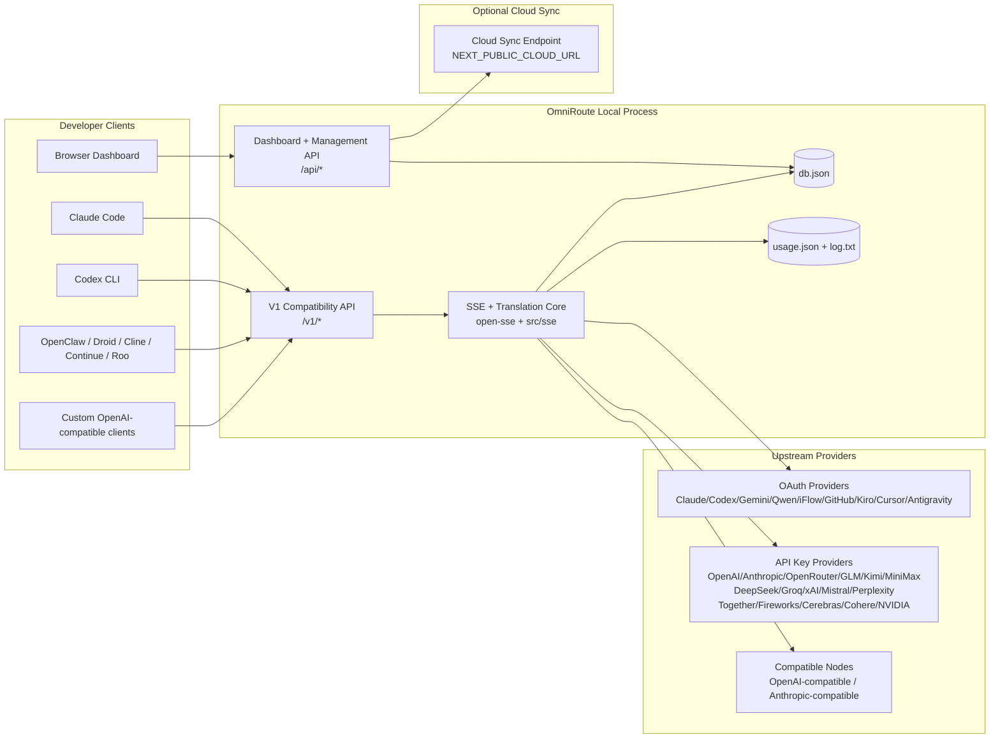
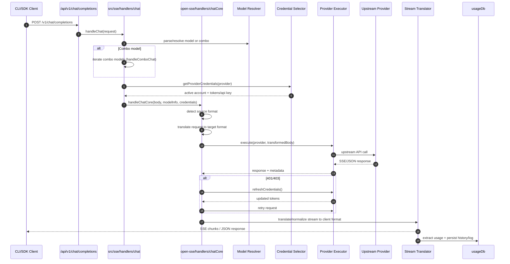
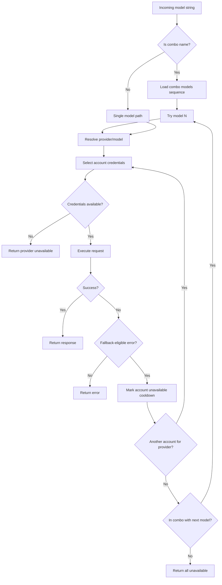
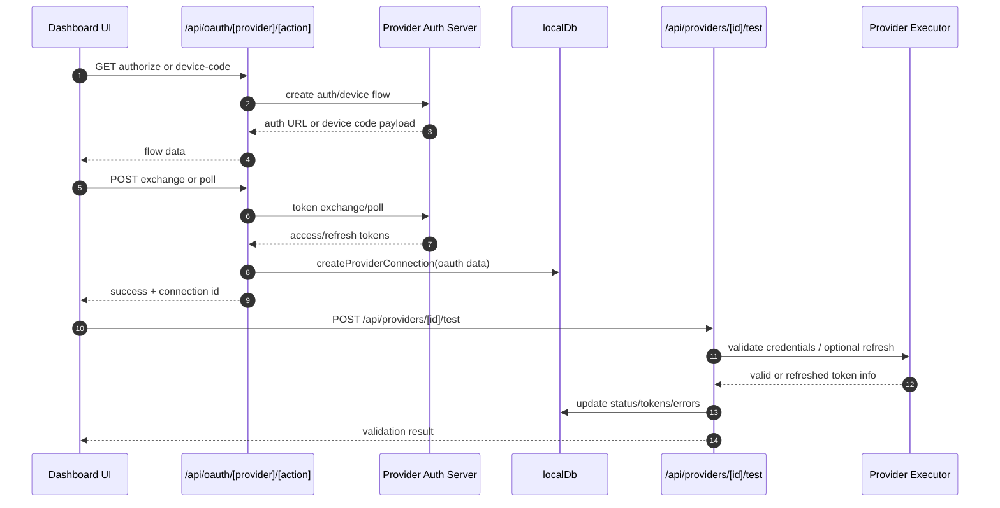
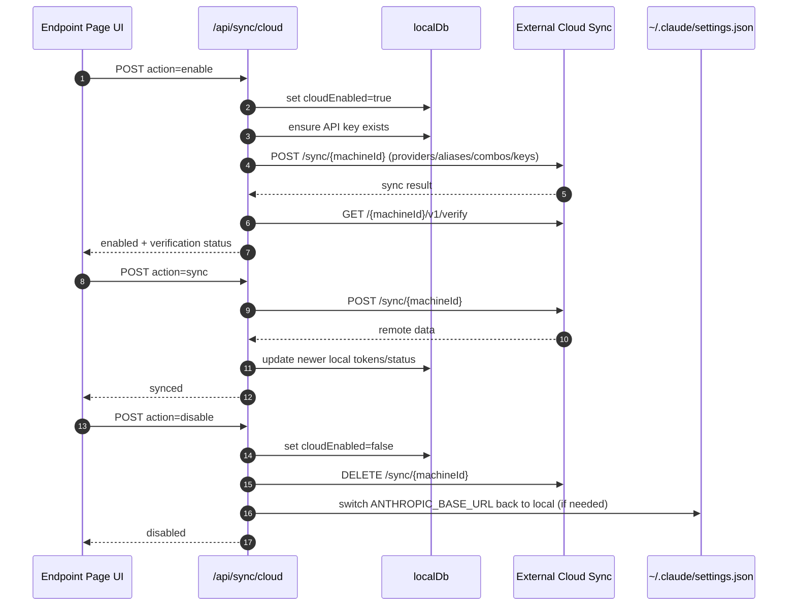
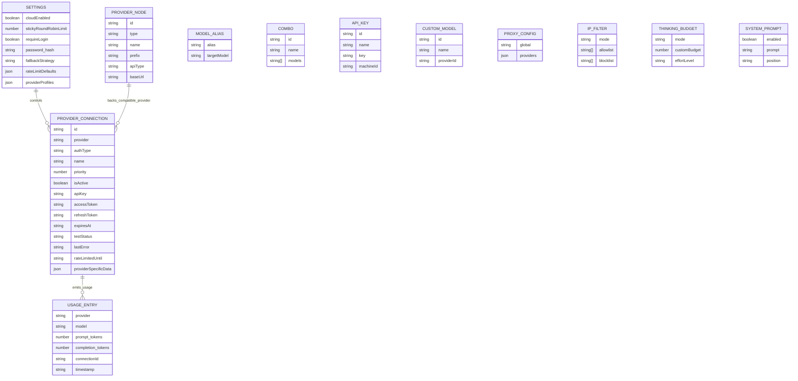
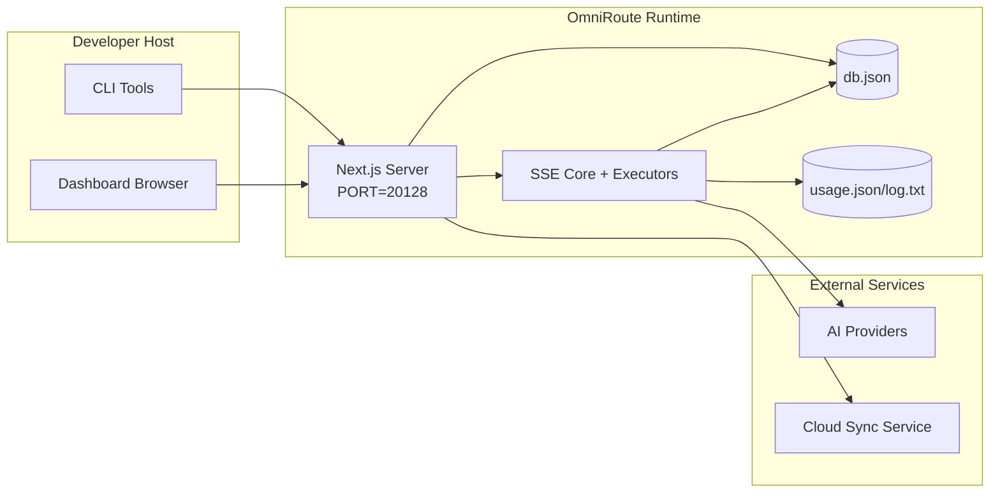

# Seni Bina OmniRoute

🌐 **Languages:** 🇺🇸 [English](../../ARCHITECTURE.md) | 🇧🇷 [Português (Brasil)](../pt-BR/ARCHITECTURE.md) | 🇪🇸 [Español](../es/ARCHITECTURE.md) | 🇫🇷 [Français](../fr/ARCHITECTURE.md) | 🇮🇹 [Italiano](../it/ARCHITECTURE.md) | 🇷🇺 [Русский](../ru/ARCHITECTURE.md) | 🇨🇳 [中文 (简体)](../zh-CN/ARCHITECTURE.md) | 🇩🇪 [Deutsch](../de/ARCHITECTURE.md) | 🇮🇳 [हिन्दी](../in/ARCHITECTURE.md) | 🇹🇭 [ไทย](../th/ARCHITECTURE.md) | 🇺🇦 [Українська](../uk-UA/ARCHITECTURE.md) | 🇸🇦 [العربية](../ar/ARCHITECTURE.md) | 🇯🇵 [日本語](../ja/ARCHITECTURE.md) | 🇻🇳 [Tiếng Việt](../vi/ARCHITECTURE.md) | 🇧🇬 [Български](../bg/ARCHITECTURE.md) | 🇩🇰 [Dansk](../da/ARCHITECTURE.md) | 🇫🇮 [Suomi](../fi/ARCHITECTURE.md) | 🇮🇱 [עברית](../he/ARCHITECTURE.md) | 🇭🇺 [Magyar](../hu/ARCHITECTURE.md) | 🇮🇩 [Bahasa Indonesia](../id/ARCHITECTURE.md) | 🇰🇷 [한국어](../ko/ARCHITECTURE.md) | 🇲🇾 [Bahasa Melayu](../ms/ARCHITECTURE.md) | 🇳🇱 [Nederlands](../nl/ARCHITECTURE.md) | 🇳🇴 [Norsk](../no/ARCHITECTURE.md) | 🇵🇹 [Português (Portugal)](../pt/ARCHITECTURE.md) | 🇷🇴 [Română](../ro/ARCHITECTURE.md) | 🇵🇱 [Polski](../pl/ARCHITECTURE.md) | 🇸🇰 [Slovenčina](../sk/ARCHITECTURE.md) | 🇸🇪 [Svenska](../sv/ARCHITECTURE.md) | 🇵🇭 [Filipino](../phi/ARCHITECTURE.md)

_Terakhir dikemas kini: 2026-02-18_

## Ringkasan Eksekutif

OmniRoute ialah get laluan dan papan pemuka penghalaan AI tempatan yang dibina pada Next.js.
Ia menyediakan satu titik akhir serasi OpenAI (`/v1/*`) dan mengarahkan trafik merentasi berbilang penyedia huluan dengan terjemahan, sandaran, penyegaran token dan penjejakan penggunaan.

Keupayaan teras:

- Permukaan API serasi OpenAI untuk CLI/alat (28 pembekal)
- Permintaan/tindak balas terjemahan merentas format pembekal
- Model kombo mundur (jujukan berbilang model)
- Saling balik peringkat akaun (berbilang akaun setiap pembekal)
- Pengurusan sambungan pembekal kunci OAuth + API
- Membenamkan penjanaan melalui `/v1/embeddings` (6 pembekal, 9 model)
- Penjanaan imej melalui `/v1/images/generations` (4 pembekal, 9 model)
- Penghuraian teg Fikir (`<think>...</think>`) untuk model penaakulan
- Pembersihan tindak balas untuk keserasian OpenAI SDK yang ketat
- Normalisasi peranan (pembangun→sistem, sistem→pengguna) untuk keserasian silang penyedia
- Penukaran output berstruktur (json_schema → Gemini responseSchema)
- Kegigihan setempat untuk pembekal, kunci, alias, kombo, tetapan, harga
- Penjejakan penggunaan/kos dan pengelogan permintaan
- Penyegerakan awan pilihan untuk penyegerakan berbilang peranti/keadaan
- Senarai dibenarkan/senarai sekatan IP untuk kawalan akses API
- Pengurusan belanjawan berfikir (laluan/auto/tersuai/adaptif)
- Suntikan segera sistem global
- Penjejakan sesi dan cap jari
- Pengehadan kadar dipertingkatkan setiap akaun dengan profil khusus pembekal
- Corak pemutus litar untuk daya tahan pembekal
- Perlindungan kumpulan anti-gemuruh dengan penguncian mutex
- Cache penyahduplikasi permintaan berasaskan tandatangan
- Lapisan domain: ketersediaan model, peraturan kos, dasar sandaran, dasar sekat keluar
- Kegigihan keadaan domain (cache tulis-melalui SQLite untuk sandaran, belanjawan, sekatan, pemutus litar)
- Enjin dasar untuk penilaian permintaan terpusat (kunci → belanjawan → sandaran)
- Minta telemetri dengan pengagregatan kependaman p50/p95/p99
- ID Korelasi (X-Request-Id) untuk pengesanan hujung ke hujung
- Pengelogan audit pematuhan dengan memilih keluar setiap kunci API
- Rangka kerja Eval untuk jaminan kualiti LLM
- Papan pemuka UI Ketahanan dengan status pemutus litar masa nyata
- Pembekal OAuth modular (12 modul individu di bawah `src/lib/oauth/providers/`)

Model masa jalan utama:

- Laluan apl Next.js di bawah `src/app/api/*` melaksanakan kedua-dua API papan pemuka dan API keserasian
- SSE kongsi/tera laluan dalam `src/sse/*` + `open-sse/*` mengendalikan pelaksanaan pembekal, terjemahan, penstriman, sandaran dan penggunaan

## Skop dan Sempadan

### Dalam Skop

- Masa jalan gerbang tempatan
- API pengurusan papan pemuka
- Pengesahan pembekal dan penyegaran token
- Minta terjemahan dan penstriman SSE
- Keadaan setempat + kegigihan penggunaan
- Orkestrasi penyegerakan awan pilihan

### Di Luar Skop

- Pelaksanaan perkhidmatan awan di belakang `NEXT_PUBLIC_CLOUD_URL`
- Pembekal SLA/pesawat kawalan di luar proses tempatan
- Perduaan CLI luaran sendiri (Claude CLI, Codex CLI, dll.)

## Konteks Sistem Aras Tinggi



## Komponen Masa Jalan Teras

## 1) API dan Lapisan Penghalaan (Laluan Apl Next.js)

Direktori utama:

- `src/app/api/v1/*` dan `src/app/api/v1beta/*` untuk API keserasian
- `src/app/api/*` untuk API pengurusan/konfigurasi
- Seterusnya menulis semula dalam peta `next.config.mjs` `/v1/*` kepada `/api/v1/*`

Laluan keserasian penting:

- `src/app/api/v1/chat/completions/route.ts`
- `src/app/api/v1/messages/route.ts`
- `src/app/api/v1/responses/route.ts`
- `src/app/api/v1/models/route.ts` — termasuk model tersuai dengan `custom: true`
- `src/app/api/v1/embeddings/route.ts` — penjanaan benam (6 pembekal)
- `src/app/api/v1/images/generations/route.ts` — penjanaan imej (4+ penyedia termasuk Antigraviti/Nebius)
- `src/app/api/v1/messages/count_tokens/route.ts`
- `src/app/api/v1/providers/[provider]/chat/completions/route.ts` — sembang khusus bagi setiap pembekal
- `src/app/api/v1/providers/[provider]/embeddings/route.ts` — benam setiap pembekal khusus
- `src/app/api/v1/providers/[provider]/images/generations/route.ts` — imej setiap pembekal khusus
- `src/app/api/v1beta/models/route.ts`
- `src/app/api/v1beta/models/[...path]/route.ts`

Domain pengurusan:

- Pengesahan/tetapan: `src/app/api/auth/*`, `src/app/api/settings/*`
- Pembekal/sambungan: `src/app/api/providers*`
- Nod pembekal: `src/app/api/provider-nodes*`
- Model tersuai: `src/app/api/provider-models` (DAPAT/POS/PADAM)
- Katalog model: `src/app/api/models/catalog` (GET)
- Konfigurasi proksi: `src/app/api/settings/proxy` (GET/PUT/DELETE) + `src/app/api/settings/proxy/test` (POST)
- OAuth: `src/app/api/oauth/*`
- Kunci/alias/kombo/harga: `src/app/api/keys*`, `src/app/api/models/alias`, `src/app/api/combos*`, `src/app/api/pricing`
- Penggunaan: `src/app/api/usage/*`
- Penyegerakan/awan: `src/app/api/sync/*`, `src/app/api/cloud/*`
- Pembantu perkakas CLI: `src/app/api/cli-tools/*`
- Penapis IP: `src/app/api/settings/ip-filter` (GET/PUT)
- Belanjawan berfikir: `src/app/api/settings/thinking-budget` (GET/PUT)
- Gesaan sistem: `src/app/api/settings/system-prompt` (GET/PUT)
- Sesi: `src/app/api/sessions` (GET)
- Had kadar: `src/app/api/rate-limits` (GET)
- Ketahanan: `src/app/api/resilience` (GET/PATCH) — profil pembekal, pemutus litar, keadaan had kadar
- Tetapan semula daya tahan: `src/app/api/resilience/reset` (POST) — set semula pemutus + cooldown
- Statistik cache: `src/app/api/cache/stats` (DAPAT/DELETE)
- Ketersediaan model: `src/app/api/models/availability` (GET/POST)
- Telemetri: `src/app/api/telemetry/summary` (GET)
- Belanjawan: `src/app/api/usage/budget` (DAPAT/POS)
- Rantaian mundur: `src/app/api/fallback/chains` (DAPAT/POST/PADAM)
- Audit pematuhan: `src/app/api/compliance/audit-log` (GET)
- Evals: `src/app/api/evals` (GET/POST), `src/app/api/evals/[suiteId]` (GET)
- Dasar: `src/app/api/policies` (DAPAT/POS)

## 2) SSE + Teras Terjemahan

Modul aliran utama:

- Kemasukan: `src/sse/handlers/chat.ts`
- Orkestrasi teras: `open-sse/handlers/chatCore.ts`
- Penyesuai pelaksanaan pembekal: `open-sse/executors/*`
- Konfigurasi pengesanan format/pembekal: `open-sse/services/provider.ts`
- Penghuraian/penyelesaian model: `src/sse/services/model.ts`, `open-sse/services/model.ts`
- Logik sandaran akaun: `open-sse/services/accountFallback.ts`
- Pendaftaran terjemahan: `open-sse/translator/index.ts`
- Transformasi strim: `open-sse/utils/stream.ts`, `open-sse/utils/streamHandler.ts`
- Pengekstrakan/penormalan penggunaan: `open-sse/utils/usageTracking.ts`
- Penghurai teg Fikir: `open-sse/utils/thinkTagParser.ts`
- Pengendali benam: `open-sse/handlers/embeddings.ts`
- Membenamkan pendaftaran pembekal: `open-sse/config/embeddingRegistry.ts`
- Pengendali penjanaan imej: `open-sse/handlers/imageGeneration.ts`
- Pendaftaran pembekal imej: `open-sse/config/imageRegistry.ts`
- Pembersihan tindak balas: `open-sse/handlers/responseSanitizer.ts`
- Normalisasi peranan: `open-sse/services/roleNormalizer.ts`

Perkhidmatan (logik perniagaan):

- Pemilihan/pemarkahan akaun: `open-sse/services/accountSelector.ts`
- Pengurusan kitaran hayat konteks: `open-sse/services/contextManager.ts`
- Penguatkuasaan penapis IP: `open-sse/services/ipFilter.ts`
- Penjejakan sesi: `open-sse/services/sessionManager.ts`
- Minta penduaan: `open-sse/services/signatureCache.ts`
- Suntikan gesaan sistem: `open-sse/services/systemPrompt.ts`
- Pemikiran pengurusan belanjawan: `open-sse/services/thinkingBudget.ts`
- Penghalaan model kad liar: `open-sse/services/wildcardRouter.ts`
- Pengurusan had kadar: `open-sse/services/rateLimitManager.ts`
- Pemutus litar: `open-sse/services/circuitBreaker.ts`

Modul lapisan domain:

- Ketersediaan model: `src/lib/domain/modelAvailability.ts`
- Peraturan/belanjawan kos: `src/lib/domain/costRules.ts`
- Dasar mundur: `src/lib/domain/fallbackPolicy.ts`
- Penyelesai kombo: `src/lib/domain/comboResolver.ts`
- Dasar penguncian: `src/lib/domain/lockoutPolicy.ts`
- Enjin dasar: `src/domain/policyEngine.ts` — kunci keluar berpusat → belanjawan → penilaian mundur
- Katalog kod ralat: `src/lib/domain/errorCodes.ts`
- ID Permintaan: `src/lib/domain/requestId.ts`
- Ambil tamat masa: `src/lib/domain/fetchTimeout.ts`
- Permintaan telemetri: `src/lib/domain/requestTelemetry.ts`
- Pematuhan/audit: `src/lib/domain/compliance/index.ts`
- Pelari eval: `src/lib/domain/evalRunner.ts`
- Kegigihan keadaan domain: `src/lib/db/domainState.ts` — SQLite CRUD untuk rantaian sandaran, belanjawan, sejarah kos, keadaan sekat keluar, pemutus litar

Modul pembekal OAuth (12 fail individu di bawah `src/lib/oauth/providers/`):

- Indeks pendaftaran: `src/lib/oauth/providers/index.ts`
- Pembekal individu: `claude.ts`, `codex.ts`, `gemini.ts`, `antigravity.ts`, `iflow.ts`, `qwen.ts`, `github.ts`, `kiro.ts`, `cursor.ts`, `kilocode.ts`, `cline.ts`
- Pembalut nipis: `src/lib/oauth/providers.ts` — eksport semula daripada modul individu

## 3) Lapisan Kegigihan

DB keadaan utama:

- `src/lib/localDb.ts`
- fail: `${DATA_DIR}/db.json` (atau `$XDG_CONFIG_HOME/omniroute/db.json` apabila ditetapkan, jika tidak `~/.omniroute/db.json`)
- entiti: providerConnections, providerNodes, modelAliases, combo, apiKeys, tetapan, harga, **customModels**, **proxyConfig**, **ipFilter**, **thinkingBudget**, **systemPrompt**

Penggunaan DB:

- `src/lib/usageDb.ts`
- fail: `${DATA_DIR}/usage.json`, `${DATA_DIR}/log.txt`, `${DATA_DIR}/call_logs/`
- mengikut dasar direktori asas yang sama seperti `localDb` (`DATA_DIR`, kemudian `XDG_CONFIG_HOME/omniroute` apabila ditetapkan)
- diuraikan kepada sub-modul terfokus: `migrations.ts`, `usageHistory.ts`, `costCalculator.ts`, `usageStats.ts`, `callLogs.ts`

DB Keadaan Domain (SQLite):

- `src/lib/db/domainState.ts` — Operasi CRUD untuk keadaan domain
- Jadual (dicipta dalam `src/lib/db/core.ts`): `domain_fallback_chains`, `domain_budgets`, `domain_cost_history`, `domain_lockout_state`, `domain_circuit_breakers`
- Corak cache tulis-lalu: Peta dalam ingatan adalah berwibawa pada masa jalan; mutasi ditulis serentak kepada SQLite; keadaan dipulihkan daripada DB pada permulaan sejuk

## 4) Auth + Security Surfaces

- Pengesahan kuki papan pemuka: `src/proxy.ts`, `src/app/api/auth/login/route.ts`
- Penjanaan/pengesahan kunci API: `src/shared/utils/apiKey.ts`
- Rahsia pembekal kekal dalam entri `providerConnections`
- Sokongan proksi keluar melalui `open-sse/utils/proxyFetch.ts` (env vars) dan `open-sse/utils/networkProxy.ts` (boleh dikonfigurasikan setiap pembekal atau global)

## 5) Penyegerakan Awan

- Penjadual init: `src/lib/initCloudSync.ts`, `src/shared/services/initializeCloudSync.ts`
- Tugasan berkala: `src/shared/services/cloudSyncScheduler.ts`
- Laluan kawalan: `src/app/api/sync/cloud/route.ts`

## Permintaan Kitaran Hayat (`/v1/chat/completions`)



## Kombo + Aliran Saling Balik Akaun



Keputusan sandaran didorong oleh `open-sse/services/accountFallback.ts` menggunakan kod status dan heuristik mesej ralat.

## OAuth Onboarding dan Kitaran Hayat Penyegaran Token



Muat semula semasa trafik langsung dilaksanakan di dalam `open-sse/handlers/chatCore.ts` melalui pelaksana `refreshCredentials()`.

## Kitaran Hayat Penyegerakan Awan (Dayakan / Segerakkan / Lumpuhkan)



Penyegerakan berkala dicetuskan oleh `CloudSyncScheduler` apabila awan didayakan.

## Model Data dan Peta Storan



Fail storan fizikal:

- keadaan utama: `${DATA_DIR}/db.json` (atau `$XDG_CONFIG_HOME/omniroute/db.json` apabila ditetapkan, jika tidak `~/.omniroute/db.json`)
- statistik penggunaan: `${DATA_DIR}/usage.json`
- permintaan baris log: `${DATA_DIR}/log.txt`
- pilihan penterjemah/permintaan sesi nyahpepijat: `<repo>/logs/...`

## Topologi Penerapan



## Pemetaan Modul (Keputusan-Kritis)

### Laluan dan Modul API

- `src/app/api/v1/*`, `src/app/api/v1beta/*`: API keserasian
- `src/app/api/v1/providers/[provider]/*`: laluan khusus setiap pembekal (sembang, benam, imej)
- `src/app/api/providers*`: penyedia CRUD, pengesahan, ujian
- `src/app/api/provider-nodes*`: pengurusan nod serasi tersuai
- `src/app/api/provider-models`: pengurusan model tersuai (CRUD)
- `src/app/api/models/catalog`: API katalog model penuh (semua jenis dikumpulkan mengikut pembekal)
- `src/app/api/oauth/*`: Aliran OAuth/kod peranti
- `src/app/api/keys*`: kitaran hayat kunci API tempatan
- `src/app/api/models/alias`: pengurusan alias
- `src/app/api/combos*`: pengurusan kombo sandaran
- `src/app/api/pricing`: penentuan harga untuk pengiraan kos
- `src/app/api/settings/proxy`: konfigurasi proksi (GET/PUT/DELETE)
- `src/app/api/settings/proxy/test`: ujian sambungan proksi keluar (POST)
- `src/app/api/usage/*`: API penggunaan dan log
- `src/app/api/sync/*` + `src/app/api/cloud/*`: penyegerakan awan dan pembantu yang menghadap awan
- `src/app/api/cli-tools/*`: penulis/pemeriksa konfigurasi CLI tempatan
- `src/app/api/settings/ip-filter`: Senarai dibenarkan/senarai sekat IP (GET/PUT)
- `src/app/api/settings/thinking-budget`: konfigurasi belanjawan token pemikiran (GET/PUT)
- `src/app/api/settings/system-prompt`: gesaan sistem global (GET/PUT)
- `src/app/api/sessions`: penyenaraian sesi aktif (GET)
- `src/app/api/rate-limits`: status had kadar setiap akaun (GET)

### Penghalaan dan Teras Pelaksanaan

- `src/sse/handlers/chat.ts`: menghuraikan permintaan, pengendalian kombo, gelung pemilihan akaun
- `open-sse/handlers/chatCore.ts`: terjemahan, penghantaran pelaksana, cuba semula/segar semula pengendalian, persediaan strim
- `open-sse/executors/*`: rangkaian khusus pembekal dan tingkah laku format

### Pendaftar Terjemahan dan Penukar Format

- `open-sse/translator/index.ts`: pendaftaran penterjemah dan orkestrasi
- Minta penterjemah: `open-sse/translator/request/*`
- Penterjemah respons: `open-sse/translator/response/*`
- Pemalar format: `open-sse/translator/formats.ts`

### Kegigihan

- `src/lib/localDb.ts`: konfigurasi/keadaan berterusan
- `src/lib/usageDb.ts`: sejarah penggunaan dan log permintaan bergulir

## Liputan Pelaksana Penyedia (Corak Strategi)

Setiap pembekal mempunyai pelaksana khusus yang memanjangkan `BaseExecutor` (dalam `open-sse/executors/base.ts`), yang menyediakan pembinaan URL, pembinaan pengepala, cuba semula dengan pengunduran eksponen, cangkuk penyegaran semula kelayakan dan kaedah orkestra `execute()`.

| Pelaksana             | Pembekal                                                                                                                                                     | Pengendalian Khas                                                                 |
| --------------------- | ------------------------------------------------------------------------------------------------------------------------------------------------------------ | --------------------------------------------------------------------------------- |
| `DefaultExecutor`     | OpenAI, Claude, Gemini, Qwen, iFlow, OpenRouter, GLM, Kimi, MiniMax, DeepSeek, Groq, xAI, Mistral, Perplexity, Together, Fireworks, Cerebras, Cohere, NVIDIA | URL dinamik/konfigurasi pengepala bagi setiap pembekal                            |
| `AntigravityExecutor` | Antigraviti Google                                                                                                                                           | ID projek/sesi tersuai, Cuba Semula-Selepas menghuraikan                          |
| `CodexExecutor`       | OpenAI Codex                                                                                                                                                 | Menyuntik arahan sistem, memaksa usaha penaakulan                                 |
| `CursorExecutor`      | IDE kursor                                                                                                                                                   | Protokol ConnectRPC, pengekodan Protobuf, tandatangan permintaan melalui checksum |
| `GithubExecutor`      | GitHub Copilot                                                                                                                                               | Penyegaran token salinan, pengepala meniru VSCode                                 |
| `KiroExecutor`        | AWS CodeWhisperer/Kiro                                                                                                                                       | Format binari AWS EventStream → penukaran SSE                                     |
| `GeminiCLIExecutor`   | Gemini CLI                                                                                                                                                   | Kitaran muat semula token Google OAuth                                            |

Semua pembekal lain (termasuk nod serasi tersuai) menggunakan `DefaultExecutor`.

## Matriks Keserasian Pembekal

| Pembekal         | Format         | Pengesahan            | Strim            | Bukan Strim | Token Refresh | API Penggunaan       |
| ---------------- | -------------- | --------------------- | ---------------- | ----------- | ------------- | -------------------- |
| Claude           | claude         | Kunci API / OAuth     | ✅               | ✅          | ✅            | ⚠️ Admin sahaja      |
| Gemini           | gemini         | Kunci API / OAuth     | ✅               | ✅          | ✅            | ⚠️ Cloud Console     |
| Gemini CLI       | gemini-cli     | OAuth                 | ✅               | ✅          | ✅            | ⚠️ Cloud Console     |
| Antigraviti      | antigraviti    | OAuth                 | ✅               | ✅          | ✅            | ✅ API kuota penuh   |
| OpenAI           | openai         | Kunci API             | ✅               | ✅          | ❌            | ❌                   |
| Codex            | openai-respons | OAuth                 | ✅ terpaksa      | ❌          | ✅            | ✅ Had kadar         |
| GitHub Copilot   | openai         | OAuth + Token Copilot | ✅               | ✅          | ✅            | ✅ Gambar kuota      |
| Kursor           | kursor         | Jumlah semak tersuai  | ✅               | ✅          | ❌            | ❌                   |
| Kiro             | kiro           | AWS SSO OIDC          | ✅ (EventStream) | ❌          | ✅            | ✅ Had penggunaan    |
| Qwen             | openai         | OAuth                 | ✅               | ✅          | ✅            | ⚠️ Setiap permintaan |
| iFlow            | openai         | OAuth (Asas)          | ✅               | ✅          | ✅            | ⚠️ Setiap permintaan |
| OpenRouter       | openai         | Kunci API             | ✅               | ✅          | ❌            | ❌                   |
| GLM/Kimi/MiniMax | claude         | Kunci API             | ✅               | ✅          | ❌            | ❌                   |
| DeepSeek         | openai         | Kunci API             | ✅               | ✅          | ❌            | ❌                   |
| Groq             | openai         | Kunci API             | ✅               | ✅          | ❌            | ❌                   |
| xAI (Grok)       | openai         | Kunci API             | ✅               | ✅          | ❌            | ❌                   |
| Mistral          | openai         | Kunci API             | ✅               | ✅          | ❌            | ❌                   |
| Kebingungan      | openai         | Kunci API             | ✅               | ✅          | ❌            | ❌                   |
| Bersama AI       | openai         | Kunci API             | ✅               | ✅          | ❌            | ❌                   |
| Bunga Api AI     | openai         | Kunci API             | ✅               | ✅          | ❌            | ❌                   |
| Serebral         | openai         | Kunci API             | ✅               | ✅          | ❌            | ❌                   |
| Cohere           | openai         | Kunci API             | ✅               | ✅          | ❌            | ❌                   |
| NVIDIA NIM       | openai         | Kunci API             | ✅               | ✅          | ❌            | ❌                   |

## Liputan Terjemahan Format

Format sumber yang dikesan termasuk:

- `openai`
- `openai-responses`
- `claude`
- `gemini`

Format sasaran termasuk:

- Sembang/Respons OpenAI
- Claude
- Sampul surat Gemini/Gemini-CLI/Antigraviti
- Kiro
- Kursor

Terjemahan menggunakan **OpenAI sebagai format hab** — semua penukaran melalui OpenAI sebagai perantaraan:

```
Source Format → OpenAI (hub) → Target Format
```

Terjemahan dipilih secara dinamik berdasarkan bentuk muatan sumber dan format sasaran pembekal.

Lapisan pemprosesan tambahan dalam saluran paip terjemahan:

- **Pembersihan respons** — Menghapuskan medan bukan standard daripada respons format OpenAI (kedua-dua penstriman dan bukan penstriman) untuk memastikan pematuhan SDK yang ketat
- **Penormalan peranan** — Menukar `developer` → `system` untuk sasaran bukan OpenAI; menggabungkan `system` → `user` untuk model yang menolak peranan sistem (GLM, ERNIE)
- **Fikirkan pengekstrakan teg** — Menghuraikan `<think>...</think>` blok daripada kandungan ke dalam medan `reasoning_content`
- **Output berstruktur** — Menukar OpenAI `response_format.json_schema` kepada `responseMimeType` + `responseSchema` Gemini

## Titik Akhir API Disokong

| Titik akhir                                        | Format               | Pengendali                                          |
| -------------------------------------------------- | -------------------- | --------------------------------------------------- |
| `POST /v1/chat/completions`                        | Sembang OpenAI       | `src/sse/handlers/chat.ts`                          |
| `POST /v1/messages`                                | Mesej Claude         | Pengendali yang sama (dikesan secara automatik)     |
| `POST /v1/responses`                               | Respons OpenAI       | `open-sse/handlers/responsesHandler.ts`             |
| `POST /v1/embeddings`                              | Pembenaman OpenAI    | `open-sse/handlers/embeddings.ts`                   |
| `GET /v1/embeddings`                               | Penyenaraian model   | Laluan API                                          |
| `POST /v1/images/generations`                      | Imej OpenAI          | `open-sse/handlers/imageGeneration.ts`              |
| `GET /v1/images/generations`                       | Penyenaraian model   | Laluan API                                          |
| `POST /v1/providers/{provider}/chat/completions`   | Sembang OpenAI       | Khas bagi setiap pembekal dengan pengesahan model   |
| `POST /v1/providers/{provider}/embeddings`         | Pembenaman OpenAI    | Khusus bagi setiap pembekal dengan pengesahan model |
| `POST /v1/providers/{provider}/images/generations` | Imej OpenAI          | Khusus bagi setiap pembekal dengan pengesahan model |
| `POST /v1/messages/count_tokens`                   | Kiraan Token Claude  | Laluan API                                          |
| `GET /v1/models`                                   | Senarai Model OpenAI | Laluan API (sembang + benam + imej + model tersuai) |
| `GET /api/models/catalog`                          | Katalog              | Semua model dikumpulkan mengikut pembekal + jenis   |
| `POST /v1beta/models/*:streamGenerateContent`      | Gemini asli          | Laluan API                                          |
| `GET/PUT/DELETE /api/settings/proxy`               | Konfigurasi Proksi   | Konfigurasi proksi rangkaian                        |
| `POST /api/settings/proxy/test`                    | Kesambungan Proksi   | Titik akhir ujian kesihatan/ketersambungan proksi   |
| `GET/POST/DELETE /api/provider-models`             | Model Tersuai        | Pengurusan model tersuai setiap pembekal            |

## Pengendali Pintasan

Pengendali pintasan (`open-sse/utils/bypassHandler.ts`) memintas permintaan "buang" yang diketahui daripada Claude CLI — ping pemanasan, pengekstrakan tajuk dan kiraan token — dan mengembalikan **tindak balas palsu** tanpa menggunakan token penyedia huluan. Ini dicetuskan hanya apabila `User-Agent` mengandungi `claude-cli`.

## Permintaan Talian Logger

Logger permintaan (`open-sse/utils/requestLogger.ts`) menyediakan saluran paip pengelogan nyahpepijat 7 peringkat, dilumpuhkan secara lalai, didayakan melalui `ENABLE_REQUEST_LOGS=true`:

```
1_req_client.json → 2_req_source.json → 3_req_openai.json → 4_req_target.json
→ 5_res_provider.txt → 6_res_openai.txt → 7_res_client.txt
```

Fail ditulis kepada `<repo>/logs/<session>/` untuk setiap sesi permintaan.

## Mod Kegagalan dan Ketahanan

## 1) Ketersediaan Akaun/Pembekal

- cooldown akaun pembekal pada ralat sementara/kadar/auth
- sandaran akaun sebelum permintaan gagal
- sandaran model kombo apabila model semasa/laluan pembekal telah habis

## 2) Tamat Tempoh Token

- prasemak dan muat semula dengan mencuba semula untuk pembekal yang boleh dimuat semula
- 401/403 cuba semula selepas percubaan muat semula dalam laluan teras

## 3) Keselamatan Aliran

- pengawal strim sedar putus sambungan
- strim terjemahan dengan siram hujung strim dan pengendalian `[DONE]`
- sandaran anggaran penggunaan apabila metadata penggunaan pembekal tiada

## 4) Kemerosotan Penyegerakan Awan

- ralat penyegerakan muncul tetapi masa jalan tempatan diteruskan
- penjadual mempunyai logik yang mampu mencuba semula, tetapi pelaksanaan berkala pada masa ini memanggil penyegerakan percubaan tunggal secara lalai

## 5) Integriti Data

- Penghijrahan/pembaikan bentuk DB untuk kunci yang hilang
- perlindungan semula JSON yang rosak untuk localDb dan usageDb

## Kebolehlihatan dan Isyarat Operasi

Sumber keterlihatan masa jalan:

- log konsol daripada `src/sse/utils/logger.ts`
- agregat penggunaan setiap permintaan dalam `usage.json`
- log masuk status permintaan teks `log.txt`
- log permintaan/terjemahan dalam pilihan di bawah `logs/` apabila `ENABLE_REQUEST_LOGS=true`
- titik akhir penggunaan papan pemuka (`/api/usage/*`) untuk penggunaan UI

## Sempadan Sensitif Keselamatan

- Rahsia JWT (`JWT_SECRET`) menjamin pengesahan/penandatanganan kuki sesi papan pemuka
- Saling balik kata laluan awal (`INITIAL_PASSWORD`, lalai `123456`) mesti ditindih dalam penggunaan sebenar
- Rahsia HMAC kunci API (`API_KEY_SECRET`) menjamin format kunci API tempatan yang dijana
- Rahsia pembekal (kunci/token API) dikekalkan dalam DB tempatan dan harus dilindungi pada peringkat sistem fail
- Titik akhir penyegerakan awan bergantung pada pengesahan kunci API + semantik id mesin

## Persekitaran dan Matriks Masa Jalan

Pembolehubah persekitaran digunakan secara aktif oleh kod:

- Apl/auth: `JWT_SECRET`, `INITIAL_PASSWORD`
- Storan: `DATA_DIR`
- Tingkah laku nod yang serasi: `ALLOW_MULTI_CONNECTIONS_PER_COMPAT_NODE`
- Penggantian asas storan pilihan (Linux/macOS apabila `DATA_DIR` dinyahset): `XDG_CONFIG_HOME`
- Pencincangan keselamatan: `API_KEY_SECRET`, `MACHINE_ID_SALT`
- Pembalakan: `ENABLE_REQUEST_LOGS`
- URL penyegerakan/awan: `NEXT_PUBLIC_BASE_URL`, `NEXT_PUBLIC_CLOUD_URL`
- Proksi keluar: `HTTP_PROXY`, `HTTPS_PROXY`, `ALL_PROXY`, `NO_PROXY` dan varian huruf kecil
- Bendera ciri SOCKS5: `ENABLE_SOCKS5_PROXY`, `NEXT_PUBLIC_ENABLE_SOCKS5_PROXY`
- Pembantu platform/masa jalanan (bukan konfigurasi khusus apl): `APPDATA`, `NODE_ENV`, `PORT`, `HOSTNAME`

## Nota Seni Bina Terkenal

1. `usageDb` dan `localDb` kini berkongsi dasar direktori asas yang sama (`DATA_DIR` -> `XDG_CONFIG_HOME/omniroute` -> `~/.omniroute`) dengan pemindahan fail lama.
2. `/api/v1/route.ts` mengembalikan senarai model statik dan bukan sumber model utama yang digunakan oleh `/v1/models`.
3. Permintaan logger menulis tajuk/badan penuh apabila didayakan; anggap direktori log sebagai sensitif.
4. Gelagat awan bergantung pada `NEXT_PUBLIC_BASE_URL` dan kebolehcapaian titik akhir awan yang betul.
5. Direktori `open-sse/` diterbitkan sebagai `@omniroute/open-sse` **pakej ruang kerja npm**. Kod sumber mengimportnya melalui `@omniroute/open-sse/...` (diselesaikan oleh Next.js `transpilePackages`). Laluan fail dalam dokumen ini masih menggunakan nama direktori `open-sse/` untuk konsistensi.
6. Carta dalam papan pemuka menggunakan **Recharts** (berasaskan SVG) untuk visualisasi analitik interaktif yang boleh diakses (carta bar penggunaan model, jadual pecahan pembekal dengan kadar kejayaan).
7. Ujian E2E menggunakan **Playwright** (`tests/e2e/`), dijalankan melalui `npm run test:e2e`. Ujian unit menggunakan **Node.js test runner** (`tests/unit/`), dijalankan melalui `npm run test:plan3`. Kod sumber di bawah `src/` ialah **TypeScript** (`.ts`/`.tsx`); ruang kerja `open-sse/` kekal sebagai JavaScript (`.js`).
8. Halaman tetapan disusun dalam 5 tab: Keselamatan, Penghalaan (6 strategi global: isikan dahulu, round-robin, p2c, rawak, paling kurang digunakan, dioptimumkan kos), Ketahanan (had kadar boleh diedit, pemutus litar, dasar), AI (belanjawan berfikir, gesaan sistem, cache segera), Lanjutan (proksi).

## Senarai Semak Pengesahan Operasi

- Bina daripada sumber: `npm run build`
- Bina imej Docker: `docker build -t omniroute .`
- Mulakan perkhidmatan dan sahkan:
- `GET /api/settings`
- `GET /api/v1/models`
- URL asas sasaran CLI hendaklah `http://<host>:20128/v1` apabila `PORT=20128`
