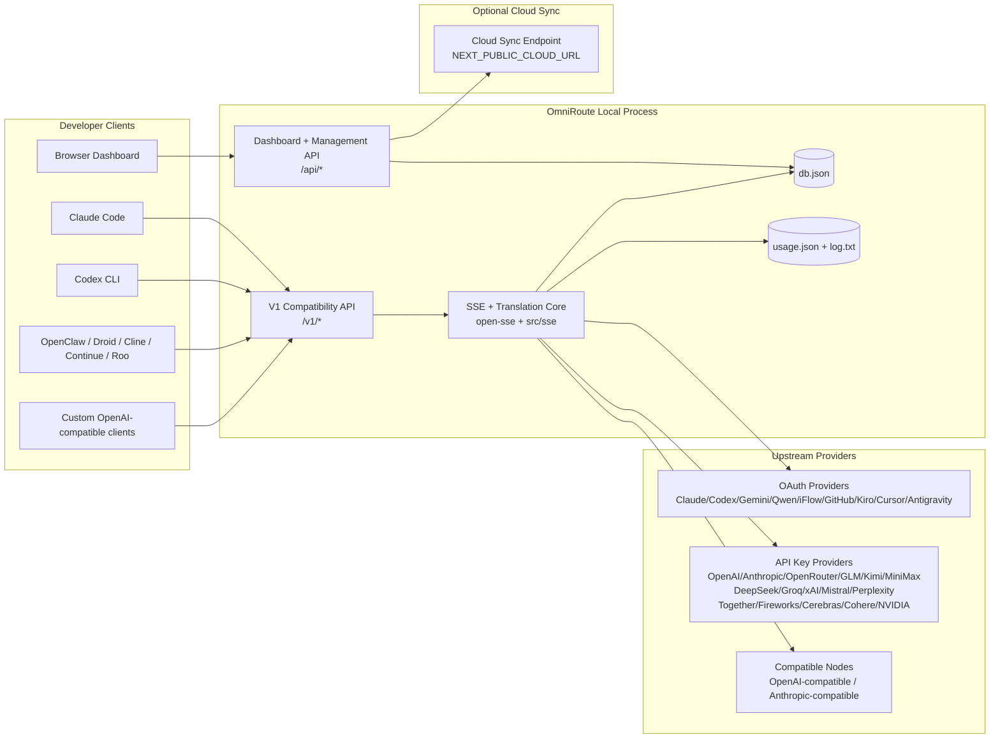
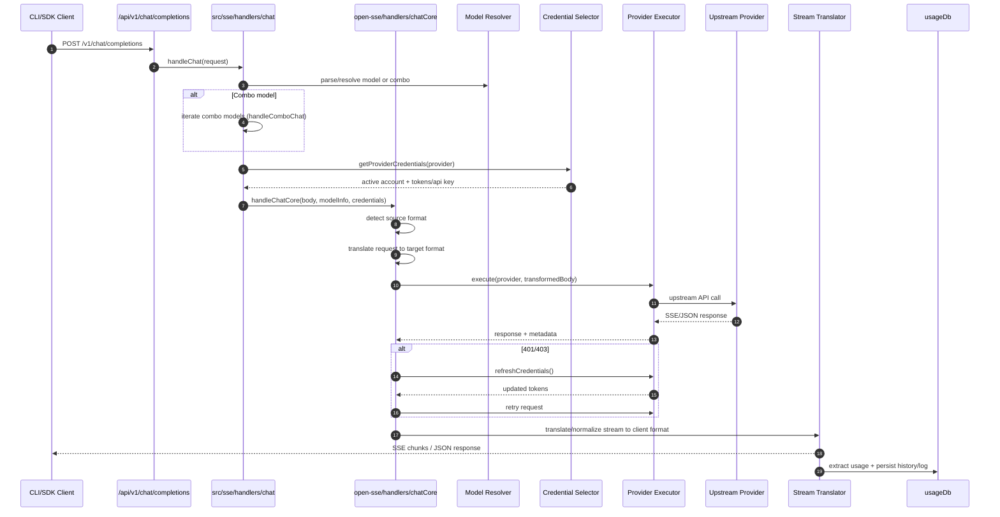
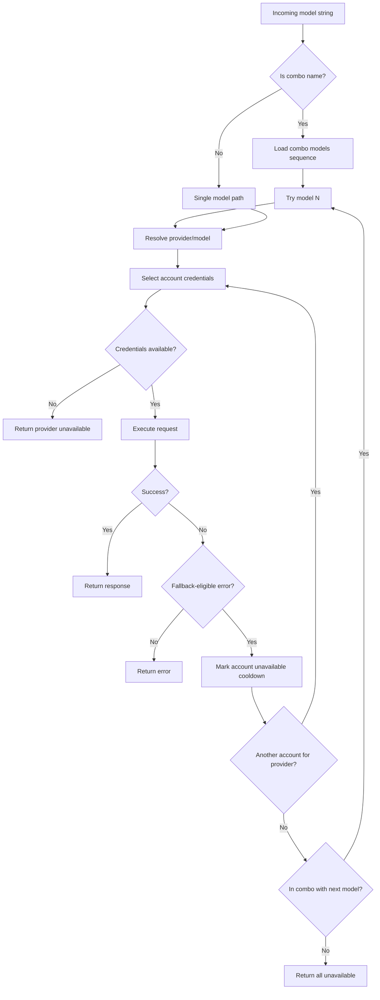
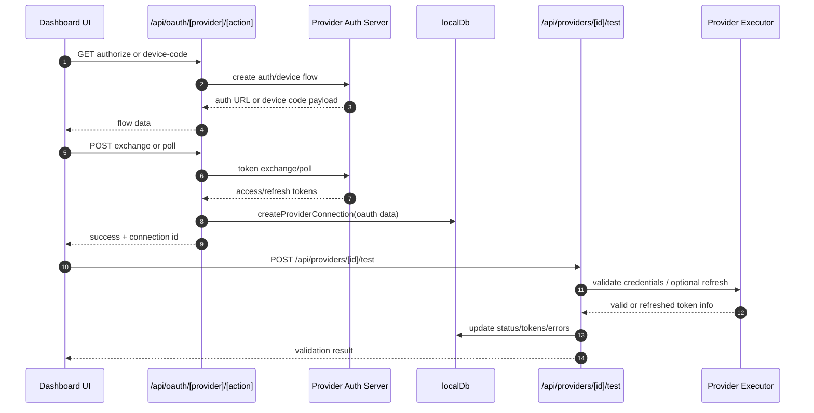
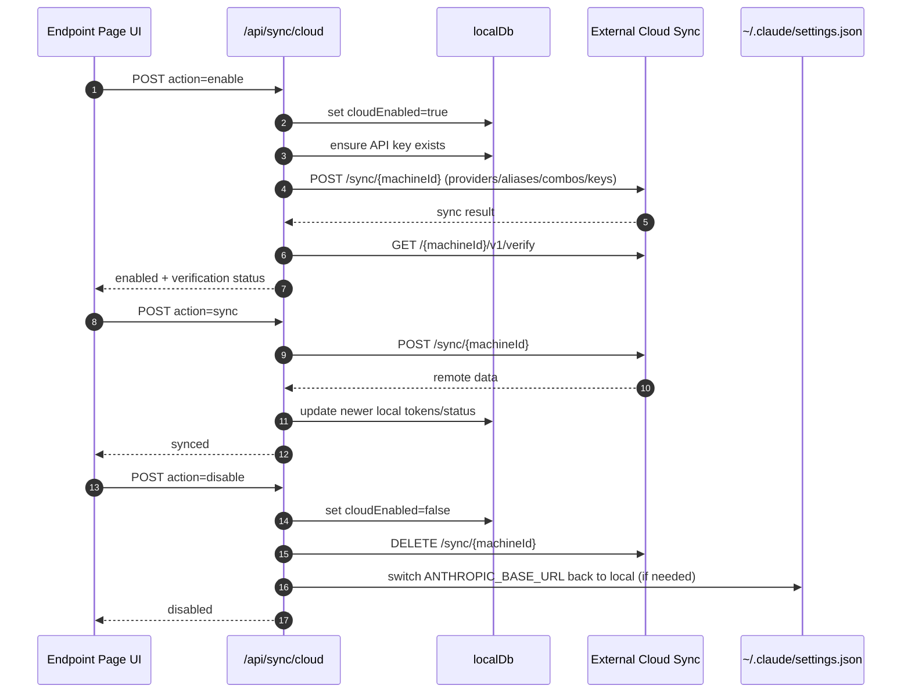
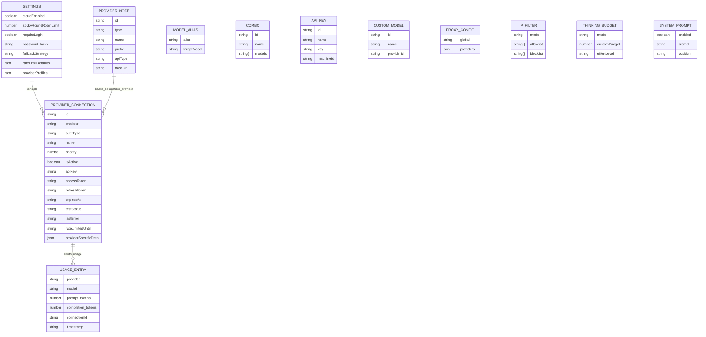
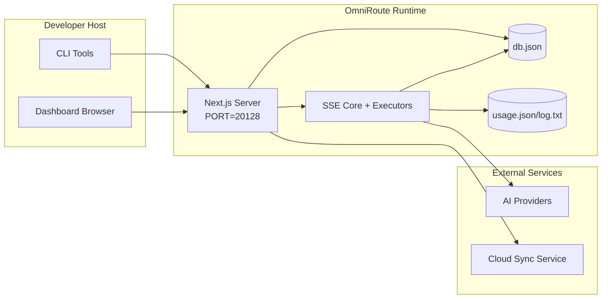

# OmniRoute-architectuur

🌐 **Languages:** 🇺🇸 [English](../../ARCHITECTURE.md) | 🇧🇷 [Português (Brasil)](../pt-BR/ARCHITECTURE.md) | 🇪🇸 [Español](../es/ARCHITECTURE.md) | 🇫🇷 [Français](../fr/ARCHITECTURE.md) | 🇮🇹 [Italiano](../it/ARCHITECTURE.md) | 🇷🇺 [Русский](../ru/ARCHITECTURE.md) | 🇨🇳 [中文 (简体)](../zh-CN/ARCHITECTURE.md) | 🇩🇪 [Deutsch](../de/ARCHITECTURE.md) | 🇮🇳 [हिन्दी](../in/ARCHITECTURE.md) | 🇹🇭 [ไทย](../th/ARCHITECTURE.md) | 🇺🇦 [Українська](../uk-UA/ARCHITECTURE.md) | 🇸🇦 [العربية](../ar/ARCHITECTURE.md) | 🇯🇵 [日本語](../ja/ARCHITECTURE.md) | 🇻🇳 [Tiếng Việt](../vi/ARCHITECTURE.md) | 🇧🇬 [Български](../bg/ARCHITECTURE.md) | 🇩🇰 [Dansk](../da/ARCHITECTURE.md) | 🇫🇮 [Suomi](../fi/ARCHITECTURE.md) | 🇮🇱 [עברית](../he/ARCHITECTURE.md) | 🇭🇺 [Magyar](../hu/ARCHITECTURE.md) | 🇮🇩 [Bahasa Indonesia](../id/ARCHITECTURE.md) | 🇰🇷 [한국어](../ko/ARCHITECTURE.md) | 🇲🇾 [Bahasa Melayu](../ms/ARCHITECTURE.md) | 🇳🇱 [Nederlands](../nl/ARCHITECTURE.md) | 🇳🇴 [Norsk](../no/ARCHITECTURE.md) | 🇵🇹 [Português (Portugal)](../pt/ARCHITECTURE.md) | 🇷🇴 [Română](../ro/ARCHITECTURE.md) | 🇵🇱 [Polski](../pl/ARCHITECTURE.md) | 🇸🇰 [Slovenčina](../sk/ARCHITECTURE.md) | 🇸🇪 [Svenska](../sv/ARCHITECTURE.md) | 🇵🇭 [Filipino](../phi/ARCHITECTURE.md)

_Laatst bijgewerkt: 2026-02-18_

## Samenvatting

OmniRoute is een lokale AI-routeringsgateway en dashboard gebouwd op Next.js.
Het biedt één OpenAI-compatibel eindpunt (`/v1/*`) en routeert verkeer over meerdere upstream-providers met vertaling, fallback, tokenvernieuwing en gebruiksregistratie.

Kernmogelijkheden:

- OpenAI-compatibel API-oppervlak voor CLI/tools (28 providers)
- Verzoek/antwoord-vertaling in verschillende providerformaten
- Modelcombo fallback (reeks met meerdere modellen)
- Terugval op accountniveau (meerdere accounts per provider)
- OAuth + API-sleutelproviderverbindingsbeheer
- Generatie inbedden via `/v1/embeddings` (6 providers, 9 modellen)
- Beeldgeneratie via `/v1/images/generations` (4 providers, 9 modellen)
- Denk aan het parseren van tags (`<think>...</think>`) voor redeneermodellen
- Reactieopschoning voor strikte OpenAI SDK-compatibiliteit
- Rolnormalisatie (ontwikkelaar → systeem, systeem → gebruiker) voor compatibiliteit tussen providers
- Gestructureerde uitvoerconversie (json_schema → Gemini responseSchema)
- Lokale persistentie voor providers, sleutels, aliassen, combo's, instellingen, prijzen
- Gebruik/kosten bijhouden en verzoekregistratie
- Optionele cloudsynchronisatie voor synchronisatie van meerdere apparaten/statussen
- IP-toelatingslijst/blokkeerlijst voor API-toegangscontrole
- Meedenken over budgetbeheer (passthrough/auto/custom/adaptive)
- Globale systeemprompt-injectie
- Sessie volgen en vingerafdrukken maken
- Verbeterde tarieflimieten per account met providerspecifieke profielen
- Stroomonderbrekerpatroon voor veerkracht van de provider
- Bescherming tegen donderende kuddes met mutex-vergrendeling
- Op handtekeningen gebaseerde cache voor deduplicatie van verzoeken
- Domeinlaag: modelbeschikbaarheid, kostenregels, fallback-beleid, lock-outbeleid
- Persistentie van domeinstatus (SQLite-schrijfcache voor fallbacks, budgetten, uitsluitingen, stroomonderbrekers)
- Beleidsengine voor gecentraliseerde verzoekevaluatie (lockout → budget → fallback)
- Telemetrie aanvragen met p50/p95/p99-latency-aggregatie
- Correlatie-ID (X-Request-Id) voor end-to-end tracering
- Compliance-auditregistratie met opt-out per API-sleutel
- Evaluatiekader voor LLM-kwaliteitsborging
- Veerkracht UI-dashboard met realtime stroomonderbrekerstatus
- Modulaire OAuth-providers (12 afzonderlijke modules onder `src/lib/oauth/providers/`)

Primair runtimemodel:

- Next.js-approutes onder `src/app/api/*` implementeren zowel dashboard-API's als compatibiliteits-API's
- Een gedeelde SSE/routing-kern in `src/sse/*` + `open-sse/*` zorgt voor de uitvoering, vertaling, streaming, fallback en gebruik van de provider

## Reikwijdte en grenzen

### Binnen bereik

- Lokale gateway-runtime
- Dashboardbeheer-API's
- Providerverificatie en tokenvernieuwing
- Vraag vertaling en SSE-streaming aan
- Lokale status + gebruikspersistentie
- Optionele cloudsynchronisatie-orkestratie

### Buiten bereik

- Implementatie van cloudservices achter `NEXT_PUBLIC_CLOUD_URL`
- Provider SLA/controlevlak buiten het lokale proces
- Externe CLI-binaire bestanden zelf (Claude CLI, Codex CLI, enz.)

## Systeemcontext op hoog niveau



## Kernruntime-componenten

## 1) API- en routeringslaag (Next.js app-routes)

Hoofdmappen:

- `src/app/api/v1/*` en `src/app/api/v1beta/*` voor compatibiliteits-API's
- `src/app/api/*` voor beheer-/configuratie-API's
- Volgende herschrijvingen in `next.config.mjs` brengen `/v1/*` in kaart naar `/api/v1/*`

Belangrijke compatibiliteitsroutes:

- `src/app/api/v1/chat/completions/route.ts`
- `src/app/api/v1/messages/route.ts`
- `src/app/api/v1/responses/route.ts`
- `src/app/api/v1/models/route.ts` — bevat aangepaste modellen met `custom: true`
- `src/app/api/v1/embeddings/route.ts` — generatie van inbedding (6 providers)
- `src/app/api/v1/images/generations/route.ts` — genereren van afbeeldingen (4+ providers incl. Antigravity/Nebius)
- `src/app/api/v1/messages/count_tokens/route.ts`
- `src/app/api/v1/providers/[provider]/chat/completions/route.ts` — speciale chat per provider
- `src/app/api/v1/providers/[provider]/embeddings/route.ts` — speciale insluitingen per provider
- `src/app/api/v1/providers/[provider]/images/generations/route.ts` — speciale afbeeldingen per provider
- `src/app/api/v1beta/models/route.ts`
- `src/app/api/v1beta/models/[...path]/route.ts`

Beheerdomeinen:

- Authenticatie/instellingen: `src/app/api/auth/*`, `src/app/api/settings/*`
- Providers/verbindingen: `src/app/api/providers*`
- Providerknooppunten: `src/app/api/provider-nodes*`
- Aangepaste modellen: `src/app/api/provider-models` (GET/POST/DELETE)
- Modelcatalogus: `src/app/api/models/catalog` (GET)
- Proxyconfiguratie: `src/app/api/settings/proxy` (GET/PUT/DELETE) + `src/app/api/settings/proxy/test` (POST)
- OAuth: `src/app/api/oauth/*`
- Sleutels/aliassen/combo's/prijzen: `src/app/api/keys*`, `src/app/api/models/alias`, `src/app/api/combos*`, `src/app/api/pricing`
- Gebruik: `src/app/api/usage/*`
- Synchroniseren/cloud: `src/app/api/sync/*`, `src/app/api/cloud/*`
- CLI-hulpmiddelen: `src/app/api/cli-tools/*`
- IP-filter: `src/app/api/settings/ip-filter` (GET/PUT)
- Denkbudget: `src/app/api/settings/thinking-budget` (GET/PUT)
- Systeemprompt: `src/app/api/settings/system-prompt` (GET/PUT)
- Sessies: `src/app/api/sessions` (KRIJGEN)
- Tarieflimieten: `src/app/api/rate-limits` (GET)
- Veerkracht: `src/app/api/resilience` (GET/PATCH) — providerprofielen, stroomonderbreker, snelheidslimietstatus
- Veerkracht reset: `src/app/api/resilience/reset` (POST) — reset onderbrekers + cooldowns
- Cachestatistieken: `src/app/api/cache/stats` (GET/DELETE)
- Beschikbaarheid van modellen: `src/app/api/models/availability` (GET/POST)
- Telemetrie: `src/app/api/telemetry/summary` (GET)
- Budget: `src/app/api/usage/budget` (GET/POST)
- Terugvalketens: `src/app/api/fallback/chains` (GET/POST/DELETE)
- Nalevingsaudit: `src/app/api/compliance/audit-log` (GET)
- Evaluaties: `src/app/api/evals` (KRIJGEN/POST), `src/app/api/evals/[suiteId]` (KRIJGEN)
- Beleid: `src/app/api/policies` (GET/POST)

## 2) SSE + vertaalkern

Hoofdstroommodules:

- Toegang: `src/sse/handlers/chat.ts`
- Kernorkestratie: `open-sse/handlers/chatCore.ts`
- Uitvoeringsadapters van provider: `open-sse/executors/*`
- Formaatdetectie/providerconfiguratie: `open-sse/services/provider.ts`
- Model parseren/oplossen: `src/sse/services/model.ts`, `open-sse/services/model.ts`
- Reservelogica voor accounts: `open-sse/services/accountFallback.ts`
- Vertaalregister: `open-sse/translator/index.ts`
- Streamtransformaties: `open-sse/utils/stream.ts`, `open-sse/utils/streamHandler.ts`
- Gebruiksextractie/normalisatie: `open-sse/utils/usageTracking.ts`
- Denk aan tag-parser: `open-sse/utils/thinkTagParser.ts`
- Inbeddingshandler: `open-sse/handlers/embeddings.ts`
- Providerregister insluiten: `open-sse/config/embeddingRegistry.ts`
- Handler voor het genereren van afbeeldingen: `open-sse/handlers/imageGeneration.ts`
- Register van beeldaanbieder: `open-sse/config/imageRegistry.ts`
- Reactie-opschoning: `open-sse/handlers/responseSanitizer.ts`
- Rolnormalisatie: `open-sse/services/roleNormalizer.ts`

Diensten (bedrijfslogica):

- Accountselectie/score: `open-sse/services/accountSelector.ts`
- Contextlevenscyclusbeheer: `open-sse/services/contextManager.ts`
- Handhaving van IP-filter: `open-sse/services/ipFilter.ts`
- Sessie volgen: `open-sse/services/sessionManager.ts`
- Ontdubbeling aanvragen: `open-sse/services/signatureCache.ts`
- Systeemprompt injectie: `open-sse/services/systemPrompt.ts`
- Denken aan budgetbeheer: `open-sse/services/thinkingBudget.ts`
- Routering van wildcardmodellen: `open-sse/services/wildcardRouter.ts`
- Tarieflimietbeheer: `open-sse/services/rateLimitManager.ts`
- Stroomonderbreker: `open-sse/services/circuitBreaker.ts`

Domeinlaagmodules:

- Beschikbaarheid van modellen: `src/lib/domain/modelAvailability.ts`
- Kostenregels/budgetten: `src/lib/domain/costRules.ts`
- Terugvalbeleid: `src/lib/domain/fallbackPolicy.ts`
- Combo-oplosser: `src/lib/domain/comboResolver.ts`
- Uitsluitingsbeleid: `src/lib/domain/lockoutPolicy.ts`
- Beleidsengine: `src/domain/policyEngine.ts` — gecentraliseerde uitsluiting → budget → fallback-evaluatie
- Foutcodecatalogus: `src/lib/domain/errorCodes.ts`
- Verzoek-ID: `src/lib/domain/requestId.ts`
- Time-out ophalen: `src/lib/domain/fetchTimeout.ts`
- Telemetrie aanvragen: `src/lib/domain/requestTelemetry.ts`
- Naleving/audit: `src/lib/domain/compliance/index.ts`
- Evaluatie loper: `src/lib/domain/evalRunner.ts`
- Persistentie van domeinstatus: `src/lib/db/domainState.ts` — SQLite CRUD voor fallback-ketens, budgetten, kostengeschiedenis, uitsluitingsstatus, stroomonderbrekers

OAuth-providermodules (12 afzonderlijke bestanden onder `src/lib/oauth/providers/`):

- Registerindex: `src/lib/oauth/providers/index.ts`
- Individuele providers: `claude.ts`, `codex.ts`, `gemini.ts`, `antigravity.ts`, `iflow.ts`, `qwen.ts`, `kimi-coding.ts`, `github.ts`, `kiro.ts`, `cursor.ts`, `kilocode.ts`, `cline.ts`
- Dunne verpakking: `src/lib/oauth/providers.ts` — exporteert opnieuw vanuit afzonderlijke modules

## 3) Persistentielaag

Primaire staat DB:

- `src/lib/localDb.ts`
- bestand: `${DATA_DIR}/db.json` (of `$XDG_CONFIG_HOME/omniroute/db.json` indien ingesteld, anders `~/.omniroute/db.json`)
- entiteiten: providerConnections, providerNodes, modelAliases, combo's, apiKeys, instellingen, prijzen, **customModels**, **proxyConfig**, **ipFilter**, **thinkingBudget**, **systemPrompt**

Gebruiksdatabase:

- `src/lib/usageDb.ts`
- bestanden: `${DATA_DIR}/usage.json`, `${DATA_DIR}/log.txt`, `${DATA_DIR}/call_logs/`
- volgt hetzelfde basismapbeleid als `localDb` (`DATA_DIR`, daarna `XDG_CONFIG_HOME/omniroute` indien ingesteld)
- opgesplitst in gerichte submodules: `migrations.ts`, `usageHistory.ts`, `costCalculator.ts`, `usageStats.ts`, `callLogs.ts`

Domeinstatus DB (SQLite):

- `src/lib/db/domainState.ts` — CRUD-bewerkingen voor domeinstatus
- Tabellen (aangemaakt in `src/lib/db/core.ts`): `domain_fallback_chains`, `domain_budgets`, `domain_cost_history`, `domain_lockout_state`, `domain_circuit_breakers`
- Doorschrijfcachepatroon: kaarten in het geheugen zijn gezaghebbend tijdens runtime; mutaties worden synchroon naar SQLite geschreven; status wordt hersteld vanuit DB bij koude start

## 4) Auth + beveiligingsoppervlakken

- Dashboardcookieverificatie: `src/proxy.ts`, `src/app/api/auth/login/route.ts`
- API-sleutel genereren/verificatie: `src/shared/utils/apiKey.ts`
- Providergeheimen bleven bestaan in `providerConnections` vermeldingen
- Ondersteuning voor uitgaande proxy's via `open-sse/utils/proxyFetch.ts` (env vars) en `open-sse/utils/networkProxy.ts` (configureerbaar per provider of wereldwijd)

## 5) Cloudsynchronisatie

- Initiële planner: `src/lib/initCloudSync.ts`, `src/shared/services/initializeCloudSync.ts`
- Periodieke taak: `src/shared/services/cloudSyncScheduler.ts`
- Controleroute: `src/app/api/sync/cloud/route.ts`

## Aanvraaglevenscyclus (`/v1/chat/completions`)



## Combo + terugvalstroom voor accounts



Terugvalbeslissingen worden aangestuurd door `open-sse/services/accountFallback.ts` met behulp van statuscodes en heuristieken voor foutmeldingen.

## OAuth-onboarding en levenscyclus van tokenvernieuwing



Vernieuwen tijdens live verkeer wordt uitgevoerd binnen `open-sse/handlers/chatCore.ts` via uitvoerder `refreshCredentials()`.

## Cloud Sync-levenscyclus (inschakelen / synchroniseren / uitschakelen)



Periodieke synchronisatie wordt geactiveerd door `CloudSyncScheduler` wanneer de cloud is ingeschakeld.

## Gegevensmodel en opslagkaart



Fysieke opslagbestanden:

- hoofdstatus: `${DATA_DIR}/db.json` (of `$XDG_CONFIG_HOME/omniroute/db.json` indien ingesteld, anders `~/.omniroute/db.json`)
- gebruiksstatistieken: `${DATA_DIR}/usage.json`
- logregels opvragen: `${DATA_DIR}/log.txt`
- optionele foutopsporingssessies voor vertalers/verzoeken: `<repo>/logs/...`

## Implementatietopologie



## Moduletoewijzing (beslissingskritisch)

### Route- en API-modules

- `src/app/api/v1/*`, `src/app/api/v1beta/*`: compatibiliteits-API's
- `src/app/api/v1/providers/[provider]/*`: speciale routes per provider (chat, insluitingen, afbeeldingen)
- `src/app/api/providers*`: provider CRUD, validatie, testen
- `src/app/api/provider-nodes*`: aangepast compatibel knooppuntbeheer
- `src/app/api/provider-models`: aangepast modelbeheer (CRUD)
- `src/app/api/models/catalog`: volledige modelcatalogus-API (alle typen gegroepeerd op provider)
- `src/app/api/oauth/*`: OAuth/apparaatcodestromen
- `src/app/api/keys*`: levenscyclus van lokale API-sleutel
- `src/app/api/models/alias`: aliasbeheer
- `src/app/api/combos*`: fallback-combobeheer
- `src/app/api/pricing`: prijsoverschrijvingen voor kostenberekening
- `src/app/api/settings/proxy`: proxyconfiguratie (GET/PUT/DELETE)
- `src/app/api/settings/proxy/test`: uitgaande proxy-connectiviteitstest (POST)
- `src/app/api/usage/*`: API's voor gebruik en logboeken
- `src/app/api/sync/*` + `src/app/api/cloud/*`: cloudsynchronisatie en cloudgerichte helpers
- `src/app/api/cli-tools/*`: lokale CLI-configuratieschrijvers/-controleurs
- `src/app/api/settings/ip-filter`: IP-toelatingslijst/blokkeerlijst (GET/PUT)
- `src/app/api/settings/thinking-budget`: configuratie voor denkend tokenbudget (GET/PUT)
- `src/app/api/settings/system-prompt`: algemene systeemprompt (GET/PUT)
- `src/app/api/sessions`: actieve sessielijst (GET)
- `src/app/api/rate-limits`: tarieflimietstatus per account (GET)

### Routing- en uitvoeringskern

- `src/sse/handlers/chat.ts`: verzoekparse, combo-afhandeling, accountselectielus
- `open-sse/handlers/chatCore.ts`: vertaling, verzending van de uitvoerder, afhandeling van opnieuw proberen/vernieuwen, stream-instellingen
- `open-sse/executors/*`: providerspecifiek netwerk- en formaatgedrag

### Vertaalregister en formaatconverters

- `open-sse/translator/index.ts`: register en orkestratie van vertalers
- Vertalers aanvragen: `open-sse/translator/request/*`
- Antwoordvertalers: `open-sse/translator/response/*`
- Formaatconstanten: `open-sse/translator/formats.ts`

### Volharding

- `src/lib/localDb.ts`: persistente configuratie/status
- `src/lib/usageDb.ts`: gebruiksgeschiedenis en logbestanden met doorlopende aanvragen

## Dekking van de provider-uitvoerder (strategiepatroon)

Elke provider heeft een gespecialiseerde uitvoerder die `BaseExecutor` uitbreidt (in `open-sse/executors/base.ts`), die zorgt voor het bouwen van URL's, het bouwen van headers, nieuwe pogingen met exponentiële uitstel, hooks voor het vernieuwen van referenties en de orkestratiemethode `execute()`.

| executeur             | Aanbieder(s)                                                                                                                                                | Speciale behandeling                                                         |
| --------------------- | ----------------------------------------------------------------------------------------------------------------------------------------------------------- | ---------------------------------------------------------------------------- |
| `DefaultExecutor`     | OpenAI, Claude, Gemini, Qwen, iFlow, OpenRouter, GLM, Kimi, MiniMax, DeepSeek, Groq, xAI, Mistral, Verbijstering, Samen, Vuurwerk, Cerebras, Cohere, NVIDIA | Dynamische URL/header-configuratie per provider                              |
| `AntigravityExecutor` | Google Antizwaartekracht                                                                                                                                    | Aangepaste project-/sessie-ID's, opnieuw proberen na parseren                |
| `CodexExecutor`       | OpenAI-codex                                                                                                                                                | Injecteert systeeminstructies, dwingt redeneerinspanning af                  |
| `CursorExecutor`      | Cursor-IDE                                                                                                                                                  | ConnectRPC-protocol, Protobuf-codering, ondertekening aanvragen via checksum |
| `GithubExecutor`      | GitHub-copiloot                                                                                                                                             | Copilot-token vernieuwen, VSCode-nabootsende headers                         |
| `KiroExecutor`        | AWS CodeWhisperer/Kiro                                                                                                                                      | AWS EventStream binair formaat → SSE-conversie                               |
| `GeminiCLIExecutor`   | Tweeling CLI                                                                                                                                                | Vernieuwingscyclus van Google OAuth-token                                    |

Alle andere providers (inclusief aangepaste compatibele knooppunten) gebruiken de `DefaultExecutor`.

## Compatibiliteitsmatrix voor providers

| Aanbieder         | Formaat            | Autorisatie            | Stroom           | Niet-stream | Token vernieuwen | Gebruiks-API               |
| ----------------- | ------------------ | ---------------------- | ---------------- | ----------- | ---------------- | -------------------------- |
| Claude            | claude             | API-sleutel / OAuth    | ✅               | ✅          | ✅               | ⚠️Alleen beheerder         |
| Tweeling          | Tweeling           | API-sleutel / OAuth    | ✅               | ✅          | ✅               | ⚠️ Cloudconsole            |
| Tweeling CLI      | tweeling-cli       | OAuth                  | ✅               | ✅          | ✅               | ⚠️ Cloudconsole            |
| Antizwaartekracht | anti-zwaartekracht | OAuth                  | ✅               | ✅          | ✅               | ✅ Volledige quota-API     |
| Open AI           | openai             | API-sleutel            | ✅               | ✅          | ❌               | ❌                         |
| Codex             | openai-reacties    | OAuth                  | ✅ gedwongen     | ❌          | ✅               | ✅ Tarieflimieten          |
| GitHub-copiloot   | openai             | OAuth + Copilot-token  | ✅               | ✅          | ✅               | ✅ Momentopnamen van quota |
| Cursor            | cursor             | Aangepaste controlesom | ✅               | ✅          | ❌               | ❌                         |
| Kiro              | kiro               | AWS SSO OIDC           | ✅ (EventStream) | ❌          | ✅               | ✅ Gebruikslimieten        |
| Qwen              | openai             | OAuth                  | ✅               | ✅          | ✅               | ⚠️Per aanvraag             |
| iFlow             | openai             | OAuth (basis)          | ✅               | ✅          | ✅               | ⚠️Per aanvraag             |
| OpenRouter        | openai             | API-sleutel            | ✅               | ✅          | ❌               | ❌                         |
| GLM/Kimi/MiniMax  | claude             | API-sleutel            | ✅               | ✅          | ❌               | ❌                         |
| DeepSeek          | openai             | API-sleutel            | ✅               | ✅          | ❌               | ❌                         |
| Groq              | openai             | API-sleutel            | ✅               | ✅          | ❌               | ❌                         |
| xAI (Grok)        | openai             | API-sleutel            | ✅               | ✅          | ❌               | ❌                         |
| Mistral           | openai             | API-sleutel            | ✅               | ✅          | ❌               | ❌                         |
| Verbijstering     | openai             | API-sleutel            | ✅               | ✅          | ❌               | ❌                         |
| Samen AI          | openai             | API-sleutel            | ✅               | ✅          | ❌               | ❌                         |
| Vuurwerk AI       | openai             | API-sleutel            | ✅               | ✅          | ❌               | ❌                         |
| Hersenen          | openai             | API-sleutel            | ✅               | ✅          | ❌               | ❌                         |
| Cohier            | openai             | API-sleutel            | ✅               | ✅          | ❌               | ❌                         |
| NVIDIA NIM        | openai             | API-sleutel            | ✅               | ✅          | ❌               | ❌                         |

## Dekking van formaatvertalingen

Gedetecteerde bronformaten zijn onder meer:

- `openai`
- `openai-responses`
- `claude`
- `gemini`

Doelformaten zijn onder meer:

- OpenAI-chat/reacties
  -Claude
- Gemini/Gemini-CLI/Antigravity-envelop
- Kiro
- Cursor

Vertalingen gebruiken **OpenAI als hubformaat** — alle conversies gaan via OpenAI als tussenproduct:

```
Source Format → OpenAI (hub) → Target Format
```

Vertalingen worden dynamisch geselecteerd op basis van de vorm van de bronpayload en het doelformaat van de provider.

Extra verwerkingslagen in de vertaalpijplijn:

- **Opschoning van reacties** — Verwijdert niet-standaardvelden uit reacties in OpenAI-formaat (zowel streaming als niet-streaming) om strikte SDK-naleving te garanderen
- **Rolnormalisatie** — Converteert `developer` → `system` voor niet-OpenAI-doelen; voegt `system` → `user` samen voor modellen die de systeemrol afwijzen (GLM, ERNIE)
- **Think tag-extractie** — Parseert `<think>...</think>` blokken uit de inhoud in het veld `reasoning_content`
- **Gestructureerde uitvoer** — Converteert OpenAI `response_format.json_schema` naar Gemini's `responseMimeType` + `responseSchema`

## Ondersteunde API-eindpunten

| Eindpunt                                           | Formaat              | Behandelaar                                                     |
| -------------------------------------------------- | -------------------- | --------------------------------------------------------------- |
| `POST /v1/chat/completions`                        | OpenAI-chat          | `src/sse/handlers/chat.ts`                                      |
| `POST /v1/messages`                                | Claude-berichten     | Dezelfde handler (automatisch gedetecteerd)                     |
| `POST /v1/responses`                               | OpenAI-reacties      | `open-sse/handlers/responsesHandler.ts`                         |
| `POST /v1/embeddings`                              | OpenAI-insluitingen  | `open-sse/handlers/embeddings.ts`                               |
| `GET /v1/embeddings`                               | Modellijst           | API-route                                                       |
| `POST /v1/images/generations`                      | OpenAI-afbeeldingen  | `open-sse/handlers/imageGeneration.ts`                          |
| `GET /v1/images/generations`                       | Modellijst           | API-route                                                       |
| `POST /v1/providers/{provider}/chat/completions`   | OpenAI-chat          | Toegewijd per provider met modelvalidatie                       |
| `POST /v1/providers/{provider}/embeddings`         | OpenAI-insluitingen  | Toegewijd per provider met modelvalidatie                       |
| `POST /v1/providers/{provider}/images/generations` | OpenAI-afbeeldingen  | Toegewijd per provider met modelvalidatie                       |
| `POST /v1/messages/count_tokens`                   | Claude-tokentelling  | API-route                                                       |
| `GET /v1/models`                                   | OpenAI-modellenlijst | API-route (chat + insluiten + afbeelding + aangepaste modellen) |
| `GET /api/models/catalog`                          | Catalogus            | Alle modellen gegroepeerd op aanbieder + type                   |
| `POST /v1beta/models/*:streamGenerateContent`      | Gemini geboren       | API-route                                                       |
| `GET/PUT/DELETE /api/settings/proxy`               | Proxyconfiguratie    | Netwerkproxyconfiguratie                                        |
| `POST /api/settings/proxy/test`                    | Proxy-connectiviteit | Eindpunt proxystatus/connectiviteitstest                        |
| `GET/POST/DELETE /api/provider-models`             | Aangepaste modellen  | Maatwerkmodelbeheer per provider                                |

## Bypass-handler

De bypass-handler (`open-sse/utils/bypassHandler.ts`) onderschept bekende "wegwerp"-verzoeken van Claude CLI (opwarmingspings, titelextracties en tokentellingen) en retourneert een **vals antwoord** zonder upstream-providertokens te verbruiken. Dit wordt alleen geactiveerd als `User-Agent` `claude-cli` bevat.

## Loggerpijplijn aanvragen

De verzoeklogger (`open-sse/utils/requestLogger.ts`) biedt een pijplijn voor het opsporen van fouten in 7 fasen, standaard uitgeschakeld en ingeschakeld via `ENABLE_REQUEST_LOGS=true`:

```
1_req_client.json → 2_req_source.json → 3_req_openai.json → 4_req_target.json
→ 5_res_provider.txt → 6_res_openai.txt → 7_res_client.txt
```

Voor elke verzoeksessie worden bestanden naar `<repo>/logs/<session>/` geschreven.

## Faalmodi en veerkracht

## 1) Beschikbaarheid van account/provider

- Afkoelperiode van provideraccount bij tijdelijke/snelheids-/authenticatiefouten
- accountterugval voordat het verzoek mislukt
- Terugval op combo-modellen wanneer het huidige model-/providerpad is uitgeput

## 2) Vervaldatum van token

- vooraf controleren en vernieuwen met nieuwe poging voor vernieuwbare providers
- 401/403 opnieuw proberen na vernieuwingspoging in kernpad

## 3) Streamveiligheid

- verbindingsbewuste streamcontroller
- vertaalstroom met end-of-stream flush en `[DONE]` afhandeling
- Terugval in gebruiksschattingen wanneer metagegevens over het gebruik van de provider ontbreken

## 4) Verslechtering van cloudsynchronisatie

- Er zijn synchronisatiefouten opgetreden, maar de lokale runtime gaat door
- Scheduler heeft logica die geschikt is voor opnieuw proberen, maar periodieke uitvoering roept momenteel standaard synchronisatie met één poging aan

## 5) Gegevensintegriteit

- DB-vormmigratie/reparatie voor ontbrekende sleutels
- corrupte JSON-resetbeveiligingen voor localDb en UseDb

## Waarneembaarheid en operationele signalen

Bronnen voor runtime-zichtbaarheid:

- consolelogboeken van `src/sse/utils/logger.ts`
- gebruiksaggregaten per verzoek in `usage.json`
- tekstueel verzoek status inloggen `log.txt`
- optionele diepe verzoek-/vertaallogboeken onder `logs/` wanneer `ENABLE_REQUEST_LOGS=true`
- eindpunten voor dashboardgebruik (`/api/usage/*`) voor UI-verbruik

## Beveiligingsgevoelige grenzen

- JWT-geheim (`JWT_SECRET`) beveiligt de verificatie/ondertekening van dashboardsessiecookies
- Initiële wachtwoord-fallback (`INITIAL_PASSWORD`, standaard `123456`) moet worden overschreven in echte implementaties
- API-sleutel HMAC-geheim (`API_KEY_SECRET`) beveiligt het gegenereerde lokale API-sleutelformaat
- Providergeheimen (API-sleutels/tokens) worden bewaard in de lokale database en moeten worden beschermd op bestandssysteemniveau
- Cloudsynchronisatie-eindpunten zijn afhankelijk van API-sleutelauthenticatie en machine-ID-semantiek

## Omgevings- en runtimematrix

Omgevingsvariabelen die actief worden gebruikt door code:

- App/authenticatie: `JWT_SECRET`, `INITIAL_PASSWORD`
- Opslag: `DATA_DIR`
- Compatibel knooppuntgedrag: `ALLOW_MULTI_CONNECTIONS_PER_COMPAT_NODE`
- Optionele opslagbasisoverschrijving (Linux/macOS wanneer `DATA_DIR` niet is ingesteld): `XDG_CONFIG_HOME`
- Beveiligingshashing: `API_KEY_SECRET`, `MACHINE_ID_SALT`
- Logboekregistratie: `ENABLE_REQUEST_LOGS`
- Synchroniseren/cloud-URL's: `NEXT_PUBLIC_BASE_URL`, `NEXT_PUBLIC_CLOUD_URL`
- Uitgaande proxy: `HTTP_PROXY`, `HTTPS_PROXY`, `ALL_PROXY`, `NO_PROXY` en varianten in kleine letters
- SOCKS5-functievlaggen: `ENABLE_SOCKS5_PROXY`, `NEXT_PUBLIC_ENABLE_SOCKS5_PROXY`
- Platform-/runtime-helpers (niet app-specifieke configuratie): `APPDATA`, `NODE_ENV`, `PORT`, `HOSTNAME`

## Bekende architecturale aantekeningen

1. `usageDb` en `localDb` delen nu hetzelfde basismapbeleid (`DATA_DIR` -> `XDG_CONFIG_HOME/omniroute` -> `~/.omniroute`) met oudere bestandsmigratie.
2. `/api/v1/route.ts` retourneert een statische modellenlijst en is niet de belangrijkste modellenbron die wordt gebruikt door `/v1/models`.
3. Verzoeklogger schrijft volledige headers/body indien ingeschakeld; behandel de logmap als gevoelig.
4. Het cloudgedrag is afhankelijk van de juiste `NEXT_PUBLIC_BASE_URL` en bereikbaarheid van het cloudeindpunt.
5. De map `open-sse/` wordt gepubliceerd als het `@omniroute/open-sse` **npm-werkruimtepakket**. De broncode importeert deze via `@omniroute/open-sse/...` (opgelost door Next.js `transpilePackages`). Bestandspaden in dit document gebruiken nog steeds de mapnaam `open-sse/` voor consistentie.
6. Grafieken in het dashboard maken gebruik van **Recharts** (op SVG-basis) voor toegankelijke, interactieve analytische visualisaties (staafdiagrammen voor modelgebruik, uitsplitsingstabellen van providers met succespercentages).
7. E2E-tests gebruiken **Toneelschrijver** (`tests/e2e/`), uitgevoerd via `npm run test:e2e`. Eenheidstests gebruiken **Node.js testrunner** (`tests/unit/`), uitgevoerd via `npm run test:plan3`. Broncode onder `src/` is **TypeScript** (`.ts`/`.tsx`); de `open-sse/` werkruimte blijft JavaScript (`.js`).
8. De instellingenpagina is onderverdeeld in 5 tabbladen: Beveiliging, Routing (6 globale strategieën: eerst vullen, round-robin, p2c, willekeurig, minst gebruikt, kostengeoptimaliseerd), veerkracht (bewerkbare snelheidslimieten, stroomonderbreker, beleid), AI (denkbudget, systeemprompt, promptcache), Geavanceerd (proxy).

## Operationele verificatiechecklist

- Bouw vanaf de bron: `npm run build`
- Bouw Docker-afbeelding: `docker build -t omniroute .`
- Start de service en controleer:
- `GET /api/settings`
- `GET /api/v1/models`
- CLI-doelbasis-URL moet `http://<host>:20128/v1` zijn wanneer `PORT=20128`
