# omniroute — Codebase-documentatie

🌐 **Languages:** 🇺🇸 [English](../../CODEBASE_DOCUMENTATION.md) | 🇧🇷 [Português (Brasil)](../pt-BR/CODEBASE_DOCUMENTATION.md) | 🇪🇸 [Español](../es/CODEBASE_DOCUMENTATION.md) | 🇫🇷 [Français](../fr/CODEBASE_DOCUMENTATION.md) | 🇮🇹 [Italiano](../it/CODEBASE_DOCUMENTATION.md) | 🇷🇺 [Русский](../ru/CODEBASE_DOCUMENTATION.md) | 🇨🇳 [中文 (简体)](../zh-CN/CODEBASE_DOCUMENTATION.md) | 🇩🇪 [Deutsch](../de/CODEBASE_DOCUMENTATION.md) | 🇮🇳 [हिन्दी](../in/CODEBASE_DOCUMENTATION.md) | 🇹🇭 [ไทย](../th/CODEBASE_DOCUMENTATION.md) | 🇺🇦 [Українська](../uk-UA/CODEBASE_DOCUMENTATION.md) | 🇸🇦 [العربية](../ar/CODEBASE_DOCUMENTATION.md) | 🇯🇵 [日本語](../ja/CODEBASE_DOCUMENTATION.md) | 🇻🇳 [Tiếng Việt](../vi/CODEBASE_DOCUMENTATION.md) | 🇧🇬 [Български](../bg/CODEBASE_DOCUMENTATION.md) | 🇩🇰 [Dansk](../da/CODEBASE_DOCUMENTATION.md) | 🇫🇮 [Suomi](../fi/CODEBASE_DOCUMENTATION.md) | 🇮🇱 [עברית](../he/CODEBASE_DOCUMENTATION.md) | 🇭🇺 [Magyar](../hu/CODEBASE_DOCUMENTATION.md) | 🇮🇩 [Bahasa Indonesia](../id/CODEBASE_DOCUMENTATION.md) | 🇰🇷 [한국어](../ko/CODEBASE_DOCUMENTATION.md) | 🇲🇾 [Bahasa Melayu](../ms/CODEBASE_DOCUMENTATION.md) | 🇳🇱 [Nederlands](../nl/CODEBASE_DOCUMENTATION.md) | 🇳🇴 [Norsk](../no/CODEBASE_DOCUMENTATION.md) | 🇵🇹 [Português (Portugal)](../pt/CODEBASE_DOCUMENTATION.md) | 🇷🇴 [Română](../ro/CODEBASE_DOCUMENTATION.md) | 🇵🇱 [Polski](../pl/CODEBASE_DOCUMENTATION.md) | 🇸🇰 [Slovenčina](../sk/CODEBASE_DOCUMENTATION.md) | 🇸🇪 [Svenska](../sv/CODEBASE_DOCUMENTATION.md) | 🇵🇭 [Filipino](../phi/CODEBASE_DOCUMENTATION.md)

> Een uitgebreide, beginnersvriendelijke gids voor de **omniroute** AI-proxyrouter met meerdere providers.

---

## 1. Wat is omniroute?

omniroute is een **proxyrouter** die zich tussen AI-clients (Claude CLI, Codex, Cursor IDE, enz.) en AI-providers (Anthropic, Google, OpenAI, AWS, GitHub, enz.) bevindt. Het lost één groot probleem op:

> **Verschillende AI-clients spreken verschillende "talen" (API-formaten), en verschillende AI-providers verwachten ook verschillende "talen".** omniroute vertaalt automatisch tussen hen.

Zie het als een universele vertaler bij de Verenigde Naties: elke afgevaardigde kan elke taal spreken, en de vertaler zet deze om voor elke andere afgevaardigde.

---

## 2. Architectuuroverzicht

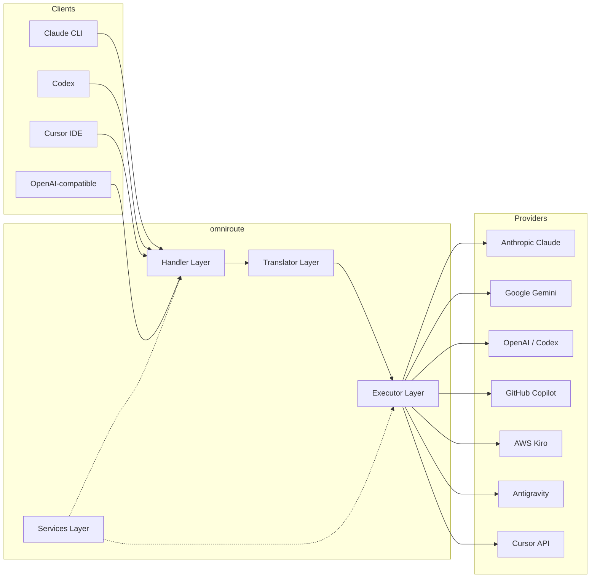

### Kernprincipe: Hub-and-spoke-vertaling

Alle formaatvertalingen passeren het **OpenAI-formaat als hub**:

```
Client Format → [OpenAI Hub] → Provider Format    (request)
Provider Format → [OpenAI Hub] → Client Format    (response)
```

Dit betekent dat u slechts **N vertalers** nodig heeft (één per formaat) in plaats van **N²** (elk paar).

---

## 3. Projectstructuur

```
omniroute/
├── open-sse/                  ← Core proxy library (portable, framework-agnostic)
│   ├── index.js               ← Main entry point, exports everything
│   ├── config/                ← Configuration & constants
│   ├── executors/             ← Provider-specific request execution
│   ├── handlers/              ← Request handling orchestration
│   ├── services/              ← Business logic (auth, models, fallback, usage)
│   ├── translator/            ← Format translation engine
│   │   ├── request/           ← Request translators (8 files)
│   │   ├── response/          ← Response translators (7 files)
│   │   └── helpers/           ← Shared translation utilities (6 files)
│   └── utils/                 ← Utility functions
├── src/                       ← Application layer (Express/Worker runtime)
│   ├── app/                   ← Web UI, API routes, middleware
│   ├── lib/                   ← Database, auth, and shared library code
│   ├── mitm/                  ← Man-in-the-middle proxy utilities
│   ├── models/                ← Database models
│   ├── shared/                ← Shared utilities (wrappers around open-sse)
│   ├── sse/                   ← SSE endpoint handlers
│   └── store/                 ← State management
├── data/                      ← Runtime data (credentials, logs)
│   └── provider-credentials.json   (external credentials override, gitignored)
└── tester/                    ← Test utilities
```

---

## 4. Uitsplitsing per module

### 4.1 configuratie (`open-sse/config/`)

De **enige bron van waarheid** voor alle providerconfiguraties.

| Bestand                       | Doel                                                                                                                                                                                                                         |
| ----------------------------- | ---------------------------------------------------------------------------------------------------------------------------------------------------------------------------------------------------------------------------- |
| `constants.ts`                | `PROVIDERS` object met basis-URL's, OAuth-inloggegevens (standaard), headers en standaardsysteemprompts voor elke provider. Definieert ook `HTTP_STATUS`, `ERROR_TYPES`, `COOLDOWN_MS`, `BACKOFF_CONFIG` en `SKIP_PATTERNS`. |
| `credentialLoader.ts`         | Laadt externe inloggegevens van `data/provider-credentials.json` en voegt deze samen met de hardgecodeerde standaardwaarden in `PROVIDERS`. Houdt geheimen buiten de broncontrole en behoudt achterwaartse compatibiliteit.  |
| `providerModels.ts`           | Centraal modelregister: brengt provideraliassen in kaart → model-ID's. Functies zoals `getModels()`, `getProviderByAlias()`.                                                                                                 |
| `codexInstructions.ts`        | Systeeminstructies geïnjecteerd in Codex-verzoeken (bewerkingsbeperkingen, sandbox-regels, goedkeuringsbeleid).                                                                                                              |
| `defaultThinkingSignature.ts` | Standaard "denkende" handtekeningen voor Claude- en Gemini-modellen.                                                                                                                                                         |
| `ollamaModels.ts`             | Schemadefinitie voor lokale Ollama-modellen (naam, grootte, familie, kwantisering).                                                                                                                                          |

#### Laadstroom van inloggegevens

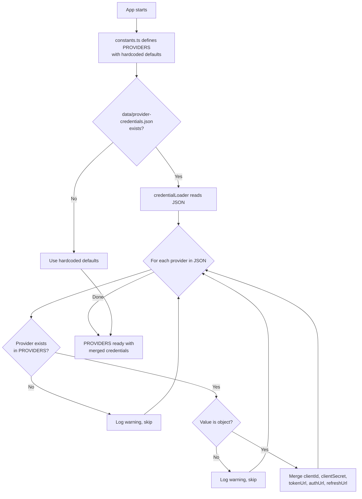

---

### 4.2 Executeurs (`open-sse/executors/`)

Uitvoerders kapselen **providerspecifieke logica** in met behulp van het **Strategiepatroon**. Elke uitvoerder overschrijft indien nodig basismethoden.

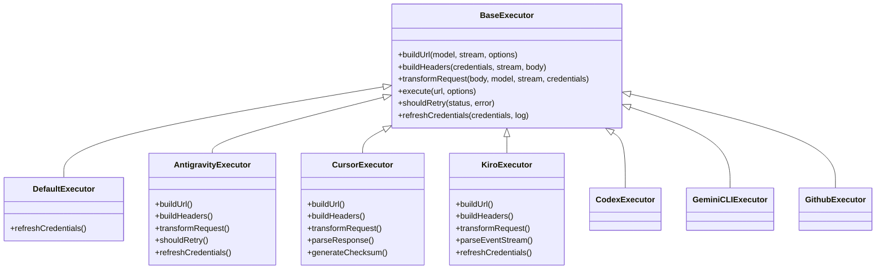

| executeur        | Aanbieder                                  | Belangrijkste specialisaties                                                                                                  |
| ---------------- | ------------------------------------------ | ----------------------------------------------------------------------------------------------------------------------------- |
| `base.ts`        | —                                          | Samenvatting van de basis: URL-opbouw, headers, logica voor opnieuw proberen, vernieuwen van inloggegevens                    |
| `default.ts`     | Claude, Gemini, OpenAI, GLM, Kimi, MiniMax | Generieke OAuth-tokenvernieuwing voor standaardproviders                                                                      |
| `antigravity.ts` | Google Cloud-code                          | Generatie van project-/sessie-ID's, fallback met meerdere URL's, aangepaste parsering van foutmeldingen ("reset na 2u7m23s")  |
| `cursor.ts`      | Cursor-IDE                                 | **Meest complex**: SHA-256 checksum-authenticatie, Protobuf-verzoekcodering, binaire EventStream → Parsing van SSE-antwoorden |
| `codex.ts`       | OpenAI-codex                               | Injecteert systeeminstructies, beheert denkniveaus, verwijdert niet-ondersteunde parameters                                   |
| `gemini-cli.ts`  | Google Gemini-CLI                          | Aangepaste URL maken (`streamGenerateContent`), Google OAuth-token vernieuwen                                                 |
| `github.ts`      | GitHub-copiloot                            | Dubbel tokensysteem (GitHub OAuth + Copilot-token), VSCode-header die                                                         |
| `kiro.ts`        | AWS CodeWhisperer                          | AWS EventStream binaire parsing, AMZN-gebeurtenisframes, tokenschatting                                                       |
| `index.ts`       | —                                          | Fabriek: kaartprovidernaam → uitvoerderklasse, met standaard fallback                                                         |

---

### 4.3 Afhandelaars (`open-sse/handlers/`)

De **orkestratielaag** — coördineert de vertaling, uitvoering, streaming en foutafhandeling.

| Bestand               | Doel                                                                                                                                                                                                                                                 |
| --------------------- | ---------------------------------------------------------------------------------------------------------------------------------------------------------------------------------------------------------------------------------------------------- |
| `chatCore.ts`         | **Centrale orkestrator** (~600 lijnen). Verwerkt de volledige levenscyclus van verzoeken: formaatdetectie → vertaling → verzending van de uitvoerder → streaming/niet-streaming antwoord → tokenvernieuwing → foutafhandeling → gebruiksregistratie. |
| `responsesHandler.ts` | Adapter voor OpenAI's Responses API: converteert het antwoordformaat → Chatvoltooiingen → verzendt naar `chatCore` → converteert SSE terug naar het antwoordformaat.                                                                                 |
| `embeddings.ts`       | Handler voor het genereren van inbedding: lost het inbeddingsmodel → provider op, verzendt naar de API van de provider, retourneert OpenAI-compatibele inbeddingsreactie. Ondersteunt 6+ providers.                                                  |
| `imageGeneration.ts`  | Handler voor het genereren van afbeeldingen: lost beeldmodel → provider op, ondersteunt OpenAI-compatibele, Gemini-image (Antigravity) en fallback (Nebius) modi. Retourneert base64- of URL-afbeeldingen.                                           |

#### Aanvraaglevenscyclus (chatCore.ts)

```mermaid
sequenceDiagram
    participant Client
    participant chatCore
    participant Translator
    participant Executor
    participant Provider

    Client->>chatCore: Request (any format)
    chatCore->>chatCore: Detect source format
    chatCore->>chatCore: Check bypass patterns
    chatCore->>chatCore: Resolve model & provider
    chatCore->>Translator: Translate request (source → OpenAI → target)
    chatCore->>Executor: Get executor for provider
    Executor->>Executor: Build URL, headers, transform request
    Executor->>Executor: Refresh credentials if needed
    Executor->>Provider: HTTP fetch (streaming or non-streaming)

    alt Streaming
        Provider-->>chatCore: SSE stream
        chatCore->>chatCore: Pipe through SSE transform stream
        Note over chatCore: Transform stream translates<br/>each chunk: target → OpenAI → source
        chatCore-->>Client: Translated SSE stream
    else Non-streaming
        Provider-->>chatCore: JSON response
        chatCore->>Translator: Translate response
        chatCore-->>Client: Translated JSON
    end

    alt Error (401, 429, 500...)
        chatCore->>Executor: Retry with credential refresh
        chatCore->>chatCore: Account fallback logic
    end
```

---

### 4.4 Diensten (`open-sse/services/`)

Bedrijfslogica die de behandelaars en uitvoerders ondersteunt.

| Bestand              | Doel                                                                                                                                                                                                                                                                                                                                                                      |
| -------------------- | ------------------------------------------------------------------------------------------------------------------------------------------------------------------------------------------------------------------------------------------------------------------------------------------------------------------------------------------------------------------------- |
| `provider.ts`        | **Formaatdetectie** (`detectFormat`): analyseert de lichaamsstructuur van het verzoek om de formaten Claude/OpenAI/Gemini/Antigravity/Responses te identificeren (inclusief `max_tokens` heuristiek voor Claude). Ook: URL-opbouw, header-opbouw, normalisatie van denkconfiguraties. Ondersteunt `openai-compatible-*` en `anthropic-compatible-*` dynamische providers. |
| `model.ts`           | Parseren van modeltekenreeksen (`claude/model-name` → `{provider: "claude", model: "model-name"}`), aliasresolutie met botsingsdetectie, invoeropschoning (weigert paddoorloop/controletekens) en modelinformatieresolutie met ondersteuning voor asynchrone aliasgetter.                                                                                                 |
| `accountFallback.ts` | Afhandeling van snelheidslimieten: exponentiële uitstel (1s → 2s → 4s → max. 2min), beheer van accountcooldown, foutclassificatie (welke fouten een terugval veroorzaken versus niet).                                                                                                                                                                                    |
| `tokenRefresh.ts`    | OAuth-tokenvernieuwing voor **elke provider**: Google (Gemini, Antigravity), Claude, Codex, Qwen, iFlow, GitHub (OAuth + Copilot dual-token), Kiro (AWS SSO OIDC + Social Auth). Inclusief in-flight belofte-deduplicatiecache en opnieuw proberen met exponentiële uitstel.                                                                                              |
| `combo.ts`           | **Combomodellen**: ketens van fallback-modellen. Als model A faalt met een fout die in aanmerking komt voor terugval, probeer dan model B, vervolgens C, enz. Retourneert werkelijke stroomopwaartse statuscodes.                                                                                                                                                         |
| `usage.ts`           | Haalt quota/gebruiksgegevens op van provider-API's (GitHub Copilot-quota, Antigravity-modelquota, Codex-snelheidslimieten, uitsplitsingen van Kiro-gebruik, Claude-instellingen).                                                                                                                                                                                         |
| `accountSelector.ts` | Slimme accountselectie met score-algoritme: houdt rekening met prioriteit, gezondheidsstatus, round-robin-positie en cooldown-status om voor elk verzoek het optimale account te kiezen.                                                                                                                                                                                  |
| `contextManager.ts`  | Beheer van de contextlevenscyclus van aanvragen: creëert en volgt contextobjecten per aanvraag met metagegevens (aanvraag-ID, tijdstempels, providerinformatie) voor foutopsporing en logboekregistratie.                                                                                                                                                                 |
| `ipFilter.ts`        | IP-gebaseerd toegangscontrole: ondersteunt de toelatingslijst- en blokkeerlijstmodi. Valideert client-IP aan de hand van geconfigureerde regels voordat API-aanvragen worden verwerkt.                                                                                                                                                                                    |
| `sessionManager.ts`  | Sessie volgen met client-fingerprinting: volgt actieve sessies met behulp van gehashte client-ID's, bewaakt het aantal verzoeken en biedt sessiestatistieken.                                                                                                                                                                                                             |
| `signatureCache.ts`  | Op handtekeningen gebaseerde deduplicatiecache aanvragen: voorkomt dubbele verzoeken door handtekeningen van recente verzoeken in de cache op te slaan en in de cache opgeslagen antwoorden voor identieke verzoeken binnen een tijdsvenster te retourneren.                                                                                                              |
| `systemPrompt.ts`    | Globale injectie van systeemprompts: voegt een configureerbare systeemprompt toe aan alle verzoeken, waarbij de compatibiliteit per provider wordt afgehandeld.                                                                                                                                                                                                           |
| `thinkingBudget.ts`  | Budgetbeheer voor redeneringstokens: ondersteunt passthrough-, automatische (strip-thinking-configuratie), aangepaste (vast budget) en adaptieve (op complexiteit geschaalde) modi voor het controleren van denk-/redeneringstokens.                                                                                                                                      |
| `wildcardRouter.ts`  | Patroonroutering met jokertekenmodel: zet jokertekenpatronen (bijvoorbeeld `*/claude-*`) om in concrete provider/modelparen op basis van beschikbaarheid en prioriteit.                                                                                                                                                                                                   |

#### Ontdubbeling van tokenvernieuwing

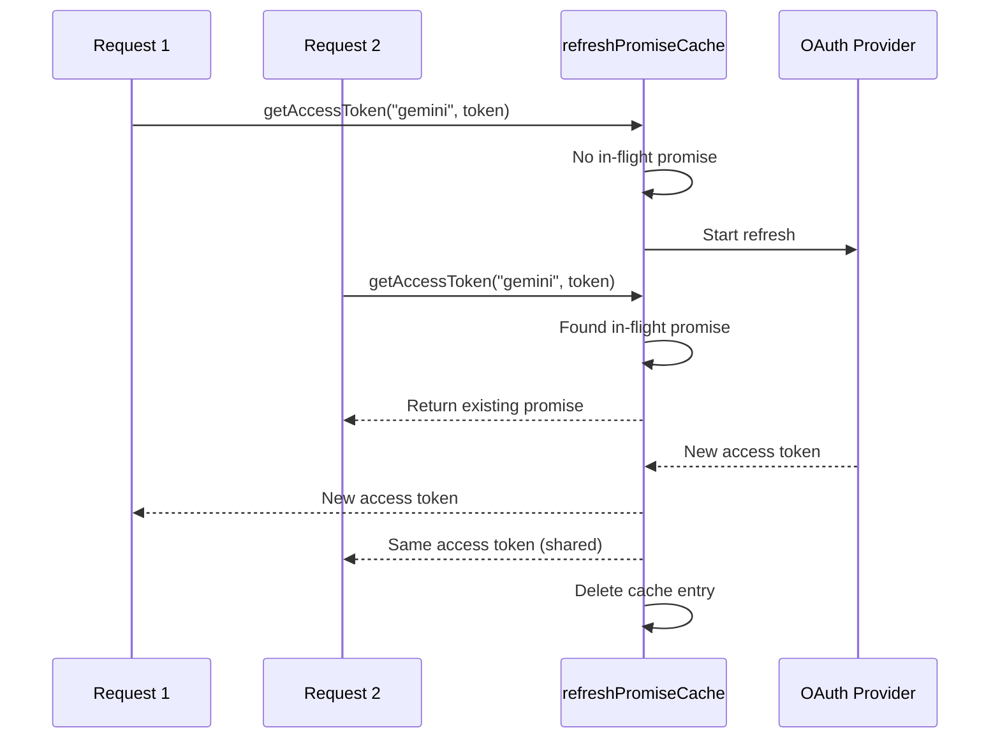

#### Account Fallback State Machine

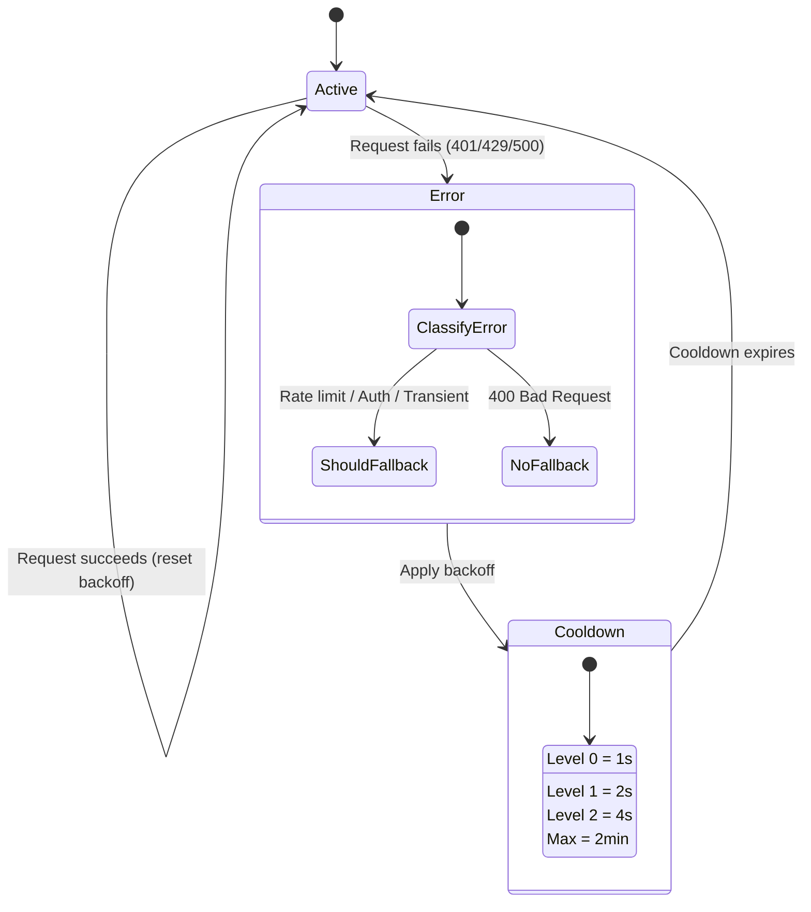

#### Combo-modelketen

```mermaid
flowchart LR
    A["Request with\ncombo model"] --> B["Model A"]
    B -->|"2xx Success"| C["Return response"]
    B -->|"429/401/500"| D{"Fallback\neligible?"}
    D -->|Yes| E["Model B"]
    D -->|No| F["Return error"]
    E -->|"2xx Success"| C
    E -->|"429/401/500"| G{"Fallback\neligible?"}
    G -->|Yes| H["Model C"]
    G -->|No| F
    H -->|"2xx Success"| C
    H -->|"Fail"| I["All failed →\nReturn last status"]
```

---

### 4.5 Vertaler (`open-sse/translator/`)

De **formaatvertaalmachine** gebruikt een zelfregistrerend plug-insysteem.

#### Architectuur

```mermaid
graph TD
    subgraph "Request Translation"
        A["Claude → OpenAI"]
        B["Gemini → OpenAI"]
        C["Antigravity → OpenAI"]
        D["OpenAI Responses → OpenAI"]
        E["OpenAI → Claude"]
        F["OpenAI → Gemini"]
        G["OpenAI → Kiro"]
        H["OpenAI → Cursor"]
    end

    subgraph "Response Translation"
        I["Claude → OpenAI"]
        J["Gemini → OpenAI"]
        K["Kiro → OpenAI"]
        L["Cursor → OpenAI"]
        M["OpenAI → Claude"]
        N["OpenAI → Antigravity"]
        O["OpenAI → Responses"]
    end
```

| Telefoonboek | Bestanden   | Beschrijving                                                                                                                                                                                                                                                                                    |
| ------------ | ----------- | ----------------------------------------------------------------------------------------------------------------------------------------------------------------------------------------------------------------------------------------------------------------------------------------------- |
| `request/`   | 8 vertalers | Converteer verzoekteksten tussen formaten. Elk bestand registreert zichzelf via `register(from, to, fn)` bij het importeren.                                                                                                                                                                    |
| `response/`  | 7 vertalers | Converteer streamingantwoordbrokken tussen formaten. Verwerkt SSE-gebeurtenistypen, denkblokken, tooloproepen.                                                                                                                                                                                  |
| `helpers/`   | 6 helpers   | Gedeelde hulpprogramma's: `claudeHelper` (extractie van systeemprompts, denkconfiguratie), `geminiHelper` (toewijzing van onderdelen/inhoud), `openaiHelper` (formaatfiltering), `toolCallHelper` (ID genereren, injectie van ontbrekende antwoorden), `maxTokensHelper`, `responsesApiHelper`. |
| `index.ts`   | —           | Vertaalmachine: `translateRequest()`, `translateResponse()`, staatsbeheer, register.                                                                                                                                                                                                            |
| `formats.ts` | —           | Formaatconstanten: `OPENAI`, `CLAUDE`, `GEMINI`, `ANTIGRAVITY`, `KIRO`, `CURSOR`, `OPENAI_RESPONSES`.                                                                                                                                                                                           |

#### Sleutelontwerp: zelfregistrerende plug-ins

```javascript
// Each translator file calls register() on import:
import { register } from "../index.js";
register("claude", "openai", translateClaudeToOpenAI);

// The index.js imports all translator files, triggering registration:
import "./request/claude-to-openai.js"; // ← self-registers
```

---

### 4.6 Hulpprogramma's (`open-sse/utils/`)

| Bestand            | Doel                                                                                                                                                                                                                                                                                                                               |
| ------------------ | ---------------------------------------------------------------------------------------------------------------------------------------------------------------------------------------------------------------------------------------------------------------------------------------------------------------------------------- |
| `error.ts`         | Opbouw van foutreacties (OpenAI-compatibel formaat), upstream-foutparsing, Antigravity-extractie van nieuwe pogingen uit foutmeldingen, SSE-foutstreaming.                                                                                                                                                                         |
| `stream.ts`        | **SSE Transform Stream** — de belangrijkste streamingpijplijn. Twee modi: `TRANSLATE` (vertaling in volledig formaat) en `PASSTHROUGH` (gebruik normaliseren + extraheren). Verwerkt chunkbuffering, gebruiksschatting en het bijhouden van de inhoudslengte. Encoder/decoder-instanties per stream vermijden een gedeelde status. |
| `streamHelpers.ts` | SSE-hulpprogramma's op laag niveau: `parseSSELine` (witruimtetolerant), `hasValuableContent` (filtert lege chunks voor OpenAI/Claude/Gemini), `fixInvalidId`, `formatSSE` (formaatbewuste SSE-serialisatie met opschoning `perf_metrics`).                                                                                         |
| `usageTracking.ts` | Extractie van tokengebruik uit elk formaat (Claude/OpenAI/Gemini/Responses), schatting met afzonderlijke tool/bericht-char-per-token-verhoudingen, buffertoevoeging (veiligheidsmarge van 2000 tokens), formaatspecifieke veldfiltering, consolelogboekregistratie met ANSI-kleuren.                                               |
| `requestLogger.ts` | Op bestanden gebaseerde registratie van verzoeken (opt-in via `ENABLE_REQUEST_LOGS=true`). Creëert sessiemappen met genummerde bestanden: `1_req_client.json` → `7_res_client.txt`. Alle I/O is async (fire-and-forget). Maskert gevoelige headers.                                                                                |
| `bypassHandler.ts` | Onderschept specifieke patronen van Claude CLI (titelextractie, opwarming, telling) en retourneert valse antwoorden zonder een provider te bellen. Ondersteunt zowel streaming als niet-streaming. Opzettelijk beperkt tot het Claude CLI-bereik.                                                                                  |
| `networkProxy.ts`  | Bepaalt de uitgaande proxy-URL voor een bepaalde provider met voorrang: providerspecifieke configuratie → globale configuratie → omgevingsvariabelen (`HTTPS_PROXY`/`HTTP_PROXY`/`ALL_PROXY`). Ondersteunt `NO_PROXY` uitsluitingen. Cachesconfiguratie voor 30s.                                                                  |

#### SSE-streamingpijplijn

```mermaid
flowchart TD
    A["Provider SSE stream"] --> B["TextDecoder\n(per-stream instance)"]
    B --> C["Buffer lines\n(split on newline)"]
    C --> D["parseSSELine()\n(trim whitespace, parse JSON)"]
    D --> E{"Mode?"}
    E -->|TRANSLATE| F["translateResponse()\ntarget → OpenAI → source"]
    E -->|PASSTHROUGH| G["fixInvalidId()\nnormalize chunk"]
    F --> H["hasValuableContent()\nfilter empty chunks"]
    G --> H
    H -->|"Has content"| I["extractUsage()\ntrack token counts"]
    H -->|"Empty"| J["Skip chunk"]
    I --> K["formatSSE()\nserialize + clean perf_metrics"]
    K --> L["TextEncoder\n(per-stream instance)"]
    L --> M["Enqueue to\nclient stream"]

    style A fill:#f9f,stroke:#333
    style M fill:#9f9,stroke:#333
```

#### Verzoek Loggersessiestructuur

```
logs/
└── claude_gemini_claude-sonnet_20260208_143045/
    ├── 1_req_client.json      ← Raw client request
    ├── 2_req_source.json      ← After initial conversion
    ├── 3_req_openai.json      ← OpenAI intermediate format
    ├── 4_req_target.json      ← Final target format
    ├── 5_res_provider.txt     ← Provider SSE chunks (streaming)
    ├── 5_res_provider.json    ← Provider response (non-streaming)
    ├── 6_res_openai.txt       ← OpenAI intermediate chunks
    ├── 7_res_client.txt       ← Client-facing SSE chunks
    └── 6_error.json           ← Error details (if any)
```

---

### 4.7 Applicatielaag (`src/`)

| Telefoonboek  | Doel                                                                              |
| ------------- | --------------------------------------------------------------------------------- |
| `src/app/`    | Web-UI, API-routes, Express-middleware, OAuth-callback-handlers                   |
| `src/lib/`    | Databasetoegang (`localDb.ts`, `usageDb.ts`), authenticatie, gedeeld              |
| `src/mitm/`   | Man-in-the-middle-proxyhulpprogramma's voor het onderscheppen van providerverkeer |
| `src/models/` | Definities van databasemodellen                                                   |
| `src/shared/` | Wrappers rond open-sse-functies (provider, stream, fout, etc.)                    |
| `src/sse/`    | SSE-eindpunthandlers die de open-sse-bibliotheek verbinden met Express-routes     |
| `src/store/`  | Beheer van applicatiestatus                                                       |

#### Opmerkelijke API-routes

| Route                                         | Methoden                 | Doel                                                                                                       |
| --------------------------------------------- | ------------------------ | ---------------------------------------------------------------------------------------------------------- |
| `/api/provider-models`                        | KRIJGEN/POST/VERWIJDEREN | CRUD voor maatwerkmodellen per aanbieder                                                                   |
| `/api/models/catalog`                         | KRIJG                    | Geaggregeerde catalogus van alle modellen (chat, insluiten, afbeelding, aangepast) gegroepeerd op provider |
| `/api/settings/proxy`                         | KRIJGEN/ZET/VERWIJDEREN  | Hiërarchische uitgaande proxyconfiguratie (`global/providers/combos/keys`)                                 |
| `/api/settings/proxy/test`                    | POST                     | Valideert proxy-connectiviteit en retourneert openbare IP/latentie                                         |
| `/v1/providers/[provider]/chat/completions`   | POST                     | Specifieke chatafrondingen per provider met modelvalidatie                                                 |
| `/v1/providers/[provider]/embeddings`         | POST                     | Toegewijde inbedding per provider met modelvalidatie                                                       |
| `/v1/providers/[provider]/images/generations` | POST                     | Specifieke generatie van afbeeldingen per provider met modelvalidatie                                      |
| `/api/settings/ip-filter`                     | KRIJG/ZET                | Beheer van IP-toelatingslijsten/blokkeerlijsten                                                            |
| `/api/settings/thinking-budget`               | KRIJG/ZET                | Redeneren token budgetconfiguratie (passthrough/auto/aangepast/adaptief)                                   |
| `/api/settings/system-prompt`                 | KRIJG/ZET                | Wereldwijde systeempromptinjectie voor alle verzoeken                                                      |
| `/api/sessions`                               | KRIJG                    | Actieve sessietracking en statistieken                                                                     |
| `/api/rate-limits`                            | KRIJG                    | Status van tarieflimiet per account                                                                        |

---

## 5. Belangrijke ontwerppatronen

### 5.1 Hub-and-spoke-vertaling

Alle formaten worden vertaald via het **OpenAI-formaat als hub**. Voor het toevoegen van een nieuwe provider is slechts **één paar** vertalers nodig (van/naar OpenAI), niet N-paren.

### 5.2 Strategiepatroon voor de uitvoerder

Elke provider heeft een speciale uitvoerderklasse die overerft van `BaseExecutor`. De fabriek in `executors/index.ts` selecteert tijdens runtime de juiste.

### 5.3 Zelfregistrerend plug-insysteem

Vertalermodules registreren zichzelf bij het importeren via `register()`. Als u een nieuwe vertaler toevoegt, maakt u eenvoudigweg een bestand aan en importeert u dit.

### 5.4 Accountterugval met exponentiële uitstel

Wanneer een provider 429/401/500 retourneert, kan het systeem overschakelen naar het volgende account, waarbij exponentiële cooldowns worden toegepast (1s → 2s → 4s → max. 2min).

### 5.5 combo-modelketens

Een "combo" groepeert meerdere `provider/model` strings. Als de eerste mislukt, wordt automatisch teruggevallen op de volgende.

### 5.6 Stateful streaming-vertaling

Reactievertaling handhaaft de status van SSE-brokken (tracking van denkblokken, accumulatie van tooloproepen, indexering van inhoudsblokken) via het `initState()`-mechanisme.

### 5.7 Gebruiksveiligheidsbuffer

Er wordt een buffer van 2000 token toegevoegd aan het gerapporteerde gebruik om te voorkomen dat clients de limieten van het contextvenster bereiken als gevolg van overhead van systeemprompts en formaatvertaling.

---

## 6. Ondersteunde formaten

| Formaat                  | Richting    | Identificatie      |
| ------------------------ | ----------- | ------------------ |
| OpenAI Chat-voltooiingen | bron + doel | `openai`           |
| OpenAI-reacties-API      | bron + doel | `openai-responses` |
| Antropische Claude       | bron + doel | `claude`           |
| Google Tweeling          | bron + doel | `gemini`           |
| Google Gemini-CLI        | alleen doel | `gemini-cli`       |
| Antizwaartekracht        | bron + doel | `antigravity`      |
| AWS Kiro                 | alleen doel | `kiro`             |
| Cursor                   | alleen doel | `cursor`           |

---

## 7. Ondersteunde providers

| Aanbieder                | Verificatiemethode      | executeur         | Belangrijkste opmerkingen                                            |
| ------------------------ | ----------------------- | ----------------- | -------------------------------------------------------------------- |
| Antropische Claude       | API-sleutel of OAuth    | Standaard         | Gebruikt `x-api-key` koptekst                                        |
| Google Tweeling          | API-sleutel of OAuth    | Standaard         | Gebruikt `x-goog-api-key` koptekst                                   |
| Google Gemini-CLI        | OAuth                   | GeminiCLI         | Gebruikt `streamGenerateContent` eindpunt                            |
| Antizwaartekracht        | OAuth                   | Antizwaartekracht | Terugval op meerdere URL's, aangepaste parsering van nieuwe pogingen |
| Open AI                  | API-sleutel             | Standaard         | Standaard Bearer-authenticatie                                       |
| Codex                    | OAuth                   | Codex             | Injecteert systeeminstructies, beheert het denken                    |
| GitHub-copiloot          | OAuth + Copilot-token   | Github            | Dubbel token, VSCode-header die                                      |
| Kiro (AWS)               | AWS SSO OIDC of sociaal | Kiro              | Binaire EventStream-parsering                                        |
| Cursor-IDE               | Controlesomverificatie  | Cursor            | Protobuf-codering, SHA-256-controlesommen                            |
| Qwen                     | OAuth                   | Standaard         | Standaardauthenticatie                                               |
| iFlow                    | OAuth (basis + drager)  | Standaard         | Dubbele auth-header                                                  |
| OpenRouter               | API-sleutel             | Standaard         | Standaard Bearer-authenticatie                                       |
| GLM, Kimi, MiniMax       | API-sleutel             | Standaard         | Claude-compatibel, gebruik `x-api-key`                               |
| `openai-compatible-*`    | API-sleutel             | Standaard         | Dynamisch: elk OpenAI-compatibel eindpunt                            |
| `anthropic-compatible-*` | API-sleutel             | Standaard         | Dynamisch: elk Claude-compatibel eindpunt                            |

---

## 8. Samenvatting van de gegevensstroom

### Streamingverzoek

```mermaid
flowchart LR
    A["Client"] --> B["detectFormat()"]
    B --> C["translateRequest()\nsource → OpenAI → target"]
    C --> D["Executor\nbuildUrl + buildHeaders"]
    D --> E["fetch(providerURL)"]
    E --> F["createSSEStream()\nTRANSLATE mode"]
    F --> G["parseSSELine()"]
    G --> H["translateResponse()\ntarget → OpenAI → source"]
    H --> I["extractUsage()\n+ addBuffer"]
    I --> J["formatSSE()"]
    J --> K["Client receives\ntranslated SSE"]
    K --> L["logUsage()\nsaveRequestUsage()"]
```

### Niet-streamingverzoek

```mermaid
flowchart LR
    A["Client"] --> B["detectFormat()"]
    B --> C["translateRequest()\nsource → OpenAI → target"]
    C --> D["Executor.execute()"]
    D --> E["translateResponse()\ntarget → OpenAI → source"]
    E --> F["Return JSON\nresponse"]
```

### Bypassstroom (Claude CLI)

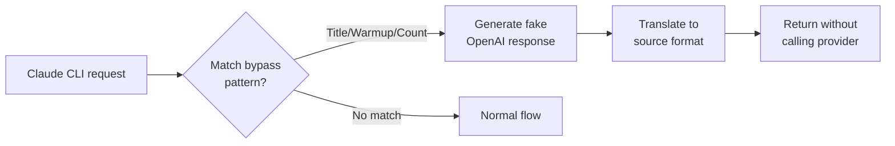
