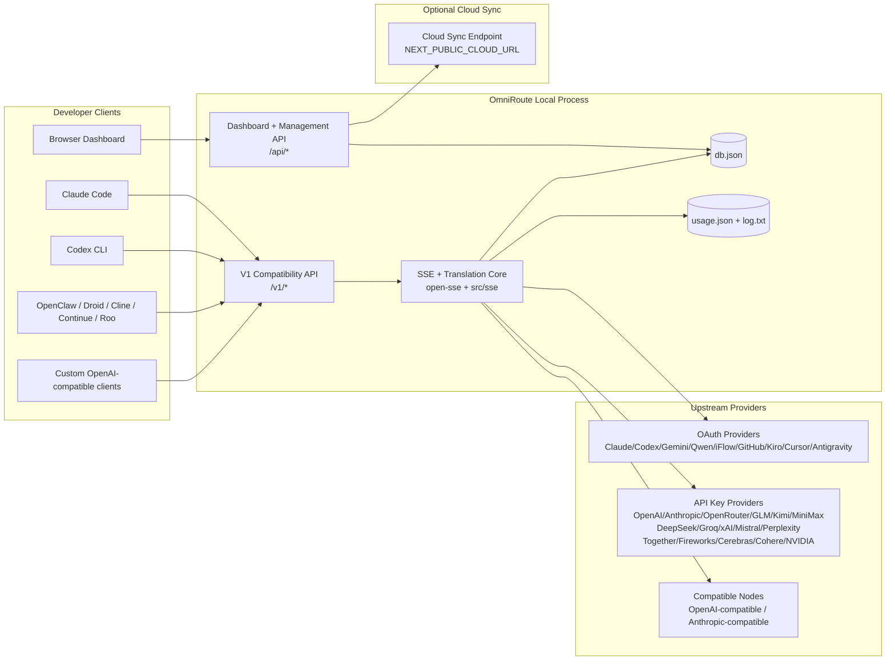
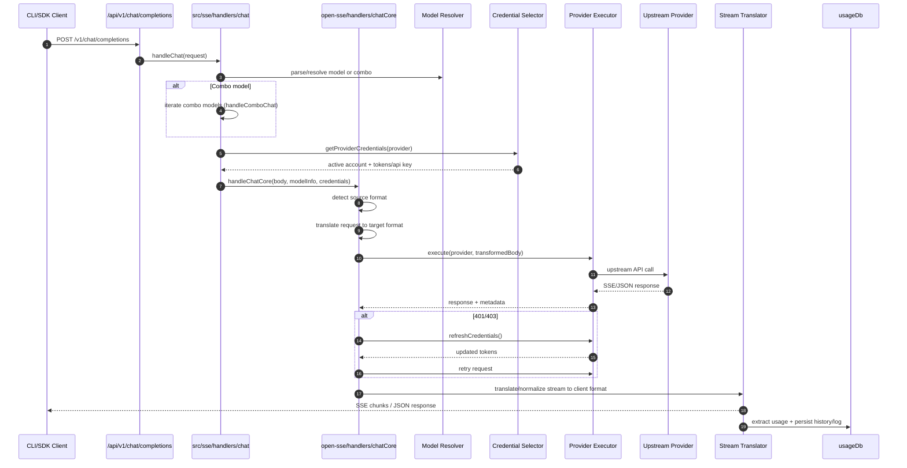
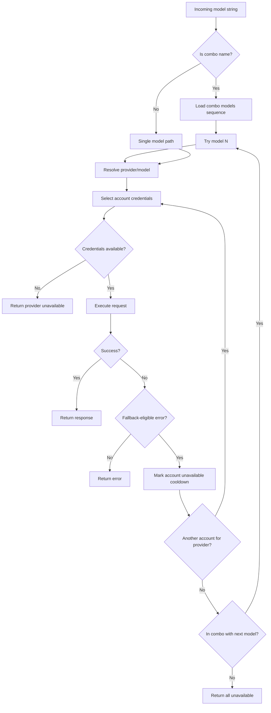
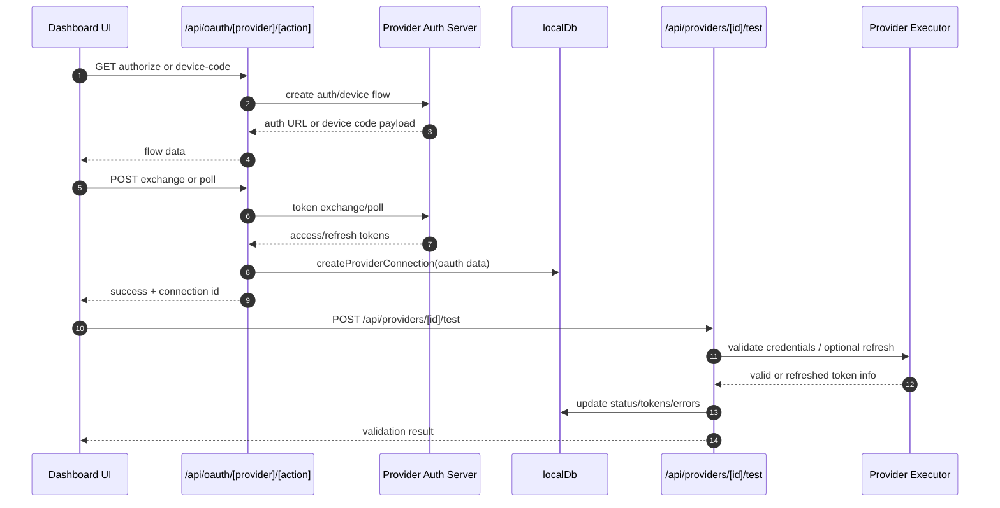
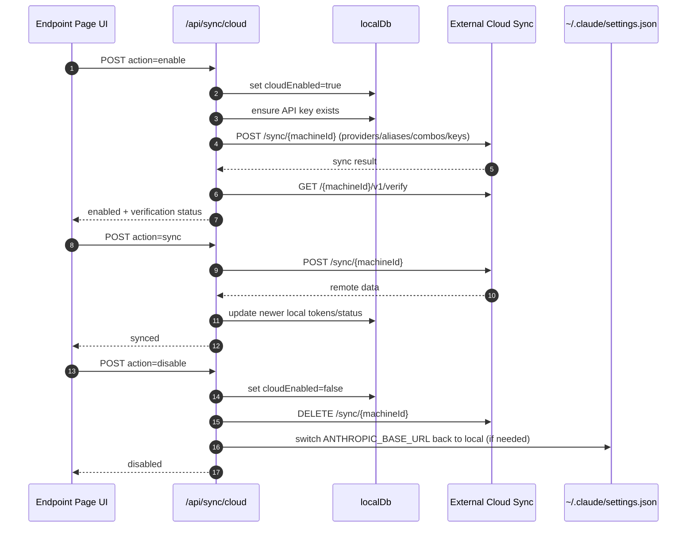
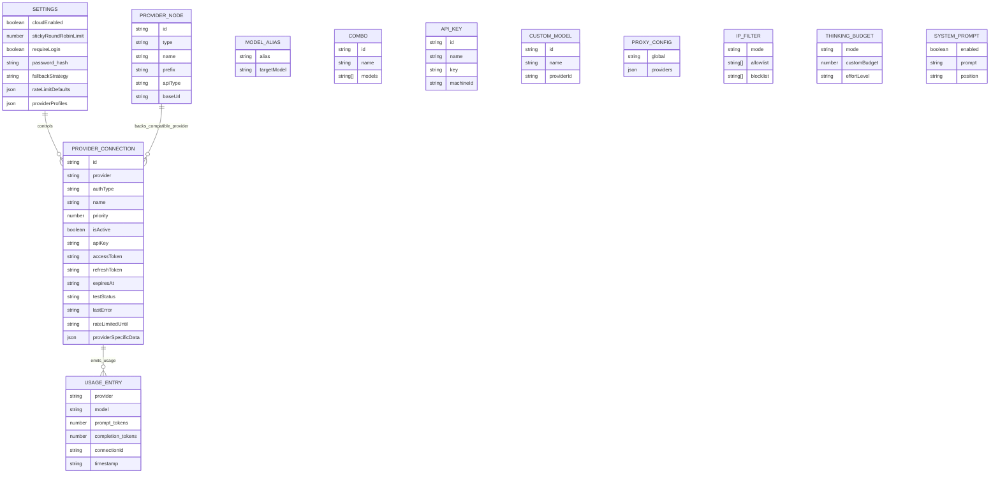
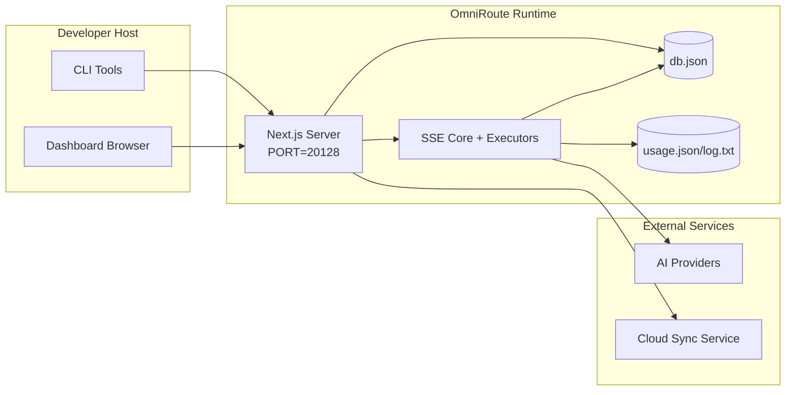

# OmniRoute Architecture

🌐 **Languages:** 🇺🇸 [English](../../ARCHITECTURE.md) | 🇧🇷 [Português (Brasil)](../pt-BR/ARCHITECTURE.md) | 🇪🇸 [Español](../es/ARCHITECTURE.md) | 🇫🇷 [Français](../fr/ARCHITECTURE.md) | 🇮🇹 [Italiano](../it/ARCHITECTURE.md) | 🇷🇺 [Русский](../ru/ARCHITECTURE.md) | 🇨🇳 [中文 (简体)](../zh-CN/ARCHITECTURE.md) | 🇩🇪 [Deutsch](../de/ARCHITECTURE.md) | 🇮🇳 [हिन्दी](../in/ARCHITECTURE.md) | 🇹🇭 [ไทย](../th/ARCHITECTURE.md) | 🇺🇦 [Українська](../uk-UA/ARCHITECTURE.md) | 🇸🇦 [العربية](../ar/ARCHITECTURE.md) | 🇯🇵 [日本語](../ja/ARCHITECTURE.md) | 🇻🇳 [Tiếng Việt](../vi/ARCHITECTURE.md) | 🇧🇬 [Български](../bg/ARCHITECTURE.md) | 🇩🇰 [Dansk](../da/ARCHITECTURE.md) | 🇫🇮 [Suomi](../fi/ARCHITECTURE.md) | 🇮🇱 [עברית](../he/ARCHITECTURE.md) | 🇭🇺 [Magyar](../hu/ARCHITECTURE.md) | 🇮🇩 [Bahasa Indonesia](../id/ARCHITECTURE.md) | 🇰🇷 [한국어](../ko/ARCHITECTURE.md) | 🇲🇾 [Bahasa Melayu](../ms/ARCHITECTURE.md) | 🇳🇱 [Nederlands](../nl/ARCHITECTURE.md) | 🇳🇴 [Norsk](../no/ARCHITECTURE.md) | 🇵🇹 [Português (Portugal)](../pt/ARCHITECTURE.md) | 🇷🇴 [Română](../ro/ARCHITECTURE.md) | 🇵🇱 [Polski](../pl/ARCHITECTURE.md) | 🇸🇰 [Slovenčina](../sk/ARCHITECTURE.md) | 🇸🇪 [Svenska](../sv/ARCHITECTURE.md) | 🇵🇭 [Filipino](../phi/ARCHITECTURE.md)

_Huling na-update: 2026-02-18_

## Executive Summary

Ang OmniRoute ay isang lokal na AI routing gateway at dashboard na binuo sa Next.js.
Nagbibigay ito ng isang endpoint na katugma sa OpenAI (`/v1/*`) at niruruta ang trapiko sa maraming upstream provider na may pagsasalin, fallback, pag-refresh ng token, at pagsubaybay sa paggamit.

Mga pangunahing kakayahan:

- OpenAI-compatible na API surface para sa CLI/tools (28 provider)
- Kahilingan/tugon sa pagsasalin sa mga format ng provider
- Modelong combo fallback (multi-model sequence)
- Account-level fallback (multi-account bawat provider)
- Pamamahala ng koneksyon ng provider ng OAuth + API-key
- Pag-embed ng henerasyon sa pamamagitan ng `/v1/embeddings` (6 na provider, 9 na modelo)
- Pagbuo ng larawan sa pamamagitan ng `/v1/images/generations` (4 na provider, 9 na modelo)
- Isipin ang pag-parse ng tag (`<think>...</think>`) para sa mga modelo ng pangangatwiran
- Response sanitization para sa mahigpit na OpenAI SDK compatibility
- Pag-normalize ng tungkulin (developer→system, system→user) para sa cross-provider compatibility
- Structured output conversion (json_schema → Gemini responseSchema)
- Lokal na pagtitiyaga para sa mga provider, key, alias, combo, setting, pagpepresyo
- Pagsubaybay sa paggamit/gastos at pag-log ng kahilingan
- Opsyonal na cloud sync para sa multi-device/state sync
- IP allowlist/blocklist para sa API access control
- Pag-iisip ng pamamahala sa badyet (passthrough/auto/custom/adaptive)
- Global system prompt injection
- Pagsubaybay sa session at fingerprinting
- Paglilimita sa pinahusay na rate ng bawat account gamit ang mga profile na partikular sa provider
- Pattern ng circuit breaker para sa katatagan ng provider
- Proteksyon laban sa dumadagundong na kawan na may mutex locking
- Nakabatay sa lagda ang cache ng pag-deduplication ng kahilingan
- Layer ng domain: availability ng modelo, mga panuntunan sa gastos, patakaran sa fallback, patakaran sa lockout
- Pananatili ng estado ng domain (SQLite write-through cache para sa mga fallback, badyet, lockout, circuit breaker)
- Policy engine para sa sentralisadong pagsusuri ng kahilingan (lockout → budget → fallback)
- Humiling ng telemetry na may p50/p95/p99 latency aggregation
- Correlation ID (X-Request-Id) para sa end-to-end na pagsubaybay
- Pag-log sa audit ng pagsunod gamit ang opt-out sa bawat API key
- Eval framework para sa katiyakan ng kalidad ng LLM
- Resilience UI dashboard na may real-time na status ng circuit breaker
- Modular OAuth providers (12 indibidwal na module sa ilalim ng `src/lib/oauth/providers/`)

Pangunahing modelo ng runtime:

- Ang mga ruta ng Next.js app sa ilalim ng `src/app/api/*` ay nagpapatupad ng parehong dashboard API at compatibility API
- Isang nakabahaging SSE/routing core sa `src/sse/*` + `open-sse/*` ang humahawak sa pagpapatupad ng provider, pagsasalin, streaming, fallback, at paggamit

## Saklaw at Hangganan

### Nasa Saklaw

- Lokal na gateway runtime
- Mga API sa pamamahala ng dashboard
- Pagpapatunay ng provider at pag-refresh ng token
- Humiling ng pagsasalin at SSE streaming
- Lokal na estado + pagtitiyaga sa paggamit
- Opsyonal na cloud sync orchestration

### Wala sa Saklaw

- Pagpapatupad ng serbisyo sa cloud sa likod ng `NEXT_PUBLIC_CLOUD_URL`
- Provider SLA/control plane sa labas ng lokal na proseso
- Mga panlabas na CLI binary mismo (Claude CLI, Codex CLI, atbp.)

## Mataas na Antas na Konteksto ng System



## Mga Pangunahing Bahagi ng Runtime

## 1) API at Routing Layer (Next.js App Routes)

Mga pangunahing direktoryo:

- `src/app/api/v1/*` at `src/app/api/v1beta/*` para sa mga compatibility API
- `src/app/api/*` para sa mga management/configuration API
- Susunod na muling pagsusulat sa `next.config.mjs` mapa `/v1/*` hanggang `/api/v1/*`

Mahahalagang ruta ng compatibility:

- `src/app/api/v1/chat/completions/route.ts`
- `src/app/api/v1/messages/route.ts`
- `src/app/api/v1/responses/route.ts`
- `src/app/api/v1/models/route.ts` — kasama ang mga custom na modelo na may `custom: true`
- `src/app/api/v1/embeddings/route.ts` — henerasyon ng pag-embed (6 na provider)
- `src/app/api/v1/images/generations/route.ts` — pagbuo ng larawan (4+ provider kasama ang Antigravity/Nebius)
- `src/app/api/v1/messages/count_tokens/route.ts`
- `src/app/api/v1/providers/[provider]/chat/completions/route.ts` — nakatuon sa bawat provider na chat
- `src/app/api/v1/providers/[provider]/embeddings/route.ts` — nakalaang mga pag-embed ng bawat provider
- `src/app/api/v1/providers/[provider]/images/generations/route.ts` — nakalaang mga larawan ng bawat provider
- `src/app/api/v1beta/models/route.ts`
- `src/app/api/v1beta/models/[...path]/route.ts`

Mga domain ng pamamahala:

- Auth/setting: `src/app/api/auth/*`, `src/app/api/settings/*`
- Mga provider/koneksyon: `src/app/api/providers*`
- Mga node ng provider: `src/app/api/provider-nodes*`
- Mga custom na modelo: `src/app/api/provider-models` (GET/POST/DELETE)
- Catalog ng modelo: `src/app/api/models/catalog` (GET)
- Proxy config: `src/app/api/settings/proxy` (GET/PUT/DELETE) + `src/app/api/settings/proxy/test` (POST)
- OAuth: `src/app/api/oauth/*`
- Mga key/alias/combos/presyo: `src/app/api/keys*`, `src/app/api/models/alias`, `src/app/api/combos*`, `src/app/api/pricing`
- Paggamit: `src/app/api/usage/*`
- Sync/cloud: `src/app/api/sync/*`, `src/app/api/cloud/*`
- CLI tooling helpers: `src/app/api/cli-tools/*`
- IP filter: `src/app/api/settings/ip-filter` (GET/PUT)
- Pag-iisip na badyet: `src/app/api/settings/thinking-budget` (GET/PUT)
- System prompt: `src/app/api/settings/system-prompt` (GET/PUT)
- Mga Sesyon: `src/app/api/sessions` (GET)
- Mga limitasyon sa rate: `src/app/api/rate-limits` (GET)
- Katatagan: `src/app/api/resilience` (GET/PATCH) — mga profile ng provider, circuit breaker, estado ng limitasyon sa rate
- Resilience reset: `src/app/api/resilience/reset` (POST) — reset breakers + cooldowns
- Mga istatistika ng cache: `src/app/api/cache/stats` (GET/DELETE)
- Availability ng modelo: `src/app/api/models/availability` (GET/POST)
- Telemetry: `src/app/api/telemetry/summary` (GET)
- Badyet: `src/app/api/usage/budget` (GET/POST)
- Fallback chain: `src/app/api/fallback/chains` (GET/POST/DELETE)
- Pag-audit sa pagsunod: `src/app/api/compliance/audit-log` (GET)
- Mga Eval: `src/app/api/evals` (GET/POST), `src/app/api/evals/[suiteId]` (GET)
- Mga Patakaran: `src/app/api/policies` (GET/POST)

## 2) SSE + Core ng Pagsasalin

Mga pangunahing module ng daloy:

- Entry: `src/sse/handlers/chat.ts`
- Core orchestration: `open-sse/handlers/chatCore.ts`
- Mga adaptor ng pagpapatupad ng provider: `open-sse/executors/*`
- Format detection/provider config: `open-sse/services/provider.ts`
- Pag-parse/paglutas ng modelo: `src/sse/services/model.ts`, `open-sse/services/model.ts`
- Logic ng fallback ng account: `open-sse/services/accountFallback.ts`
- Pagpapatala ng pagsasalin: `open-sse/translator/index.ts`
- Mga pagbabago sa stream: `open-sse/utils/stream.ts`, `open-sse/utils/streamHandler.ts`
- Pagkuha/normalisasyon ng paggamit: `open-sse/utils/usageTracking.ts`
- Isipin ang tag parser: `open-sse/utils/thinkTagParser.ts`
- Handler ng pag-embed: `open-sse/handlers/embeddings.ts`
- Pag-embed ng pagpapatala ng provider: `open-sse/config/embeddingRegistry.ts`
- Handler ng pagbuo ng larawan: `open-sse/handlers/imageGeneration.ts`
- Rehistro ng provider ng larawan: `open-sse/config/imageRegistry.ts`
- Paglinis ng tugon: `open-sse/handlers/responseSanitizer.ts`
- Pag-normalize ng tungkulin: `open-sse/services/roleNormalizer.ts`

Mga Serbisyo (lohika ng negosyo):

- Pagpili/pagmamarka ng account: `open-sse/services/accountSelector.ts`
- Pamamahala ng lifecycle ng konteksto: `open-sse/services/contextManager.ts`
- Pagpapatupad ng IP filter: `open-sse/services/ipFilter.ts`
- Pagsubaybay sa session: `open-sse/services/sessionManager.ts`
- Humiling ng deduplikasyon: `open-sse/services/signatureCache.ts`
- System prompt injection: `open-sse/services/systemPrompt.ts`
- Pag-iisip ng pamamahala sa badyet: `open-sse/services/thinkingBudget.ts`
- Pagruruta ng modelo ng wildcard: `open-sse/services/wildcardRouter.ts`
- Pamamahala sa limitasyon ng rate: `open-sse/services/rateLimitManager.ts`
- Circuit breaker: `open-sse/services/circuitBreaker.ts`

Mga module ng layer ng domain:

- Availability ng modelo: `src/lib/domain/modelAvailability.ts`
- Mga panuntunan/badyet ng gastos: `src/lib/domain/costRules.ts`
- Patakaran sa Fallback: `src/lib/domain/fallbackPolicy.ts`
- Combo solver: `src/lib/domain/comboResolver.ts`
- Patakaran sa pag-lockout: `src/lib/domain/lockoutPolicy.ts`
- Policy engine: `src/domain/policyEngine.ts` — sentralisadong lockout → badyet → fallback evaluation
- Catalog ng mga error code: `src/lib/domain/errorCodes.ts`
- Request ID: `src/lib/domain/requestId.ts`
- I-fetch ang timeout: `src/lib/domain/fetchTimeout.ts`
- Humiling ng telemetry: `src/lib/domain/requestTelemetry.ts`
- Pagsunod/pag-audit: `src/lib/domain/compliance/index.ts`
- Eval runner: `src/lib/domain/evalRunner.ts`
- Pananatili ng estado ng domain: `src/lib/db/domainState.ts` — SQLite CRUD para sa mga fallback na chain, badyet, kasaysayan ng gastos, estado ng lockout, mga circuit breaker

Mga module ng provider ng OAuth (12 indibidwal na file sa ilalim ng `src/lib/oauth/providers/`):

- Registry index: `src/lib/oauth/providers/index.ts`
- Mga indibidwal na tagapagbigay: `claude.ts`, `codex.ts`, `gemini.ts`, `antigravity.ts`, `iflow.ts`, `qwen.ts`, `github.ts`, `kiro.ts`, `cursor.ts`, `kilocode.ts`, `cline.ts`
- Manipis na wrapper: `src/lib/oauth/providers.ts` — muling pag-export mula sa mga indibidwal na module

## 3) Layer ng Pagtitiyaga

Pangunahing estado DB:

- `src/lib/localDb.ts`
- file: `${DATA_DIR}/db.json` (o `$XDG_CONFIG_HOME/omniroute/db.json` kapag nakatakda, kung hindi `~/.omniroute/db.json`)
- mga entity: providerConnections, providerNodes, modelAliases, combos, apiKeys, mga setting, pagpepresyo, **customModels**, **proxyConfig**, **ipFilter**, **thinkingBudget**, **systemPrompt**

Paggamit ng DB:

- `src/lib/usageDb.ts`
- mga file: `${DATA_DIR}/usage.json`, `${DATA_DIR}/log.txt`, `${DATA_DIR}/call_logs/`
- sumusunod sa parehong base na patakaran sa direktoryo gaya ng `localDb` (`DATA_DIR`, pagkatapos ay `XDG_CONFIG_HOME/omniroute` kapag nakatakda)
- nabulok sa mga nakatutok na sub-modules: `migrations.ts`, `usageHistory.ts`, `costCalculator.ts`, `usageStats.ts`, `callLogs.ts`

Domain State DB (SQLite):

- `src/lib/db/domainState.ts` — CRUD operations para sa domain state
- Mga talahanayan (ginawa sa `src/lib/db/core.ts`): `domain_fallback_chains`, `domain_budgets`, `domain_cost_history`, `domain_lockout_state`, `domain_circuit_breakers`
- Write-through na cache pattern: in-memoryang Maps ay may awtoridad sa runtime; ang mga mutasyon ay nakasulat nang sabay-sabay sa SQLite; ang estado ay naibalik mula sa DB sa malamig na simula

## 4) Auth + Security Surfaces

- Dashboard cookie auth: `src/proxy.ts`, `src/app/api/auth/login/route.ts`
- Pagbuo/pag-verify ng API key: `src/shared/utils/apiKey.ts`
- Nagpatuloy ang mga lihim ng provider sa `providerConnections` na mga entry
- Outbound proxy na suporta sa pamamagitan ng `open-sse/utils/proxyFetch.ts` (env vars) at `open-sse/utils/networkProxy.ts` (nako-configure sa bawat provider o global)

## 5) Cloud Sync

- Scheduler init: `src/lib/initCloudSync.ts`, `src/shared/services/initializeCloudSync.ts`
- Pana-panahong gawain: `src/shared/services/cloudSyncScheduler.ts`
- Ruta ng kontrol: `src/app/api/sync/cloud/route.ts`

## Humiling ng Lifecycle (`/v1/chat/completions`)



## Combo + Daloy ng Fallback ng Account



Ang mga desisyon sa pagbabalik ay hinihimok ng `open-sse/services/accountFallback.ts` gamit ang mga status code at heuristic ng error-message.

## OAuth Onboarding at Token Refresh Lifecycle



Ang pag-refresh sa panahon ng live na trapiko ay isinasagawa sa loob ng `open-sse/handlers/chatCore.ts` sa pamamagitan ng executor na `refreshCredentials()`.

## Lifecycle ng Cloud Sync (Paganahin / Pag-sync / I-disable)



Ang pana-panahong pag-sync ay na-trigger ng `CloudSyncScheduler` kapag pinagana ang cloud.

## Modelo ng Data at Imbakan ng Mapa



Mga file ng pisikal na storage:

- pangunahing estado: `${DATA_DIR}/db.json` (o `$XDG_CONFIG_HOME/omniroute/db.json` kapag nakatakda, kung hindi `~/.omniroute/db.json`)
- mga istatistika ng paggamit: `${DATA_DIR}/usage.json`
- humiling ng mga linya ng log: `${DATA_DIR}/log.txt`
- opsyonal na tagasalin/paghiling ng mga sesyon ng pag-debug: `<repo>/logs/...`

## Deployment Topology



## Module Mapping (Desisyon-Kritikal)

### Mga Module ng Ruta at API

- `src/app/api/v1/*`, `src/app/api/v1beta/*`: mga compatibility API
- `src/app/api/v1/providers/[provider]/*`: nakalaang mga ruta ng bawat provider (chat, mga pag-embed, mga larawan)
- `src/app/api/providers*`: provider CRUD, pagpapatunay, pagsubok
- `src/app/api/provider-nodes*`: custom na katugmang pamamahala ng node
- `src/app/api/provider-models`: pamamahala ng custom na modelo (CRUD)
- `src/app/api/models/catalog`: full model catalog API (lahat ng uri ay nakapangkat ayon sa provider)
- `src/app/api/oauth/*`: Mga daloy ng OAuth/device-code
- `src/app/api/keys*`: lokal na API key lifecycle
- `src/app/api/models/alias`: pamamahala ng alias
- `src/app/api/combos*`: fallback combo management
- `src/app/api/pricing`: na-override ang pagpepresyo para sa pagkalkula ng gastos
- `src/app/api/settings/proxy`: proxy configuration (GET/PUT/DELETE)
- `src/app/api/settings/proxy/test`: outbound proxy connectivity test (POST)
- `src/app/api/usage/*`: mga API sa paggamit at mga log
- `src/app/api/sync/*` + `src/app/api/cloud/*`: cloud sync at cloud-facing helper
- `src/app/api/cli-tools/*`: mga lokal na CLI config writers/checkers
- `src/app/api/settings/ip-filter`: IP allowlist/blocklist (GET/PUT)
- `src/app/api/settings/thinking-budget`: thinking token budget config (GET/PUT)
- `src/app/api/settings/system-prompt`: global system prompt (GET/PUT)
- `src/app/api/sessions`: aktibong listahan ng session (GET)
- `src/app/api/rate-limits`: per-account rate limit status (GET)

### Routing at Execution Core

- `src/sse/handlers/chat.ts`: request parse, combo handling, account selection loop
- `open-sse/handlers/chatCore.ts`: pagsasalin, executor dispatch, retry/refresh handling, stream setup
- `open-sse/executors/*`: network na partikular sa provider at gawi sa format

### Translation Registry at Format Converters

- `open-sse/translator/index.ts`: rehistro ng tagasalin at orkestrasyon
- Humiling ng mga tagasalin: `open-sse/translator/request/*`
- Mga tagasalin ng tugon: `open-sse/translator/response/*`
- Format constants: `open-sse/translator/formats.ts`

### Pagtitiyaga

- `src/lib/localDb.ts`: paulit-ulit na config/state
- `src/lib/usageDb.ts`: history ng paggamit at rolling request logs

## Saklaw ng Tagapagpatupad ng Provider (Pattern ng Diskarte)

Ang bawat provider ay may dalubhasang tagapagpatupad na nagpapalawak ng `BaseExecutor` (sa `open-sse/executors/base.ts`), na nagbibigay ng pagbuo ng URL, pagbuo ng header, muling subukang may exponential backoff, mga credential refresh hook, at ang `execute()` na paraan ng orkestrasyon.

| Tagapagpatupad        | (Mga) Provider                                                                                                                                               | Espesyal na Paghawak                                                                      |
| --------------------- | ------------------------------------------------------------------------------------------------------------------------------------------------------------ | ----------------------------------------------------------------------------------------- |
| `DefaultExecutor`     | OpenAI, Claude, Gemini, Qwen, iFlow, OpenRouter, GLM, Kimi, MiniMax, DeepSeek, Groq, xAI, Mistral, Perplexity, Together, Fireworks, Cerebras, Cohere, NVIDIA | Dynamic na URL/header config bawat provider                                               |
| `AntigravityExecutor` | Google Antigravity                                                                                                                                           | Mga custom na project/session ID, Retry-After parsing                                     |
| `CodexExecutor`       | OpenAI Codex                                                                                                                                                 | Nag-inject ng mga tagubilin sa system, pinipilit ang pagsisikap sa pangangatwiran         |
| `CursorExecutor`      | Cursor IDE                                                                                                                                                   | ConnectRPC protocol, Protobuf encoding, kahilingan sa pagpirma sa pamamagitan ng checksum |
| `GithubExecutor`      | GitHub Copilot                                                                                                                                               | Copilot token refresh, VSCode-mimicking header                                            |
| `KiroExecutor`        | AWS CodeWhisperer/Kiro                                                                                                                                       | AWS EventStream binary format → SSE conversion                                            |
| `GeminiCLIExecutor`   | Gemini CLI                                                                                                                                                   | Ikot ng pag-refresh ng token ng Google OAuth                                              |

Ang lahat ng iba pang provider (kabilang ang mga custom na katugmang node) ay gumagamit ng `DefaultExecutor`.

## Provider Compatibility Matrix

| Provider         | Format           | Awth                  | Stream           | Hindi Stream | Pag-refresh ng Token | Paggamit ng API               |
| ---------------- | ---------------- | --------------------- | ---------------- | ------------ | -------------------- | ----------------------------- |
| Claude           | claude           | API Key / OAuth       | ✅               | ✅           | ✅                   | ⚠️ Admin lang                 |
| Gemini           | Gemini           | API Key / OAuth       | ✅               | ✅           | ✅                   | ⚠️ Cloud Console              |
| Gemini CLI       | Gemini-cli       | OAuth                 | ✅               | ✅           | ✅                   | ⚠️ Cloud Console              |
| Antigravity      | antigravity      | OAuth                 | ✅               | ✅           | ✅                   | ✅ Buong quota API            |
| OpenAI           | openai           | API Key               | ✅               | ✅           | ❌                   | ❌                            |
| Codex            | openai-responses | OAuth                 | ✅ pinilit       | ❌           | ✅                   | ✅ Mga limitasyon sa rate     |
| GitHub Copilot   | openai           | OAuth + Copilot Token | ✅               | ✅           | ✅                   | ✅ Mga snapshot ng quota      |
| Cursor           | cursor           | Custom na checksum    | ✅               | ✅           | ❌                   | ❌                            |
| Kiro             | kiro             | AWS SSO OIDC          | ✅ (EventStream) | ❌           | ✅                   | ✅ Mga limitasyon sa paggamit |
| Qwen             | openai           | OAuth                 | ✅               | ✅           | ✅                   | ⚠️ Bawat kahilingan           |
| iFlow            | openai           | OAuth (Basic)         | ✅               | ✅           | ✅                   | ⚠️ Bawat kahilingan           |
| OpenRouter       | openai           | API Key               | ✅               | ✅           | ❌                   | ❌                            |
| GLM/Kimi/MiniMax | claude           | API Key               | ✅               | ✅           | ❌                   | ❌                            |
| DeepSeek         | openai           | API Key               | ✅               | ✅           | ❌                   | ❌                            |
| Groq             | openai           | API Key               | ✅               | ✅           | ❌                   | ❌                            |
| xAI (Grok)       | openai           | API Key               | ✅               | ✅           | ❌                   | ❌                            |
| Mistral          | openai           | API Key               | ✅               | ✅           | ❌                   | ❌                            |
| Pagkagulo        | openai           | API Key               | ✅               | ✅           | ❌                   | ❌                            |
| Magkasama AI     | openai           | API Key               | ✅               | ✅           | ❌                   | ❌                            |
| Fireworks AI     | openai           | API Key               | ✅               | ✅           | ❌                   | ❌                            |
| Cerebras         | openai           | API Key               | ✅               | ✅           | ❌                   | ❌                            |
| Cohere           | openai           | API Key               | ✅               | ✅           | ❌                   | ❌                            |
| NVIDIA NIM       | openai           | API Key               | ✅               | ✅           | ❌                   | ❌                            |

## Sakop ng Pagsasalin ng Format

Kasama sa mga natukoy na format ng pinagmulan ang:

- `openai`
- `openai-responses`
- `claude`
- `gemini`

Kasama sa mga target na format ang:

- OpenAI chat/Mga Tugon
- Claude
- Gemini/Gemini-CLI/Antigravity envelope
- Kiro
- Cursor

Ginagamit ng mga pagsasalin ang **OpenAI bilang hub format** — lahat ng conversion ay dumadaan sa OpenAI bilang intermediate:

```
Source Format → OpenAI (hub) → Target Format
```

Pinipili ang mga pagsasalin sa dynamic na paraan batay sa hugis ng source payload at format ng target ng provider.

Mga karagdagang layer ng pagpoproseso sa pipeline ng pagsasalin:

- **Response sanitization** — Tinatanggal ang mga hindi karaniwang field mula sa OpenAI-format na mga tugon (parehong streaming at non-streaming) para matiyak ang mahigpit na pagsunod sa SDK
- **Pag-normalize ng tungkulin** — Kino-convert ang `developer` → `system` para sa mga target na hindi OpenAI; pinagsasama ang `system` → `user` para sa mga modelong tumatanggi sa papel ng system (GLM, ERNIE)
- **Isipin ang pagkuha ng tag** — Pina-parse ang `<think>...</think>` na mga bloke mula sa nilalaman patungo sa `reasoning_content` na field
- **Structured output** — Kino-convert ang OpenAI `response_format.json_schema` sa Gemini's `responseMimeType` + `responseSchema`

## Mga Sinusuportahang API Endpoints

| Endpoint                                           | Format                    | Handler                                                         |
| -------------------------------------------------- | ------------------------- | --------------------------------------------------------------- |
| `POST /v1/chat/completions`                        | OpenAI Chat               | `src/sse/handlers/chat.ts`                                      |
| `POST /v1/messages`                                | Claude Messages           | Parehong handler (auto-detected)                                |
| `POST /v1/responses`                               | Mga Tugon sa OpenAI       | `open-sse/handlers/responsesHandler.ts`                         |
| `POST /v1/embeddings`                              | OpenAI Embeddings         | `open-sse/handlers/embeddings.ts`                               |
| `GET /v1/embeddings`                               | Listahan ng modelo        | ruta ng API                                                     |
| `POST /v1/images/generations`                      | Mga Larawan ng OpenAI     | `open-sse/handlers/imageGeneration.ts`                          |
| `GET /v1/images/generations`                       | Listahan ng modelo        | ruta ng API                                                     |
| `POST /v1/providers/{provider}/chat/completions`   | OpenAI Chat               | Nakatuon sa bawat provider na may pagpapatunay ng modelo        |
| `POST /v1/providers/{provider}/embeddings`         | OpenAI Embeddings         | Nakatuon sa bawat provider na may pagpapatunay ng modelo        |
| `POST /v1/providers/{provider}/images/generations` | Mga Larawan ng OpenAI     | Nakatuon sa bawat provider na may pagpapatunay ng modelo        |
| `POST /v1/messages/count_tokens`                   | Bilang ng Token ng Claude | ruta ng API                                                     |
| `GET /v1/models`                                   | Listahan ng OpenAI Models | ruta ng API (chat + pag-embed + larawan + mga custom na modelo) |
| `GET /api/models/catalog`                          | Catalog                   | Lahat ng mga modelo ay nakapangkat ayon sa provider + uri       |
| `POST /v1beta/models/*:streamGenerateContent`      | Taong Gemini              | ruta ng API                                                     |
| `GET/PUT/DELETE /api/settings/proxy`               | Proxy Config              | Configuration ng proxy ng network                               |
| `POST /api/settings/proxy/test`                    | Pagkakakonekta ng Proxy   | Endpoint ng pagsubok sa kalusugan/pagkakakonekta ng proxy       |
| `GET/POST/DELETE /api/provider-models`             | Mga Custom na Modelo      | Pamamahala ng custom na modelo sa bawat provider                |

## Bypass Handler

Hinaharang ng bypass handler (`open-sse/utils/bypassHandler.ts`) ang mga kilalang "throwaway" na kahilingan mula kay Claude CLI — mga warmup ping, pagkuha ng pamagat, at bilang ng token — at nagbabalik ng **pekeng tugon** nang hindi gumagamit ng upstream na mga token ng provider. Nati-trigger lang ito kapag ang `User-Agent` ay naglalaman ng `claude-cli`.

## Humiling ng Logger Pipeline

Ang request logger (`open-sse/utils/requestLogger.ts`) ay nagbibigay ng 7-stage na debug logging pipeline, na hindi pinagana bilang default, na pinagana sa pamamagitan ng `ENABLE_REQUEST_LOGS=true`:

```
1_req_client.json → 2_req_source.json → 3_req_openai.json → 4_req_target.json
→ 5_res_provider.txt → 6_res_openai.txt → 7_res_client.txt
```

Ang mga file ay isinulat sa `<repo>/logs/<session>/` para sa bawat sesyon ng kahilingan.

## Mga Mode ng Pagkabigo at Katatagan

## 1) Availability ng Account/Provider

- cooldown ng provider account sa mga lumilipas/rate/auth error
- fallback ng account bago mabigo ang kahilingan
- fallback ng combo model kapag naubos na ang kasalukuyang modelo/provider path

## 2) Pag-expire ng Token

- paunang suriin at i-refresh na may muling pagsubok para sa mga nare-refresh na provider
- 401/403 subukang muli pagkatapos ng pagtatangka sa pag-refresh sa pangunahing landas

## 3) Kaligtasan ng Stream

- disconnect-aware stream controller
- translation stream na may end-of-stream flush at `[DONE]` handling
- fallback sa pagtatantya ng paggamit kapag nawawala ang metadata ng paggamit ng provider

## 4) Pagbaba ng Cloud Sync

- Lumilitaw ang mga error sa pag-sync ngunit nagpapatuloy ang lokal na runtime
- Ang scheduler ay may retry-capable logic, ngunit ang pana-panahong execution ay kasalukuyang tumatawag sa single-attempt sync bilang default

## 5) Integridad ng Data

- Paglipat/pagkumpuni ng hugis ng DB para sa mga nawawalang key
- tiwaling JSON reset safeguards para sa localDb at usageDb

## Pagmamasid at Mga Signal ng Operasyon

Runtime visibility source:

- mga console log mula sa `src/sse/utils/logger.ts`
- mga pinagsama-samang paggamit sa bawat kahilingan sa `usage.json`
- log in sa status ng text na kahilingan `log.txt`
- opsyonal na malalim na kahilingan/mga log ng pagsasalin sa ilalim ng `logs/` kapag `ENABLE_REQUEST_LOGS=true`
- mga endpoint sa paggamit ng dashboard (`/api/usage/*`) para sa paggamit ng UI

## Mga Hangganan na Sensitibo sa Seguridad

- Sikreto ng JWT (`JWT_SECRET`) ay sinisiguro ang pag-verify/pagpirma ng cookie ng session ng dashboard
- Dapat na ma-override ang paunang password (`INITIAL_PASSWORD`, default na `123456`) sa mga totoong deployment
- Ang API key HMAC secret (`API_KEY_SECRET`) ay sinisiguro ang nabuong lokal na format ng API key
- Ang mga lihim ng provider (mga API key/token) ay nananatili sa lokal na DB at dapat na protektahan sa antas ng filesystem
- Umaasa ang mga endpoint ng cloud sync sa API key auth + semantics ng machine id

## Environment at Runtime Matrix

Mga variable ng kapaligiran na aktibong ginagamit ng code:

- App/auth: `JWT_SECRET`, `INITIAL_PASSWORD`
- Imbakan: `DATA_DIR`
- Katugmang pag-uugali ng node: `ALLOW_MULTI_CONNECTIONS_PER_COMPAT_NODE`
- Opsyonal na storage base override (Linux/macOS kapag `DATA_DIR` unset): `XDG_CONFIG_HOME`
- Hashing ng seguridad: `API_KEY_SECRET`, `MACHINE_ID_SALT`
- Pag-log: `ENABLE_REQUEST_LOGS`
- Pag-sync/cloud URLing: `NEXT_PUBLIC_BASE_URL`, `NEXT_PUBLIC_CLOUD_URL`
- Papalabas na proxy: `HTTP_PROXY`, `HTTPS_PROXY`, `ALL_PROXY`, `NO_PROXY` at lowercase na mga variant
- Mga flag ng tampok na SOCKS5: `ENABLE_SOCKS5_PROXY`, `NEXT_PUBLIC_ENABLE_SOCKS5_PROXY`
- Mga katulong sa platform/runtime (hindi config na partikular sa app): `APPDATA`, `NODE_ENV`, `PORT`, `HOSTNAME`

## Mga Kilalang Architectural Notes

1. Ibinabahagi na ngayon ng `usageDb` at `localDb` ang parehong base directory policy (`DATA_DIR` -> `XDG_CONFIG_HOME/omniroute` -> `~/.omniroute`) na may legacy na paglipat ng file.
2. Nagbabalik ang `/api/v1/route.ts` ng static na listahan ng modelo at hindi ito ang pangunahing pinagmumulan ng mga modelo na ginagamit ng `/v1/models`.
3. Ang Request logger ay nagsusulat ng buong header/body kapag pinagana; ituring ang direktoryo ng log bilang sensitibo.
4. Ang pag-uugali ng cloud ay nakasalalay sa tamang `NEXT_PUBLIC_BASE_URL` at maabot ang endpoint ng cloud.
5. Ang `open-sse/` na direktoryo ay na-publish bilang ang `@omniroute/open-sse` **npm workspace package**. Ini-import ito ng source code sa pamamagitan ng `@omniroute/open-sse/...` (nalutas ng Next.js `transpilePackages`). Ginagamit pa rin ng mga file path sa dokumentong ito ang pangalan ng direktoryo na `open-sse/` para sa pagkakapare-pareho.
6. Ang mga chart sa dashboard ay gumagamit ng **Recharts** (SVG-based) para sa naa-access, interactive na mga visualization ng analytics (mga bar chart ng paggamit ng modelo, mga talahanayan ng breakdown ng provider na may mga rate ng tagumpay).
7. Ang mga pagsusulit sa E2E ay gumagamit ng **Playwright** (`tests/e2e/`), tumatakbo sa pamamagitan ng `npm run test:e2e`. Gumagamit ang mga unit test ng **Node.js test runner** (`tests/unit/`), na tumatakbo sa pamamagitan ng `npm run test:plan3`. Ang source code sa ilalim ng `src/` ay **TypeScript** (`.ts`/`.tsx`); ang `open-sse/` workspace ay nananatiling JavaScript (`.js`).
8. Ang pahina ng mga setting ay isinaayos sa 5 tab: Seguridad, Pagruruta (6 na pandaigdigang diskarte: fill-first, round-robin, p2c, random, hindi gaanong ginagamit, cost-optimized), Resilience (editable rate limits, circuit breaker, mga patakaran), AI (thinking budget, system prompt, prompt cache), Advanced (proxy).

## Checklist ng Pagpapatunay ng Operasyon

- Bumuo mula sa pinagmulan: `npm run build`
- Bumuo ng larawan ng Docker: `docker build -t omniroute .`
- Simulan ang serbisyo at i-verify:
- `GET /api/settings`
- `GET /api/v1/models`
- Ang CLI target base URL ay dapat na `http://<host>:20128/v1` kapag `PORT=20128`
