# omniroute — Codebase Documentation

🌐 **Languages:** 🇺🇸 [English](../../CODEBASE_DOCUMENTATION.md) | 🇧🇷 [Português (Brasil)](../pt-BR/CODEBASE_DOCUMENTATION.md) | 🇪🇸 [Español](../es/CODEBASE_DOCUMENTATION.md) | 🇫🇷 [Français](../fr/CODEBASE_DOCUMENTATION.md) | 🇮🇹 [Italiano](../it/CODEBASE_DOCUMENTATION.md) | 🇷🇺 [Русский](../ru/CODEBASE_DOCUMENTATION.md) | 🇨🇳 [中文 (简体)](../zh-CN/CODEBASE_DOCUMENTATION.md) | 🇩🇪 [Deutsch](../de/CODEBASE_DOCUMENTATION.md) | 🇮🇳 [हिन्दी](../in/CODEBASE_DOCUMENTATION.md) | 🇹🇭 [ไทย](../th/CODEBASE_DOCUMENTATION.md) | 🇺🇦 [Українська](../uk-UA/CODEBASE_DOCUMENTATION.md) | 🇸🇦 [العربية](../ar/CODEBASE_DOCUMENTATION.md) | 🇯🇵 [日本語](../ja/CODEBASE_DOCUMENTATION.md) | 🇻🇳 [Tiếng Việt](../vi/CODEBASE_DOCUMENTATION.md) | 🇧🇬 [Български](../bg/CODEBASE_DOCUMENTATION.md) | 🇩🇰 [Dansk](../da/CODEBASE_DOCUMENTATION.md) | 🇫🇮 [Suomi](../fi/CODEBASE_DOCUMENTATION.md) | 🇮🇱 [עברית](../he/CODEBASE_DOCUMENTATION.md) | 🇭🇺 [Magyar](../hu/CODEBASE_DOCUMENTATION.md) | 🇮🇩 [Bahasa Indonesia](../id/CODEBASE_DOCUMENTATION.md) | 🇰🇷 [한국어](../ko/CODEBASE_DOCUMENTATION.md) | 🇲🇾 [Bahasa Melayu](../ms/CODEBASE_DOCUMENTATION.md) | 🇳🇱 [Nederlands](../nl/CODEBASE_DOCUMENTATION.md) | 🇳🇴 [Norsk](../no/CODEBASE_DOCUMENTATION.md) | 🇵🇹 [Português (Portugal)](../pt/CODEBASE_DOCUMENTATION.md) | 🇷🇴 [Română](../ro/CODEBASE_DOCUMENTATION.md) | 🇵🇱 [Polski](../pl/CODEBASE_DOCUMENTATION.md) | 🇸🇰 [Slovenčina](../sk/CODEBASE_DOCUMENTATION.md) | 🇸🇪 [Svenska](../sv/CODEBASE_DOCUMENTATION.md) | 🇵🇭 [Filipino](../phi/CODEBASE_DOCUMENTATION.md)

> Isang komprehensibo, madaling gabay sa baguhan sa **omniroute** multi-provider AI proxy router.

---

## 1. Ano ang omniroute?

Ang omniroute ay isang **proxy router** na nasa pagitan ng mga kliyente ng AI (Claude CLI, Codex, Cursor IDE, atbp.) at mga tagapagbigay ng AI (Anthropic, Google, OpenAI, AWS, GitHub, atbp.). Malulutas nito ang isang malaking problema:

> **Ang iba't ibang mga kliyente ng AI ay nagsasalita ng iba't ibang "mga wika" (mga format ng API), at ang iba't ibang mga tagapagbigay ng AI ay umaasa din ng iba't ibang "mga wika."** Ang omniroute ay awtomatikong nagsasalin sa pagitan ng mga ito.

Isipin ito na parang isang unibersal na tagasalin sa United Nations — sinumang delegado ay maaaring magsalita ng anumang wika, at ang tagasalin ay nagko-convert nito para sa sinumang ibang delegado.

---

## 2. Pangkalahatang-ideya ng Arkitektura

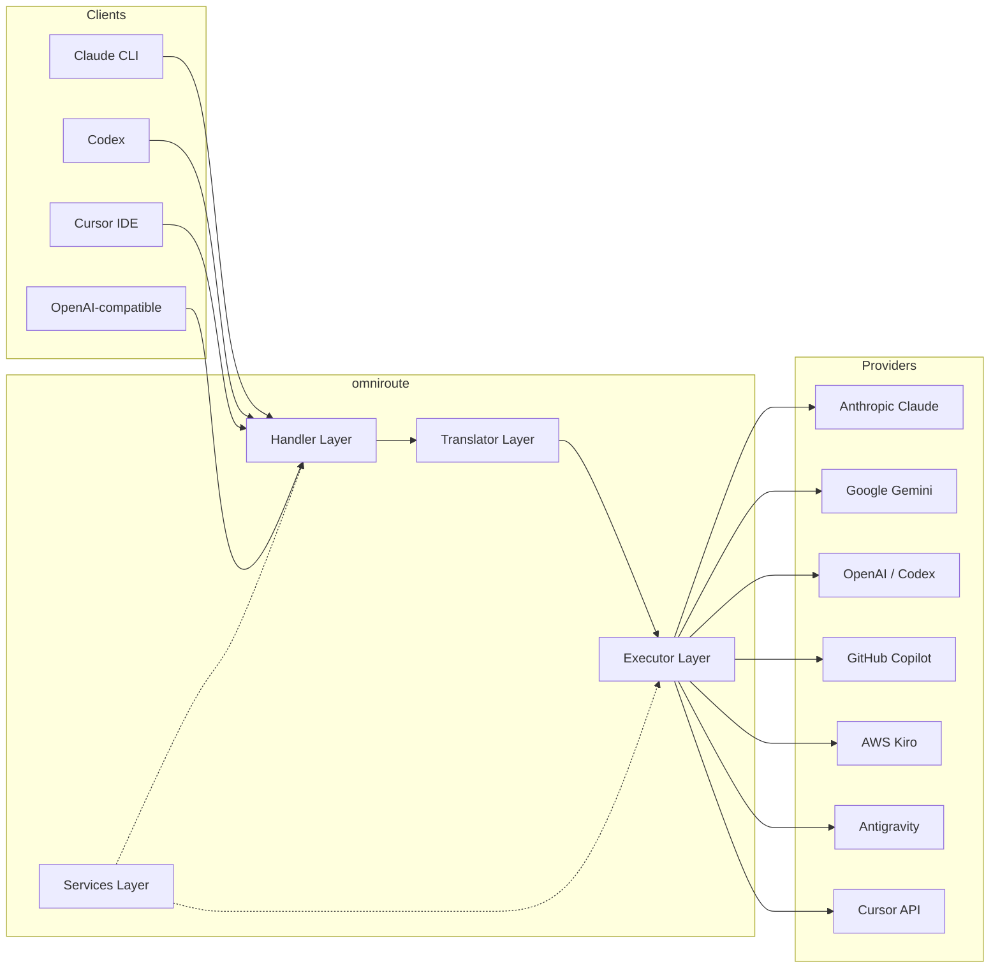

### Pangunahing Prinsipyo: Hub-and-Spoke Translation

Ang lahat ng pagsasalin ng format ay dumadaan sa **OpenAI na format bilang hub**:

```
Client Format → [OpenAI Hub] → Provider Format    (request)
Provider Format → [OpenAI Hub] → Client Format    (response)
```

Nangangahulugan ito na kailangan mo lang ng **N na tagasalin** (isa bawat format) sa halip na **N²** (bawat pares).

---

## 3. Istruktura ng Proyekto

```
omniroute/
├── open-sse/                  ← Core proxy library (portable, framework-agnostic)
│   ├── index.js               ← Main entry point, exports everything
│   ├── config/                ← Configuration & constants
│   ├── executors/             ← Provider-specific request execution
│   ├── handlers/              ← Request handling orchestration
│   ├── services/              ← Business logic (auth, models, fallback, usage)
│   ├── translator/            ← Format translation engine
│   │   ├── request/           ← Request translators (8 files)
│   │   ├── response/          ← Response translators (7 files)
│   │   └── helpers/           ← Shared translation utilities (6 files)
│   └── utils/                 ← Utility functions
├── src/                       ← Application layer (Express/Worker runtime)
│   ├── app/                   ← Web UI, API routes, middleware
│   ├── lib/                   ← Database, auth, and shared library code
│   ├── mitm/                  ← Man-in-the-middle proxy utilities
│   ├── models/                ← Database models
│   ├── shared/                ← Shared utilities (wrappers around open-sse)
│   ├── sse/                   ← SSE endpoint handlers
│   └── store/                 ← State management
├── data/                      ← Runtime data (credentials, logs)
│   └── provider-credentials.json   (external credentials override, gitignored)
└── tester/                    ← Test utilities
```

---

## 4. Pagkakabahagi ng Module-by-Module

### 4.1 Config (`open-sse/config/`)

Ang **nag-iisang pinagmulan ng katotohanan** para sa lahat ng configuration ng provider.

| File                          | Layunin                                                                                                                                                                                                                                                                   |
| ----------------------------- | ------------------------------------------------------------------------------------------------------------------------------------------------------------------------------------------------------------------------------------------------------------------------- |
| `constants.ts`                | `PROVIDERS` object na may mga base URL, mga kredensyal ng OAuth (mga default), header, at default na prompt ng system para sa bawat provider. Tinutukoy din ang `HTTP_STATUS`, `ERROR_TYPES`, `COOLDOWN_MS`, `BACKOFF_CONFIG`, at `SKIP_PATTERNS`.                        |
| `credentialLoader.ts`         | Naglo-load ng mga panlabas na kredensyal mula sa `data/provider-credentials.json` at pinagsasama ang mga ito sa mga naka-hardcode na default sa `PROVIDERS`. Pinapanatili ang mga lihim na wala sa kontrol ng pinagmulan habang pinapanatili ang pabalik na pagkakatugma. |
| `providerModels.ts`           | Central model registry: maps provider aliases → model IDs. Mga function tulad ng `getModels()`, `getProviderByAlias()`.                                                                                                                                                   |
| `codexInstructions.ts`        | Mga tagubilin ng system na ini-inject sa mga kahilingan sa Codex (mga hadlang sa pag-edit, mga panuntunan sa sandbox, mga patakaran sa pag-apruba).                                                                                                                       |
| `defaultThinkingSignature.ts` | Default na "pag-iisip" na mga lagda para sa mga modelong Claude at Gemini.                                                                                                                                                                                                |
| `ollamaModels.ts`             | Depinisyon ng schema para sa mga lokal na modelo ng Ollama (pangalan, laki, pamilya, quantization).                                                                                                                                                                       |

#### Daloy ng Paglo-load ng Kredensyal

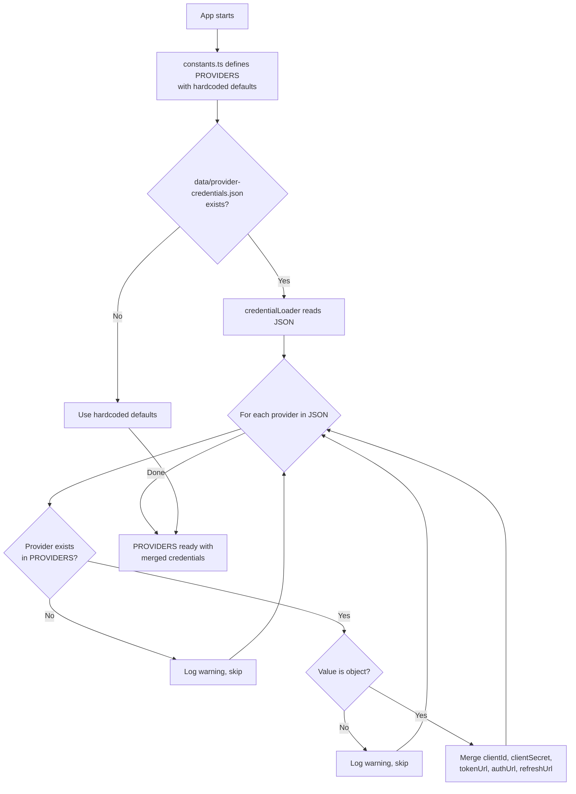

---

### 4.2 Mga Tagapagpatupad (`open-sse/executors/`)

Inilalagay ng mga tagapagpatupad ang **lohika na tukoy sa provider** gamit ang **Pattern ng Diskarte**. Ino-override ng bawat executor ang mga base method kung kinakailangan.

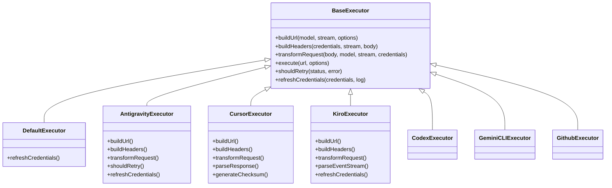

| Tagapagpatupad   | Provider                                   | Mga Pangunahing Espesyalisasyon                                                                                                                      |
| ---------------- | ------------------------------------------ | ---------------------------------------------------------------------------------------------------------------------------------------------------- |
| `base.ts`        | —                                          | Abstract base: Pagbuo ng URL, mga header, subukang muli ang logic, pag-refresh ng kredensyal                                                         |
| `default.ts`     | Claude, Gemini, OpenAI, GLM, Kimi, MiniMax | Generic na OAuth token refresh para sa mga karaniwang provider                                                                                       |
| `antigravity.ts` | Google Cloud Code                          | Pagbuo ng Project/session ID, multi-URL fallback, custom na muling subukang pag-parse mula sa mga mensahe ng error ("i-reset pagkatapos ng 2h7m23s") |
| `cursor.ts`      | Cursor IDE                                 | **Pinakakumplikado**: SHA-256 checksum auth, Protobuf request encoding, binary EventStream → SSE response parsing                                    |
| `codex.ts`       | OpenAI Codex                               | Nag-inject ng mga tagubilin sa system, namamahala sa mga antas ng pag-iisip, nag-aalis ng mga hindi sinusuportahang parameter                        |
| `gemini-cli.ts`  | Google Gemini CLI                          | Pagbuo ng custom na URL (`streamGenerateContent`), pag-refresh ng token ng Google OAuth                                                              |
| `github.ts`      | GitHub Copilot                             | Dual token system (GitHub OAuth + Copilot token), paggaya ng header ng VSCode                                                                        |
| `kiro.ts`        | AWS CodeWhisperer                          | AWS EventStream binary parsing, AMZN event frames, token estimation                                                                                  |
| `index.ts`       | —                                          | Pabrika: maps provider name → executor class, na may default na fallback                                                                             |

---

### 4.3 Mga Handler (`open-sse/handlers/`)

Ang **orchestration layer** — nag-coordinate ng pagsasalin, execution, streaming, at paghawak ng error.

| File                  | Layunin                                                                                                                                                                                                                                                             |
| --------------------- | ------------------------------------------------------------------------------------------------------------------------------------------------------------------------------------------------------------------------------------------------------------------- |
| `chatCore.ts`         | **Central orchestrator** (~600 linya). Pinangangasiwaan ang kumpletong lifecycle ng kahilingan: pagtukoy ng format → pagsasalin → dispatch ng tagapagpatupad → tugon sa streaming/hindi streaming → pag-refresh ng token → paghawak ng error → pag-log sa paggamit. |
| `responsesHandler.ts` | Adapter para sa OpenAI's Responses API: kino-convert ang format ng Mga Tugon → Mga Pagkumpleto ng Chat → ipinapadala sa `chatCore` → ibinalik ang SSE sa format ng Mga Tugon.                                                                                       |
| `embeddings.ts`       | Tagapangasiwa ng henerasyon ng pag-embed: niresolba ang modelo ng pag-embed → provider, nagpapadala sa API ng provider, nagbabalik ng tugon sa pag-embed na katugma sa OpenAI. Sinusuportahan ang 6+ provider.                                                      |
| `imageGeneration.ts`  | Handler ng pagbuo ng imahe: niresolba ang modelo ng imahe → provider, sumusuporta sa OpenAI-compatible, Gemini-image (Antigravity), at fallback (Nebius) mode. Ibinabalik ang base64 o mga larawan ng URL.                                                          |

#### Humiling ng Lifecycle (chatCore.ts)

```mermaid
sequenceDiagram
    participant Client
    participant chatCore
    participant Translator
    participant Executor
    participant Provider

    Client->>chatCore: Request (any format)
    chatCore->>chatCore: Detect source format
    chatCore->>chatCore: Check bypass patterns
    chatCore->>chatCore: Resolve model & provider
    chatCore->>Translator: Translate request (source → OpenAI → target)
    chatCore->>Executor: Get executor for provider
    Executor->>Executor: Build URL, headers, transform request
    Executor->>Executor: Refresh credentials if needed
    Executor->>Provider: HTTP fetch (streaming or non-streaming)

    alt Streaming
        Provider-->>chatCore: SSE stream
        chatCore->>chatCore: Pipe through SSE transform stream
        Note over chatCore: Transform stream translates<br/>each chunk: target → OpenAI → source
        chatCore-->>Client: Translated SSE stream
    else Non-streaming
        Provider-->>chatCore: JSON response
        chatCore->>Translator: Translate response
        chatCore-->>Client: Translated JSON
    end

    alt Error (401, 429, 500...)
        chatCore->>Executor: Retry with credential refresh
        chatCore->>chatCore: Account fallback logic
    end
```

---

### 4.4 Mga Serbisyo (`open-sse/services/`)

Logic ng negosyo na sumusuporta sa mga humahawak at tagapagpatupad.

| File                 | Layunin                                                                                                                                                                                                                                                                                                                                                                                     |
| -------------------- | ------------------------------------------------------------------------------------------------------------------------------------------------------------------------------------------------------------------------------------------------------------------------------------------------------------------------------------------------------------------------------------------- |
| `provider.ts`        | **Format detection** (`detectFormat`): sinusuri ang request body structure para matukoy ang mga format ng Claude/OpenAI/Gemini/Antigravity/Responses (kasama ang `max_tokens` heuristic para kay Claude). Gayundin: pagbuo ng URL, pagbuo ng header, pag-normalize ng config ng pag-iisip. Sinusuportahan ang `openai-compatible-*` at `anthropic-compatible-*` na mga dynamic na provider. |
| `model.ts`           | Model string parsing (`claude/model-name` → `{provider: "claude", model: "model-name"}`), alias resolution na may collision detection, input sanitization (tinatanggihan ang path traversal/control chars), at resolution ng impormasyon ng modelo na may suporta sa async alias getter.                                                                                                    |
| `accountFallback.ts` | Rate-limit handling: exponential backoff (1s → 2s → 4s → max 2min), pamamahala ng cooldown ng account, pag-uuri ng error (na ang mga error ay nagti-trigger ng fallback vs. not).                                                                                                                                                                                                           |
| `tokenRefresh.ts`    | OAuth token refresh para sa **bawat provider**: Google (Gemini, Antigravity), Claude, Codex, Qwen, iFlow, GitHub (OAuth + Copilot dual-token), Kiro (AWS SSO OIDC + Social Auth). May kasamang in-flight promise deduplication cache at subukang muli nang may exponential backoff.                                                                                                         |
| `combo.ts`           | **Mga modelong combo**: mga chain ng fallback na modelo. Kung nabigo ang modelong A na may error na karapat-dapat sa fallback, subukan ang modelo B, pagkatapos ay C, atbp. Ibinabalik ang mga aktwal na upstream na status code.                                                                                                                                                           |
| `usage.ts`           | Kinukuha ang quota/data ng paggamit mula sa mga provider API (GitHub Copilot quota, Antigravity model quota, Codex rate limits, Kiro usage breakdowns, Claude settings).                                                                                                                                                                                                                    |
| `accountSelector.ts` | Pagpili ng matalinong account na may algorithm ng pagmamarka: isinasaalang-alang ang priyoridad, katayuan sa kalusugan, posisyon ng round-robin, at estado ng cooldown upang piliin ang pinakamainam na account para sa bawat kahilingan.                                                                                                                                                   |
| `contextManager.ts`  | Humiling ng pamamahala sa lifecycle ng konteksto: gumagawa at sumusubaybay ng mga object ng konteksto sa bawat kahilingan na may metadata (request ID, timestamp, impormasyon ng provider) para sa pag-debug at pag-log.                                                                                                                                                                    |
| `ipFilter.ts`        | IP-based na access control: sumusuporta sa allowlist at blocklist mode. Pinapatunayan ang IP ng kliyente laban sa mga na-configure na panuntunan bago iproseso ang mga kahilingan sa API.                                                                                                                                                                                                   |
| `sessionManager.ts`  | Pagsubaybay sa session gamit ang fingerprinting ng kliyente: sinusubaybayan ang mga aktibong session gamit ang mga na-hash na identifier ng kliyente, sinusubaybayan ang mga bilang ng kahilingan, at nagbibigay ng mga sukatan ng session.                                                                                                                                                 |
| `signatureCache.ts`  | Humiling ng signature-based na deduplication cache: pinipigilan ang mga duplicate na kahilingan sa pamamagitan ng pag-cache ng mga kamakailang pirma ng kahilingan at pagbabalik ng mga naka-cache na tugon para sa magkaparehong mga kahilingan sa loob ng isang palugit ng oras.                                                                                                          |
| `systemPrompt.ts`    | Global system prompt injection: naghahanda o nagdaragdag ng isang nako-configure na prompt ng system sa lahat ng kahilingan, na may paghawak sa compatibility ng bawat provider.                                                                                                                                                                                                            |
| `thinkingBudget.ts`  | Pamamahala ng badyet ng token ng pangangatwiran: sumusuporta sa passthrough, auto (strip thinking config), custom (fixed budget), at adaptive (complexity-scaled) na mga mode para sa pagkontrol sa mga token ng pag-iisip/pangangatwiran.                                                                                                                                                  |
| `wildcardRouter.ts`  | Pagruruta ng pattern ng wildcard na modelo: nire-resolba ang mga pattern ng wildcard (hal., `*/claude-*`) sa mga kongkretong pares ng provider/modelo batay sa availability at priyoridad.                                                                                                                                                                                                  |

#### Token Refresh Deduplication

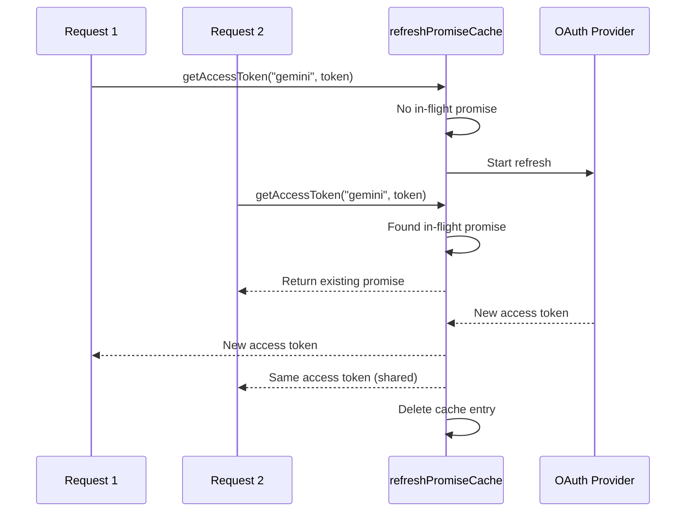

#### Account Fallback State Machine

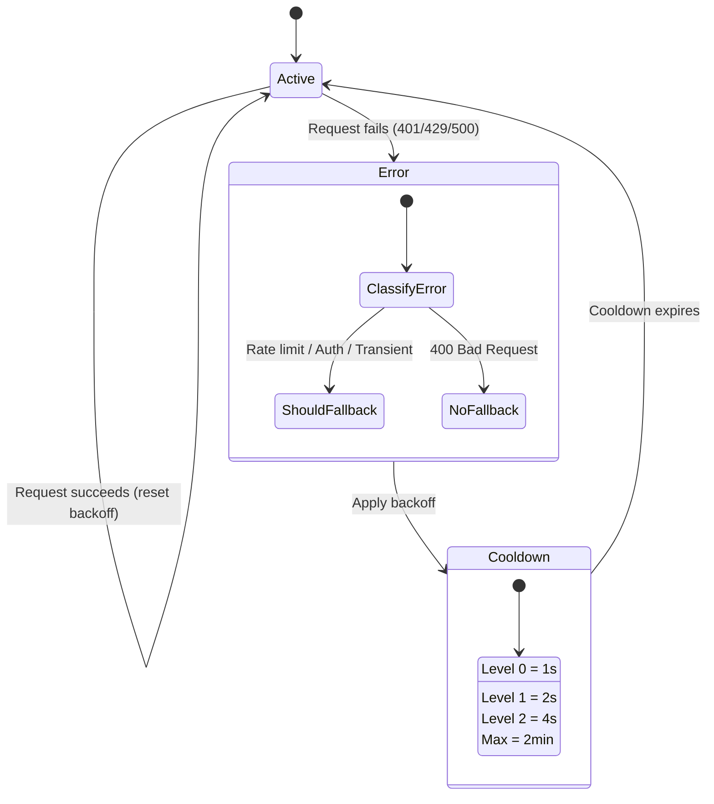

#### Combo Model Chain

```mermaid
flowchart LR
    A["Request with\ncombo model"] --> B["Model A"]
    B -->|"2xx Success"| C["Return response"]
    B -->|"429/401/500"| D{"Fallback\neligible?"}
    D -->|Yes| E["Model B"]
    D -->|No| F["Return error"]
    E -->|"2xx Success"| C
    E -->|"429/401/500"| G{"Fallback\neligible?"}
    G -->|Yes| H["Model C"]
    G -->|No| F
    H -->|"2xx Success"| C
    H -->|"Fail"| I["All failed →\nReturn last status"]
```

---

### 4.5 Tagasalin (`open-sse/translator/`)

Ang **format translation engine** gamit ang isang self-registering plugin system.

#### Arkitektura

```mermaid
graph TD
    subgraph "Request Translation"
        A["Claude → OpenAI"]
        B["Gemini → OpenAI"]
        C["Antigravity → OpenAI"]
        D["OpenAI Responses → OpenAI"]
        E["OpenAI → Claude"]
        F["OpenAI → Gemini"]
        G["OpenAI → Kiro"]
        H["OpenAI → Cursor"]
    end

    subgraph "Response Translation"
        I["Claude → OpenAI"]
        J["Gemini → OpenAI"]
        K["Kiro → OpenAI"]
        L["Cursor → OpenAI"]
        M["OpenAI → Claude"]
        N["OpenAI → Antigravity"]
        O["OpenAI → Responses"]
    end
```

| Direktoryo   | Mga file      | Paglalarawan                                                                                                                                                                                                                                                         |
| ------------ | ------------- | -------------------------------------------------------------------------------------------------------------------------------------------------------------------------------------------------------------------------------------------------------------------- |
| `request/`   | 8 tagasalin   | I-convert ang mga katawan ng kahilingan sa pagitan ng mga format. Ang bawat file ay nagrerehistro sa pamamagitan ng `register(from, to, fn)` sa pag-import.                                                                                                          |
| `response/`  | 7 tagasalin   | I-convert ang mga tipak ng tugon sa streaming sa pagitan ng mga format. Pinangangasiwaan ang mga uri ng kaganapan sa SSE, mga bloke ng pag-iisip, mga tawag sa tool.                                                                                                 |
| `helpers/`   | 6 na katulong | Mga nakabahaging utilities: `claudeHelper` (system prompt extraction, thinking config), `geminiHelper` (parts/content mapping), `openaiHelper` (format filtering), `toolCallHelper` (ID generation, missing response injection), `toolCallHelper`, `toolCallHelper`8 |
| `index.ts`   | —             | Translation engine: `translateRequest()`, `translateResponse()`, pamamahala ng estado, pagpapatala.                                                                                                                                                                  |
| `formats.ts` | —             | Mga constant ng format: `OPENAI`, `CLAUDE`, `GEMINI`, `ANTIGRAVITY`, `KIRO`, `CURSOR`, `OPENAI_RESPONSES`.                                                                                                                                                           |

#### Pangunahing Disenyo: Self-Registering Plugin

```javascript
// Each translator file calls register() on import:
import { register } from "../index.js";
register("claude", "openai", translateClaudeToOpenAI);

// The index.js imports all translator files, triggering registration:
import "./request/claude-to-openai.js"; // ← self-registers
```

---

### 4.6 Mga Util (`open-sse/utils/`)

| File               | Layunin                                                                                                                                                                                                                                                                                                                                                       |
| ------------------ | ------------------------------------------------------------------------------------------------------------------------------------------------------------------------------------------------------------------------------------------------------------------------------------------------------------------------------------------------------------- |
| `error.ts`         | Error response building (OpenAI-compatible format), upstream error parsing, Antigravity retry-time extraction mula sa mga error message, SSE error streaming.                                                                                                                                                                                                 |
| `stream.ts`        | **SSE Transform Stream** — ang pangunahing streaming pipeline. Dalawang mode: `TRANSLATE` (buong format na pagsasalin) at `PASSTHROUGH` (normalize + paggamit ng extract). Pinangangasiwaan ang chunk buffering, pagtatantya ng paggamit, pagsubaybay sa haba ng nilalaman. Ang mga instance ng per-stream encoder/decoder ay umiiwas sa nakabahaging estado. |
| `streamHelpers.ts` | Mga mababang antas ng SSE utilities: `parseSSELine` (whitespace-tolerant), `hasValuableContent` (filter ang mga walang laman na chunks para sa OpenAI/Claude/Gemini), `fixInvalidId`, `formatSSE` (format-aware na SSE_0K na serialization na may ).                                                                                                          |
| `usageTracking.ts` | Pagkuha ng paggamit ng token mula sa anumang format (Claude/OpenAI/Gemini/Responses), pagtatantya na may hiwalay na tool/message char-per-token ratios, pagdaragdag ng buffer (2000 token safety margin), pag-filter ng field na partikular sa format, console logging na may mga kulay ng ANSI.                                                              |
| `requestLogger.ts` | Nakabatay sa file ang pag-log ng kahilingan (opt-in sa pamamagitan ng `ENABLE_REQUEST_LOGS=true`). Lumilikha ng mga folder ng session na may mga file na may numero: `1_req_client.json` → `7_res_client.txt`. Ang lahat ng I/O ay async (fire-and-forget). Maskara ang mga sensitibong header.                                                               |
| `bypassHandler.ts` | Hinaharang ang mga partikular na pattern mula kay Claude CLI (pagkuha ng pamagat, warmup, count) at ibinabalik ang mga pekeng tugon nang hindi tumatawag sa sinumang provider. Sinusuportahan ang parehong streaming at hindi streaming. Sinadyang limitado sa saklaw ng Claude CLI.                                                                          |
| `networkProxy.ts`  | Nire-resolve ang outbound proxy URL para sa isang ibinigay na provider nang nangunguna: provider-specific config → global config → environment variable (`HTTPS_PROXY`/`HTTP_PROXY`/`ALL_PROXY`). Sinusuportahan ang `NO_PROXY` na mga pagbubukod. Caches config para sa 30s.                                                                                 |

#### SSE Streaming Pipeline

```mermaid
flowchart TD
    A["Provider SSE stream"] --> B["TextDecoder\n(per-stream instance)"]
    B --> C["Buffer lines\n(split on newline)"]
    C --> D["parseSSELine()\n(trim whitespace, parse JSON)"]
    D --> E{"Mode?"}
    E -->|TRANSLATE| F["translateResponse()\ntarget → OpenAI → source"]
    E -->|PASSTHROUGH| G["fixInvalidId()\nnormalize chunk"]
    F --> H["hasValuableContent()\nfilter empty chunks"]
    G --> H
    H -->|"Has content"| I["extractUsage()\ntrack token counts"]
    H -->|"Empty"| J["Skip chunk"]
    I --> K["formatSSE()\nserialize + clean perf_metrics"]
    K --> L["TextEncoder\n(per-stream instance)"]
    L --> M["Enqueue to\nclient stream"]

    style A fill:#f9f,stroke:#333
    style M fill:#9f9,stroke:#333
```

#### Istraktura ng Session ng Logger ng Kahilingan

```
logs/
└── claude_gemini_claude-sonnet_20260208_143045/
    ├── 1_req_client.json      ← Raw client request
    ├── 2_req_source.json      ← After initial conversion
    ├── 3_req_openai.json      ← OpenAI intermediate format
    ├── 4_req_target.json      ← Final target format
    ├── 5_res_provider.txt     ← Provider SSE chunks (streaming)
    ├── 5_res_provider.json    ← Provider response (non-streaming)
    ├── 6_res_openai.txt       ← OpenAI intermediate chunks
    ├── 7_res_client.txt       ← Client-facing SSE chunks
    └── 6_error.json           ← Error details (if any)
```

---

### 4.7 Application Layer (`src/`)

| Direktoryo    | Layunin                                                                          |
| ------------- | -------------------------------------------------------------------------------- |
| `src/app/`    | Web UI, mga ruta ng API, Express middleware, OAuth callback handler              |
| `src/lib/`    | Access sa database (`localDb.ts`, `usageDb.ts`), pagpapatunay, ibinahagi         |
| `src/mitm/`   | Man-in-the-middle proxy utility para sa pagharang sa trapiko ng provider         |
| `src/models/` | Mga kahulugan ng modelo ng database                                              |
| `src/shared/` | Mga wrapper sa paligid ng mga open-sse function (provider, stream, error, atbp.) |
| `src/sse/`    | SSE endpoint handler na nag-wire ng open-sse library sa Express na mga ruta      |
| `src/store/`  | Pamamahala ng estado ng aplikasyon                                               |

#### Kapansin-pansing Mga Ruta ng API

| Ruta                                          | Mga Paraan      | Layunin                                                                                                        |
| --------------------------------------------- | --------------- | -------------------------------------------------------------------------------------------------------------- |
| `/api/provider-models`                        | GET/POST/DELETE | CRUD para sa mga custom na modelo sa bawat provider                                                            |
| `/api/models/catalog`                         | KUMUHA          | Pinagsama-samang catalog ng lahat ng modelo (chat, pag-embed, larawan, custom) na nakapangkat ayon sa provider |
| `/api/settings/proxy`                         | GET/PUT/DELETE  | Hierarchical outbound proxy configuration (`global/providers/combos/keys`)                                     |
| `/api/settings/proxy/test`                    | POST            | Pinapatunayan ang koneksyon ng proxy at ibinabalik ang pampublikong IP/latency                                 |
| `/v1/providers/[provider]/chat/completions`   | POST            | Nakatuon sa bawat provider na mga pagkumpleto ng chat na may pagpapatunay ng modelo                            |
| `/v1/providers/[provider]/embeddings`         | POST            | Mga nakalaang pag-embed ng bawat provider na may pagpapatunay ng modelo                                        |
| `/v1/providers/[provider]/images/generations` | POST            | Nakatuon sa pagbuo ng larawan ng bawat provider na may pagpapatunay ng modelo                                  |
| `/api/settings/ip-filter`                     | GET/PUT         | Pamamahala ng IP allowlist/blocklist                                                                           |
| `/api/settings/thinking-budget`               | GET/PUT         | Reasoning token configuration ng badyet (passthrough/auto/custom/adaptive)                                     |
| `/api/settings/system-prompt`                 | GET/PUT         | Global system prompt injection para sa lahat ng kahilingan                                                     |
| `/api/sessions`                               | KUMUHA          | Aktibong pagsubaybay sa session at mga sukatan                                                                 |
| `/api/rate-limits`                            | KUMUHA          | Katayuan ng limitasyon sa rate ng bawat account                                                                |

---

## 5. Mga Pangunahing Pattern ng Disenyo

### 5.1 Hub-and-Spoke Translation

Ang lahat ng mga format ay isinasalin sa pamamagitan ng **OpenAI format bilang hub**. Ang pagdaragdag ng bagong provider ay nangangailangan lamang ng pagsulat ng **isang pares** ng mga tagasalin (sa/mula sa OpenAI), hindi N pares.

### 5.2 Pattern ng Estratehiya ng Tagapatupad

Ang bawat provider ay may nakalaang executor class na nagmana mula sa `BaseExecutor`. Pinipili ng factory sa `executors/index.ts` ang tama sa runtime.

### 5.3 Self-Registering Plugin System

Ang mga module ng tagasalin ay nagrerehistro sa kanilang sarili sa pag-import sa pamamagitan ng `register()`. Ang pagdaragdag ng bagong tagasalin ay paggawa lamang ng file at pag-import nito.

### 5.4 Account Fallback na may Exponential Backoff

Kapag nagbalik ang isang provider ng 429/401/500, maaaring lumipat ang system sa susunod na account, na naglalapat ng mga exponential cooldown (1s → 2s → 4s → max 2min).

### 5.5 Combo Model Chain

Ang isang "combo" ay nagpapangkat ng maraming `provider/model` string. Kung nabigo ang una, awtomatikong mag-fallback sa susunod.

### 5.6 Stateful Streaming Translation

Ang pagsasalin ng tugon ay nagpapanatili ng estado sa mga bahagi ng SSE (pagsubaybay sa bloke ng pag-iisip, pag-iipon ng tawag sa tool, pag-index ng block ng nilalaman) sa pamamagitan ng mekanismong `initState()`.

### 5.7 Buffer sa Kaligtasan sa Paggamit

Ang isang 2000-token buffer ay idinagdag sa iniulat na paggamit upang maiwasan ang mga kliyente na maabot ang mga limitasyon sa window ng konteksto dahil sa overhead mula sa mga prompt ng system at pagsasalin ng format.

---

## 6. Mga Sinusuportahang Format

| Format                         | Direksyon           | Identifier         |
| ------------------------------ | ------------------- | ------------------ |
| Mga Pagkumpleto ng OpenAI Chat | pinagmulan + target | `openai`           |
| OpenAI Responses API           | pinagmulan + target | `openai-responses` |
| Anthropic Claude               | pinagmulan + target | `claude`           |
| Google Gemini                  | pinagmulan + target | `gemini`           |
| Google Gemini CLI              | target lang         | `gemini-cli`       |
| Antigravity                    | pinagmulan + target | `antigravity`      |
| AWS Kiro                       | target lang         | `kiro`             |
| Cursor                         | target lang         | `cursor`           |

---

## 7. Mga Sinusuportahang Provider

| Provider                 | Paraan ng Pagpapatunay | Tagapagpatupad | Pangunahing Tala                                               |
| ------------------------ | ---------------------- | -------------- | -------------------------------------------------------------- |
| Anthropic Claude         | API key o OAuth        | Default        | Gumagamit ng `x-api-key` header                                |
| Google Gemini            | API key o OAuth        | Default        | Gumagamit ng `x-goog-api-key` header                           |
| Google Gemini CLI        | OAuth                  | GeminiCLI      | Gumagamit ng `streamGenerateContent` endpoint                  |
| Antigravity              | OAuth                  | Antigravity    | Multi-URL fallback, custom na muling subukang pag-parse        |
| OpenAI                   | API key                | Default        | Standard Bearer auth                                           |
| Codex                    | OAuth                  | Codex          | Nag-inject ng mga tagubilin sa system, namamahala sa pag-iisip |
| GitHub Copilot           | OAuth + Copilot token  | Github         | Dual token, paggaya ng header ng VSCode                        |
| Kiro (AWS)               | AWS SSO OIDC o Social  | Kiro           | Binary EventStream pag-parse                                   |
| Cursor IDE               | Checksum auth          | Cursor         | Protobuf encoding, SHA-256 checksums                           |
| Qwen                     | OAuth                  | Default        | Karaniwang pagpapatunay                                        |
| iFlow                    | OAuth (Basic + Bearer) | Default        | Dual auth header                                               |
| OpenRouter               | API key                | Default        | Standard Bearer auth                                           |
| GLM, Kimi, MiniMax       | API key                | Default        | Claude-compatible, gumamit ng `x-api-key`                      |
| `openai-compatible-*`    | API key                | Default        | Dynamic: anumang endpoint na katugma sa OpenAI                 |
| `anthropic-compatible-*` | API key                | Default        | Dynamic: anumang endpoint na katugma sa Claude                 |

---

## 8. Buod ng Daloy ng Data

### Kahilingan sa Pag-stream

```mermaid
flowchart LR
    A["Client"] --> B["detectFormat()"]
    B --> C["translateRequest()\nsource → OpenAI → target"]
    C --> D["Executor\nbuildUrl + buildHeaders"]
    D --> E["fetch(providerURL)"]
    E --> F["createSSEStream()\nTRANSLATE mode"]
    F --> G["parseSSELine()"]
    G --> H["translateResponse()\ntarget → OpenAI → source"]
    H --> I["extractUsage()\n+ addBuffer"]
    I --> J["formatSSE()"]
    J --> K["Client receives\ntranslated SSE"]
    K --> L["logUsage()\nsaveRequestUsage()"]
```

### Kahilingan na Hindi Nag-stream

```mermaid
flowchart LR
    A["Client"] --> B["detectFormat()"]
    B --> C["translateRequest()\nsource → OpenAI → target"]
    C --> D["Executor.execute()"]
    D --> E["translateResponse()\ntarget → OpenAI → source"]
    E --> F["Return JSON\nresponse"]
```

### Daloy ng Bypass (Claude CLI)

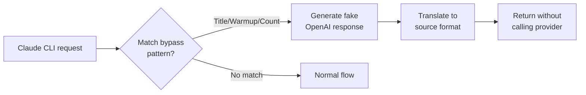
