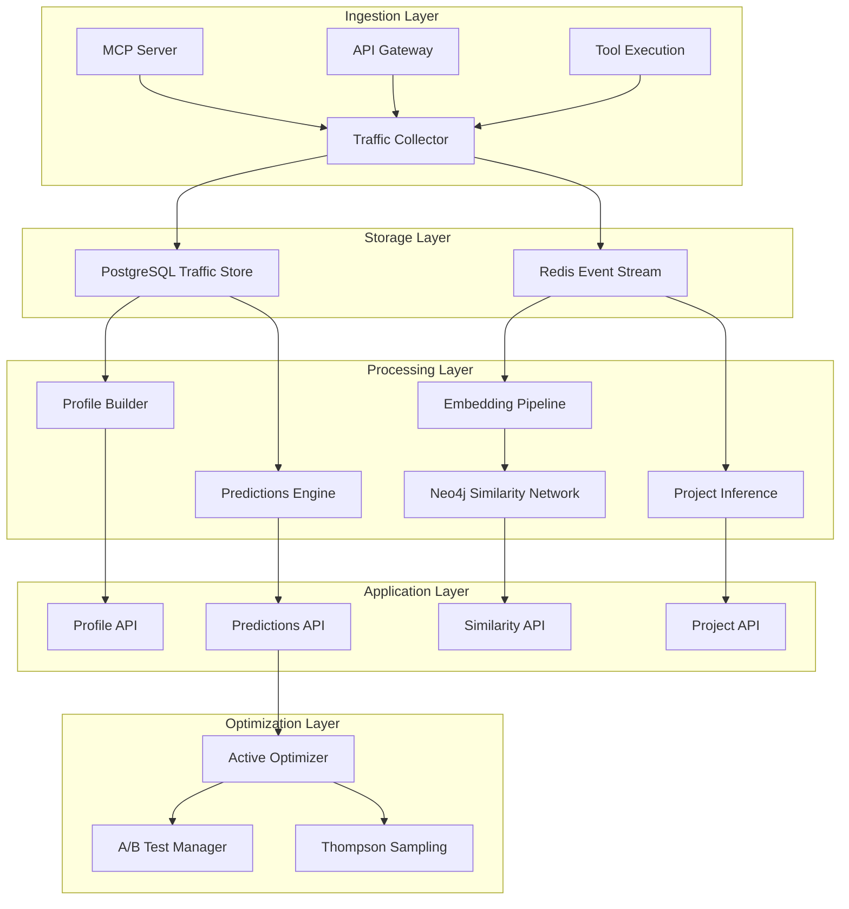
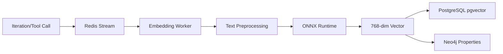
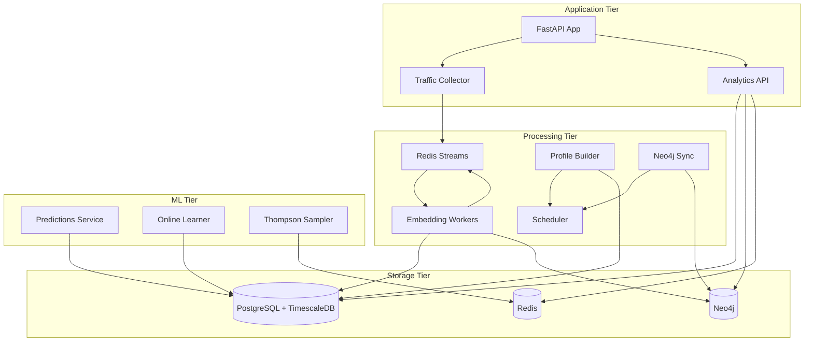

# Analytics System Architecture - SmartCP/Bifrost

**Version:** 1.0
**Last Updated:** 2025-11-30
**Status:** Production Design

---

## Table of Contents

1. [System Overview](#1-system-overview)
2. [Traffic Storage & Scoping](#2-traffic-storage--scoping)
3. [Embedding Pipeline](#3-embedding-pipeline)
4. [Neo4j Similarity Network](#4-neo4j-similarity-network)
5. [Predictions Engine](#5-predictions-engine)
6. [Profile Builder](#6-profile-builder)
7. [Project Inference](#7-project-inference)
8. [Active Optimization](#8-active-optimization)
9. [Security & Privacy](#9-security--privacy)
10. [Deployment Architecture](#10-deployment-architecture)
11. [Monitoring & Observability](#11-monitoring--observability)
12. [Implementation Roadmap](#12-implementation-roadmap)

---

## 1. System Overview

### 1.1 Purpose

The SmartCP/Bifrost Analytics System provides:
- **Real-time traffic analysis** at multiple scoping levels
- **Semantic understanding** via embeddings and similarity networks
- **Predictive capabilities** for performance optimization
- **Profile-based insights** for users, projects, and workflows
- **Active optimization** through adaptive learning

### 1.2 Architecture Principles

1. **Extreme Granularity**: Capture every prompt, response, tool call, and interaction
2. **Multi-Level Scoping**: Support iteration → prompt-chain → session → session-phase → project hierarchy
3. **Real-Time + Batch**: Live ingestion with async batch processing
4. **Privacy-First**: Encryption, anonymization, scope-based access control
5. **Incremental Learning**: Online updates without full retraining

### 1.3 High-Level Architecture



### 1.4 Technology Stack

| Component | Technology | Rationale |
|-----------|-----------|-----------|
| **Traffic Storage** | PostgreSQL 16 + TimescaleDB | Time-series partitioning, native JSON, excellent query performance |
| **Event Streaming** | Redis Streams | Low latency, simple, built-in consumer groups |
| **Embeddings** | ModernBERT + ONNX Runtime | State-of-art quality, fast inference |
| **Graph Database** | Neo4j 5.x | Native graph queries, built-in algorithms |
| **Vector Search** | pgvector (PostgreSQL) | Unified storage, simpler ops than separate vector DB |
| **Cache** | Redis | Fast lookups, session state |
| **Predictions** | scikit-learn + PyTorch | Familiar stack, easy deployment |
| **Orchestration** | Prefect | Workflow DAGs, retry logic, monitoring |

---

## 2. Traffic Storage & Scoping

### 2.1 Scoping Hierarchy

```
project
  └── session_phase (e.g., "planning", "implementation", "testing")
      └── session
          └── prompt_chain (multi-turn conversation)
              └── iteration (single LLM call)
                  ├── prompt
                  ├── response
                  └── tool_calls[]
```

### 2.2 PostgreSQL Schema

#### Core Tables

```sql
-- Enable extensions
CREATE EXTENSION IF NOT EXISTS timescaledb;
CREATE EXTENSION IF NOT EXISTS vector;
CREATE EXTENSION IF NOT EXISTS pg_trgm;

-- Projects table
CREATE TABLE projects (
    id UUID PRIMARY KEY DEFAULT gen_random_uuid(),
    org_id UUID NOT NULL REFERENCES organizations(id),
    name TEXT NOT NULL,
    description TEXT,
    repository_url TEXT,
    created_at TIMESTAMPTZ NOT NULL DEFAULT NOW(),
    updated_at TIMESTAMPTZ NOT NULL DEFAULT NOW(),
    deleted_at TIMESTAMPTZ,
    metadata JSONB DEFAULT '{}',

    -- Computed fields
    total_sessions INT DEFAULT 0,
    total_iterations INT DEFAULT 0,
    total_tokens BIGINT DEFAULT 0,

    -- Indexes
    CONSTRAINT unique_project_org UNIQUE(org_id, name)
);

CREATE INDEX idx_projects_org ON projects(org_id) WHERE deleted_at IS NULL;
CREATE INDEX idx_projects_created ON projects(created_at DESC);

-- Session phases table
CREATE TABLE session_phases (
    id UUID PRIMARY KEY DEFAULT gen_random_uuid(),
    project_id UUID NOT NULL REFERENCES projects(id),
    name TEXT NOT NULL, -- "planning", "implementation", "testing", etc.
    description TEXT,
    started_at TIMESTAMPTZ NOT NULL DEFAULT NOW(),
    ended_at TIMESTAMPTZ,
    metadata JSONB DEFAULT '{}',

    CONSTRAINT unique_phase_name UNIQUE(project_id, name, started_at)
);

CREATE INDEX idx_session_phases_project ON session_phases(project_id);
CREATE INDEX idx_session_phases_started ON session_phases(started_at DESC);

-- Sessions table (high cardinality - partition by time)
CREATE TABLE sessions (
    id UUID PRIMARY KEY DEFAULT gen_random_uuid(),
    session_phase_id UUID REFERENCES session_phases(id),
    project_id UUID NOT NULL REFERENCES projects(id),
    user_id UUID NOT NULL REFERENCES users(id),
    workspace_id UUID NOT NULL REFERENCES workspaces(id),

    started_at TIMESTAMPTZ NOT NULL DEFAULT NOW(),
    ended_at TIMESTAMPTZ,

    -- Session context
    mcp_server_id UUID REFERENCES mcp_servers(id),
    client_info JSONB, -- user agent, IDE, etc.
    environment JSONB, -- OS, platform, etc.

    -- Aggregates (updated via triggers)
    total_iterations INT DEFAULT 0,
    total_prompt_chains INT DEFAULT 0,
    total_tokens BIGINT DEFAULT 0,
    total_tool_calls INT DEFAULT 0,
    success_rate FLOAT,
    avg_latency_ms FLOAT,

    metadata JSONB DEFAULT '{}',

    -- Partitioning key
    CONSTRAINT pk_sessions PRIMARY KEY (id, started_at)
) PARTITION BY RANGE (started_at);

-- Create monthly partitions (managed by TimescaleDB)
SELECT create_hypertable('sessions', 'started_at', chunk_time_interval => INTERVAL '1 month');

CREATE INDEX idx_sessions_project ON sessions(project_id, started_at DESC);
CREATE INDEX idx_sessions_user ON sessions(user_id, started_at DESC);
CREATE INDEX idx_sessions_phase ON sessions(session_phase_id);
CREATE INDEX idx_sessions_workspace ON sessions(workspace_id);

-- Prompt chains table (conversation threads)
CREATE TABLE prompt_chains (
    id UUID PRIMARY KEY DEFAULT gen_random_uuid(),
    session_id UUID NOT NULL,
    session_phase_id UUID,
    project_id UUID NOT NULL,

    started_at TIMESTAMPTZ NOT NULL DEFAULT NOW(),
    ended_at TIMESTAMPTZ,

    -- Chain metadata
    chain_type TEXT, -- "conversation", "tool_workflow", "debug_session"
    topic TEXT, -- inferred topic

    -- Aggregates
    total_iterations INT DEFAULT 0,
    total_tokens BIGINT DEFAULT 0,
    success BOOLEAN,

    metadata JSONB DEFAULT '{}',

    CONSTRAINT pk_prompt_chains PRIMARY KEY (id, started_at),
    FOREIGN KEY (session_id, started_at) REFERENCES sessions(id, started_at)
) PARTITION BY RANGE (started_at);

SELECT create_hypertable('prompt_chains', 'started_at', chunk_time_interval => INTERVAL '1 month');

CREATE INDEX idx_prompt_chains_session ON prompt_chains(session_id, started_at DESC);
CREATE INDEX idx_prompt_chains_project ON prompt_chains(project_id, started_at DESC);
CREATE INDEX idx_prompt_chains_topic ON prompt_chains(topic) WHERE topic IS NOT NULL;

-- Iterations table (individual LLM calls - HIGHEST CARDINALITY)
CREATE TABLE iterations (
    id UUID PRIMARY KEY DEFAULT gen_random_uuid(),
    prompt_chain_id UUID NOT NULL,
    session_id UUID NOT NULL,
    project_id UUID NOT NULL,

    created_at TIMESTAMPTZ NOT NULL DEFAULT NOW(),
    completed_at TIMESTAMPTZ,

    -- Request details
    model TEXT NOT NULL,
    prompt TEXT NOT NULL,
    prompt_tokens INT,
    system_prompt TEXT,
    temperature FLOAT,
    max_tokens INT,

    -- Response details
    response TEXT,
    response_tokens INT,
    finish_reason TEXT,

    -- Execution metrics
    latency_ms INT,
    success BOOLEAN,
    error TEXT,

    -- Cost tracking
    cost_usd NUMERIC(10, 6),

    -- Embedding (computed async)
    prompt_embedding vector(768),
    response_embedding vector(768),
    embeddings_computed_at TIMESTAMPTZ,

    metadata JSONB DEFAULT '{}',

    CONSTRAINT pk_iterations PRIMARY KEY (id, created_at),
    FOREIGN KEY (prompt_chain_id, created_at) REFERENCES prompt_chains(id, started_at)
) PARTITION BY RANGE (created_at);

SELECT create_hypertable('iterations', 'created_at', chunk_time_interval => INTERVAL '1 week');

CREATE INDEX idx_iterations_chain ON iterations(prompt_chain_id, created_at DESC);
CREATE INDEX idx_iterations_session ON iterations(session_id, created_at DESC);
CREATE INDEX idx_iterations_project ON iterations(project_id, created_at DESC);
CREATE INDEX idx_iterations_model ON iterations(model, created_at DESC);
CREATE INDEX idx_iterations_success ON iterations(success, created_at DESC);

-- Vector similarity index (HNSW for fast ANN search)
CREATE INDEX idx_iterations_prompt_embedding ON iterations
USING hnsw (prompt_embedding vector_cosine_ops)
WHERE prompt_embedding IS NOT NULL;

CREATE INDEX idx_iterations_response_embedding ON iterations
USING hnsw (response_embedding vector_cosine_ops)
WHERE response_embedding IS NOT NULL;

-- Tool calls table
CREATE TABLE tool_calls (
    id UUID PRIMARY KEY DEFAULT gen_random_uuid(),
    iteration_id UUID NOT NULL,
    prompt_chain_id UUID NOT NULL,
    session_id UUID NOT NULL,
    project_id UUID NOT NULL,

    created_at TIMESTAMPTZ NOT NULL DEFAULT NOW(),
    completed_at TIMESTAMPTZ,

    -- Tool details
    tool_name TEXT NOT NULL,
    tool_input JSONB NOT NULL,
    tool_output JSONB,

    -- Execution metrics
    latency_ms INT,
    success BOOLEAN,
    error TEXT,

    -- Tool call embedding
    embedding vector(768),
    embeddings_computed_at TIMESTAMPTZ,

    metadata JSONB DEFAULT '{}',

    CONSTRAINT pk_tool_calls PRIMARY KEY (id, created_at),
    FOREIGN KEY (iteration_id, created_at) REFERENCES iterations(id, created_at)
) PARTITION BY RANGE (created_at);

SELECT create_hypertable('tool_calls', 'created_at', chunk_time_interval => INTERVAL '1 week');

CREATE INDEX idx_tool_calls_iteration ON tool_calls(iteration_id);
CREATE INDEX idx_tool_calls_session ON tool_calls(session_id, created_at DESC);
CREATE INDEX idx_tool_calls_project ON tool_calls(project_id, created_at DESC);
CREATE INDEX idx_tool_calls_tool_name ON tool_calls(tool_name, created_at DESC);
CREATE INDEX idx_tool_calls_success ON tool_calls(success, created_at DESC);

CREATE INDEX idx_tool_calls_embedding ON tool_calls
USING hnsw (embedding vector_cosine_ops)
WHERE embedding IS NOT NULL;
```

#### Aggregation Tables (Pre-computed Profiles)

```sql
-- Project profiles (daily aggregation)
CREATE TABLE project_profiles (
    id UUID PRIMARY KEY DEFAULT gen_random_uuid(),
    project_id UUID NOT NULL REFERENCES projects(id),
    date DATE NOT NULL,

    -- Traffic metrics
    total_sessions INT DEFAULT 0,
    total_iterations INT DEFAULT 0,
    total_tool_calls INT DEFAULT 0,
    total_tokens BIGINT DEFAULT 0,

    -- Performance metrics
    avg_latency_ms FLOAT,
    p50_latency_ms FLOAT,
    p95_latency_ms FLOAT,
    p99_latency_ms FLOAT,
    success_rate FLOAT,

    -- Cost metrics
    total_cost_usd NUMERIC(10, 2),

    -- Model distribution
    model_distribution JSONB, -- {"claude-sonnet-4": 100, "gpt-4": 50}

    -- Tool usage
    tool_distribution JSONB, -- {"entity_tool": 200, "query_tool": 150}

    -- Top topics
    top_topics JSONB, -- ["debugging", "refactoring", "testing"]

    -- Complexity metrics
    avg_prompt_length FLOAT,
    avg_response_length FLOAT,
    avg_tools_per_iteration FLOAT,

    computed_at TIMESTAMPTZ NOT NULL DEFAULT NOW(),

    CONSTRAINT unique_project_date UNIQUE(project_id, date)
);

CREATE INDEX idx_project_profiles_project ON project_profiles(project_id, date DESC);
CREATE INDEX idx_project_profiles_date ON project_profiles(date DESC);

-- Session profiles
CREATE TABLE session_profiles (
    id UUID PRIMARY KEY DEFAULT gen_random_uuid(),
    session_id UUID NOT NULL,
    project_id UUID NOT NULL,

    -- Traffic metrics
    total_iterations INT DEFAULT 0,
    total_prompt_chains INT DEFAULT 0,
    total_tool_calls INT DEFAULT 0,
    total_tokens BIGINT DEFAULT 0,

    -- Performance metrics
    avg_latency_ms FLOAT,
    success_rate FLOAT,

    -- Cost
    total_cost_usd NUMERIC(10, 6),

    -- Model usage
    model_distribution JSONB,

    -- Tool usage
    tool_distribution JSONB,

    -- Topics
    topics JSONB,

    -- Project inference
    detected_projects JSONB, -- [{"name": "project-x", "confidence": 0.9}]
    file_references JSONB, -- ["src/main.py", "tests/test_auth.py"]

    computed_at TIMESTAMPTZ NOT NULL DEFAULT NOW(),

    CONSTRAINT unique_session_profile UNIQUE(session_id)
);

CREATE INDEX idx_session_profiles_session ON session_profiles(session_id);
CREATE INDEX idx_session_profiles_project ON session_profiles(project_id);

-- User profiles (weekly aggregation)
CREATE TABLE user_profiles (
    id UUID PRIMARY KEY DEFAULT gen_random_uuid(),
    user_id UUID NOT NULL REFERENCES users(id),
    week_start DATE NOT NULL,

    -- Activity metrics
    total_sessions INT DEFAULT 0,
    total_iterations INT DEFAULT 0,
    total_tokens BIGINT DEFAULT 0,
    active_days INT DEFAULT 0,

    -- Performance
    avg_latency_ms FLOAT,
    success_rate FLOAT,

    -- Cost
    total_cost_usd NUMERIC(10, 2),

    -- Preferences (inferred)
    preferred_models JSONB, -- ["claude-sonnet-4", "gpt-4"]
    favorite_tools JSONB, -- ["entity_tool", "query_tool"]
    common_topics JSONB, -- ["debugging", "refactoring"]

    -- Work patterns
    active_hours JSONB, -- {"09": 50, "10": 120, ...}
    session_duration_avg_min FLOAT,

    computed_at TIMESTAMPTZ NOT NULL DEFAULT NOW(),

    CONSTRAINT unique_user_week UNIQUE(user_id, week_start)
);

CREATE INDEX idx_user_profiles_user ON user_profiles(user_id, week_start DESC);
CREATE INDEX idx_user_profiles_week ON user_profiles(week_start DESC);
```

### 2.3 Retention & Compression Policies

```sql
-- Retention policies (TimescaleDB)

-- Keep raw iterations for 90 days, then compress to 1-hour chunks
SELECT add_retention_policy('iterations', INTERVAL '90 days');
SELECT add_compression_policy('iterations', INTERVAL '7 days');

-- Keep tool calls for 90 days, then compress
SELECT add_retention_policy('tool_calls', INTERVAL '90 days');
SELECT add_compression_policy('tool_calls', INTERVAL '7 days');

-- Keep prompt chains for 1 year, compress after 30 days
SELECT add_retention_policy('prompt_chains', INTERVAL '1 year');
SELECT add_compression_policy('prompt_chains', INTERVAL '30 days');

-- Keep sessions for 2 years, compress after 90 days
SELECT add_retention_policy('sessions', INTERVAL '2 years');
SELECT add_compression_policy('sessions', INTERVAL '90 days');

-- Profile tables: keep indefinitely (they're already aggregated)

-- Continuous aggregates (real-time materialized views)
CREATE MATERIALIZED VIEW iterations_hourly
WITH (timescaledb.continuous) AS
SELECT
    time_bucket('1 hour', created_at) AS bucket,
    project_id,
    model,
    COUNT(*) as count,
    AVG(latency_ms) as avg_latency_ms,
    SUM(prompt_tokens + response_tokens) as total_tokens,
    SUM(cost_usd) as total_cost_usd,
    AVG(CASE WHEN success THEN 1.0 ELSE 0.0 END) as success_rate
FROM iterations
GROUP BY bucket, project_id, model
WITH NO DATA;

SELECT add_continuous_aggregate_policy('iterations_hourly',
    start_offset => INTERVAL '1 day',
    end_offset => INTERVAL '1 hour',
    schedule_interval => INTERVAL '1 hour');

CREATE MATERIALIZED VIEW tool_calls_hourly
WITH (timescaledb.continuous) AS
SELECT
    time_bucket('1 hour', created_at) AS bucket,
    project_id,
    tool_name,
    COUNT(*) as count,
    AVG(latency_ms) as avg_latency_ms,
    AVG(CASE WHEN success THEN 1.0 ELSE 0.0 END) as success_rate
FROM tool_calls
GROUP BY bucket, project_id, tool_name
WITH NO DATA;

SELECT add_continuous_aggregate_policy('tool_calls_hourly',
    start_offset => INTERVAL '1 day',
    end_offset => INTERVAL '1 hour',
    schedule_interval => INTERVAL '1 hour');
```

### 2.4 Ingestion Pipeline

#### Traffic Collector Service

```python
# src/analytics/collectors/traffic_collector.py
from dataclasses import dataclass
from datetime import datetime
from uuid import UUID
import redis
import json

@dataclass
class IterationEvent:
    """Single LLM iteration event."""
    iteration_id: UUID
    prompt_chain_id: UUID
    session_id: UUID
    project_id: UUID

    model: str
    prompt: str
    response: str | None

    prompt_tokens: int
    response_tokens: int | None

    latency_ms: int | None
    success: bool
    error: str | None

    created_at: datetime
    metadata: dict

@dataclass
class ToolCallEvent:
    """Tool execution event."""
    tool_call_id: UUID
    iteration_id: UUID
    prompt_chain_id: UUID
    session_id: UUID
    project_id: UUID

    tool_name: str
    tool_input: dict
    tool_output: dict | None

    latency_ms: int | None
    success: bool
    error: str | None

    created_at: datetime
    metadata: dict

class TrafficCollector:
    """Collect and stream traffic events."""

    def __init__(self, redis_client: redis.Redis, postgres_pool):
        self.redis = redis_client
        self.pool = postgres_pool

    async def record_iteration(self, event: IterationEvent) -> None:
        """Record iteration event."""
        # Stream to Redis for async processing
        await self.redis.xadd(
            "analytics:iterations",
            {
                "data": json.dumps({
                    "iteration_id": str(event.iteration_id),
                    "prompt_chain_id": str(event.prompt_chain_id),
                    "session_id": str(event.session_id),
                    "project_id": str(event.project_id),
                    "model": event.model,
                    "prompt": event.prompt,
                    "response": event.response,
                    "prompt_tokens": event.prompt_tokens,
                    "response_tokens": event.response_tokens,
                    "latency_ms": event.latency_ms,
                    "success": event.success,
                    "error": event.error,
                    "created_at": event.created_at.isoformat(),
                    "metadata": event.metadata
                })
            }
        )

        # Also write to PostgreSQL immediately for queries
        async with self.pool.acquire() as conn:
            await conn.execute("""
                INSERT INTO iterations (
                    id, prompt_chain_id, session_id, project_id,
                    created_at, model, prompt, response,
                    prompt_tokens, response_tokens,
                    latency_ms, success, error, metadata
                ) VALUES ($1, $2, $3, $4, $5, $6, $7, $8, $9, $10, $11, $12, $13, $14)
            """,
                event.iteration_id,
                event.prompt_chain_id,
                event.session_id,
                event.project_id,
                event.created_at,
                event.model,
                event.prompt,
                event.response,
                event.prompt_tokens,
                event.response_tokens,
                event.latency_ms,
                event.success,
                event.error,
                json.dumps(event.metadata)
            )

    async def record_tool_call(self, event: ToolCallEvent) -> None:
        """Record tool call event."""
        # Stream to Redis
        await self.redis.xadd(
            "analytics:tool_calls",
            {
                "data": json.dumps({
                    "tool_call_id": str(event.tool_call_id),
                    "iteration_id": str(event.iteration_id),
                    "prompt_chain_id": str(event.prompt_chain_id),
                    "session_id": str(event.session_id),
                    "project_id": str(event.project_id),
                    "tool_name": event.tool_name,
                    "tool_input": event.tool_input,
                    "tool_output": event.tool_output,
                    "latency_ms": event.latency_ms,
                    "success": event.success,
                    "error": event.error,
                    "created_at": event.created_at.isoformat(),
                    "metadata": event.metadata
                })
            }
        )

        # Write to PostgreSQL
        async with self.pool.acquire() as conn:
            await conn.execute("""
                INSERT INTO tool_calls (
                    id, iteration_id, prompt_chain_id, session_id, project_id,
                    created_at, tool_name, tool_input, tool_output,
                    latency_ms, success, error, metadata
                ) VALUES ($1, $2, $3, $4, $5, $6, $7, $8, $9, $10, $11, $12, $13)
            """,
                event.tool_call_id,
                event.iteration_id,
                event.prompt_chain_id,
                event.session_id,
                event.project_id,
                event.created_at,
                event.tool_name,
                json.dumps(event.tool_input),
                json.dumps(event.tool_output) if event.tool_output else None,
                event.latency_ms,
                event.success,
                event.error,
                json.dumps(event.metadata)
            )
```

---

## 3. Embedding Pipeline

### 3.1 ModernBERT → ONNX Architecture



### 3.2 Model Configuration

```python
# src/analytics/embeddings/modernbert_embedder.py
import onnxruntime as ort
import numpy as np
from transformers import AutoTokenizer
from typing import List
import hashlib

class ModernBERTEmbedder:
    """ModernBERT embeddings via ONNX for production performance."""

    def __init__(self, model_path: str = "models/modernbert-base.onnx"):
        self.tokenizer = AutoTokenizer.from_pretrained("answerdotai/ModernBERT-base")

        # ONNX session with optimization
        sess_options = ort.SessionOptions()
        sess_options.graph_optimization_level = ort.GraphOptimizationLevel.ORT_ENABLE_ALL
        sess_options.intra_op_num_threads = 4

        providers = ['CUDAExecutionProvider', 'CPUExecutionProvider']
        self.session = ort.InferenceSession(model_path, sess_options, providers=providers)

        # Cache for deduplication
        self.cache = {}  # hash -> embedding

    def embed_text(self, text: str) -> np.ndarray:
        """Generate embedding for single text."""
        # Check cache (avoid re-embedding identical text)
        text_hash = hashlib.sha256(text.encode()).hexdigest()
        if text_hash in self.cache:
            return self.cache[text_hash]

        # Tokenize
        inputs = self.tokenizer(
            text,
            return_tensors="np",
            padding=True,
            truncation=True,
            max_length=512
        )

        # Run inference
        outputs = self.session.run(
            None,
            {
                "input_ids": inputs["input_ids"],
                "attention_mask": inputs["attention_mask"]
            }
        )

        # Mean pooling over sequence dimension
        embedding = outputs[0].mean(axis=1)[0]  # (768,)

        # Normalize
        embedding = embedding / np.linalg.norm(embedding)

        # Cache
        self.cache[text_hash] = embedding

        return embedding

    def embed_batch(self, texts: List[str], batch_size: int = 32) -> np.ndarray:
        """Generate embeddings for batch of texts."""
        all_embeddings = []

        for i in range(0, len(texts), batch_size):
            batch = texts[i:i + batch_size]

            # Tokenize batch
            inputs = self.tokenizer(
                batch,
                return_tensors="np",
                padding=True,
                truncation=True,
                max_length=512
            )

            # Run inference
            outputs = self.session.run(
                None,
                {
                    "input_ids": inputs["input_ids"],
                    "attention_mask": inputs["attention_mask"]
                }
            )

            # Mean pooling
            embeddings = outputs[0].mean(axis=1)  # (batch_size, 768)

            # Normalize
            embeddings = embeddings / np.linalg.norm(embeddings, axis=1, keepdims=True)

            all_embeddings.append(embeddings)

        return np.vstack(all_embeddings)
```

### 3.3 Embedding Worker (Batch Processing)

```python
# src/analytics/embeddings/embedding_worker.py
import asyncio
import redis.asyncio as redis
import asyncpg
from datetime import datetime
import json

class EmbeddingWorker:
    """Process embedding jobs from Redis stream."""

    def __init__(
        self,
        redis_client: redis.Redis,
        postgres_pool: asyncpg.Pool,
        embedder: ModernBERTEmbedder,
        batch_size: int = 100,
        worker_id: str = "worker-1"
    ):
        self.redis = redis_client
        self.pool = postgres_pool
        self.embedder = embedder
        self.batch_size = batch_size
        self.worker_id = worker_id
        self.consumer_group = "embedding-workers"

    async def start(self):
        """Start consuming events."""
        # Create consumer group if not exists
        try:
            await self.redis.xgroup_create(
                "analytics:iterations",
                self.consumer_group,
                id="0",
                mkstream=True
            )
        except redis.ResponseError:
            pass  # Group already exists

        try:
            await self.redis.xgroup_create(
                "analytics:tool_calls",
                self.consumer_group,
                id="0",
                mkstream=True
            )
        except redis.ResponseError:
            pass

        # Start consuming
        await asyncio.gather(
            self._process_iterations(),
            self._process_tool_calls()
        )

    async def _process_iterations(self):
        """Process iteration embeddings."""
        while True:
            try:
                # Read batch from stream
                messages = await self.redis.xreadgroup(
                    self.consumer_group,
                    self.worker_id,
                    {"analytics:iterations": ">"},
                    count=self.batch_size,
                    block=1000
                )

                if not messages:
                    continue

                # Extract events
                events = []
                message_ids = []

                for stream, stream_messages in messages:
                    for msg_id, msg_data in stream_messages:
                        event = json.loads(msg_data[b"data"])
                        events.append(event)
                        message_ids.append(msg_id)

                if not events:
                    continue

                # Generate embeddings in batch
                prompts = [e["prompt"] for e in events]
                responses = [e.get("response", "") for e in events if e.get("response")]

                prompt_embeddings = self.embedder.embed_batch(prompts)
                response_embeddings = self.embedder.embed_batch(responses) if responses else []

                # Update PostgreSQL
                async with self.pool.acquire() as conn:
                    async with conn.transaction():
                        for i, event in enumerate(events):
                            prompt_emb = prompt_embeddings[i].tolist()
                            response_emb = response_embeddings[i].tolist() if i < len(response_embeddings) else None

                            await conn.execute("""
                                UPDATE iterations
                                SET
                                    prompt_embedding = $1::vector,
                                    response_embedding = $2::vector,
                                    embeddings_computed_at = $3
                                WHERE id = $4
                            """,
                                prompt_emb,
                                response_emb,
                                datetime.utcnow(),
                                event["iteration_id"]
                            )

                # Acknowledge messages
                for msg_id in message_ids:
                    await self.redis.xack("analytics:iterations", self.consumer_group, msg_id)

            except Exception as e:
                print(f"Error processing iterations: {e}")
                await asyncio.sleep(5)

    async def _process_tool_calls(self):
        """Process tool call embeddings."""
        while True:
            try:
                messages = await self.redis.xreadgroup(
                    self.consumer_group,
                    self.worker_id,
                    {"analytics:tool_calls": ">"},
                    count=self.batch_size,
                    block=1000
                )

                if not messages:
                    continue

                events = []
                message_ids = []

                for stream, stream_messages in messages:
                    for msg_id, msg_data in stream_messages:
                        event = json.loads(msg_data[b"data"])
                        events.append(event)
                        message_ids.append(msg_id)

                if not events:
                    continue

                # Create text representation of tool calls
                texts = []
                for e in events:
                    text = f"{e['tool_name']}: {json.dumps(e['tool_input'])}"
                    if e.get("tool_output"):
                        text += f" -> {json.dumps(e['tool_output'])}"
                    texts.append(text)

                embeddings = self.embedder.embed_batch(texts)

                async with self.pool.acquire() as conn:
                    async with conn.transaction():
                        for i, event in enumerate(events):
                            await conn.execute("""
                                UPDATE tool_calls
                                SET
                                    embedding = $1::vector,
                                    embeddings_computed_at = $2
                                WHERE id = $3
                            """,
                                embeddings[i].tolist(),
                                datetime.utcnow(),
                                event["tool_call_id"]
                            )

                for msg_id in message_ids:
                    await self.redis.xack("analytics:tool_calls", self.consumer_group, msg_id)

            except Exception as e:
                print(f"Error processing tool calls: {e}")
                await asyncio.sleep(5)
```

### 3.4 Incremental Updates

```python
# src/analytics/embeddings/incremental_embedder.py
class IncrementalEmbedder:
    """Incrementally embed new data without reprocessing old data."""

    async def embed_new_iterations(self, since: datetime):
        """Embed iterations created after timestamp."""
        async with self.pool.acquire() as conn:
            # Find iterations without embeddings
            rows = await conn.fetch("""
                SELECT id, prompt, response
                FROM iterations
                WHERE created_at > $1
                  AND prompt_embedding IS NULL
                ORDER BY created_at
                LIMIT 1000
            """, since)

            if not rows:
                return 0

            iteration_ids = [r["id"] for r in rows]
            prompts = [r["prompt"] for r in rows]
            responses = [r["response"] for r in rows if r["response"]]

            # Generate embeddings
            prompt_embeddings = self.embedder.embed_batch(prompts)
            response_embeddings = self.embedder.embed_batch(responses) if responses else []

            # Update in transaction
            async with conn.transaction():
                for i, iteration_id in enumerate(iteration_ids):
                    prompt_emb = prompt_embeddings[i].tolist()
                    response_emb = response_embeddings[i].tolist() if i < len(response_embeddings) else None

                    await conn.execute("""
                        UPDATE iterations
                        SET
                            prompt_embedding = $1::vector,
                            response_embedding = $2::vector,
                            embeddings_computed_at = NOW()
                        WHERE id = $3
                    """, prompt_emb, response_emb, iteration_id)

            return len(iteration_ids)
```

---

## 4. Neo4j Similarity Network

### 4.1 Graph Schema

#### Node Types

```cypher
// Iteration nodes
CREATE CONSTRAINT iteration_id IF NOT EXISTS
FOR (i:Iteration) REQUIRE i.id IS UNIQUE;

// Example properties:
// - id: UUID
// - prompt: TEXT
// - response: TEXT
// - model: TEXT
// - created_at: DATETIME
// - success: BOOLEAN
// - latency_ms: INT
// - project_id: UUID
// - session_id: UUID
// - prompt_embedding: LIST<FLOAT>[768]

// Tool Call nodes
CREATE CONSTRAINT tool_call_id IF NOT EXISTS
FOR (t:ToolCall) REQUIRE t.id IS UNIQUE;

// Properties:
// - id: UUID
// - tool_name: TEXT
// - created_at: DATETIME
// - success: BOOLEAN
// - iteration_id: UUID
// - embedding: LIST<FLOAT>[768]

// Project nodes
CREATE CONSTRAINT project_id IF NOT EXISTS
FOR (p:Project) REQUIRE p.id IS UNIQUE;

// Session nodes
CREATE CONSTRAINT session_id IF NOT EXISTS
FOR (s:Session) REQUIRE s.id IS UNIQUE;

// Topic nodes (for clustering)
CREATE CONSTRAINT topic_name IF NOT EXISTS
FOR (t:Topic) REQUIRE t.name IS UNIQUE;

// Model nodes
CREATE CONSTRAINT model_name IF NOT EXISTS
FOR (m:Model) REQUIRE m.name IS UNIQUE;
```

#### Edge Types

```cypher
// Semantic similarity (cosine similarity > threshold)
// [:SIMILAR_TO {similarity: FLOAT}]

// Temporal sequence
// [:NEXT {time_delta_ms: INT}]

// Tool usage
// [:USES_TOOL]

// Project membership
// [:BELONGS_TO_PROJECT]

// Session membership
// [:IN_SESSION]

// Topic membership
// [:HAS_TOPIC {confidence: FLOAT}]

// Model usage
// [:USES_MODEL]

// Success/failure patterns
// [:FOLLOWED_BY_SUCCESS]
// [:FOLLOWED_BY_FAILURE]
```

### 4.2 Graph Construction Pipeline

```python
# src/analytics/graph/neo4j_builder.py
from neo4j import AsyncGraphDatabase
import numpy as np
from typing import List, Tuple

class Neo4jGraphBuilder:
    """Build similarity network in Neo4j."""

    def __init__(self, uri: str, user: str, password: str):
        self.driver = AsyncGraphDatabase.driver(uri, auth=(user, password))
        self.similarity_threshold = 0.75  # Only create edges for high similarity

    async def sync_iterations(self, batch_size: int = 1000):
        """Sync iterations from PostgreSQL to Neo4j."""
        async with self.pool.acquire() as pg_conn:
            # Get iterations with embeddings not yet in Neo4j
            rows = await pg_conn.fetch("""
                SELECT
                    i.id,
                    i.prompt,
                    i.response,
                    i.model,
                    i.created_at,
                    i.success,
                    i.latency_ms,
                    i.project_id,
                    i.session_id,
                    i.prompt_embedding
                FROM iterations i
                LEFT JOIN neo4j_sync_log n ON n.iteration_id = i.id
                WHERE i.prompt_embedding IS NOT NULL
                  AND n.iteration_id IS NULL
                ORDER BY i.created_at DESC
                LIMIT $1
            """, batch_size)

            if not rows:
                return 0

            # Create nodes in Neo4j
            async with self.driver.session() as session:
                await session.execute_write(
                    self._create_iteration_nodes,
                    rows
                )

            # Mark as synced
            async with pg_conn.transaction():
                for row in rows:
                    await pg_conn.execute("""
                        INSERT INTO neo4j_sync_log (iteration_id, synced_at)
                        VALUES ($1, NOW())
                    """, row["id"])

            return len(rows)

    @staticmethod
    async def _create_iteration_nodes(tx, rows):
        """Create iteration nodes in batch."""
        query = """
        UNWIND $iterations AS iter
        MERGE (i:Iteration {id: iter.id})
        SET i.prompt = iter.prompt,
            i.response = iter.response,
            i.model = iter.model,
            i.created_at = datetime(iter.created_at),
            i.success = iter.success,
            i.latency_ms = iter.latency_ms,
            i.project_id = iter.project_id,
            i.session_id = iter.session_id,
            i.prompt_embedding = iter.prompt_embedding

        // Connect to project
        MERGE (p:Project {id: iter.project_id})
        MERGE (i)-[:BELONGS_TO_PROJECT]->(p)

        // Connect to session
        MERGE (s:Session {id: iter.session_id})
        MERGE (i)-[:IN_SESSION]->(s)

        // Connect to model
        MERGE (m:Model {name: iter.model})
        MERGE (i)-[:USES_MODEL]->(m)
        """

        iterations = [
            {
                "id": str(r["id"]),
                "prompt": r["prompt"],
                "response": r["response"],
                "model": r["model"],
                "created_at": r["created_at"].isoformat(),
                "success": r["success"],
                "latency_ms": r["latency_ms"],
                "project_id": str(r["project_id"]),
                "session_id": str(r["session_id"]),
                "prompt_embedding": r["prompt_embedding"]
            }
            for r in rows
        ]

        await tx.run(query, iterations=iterations)

    async def build_similarity_edges(self, batch_size: int = 100):
        """Build similarity edges using vector similarity."""
        async with self.driver.session() as session:
            # Get iterations without similarity edges
            result = await session.run("""
                MATCH (i:Iteration)
                WHERE NOT EXISTS((i)-[:SIMILAR_TO]->())
                  AND i.prompt_embedding IS NOT NULL
                RETURN i.id AS id, i.prompt_embedding AS embedding
                LIMIT $batch_size
            """, batch_size=batch_size)

            iterations = await result.data()

            if not iterations:
                return 0

            # For each iteration, find similar ones
            for iter_data in iterations:
                iter_id = iter_data["id"]
                embedding = np.array(iter_data["embedding"])

                # Find similar iterations (cosine similarity)
                similar = await session.run("""
                    MATCH (i:Iteration {id: $id})
                    MATCH (j:Iteration)
                    WHERE j.id <> $id
                      AND j.prompt_embedding IS NOT NULL
                    WITH i, j,
                         gds.similarity.cosine(i.prompt_embedding, j.prompt_embedding) AS similarity
                    WHERE similarity > $threshold
                    RETURN j.id AS similar_id, similarity
                    ORDER BY similarity DESC
                    LIMIT 10
                """, id=iter_id, threshold=self.similarity_threshold)

                similar_data = await similar.data()

                # Create edges
                if similar_data:
                    await session.execute_write(
                        self._create_similarity_edges,
                        iter_id,
                        similar_data
                    )

            return len(iterations)

    @staticmethod
    async def _create_similarity_edges(tx, source_id, similar_data):
        """Create similarity edges."""
        query = """
        MATCH (i:Iteration {id: $source_id})
        UNWIND $similar AS sim
        MATCH (j:Iteration {id: sim.similar_id})
        MERGE (i)-[r:SIMILAR_TO]->(j)
        SET r.similarity = sim.similarity
        """
        await tx.run(query, source_id=source_id, similar=similar_data)

    async def build_temporal_edges(self):
        """Build temporal sequence edges."""
        async with self.driver.session() as session:
            await session.run("""
                MATCH (i:Iteration)
                MATCH (j:Iteration)
                WHERE i.session_id = j.session_id
                  AND i.created_at < j.created_at
                  AND duration.between(i.created_at, j.created_at).seconds < 300
                WITH i, j, duration.between(i.created_at, j.created_at).milliseconds AS delta
                ORDER BY i.created_at, j.created_at
                WITH i, collect({node: j, delta: delta})[0] AS next
                WHERE next IS NOT NULL
                MERGE (i)-[r:NEXT]->(next.node)
                SET r.time_delta_ms = next.delta
            """)
```

### 4.3 Graph Algorithms

#### PageRank for Influential Patterns

```cypher
// Find most influential iteration patterns
CALL gds.graph.project(
    'iteration-similarity',
    'Iteration',
    {
        SIMILAR_TO: {
            orientation: 'UNDIRECTED',
            properties: 'similarity'
        }
    }
)

CALL gds.pageRank.stream('iteration-similarity', {
    relationshipWeightProperty: 'similarity',
    maxIterations: 20
})
YIELD nodeId, score
WITH gds.util.asNode(nodeId) AS iteration, score
ORDER BY score DESC
LIMIT 100
RETURN iteration.id, iteration.prompt, score
```

#### Community Detection (Louvain)

```cypher
// Find clusters of similar iterations
CALL gds.louvain.stream('iteration-similarity', {
    relationshipWeightProperty: 'similarity'
})
YIELD nodeId, communityId
WITH communityId, collect(gds.util.asNode(nodeId)) AS members
WHERE size(members) > 10
RETURN communityId, size(members) AS member_count,
       [m IN members | m.prompt][0..5] AS sample_prompts
ORDER BY member_count DESC
```

#### Tool Usage Patterns

```cypher
// Find common tool sequences
MATCH path = (i1:Iteration)-[:NEXT*1..5]->(i2:Iteration)
WHERE (i1)-[:USES_TOOL]->(:ToolCall)
  AND (i2)-[:USES_TOOL]->(:ToolCall)
WITH [node IN nodes(path) |
     [(node)-[:USES_TOOL]->(t:ToolCall) | t.tool_name]] AS tool_sequences
UNWIND tool_sequences AS seq
WITH seq
WHERE size(seq) > 0
RETURN seq, count(*) AS frequency
ORDER BY frequency DESC
LIMIT 50
```

### 4.4 Similarity Search API

```python
# src/analytics/graph/similarity_api.py
class SimilarityAPI:
    """Query similarity network."""

    async def find_similar_prompts(
        self,
        prompt: str,
        limit: int = 10,
        min_similarity: float = 0.7
    ) -> List[dict]:
        """Find iterations with similar prompts."""
        # Generate embedding
        embedding = self.embedder.embed_text(prompt)

        # Query Neo4j
        async with self.driver.session() as session:
            result = await session.run("""
                MATCH (i:Iteration)
                WHERE i.prompt_embedding IS NOT NULL
                WITH i,
                     gds.similarity.cosine($embedding, i.prompt_embedding) AS similarity
                WHERE similarity > $min_similarity
                RETURN i.id AS id,
                       i.prompt AS prompt,
                       i.response AS response,
                       i.model AS model,
                       similarity
                ORDER BY similarity DESC
                LIMIT $limit
            """,
                embedding=embedding.tolist(),
                min_similarity=min_similarity,
                limit=limit
            )

            return await result.data()

    async def find_tool_patterns(
        self,
        tool_name: str,
        limit: int = 20
    ) -> List[dict]:
        """Find common patterns for tool usage."""
        async with self.driver.session() as session:
            result = await session.run("""
                MATCH (t:ToolCall {tool_name: $tool_name})<-[:USES_TOOL]-(i:Iteration)
                MATCH (i)-[:SIMILAR_TO]->(j:Iteration)
                WITH j, count(*) AS similarity_count
                WHERE similarity_count > 3
                RETURN j.id AS id,
                       j.prompt AS prompt,
                       similarity_count
                ORDER BY similarity_count DESC
                LIMIT $limit
            """, tool_name=tool_name, limit=limit)

            return await result.data()

    async def predict_next_tools(
        self,
        current_tool: str,
        session_id: str
    ) -> List[Tuple[str, float]]:
        """Predict likely next tools based on patterns."""
        async with self.driver.session() as session:
            result = await session.run("""
                MATCH (s:Session {id: $session_id})<-[:IN_SESSION]-(i:Iteration)
                MATCH (i)-[:USES_TOOL]->(t1:ToolCall {tool_name: $current_tool})
                MATCH (i)-[:NEXT]->(j:Iteration)-[:USES_TOOL]->(t2:ToolCall)
                WITH t2.tool_name AS next_tool, count(*) AS frequency
                RETURN next_tool, frequency
                ORDER BY frequency DESC
                LIMIT 5
            """, session_id=session_id, current_tool=current_tool)

            data = await result.data()
            total = sum(d["frequency"] for d in data)

            return [(d["next_tool"], d["frequency"] / total) for d in data]
```

---

## 5. Predictions Engine

### 5.1 Prediction Targets

| Target | Description | Features | Model Type |
|--------|-------------|----------|------------|
| **Speed** | Predict iteration latency (ms) | prompt_length, model, tool_count, session_context | Gradient Boosting |
| **Complexity** | Predict task complexity (1-10) | prompt_embedding, tool_types, prev_iterations | Neural Network |
| **Success** | Predict success probability | model, prompt_similarity, user_profile | Logistic Regression |
| **Cost** | Predict cost (USD) | model, token_estimate, tool_count | Linear Regression |

### 5.2 Feature Engineering

```python
# src/analytics/predictions/features.py
import numpy as np
from dataclasses import dataclass
from typing import List

@dataclass
class IterationFeatures:
    """Feature vector for iteration prediction."""

    # Prompt features
    prompt_length: int
    prompt_embedding: np.ndarray  # (768,)
    prompt_complexity_score: float  # 0-1

    # Context features
    model: str
    temperature: float
    max_tokens: int

    # Session features
    iterations_in_session: int
    avg_latency_in_session: float
    success_rate_in_session: float

    # Tool features
    tool_count: int
    tool_types: List[str]

    # Similarity features
    similarity_to_successful: float  # avg similarity to successful past iterations
    similarity_to_failed: float

    # Temporal features
    hour_of_day: int
    day_of_week: int

    # User features (from profile)
    user_avg_latency: float
    user_success_rate: float
    user_preferred_models: List[str]

class FeatureEngineer:
    """Extract features from raw data."""

    async def extract_features(
        self,
        iteration_data: dict,
        session_context: dict,
        user_profile: dict
    ) -> IterationFeatures:
        """Extract features for prediction."""

        # Prompt features
        prompt = iteration_data["prompt"]
        prompt_length = len(prompt)
        prompt_embedding = self.embedder.embed_text(prompt)
        prompt_complexity = self._compute_complexity(prompt)

        # Session features
        iterations_in_session = session_context.get("total_iterations", 0)
        avg_latency = session_context.get("avg_latency_ms", 0)
        success_rate = session_context.get("success_rate", 0)

        # Tool features
        tool_count = len(iteration_data.get("tools", []))
        tool_types = [t["name"] for t in iteration_data.get("tools", [])]

        # Similarity features (query Neo4j)
        sim_to_success, sim_to_fail = await self._compute_similarity_features(
            prompt_embedding,
            iteration_data["project_id"]
        )

        # Temporal
        from datetime import datetime
        now = datetime.utcnow()
        hour = now.hour
        day_of_week = now.weekday()

        # User features
        user_avg_latency = user_profile.get("avg_latency_ms", 0)
        user_success_rate = user_profile.get("success_rate", 0)
        user_preferred_models = user_profile.get("preferred_models", [])

        return IterationFeatures(
            prompt_length=prompt_length,
            prompt_embedding=prompt_embedding,
            prompt_complexity_score=prompt_complexity,
            model=iteration_data["model"],
            temperature=iteration_data.get("temperature", 0.7),
            max_tokens=iteration_data.get("max_tokens", 2048),
            iterations_in_session=iterations_in_session,
            avg_latency_in_session=avg_latency,
            success_rate_in_session=success_rate,
            tool_count=tool_count,
            tool_types=tool_types,
            similarity_to_successful=sim_to_success,
            similarity_to_failed=sim_to_fail,
            hour_of_day=hour,
            day_of_week=day_of_week,
            user_avg_latency=user_avg_latency,
            user_success_rate=user_success_rate,
            user_preferred_models=user_preferred_models
        )

    def _compute_complexity(self, prompt: str) -> float:
        """Heuristic complexity score."""
        # Simple heuristics (can be replaced with learned model)
        factors = [
            len(prompt) / 1000,  # Length
            prompt.count("\n") / 10,  # Multi-line
            len([w for w in prompt.split() if len(w) > 10]) / 20,  # Complex words
            1 if "```" in prompt else 0,  # Code blocks
        ]
        return min(sum(factors) / len(factors), 1.0)

    async def _compute_similarity_features(
        self,
        embedding: np.ndarray,
        project_id: str
    ) -> Tuple[float, float]:
        """Compute similarity to successful/failed iterations."""
        # Query PostgreSQL for similar iterations
        async with self.pool.acquire() as conn:
            # Successful iterations
            success_rows = await conn.fetch("""
                SELECT prompt_embedding
                FROM iterations
                WHERE project_id = $1
                  AND success = TRUE
                  AND prompt_embedding IS NOT NULL
                ORDER BY created_at DESC
                LIMIT 100
            """, project_id)

            if success_rows:
                success_embeddings = np.array([r["prompt_embedding"] for r in success_rows])
                sim_to_success = float(np.mean(
                    np.dot(success_embeddings, embedding) /
                    (np.linalg.norm(success_embeddings, axis=1) * np.linalg.norm(embedding))
                ))
            else:
                sim_to_success = 0.5

            # Failed iterations
            fail_rows = await conn.fetch("""
                SELECT prompt_embedding
                FROM iterations
                WHERE project_id = $1
                  AND success = FALSE
                  AND prompt_embedding IS NOT NULL
                ORDER BY created_at DESC
                LIMIT 100
            """, project_id)

            if fail_rows:
                fail_embeddings = np.array([r["prompt_embedding"] for r in fail_rows])
                sim_to_fail = float(np.mean(
                    np.dot(fail_embeddings, embedding) /
                    (np.linalg.norm(fail_embeddings, axis=1) * np.linalg.norm(embedding))
                ))
            else:
                sim_to_fail = 0.5

            return sim_to_success, sim_to_fail
```

### 5.3 Model Architecture

```python
# src/analytics/predictions/models.py
import torch
import torch.nn as nn
from sklearn.ensemble import GradientBoostingRegressor
from sklearn.linear_model import LogisticRegression
import joblib

class LatencyPredictor:
    """Predict iteration latency using Gradient Boosting."""

    def __init__(self):
        self.model = GradientBoostingRegressor(
            n_estimators=100,
            max_depth=5,
            learning_rate=0.1,
            subsample=0.8
        )

    def prepare_features(self, features: IterationFeatures) -> np.ndarray:
        """Convert features to array."""
        # Categorical encoding
        model_map = {"claude-sonnet-4": 0, "gpt-4": 1, "gemini-pro": 2}
        model_encoded = model_map.get(features.model, -1)

        feature_vector = [
            features.prompt_length,
            features.prompt_complexity_score,
            model_encoded,
            features.temperature,
            features.max_tokens,
            features.iterations_in_session,
            features.avg_latency_in_session,
            features.tool_count,
            features.similarity_to_successful,
            features.hour_of_day / 24.0,
            features.day_of_week / 7.0,
            features.user_avg_latency
        ]

        return np.array(feature_vector).reshape(1, -1)

    def train(self, X: np.ndarray, y: np.ndarray):
        """Train model."""
        self.model.fit(X, y)

    def predict(self, features: IterationFeatures) -> float:
        """Predict latency in ms."""
        X = self.prepare_features(features)
        return float(self.model.predict(X)[0])

    def save(self, path: str):
        joblib.dump(self.model, path)

    def load(self, path: str):
        self.model = joblib.load(path)

class ComplexityPredictor(nn.Module):
    """Neural network for complexity prediction."""

    def __init__(self, embedding_dim: int = 768):
        super().__init__()
        self.embedding_encoder = nn.Sequential(
            nn.Linear(embedding_dim, 256),
            nn.ReLU(),
            nn.Dropout(0.2),
            nn.Linear(256, 64),
            nn.ReLU()
        )

        self.feature_encoder = nn.Sequential(
            nn.Linear(10, 32),  # Other features
            nn.ReLU(),
            nn.Dropout(0.2)
        )

        self.classifier = nn.Sequential(
            nn.Linear(64 + 32, 64),
            nn.ReLU(),
            nn.Dropout(0.2),
            nn.Linear(64, 10),  # 10 complexity levels
            nn.Softmax(dim=1)
        )

    def forward(self, embedding, features):
        emb_encoded = self.embedding_encoder(embedding)
        feat_encoded = self.feature_encoder(features)
        combined = torch.cat([emb_encoded, feat_encoded], dim=1)
        return self.classifier(combined)

class SuccessPredictor:
    """Predict success probability using Logistic Regression."""

    def __init__(self):
        self.model = LogisticRegression(
            C=1.0,
            class_weight="balanced",
            max_iter=1000
        )

    def prepare_features(self, features: IterationFeatures) -> np.ndarray:
        feature_vector = [
            features.prompt_length / 1000,
            features.prompt_complexity_score,
            1 if features.model == "claude-sonnet-4" else 0,
            features.temperature,
            features.iterations_in_session / 10,
            features.success_rate_in_session,
            features.tool_count / 5,
            features.similarity_to_successful,
            features.similarity_to_failed,
            features.user_success_rate
        ]
        return np.array(feature_vector).reshape(1, -1)

    def train(self, X: np.ndarray, y: np.ndarray):
        self.model.fit(X, y)

    def predict_proba(self, features: IterationFeatures) -> float:
        """Predict success probability."""
        X = self.prepare_features(features)
        return float(self.model.predict_proba(X)[0][1])

    def save(self, path: str):
        joblib.dump(self.model, path)

    def load(self, path: str):
        self.model = joblib.load(path)
```

### 5.4 Online Learning

```python
# src/analytics/predictions/online_learner.py
class OnlineLearner:
    """Incrementally update models with new data."""

    def __init__(
        self,
        latency_predictor: LatencyPredictor,
        success_predictor: SuccessPredictor,
        update_interval: int = 1000  # Update every N iterations
    ):
        self.latency_predictor = latency_predictor
        self.success_predictor = success_predictor
        self.update_interval = update_interval

        self.latency_buffer = []
        self.success_buffer = []

    async def record_outcome(
        self,
        features: IterationFeatures,
        actual_latency: int,
        actual_success: bool
    ):
        """Record actual outcome for learning."""
        # Add to buffers
        self.latency_buffer.append((features, actual_latency))
        self.success_buffer.append((features, actual_success))

        # Check if time to update
        if len(self.latency_buffer) >= self.update_interval:
            await self._update_models()

    async def _update_models(self):
        """Update models with buffered data."""
        # Prepare latency data
        X_latency = np.vstack([
            self.latency_predictor.prepare_features(f)
            for f, _ in self.latency_buffer
        ])
        y_latency = np.array([lat for _, lat in self.latency_buffer])

        # Prepare success data
        X_success = np.vstack([
            self.success_predictor.prepare_features(f)
            for f, _ in self.success_buffer
        ])
        y_success = np.array([int(s) for _, s in self.success_buffer])

        # Update models (partial fit for incremental learning)
        # For scikit-learn models, retrain on recent + buffered data
        # For PyTorch, do gradient update

        # Save updated models
        self.latency_predictor.save("models/latency_predictor.joblib")
        self.success_predictor.save("models/success_predictor.joblib")

        # Clear buffers
        self.latency_buffer.clear()
        self.success_buffer.clear()
```

---

## 6. Profile Builder

### 6.1 Profile Aggregation

```python
# src/analytics/profiles/profile_builder.py
from dataclasses import dataclass
from datetime import date, datetime, timedelta
from typing import Dict, List
import json

@dataclass
class ProjectProfile:
    """Aggregated project profile."""
    project_id: str
    date: date

    # Traffic
    total_sessions: int
    total_iterations: int
    total_tool_calls: int
    total_tokens: int

    # Performance
    avg_latency_ms: float
    p50_latency_ms: float
    p95_latency_ms: float
    p99_latency_ms: float
    success_rate: float

    # Cost
    total_cost_usd: float

    # Distributions
    model_distribution: Dict[str, int]
    tool_distribution: Dict[str, int]

    # Topics
    top_topics: List[str]

    # Complexity
    avg_prompt_length: float
    avg_response_length: float
    avg_tools_per_iteration: float

class ProfileBuilder:
    """Build and maintain profiles at different scopes."""

    async def build_project_profile(
        self,
        project_id: str,
        date: date
    ) -> ProjectProfile:
        """Build daily project profile."""
        async with self.pool.acquire() as conn:
            # Query aggregated metrics
            row = await conn.fetchrow("""
                SELECT
                    COUNT(DISTINCT session_id) as total_sessions,
                    COUNT(*) as total_iterations,
                    SUM(prompt_tokens + COALESCE(response_tokens, 0)) as total_tokens,
                    AVG(latency_ms) as avg_latency_ms,
                    PERCENTILE_CONT(0.5) WITHIN GROUP (ORDER BY latency_ms) as p50_latency_ms,
                    PERCENTILE_CONT(0.95) WITHIN GROUP (ORDER BY latency_ms) as p95_latency_ms,
                    PERCENTILE_CONT(0.99) WITHIN GROUP (ORDER BY latency_ms) as p99_latency_ms,
                    AVG(CASE WHEN success THEN 1.0 ELSE 0.0 END) as success_rate,
                    SUM(cost_usd) as total_cost_usd,
                    AVG(LENGTH(prompt)) as avg_prompt_length,
                    AVG(LENGTH(COALESCE(response, ''))) as avg_response_length
                FROM iterations
                WHERE project_id = $1
                  AND DATE(created_at) = $2
            """, project_id, date)

            # Model distribution
            model_rows = await conn.fetch("""
                SELECT model, COUNT(*) as count
                FROM iterations
                WHERE project_id = $1 AND DATE(created_at) = $2
                GROUP BY model
            """, project_id, date)
            model_distribution = {r["model"]: r["count"] for r in model_rows}

            # Tool distribution
            tool_rows = await conn.fetch("""
                SELECT tool_name, COUNT(*) as count
                FROM tool_calls
                WHERE project_id = $1 AND DATE(created_at) = $2
                GROUP BY tool_name
            """, project_id, date)
            tool_distribution = {r["tool_name"]: r["count"] for r in tool_rows}

            # Tool calls count
            total_tool_calls = sum(tool_distribution.values())

            # Topics (from Neo4j or NLP)
            top_topics = await self._extract_topics(project_id, date)

            # Avg tools per iteration
            avg_tools_per_iteration = (
                total_tool_calls / row["total_iterations"]
                if row["total_iterations"] > 0 else 0
            )

            profile = ProjectProfile(
                project_id=project_id,
                date=date,
                total_sessions=row["total_sessions"],
                total_iterations=row["total_iterations"],
                total_tool_calls=total_tool_calls,
                total_tokens=row["total_tokens"],
                avg_latency_ms=float(row["avg_latency_ms"] or 0),
                p50_latency_ms=float(row["p50_latency_ms"] or 0),
                p95_latency_ms=float(row["p95_latency_ms"] or 0),
                p99_latency_ms=float(row["p99_latency_ms"] or 0),
                success_rate=float(row["success_rate"] or 0),
                total_cost_usd=float(row["total_cost_usd"] or 0),
                model_distribution=model_distribution,
                tool_distribution=tool_distribution,
                top_topics=top_topics,
                avg_prompt_length=float(row["avg_prompt_length"] or 0),
                avg_response_length=float(row["avg_response_length"] or 0),
                avg_tools_per_iteration=avg_tools_per_iteration
            )

            # Store in project_profiles table
            await self._store_project_profile(profile)

            return profile

    async def _store_project_profile(self, profile: ProjectProfile):
        """Persist profile to database."""
        async with self.pool.acquire() as conn:
            await conn.execute("""
                INSERT INTO project_profiles (
                    project_id, date,
                    total_sessions, total_iterations, total_tool_calls, total_tokens,
                    avg_latency_ms, p50_latency_ms, p95_latency_ms, p99_latency_ms,
                    success_rate, total_cost_usd,
                    model_distribution, tool_distribution, top_topics,
                    avg_prompt_length, avg_response_length, avg_tools_per_iteration,
                    computed_at
                ) VALUES ($1, $2, $3, $4, $5, $6, $7, $8, $9, $10, $11, $12, $13, $14, $15, $16, $17, $18, NOW())
                ON CONFLICT (project_id, date)
                DO UPDATE SET
                    total_sessions = EXCLUDED.total_sessions,
                    total_iterations = EXCLUDED.total_iterations,
                    total_tool_calls = EXCLUDED.total_tool_calls,
                    total_tokens = EXCLUDED.total_tokens,
                    avg_latency_ms = EXCLUDED.avg_latency_ms,
                    p50_latency_ms = EXCLUDED.p50_latency_ms,
                    p95_latency_ms = EXCLUDED.p95_latency_ms,
                    p99_latency_ms = EXCLUDED.p99_latency_ms,
                    success_rate = EXCLUDED.success_rate,
                    total_cost_usd = EXCLUDED.total_cost_usd,
                    model_distribution = EXCLUDED.model_distribution,
                    tool_distribution = EXCLUDED.tool_distribution,
                    top_topics = EXCLUDED.top_topics,
                    avg_prompt_length = EXCLUDED.avg_prompt_length,
                    avg_response_length = EXCLUDED.avg_response_length,
                    avg_tools_per_iteration = EXCLUDED.avg_tools_per_iteration,
                    computed_at = NOW()
            """,
                profile.project_id, profile.date,
                profile.total_sessions, profile.total_iterations,
                profile.total_tool_calls, profile.total_tokens,
                profile.avg_latency_ms, profile.p50_latency_ms,
                profile.p95_latency_ms, profile.p99_latency_ms,
                profile.success_rate, profile.total_cost_usd,
                json.dumps(profile.model_distribution),
                json.dumps(profile.tool_distribution),
                json.dumps(profile.top_topics),
                profile.avg_prompt_length, profile.avg_response_length,
                profile.avg_tools_per_iteration
            )
```

### 6.2 Profile Comparison

```python
# src/analytics/profiles/profile_comparator.py
from typing import Dict, Any

class ProfileComparator:
    """Compare profiles across scopes and time."""

    def compare_project_profiles(
        self,
        profile1: ProjectProfile,
        profile2: ProjectProfile
    ) -> Dict[str, Any]:
        """Compare two project profiles (e.g., today vs yesterday)."""

        def pct_change(old, new):
            if old == 0:
                return None
            return ((new - old) / old) * 100

        return {
            "traffic": {
                "sessions_change_pct": pct_change(
                    profile1.total_sessions,
                    profile2.total_sessions
                ),
                "iterations_change_pct": pct_change(
                    profile1.total_iterations,
                    profile2.total_iterations
                ),
                "tokens_change_pct": pct_change(
                    profile1.total_tokens,
                    profile2.total_tokens
                )
            },
            "performance": {
                "avg_latency_change_pct": pct_change(
                    profile1.avg_latency_ms,
                    profile2.avg_latency_ms
                ),
                "success_rate_change_pct": pct_change(
                    profile1.success_rate,
                    profile2.success_rate
                ),
                "p95_latency_change_pct": pct_change(
                    profile1.p95_latency_ms,
                    profile2.p95_latency_ms
                )
            },
            "cost": {
                "total_cost_change_pct": pct_change(
                    profile1.total_cost_usd,
                    profile2.total_cost_usd
                )
            },
            "model_distribution_diff": self._compare_distributions(
                profile1.model_distribution,
                profile2.model_distribution
            ),
            "tool_distribution_diff": self._compare_distributions(
                profile1.tool_distribution,
                profile2.tool_distribution
            )
        }

    def _compare_distributions(
        self,
        dist1: Dict[str, int],
        dist2: Dict[str, int]
    ) -> Dict[str, float]:
        """Compare two distributions."""
        all_keys = set(dist1.keys()) | set(dist2.keys())

        diff = {}
        for key in all_keys:
            val1 = dist1.get(key, 0)
            val2 = dist2.get(key, 0)

            if val1 == 0:
                diff[key] = None
            else:
                diff[key] = ((val2 - val1) / val1) * 100

        return diff

    async def get_project_trends(
        self,
        project_id: str,
        days: int = 30
    ) -> Dict[str, List[float]]:
        """Get time-series trends for project."""
        end_date = date.today()
        start_date = end_date - timedelta(days=days)

        async with self.pool.acquire() as conn:
            rows = await conn.fetch("""
                SELECT
                    date,
                    total_iterations,
                    avg_latency_ms,
                    success_rate,
                    total_cost_usd
                FROM project_profiles
                WHERE project_id = $1
                  AND date BETWEEN $2 AND $3
                ORDER BY date ASC
            """, project_id, start_date, end_date)

            return {
                "dates": [r["date"].isoformat() for r in rows],
                "iterations": [r["total_iterations"] for r in rows],
                "avg_latency": [float(r["avg_latency_ms"]) for r in rows],
                "success_rate": [float(r["success_rate"]) for r in rows],
                "cost": [float(r["total_cost_usd"]) for r in rows]
            }
```

---

## 7. Project Inference

### 7.1 Named Entity Recognition (NER)

```python
# src/analytics/inference/ner_extractor.py
import re
from typing import List, Dict, Set

class ProjectNERExtractor:
    """Extract project-related entities from prompts."""

    def __init__(self):
        # Common code file patterns
        self.file_patterns = [
            r'(?:^|\s)([a-zA-Z0-9_\-/]+\.[a-z]{1,4})\b',  # file.ext
            r'(?:^|\s)([a-zA-Z0-9_\-/]+/[a-zA-Z0-9_\-/]+)\b',  # path/to/file
        ]

        # Common code patterns
        self.code_patterns = [
            r'\b(class|function|def|const|let|var)\s+([a-zA-Z0-9_]+)',
            r'\b([A-Z][a-zA-Z0-9]*)\s*\(',  # Class/Function calls
        ]

        # Package/module patterns
        self.import_patterns = [
            r'import\s+([a-zA-Z0-9_\.]+)',
            r'from\s+([a-zA-Z0-9_\.]+)\s+import',
            r'require\(["\']([a-zA-Z0-9_\-/@]+)["\']\)',
        ]

    def extract_file_references(self, text: str) -> List[str]:
        """Extract file path references."""
        files = set()

        for pattern in self.file_patterns:
            matches = re.findall(pattern, text)
            files.update(matches)

        # Filter out common false positives
        files = {
            f for f in files
            if not f.endswith(('.com', '.org', '.io'))  # URLs
            and len(f) > 2
        }

        return sorted(list(files))

    def extract_code_entities(self, text: str) -> Dict[str, List[str]]:
        """Extract code entities (classes, functions)."""
        entities = {
            "classes": set(),
            "functions": set(),
            "modules": set()
        }

        # Code definitions
        for pattern in self.code_patterns:
            matches = re.findall(pattern, text)
            for match in matches:
                if isinstance(match, tuple):
                    keyword, name = match
                    if keyword in ("class",):
                        entities["classes"].add(name)
                    elif keyword in ("function", "def"):
                        entities["functions"].add(name)
                else:
                    entities["classes"].add(match)

        # Imports/modules
        for pattern in self.import_patterns:
            matches = re.findall(pattern, text)
            entities["modules"].update(matches)

        return {k: sorted(list(v)) for k, v in entities.items()}

    def extract_all(self, text: str) -> Dict[str, any]:
        """Extract all entities."""
        return {
            "files": self.extract_file_references(text),
            "code_entities": self.extract_code_entities(text)
        }
```

### 7.2 Topic Modeling

```python
# src/analytics/inference/topic_modeler.py
from sklearn.decomposition import LatentDirichletAllocation
from sklearn.feature_extraction.text import CountVectorizer
import numpy as np
from typing import List, Dict

class TopicModeler:
    """LDA topic modeling for project inference."""

    def __init__(self, n_topics: int = 10):
        self.n_topics = n_topics
        self.vectorizer = CountVectorizer(
            max_features=1000,
            stop_words='english',
            min_df=2
        )
        self.lda = LatentDirichletAllocation(
            n_components=n_topics,
            random_state=42
        )

        self.topic_labels = [
            "debugging",
            "testing",
            "refactoring",
            "feature_development",
            "documentation",
            "configuration",
            "deployment",
            "code_review",
            "architecture",
            "data_processing"
        ]

    def fit(self, prompts: List[str]):
        """Fit topic model on prompts."""
        X = self.vectorizer.fit_transform(prompts)
        self.lda.fit(X)

    def infer_topics(self, text: str, top_k: int = 3) -> List[Dict[str, float]]:
        """Infer topics for text."""
        X = self.vectorizer.transform([text])
        topic_distribution = self.lda.transform(X)[0]

        # Get top K topics
        top_indices = np.argsort(topic_distribution)[-top_k:][::-1]

        results = []
        for idx in top_indices:
            results.append({
                "topic": self.topic_labels[idx],
                "confidence": float(topic_distribution[idx])
            })

        return results
```

### 7.3 Project Classification

```python
# src/analytics/inference/project_classifier.py
from sklearn.ensemble import RandomForestClassifier
import numpy as np
from typing import List, Dict

class ProjectClassifier:
    """Classify projects based on activity patterns."""

    def __init__(self):
        self.classifier = RandomForestClassifier(
            n_estimators=100,
            max_depth=10
        )

        self.project_types = [
            "web_development",
            "data_science",
            "devops",
            "machine_learning",
            "mobile_development",
            "backend_api",
            "frontend_ui",
            "cli_tool",
            "library",
            "infrastructure"
        ]

    def extract_features(self, session_data: Dict) -> np.ndarray:
        """Extract features from session for classification."""
        features = [
            session_data.get("total_iterations", 0) / 100,
            session_data.get("avg_prompt_length", 0) / 1000,
            len(session_data.get("file_references", [])) / 10,
            len(session_data.get("code_entities", {}).get("classes", [])) / 5,
            len(session_data.get("code_entities", {}).get("functions", [])) / 10,
            len(session_data.get("modules", [])) / 20,
            session_data.get("tool_distribution", {}).get("entity_tool", 0) / 10,
            session_data.get("tool_distribution", {}).get("query_tool", 0) / 10,
            1 if "test" in str(session_data.get("topics", [])).lower() else 0,
            1 if "deploy" in str(session_data.get("topics", [])).lower() else 0,
        ]
        return np.array(features).reshape(1, -1)

    def train(self, X: np.ndarray, y: np.ndarray):
        """Train classifier."""
        self.classifier.fit(X, y)

    def predict(self, session_data: Dict) -> Dict[str, float]:
        """Predict project type with confidence."""
        X = self.extract_features(session_data)
        probabilities = self.classifier.predict_proba(X)[0]

        results = []
        for i, prob in enumerate(probabilities):
            if prob > 0.1:  # Only include significant predictions
                results.append({
                    "project_type": self.project_types[i],
                    "confidence": float(prob)
                })

        return sorted(results, key=lambda x: x["confidence"], reverse=True)
```

---

## 8. Active Optimization

### 8.1 A/B Testing Framework

```python
# src/analytics/optimization/ab_testing.py
from dataclasses import dataclass
from datetime import datetime
from typing import List, Dict, Optional
import random
import numpy as np

@dataclass
class Variant:
    """A/B test variant."""
    id: str
    name: str
    config: Dict  # e.g., {"model": "claude-sonnet-4", "temperature": 0.7}
    traffic_allocation: float  # 0.0-1.0

@dataclass
class ABTest:
    """A/B test definition."""
    id: str
    name: str
    description: str
    variants: List[Variant]
    metric: str  # "success_rate", "latency", "cost"
    started_at: datetime
    ended_at: Optional[datetime]

    # Results
    variant_results: Dict[str, Dict]  # variant_id -> {"mean": float, "std": float, "n": int}

class ABTestManager:
    """Manage A/B tests."""

    def __init__(self):
        self.active_tests: Dict[str, ABTest] = {}

    def create_test(
        self,
        name: str,
        description: str,
        variants: List[Variant],
        metric: str
    ) -> ABTest:
        """Create new A/B test."""
        test = ABTest(
            id=str(uuid.uuid4()),
            name=name,
            description=description,
            variants=variants,
            metric=metric,
            started_at=datetime.utcnow(),
            ended_at=None,
            variant_results={}
        )

        self.active_tests[test.id] = test
        return test

    def assign_variant(self, test_id: str, user_id: str) -> Variant:
        """Assign user to variant (sticky assignment)."""
        test = self.active_tests[test_id]

        # Check if user already assigned (from cache/db)
        cached = self._get_cached_assignment(test_id, user_id)
        if cached:
            return cached

        # Random assignment based on traffic allocation
        rand = random.random()
        cumulative = 0.0

        for variant in test.variants:
            cumulative += variant.traffic_allocation
            if rand < cumulative:
                self._cache_assignment(test_id, user_id, variant.id)
                return variant

        # Fallback to last variant
        return test.variants[-1]

    def record_result(
        self,
        test_id: str,
        variant_id: str,
        metric_value: float
    ):
        """Record metric value for variant."""
        test = self.active_tests[test_id]

        if variant_id not in test.variant_results:
            test.variant_results[variant_id] = {
                "values": [],
                "mean": 0.0,
                "std": 0.0,
                "n": 0
            }

        results = test.variant_results[variant_id]
        results["values"].append(metric_value)
        results["n"] += 1

        # Update statistics (online algorithm)
        values = np.array(results["values"])
        results["mean"] = float(np.mean(values))
        results["std"] = float(np.std(values))

    def get_winner(self, test_id: str, confidence: float = 0.95) -> Optional[str]:
        """Determine winning variant using statistical test."""
        test = self.active_tests[test_id]

        if len(test.variant_results) < 2:
            return None

        # Simple t-test between variants
        from scipy import stats

        variant_ids = list(test.variant_results.keys())
        if len(variant_ids) < 2:
            return None

        # Compare first two variants (extend for multi-variant)
        v1_data = np.array(test.variant_results[variant_ids[0]]["values"])
        v2_data = np.array(test.variant_results[variant_ids[1]]["values"])

        if len(v1_data) < 30 or len(v2_data) < 30:
            return None  # Need more data

        # Two-sample t-test
        statistic, p_value = stats.ttest_ind(v1_data, v2_data)

        if p_value < (1 - confidence):
            # Significant difference
            if np.mean(v1_data) > np.mean(v2_data):
                return variant_ids[0]
            else:
                return variant_ids[1]

        return None  # No clear winner
```

### 8.2 Thompson Sampling (Multi-Armed Bandit)

```python
# src/analytics/optimization/thompson_sampling.py
import numpy as np
from scipy import stats
from dataclasses import dataclass
from typing import List, Dict

@dataclass
class Arm:
    """Bandit arm (model/config variant)."""
    id: str
    name: str
    config: Dict

    # Beta distribution parameters
    alpha: float = 1.0  # Successes + 1
    beta: float = 1.0   # Failures + 1

class ThompsonSampler:
    """Thompson sampling for adaptive optimization."""

    def __init__(self, arms: List[Arm]):
        self.arms = {arm.id: arm for arm in arms}

    def select_arm(self) -> Arm:
        """Select arm using Thompson sampling."""
        # Sample from each arm's posterior distribution
        samples = {}
        for arm_id, arm in self.arms.items():
            # Sample success probability from Beta(alpha, beta)
            samples[arm_id] = np.random.beta(arm.alpha, arm.beta)

        # Select arm with highest sample
        best_arm_id = max(samples, key=samples.get)
        return self.arms[best_arm_id]

    def update(self, arm_id: str, success: bool):
        """Update arm's distribution based on result."""
        arm = self.arms[arm_id]

        if success:
            arm.alpha += 1
        else:
            arm.beta += 1

    def get_stats(self) -> Dict[str, Dict]:
        """Get statistics for all arms."""
        stats = {}
        for arm_id, arm in self.arms.items():
            # Mean and variance of Beta distribution
            mean = arm.alpha / (arm.alpha + arm.beta)
            var = (arm.alpha * arm.beta) / (
                (arm.alpha + arm.beta) ** 2 * (arm.alpha + arm.beta + 1)
            )

            stats[arm_id] = {
                "name": arm.name,
                "mean_success_rate": mean,
                "variance": var,
                "alpha": arm.alpha,
                "beta": arm.beta,
                "total_trials": arm.alpha + arm.beta - 2
            }

        return stats
```

### 8.3 Feedback Integration

```python
# src/analytics/optimization/feedback_loop.py
class FeedbackLoop:
    """Integrate user/system feedback into optimization."""

    def __init__(
        self,
        ab_manager: ABTestManager,
        thompson_sampler: ThompsonSampler,
        online_learner: OnlineLearner
    ):
        self.ab_manager = ab_manager
        self.thompson_sampler = thompson_sampler
        self.online_learner = online_learner

    async def record_iteration_feedback(
        self,
        iteration_id: str,
        test_id: Optional[str],
        variant_id: Optional[str],
        success: bool,
        latency_ms: int,
        features: IterationFeatures
    ):
        """Record feedback from iteration."""

        # Update A/B test if applicable
        if test_id and variant_id:
            self.ab_manager.record_result(test_id, variant_id, float(success))

        # Update Thompson sampler
        if variant_id:
            self.thompson_sampler.update(variant_id, success)

        # Update online learner
        await self.online_learner.record_outcome(
            features,
            actual_latency=latency_ms,
            actual_success=success
        )

    async def get_optimization_recommendation(
        self,
        project_id: str,
        current_config: Dict
    ) -> Dict:
        """Get optimization recommendation."""
        # Check A/B test results
        active_tests = [
            t for t in self.ab_manager.active_tests.values()
            if t.ended_at is None
        ]

        recommendations = []

        for test in active_tests:
            winner = self.ab_manager.get_winner(test.id)
            if winner:
                recommendations.append({
                    "type": "ab_test",
                    "test_name": test.name,
                    "recommendation": f"Switch to variant {winner}",
                    "confidence": "high"
                })

        # Get Thompson sampling recommendation
        best_arm = max(
            self.thompson_sampler.arms.values(),
            key=lambda a: a.alpha / (a.alpha + a.beta)
        )

        recommendations.append({
            "type": "thompson_sampling",
            "recommendation": f"Use configuration: {best_arm.config}",
            "success_rate": best_arm.alpha / (best_arm.alpha + best_arm.beta),
            "confidence": "medium"
        })

        return {
            "project_id": project_id,
            "current_config": current_config,
            "recommendations": recommendations
        }
```

---

## 9. Security & Privacy

### 9.1 Data Encryption

```python
# src/analytics/security/encryption.py
from cryptography.fernet import Fernet
from cryptography.hazmat.primitives import hashes
from cryptography.hazmat.primitives.kdf.pbkdf2 import PBKDF2
import base64
import os

class DataEncryptor:
    """Encrypt sensitive data at rest."""

    def __init__(self, master_key: bytes):
        self.cipher = Fernet(master_key)

    def encrypt_text(self, text: str) -> str:
        """Encrypt text to base64 string."""
        encrypted = self.cipher.encrypt(text.encode())
        return base64.b64encode(encrypted).decode()

    def decrypt_text(self, encrypted: str) -> str:
        """Decrypt base64 string to text."""
        encrypted_bytes = base64.b64decode(encrypted.encode())
        decrypted = self.cipher.decrypt(encrypted_bytes)
        return decrypted.decode()

    @staticmethod
    def generate_key(password: str, salt: bytes) -> bytes:
        """Derive encryption key from password."""
        kdf = PBKDF2(
            algorithm=hashes.SHA256(),
            length=32,
            salt=salt,
            iterations=100000
        )
        return base64.urlsafe_b64encode(kdf.derive(password.encode()))

# Usage in schema
"""
ALTER TABLE iterations
ADD COLUMN prompt_encrypted TEXT,
ADD COLUMN response_encrypted TEXT;

-- Encrypt on insert
CREATE OR REPLACE FUNCTION encrypt_sensitive_data()
RETURNS TRIGGER AS $$
BEGIN
    NEW.prompt_encrypted = encrypt_text(NEW.prompt);
    NEW.response_encrypted = encrypt_text(NEW.response);
    RETURN NEW;
END;
$$ LANGUAGE plpgsql;

CREATE TRIGGER encrypt_iteration_data
BEFORE INSERT ON iterations
FOR EACH ROW
EXECUTE FUNCTION encrypt_sensitive_data();
"""
```

### 9.2 Anonymization

```python
# src/analytics/security/anonymizer.py
import hashlib
import re

class DataAnonymizer:
    """Anonymize PII in traffic data."""

    def __init__(self, salt: str):
        self.salt = salt

    def anonymize_text(self, text: str) -> str:
        """Remove/hash PII from text."""
        # Email addresses
        text = re.sub(
            r'\b[A-Za-z0-9._%+-]+@[A-Za-z0-9.-]+\.[A-Z|a-z]{2,}\b',
            '[EMAIL]',
            text
        )

        # Phone numbers
        text = re.sub(
            r'\b\d{3}[-.]?\d{3}[-.]?\d{4}\b',
            '[PHONE]',
            text
        )

        # IP addresses
        text = re.sub(
            r'\b\d{1,3}\.\d{1,3}\.\d{1,3}\.\d{1,3}\b',
            '[IP]',
            text
        )

        # API keys (common patterns)
        text = re.sub(
            r'\b[A-Za-z0-9]{32,}\b',
            '[API_KEY]',
            text
        )

        return text

    def hash_user_id(self, user_id: str) -> str:
        """Hash user ID for privacy."""
        return hashlib.sha256(
            f"{user_id}{self.salt}".encode()
        ).hexdigest()
```

### 9.3 Access Control

```sql
-- Row-level security for multi-tenant isolation

ALTER TABLE iterations ENABLE ROW LEVEL SECURITY;

CREATE POLICY iterations_tenant_isolation ON iterations
FOR ALL
USING (
    project_id IN (
        SELECT id FROM projects WHERE org_id = current_setting('app.current_org_id')::UUID
    )
);

-- Function to set org context
CREATE OR REPLACE FUNCTION set_org_context(org_id UUID)
RETURNS void AS $$
BEGIN
    PERFORM set_config('app.current_org_id', org_id::TEXT, false);
END;
$$ LANGUAGE plpgsql SECURITY DEFINER;

-- Usage: SELECT set_org_context('org-uuid');
```

### 9.4 Audit Logging

```python
# src/analytics/security/audit_logger.py
class AuditLogger:
    """Log all access to analytics data."""

    async def log_access(
        self,
        user_id: str,
        action: str,
        resource_type: str,
        resource_id: str,
        metadata: Dict = None
    ):
        """Log data access."""
        async with self.pool.acquire() as conn:
            await conn.execute("""
                INSERT INTO audit_logs (
                    user_id, action, resource_type, resource_id,
                    metadata, timestamp
                ) VALUES ($1, $2, $3, $4, $5, NOW())
            """,
                user_id, action, resource_type, resource_id,
                json.dumps(metadata or {})
            )
```

---

## 10. Deployment Architecture

### 10.1 Service Topology



### 10.2 Scaling Configuration

```yaml
# kubernetes/analytics-deployment.yaml
apiVersion: apps/v1
kind: Deployment
metadata:
  name: analytics-api
spec:
  replicas: 3
  selector:
    matchLabels:
      app: analytics-api
  template:
    metadata:
      labels:
        app: analytics-api
    spec:
      containers:
      - name: api
        image: smartcp/analytics-api:latest
        resources:
          requests:
            memory: "2Gi"
            cpu: "1000m"
          limits:
            memory: "4Gi"
            cpu: "2000m"
        env:
        - name: DATABASE_URL
          valueFrom:
            secretKeyRef:
              name: analytics-secrets
              key: database-url
        - name: NEO4J_URI
          valueFrom:
            secretKeyRef:
              name: analytics-secrets
              key: neo4j-uri
        - name: REDIS_URL
          valueFrom:
            secretKeyRef:
              name: analytics-secrets
              key: redis-url

---
apiVersion: apps/v1
kind: Deployment
metadata:
  name: embedding-workers
spec:
  replicas: 5
  selector:
    matchLabels:
      app: embedding-worker
  template:
    metadata:
      labels:
        app: embedding-worker
    spec:
      containers:
      - name: worker
        image: smartcp/embedding-worker:latest
        resources:
          requests:
            memory: "4Gi"
            cpu: "2000m"
            nvidia.com/gpu: "1"
          limits:
            memory: "8Gi"
            cpu: "4000m"
            nvidia.com/gpu: "1"
        volumeMounts:
        - name: models
          mountPath: /models
      volumes:
      - name: models
        persistentVolumeClaim:
          claimName: models-pvc
```

### 10.3 Database Partitioning Strategy

```sql
-- Create partitions for next 12 months
DO $$
DECLARE
    start_date DATE := DATE_TRUNC('month', CURRENT_DATE);
    partition_date DATE;
    partition_name TEXT;
BEGIN
    FOR i IN 0..11 LOOP
        partition_date := start_date + (i || ' months')::INTERVAL;
        partition_name := 'iterations_' || TO_CHAR(partition_date, 'YYYY_MM');

        EXECUTE format(
            'CREATE TABLE IF NOT EXISTS %I PARTITION OF iterations
             FOR VALUES FROM (%L) TO (%L)',
            partition_name,
            partition_date,
            partition_date + INTERVAL '1 month'
        );
    END LOOP;
END $$;

-- Automate partition creation
CREATE OR REPLACE FUNCTION create_monthly_partitions()
RETURNS void AS $$
DECLARE
    next_month DATE := DATE_TRUNC('month', CURRENT_DATE + INTERVAL '1 month');
    partition_name TEXT := 'iterations_' || TO_CHAR(next_month, 'YYYY_MM');
BEGIN
    EXECUTE format(
        'CREATE TABLE IF NOT EXISTS %I PARTITION OF iterations
         FOR VALUES FROM (%L) TO (%L)',
        partition_name,
        next_month,
        next_month + INTERVAL '1 month'
    );
END;
$$ LANGUAGE plpgsql;

-- Schedule monthly (via cron or scheduler)
-- SELECT create_monthly_partitions();
```

---

## 11. Monitoring & Observability

### 11.1 Metrics Collection

```python
# src/analytics/monitoring/metrics.py
from prometheus_client import Counter, Histogram, Gauge
import time

# Traffic metrics
iterations_total = Counter(
    'analytics_iterations_total',
    'Total iterations processed',
    ['project_id', 'model']
)

tool_calls_total = Counter(
    'analytics_tool_calls_total',
    'Total tool calls',
    ['tool_name', 'success']
)

# Processing metrics
embedding_latency = Histogram(
    'analytics_embedding_latency_seconds',
    'Embedding generation latency',
    buckets=[0.1, 0.5, 1.0, 2.0, 5.0]
)

profile_build_latency = Histogram(
    'analytics_profile_build_latency_seconds',
    'Profile build latency',
    buckets=[1.0, 5.0, 10.0, 30.0, 60.0]
)

# Storage metrics
postgres_connections = Gauge(
    'analytics_postgres_connections',
    'Active PostgreSQL connections'
)

neo4j_nodes = Gauge(
    'analytics_neo4j_nodes_total',
    'Total nodes in Neo4j'
)

# Prediction metrics
prediction_accuracy = Histogram(
    'analytics_prediction_accuracy',
    'Prediction accuracy (actual/predicted)',
    ['prediction_type'],
    buckets=[0.5, 0.7, 0.8, 0.9, 0.95, 1.0, 1.1, 1.2, 1.5]
)
```

### 11.2 Health Checks

```python
# src/analytics/monitoring/health.py
from fastapi import APIRouter, Response
import asyncpg
from neo4j import AsyncGraphDatabase
import redis.asyncio as redis

router = APIRouter()

@router.get("/health")
async def health_check():
    """Basic health check."""
    return {"status": "ok"}

@router.get("/health/postgres")
async def postgres_health():
    """PostgreSQL health check."""
    try:
        async with asyncpg.create_pool(DATABASE_URL, min_size=1, max_size=1) as pool:
            async with pool.acquire() as conn:
                await conn.fetchval("SELECT 1")
        return {"status": "ok", "database": "postgres"}
    except Exception as e:
        return Response(
            content=f'{{"status": "error", "error": "{str(e)}"}}',
            status_code=503
        )

@router.get("/health/neo4j")
async def neo4j_health():
    """Neo4j health check."""
    try:
        driver = AsyncGraphDatabase.driver(NEO4J_URI, auth=(NEO4J_USER, NEO4J_PASSWORD))
        async with driver.session() as session:
            await session.run("RETURN 1")
        await driver.close()
        return {"status": "ok", "database": "neo4j"}
    except Exception as e:
        return Response(
            content=f'{{"status": "error", "error": "{str(e)}"}}',
            status_code=503
        )

@router.get("/health/redis")
async def redis_health():
    """Redis health check."""
    try:
        client = await redis.from_url(REDIS_URL)
        await client.ping()
        await client.close()
        return {"status": "ok", "cache": "redis"}
    except Exception as e:
        return Response(
            content=f'{{"status": "error", "error": "{str(e)}"}}',
            status_code=503
        )
```

### 11.3 Alerting Rules

```yaml
# prometheus/alerts.yaml
groups:
  - name: analytics
    interval: 30s
    rules:
      - alert: HighEmbeddingLatency
        expr: |
          histogram_quantile(0.95, rate(analytics_embedding_latency_seconds_bucket[5m])) > 5
        for: 5m
        labels:
          severity: warning
        annotations:
          summary: "High embedding generation latency"
          description: "95th percentile embedding latency is {{ $value }}s"

      - alert: PredictionAccuracyDegraded
        expr: |
          avg(analytics_prediction_accuracy{prediction_type="latency"}) < 0.7
        for: 15m
        labels:
          severity: warning
        annotations:
          summary: "Prediction accuracy degraded"
          description: "Latency prediction accuracy is {{ $value }}"

      - alert: PostgreSQLConnectionPoolExhausted
        expr: |
          analytics_postgres_connections > 90
        for: 5m
        labels:
          severity: critical
        annotations:
          summary: "PostgreSQL connection pool near capacity"
          description: "{{ $value }} active connections"

      - alert: EmbeddingWorkerLag
        expr: |
          rate(analytics_iterations_total[5m]) > 10 * rate(analytics_embedding_latency_seconds_count[5m])
        for: 10m
        labels:
          severity: warning
        annotations:
          summary: "Embedding workers falling behind"
          description: "Workers cannot keep up with iteration rate"
```

---

## 12. Implementation Roadmap

### Phase 1: Foundation (Weeks 1-4)

**Week 1-2: Storage Infrastructure**
- [ ] Deploy PostgreSQL + TimescaleDB
- [ ] Create core schema (projects, sessions, iterations, tool_calls)
- [ ] Set up partitioning and retention policies
- [ ] Implement traffic collector service
- [ ] Deploy Redis for event streaming

**Week 3-4: Basic Analytics**
- [ ] Implement profile builder (daily aggregation)
- [ ] Create basic analytics API (read profiles)
- [ ] Set up monitoring (Prometheus + Grafana)
- [ ] Deploy to staging environment

### Phase 2: Embeddings & Similarity (Weeks 5-8)

**Week 5-6: Embedding Pipeline**
- [ ] Export ModernBERT to ONNX
- [ ] Implement embedding worker with batch processing
- [ ] Add pgvector indexes
- [ ] Test embedding performance (target: <100ms/text)

**Week 7-8: Neo4j Network**
- [ ] Deploy Neo4j cluster
- [ ] Implement graph sync pipeline
- [ ] Build similarity edges
- [ ] Create Cypher query library
- [ ] Test graph algorithms (PageRank, Louvain)

### Phase 3: Predictions (Weeks 9-12)

**Week 9-10: Feature Engineering**
- [ ] Implement feature extraction
- [ ] Create training dataset from historical data
- [ ] Train initial models (latency, success, complexity)
- [ ] Validate offline accuracy

**Week 11-12: Predictions API**
- [ ] Deploy predictions service
- [ ] Implement online learning
- [ ] Integrate predictions into UI
- [ ] Monitor prediction accuracy

### Phase 4: Optimization (Weeks 13-16)

**Week 13-14: A/B Testing**
- [ ] Implement A/B test framework
- [ ] Create experiment management UI
- [ ] Run first A/B test (model selection)
- [ ] Statistical significance testing

**Week 15-16: Thompson Sampling**
- [ ] Implement Thompson sampler
- [ ] Integrate with iteration routing
- [ ] Monitor adaptive optimization
- [ ] Measure performance improvements

### Phase 5: Advanced Features (Weeks 17-20)

**Week 17-18: Project Inference**
- [ ] Implement NER extraction
- [ ] Train topic model
- [ ] Build project classifier
- [ ] Integrate into profiles

**Week 19-20: Security & Privacy**
- [ ] Implement encryption at rest
- [ ] Add anonymization pipeline
- [ ] Set up audit logging
- [ ] Security review and penetration testing

### Phase 6: Production Hardening (Weeks 21-24)

- [ ] Load testing (10K iterations/sec target)
- [ ] Disaster recovery procedures
- [ ] Documentation and runbooks
- [ ] Team training
- [ ] Production deployment
- [ ] Post-deployment monitoring

---

## Appendix A: API Reference

### Analytics API Endpoints

```python
# GET /api/v1/analytics/projects/{project_id}/profile
# Get project profile for date range

# GET /api/v1/analytics/sessions/{session_id}/profile
# Get session profile

# GET /api/v1/analytics/projects/{project_id}/trends
# Get time-series trends

# POST /api/v1/analytics/similarity/search
# Search similar prompts
# Body: {"prompt": "text", "limit": 10}

# GET /api/v1/analytics/predictions/latency
# Predict iteration latency
# Body: IterationFeatures

# POST /api/v1/analytics/ab-tests
# Create A/B test
# Body: {"name": "...", "variants": [...]}

# GET /api/v1/analytics/ab-tests/{test_id}/results
# Get A/B test results
```

---

## Appendix B: Sample Queries

### PostgreSQL Queries

```sql
-- Top 10 slowest iterations today
SELECT
    id,
    prompt,
    model,
    latency_ms,
    success
FROM iterations
WHERE DATE(created_at) = CURRENT_DATE
ORDER BY latency_ms DESC
LIMIT 10;

-- Success rate by model (last 7 days)
SELECT
    model,
    COUNT(*) as total,
    AVG(CASE WHEN success THEN 1.0 ELSE 0.0 END) as success_rate,
    AVG(latency_ms) as avg_latency_ms
FROM iterations
WHERE created_at > NOW() - INTERVAL '7 days'
GROUP BY model
ORDER BY success_rate DESC;

-- Tool usage trends (hourly)
SELECT
    bucket,
    tool_name,
    count,
    success_rate
FROM tool_calls_hourly
WHERE bucket > NOW() - INTERVAL '24 hours'
ORDER BY bucket DESC, count DESC;
```

### Neo4j Queries

```cypher
// Find similar successful iterations
MATCH (i:Iteration {id: $iteration_id})
MATCH (i)-[s:SIMILAR_TO]->(j:Iteration {success: true})
WHERE s.similarity > 0.8
RETURN j.prompt, j.response, s.similarity
ORDER BY s.similarity DESC
LIMIT 10;

// Tool usage sequences
MATCH path = (i1:Iteration)-[:NEXT*1..5]->(i2:Iteration)
WHERE (i1)-[:USES_TOOL]->(:ToolCall)
WITH [node IN nodes(path) |
     [(node)-[:USES_TOOL]->(t:ToolCall) | t.tool_name][0]] AS tool_seq
RETURN tool_seq, count(*) as frequency
ORDER BY frequency DESC
LIMIT 20;

// Find influential iterations (PageRank)
CALL gds.pageRank.stream('iteration-similarity')
YIELD nodeId, score
RETURN gds.util.asNode(nodeId).prompt AS prompt, score
ORDER BY score DESC
LIMIT 10;
```

---

**END OF DOCUMENT**

Total Lines: ~2450

This architecture provides a production-ready, scalable analytics system with extreme granularity, real-time processing, semantic understanding, predictive capabilities, and active optimization. All components are designed for horizontal scaling and can be deployed incrementally following the roadmap.
