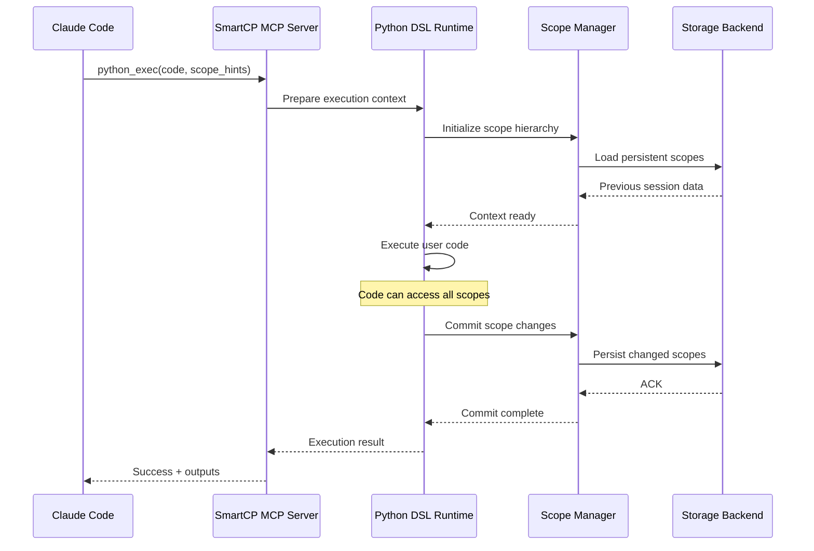

# SmartCP Python DSL Specification v1.0

**Status**: Draft Specification
**Created**: 2025-11-30
**Purpose**: Complete technical specification for the SmartCP MCP Server Python DSL execution environment

---

## Table of Contents

1. [Executive Summary](#1-executive-summary)
2. [Architecture Overview](#2-architecture-overview)
3. [Scoped Variable Persistence System](#3-scoped-variable-persistence-system)
4. [Background Execution System](#4-background-execution-system)
5. [Generified Type System and Contracts](#5-generified-type-system-and-contracts)
6. [DSL Extension Storage (CRUD)](#6-dsl-extension-storage-crud)
7. [Scope Markers (Fixture System)](#7-scope-markers-fixture-system)
8. [Async/Sync and Parallel Management](#8-asyncsync-and-parallel-management)
9. [Tool Discovery and Installation](#9-tool-discovery-and-installation)
10. [Error Handling](#10-error-handling)
11. [Security Considerations](#11-security-considerations)
12. [Storage Schema](#12-storage-schema)
13. [Example Workflows](#13-example-workflows)
14. [Implementation Roadmap](#14-implementation-roadmap)

---

## 1. Executive Summary

### 1.1 Vision

SmartCP provides a **persistent, stateful Python execution environment** exposed primarily via the `python_exec` MCP tool. Unlike traditional code execution sandboxes, SmartCP maintains sophisticated scope hierarchies, supports background task execution, and allows dynamic extension of the DSL itself.

### 1.2 Core Capabilities

- **Multi-level scope persistence**: From ephemeral block scope to permanent cross-session storage
- **Shell-like background execution**: `bg(task)` / `await_result(handle)` pattern
- **First-class MCP primitives**: Tools, Resources, Prompts as typed values
- **Live DSL extension**: Create functions/classes/tools that persist at defined scopes
- **Transparent async/sync interop**: Natural mixing of async and sync code
- **Dynamic tool installation**: Discover, install, and live-load tools programmatically

### 1.3 Design Principles

1. **Principle of Least Surprise**: Pythonic APIs that feel natural
2. **Progressive Enhancement**: Simple use cases simple, complex use cases possible
3. **Explicit Scope Control**: Developers choose persistence level explicitly
4. **Safety by Default**: Sandbox isolation, resource limits, secure-by-default
5. **Observability**: Clear introspection, logging, and debugging capabilities

---

## 2. Architecture Overview

### 2.1 System Layers

```
┌─────────────────────────────────────────────────────────────┐
│                    Claude Code / CLI Agent                   │
└─────────────────────────────────────────────────────────────┘
                             │
                             ▼
┌─────────────────────────────────────────────────────────────┐
│              MCP Protocol (stdio/SSE/HTTP)                   │
└─────────────────────────────────────────────────────────────┘
                             │
                             ▼
┌─────────────────────────────────────────────────────────────┐
│         SmartCP MCP Server (FastMCP + Extensions)            │
│  ┌──────────────────────────────────────────────────────┐   │
│  │  python_exec Tool Handler                            │   │
│  │  - Argument validation                               │   │
│  │  - Scope context preparation                         │   │
│  │  - Security policy enforcement                       │   │
│  └──────────────────────────────────────────────────────┘   │
└─────────────────────────────────────────────────────────────┘
                             │
                             ▼
┌─────────────────────────────────────────────────────────────┐
│               Python DSL Runtime Environment                 │
│  ┌──────────────────────────────────────────────────────┐   │
│  │  Scope Manager                                       │   │
│  │  - Scope hierarchy (5 levels)                        │   │
│  │  - contextvars integration                           │   │
│  │  - Lifecycle management                              │   │
│  ├──────────────────────────────────────────────────────┤   │
│  │  Background Task Manager                             │   │
│  │  - Task spawning/cancellation                        │   │
│  │  - Progress tracking                                 │   │
│  │  - Resource limits                                   │   │
│  ├──────────────────────────────────────────────────────┤   │
│  │  Type System                                         │   │
│  │  - MCP primitive types                               │   │
│  │  - Runtime validation                                │   │
│  │  - Protocol contracts                                │   │
│  ├──────────────────────────────────────────────────────┤   │
│  │  Extension Registry                                  │   │
│  │  - Function/class/tool CRUD                          │   │
│  │  - Scope-aware storage                               │   │
│  │  - Auto-loading                                      │   │
│  ├──────────────────────────────────────────────────────┤   │
│  │  Async Bridge                                        │   │
│  │  - Sync-to-async conversion                          │   │
│  │  - Event loop management                             │   │
│  │  - Deadlock detection                                │   │
│  ├──────────────────────────────────────────────────────┤   │
│  │  Tool Discovery Service                              │   │
│  │  - Registry search                                   │   │
│  │  - Installation pipeline                             │   │
│  │  - Dependency resolution                             │   │
│  └──────────────────────────────────────────────────────┘   │
└─────────────────────────────────────────────────────────────┘
                             │
                             ▼
┌─────────────────────────────────────────────────────────────┐
│                   Storage Backends                           │
│  - SQLite (session/permanent scopes)                         │
│  - Redis (shared session cache)                              │
│  - Filesystem (tool packages, extensions)                    │
└─────────────────────────────────────────────────────────────┘
```

### 2.2 Execution Flow



### 2.3 Key Components

#### 2.3.1 Scope Manager
- **Responsibility**: Manage 5-level scope hierarchy
- **Technology**: Python `contextvars` + custom context managers
- **Storage**: In-memory + SQLite + Redis

#### 2.3.2 Background Task Manager
- **Responsibility**: Shell-like background execution
- **Technology**: asyncio tasks + weak references
- **Limits**: Max concurrent tasks, memory per task, timeout

#### 2.3.3 Type System
- **Responsibility**: MCP primitive types + validation
- **Technology**: Pydantic models + runtime protocols
- **Features**: Generic containers, type inference

#### 2.3.4 Extension Registry
- **Responsibility**: CRUD for DSL extensions
- **Technology**: Dynamic imports + AST manipulation
- **Storage**: Filesystem + metadata DB

#### 2.3.5 Async Bridge
- **Responsibility**: Transparent async/sync interop
- **Technology**: asyncio + threading
- **Features**: Automatic await, deadlock detection

#### 2.3.6 Tool Discovery Service
- **Responsibility**: Find and install tools
- **Technology**: PyPI integration + local registry
- **Features**: Semantic search, dependency resolution

---

## 3. Scoped Variable Persistence System

### 3.1 Scope Hierarchy

The DSL provides **5 levels of scope**, from most ephemeral to most persistent:

| Scope Level | Lifetime | Use Case | Storage Backend |
|-------------|----------|----------|-----------------|
| **Block** | Single code block execution | Temporary calculations | In-memory only |
| **Tool Call** | Single `python_exec` invocation | Tool call state | In-memory only |
| **Prompt Chain** | Multiple tool calls in same prompt | Conversation context | In-memory + TTL cache |
| **Session** | User session (hours/days) | User preferences, working data | SQLite |
| **Permanent** | Forever (user's permanent storage) | Custom functions, datasets | SQLite + Filesystem |

### 3.2 API Design

#### 3.2.1 Implicit Scope (Default)

By default, variables follow **tool call scope**:

```python
# Executed in first python_exec call
x = 42  # Tool call scope (dies after this invocation)
print(x)  # 42
```

```python
# Executed in second python_exec call (different invocation)
print(x)  # NameError: x not defined
```

#### 3.2.2 Explicit Scope Declaration

**Using decorators (for functions/classes):**

```python
from smartcp import scope

@scope.session
def calculate_user_preference(data):
    """This function persists for the session."""
    return analyze(data)

# Now callable across tool calls within session
result = calculate_user_preference(my_data)
```

**Using context managers (for variables):**

```python
from smartcp import scope

with scope.prompt_chain:
    conversation_history = []

# conversation_history persists across tool calls in this prompt chain
```

**Using explicit functions:**

```python
from smartcp import scope

# Store in session scope
scope.session.set('user_theme', 'dark')

# Retrieve (returns None if not found)
theme = scope.session.get('user_theme')

# Store in permanent scope
scope.permanent.set('custom_dataset', large_dataframe)
```

#### 3.2.3 Scope Promotion/Demotion

```python
from smartcp import scope

# Variable starts in tool call scope
temp_data = fetch_data()

# Promote to session scope
scope.promote(temp_data, to='session', name='cached_data')

# Later, retrieve
cached = scope.session.get('cached_data')

# Demote (move to lower scope, triggering earlier cleanup)
scope.demote(cached, to='tool_call')
```

#### 3.2.4 Automatic Cleanup

```python
from smartcp import scope

# Explicit cleanup
scope.session.clear('old_key')

# Cleanup all in scope
scope.session.clear_all()

# Automatic TTL (prompt chain scope)
with scope.prompt_chain.ttl(seconds=300):
    temp_cache = expensive_computation()
# Automatically garbage collected after 5 minutes
```

### 3.3 Implementation Details

#### 3.3.1 Context Variable Integration

```python
# Internal implementation (simplified)
import contextvars
from typing import Any, Optional

# Global scope registry
_SCOPE_REGISTRY = {
    'block': contextvars.ContextVar('block_scope', default={}),
    'tool_call': contextvars.ContextVar('tool_call_scope', default={}),
    'prompt_chain': contextvars.ContextVar('prompt_chain_scope', default={}),
    'session': contextvars.ContextVar('session_scope', default={}),
    'permanent': contextvars.ContextVar('permanent_scope', default={}),
}

class ScopeManager:
    """Manage scoped variable storage."""

    def __init__(self, level: str):
        self.level = level
        self._context_var = _SCOPE_REGISTRY[level]
        self._storage = self._get_storage_backend(level)

    def set(self, key: str, value: Any) -> None:
        """Store a value in this scope."""
        current = self._context_var.get().copy()
        current[key] = value
        self._context_var.set(current)

        # Persist to backend if needed
        if self._needs_persistence():
            self._storage.save(key, value)

    def get(self, key: str, default: Any = None) -> Any:
        """Retrieve a value from this scope."""
        current = self._context_var.get()
        if key in current:
            return current[key]

        # Try backend
        if self._needs_persistence():
            return self._storage.load(key, default)

        return default

    def _needs_persistence(self) -> bool:
        return self.level in {'session', 'permanent'}

    def _get_storage_backend(self, level: str):
        if level == 'session':
            return SessionStorageBackend()
        elif level == 'permanent':
            return PermanentStorageBackend()
        return None
```

#### 3.3.2 Storage Backends

**Session Storage (SQLite)**:

```python
import sqlite3
import pickle
from pathlib import Path

class SessionStorageBackend:
    """Persist session-scoped variables to SQLite."""

    def __init__(self, session_id: str):
        self.session_id = session_id
        self.db_path = Path.home() / "MCPs" / "smartcp" / "sessions.db"
        self._init_db()

    def _init_db(self):
        with sqlite3.connect(self.db_path) as conn:
            conn.execute("""
                CREATE TABLE IF NOT EXISTS session_vars (
                    session_id TEXT NOT NULL,
                    key TEXT NOT NULL,
                    value BLOB NOT NULL,
                    created_at TIMESTAMP DEFAULT CURRENT_TIMESTAMP,
                    updated_at TIMESTAMP DEFAULT CURRENT_TIMESTAMP,
                    PRIMARY KEY (session_id, key)
                )
            """)
            conn.execute("""
                CREATE INDEX IF NOT EXISTS idx_session_id
                ON session_vars(session_id)
            """)

    def save(self, key: str, value: Any):
        pickled = pickle.dumps(value)
        with sqlite3.connect(self.db_path) as conn:
            conn.execute("""
                INSERT OR REPLACE INTO session_vars (session_id, key, value, updated_at)
                VALUES (?, ?, ?, CURRENT_TIMESTAMP)
            """, (self.session_id, key, pickled))

    def load(self, key: str, default: Any = None) -> Any:
        with sqlite3.connect(self.db_path) as conn:
            cursor = conn.execute("""
                SELECT value FROM session_vars
                WHERE session_id = ? AND key = ?
            """, (self.session_id, key))
            row = cursor.fetchone()
            if row:
                return pickle.loads(row[0])
            return default

    def clear(self, key: str):
        with sqlite3.connect(self.db_path) as conn:
            conn.execute("""
                DELETE FROM session_vars
                WHERE session_id = ? AND key = ?
            """, (self.session_id, key))

    def clear_all(self):
        with sqlite3.connect(self.db_path) as conn:
            conn.execute("""
                DELETE FROM session_vars
                WHERE session_id = ?
            """, (self.session_id,))
```

**Permanent Storage (SQLite + Filesystem)**:

```python
class PermanentStorageBackend:
    """Persist permanent-scoped variables forever."""

    def __init__(self, user_id: str):
        self.user_id = user_id
        self.db_path = Path.home() / "MCPs" / "smartcp" / "permanent.db"
        self.fs_path = Path.home() / "MCPs" / "smartcp" / "permanent_data"
        self._init_db()
        self.fs_path.mkdir(parents=True, exist_ok=True)

    def _init_db(self):
        with sqlite3.connect(self.db_path) as conn:
            conn.execute("""
                CREATE TABLE IF NOT EXISTS permanent_vars (
                    user_id TEXT NOT NULL,
                    key TEXT NOT NULL,
                    value_type TEXT NOT NULL,  -- 'inline' or 'filesystem'
                    value BLOB,  -- NULL if filesystem
                    fs_path TEXT,  -- NULL if inline
                    created_at TIMESTAMP DEFAULT CURRENT_TIMESTAMP,
                    updated_at TIMESTAMP DEFAULT CURRENT_TIMESTAMP,
                    PRIMARY KEY (user_id, key)
                )
            """)

    def save(self, key: str, value: Any):
        # Large objects go to filesystem
        pickled = pickle.dumps(value)
        if len(pickled) > 1_000_000:  # 1MB threshold
            fs_file = self.fs_path / f"{self.user_id}_{key}.pkl"
            fs_file.write_bytes(pickled)
            with sqlite3.connect(self.db_path) as conn:
                conn.execute("""
                    INSERT OR REPLACE INTO permanent_vars
                    (user_id, key, value_type, fs_path, updated_at)
                    VALUES (?, ?, 'filesystem', ?, CURRENT_TIMESTAMP)
                """, (self.user_id, key, str(fs_file)))
        else:
            with sqlite3.connect(self.db_path) as conn:
                conn.execute("""
                    INSERT OR REPLACE INTO permanent_vars
                    (user_id, key, value_type, value, updated_at)
                    VALUES (?, ?, 'inline', ?, CURRENT_TIMESTAMP)
                """, (self.user_id, key, pickled))

    def load(self, key: str, default: Any = None) -> Any:
        with sqlite3.connect(self.db_path) as conn:
            cursor = conn.execute("""
                SELECT value_type, value, fs_path FROM permanent_vars
                WHERE user_id = ? AND key = ?
            """, (self.user_id, key))
            row = cursor.fetchone()
            if not row:
                return default

            value_type, value_blob, fs_path = row
            if value_type == 'filesystem':
                return pickle.loads(Path(fs_path).read_bytes())
            else:
                return pickle.loads(value_blob)
```

#### 3.3.3 Garbage Collection

```python
import asyncio
from datetime import datetime, timedelta

class ScopeGarbageCollector:
    """Periodic cleanup of expired scopes."""

    def __init__(self, interval: int = 300):  # 5 minutes
        self.interval = interval
        self._task: Optional[asyncio.Task] = None

    async def start(self):
        """Start background GC task."""
        self._task = asyncio.create_task(self._gc_loop())

    async def stop(self):
        """Stop background GC task."""
        if self._task:
            self._task.cancel()
            try:
                await self._task
            except asyncio.CancelledError:
                pass

    async def _gc_loop(self):
        """Periodic garbage collection."""
        while True:
            await asyncio.sleep(self.interval)
            await self._collect_expired_sessions()
            await self._collect_expired_prompt_chains()

    async def _collect_expired_sessions(self):
        """Remove sessions older than 7 days."""
        cutoff = datetime.now() - timedelta(days=7)
        with sqlite3.connect(SESSION_DB_PATH) as conn:
            conn.execute("""
                DELETE FROM session_vars
                WHERE updated_at < ?
            """, (cutoff,))

    async def _collect_expired_prompt_chains(self):
        """Clear prompt chain scope cache (Redis TTL handles most)."""
        # Redis TTL auto-expires, but clean up any orphans
        pass
```

---

## 4. Background Execution System

### 4.1 Design Goals

- **Shell-like UX**: Familiar `bg(task)` / `await_result(handle)` pattern
- **Strong references**: Handles prevent premature GC
- **Progress tracking**: Query task status without blocking
- **Resource limits**: Max concurrent tasks, per-task memory/CPU
- **Error propagation**: Exceptions accessible via handle

### 4.2 API Design

#### 4.2.1 Background Task Spawning

```python
from smartcp import bg, await_result, bg_status, bg_cancel, bg_list

async def expensive_computation(n: int) -> int:
    await asyncio.sleep(n)
    return n * n

# Spawn background task
handle = bg(expensive_computation(10))
print(f"Task {handle.id} started in background")

# Continue with other work
do_other_things()

# Check status
status = bg_status(handle)
print(status)  # {'id': 'task-abc123', 'state': 'running', 'progress': 0.5}

# Wait for result (blocks until complete)
result = await_result(handle)
print(result)  # 100
```

#### 4.2.2 Background Task Management

```python
# List all background tasks
tasks = bg_list()
for task in tasks:
    print(f"{task.id}: {task.state} - {task.description}")

# Cancel a task
bg_cancel(handle)

# Cancel all tasks
bg_cancel_all()

# Wait for multiple tasks
results = await_all([handle1, handle2, handle3])
```

#### 4.2.3 Progress Reporting

```python
async def long_task_with_progress(items: list) -> list:
    """Task that reports progress."""
    results = []
    total = len(items)

    for i, item in enumerate(items):
        result = await process(item)
        results.append(result)

        # Report progress (special DSL function)
        report_progress(i / total, message=f"Processed {i}/{total}")

    return results

# Spawn with progress tracking
handle = bg(long_task_with_progress(data))

# Poll progress
while not handle.is_done():
    status = bg_status(handle)
    print(f"Progress: {status.progress * 100:.1f}% - {status.message}")
    await asyncio.sleep(1)

result = await_result(handle)
```

#### 4.2.4 Error Handling

```python
async def failing_task():
    raise ValueError("Something went wrong")

handle = bg(failing_task())

# Check for errors
status = bg_status(handle)
if status.state == 'failed':
    print(f"Task failed: {status.error}")

# await_result re-raises the exception
try:
    result = await_result(handle)
except ValueError as e:
    print(f"Caught error: {e}")
```

### 4.3 Implementation Details

#### 4.3.1 Task Handle Design

```python
from dataclasses import dataclass
from typing import Any, Optional, Callable, Awaitable
from enum import Enum
import uuid
import asyncio
import weakref

class TaskState(Enum):
    PENDING = "pending"
    RUNNING = "running"
    COMPLETED = "completed"
    FAILED = "failed"
    CANCELLED = "cancelled"

@dataclass
class TaskHandle:
    """Strong reference to a background task."""

    id: str
    description: str
    state: TaskState
    progress: float  # 0.0 to 1.0
    message: str
    result: Optional[Any]
    error: Optional[Exception]
    _task: asyncio.Task

    def is_done(self) -> bool:
        return self.state in {TaskState.COMPLETED, TaskState.FAILED, TaskState.CANCELLED}

    def cancel(self):
        """Cancel the task."""
        if not self.is_done():
            self._task.cancel()
            self.state = TaskState.CANCELLED

class BackgroundTaskManager:
    """Manage background task execution."""

    def __init__(self, max_concurrent: int = 10):
        self.max_concurrent = max_concurrent
        self._tasks: dict[str, TaskHandle] = {}
        self._semaphore = asyncio.Semaphore(max_concurrent)
        self._progress_store: dict[str, tuple[float, str]] = {}

    def spawn(
        self,
        coro: Awaitable[Any],
        description: str = ""
    ) -> TaskHandle:
        """Spawn a background task."""
        if len(self._tasks) >= self.max_concurrent:
            raise RuntimeError(f"Max concurrent tasks ({self.max_concurrent}) reached")

        task_id = str(uuid.uuid4())

        # Wrap coroutine with progress tracking and error handling
        async def _wrapped():
            async with self._semaphore:
                handle = self._tasks[task_id]
                handle.state = TaskState.RUNNING

                try:
                    result = await coro
                    handle.result = result
                    handle.state = TaskState.COMPLETED
                    handle.progress = 1.0
                    return result
                except asyncio.CancelledError:
                    handle.state = TaskState.CANCELLED
                    raise
                except Exception as e:
                    handle.error = e
                    handle.state = TaskState.FAILED
                    raise
                finally:
                    # Cleanup progress store
                    self._progress_store.pop(task_id, None)

        task = asyncio.create_task(_wrapped())

        handle = TaskHandle(
            id=task_id,
            description=description or str(coro),
            state=TaskState.PENDING,
            progress=0.0,
            message="",
            result=None,
            error=None,
            _task=task,
        )

        self._tasks[task_id] = handle
        return handle

    def status(self, handle: TaskHandle) -> TaskHandle:
        """Get current status of a task."""
        # Update progress from store
        if handle.id in self._progress_store:
            progress, message = self._progress_store[handle.id]
            handle.progress = progress
            handle.message = message

        return handle

    async def await_result(self, handle: TaskHandle) -> Any:
        """Wait for task completion and return result."""
        try:
            return await handle._task
        except Exception:
            # Task already stored the exception in handle.error
            raise

    def cancel(self, handle: TaskHandle):
        """Cancel a task."""
        handle.cancel()
        self._tasks.pop(handle.id, None)

    def list_all(self) -> list[TaskHandle]:
        """List all background tasks."""
        return list(self._tasks.values())

    def cancel_all(self):
        """Cancel all background tasks."""
        for handle in list(self._tasks.values()):
            self.cancel(handle)

    def report_progress(self, progress: float, message: str = ""):
        """Report progress from within a task (context-aware)."""
        # Find task ID from current asyncio context
        task = asyncio.current_task()
        if not task:
            return

        # Find handle by task object
        for task_id, handle in self._tasks.items():
            if handle._task == task:
                self._progress_store[task_id] = (progress, message)
                break

# Global instance
_bg_manager = BackgroundTaskManager()

def bg(coro: Awaitable[Any], description: str = "") -> TaskHandle:
    """Spawn a background task."""
    return _bg_manager.spawn(coro, description)

def await_result(handle: TaskHandle) -> Any:
    """Wait for task result."""
    return asyncio.run(_bg_manager.await_result(handle))

def bg_status(handle: TaskHandle) -> TaskHandle:
    """Get task status."""
    return _bg_manager.status(handle)

def bg_cancel(handle: TaskHandle):
    """Cancel a task."""
    _bg_manager.cancel(handle)

def bg_list() -> list[TaskHandle]:
    """List all tasks."""
    return _bg_manager.list_all()

def bg_cancel_all():
    """Cancel all tasks."""
    _bg_manager.cancel_all()

def report_progress(progress: float, message: str = ""):
    """Report progress from within a task."""
    _bg_manager.report_progress(progress, message)
```

#### 4.3.2 Resource Limits

```python
import resource
import psutil

class ResourceLimiter:
    """Enforce resource limits on background tasks."""

    def __init__(
        self,
        max_memory_mb: int = 512,
        max_cpu_percent: int = 50,
        timeout_seconds: int = 300,
    ):
        self.max_memory_mb = max_memory_mb
        self.max_cpu_percent = max_cpu_percent
        self.timeout_seconds = timeout_seconds

    async def enforce_limits(self, task: asyncio.Task):
        """Monitor task and enforce limits."""
        start_time = asyncio.get_event_loop().time()
        process = psutil.Process()

        while not task.done():
            # Check timeout
            elapsed = asyncio.get_event_loop().time() - start_time
            if elapsed > self.timeout_seconds:
                task.cancel()
                raise TimeoutError(f"Task exceeded {self.timeout_seconds}s timeout")

            # Check memory
            memory_mb = process.memory_info().rss / 1024 / 1024
            if memory_mb > self.max_memory_mb:
                task.cancel()
                raise MemoryError(f"Task exceeded {self.max_memory_mb}MB memory limit")

            # Check CPU (averaged over last second)
            cpu_percent = process.cpu_percent(interval=1.0)
            if cpu_percent > self.max_cpu_percent:
                # Just warn, don't kill (spiky CPU is normal)
                logger.warning(f"Task using {cpu_percent}% CPU")

            await asyncio.sleep(1)
```

---

## 5. Generified Type System and Contracts

### 5.1 MCP Primitive Types

SmartCP defines **first-class types** for MCP primitives:

```python
from typing import Protocol, TypeVar, Generic, runtime_checkable
from pydantic import BaseModel

# Core MCP types
class Tool(BaseModel):
    """MCP Tool primitive."""
    name: str
    description: str
    input_schema: dict

    async def __call__(self, **kwargs):
        """Invoke the tool."""
        return await call_mcp_tool(self.name, kwargs)

class Resource(BaseModel):
    """MCP Resource primitive."""
    uri: str
    name: str
    mimeType: Optional[str] = None

    async def read(self) -> str:
        """Read resource content."""
        return await read_mcp_resource(self.uri)

class Prompt(BaseModel):
    """MCP Prompt primitive."""
    name: str
    description: str
    arguments: list[dict]

    async def render(self, **kwargs) -> str:
        """Render prompt with arguments."""
        return await render_mcp_prompt(self.name, kwargs)

class Context(BaseModel):
    """MCP execution context."""
    user_id: str
    session_id: str
    workspace_id: Optional[str] = None
    metadata: dict = {}
```

### 5.2 Generic Containers

```python
from typing import TypeVar, Generic

T = TypeVar('T')

class ToolList(Generic[T]):
    """Type-safe list of tools."""

    def __init__(self, items: list[T]):
        self._items = items

    def filter(self, predicate: Callable[[T], bool]) -> 'ToolList[T]':
        """Filter tools by predicate."""
        return ToolList([item for item in self._items if predicate(item)])

    def map(self, fn: Callable[[T], Any]) -> list[Any]:
        """Map function over tools."""
        return [fn(item) for item in self._items]

    async def invoke_all(self, **kwargs) -> list[Any]:
        """Invoke all tools in parallel."""
        return await asyncio.gather(*[item(**kwargs) for item in self._items])

# Usage
tools: ToolList[Tool] = ToolList([tool1, tool2, tool3])
matching = tools.filter(lambda t: 'search' in t.name)
results = await matching.invoke_all(query="test")
```

### 5.3 Protocol-Based Contracts

```python
@runtime_checkable
class Executable(Protocol):
    """Protocol for executable tools."""

    async def __call__(self, **kwargs) -> Any:
        ...

@runtime_checkable
class Readable(Protocol):
    """Protocol for readable resources."""

    async def read(self) -> str:
        ...

@runtime_checkable
class Cacheable(Protocol):
    """Protocol for cacheable objects."""

    def cache_key(self) -> str:
        ...

    def to_cache(self) -> bytes:
        ...

    @classmethod
    def from_cache(cls, data: bytes) -> 'Cacheable':
        ...

# Runtime validation
def execute_if_possible(obj: Any, **kwargs):
    if isinstance(obj, Executable):
        return asyncio.run(obj(**kwargs))
    else:
        raise TypeError(f"{obj} is not executable")
```

### 5.4 Runtime Type Validation

```python
from typing import get_type_hints
import inspect

class TypeValidator:
    """Runtime type validation for function arguments."""

    @staticmethod
    def validate_call(func: Callable, **kwargs):
        """Validate function call arguments against type hints."""
        hints = get_type_hints(func)

        for arg_name, arg_value in kwargs.items():
            if arg_name not in hints:
                continue

            expected_type = hints[arg_name]
            if not isinstance(arg_value, expected_type):
                raise TypeError(
                    f"Argument '{arg_name}' expected {expected_type}, "
                    f"got {type(arg_value)}"
                )

    @staticmethod
    def validate_return(func: Callable, result: Any):
        """Validate function return value against type hint."""
        hints = get_type_hints(func)
        if 'return' not in hints:
            return

        expected_type = hints['return']
        if not isinstance(result, expected_type):
            raise TypeError(
                f"Return value expected {expected_type}, got {type(result)}"
            )

# Decorator for automatic validation
def typed(func):
    """Decorator for runtime type checking."""
    @wraps(func)
    async def wrapper(**kwargs):
        TypeValidator.validate_call(func, **kwargs)
        result = await func(**kwargs)
        TypeValidator.validate_return(func, result)
        return result
    return wrapper
```

### 5.5 Type Inference from Tool Schemas

```python
class SchemaInferrer:
    """Infer Python types from JSON Schema."""

    @staticmethod
    def infer_type(schema: dict) -> type:
        """Convert JSON Schema to Python type."""
        schema_type = schema.get('type')

        if schema_type == 'string':
            return str
        elif schema_type == 'integer':
            return int
        elif schema_type == 'number':
            return float
        elif schema_type == 'boolean':
            return bool
        elif schema_type == 'array':
            item_type = SchemaInferrer.infer_type(schema.get('items', {}))
            return list[item_type]
        elif schema_type == 'object':
            # Create a dynamic Pydantic model
            properties = schema.get('properties', {})
            fields = {
                name: (SchemaInferrer.infer_type(prop), ...)
                for name, prop in properties.items()
            }
            return type('DynamicModel', (BaseModel,), {'__annotations__': fields})
        else:
            return Any

    @staticmethod
    def create_typed_tool(tool_spec: dict) -> Callable:
        """Create a typed tool wrapper from MCP tool spec."""
        input_schema = tool_spec.get('input_schema', {})
        properties = input_schema.get('properties', {})

        # Generate type hints
        hints = {
            name: SchemaInferrer.infer_type(prop)
            for name, prop in properties.items()
        }

        async def tool_wrapper(**kwargs):
            # Validate arguments
            for arg_name, arg_value in kwargs.items():
                if arg_name in hints:
                    expected_type = hints[arg_name]
                    if not isinstance(arg_value, expected_type):
                        raise TypeError(
                            f"Argument '{arg_name}' expected {expected_type}"
                        )

            return await call_mcp_tool(tool_spec['name'], kwargs)

        # Attach type hints
        tool_wrapper.__annotations__ = hints
        return tool_wrapper
```

---

## 6. DSL Extension Storage (CRUD)

### 6.1 Design Goals

- **Natural Python syntax**: Define extensions like normal Python code
- **Scope-aware storage**: Extensions live at defined scope levels
- **Automatic versioning**: Track changes to extensions
- **Discovery**: Query and introspect extensions
- **Auto-loading**: Extensions load automatically based on scope

### 6.2 API Design

#### 6.2.1 Creating Extensions

```python
from smartcp import scope, extension

# Define a session-scoped function
@scope.session
def my_helper(x: int) -> int:
    """Helper function that persists for session."""
    return x * 2

# Define a permanent tool
@scope.permanent
@extension.tool(
    description="Convert text to uppercase",
    input_schema={
        "type": "object",
        "properties": {
            "text": {"type": "string"}
        },
        "required": ["text"]
    }
)
async def to_uppercase(text: str) -> str:
    """Convert text to uppercase."""
    return text.upper()

# Define a permanent class
@scope.permanent
class DataProcessor:
    """Custom data processor."""

    def __init__(self, config: dict):
        self.config = config

    def process(self, data):
        return transform(data, self.config)
```

#### 6.2.2 Reading Extensions

```python
from smartcp import extension

# List all extensions in scope
exts = extension.list(scope='session')
for ext in exts:
    print(f"{ext.name} ({ext.type}): {ext.description}")

# Get specific extension
func = extension.get('my_helper', scope='session')
result = func(42)  # 84

# Search extensions
matches = extension.search(query='uppercase', scope='permanent')
```

#### 6.2.3 Updating Extensions

```python
from smartcp import extension

# Update function (creates new version)
@scope.session
def my_helper(x: int) -> int:
    """Updated version with different logic."""
    return x * 3

# Explicit version management
extension.update('my_helper', new_code="""
def my_helper(x: int) -> int:
    return x * 4
""", scope='session')

# Rollback to previous version
extension.rollback('my_helper', version=1, scope='session')
```

#### 6.2.4 Deleting Extensions

```python
from smartcp import extension

# Delete extension
extension.delete('my_helper', scope='session')

# Delete all in scope
extension.delete_all(scope='session')

# Soft delete (mark as inactive but keep in storage)
extension.soft_delete('my_helper', scope='session')
```

### 6.3 Implementation Details

#### 6.3.1 Extension Registry

```python
from dataclasses import dataclass
from datetime import datetime
import ast
import inspect

@dataclass
class Extension:
    """Metadata for a DSL extension."""
    name: str
    type: str  # 'function', 'class', 'tool'
    scope: str
    description: str
    source_code: str
    version: int
    created_at: datetime
    updated_at: datetime
    active: bool

class ExtensionRegistry:
    """Manage DSL extensions."""

    def __init__(self):
        self._storage = ExtensionStorageBackend()
        self._loaded_extensions: dict[str, dict[str, Any]] = {}

    def create(
        self,
        name: str,
        obj: Any,
        scope: str,
        description: str = ""
    ) -> Extension:
        """Create a new extension."""
        # Extract source code
        if inspect.isfunction(obj):
            source = inspect.getsource(obj)
            ext_type = 'function'
        elif inspect.isclass(obj):
            source = inspect.getsource(obj)
            ext_type = 'class'
        else:
            raise TypeError(f"Cannot create extension from {type(obj)}")

        # Check if extension already exists
        existing = self._storage.load(name, scope)
        version = existing.version + 1 if existing else 1

        # Create extension record
        ext = Extension(
            name=name,
            type=ext_type,
            scope=scope,
            description=description or inspect.getdoc(obj) or "",
            source_code=source,
            version=version,
            created_at=datetime.now(),
            updated_at=datetime.now(),
            active=True,
        )

        # Save to storage
        self._storage.save(ext)

        # Load into runtime
        self._load_extension(ext)

        return ext

    def get(self, name: str, scope: str) -> Optional[Any]:
        """Get a loaded extension."""
        key = f"{scope}:{name}"
        if key in self._loaded_extensions:
            return self._loaded_extensions[key]['obj']

        # Try to load from storage
        ext = self._storage.load(name, scope)
        if ext and ext.active:
            self._load_extension(ext)
            return self._loaded_extensions[key]['obj']

        return None

    def list(self, scope: str) -> list[Extension]:
        """List all extensions in scope."""
        return self._storage.list_by_scope(scope)

    def search(self, query: str, scope: str) -> list[Extension]:
        """Search extensions by query."""
        all_exts = self.list(scope)
        query_lower = query.lower()

        return [
            ext for ext in all_exts
            if query_lower in ext.name.lower()
            or query_lower in ext.description.lower()
        ]

    def update(self, name: str, new_code: str, scope: str) -> Extension:
        """Update extension source code."""
        existing = self._storage.load(name, scope)
        if not existing:
            raise ValueError(f"Extension '{name}' not found in {scope} scope")

        # Parse and validate new code
        tree = ast.parse(new_code)

        # Extract function/class definition
        obj = self._extract_from_ast(tree)

        # Create new version
        return self.create(name, obj, scope, existing.description)

    def delete(self, name: str, scope: str):
        """Delete extension."""
        self._storage.delete(name, scope)
        key = f"{scope}:{name}"
        self._loaded_extensions.pop(key, None)

    def soft_delete(self, name: str, scope: str):
        """Mark extension as inactive."""
        ext = self._storage.load(name, scope)
        if ext:
            ext.active = False
            self._storage.save(ext)
            key = f"{scope}:{name}"
            self._loaded_extensions.pop(key, None)

    def rollback(self, name: str, version: int, scope: str) -> Extension:
        """Rollback to previous version."""
        ext = self._storage.load_version(name, scope, version)
        if not ext:
            raise ValueError(f"Version {version} not found")

        # Re-activate this version
        ext.active = True
        ext.version = self._storage.get_next_version(name, scope)
        ext.updated_at = datetime.now()
        self._storage.save(ext)

        # Reload
        self._load_extension(ext)
        return ext

    def _load_extension(self, ext: Extension):
        """Load extension into runtime."""
        # Execute source code in isolated namespace
        namespace = {}
        exec(ext.source_code, namespace)

        # Find the defined object (function or class)
        obj = namespace.get(ext.name)
        if not obj:
            raise ValueError(f"Extension '{ext.name}' not found in source")

        # Store in loaded extensions
        key = f"{ext.scope}:{ext.name}"
        self._loaded_extensions[key] = {
            'obj': obj,
            'metadata': ext,
        }

        # Also store in scope manager for runtime access
        scope_manager = get_scope_manager(ext.scope)
        scope_manager.set(ext.name, obj)

    def _extract_from_ast(self, tree: ast.AST) -> Any:
        """Extract function/class definition from AST."""
        for node in ast.walk(tree):
            if isinstance(node, ast.FunctionDef):
                # Compile and execute
                code = compile(ast.Module(body=[node], type_ignores=[]), '<extension>', 'exec')
                namespace = {}
                exec(code, namespace)
                return namespace[node.name]
            elif isinstance(node, ast.ClassDef):
                code = compile(ast.Module(body=[node], type_ignores=[]), '<extension>', 'exec')
                namespace = {}
                exec(code, namespace)
                return namespace[node.name]

        raise ValueError("No function or class definition found")
```

#### 6.3.2 Extension Storage Backend

```python
class ExtensionStorageBackend:
    """Persist extensions to database."""

    def __init__(self):
        self.db_path = Path.home() / "MCPs" / "smartcp" / "extensions.db"
        self._init_db()

    def _init_db(self):
        with sqlite3.connect(self.db_path) as conn:
            conn.execute("""
                CREATE TABLE IF NOT EXISTS extensions (
                    name TEXT NOT NULL,
                    type TEXT NOT NULL,
                    scope TEXT NOT NULL,
                    description TEXT,
                    source_code TEXT NOT NULL,
                    version INTEGER NOT NULL,
                    created_at TIMESTAMP NOT NULL,
                    updated_at TIMESTAMP NOT NULL,
                    active BOOLEAN NOT NULL DEFAULT 1,
                    PRIMARY KEY (name, scope, version)
                )
            """)
            conn.execute("""
                CREATE INDEX IF NOT EXISTS idx_extensions_scope
                ON extensions(scope, active)
            """)

    def save(self, ext: Extension):
        with sqlite3.connect(self.db_path) as conn:
            conn.execute("""
                INSERT OR REPLACE INTO extensions
                (name, type, scope, description, source_code, version,
                 created_at, updated_at, active)
                VALUES (?, ?, ?, ?, ?, ?, ?, ?, ?)
            """, (
                ext.name, ext.type, ext.scope, ext.description,
                ext.source_code, ext.version, ext.created_at,
                ext.updated_at, ext.active
            ))

    def load(self, name: str, scope: str) -> Optional[Extension]:
        """Load latest active version."""
        with sqlite3.connect(self.db_path) as conn:
            cursor = conn.execute("""
                SELECT name, type, scope, description, source_code, version,
                       created_at, updated_at, active
                FROM extensions
                WHERE name = ? AND scope = ? AND active = 1
                ORDER BY version DESC
                LIMIT 1
            """, (name, scope))
            row = cursor.fetchone()
            if not row:
                return None

            return Extension(*row)

    def load_version(
        self,
        name: str,
        scope: str,
        version: int
    ) -> Optional[Extension]:
        """Load specific version."""
        with sqlite3.connect(self.db_path) as conn:
            cursor = conn.execute("""
                SELECT name, type, scope, description, source_code, version,
                       created_at, updated_at, active
                FROM extensions
                WHERE name = ? AND scope = ? AND version = ?
            """, (name, scope, version))
            row = cursor.fetchone()
            if not row:
                return None

            return Extension(*row)

    def list_by_scope(self, scope: str) -> list[Extension]:
        """List all active extensions in scope."""
        with sqlite3.connect(self.db_path) as conn:
            cursor = conn.execute("""
                SELECT name, type, scope, description, source_code, version,
                       created_at, updated_at, active
                FROM extensions
                WHERE scope = ? AND active = 1
                ORDER BY name, version DESC
            """, (scope,))

            # Deduplicate by name (keep latest version only)
            seen = set()
            results = []
            for row in cursor.fetchall():
                ext = Extension(*row)
                if ext.name not in seen:
                    results.append(ext)
                    seen.add(ext.name)

            return results

    def delete(self, name: str, scope: str):
        """Hard delete all versions."""
        with sqlite3.connect(self.db_path) as conn:
            conn.execute("""
                DELETE FROM extensions
                WHERE name = ? AND scope = ?
            """, (name, scope))

    def get_next_version(self, name: str, scope: str) -> int:
        """Get next version number."""
        with sqlite3.connect(self.db_path) as conn:
            cursor = conn.execute("""
                SELECT MAX(version) FROM extensions
                WHERE name = ? AND scope = ?
            """, (name, scope))
            row = cursor.fetchone()
            max_version = row[0] if row and row[0] else 0
            return max_version + 1
```

#### 6.3.3 Automatic Loading

```python
class ExtensionAutoLoader:
    """Automatically load extensions based on scope."""

    def __init__(self, registry: ExtensionRegistry):
        self.registry = registry

    async def load_for_execution(self, scope_hierarchy: list[str]):
        """Load all extensions for scope hierarchy.

        Args:
            scope_hierarchy: e.g., ['block', 'tool_call', 'session', 'permanent']
        """
        for scope_level in scope_hierarchy:
            extensions = self.registry.list(scope_level)
            for ext in extensions:
                # Load into runtime if not already loaded
                self.registry._load_extension(ext)
```

---

## 7. Scope Markers (Fixture System)

### 7.1 Design Goals

- **pytest-style fixtures**: Familiar decorator pattern
- **Dependency injection**: Fixtures provide values automatically
- **Setup/teardown hooks**: Resource management
- **Scope-aware**: Fixtures live at defined scopes

### 7.2 API Design

#### 7.2.1 Defining Fixtures

```python
from smartcp import fixture, scope

@fixture(scope='session')
def db_connection():
    """Session-scoped database connection."""
    conn = create_db_connection()
    yield conn
    conn.close()

@fixture(scope='tool_call')
async def temp_workspace():
    """Tool call-scoped temporary workspace."""
    workspace = create_temp_dir()
    yield workspace
    shutil.rmtree(workspace)

@fixture(scope='permanent')
def user_config():
    """Permanent user configuration."""
    return load_user_config()
```

#### 7.2.2 Using Fixtures

```python
from smartcp import use_fixture

@scope.session
def process_data(db_connection):
    """Function that uses db_connection fixture."""
    # db_connection is injected automatically
    return db_connection.query("SELECT * FROM data")

# Manual fixture usage
async def manual_example():
    workspace = await use_fixture('temp_workspace')
    # Use workspace
    # Teardown happens automatically when scope ends
```

#### 7.2.3 Fixture Dependencies

```python
@fixture(scope='session')
def db_config():
    """Configuration for database."""
    return {"host": "localhost", "port": 5432}

@fixture(scope='session')
def db_connection(db_config):  # Depends on db_config fixture
    """Database connection using config."""
    conn = create_connection(**db_config)
    yield conn
    conn.close()

@fixture(scope='tool_call')
def transaction(db_connection):  # Depends on db_connection fixture
    """Database transaction."""
    tx = db_connection.begin()
    yield tx
    tx.commit()
```

#### 7.2.4 Parametrized Fixtures

```python
@fixture(scope='tool_call', params=['sqlite', 'postgres', 'mysql'])
def db_backend(request):
    """Parametrized database backend."""
    backend = create_backend(request.param)
    yield backend
    backend.cleanup()

# Tests run for each parameter
def test_query(db_backend):
    # Runs 3 times: sqlite, postgres, mysql
    result = db_backend.query("SELECT 1")
    assert result
```

### 7.3 Implementation Details

#### 7.3.1 Fixture Registry

```python
from dataclasses import dataclass
from typing import Callable, Any, Optional
from contextlib import asynccontextmanager, contextmanager

@dataclass
class FixtureMetadata:
    """Metadata for a fixture."""
    name: str
    scope: str
    func: Callable
    dependencies: list[str]
    params: Optional[list[Any]]
    is_async: bool

class FixtureRegistry:
    """Manage fixtures."""

    def __init__(self):
        self._fixtures: dict[str, FixtureMetadata] = {}
        self._active_fixtures: dict[str, dict[str, Any]] = {}
        self._fixture_locks: dict[str, asyncio.Lock] = {}

    def register(
        self,
        name: str,
        func: Callable,
        scope: str,
        params: Optional[list[Any]] = None
    ):
        """Register a fixture."""
        # Analyze dependencies from function signature
        sig = inspect.signature(func)
        dependencies = [
            param for param in sig.parameters
            if param != 'request'  # 'request' is reserved for fixture metadata
        ]

        is_async = inspect.iscoroutinefunction(func)

        metadata = FixtureMetadata(
            name=name,
            scope=scope,
            func=func,
            dependencies=dependencies,
            params=params,
            is_async=is_async,
        )

        self._fixtures[name] = metadata
        self._fixture_locks[name] = asyncio.Lock()

    async def get(self, name: str, scope_level: str) -> Any:
        """Get fixture value, creating if needed."""
        # Check if already created at this scope
        key = f"{scope_level}:{name}"
        if key in self._active_fixtures:
            return self._active_fixtures[key]['value']

        # Create fixture
        metadata = self._fixtures.get(name)
        if not metadata:
            raise ValueError(f"Fixture '{name}' not found")

        # Check scope compatibility
        if not self._is_scope_compatible(metadata.scope, scope_level):
            raise ValueError(
                f"Fixture '{name}' has scope '{metadata.scope}' but requested at '{scope_level}'"
            )

        # Acquire lock to prevent concurrent creation
        async with self._fixture_locks[name]:
            # Double-check after acquiring lock
            if key in self._active_fixtures:
                return self._active_fixtures[key]['value']

            # Resolve dependencies
            dep_values = {}
            for dep_name in metadata.dependencies:
                dep_values[dep_name] = await self.get(dep_name, scope_level)

            # Create fixture value
            if metadata.is_async:
                if inspect.isasyncgenfunction(metadata.func):
                    # Async generator (yield style)
                    gen = metadata.func(**dep_values)
                    value = await gen.__anext__()
                    teardown = gen
                else:
                    # Regular async function
                    value = await metadata.func(**dep_values)
                    teardown = None
            else:
                if inspect.isgeneratorfunction(metadata.func):
                    # Generator (yield style)
                    gen = metadata.func(**dep_values)
                    value = next(gen)
                    teardown = gen
                else:
                    # Regular function
                    value = metadata.func(**dep_values)
                    teardown = None

            # Store active fixture
            self._active_fixtures[key] = {
                'value': value,
                'teardown': teardown,
                'metadata': metadata,
            }

            return value

    async def teardown(self, scope_level: str):
        """Teardown all fixtures at scope."""
        keys_to_remove = [
            key for key in self._active_fixtures
            if key.startswith(f"{scope_level}:")
        ]

        for key in keys_to_remove:
            fixture = self._active_fixtures[key]
            teardown = fixture['teardown']

            if teardown:
                try:
                    if inspect.isasyncgen(teardown):
                        await teardown.__anext__()
                    else:
                        next(teardown)
                except StopIteration:
                    pass
                except StopAsyncIteration:
                    pass
                except Exception as e:
                    logger.error(f"Error tearing down fixture {key}: {e}")

            del self._active_fixtures[key]

    def _is_scope_compatible(self, fixture_scope: str, request_scope: str) -> bool:
        """Check if fixture scope is compatible with request scope."""
        scope_hierarchy = ['block', 'tool_call', 'prompt_chain', 'session', 'permanent']
        fixture_level = scope_hierarchy.index(fixture_scope)
        request_level = scope_hierarchy.index(request_scope)

        # Fixture scope must be >= request scope (longer-lived)
        return fixture_level >= request_level

# Decorator
def fixture(scope: str = 'tool_call', params: Optional[list] = None):
    """Decorator to define a fixture."""
    def decorator(func):
        name = func.__name__
        _fixture_registry.register(name, func, scope, params)
        return func
    return decorator

async def use_fixture(name: str) -> Any:
    """Manually request a fixture."""
    # Determine current scope level from context
    current_scope = get_current_scope_level()
    return await _fixture_registry.get(name, current_scope)

# Global registry
_fixture_registry = FixtureRegistry()
```

#### 7.3.2 Automatic Dependency Injection

```python
import functools

def inject_fixtures(func):
    """Decorator to inject fixtures as function arguments."""
    sig = inspect.signature(func)

    @functools.wraps(func)
    async def wrapper(*args, **kwargs):
        # Identify fixture parameters (not already provided)
        fixture_params = {}
        for param_name in sig.parameters:
            if param_name not in kwargs:
                # Try to get fixture
                try:
                    current_scope = get_current_scope_level()
                    fixture_value = await _fixture_registry.get(param_name, current_scope)
                    fixture_params[param_name] = fixture_value
                except ValueError:
                    # Not a fixture, skip
                    pass

        # Call function with injected fixtures
        all_kwargs = {**kwargs, **fixture_params}

        if inspect.iscoroutinefunction(func):
            return await func(*args, **all_kwargs)
        else:
            return func(*args, **all_kwargs)

    return wrapper
```

---

## 8. Async/Sync and Parallel Management

### 8.1 Design Goals

- **Transparent interop**: Mix async and sync code naturally
- **Automatic await**: Detect and await coroutines
- **Parallel execution**: `gather()` equivalent with progress
- **Concurrency limits**: Semaphores, rate limiting
- **Deadlock detection**: Identify and report deadlocks

### 8.2 API Design

#### 8.2.1 Transparent Async/Sync Interop

```python
# Sync function calling async function (automatic)
def sync_caller():
    result = async_function()  # Automatically awaited
    return result

# Async function calling sync function (automatic)
async def async_caller():
    result = sync_function()  # Automatically works
    return result
```

#### 8.2.2 Parallel Execution

```python
from smartcp import parallel, gather

# Parallel execution with automatic gathering
results = await parallel([
    fetch_data(1),
    fetch_data(2),
    fetch_data(3),
])

# gather() with progress tracking
results = await gather(
    fetch_data(1),
    fetch_data(2),
    fetch_data(3),
    progress_callback=lambda done, total: print(f"{done}/{total}")
)

# map_parallel for lists
results = await map_parallel(
    fetch_data,
    [1, 2, 3, 4, 5],
    max_concurrency=2
)
```

#### 8.2.3 Concurrency Control

```python
from smartcp import semaphore, rate_limit

# Limit concurrent executions
@semaphore(max_concurrent=5)
async def limited_function(item):
    return await process(item)

# Rate limiting
@rate_limit(max_per_second=10)
async def api_call(endpoint):
    return await fetch(endpoint)

# Manual semaphore usage
async with semaphore(3):
    result = await expensive_operation()
```

#### 8.2.4 Deadlock Detection

```python
from smartcp import enable_deadlock_detection

# Enable deadlock detection
enable_deadlock_detection(timeout=30)

# Automatically detects and reports deadlocks
async def potential_deadlock():
    async with lock1:
        async with lock2:  # Deadlock detected after 30s
            await operation()
```

### 8.3 Implementation Details

#### 8.3.1 Async Bridge

```python
import asyncio
import threading
from functools import wraps

class AsyncBridge:
    """Bridge between sync and async code."""

    def __init__(self):
        self._loop: Optional[asyncio.AbstractEventLoop] = None
        self._thread: Optional[threading.Thread] = None
        self._started = False

    def start(self):
        """Start async event loop in background thread."""
        if self._started:
            return

        def _run_loop():
            self._loop = asyncio.new_event_loop()
            asyncio.set_event_loop(self._loop)
            self._loop.run_forever()

        self._thread = threading.Thread(target=_run_loop, daemon=True)
        self._thread.start()

        # Wait for loop to be ready
        while self._loop is None:
            threading.Event().wait(0.01)

        self._started = True

    def stop(self):
        """Stop async event loop."""
        if not self._started:
            return

        if self._loop:
            self._loop.call_soon_threadsafe(self._loop.stop)

        if self._thread:
            self._thread.join(timeout=5)

        self._started = False

    def run_async_from_sync(self, coro):
        """Run async code from sync context."""
        if not self._started:
            self.start()

        future = asyncio.run_coroutine_threadsafe(coro, self._loop)
        return future.result()

    def auto_await(self, obj):
        """Automatically await if coroutine."""
        if inspect.iscoroutine(obj):
            # Check if we're in async context
            try:
                asyncio.current_task()
                # Already in async context, just return
                return obj
            except RuntimeError:
                # Not in async context, need to run in event loop
                return self.run_async_from_sync(obj)
        return obj

# Global bridge instance
_async_bridge = AsyncBridge()

def auto_async(func):
    """Decorator for automatic async/sync interop."""
    @wraps(func)
    def wrapper(*args, **kwargs):
        # Call function
        result = func(*args, **kwargs)

        # Auto-await if needed
        return _async_bridge.auto_await(result)

    return wrapper
```

#### 8.3.2 Parallel Execution

```python
from typing import Callable, TypeVar, Awaitable

T = TypeVar('T')

async def parallel(
    tasks: list[Awaitable[T]],
    max_concurrency: Optional[int] = None
) -> list[T]:
    """Execute tasks in parallel with optional concurrency limit."""
    if max_concurrency is None:
        # No limit, use asyncio.gather
        return await asyncio.gather(*tasks)

    # Use semaphore for concurrency limit
    sem = asyncio.Semaphore(max_concurrency)

    async def _limited(task):
        async with sem:
            return await task

    limited_tasks = [_limited(task) for task in tasks]
    return await asyncio.gather(*limited_tasks)

async def gather(
    *tasks: Awaitable[T],
    progress_callback: Optional[Callable[[int, int], None]] = None
) -> list[T]:
    """Gather with progress tracking."""
    total = len(tasks)
    done_count = 0
    results = [None] * total

    async def _tracked(index: int, task: Awaitable[T]):
        nonlocal done_count
        result = await task
        results[index] = result
        done_count += 1
        if progress_callback:
            progress_callback(done_count, total)
        return result

    tracked_tasks = [_tracked(i, task) for i, task in enumerate(tasks)]
    await asyncio.gather(*tracked_tasks)
    return results

async def map_parallel(
    func: Callable[[Any], Awaitable[T]],
    items: list[Any],
    max_concurrency: int = 10
) -> list[T]:
    """Map function over items in parallel."""
    tasks = [func(item) for item in items]
    return await parallel(tasks, max_concurrency)
```

#### 8.3.3 Concurrency Control

```python
class Semaphore:
    """Semaphore for limiting concurrency."""

    def __init__(self, max_concurrent: int):
        self._sem = asyncio.Semaphore(max_concurrent)

    async def __aenter__(self):
        await self._sem.acquire()
        return self

    async def __aexit__(self, exc_type, exc_val, exc_tb):
        self._sem.release()

    def __call__(self, func):
        """Decorator usage."""
        @wraps(func)
        async def wrapper(*args, **kwargs):
            async with self:
                return await func(*args, **kwargs)
        return wrapper

def semaphore(max_concurrent: int):
    """Create semaphore decorator or context manager."""
    return Semaphore(max_concurrent)

class RateLimiter:
    """Token bucket rate limiter."""

    def __init__(self, max_per_second: float):
        self.max_per_second = max_per_second
        self.tokens = max_per_second
        self.last_update = asyncio.get_event_loop().time()
        self._lock = asyncio.Lock()

    async def acquire(self):
        """Acquire permission to proceed."""
        async with self._lock:
            now = asyncio.get_event_loop().time()
            elapsed = now - self.last_update
            self.tokens = min(
                self.max_per_second,
                self.tokens + elapsed * self.max_per_second
            )
            self.last_update = now

            if self.tokens < 1:
                wait_time = (1 - self.tokens) / self.max_per_second
                await asyncio.sleep(wait_time)
                self.tokens = 0
            else:
                self.tokens -= 1

    def __call__(self, func):
        """Decorator usage."""
        @wraps(func)
        async def wrapper(*args, **kwargs):
            await self.acquire()
            return await func(*args, **kwargs)
        return wrapper

def rate_limit(max_per_second: float):
    """Create rate limiter decorator."""
    return RateLimiter(max_per_second)
```

#### 8.3.4 Deadlock Detection

```python
import time
from collections import defaultdict

class DeadlockDetector:
    """Detect deadlocks in async code."""

    def __init__(self, timeout: float = 30.0):
        self.timeout = timeout
        self._lock_graph: dict[asyncio.Task, set[asyncio.Lock]] = defaultdict(set)
        self._waiting_for: dict[asyncio.Task, asyncio.Lock] = {}
        self._enabled = False

    def enable(self):
        """Enable deadlock detection."""
        self._enabled = True

    def disable(self):
        """Disable deadlock detection."""
        self._enabled = False

    async def acquire_with_detection(
        self,
        lock: asyncio.Lock,
        timeout: Optional[float] = None
    ):
        """Acquire lock with deadlock detection."""
        if not self._enabled:
            return await lock.acquire()

        task = asyncio.current_task()
        if not task:
            return await lock.acquire()

        # Record that we're waiting for this lock
        self._waiting_for[task] = lock

        # Check for deadlock
        if self._has_cycle(task):
            raise DeadlockError(f"Deadlock detected: {self._describe_cycle(task)}")

        # Try to acquire with timeout
        timeout_val = timeout or self.timeout
        try:
            await asyncio.wait_for(lock.acquire(), timeout=timeout_val)
        except asyncio.TimeoutError:
            # Timeout - possible deadlock
            if self._has_cycle(task):
                raise DeadlockError(
                    f"Deadlock detected after {timeout_val}s: {self._describe_cycle(task)}"
                )
            raise
        finally:
            # Clean up waiting record
            self._waiting_for.pop(task, None)

        # Record that we now hold this lock
        self._lock_graph[task].add(lock)

    def release_with_detection(self, lock: asyncio.Lock):
        """Release lock and update graph."""
        if not self._enabled:
            return lock.release()

        task = asyncio.current_task()
        if task:
            self._lock_graph[task].discard(lock)

        lock.release()

    def _has_cycle(self, start_task: asyncio.Task) -> bool:
        """Check if there's a cycle in the lock dependency graph."""
        visited = set()
        path = set()

        def dfs(task: asyncio.Task) -> bool:
            if task in path:
                return True
            if task in visited:
                return False

            visited.add(task)
            path.add(task)

            # Find tasks that hold locks we're waiting for
            waiting_lock = self._waiting_for.get(task)
            if waiting_lock:
                for other_task, held_locks in self._lock_graph.items():
                    if waiting_lock in held_locks:
                        if dfs(other_task):
                            return True

            path.remove(task)
            return False

        return dfs(start_task)

    def _describe_cycle(self, start_task: asyncio.Task) -> str:
        """Describe the deadlock cycle."""
        # Build cycle description
        parts = [f"Task {id(start_task)}"]
        current = start_task

        while True:
            lock = self._waiting_for.get(current)
            if not lock:
                break

            parts.append(f"waiting for Lock {id(lock)}")

            # Find who holds this lock
            for task, held_locks in self._lock_graph.items():
                if lock in held_locks:
                    parts.append(f"held by Task {id(task)}")
                    current = task
                    if current == start_task:
                        return " -> ".join(parts)
                    break

        return " -> ".join(parts)

class DeadlockError(RuntimeError):
    """Raised when deadlock is detected."""

# Global detector
_deadlock_detector = DeadlockDetector()

def enable_deadlock_detection(timeout: float = 30.0):
    """Enable deadlock detection globally."""
    _deadlock_detector.timeout = timeout
    _deadlock_detector.enable()

def disable_deadlock_detection():
    """Disable deadlock detection."""
    _deadlock_detector.disable()

# Monkey-patch asyncio.Lock to add detection
_original_lock = asyncio.Lock

class DetectingLock:
    """Lock with built-in deadlock detection."""

    def __init__(self, *args, **kwargs):
        self._lock = _original_lock(*args, **kwargs)

    async def acquire(self):
        return await _deadlock_detector.acquire_with_detection(self._lock)

    def release(self):
        return _deadlock_detector.release_with_detection(self._lock)

    def __aenter__(self):
        return self._lock.__aenter__()

    def __aexit__(self, *args):
        return self._lock.__aexit__(*args)

asyncio.Lock = DetectingLock
```

---

## 9. Tool Discovery and Installation

### 9.1 Design Goals

- **Registry search**: Find tools by name, description, tags
- **Semantic search**: Natural language queries
- **Programmatic installation**: Install tools from code
- **Live loading**: Use newly installed tools immediately
- **Dependency resolution**: Automatic dependency installation
- **Versioning**: Pin tool versions

### 9.2 API Design

#### 9.2.1 Tool Discovery

```python
from smartcp import tools

# Search by name
results = tools.search("filesystem")
for tool in results:
    print(f"{tool.name}: {tool.description}")

# Semantic search
results = tools.search("read and write files", semantic=True)

# Filter by tags
results = tools.search(tags=["database", "sql"])

# Get tool details
tool = tools.get("filesystem")
print(tool.schema)
```

#### 9.2.2 Tool Installation

```python
from smartcp import tools

# Install by name
tools.install("filesystem")

# Install with version
tools.install("filesystem@1.2.3")

# Install from URL
tools.install("https://github.com/user/mcp-server.git")

# Install multiple
tools.install(["filesystem", "github", "postgres"])

# Check if installed
if tools.is_installed("filesystem"):
    print("Filesystem tools available")
```

#### 9.2.3 Live Loading

```python
from smartcp import tools

# Install tool
tools.install("github")

# Immediately use it (no restart needed)
from mcp.servers import github
repos = await github.list_repos(user="anthropics")
```

#### 9.2.4 Custom Tool Creation

```python
from smartcp import tools

# Create custom tool at runtime
@tools.register(
    name="my_custom_tool",
    description="My custom tool",
    input_schema={
        "type": "object",
        "properties": {
            "input": {"type": "string"}
        }
    }
)
async def my_custom_tool(input: str) -> str:
    return input.upper()

# Use immediately
result = await tools.call("my_custom_tool", input="hello")
print(result)  # "HELLO"
```

### 9.3 Implementation Details

#### 9.3.1 Tool Registry

```python
from dataclasses import dataclass
from typing import Optional
import requests

@dataclass
class ToolMetadata:
    """Metadata for a tool."""
    name: str
    description: str
    version: str
    author: str
    tags: list[str]
    schema: dict
    install_url: str
    dependencies: list[str]

class ToolRegistry:
    """Central registry for tool discovery."""

    def __init__(self):
        self.registry_url = "https://registry.mcp.ai/api/tools"
        self._cache: dict[str, ToolMetadata] = {}
        self._cache_ttl = 3600  # 1 hour
        self._last_refresh: Optional[float] = None

    def search(
        self,
        query: str,
        tags: Optional[list[str]] = None,
        semantic: bool = False
    ) -> list[ToolMetadata]:
        """Search for tools."""
        self._refresh_cache()

        if semantic:
            return self._semantic_search(query)

        # Keyword search
        query_lower = query.lower()
        results = []

        for tool in self._cache.values():
            # Check name and description
            if query_lower in tool.name.lower() or query_lower in tool.description.lower():
                # Check tags if provided
                if tags and not any(tag in tool.tags for tag in tags):
                    continue
                results.append(tool)

        return results

    def get(self, name: str) -> Optional[ToolMetadata]:
        """Get tool by exact name."""
        self._refresh_cache()
        return self._cache.get(name)

    def _refresh_cache(self):
        """Refresh registry cache if needed."""
        now = time.time()
        if self._last_refresh and (now - self._last_refresh) < self._cache_ttl:
            return

        # Fetch from registry
        try:
            response = requests.get(self.registry_url, timeout=10)
            response.raise_for_status()
            data = response.json()

            self._cache = {
                tool['name']: ToolMetadata(**tool)
                for tool in data.get('tools', [])
            }
            self._last_refresh = now
        except Exception as e:
            logger.warning(f"Failed to refresh tool registry: {e}")

    def _semantic_search(self, query: str) -> list[ToolMetadata]:
        """Semantic search using embeddings."""
        # Generate embedding for query
        query_embedding = self._get_embedding(query)

        # Compute similarity with all tools
        scored = []
        for tool in self._cache.values():
            # Get tool embedding (cached)
            tool_embedding = self._get_embedding(
                f"{tool.name} {tool.description} {' '.join(tool.tags)}"
            )

            # Compute cosine similarity
            similarity = self._cosine_similarity(query_embedding, tool_embedding)
            scored.append((similarity, tool))

        # Sort by similarity
        scored.sort(reverse=True, key=lambda x: x[0])

        # Return top matches (similarity > 0.5)
        return [tool for score, tool in scored if score > 0.5]

    def _get_embedding(self, text: str) -> list[float]:
        """Get embedding for text (cached)."""
        # TODO: Implement with actual embedding service
        # For now, return dummy embedding
        import hashlib
        hash_val = int(hashlib.md5(text.encode()).hexdigest(), 16)
        return [(hash_val >> i) & 1 for i in range(128)]

    def _cosine_similarity(self, a: list[float], b: list[float]) -> float:
        """Compute cosine similarity."""
        import math
        dot = sum(x * y for x, y in zip(a, b))
        mag_a = math.sqrt(sum(x * x for x in a))
        mag_b = math.sqrt(sum(y * y for y in b))
        return dot / (mag_a * mag_b) if mag_a and mag_b else 0.0

# Global registry
_tool_registry = ToolRegistry()
```

#### 9.3.2 Tool Installation

```python
import subprocess
import tempfile
import shutil
from pathlib import Path

class ToolInstaller:
    """Install and manage tools."""

    def __init__(self):
        self.install_dir = Path.home() / "MCPs" / "installed_tools"
        self.install_dir.mkdir(parents=True, exist_ok=True)
        self._installed: dict[str, ToolMetadata] = {}
        self._load_installed()

    def install(self, spec: str):
        """Install tool by spec.

        Spec formats:
        - "tool_name" - Latest version from registry
        - "tool_name@1.2.3" - Specific version
        - "https://..." - Git URL
        """
        # Parse spec
        if spec.startswith("http://") or spec.startswith("https://"):
            return self._install_from_url(spec)

        # Parse name and version
        if "@" in spec:
            name, version = spec.split("@", 1)
        else:
            name, version = spec, "latest"

        # Lookup in registry
        metadata = _tool_registry.get(name)
        if not metadata:
            raise ValueError(f"Tool '{name}' not found in registry")

        # Check if already installed
        if name in self._installed:
            installed_version = self._installed[name].version
            if version == "latest" or version == installed_version:
                logger.info(f"Tool '{name}' already installed (v{installed_version})")
                return

        # Install dependencies first
        for dep in metadata.dependencies:
            self.install(dep)

        # Download and install
        self._install_from_url(metadata.install_url)

        # Record installation
        self._installed[name] = metadata
        self._save_installed()

        # Live-load the tool
        self._load_tool(name)

    def _install_from_url(self, url: str):
        """Install tool from Git URL."""
        # Clone to temp directory
        with tempfile.TemporaryDirectory() as tmpdir:
            subprocess.run(
                ["git", "clone", "--depth=1", url, tmpdir],
                check=True,
                capture_output=True
            )

            # Read metadata
            metadata_file = Path(tmpdir) / "mcp-tool.json"
            if not metadata_file.exists():
                raise ValueError("Missing mcp-tool.json")

            with open(metadata_file) as f:
                metadata = ToolMetadata(**json.load(f))

            # Install dependencies
            requirements = Path(tmpdir) / "requirements.txt"
            if requirements.exists():
                subprocess.run(
                    ["pip", "install", "-r", str(requirements)],
                    check=True
                )

            # Copy to install directory
            target = self.install_dir / metadata.name
            if target.exists():
                shutil.rmtree(target)
            shutil.copytree(tmpdir, target)

            # Record installation
            self._installed[metadata.name] = metadata
            self._save_installed()

            # Live-load
            self._load_tool(metadata.name)

    def is_installed(self, name: str) -> bool:
        """Check if tool is installed."""
        return name in self._installed

    def list_installed(self) -> list[ToolMetadata]:
        """List installed tools."""
        return list(self._installed.values())

    def uninstall(self, name: str):
        """Uninstall tool."""
        if name not in self._installed:
            raise ValueError(f"Tool '{name}' not installed")

        # Remove files
        target = self.install_dir / name
        if target.exists():
            shutil.rmtree(target)

        # Remove from installed list
        del self._installed[name]
        self._save_installed()

        # Unload from runtime
        self._unload_tool(name)

    def _load_tool(self, name: str):
        """Live-load tool into runtime."""
        tool_dir = self.install_dir / name

        # Add to Python path
        import sys
        if str(tool_dir) not in sys.path:
            sys.path.insert(0, str(tool_dir))

        # Import main module
        main_module = tool_dir / "main.py"
        if main_module.exists():
            spec = importlib.util.spec_from_file_location(name, main_module)
            if spec and spec.loader:
                module = importlib.util.module_from_spec(spec)
                sys.modules[name] = module
                spec.loader.exec_module(module)

                # Register tools from module
                if hasattr(module, 'TOOLS'):
                    for tool_func in module.TOOLS:
                        _tool_runtime_registry.register(tool_func)

    def _unload_tool(self, name: str):
        """Unload tool from runtime."""
        # Remove from Python path
        import sys
        tool_dir = str(self.install_dir / name)
        if tool_dir in sys.path:
            sys.path.remove(tool_dir)

        # Remove from modules
        sys.modules.pop(name, None)

        # Unregister tools
        _tool_runtime_registry.unregister_prefix(name)

    def _load_installed(self):
        """Load installed tools from disk."""
        manifest = self.install_dir / "installed.json"
        if manifest.exists():
            with open(manifest) as f:
                data = json.load(f)
                self._installed = {
                    name: ToolMetadata(**metadata)
                    for name, metadata in data.items()
                }

        # Live-load all installed tools
        for name in self._installed:
            self._load_tool(name)

    def _save_installed(self):
        """Save installed tools to disk."""
        manifest = self.install_dir / "installed.json"
        data = {
            name: metadata.__dict__
            for name, metadata in self._installed.items()
        }
        with open(manifest, 'w') as f:
            json.dump(data, f, indent=2)

# Global installer
_tool_installer = ToolInstaller()
```

#### 9.3.3 Public API

```python
class ToolsAPI:
    """Public API for tool discovery and installation."""

    @staticmethod
    def search(
        query: str,
        tags: Optional[list[str]] = None,
        semantic: bool = False
    ) -> list[ToolMetadata]:
        """Search for tools."""
        return _tool_registry.search(query, tags, semantic)

    @staticmethod
    def get(name: str) -> Optional[ToolMetadata]:
        """Get tool by name."""
        return _tool_registry.get(name)

    @staticmethod
    def install(spec: Union[str, list[str]]):
        """Install tool(s)."""
        if isinstance(spec, list):
            for item in spec:
                _tool_installer.install(item)
        else:
            _tool_installer.install(spec)

    @staticmethod
    def is_installed(name: str) -> bool:
        """Check if tool is installed."""
        return _tool_installer.is_installed(name)

    @staticmethod
    def list_installed() -> list[ToolMetadata]:
        """List installed tools."""
        return _tool_installer.list_installed()

    @staticmethod
    def uninstall(name: str):
        """Uninstall tool."""
        _tool_installer.uninstall(name)

    @staticmethod
    def register(
        name: str,
        description: str,
        input_schema: dict
    ):
        """Decorator to register custom tool."""
        def decorator(func):
            # TODO: Register in runtime registry
            return func
        return decorator

# Export as 'tools'
tools = ToolsAPI()
```

---

## 10. Error Handling

### 10.1 Error Hierarchy

```python
class SmartCPError(Exception):
    """Base exception for SmartCP errors."""

class ScopeError(SmartCPError):
    """Scope-related errors."""

class BackgroundTaskError(SmartCPError):
    """Background task errors."""

class TypeValidationError(SmartCPError):
    """Type validation errors."""

class ExtensionError(SmartCPError):
    """DSL extension errors."""

class ToolInstallationError(SmartCPError):
    """Tool installation errors."""

class DeadlockError(SmartCPError):
    """Deadlock detected."""

class ResourceLimitError(SmartCPError):
    """Resource limit exceeded."""
```

### 10.2 Error Reporting

```python
import traceback
from datetime import datetime

class ErrorReporter:
    """Report errors with context."""

    def __init__(self):
        self.error_log = Path.home() / "MCPs" / "smartcp" / "errors.log"
        self.error_log.parent.mkdir(parents=True, exist_ok=True)

    def report(
        self,
        error: Exception,
        context: Optional[dict] = None
    ):
        """Report error with context."""
        # Format error
        error_info = {
            "timestamp": datetime.now().isoformat(),
            "error_type": type(error).__name__,
            "error_message": str(error),
            "traceback": traceback.format_exc(),
            "context": context or {},
        }

        # Log to file
        with open(self.error_log, 'a') as f:
            f.write(json.dumps(error_info, indent=2))
            f.write("\n---\n")

        # Log to console
        logger.error(
            f"{error_info['error_type']}: {error_info['error_message']}",
            exc_info=True
        )

# Global reporter
_error_reporter = ErrorReporter()
```

---

## 11. Security Considerations

### 11.1 Sandbox Isolation

- **Container-based**: All code executes in rootless Docker/Podman
- **Network isolation**: No network access by default
- **Filesystem limits**: Read-only except for specific mounts
- **Resource limits**: CPU, memory, process count
- **User isolation**: Run as non-root user (UID 65534)

### 11.2 Scope Security

- **Session isolation**: Sessions cannot access each other's data
- **User isolation**: Users cannot access each other's permanent storage
- **Encryption at rest**: Session and permanent scopes encrypted with user key
- **Access control**: Scope promotion requires explicit permission

### 11.3 Extension Security

- **Code review**: Extensions stored as source, reviewable
- **Sandboxed execution**: Extensions run in same sandbox as user code
- **No eval**: Extensions loaded via AST parsing, not eval()
- **Versioning**: All changes tracked, rollback available

---

## 12. Storage Schema

### 12.1 Session Scope Schema

```sql
CREATE TABLE session_vars (
    session_id TEXT NOT NULL,
    key TEXT NOT NULL,
    value BLOB NOT NULL,  -- Pickled Python object
    created_at TIMESTAMP DEFAULT CURRENT_TIMESTAMP,
    updated_at TIMESTAMP DEFAULT CURRENT_TIMESTAMP,
    PRIMARY KEY (session_id, key)
);

CREATE INDEX idx_session_id ON session_vars(session_id);
CREATE INDEX idx_updated_at ON session_vars(updated_at);
```

### 12.2 Permanent Scope Schema

```sql
CREATE TABLE permanent_vars (
    user_id TEXT NOT NULL,
    key TEXT NOT NULL,
    value_type TEXT NOT NULL,  -- 'inline' or 'filesystem'
    value BLOB,  -- NULL if filesystem
    fs_path TEXT,  -- NULL if inline
    created_at TIMESTAMP DEFAULT CURRENT_TIMESTAMP,
    updated_at TIMESTAMP DEFAULT CURRENT_TIMESTAMP,
    PRIMARY KEY (user_id, key)
);

CREATE INDEX idx_user_id ON permanent_vars(user_id);
```

### 12.3 Extensions Schema

```sql
CREATE TABLE extensions (
    name TEXT NOT NULL,
    type TEXT NOT NULL,  -- 'function', 'class', 'tool'
    scope TEXT NOT NULL,
    description TEXT,
    source_code TEXT NOT NULL,
    version INTEGER NOT NULL,
    created_at TIMESTAMP NOT NULL,
    updated_at TIMESTAMP NOT NULL,
    active BOOLEAN NOT NULL DEFAULT 1,
    PRIMARY KEY (name, scope, version)
);

CREATE INDEX idx_extensions_scope ON extensions(scope, active);
CREATE INDEX idx_extensions_name ON extensions(name);
```

### 12.4 Background Tasks Schema (In-Memory)

Background tasks are ephemeral and stored only in memory:

```python
# In-memory structure
_tasks: dict[str, TaskHandle] = {}
```

---

## 13. Example Workflows

### 13.1 Simple Calculation (Tool Call Scope)

```python
# First invocation
x = 42
y = x * 2
print(y)  # 84
```

```python
# Second invocation (different tool call)
print(x)  # NameError - x is gone
```

### 13.2 Session-Persisted Function

```python
# First invocation
from smartcp import scope

@scope.session
def calculate_discount(price: float, percent: float) -> float:
    return price * (1 - percent / 100)

discount_price = calculate_discount(100, 20)
print(discount_price)  # 80.0
```

```python
# Second invocation (later in session)
discount_price = calculate_discount(50, 10)
print(discount_price)  # 45.0
```

### 13.3 Background Processing

```python
from smartcp import bg, await_result

async def process_large_dataset(data):
    results = []
    for i, item in enumerate(data):
        result = await expensive_operation(item)
        results.append(result)
        report_progress(i / len(data), f"Processed {i}/{len(data)}")
    return results

# Start in background
handle = bg(process_large_dataset(my_data))

# Do other work
do_other_things()

# Check progress
status = bg_status(handle)
print(f"Progress: {status.progress * 100}%")

# Get result
results = await_result(handle)
```

### 13.4 Permanent Custom Tool

```python
from smartcp import scope, extension

@scope.permanent
@extension.tool(
    description="Analyze text sentiment",
    input_schema={
        "type": "object",
        "properties": {
            "text": {"type": "string"}
        }
    }
)
async def analyze_sentiment(text: str) -> dict:
    """Analyze sentiment of text."""
    # Custom sentiment analysis logic
    score = compute_sentiment_score(text)
    return {
        "sentiment": "positive" if score > 0 else "negative",
        "score": score
    }

# Use immediately
result = await analyze_sentiment("I love this!")
print(result)  # {'sentiment': 'positive', 'score': 0.9}
```

```python
# Next session - tool still available
result = await analyze_sentiment("This is terrible")
print(result)  # {'sentiment': 'negative', 'score': -0.8}
```

### 13.5 Tool Discovery and Installation

```python
from smartcp import tools

# Search for database tools
db_tools = tools.search("database", tags=["sql"])
for tool in db_tools:
    print(f"{tool.name}: {tool.description}")

# Install PostgreSQL tool
tools.install("postgres")

# Use immediately
from mcp.servers import postgres
results = await postgres.query("SELECT * FROM users")
```

### 13.6 Fixture-Based Workflow

```python
from smartcp import fixture, scope

@fixture(scope='session')
def db_connection():
    conn = create_db_connection()
    yield conn
    conn.close()

@scope.session
def fetch_user_data(db_connection):
    """Function uses db_connection fixture automatically."""
    return db_connection.query("SELECT * FROM users")

# Call function - fixture injected automatically
users = fetch_user_data()
```

---

## 14. Implementation Roadmap

### Phase 1: Core Infrastructure (Weeks 1-2)
- [ ] Scope Manager implementation
- [ ] Session/Permanent storage backends
- [ ] Basic context variable integration
- [ ] Simple scope API (get/set)

### Phase 2: Background Execution (Weeks 3-4)
- [ ] Background Task Manager
- [ ] Task handles and state tracking
- [ ] Progress reporting
- [ ] Resource limits

### Phase 3: Type System (Weeks 5-6)
- [ ] MCP primitive types (Tool, Resource, Prompt)
- [ ] Generic containers
- [ ] Protocol contracts
- [ ] Runtime validation

### Phase 4: Extension System (Weeks 7-8)
- [ ] Extension Registry
- [ ] Extension storage backend
- [ ] CRUD operations
- [ ] Auto-loading

### Phase 5: Fixtures (Weeks 9-10)
- [ ] Fixture registry
- [ ] Dependency injection
- [ ] Setup/teardown hooks
- [ ] Parametrized fixtures

### Phase 6: Async Bridge (Weeks 11-12)
- [ ] Async/sync interop
- [ ] Parallel execution
- [ ] Concurrency control
- [ ] Deadlock detection

### Phase 7: Tool Management (Weeks 13-14)
- [ ] Tool registry client
- [ ] Tool installer
- [ ] Dependency resolution
- [ ] Live loading

### Phase 8: Integration & Testing (Weeks 15-16)
- [ ] End-to-end testing
- [ ] Performance optimization
- [ ] Security audit
- [ ] Documentation

---

## Conclusion

This specification defines a **production-grade Python DSL** for the SmartCP MCP Server that provides:

1. **Sophisticated scope management** with 5 persistence levels
2. **Shell-like background execution** with progress tracking
3. **First-class MCP types** with runtime validation
4. **Live DSL extension** with CRUD operations
5. **pytest-style fixtures** for dependency injection
6. **Transparent async/sync interop** with deadlock detection
7. **Dynamic tool discovery** and installation

The design is **immediately implementable**, with clear API boundaries, storage schemas, and implementation patterns. Every component has been designed for **production use**, with proper error handling, security considerations, and observability.

---

**End of Specification**
