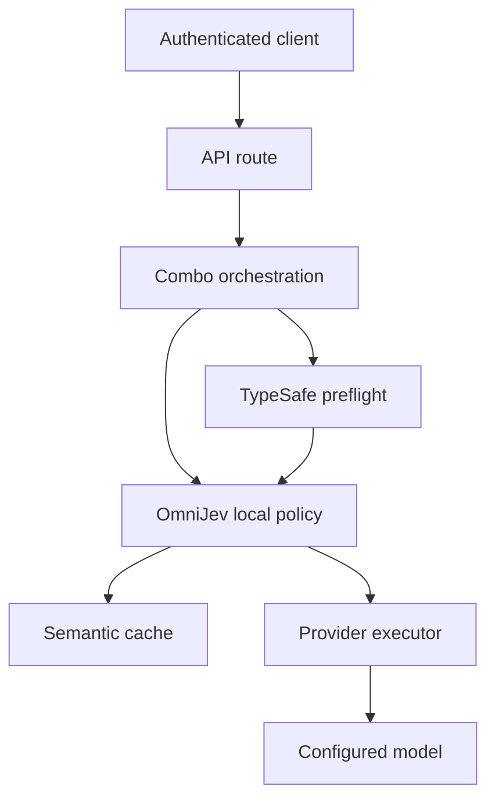

# OmniJev threat model

## Executive summary

OmniJev keeps the decision layer bounded and validated, while ordinary application code
retains routing, authorization, and model execution. The highest residual risk is
intentional prompt disclosure to `api.typesafe.ai` when `jev-api` is enabled; a secondary
risk is external-call amplification because each eligible request can perform one
preflight. The default local methodology does not make a network call.

## Scope and assumptions

- In scope: `open-sse/services/autoCombo/omniJev.ts`, combo integration in
  `open-sse/services/combo.ts`, auto ordering in
  `open-sse/services/combo/resolveAutoStrategy.ts` and
  `open-sse/services/combo/targetResolution.ts`, configuration schemas/UI/MCP, and
  semantic-cache conversation material.
- Runtime assumption: OmniRoute is an authenticated multi-provider HTTP proxy. Client
  prompts may contain confidential business data or personal data.
- Operator assumption: `jev-api` is an explicit operator choice and
  `TYPESAFE_API_KEY` is configured only in the server environment.
- The TypeSafe service is an external trust zone. This report does not assess its
  internal retention, training, residency, or contractual controls.
- Out of scope: unrelated provider executors, existing database migration drift, and
  the pre-existing `.source/` changes in the working tree.

Open questions that would change the ranking: whether production tenants may enable
`jev-api` independently; whether prompts are contractually allowed to leave the
deployment region; and whether a per-tenant external-call budget already exists outside
the OmniJev path.

## System model

### Primary components

- Client request and authenticated API route.
- Combo orchestration and auto candidate eligibility.
- OmniJev local packet builder or optional TypeSafe preflight.
- Existing provider executor and response stream.
- Semantic cache, whose signature includes the enriched conversation material.

### Data flows and trust boundaries

- Client -> API/combo: prompt, tools, output constraints, and model request over HTTP;
  route authentication, API-key policy, request schemas, and existing prompt guards
  apply before normal execution.
- Combo -> OmniJev: request-scoped body; `prepareOmniJev` reads only bounded user text,
  while `injectOmniJev` returns an immutable shallow copy and does not copy credentials
  into the prompt.
- OmniJev -> TypeSafe: only in explicit `jev-api` mode; the latest user text is sent
  over HTTPS to the fixed `https://api.typesafe.ai/v1/systemone` endpoint with the
  server-only `TYPESAFE_API_KEY` bearer credential. The response is bounded and parsed
  with strict Zod schemas.
- OmniJev -> combo executor: a methodology packet controls prompt templates and
  same-family ordering only; it cannot authorize tools, alter credentials, or execute
  actions. Existing circuit-breaker, quota, and authorization gates remain in charge.
- Enriched request -> semantic cache: native instruction fields are included in cache
  conversation material, preventing a pre-enrichment response from being reused as an
  enriched response.

#### Diagram

## Assets and security objectives

| Asset | Why it matters | Security objective (C/I/A) |
|---|---|---|
| Client prompts and tool constraints | May contain secrets, PII, source code, or business data | C/I |
| `TYPESAFE_API_KEY` | Authorizes external decision requests and may incur cost | C/I |
| Combo strategy/configuration | Controls model selection, fallback, and external disclosure | I/A |
| Provider credentials and executor authorization | Grants access to upstream models and accounts | C/I |
| Cache signatures and responses | Can expose or incorrectly reuse tenant data | C/I |
| Routing availability | Failed orchestration can deny generation or amplify cost | A |

## Attacker model

### Capabilities

- Authenticated client able to submit ordinary prompts and request supported combo
  strategies.
- A client able to place adversarial instructions in prompt text to influence a bounded
  classifier's task choice or complexity score.
- An authorized operator or MCP caller with combo-write permission who can enable
  `jev-api` for a combo.

### Non-capabilities

- The prompt classifier cannot directly execute tools or change authorization state.
- A client cannot set `TYPESAFE_API_KEY` through the combo JSON; the schema rejects an
  embedded key and the implementation reads the environment only.
- This model does not assume host compromise, access to server environment variables,
  or control of the fixed TypeSafe DNS/HTTPS endpoint.

## Entry points and attack surfaces

| Surface | How reached | Trust boundary | Notes | Evidence |
|---|---|---|---|---|
| OmniJev combo request | Authenticated chat/response combo | Client -> server | Enrichment runs before target attempts | `open-sse/services/combo.ts:handleComboChat` |
| TypeSafe preflight | `mode: "jev-api"` | Server -> external service | Fixed URL, bearer env key, timeout, bounded body | `open-sse/services/autoCombo/omniJev.ts:prepareOmniJev` |
| Typed answer parser | External JSON response | External service -> server | Strict enums, distributions, score range, confidence threshold | `open-sse/services/autoCombo/omniJev.ts:validateJevAnswers` |
| Strategy configuration | Dashboard or MCP combo write | Operator/MCP -> config | Raw API keys are rejected; MCP tool requires combo-write scope | `src/shared/validation/omniJev.ts`, `open-sse/mcp-server/schemas/tools.ts:setRoutingStrategyInput` |
| Similar-model fallback | Provider failure/circuit state | Orchestrator -> executor | Only eligible targets are reordered; blocked targets are not resurrected | `open-sse/services/combo/resolveAutoStrategy.ts` |

## Top abuse paths

1. An authorized operator enables `jev-api` -> a tenant sends confidential prompt text ->
   OmniJev forwards the latest user text externally -> external retention/residency
   controls become part of the tenant's confidentiality boundary.
2. An authenticated client sends many eligible requests -> each request triggers a
   preflight -> external latency and quota are consumed -> the proxy or TypeSafe service
   becomes an amplification bottleneck.
3. A client embeds classifier-directed text -> the typed classifier chooses an allowed
   task/complexity value -> deterministic templates change guidance or ordering -> answer
   quality degrades, but no tool authorization is granted.
4. A malformed or malicious external answer contains unknown options or distributions ->
   strict validation rejects it -> local methodology fallback continues without using
   untrusted raw output.
5. A provider fails after enrichment -> eligible same-family targets are attempted in
   order -> circuit/quota filters prevent blocked targets from being reintroduced -> the
   request returns a controlled failure if no eligible target remains.

## Threat model table

| Threat ID | Threat source | Prerequisites | Threat action | Impact | Impacted assets | Existing controls (evidence) | Gaps | Recommended mitigations | Detection ideas | Likelihood | Impact severity | Priority |
|---|---|---|---|---|---|---|---|---|---|---|---|---|
| TM-001 | External disclosure | Operator enables `jev-api`; prompt contains sensitive data | Forward prompt text to external TypeSafe boundary | Confidentiality loss or residency/compliance violation | Prompts, PII, source code | Explicit mode; local default; latest text only; no raw prompt logging | No tenant-level consent, redaction, residency gate, or external-retention policy in OmniJev | Add policy gate for allowed tenants/data classes, optional PII redaction, and clear audit metadata before enabling external mode | Count external preflights by tenant/combo; alert on unexpected `jev-api` use | Medium | High | high |
| TM-002 | Authenticated client or tenant workload | OmniJev `jev-api` enabled and many eligible requests | Cause one external preflight per request | Cost, latency, or availability degradation | Routing availability, external quota, billing | Timeout; one batched request; existing upstream/API rate controls | No OmniJev-specific per-key budget, concurrency cap, or cache for equivalent classifications | Add per-tenant preflight quota/concurrency and fail to local methodology when exhausted | Track preflight count, timeout rate, latency, and fallback reason by combo/key | Medium | Medium | medium |
| TM-003 | Adversarial prompt author | Client can control latest user text | Manipulate bounded classification to alter guidance/order | Quality degradation or less suitable fallback; no direct privilege escalation | Routing integrity, response quality | State is data; closed `choice`/`score`/`noul`; confidence/distribution checks; deterministic policy code | No adversarial classifier evaluation or prompt-content redaction | Add regression corpus for instruction injection and monitor task-distribution drift | Log packet provenance/task/threshold result without prompt text | Medium | Low | low |
| TM-004 | Malformed external service response | `jev-api` enabled; external response is malformed or contradictory | Bypass typed decision assumptions | Incorrect routing if parser is weakened; current path safely falls back | Routing integrity, availability | Strict Zod schemas, exact probability sums, weighted score check, confidence gate, bounded response reader | Schema changes at provider require contract tests | Keep contract fixtures and fail closed to local bounded methodology | Count invalid-decision/unavailable/cancelled reasons | Low | Medium | low |
| TM-005 | Authorized config writer or compromised MCP credential | Combo-write permission | Enable external mode or alter fallback policy | Changes disclosure and routing behavior for future requests | Combo config, prompts, availability | Dashboard/MCP auth boundary; combo schema rejects embedded credentials; MCP tool has `write:combos` scope | No separate permission for external data egress | Require explicit egress permission/confirmation for `jev-api`; audit config diffs | Audit actor, combo, old/new mode, and scope | Low | High | medium |

## Criticality calibration

- **Critical:** provider credential exposure, cross-tenant prompt disclosure, or authz
  bypass enabling arbitrary tool/provider actions.
- **High:** unauthorized external prompt transfer, cross-tenant cache exposure, or
  routing integrity loss that changes access to protected providers.
- **Medium:** bounded external-call amplification, tenant-scoped availability loss, or
  configuration changes requiring an already authorized management principal.
- **Low:** classifier-driven quality drift or malformed third-party decisions that are
  rejected and fall back locally.

## Focus paths for security review

| Path | Why it matters | Related Threat IDs |
|---|---|---|
| `open-sse/services/autoCombo/omniJev.ts` | External boundary, secret use, bounded parser, prompt injection | TM-001, TM-002, TM-003, TM-004 |
| `open-sse/services/combo.ts` | Pre-generation ordering and request propagation | TM-003, TM-005 |
| `open-sse/services/combo/resolveAutoStrategy.ts` | Eligibility, circuit/quota filtering, fallback order | TM-003, TM-005 |
| `src/shared/validation/omniJev.ts` | Persisted configuration and secret exclusion | TM-001, TM-005 |
| `open-sse/mcp-server/schemas/tools.ts` | Management input and scope contract | TM-005 |
| `open-sse/mcp-server/tools/advancedTools.ts` | Runtime config mutation through MCP | TM-005 |
| `open-sse/handlers/chatCore/semanticCacheConversation.ts` | Cache isolation after prompt enrichment | TM-001, TM-003 |

## Notes on use

This is a focused pre-merge threat model for OmniJev, not a certification of the
external TypeSafe service or a claim that typed decisions eliminate hallucination. The
safe local fallback remains the default and is the required behavior for absent,
ambiguous, contradictory, timed-out, or unavailable external decisions.

Quality check: client, combo, external preflight, parser, configuration/MCP, fallback,
and cache entry points are covered; runtime and operator configuration are separated;
the deployment/data-residency questions above remain explicit assumptions.
