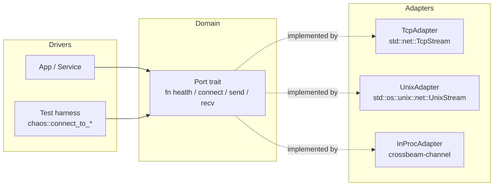
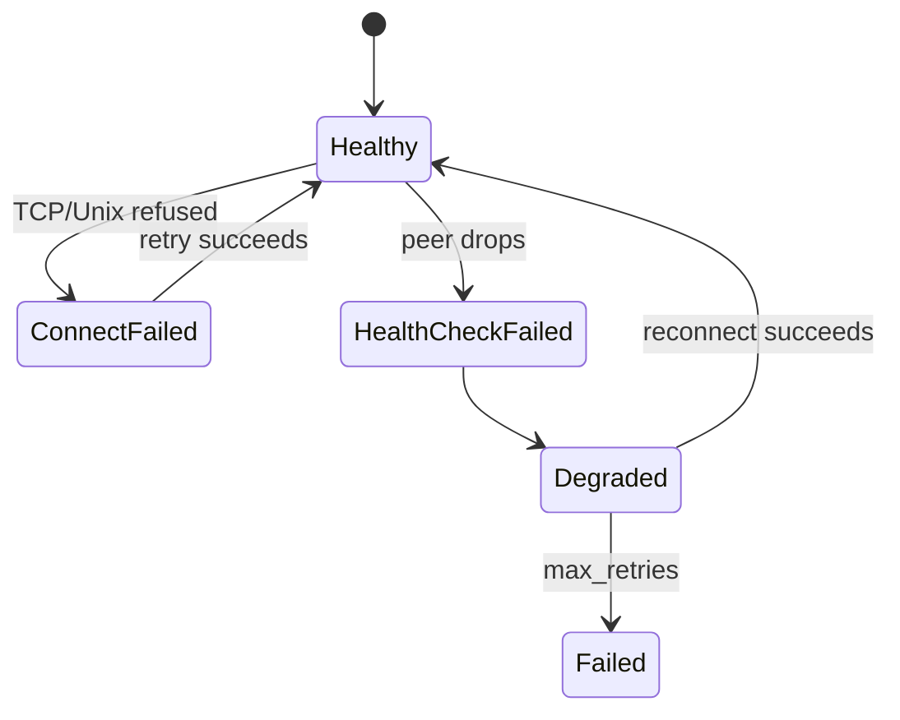
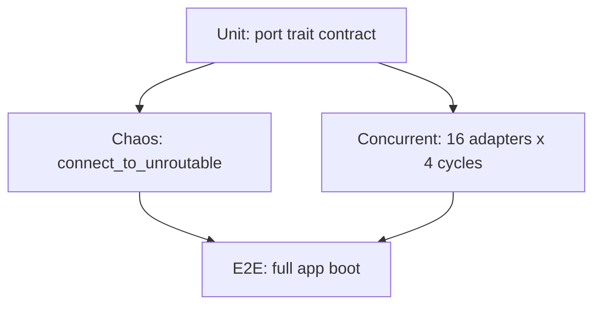

# Architecture (Hexagonal Port-Adapter)

```mermaid
flowchart LR
    subgraph Domain
        Port[Port trait\nfn health / connect / send / recv]
    end

    subgraph Adapters
        Tcp[TcpAdapter\nstd::net::TcpStream]
        Unix[UnixAdapter\nstd::os::unix::net::UnixStream]
        InProc[InProcAdapter\ncrossbeam-channel]
    end

    subgraph Drivers
        App[App / Service]
        Test[Test harness\nchaos::connect_to_*]
    end

    App --> Port
    Test --> Port
    Port -.implemented by.-> Tcp
    Port -.implemented by.-> Unix
    Port -.implemented by.-> InProc
```

## Error classification (L11 anti-fragility)

```mermaid
stateDiagram-v2
    [*] --> Healthy
    Healthy --> ConnectFailed: TCP/Unix refused
    Healthy --> HealthCheckFailed: peer drops
    ConnectFailed --> Healthy: retry succeeds
    HealthCheckFailed --> Degraded
    Degraded --> Healthy: reconnect succeeds
    Degraded --> Failed: max_retries
```

## Test pyramid

```mermaid
flowchart TB
    Unit[Unit: port trait contract] --> Chaos[Chaos: connect_to_unroutable]
    Unit --> Concurrent[Concurrent: 16 adapters x 4 cycles]
    Chaos --> E2E[E2E: full app boot]
    Concurrent --> E2E
```